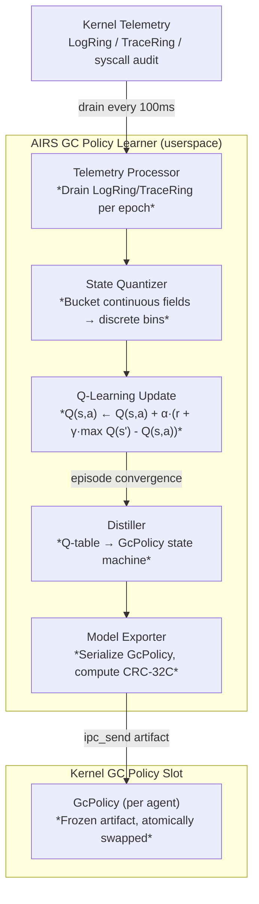
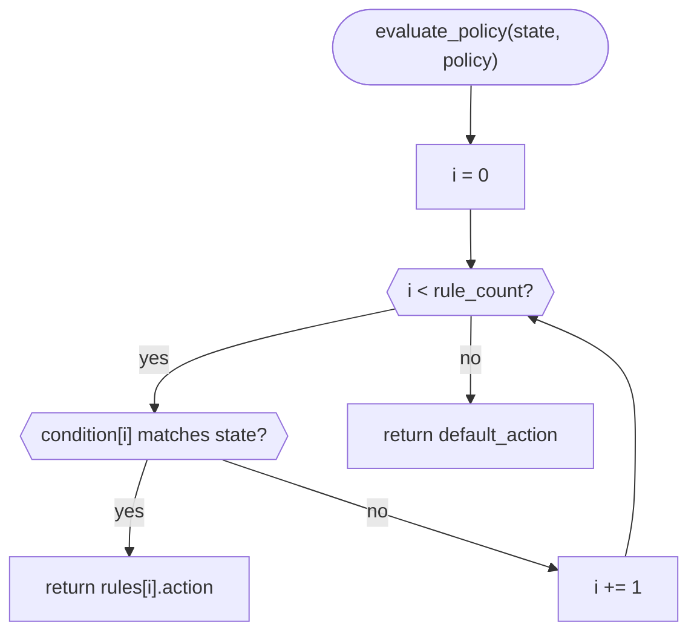

# AIOS Runtime Advisor: GC Scheduling Optimization

Part of: [runtime-advisor.md](../runtime-advisor.md) — AIRS Runtime Advisor
**Related:** [scheduling.md](./scheduling.md) — Learned scheduling, [allocation.md](./allocation.md) — Lifetime-aware allocation, [anomaly-detection.md](./anomaly-detection.md) — Anomaly detection

-----

## 7. AIRS RL-Based GC Policy Learning

### 7.1 Problem Statement

RustPython uses reference counting with a cycle collector. QuickJS-ng also uses reference counting with cycle collection. The timing of cycle collection affects both latency (pause duration) and memory footprint (deferred collection accumulates cyclic garbage). Optimal timing is workload-dependent in a way that static thresholds cannot capture:

- Compute-heavy batch agents benefit from infrequent large collections: fewer pauses amortize the GC cost over more work
- Latency-sensitive interactive agents require frequent small collections: long pauses break user-facing response time contracts
- Memory-constrained environments under kernel pressure need aggressive early collections regardless of the above

A single system-wide GC threshold satisfies none of these simultaneously. AIRS trains a per-agent GC policy using reinforcement learning, producing a `GcPolicy` state machine that is pushed to the kernel and evaluated in microseconds at each collection decision point.

This approach is grounded in the **Learned GC** result (MAPL'20), which demonstrated that tabular Q-learning for GC timing decisions achieves near-optimal collection schedules with a lightweight model suitable for kernel-internal inference. Where Learned GC operates on a single managed runtime with a fixed reward function, AIOS extends the design to four language runtimes with per-agent reward coefficients that reflect each agent's latency and throughput priorities.

### 7.2 RL State Representation

The GC policy learner observes a fixed-width state vector at each decision epoch (100ms intervals). All fields are scalar integers to keep the state space discrete and the Q-table tractable.

```rust
/// Observation vector for GC policy RL.
/// repr(C): stable layout for AIRS/kernel boundary; must be identical on both sides.
#[repr(C)]
pub struct GcState {
    /// Heap occupancy as percentage of the runtime's configured heap limit (0–100)
    pub heap_usage_percent: u8,
    /// Allocation rate in objects/sec, computed over a rolling 1-second window
    pub allocation_rate: u32,
    /// Milliseconds elapsed since the previous collection of any kind
    pub time_since_last_gc_ms: u32,
    /// Duration of the most recent GC pause in microseconds
    pub last_gc_pause_us: u32,
    /// Estimated count of cyclic garbage objects — runtime-reported heuristic
    pub cycle_count_estimate: u32,
    /// Kernel memory pressure level reported by the frame allocator
    /// 0=None, 1=Low, 2=Medium, 3=High, 4=Critical
    pub memory_pressure: u8,
    /// Agent context mode from the Context Engine
    /// 0=Active (foreground, user-facing), 1=Background, 2=Idle
    pub context_mode: u8,
    pub _padding: [u8; 1],
}
```

The state space is bounded: `heap_usage_percent` has 101 values, `memory_pressure` has 5, `context_mode` has 3, and the remaining fields are bucketed into 16 bins each during Q-table construction. The resulting discretized state space fits comfortably in a per-agent Q-table held in kernel heap memory.

### 7.3 RL Action Space

The action space is a four-element enumeration covering the full range of collection intensities available to the interpreters:

```rust
/// GC collection action selected by policy evaluation.
/// repr(u8): stable ABI; values are stored in GcRule.action fields.
#[repr(u8)]
pub enum GcAction {
    /// Defer collection — do nothing this epoch
    Defer = 0,
    /// Light collection — cycle detection only, no full heap walk
    CollectCycles = 1,
    /// Standard collection — cycles plus unreachable objects
    CollectStandard = 2,
    /// Aggressive collection — full heap walk with compaction where available
    CollectAggressive = 3,
}
```

### 7.4 Reward Function Design

AIRS computes a scalar reward per decision epoch. The reward balances three competing objectives:

```text
reward = -α × latency_penalty - β × memory_penalty + γ × throughput_bonus
```

Where:

- **`latency_penalty`** — GC pause duration in microseconds for the chosen action. Penalizes long stop-the-world pauses. Zero for `Defer`.
- **`memory_penalty`** — Heap usage above a target threshold (e.g., 70% target: penalty = max(0, heap_usage_percent - 70)). Penalizes memory waste from over-deferred collection.
- **`throughput_bonus`** — Agent work units completed per second in the epoch following the GC decision. Rewards productive execution time that is not consumed by GC.

The coefficients `(α, β, γ)` are per-agent and reflect priority class:

| Agent class | α (latency weight) | β (memory weight) | γ (throughput weight) |
|---|---|---|---|
| Interactive (RT class) | 2.0 | 0.5 | 1.0 |
| Normal | 1.0 | 1.0 | 1.0 |
| Batch (Background class) | 0.5 | 1.5 | 2.0 |
| System service | 1.0 | 2.0 | 0.5 |

AIRS reads the agent's `SchedulerClass` from the kernel telemetry to select the coefficient row. Coefficients are configurable per-agent via the agent manifest.

### 7.5 Training Pipeline

AIRS trains a tabular Q-learning model per agent. The state space is discrete and the action space has four elements, keeping Q-tables small enough for kernel-internal storage.



**Algorithm parameters:**

- Learning rate `α`: 0.1
- Discount factor `γ`: 0.95 (GC decisions have near-term consequences; heavy discounting is appropriate)
- Exploration: ε-greedy with ε decaying from 0.3 to 0.01 over the first 500 episodes
- Episode length: 100 decision epochs (10 seconds of wall time)
- Convergence criterion: Q-table Frobenius norm change < 0.01 over 50 consecutive episodes
- Typical convergence: 1000–5000 episodes (roughly 3–14 hours of agent operation)

After convergence, the Q-table is **distilled** into a `GcPolicy` state machine (see §8.1). The distillation step converts the value function into a prioritized rule list, discarding low-confidence or rarely-visited states to keep the policy small.

### 7.6 Research Context

**Learned GC (MAPL'20):** Tabular Q-learning for GC timing decisions with user-defined reward functions. Demonstrated that lightweight RL is sufficient for GC scheduling — the state space is small enough that tabular methods converge faster than neural approaches and produce interpretable policies. Direct design ancestor of AIOS GC policy learning.

**iGC (Knowledge-Based Systems 2025):** Three-layer hierarchical RL for SSD garbage collection. Reported 37% response time reduction and 46% p99 tail latency reduction. Demonstrates that RL-based collection scheduling generalizes beyond managed heaps. The hierarchical structure (global policy → partition policy → block selection) is cross-applicable to AIOS WAL trim and LSM compaction scheduling.

**Jade (EuroSys'24):** Sub-millisecond concurrent GC with group-wise object collection. Identifies that reclamation cycle length is the dominant latency contributor. The insight informs AIOS `CollectCycles` action design: cycle-only collection has a bounded, predictable pause proportional to cycle graph depth rather than total heap size.

**G1 predictive pause (JVM GC):** PID controller pattern for targeting GC pause duration. The PID feedback loop is translatable to AIOS GC policy threshold tuning: if observed pause durations consistently exceed the latency target, the policy learner reduces the `CollectAggressive` action probability in high-pressure states.

**ZGC/Shenandoah (2024–2025):** Sub-millisecond concurrent GC pauses (0.1–0.5ms) achieved through concurrent marking and load barriers. These represent the lower bound on GC pause latency for managed runtimes. AIOS targets this range for interactive agents using `CollectCycles` (cycle detection only, no stop-the-world heap walk).

-----

## 8. Runtime GC Hook Integration

### 8.1 GcPolicy State Machine

The distilled GC policy is a compact rule list stored in a `repr(C)` struct. Each rule specifies a condition over a single `GcState` field and the action to take when the condition holds. Rules are evaluated in priority order; the first match wins.

```rust
pub const GC_POLICY_MAGIC: u64 = 0x4149_4F53_4743_5000; // "AIOSGCP\0"
pub const MAX_GC_RULES: usize = 16;

/// Frozen GC policy artifact pushed by AIRS.
/// Evaluated by the kernel GC hook at each collection decision point.
#[repr(C)]
pub struct GcPolicy {
    pub header: FrozenArtifactHeader,
    /// Number of active rules in the rules array (≤ MAX_GC_RULES)
    pub rule_count: u8,
    /// Action taken when no rule matches
    pub default_action: GcAction,
    pub _padding: [u8; 6],
    /// Rules sorted by descending priority (index 0 = highest priority)
    pub rules: [GcRule; MAX_GC_RULES],
}

/// A single condition-action rule in a GcPolicy.
#[repr(C)]
pub struct GcRule {
    pub condition: GcCondition,
    pub action: GcAction,
    /// Higher values are checked first (range: 0–255)
    pub priority: u8,
    pub _padding: [u8; 2],
}

/// Threshold comparison on one field of GcState.
#[repr(C)]
pub struct GcCondition {
    pub field: GcStateField,
    pub comparator: Comparator,
    /// Value to compare against (same units as the GcState field)
    pub threshold: u32,
}

#[repr(u8)]
pub enum GcStateField {
    HeapUsagePercent = 0,
    AllocationRate = 1,
    TimeSinceLastGcMs = 2,
    LastGcPauseUs = 3,
    CycleCountEstimate = 4,
    MemoryPressure = 5,
    ContextMode = 6,
}

#[repr(u8)]
pub enum Comparator {
    Lt = 0,
    Le = 1,
    Eq = 2,
    Ge = 3,
    Gt = 4,
}
```

### 8.2 Policy Evaluation

Policy evaluation is a linear scan over the rule array. Rules are sorted by descending priority at distillation time, so evaluation terminates at the first matching rule. With `MAX_GC_RULES = 16`, evaluation is O(16) — constant time with no heap allocation.



The condition evaluation for a single rule reads one field from `GcState`, compares it to the threshold using the `Comparator`, and returns a boolean. No branches beyond the comparator switch; LLVM generates a compact dispatch sequence.

```rust
impl GcCondition {
    pub fn matches(&self, state: &GcState) -> bool {
        let value: u32 = match self.field {
            GcStateField::HeapUsagePercent  => state.heap_usage_percent as u32,
            GcStateField::AllocationRate    => state.allocation_rate,
            GcStateField::TimeSinceLastGcMs => state.time_since_last_gc_ms,
            GcStateField::LastGcPauseUs     => state.last_gc_pause_us,
            GcStateField::CycleCountEstimate => state.cycle_count_estimate,
            GcStateField::MemoryPressure    => state.memory_pressure as u32,
            GcStateField::ContextMode       => state.context_mode as u32,
        };
        match self.comparator {
            Comparator::Lt => value <  self.threshold,
            Comparator::Le => value <= self.threshold,
            Comparator::Eq => value == self.threshold,
            Comparator::Ge => value >= self.threshold,
            Comparator::Gt => value >  self.threshold,
        }
    }
}
```

### 8.3 Per-Interpreter Hook API

Each language runtime that performs garbage collection implements the `GcHook` trait. The kernel GC scheduler calls `should_collect` once per epoch to obtain the recommended action, then calls `collect` if the action is not `Defer`.

```rust
/// Implemented by each language runtime with a garbage collector.
/// Called by the kernel GC scheduler on the runtime's execution thread.
pub trait GcHook {
    /// Evaluate the policy and return the recommended action.
    /// Called every 100ms; must return within 10µs.
    fn should_collect(&self, state: &GcState, policy: &GcPolicy) -> GcAction;

    /// Execute the collection action recommended by the policy.
    /// Returns GcStats describing the observed pause and bytes reclaimed.
    fn collect(&mut self, action: GcAction) -> GcResult;

    /// Report current GC state for telemetry collection.
    /// Called by the telemetry subsystem to populate GcState fields.
    fn report_gc_stats(&self) -> GcStats;
}

/// Result returned by GcHook::collect.
pub struct GcResult {
    /// Actual pause duration in microseconds
    pub pause_us: u32,
    /// Bytes reclaimed in this collection
    pub bytes_reclaimed: u64,
    /// Action actually performed (may differ from requested if limited)
    pub action_performed: GcAction,
}

/// GC state snapshot for telemetry and training.
pub struct GcStats {
    pub heap_bytes_used: u64,
    pub heap_bytes_total: u64,
    pub allocation_rate_per_sec: u32,
    pub cycle_count_estimate: u32,
    pub last_pause_us: u32,
    pub collections_total: u64,
}
```

**Runtime-specific integration points:**

- **RustPython** — `GcHook` integrates with RustPython's cycle collector check interval. `CollectCycles` triggers `gc.collect(0)` (generation 0 only); `CollectStandard` triggers `gc.collect(1)`; `CollectAggressive` triggers `gc.collect(2)` (full generational walk).

- **QuickJS-ng** — `GcHook` wraps `JS_RunGC`. QuickJS does not expose generation-level control, so `CollectCycles` and `CollectStandard` both invoke a full `JS_RunGC`; `CollectAggressive` adds a subsequent heap compaction pass if the QuickJS-ng build supports it.

- **wasmtime** — Linear memory model with no managed GC. `GcHook` is a no-op stub that always returns `Defer` from `should_collect` and a zero-cost `GcResult` from `collect`.

- **Rust native** — No interpreter GC. `GcHook` is a no-op stub identical to the wasmtime case.

### 8.4 Default Policies (Without AIRS)

When no AIRS-pushed policy exists for an agent, the kernel uses a factory default `GcPolicy` compiled into the runtime. Default policies are conservative: they prefer memory safety over latency optimization and avoid aggressive collection in idle contexts.

**Python (RustPython) factory default:**

| Priority | Condition | Action |
|---|---|---|
| 10 | `memory_pressure >= High (3)` | `CollectAggressive` |
| 9 | `heap_usage_percent >= 90` | `CollectAggressive` |
| 8 | `heap_usage_percent >= 80` | `CollectStandard` |
| 7 | `cycle_count_estimate >= 10000` | `CollectCycles` |
| 6 | `time_since_last_gc_ms >= 10000` | `CollectCycles` |
| — | *(default)* | `Defer` |

**TypeScript (QuickJS-ng) factory default:**

| Priority | Condition | Action |
|---|---|---|
| 10 | `memory_pressure >= High (3)` | `CollectAggressive` |
| 9 | `heap_usage_percent >= 85` | `CollectStandard` |
| 8 | `allocation_rate <= 100` (idle detection) | `CollectCycles` |
| 7 | `time_since_last_gc_ms >= 8000` | `CollectCycles` |
| — | *(default)* | `Defer` |

**WASM / Rust native factory default:** Single rule — `Defer` always. `rule_count = 0`, `default_action = Defer`.

### 8.5 Fallback Behavior

The fallback hierarchy ensures correctness at every level of AIRS availability:

| Condition | GC behavior |
|---|---|
| AIRS never started | Factory default policies (compiled in, always valid) |
| AIRS running, no model converged yet | Factory default policies |
| AIRS pushed a policy, then crashed | Last-pushed policy retained (atomic slot — not cleared on AIRS exit) |
| AIRS pushed an invalid artifact | Rejected at validation; old policy retained; AIRS receives `ArtifactRejected` reply |
| `memory_pressure >= High` | Kernel overrides policy: forces `CollectAggressive` regardless of rule evaluation |
| `memory_pressure == Critical` | Kernel OOM path: `CollectAggressive` on all runtimes, then frame reclaim |

The memory pressure override is unconditional. No policy — including AIRS-pushed policies — can defer collection when the kernel frame allocator signals `High` or `Critical` pressure. This invariant is enforced in the kernel GC scheduler, not in `GcHook` implementations.

**Policy validation on receipt:** When the kernel receives a `GcPolicy` artifact from AIRS over IPC, it verifies:

1. `header.magic == GC_POLICY_MAGIC`
2. `header.version` is within the supported range
3. `header.checksum` matches CRC-32C of the payload bytes following the header
4. `rule_count <= MAX_GC_RULES`
5. All `GcRule.condition.field` values are valid `GcStateField` variants
6. All `GcRule.action` values are valid `GcAction` variants

Any failure causes the artifact to be rejected with an `ArtifactRejected` IPC reply. The existing policy slot is unchanged.

-----

## Cross-References

| Topic | Document | Section |
|---|---|---|
| RustPython cycle collector | [language-ecosystem/runtimes.md](../../project/language-ecosystem/runtimes.md) | §3 Python/RustPython |
| QuickJS-ng reference counting | [language-ecosystem/runtimes.md](../../project/language-ecosystem/runtimes.md) | §4 TypeScript/QuickJS-ng |
| RuntimeAdapter trait | [language-ecosystem/integration.md](../../project/language-ecosystem/integration.md) | §8 Key decisions |
| FrozenArtifactHeader | [runtime-advisor.md](../runtime-advisor.md) | §2 Architecture |
| Artifact update protocol | [runtime-advisor.md](../runtime-advisor.md) | §2 Frozen Artifact Update Protocol |
| Kernel memory pressure levels | [memory/reclamation.md](../../kernel/memory/reclamation.md) | §8 Pressure/OOM |
| AIRS telemetry sources | [airs/lifecycle-and-data.md](../airs/lifecycle-and-data.md) | §7 Data Model |
| Learned scheduling weights | [scheduling.md](./scheduling.md) | §3–§4 |
| Lifetime-aware allocation | [allocation.md](./allocation.md) | §5–§6 |
