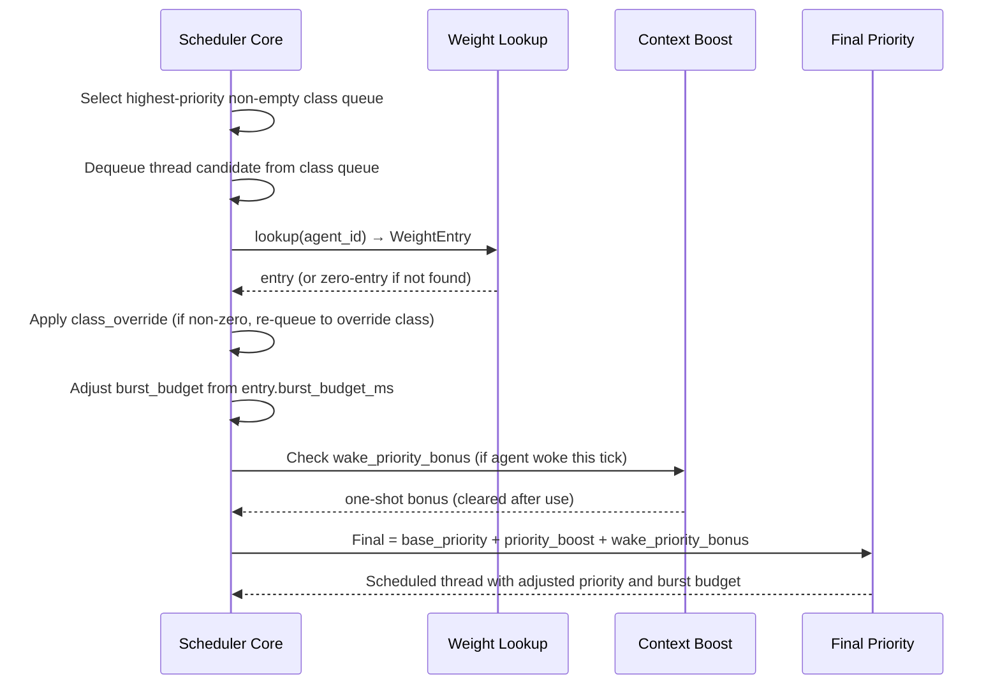
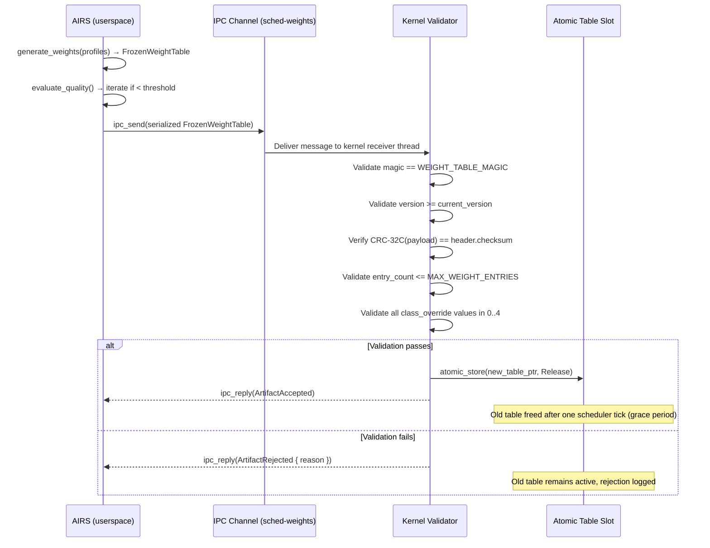

# AIOS Runtime Advisor: Learned Scheduling

Part of: [runtime-advisor.md](../runtime-advisor.md) — AIRS Runtime Advisor
**Related:** [allocation.md](./allocation.md) — Lifetime-aware allocation, [gc-scheduling.md](./gc-scheduling.md) — GC scheduling, [anomaly-detection.md](./anomaly-detection.md) — Anomaly detection

-----

## 3. AIRS Scheduling Learning Frontend

The scheduling learning frontend runs in AIRS privileged userspace. It continuously ingests kernel telemetry, simulates optimal scheduling decisions against historical traces, and distills the results into frozen weight tables that the kernel can apply at microsecond granularity. Training complexity stays in AIRS; enforcement complexity stays in the kernel.

### 3.1 Workload Profiling

AIRS collects per-agent workload profiles from two kernel telemetry sources: the `LogRing` (256 entries per core, 64 bytes each) and the `TraceRing` (4096 entries per core, 32 bytes each). Both rings are readable by AIRS via a capability-gated drain channel; the kernel never exposes raw ring memory to userspace.

Every 60 seconds, AIRS aggregates the drained records into a per-agent profile:

```rust
/// Per-agent workload profile aggregated over a 60-second window.
/// repr(C) for stable transfer across the AIRS/kernel telemetry boundary.
#[repr(C)]
pub struct AgentWorkloadProfile {
    /// Agent identifier (matches WeightEntry.agent_id)
    pub agent_id: u64,
    /// Runtime type executing this agent
    pub runtime_type: RuntimeType,
    /// Wall-clock timestamp of the aggregation window start (kernel ticks)
    pub window_start: u64,
    /// Wall-clock timestamp of the aggregation window end (kernel ticks)
    pub window_end: u64,

    // --- CPU time histogram ---
    /// Histogram buckets: time slices spent in each duration band (µs)
    /// Bands: [0-1, 1-4, 4-16, 16-64, 64-256, 256-1024, 1024-4096, >4096]
    pub cpu_slice_histogram: [u32; 8],
    /// Total CPU ticks consumed in window
    pub cpu_ticks_total: u64,

    // --- IPC pattern ---
    /// Number of ipc_call invocations (synchronous, waits for reply)
    pub ipc_calls: u32,
    /// Number of ipc_send invocations (asynchronous, fire-and-forget)
    pub ipc_sends: u32,
    /// Number of ipc_recv invocations (waiting for message)
    pub ipc_recvs: u32,
    /// Fraction of IPC operations that arrived in bursts (>4 within 1ms)
    /// Fixed-point: 0 = 0%, 65535 = 100%
    pub ipc_burst_fraction: u16,

    // --- I/O wait ---
    /// Fraction of wall time spent blocked on I/O (storage + network)
    /// Fixed-point: 0 = 0%, 65535 = 100%
    pub io_wait_fraction: u16,
    /// Number of storage read operations
    pub storage_reads: u32,
    /// Number of storage write operations
    pub storage_writes: u32,

    // --- Wake-to-run latency distribution ---
    /// Histogram: ticks between unblock event and actual scheduling
    /// Bands: [0-1, 1-2, 2-4, 4-8, 8-16, 16-32, 32-64, >64] ticks (1 tick = 1ms)
    pub wake_latency_histogram: [u32; 8],
    /// Minimum observed wake-to-run latency (ticks)
    pub wake_latency_min: u16,
    /// 99th-percentile wake-to-run latency (ticks)
    pub wake_latency_p99: u16,

    // --- Scheduling class ---
    /// Observed scheduler class from kernel (RT=1, Interactive=2, Normal=3, Idle=4)
    pub observed_class: u8,
    /// Number of class promotions in window (e.g., Normal → Interactive)
    pub class_promotions: u8,
    /// Number of class demotions in window
    pub class_demotions: u8,

    pub _padding: [u8; 5],
}
```

**Per-runtime behavioral signatures.** The four runtimes have distinct telemetry fingerprints that influence how AIRS interprets profiles:

| Runtime | CPU histogram shape | IPC pattern | I/O wait fraction | Wake latency |
|---|---|---|---|---|
| Rust (native) | Varies: compute-heavy peaks or I/O-dominated | Variable | Low–high (agent-specific) | Tight (0–2 ticks) |
| Python (RustPython) | Medium-duration slices; GIL contention broadens histogram | Moderate; sequential call patterns | Moderate–high | Moderate (2–8 ticks) |
| TypeScript (QuickJS-ng) | Short-burst slices; event-loop yields frequently | High burst fraction; many fire-and-forget sends | Low (network I/O latency absorbed in event loop) | Very tight (0–1 tick) |
| WASM (wasmtime) | Long steady compute slices; fuel-limited preemption | Low (WASM agents tend to call out, not wait) | Low–moderate | Moderate (fuel exhaustion adds overhead) |

These signatures inform the SRPT simulation: an agent classified as TypeScript/event-driven receives a different simulation strategy than a Rust/compute-bound agent.

### 3.2 SRPT Simulation Engine

AIRS runs an offline discrete-event simulation of Shortest Remaining Processing Time (SRPT) scheduling over recent per-agent workload traces. SRPT is an optimal single-machine scheduling discipline for minimizing average completion time, but it requires remaining processing time estimates — which AIRS derives from the workload profiles.

The simulation is **offline** (runs in AIRS userspace, not in the kernel) and **lightweight** (discrete-event model, not full kernel replay). It operates on the last N scheduling events per agent, where N = 1000 by default (approximately 16 minutes at 1 kHz with one event per tick).

```text
Input:  last N scheduling events per agent (from TraceRing drain)
        current AgentWorkloadProfile for each agent
        current scheduler class assignments

Simulation:
  1. Build event queue from scheduling traces (sorted by timestamp)
  2. For each event: assign completion-time estimate from profile histogram
  3. Run SRPT simulation: at each scheduling point, pick the agent with
     the smallest estimated remaining processing time
  4. Record: for each agent, what priority and burst budget would SRPT
     have assigned at each decision point?

Output: per-agent optimal weight assignments that minimize average
        completion time over the trace window
```

The simulation uses a fixed-point completion-time estimator derived from the CPU slice histogram: the estimator assumes the agent's next slice duration is sampled from the histogram distribution. The SRPT tie-breaking rule is agent_id ascending (deterministic).

**Why SRPT?** ALPS (USENIX ATC'24) demonstrated that simulating SRPT over recent traces and encoding the results as scheduler weights achieves 57.2% latency reduction versus CFS. AIOS adapts this insight: frozen weight tables are the AIOS equivalent of ALPS's eBPF program output.

### 3.3 Weight Generation

The `SchedulingWeightProvider` trait defines the interface for translating simulation output into frozen weight tables:

```rust
/// Generates frozen scheduling weight tables from per-agent profiles.
/// Runs in AIRS userspace; output is pushed to the kernel via IPC.
pub trait SchedulingWeightProvider {
    /// Generate a FrozenWeightTable from a set of current agent profiles.
    /// Called after each 60-second aggregation window completes.
    fn generate_weights(
        &self,
        profiles: &[AgentWorkloadProfile],
    ) -> FrozenWeightTable;

    /// Evaluate the quality of a weight table against actual scheduling traces.
    /// Returns a score in [0.0, 1.0] where 1.0 = optimal (matches SRPT ideal).
    /// Used for iterative refinement: AIRS loops generate → evaluate → adjust
    /// until quality exceeds WEIGHT_QUALITY_THRESHOLD.
    fn evaluate_quality(
        &self,
        weights: &FrozenWeightTable,
        traces: &[SchedulingTrace],
    ) -> f32;
}

/// Quality threshold for weight table acceptance.
/// AIRS iterates generate → evaluate until this score is reached or
/// MAX_WEIGHT_ITERATIONS is exhausted, whichever comes first.
pub const WEIGHT_QUALITY_THRESHOLD: f32 = 0.85;
pub const MAX_WEIGHT_ITERATIONS: u32 = 8;
```

The weight table covers four dimensions per agent:

- **Priority boost magnitude** (`priority_boost: i8`): adjusts the agent's effective priority within its scheduler class. Range -4..+4. Positive values bias the agent toward earlier scheduling; negative values defer it.
- **Burst budget** (`burst_budget_ms: u16`): maximum continuous CPU time before preemption. TypeScript/event-loop agents receive small budgets (2–4ms); Rust/compute agents receive larger budgets (20–50ms).
- **Class promotion/demotion thresholds**: encoded as `class_override` — when AIRS determines an agent is misclassified (e.g., an Interactive agent behaving like RT), it sets a class override.
- **Wake priority bonus** (`wake_priority_bonus: u8`): 0..15 bonus applied when the agent wakes from blocked state. High-bonus agents preempt running Normal threads on wake; zero-bonus agents queue normally.

The generate → evaluate → iterate loop refines these four dimensions until the simulated schedule quality exceeds `WEIGHT_QUALITY_THRESHOLD`. If the quality ceiling is not reached within `MAX_WEIGHT_ITERATIONS`, AIRS pushes the best-so-far table and logs a diagnostic.

### 3.4 Research Context

The AIRS scheduling learner draws from a convergent body of systems research:

**ALPS** (USENIX ATC'24): Demonstrated that decoupling scheduling policy learning from kernel enforcement — learning offline, enforcing via eBPF weights — achieves 57.2% average completion time reduction versus CFS at production workloads. AIOS adapts this architecture: AIRS is the learning frontend, frozen weight tables replace eBPF programs, and `pick_next_thread()` is the enforcement backend.

**sched_ext** (Linux 6.12+): BPF extensible scheduler framework deployed by Meta (Twitch latency) and Google (datacenter throughput) at scale. Implementations include `scx_rustland` (Rust userspace policy) and `scx_lavd` (latency-aware virtual deadline). Validates that scheduler policy extension is production-viable. AIOS's frozen weight table approach is architecturally similar but simpler: no BPF verifier required, no JIT compilation, just a validated fixed-size table.

**ghOSt** (Google, SOSP'21): Delegates scheduling decisions to a userspace agent over shared memory. Achieves microsecond-scale policy decisions for Google's fleet schedulers. Validates the "train in userspace, enforce in kernel" model that AIRS uses. Key difference: ghOSt delegates per-decision control; AIRS delegates per-period weight updates. AIRS's approach has lower communication overhead and degrades gracefully when AIRS is unavailable.

**EEVDF** (Linux 6.6+): Eligible Earliest Virtual Deadline First, the CFS replacement. Deadline-based scheduling with per-entity virtual time tracking. AIOS's `priority_boost` field directly maps to EEVDF-style deadline adjustment: positive boost → earlier virtual deadline → earlier scheduling.

**MobiRL** (ACM TACO'24): Applied DDPG (Deep Deterministic Policy Gradient) for CPU/GPU frequency scheduling, achieving 42.8% power reduction with <3ms adaptation latency. Relevant to AIOS's future power-aware scheduling direction: the `burst_budget_ms` field can be linked to frequency scaling hints, with AIRS eventually acting as the RL policy source for combined scheduling + frequency decisions.

**OS-R1** (2025): LLM agent combined with RL for kernel configuration tuning. Demonstrates that LLM-in-the-loop kernel optimization is viable for non-latency-critical paths. Validates AIRS's use of LLM-based cross-agent semantic analysis (§9) as a complement to per-agent RL-based scheduling optimization.

-----

## 4. Kernel Scheduler Backend

The kernel scheduler backend is the enforcement half of the two-tier architecture. It consumes frozen weight tables pushed by AIRS and applies them during `pick_next_thread()`. All enforcement paths are `no_std`, allocation-free, and execute in microseconds.

### 4.1 Frozen Weight Table Format

```rust
/// Magic identifying a FrozenWeightTable artifact.
/// ASCII: "AIOSSWT\0"
pub const WEIGHT_TABLE_MAGIC: u64 = 0x4149_4F53_5357_5400;

/// Maximum number of per-agent weight entries in a single table.
pub const MAX_WEIGHT_ENTRIES: usize = 64;

/// Frozen scheduling weight table pushed by AIRS to the kernel.
/// repr(C) for stable ABI across the AIRS/kernel IPC boundary.
/// Total size: 32 (header) + 8 + 64×16 = 1064 bytes.
#[repr(C)]
pub struct FrozenWeightTable {
    /// Common artifact envelope (magic, version, checksum, target)
    pub header: FrozenArtifactHeader,
    /// Number of valid entries in `entries` (≤ MAX_WEIGHT_ENTRIES)
    pub entry_count: u32,
    pub _padding: u32,
    /// Per-agent weight entries, indexed 0..entry_count
    pub entries: [WeightEntry; MAX_WEIGHT_ENTRIES],
}

/// Per-agent scheduling weight entry.
/// 16 bytes, one cache-line-friendly entry per agent.
#[repr(C)]
pub struct WeightEntry {
    /// Agent identifier. Matches AgentWorkloadProfile.agent_id.
    /// 0 = invalid / unused slot.
    pub agent_id: u64,
    /// Priority adjustment within scheduler class.
    /// Range: -4 (defer) to +4 (advance). 0 = no change.
    pub priority_boost: i8,
    /// Maximum continuous CPU time before preemption (milliseconds).
    /// 0 = use class default (RT=4ms, Interactive=10ms, Normal=50ms, Idle=50ms).
    pub burst_budget_ms: u16,
    /// Priority bonus applied when agent wakes from blocked state.
    /// Range: 0..15. Applied as a one-shot boost; cleared after one scheduling decision.
    pub wake_priority_bonus: u8,
    /// Scheduler class override.
    /// 0 = no override (use manifest default)
    /// 1 = RT, 2 = Interactive, 3 = Normal, 4 = Idle
    pub class_override: u8,
    pub _reserved: [u8; 2],
}
```

Size breakdown:

| Field | Size |
|---|---|
| `FrozenArtifactHeader` | 32 bytes |
| `entry_count` + `_padding` | 8 bytes |
| `entries` (64 × 16 bytes) | 1024 bytes |
| **Total** | **1064 bytes** |

At 1064 bytes, the table requires three 512-byte IPC message payloads (fragmented by the IPC layer) or one 4096-byte page allocation from the slab allocator. The three-message transfer completes atomically from the kernel's perspective — the scheduler reads only after the final fragment arrives and the atomic pointer swap occurs.

### 4.2 Integration with pick_next_thread()

The kernel's scheduler consults the frozen weight table after normal class selection. The lookup is O(1) via a direct-mapped hash index computed from `agent_id`:

```text
hash_index = agent_id % MAX_WEIGHT_ENTRIES
```

If `entries[hash_index].agent_id != agent_id`, the agent has no weight entry and scheduling proceeds with factory defaults. No secondary probing is performed; AIRS is responsible for resolving hash collisions when generating the table (by leaving colliding agents at factory defaults and logging a diagnostic).

Weight application order within `pick_next_thread()`:



The `priority_boost` field adjusts within-class ordering but never moves a thread to a higher scheduler class unless `class_override` is set. This preserves the isolation guarantee: RT agents cannot be demoted by a malformed weight table.

**Burst budget enforcement.** When `burst_budget_ms` is non-zero, the per-thread timer deadline is set to `min(class_default_ms, burst_budget_ms)` at scheduling time. This integrates with the ARM Generic Timer preemption path in `timer_tick_handler`: the timer fires at the budget expiry and calls `check_preemption()`.

### 4.3 Update Protocol

AIRS pushes updated weight tables via a dedicated IPC channel registered as `b"sched-weights"` in the service manager. The kernel side holds the receive end; AIRS holds the send end.



**Atomic swap mechanics.** The active weight table pointer is stored as an `AtomicPtr<FrozenWeightTable>`. The kernel validator writes the new pointer with `Release` ordering; `pick_next_thread()` reads with `Acquire` ordering. This single-word atomic exchange is safe on AIOS's Inner Shareable + Cacheable memory (Phase 2 M8+). The old table is freed to the slab allocator after one full scheduler tick to guarantee no in-flight `pick_next_thread()` call holds a reference to it.

**Update frequency.** The nominal update cadence is every 60 seconds, synchronized with the aggregation window. AIRS triggers a burst-mode update — immediate re-generation and push — when the workload change detector observes a significant shift (more than 20% change in the dominant histogram bucket for any agent within a 10-second window).

### 4.4 Fallback Behavior

The kernel scheduling backend is designed to be correct and useful without AIRS. The fallback hierarchy is:

| Condition | Behavior |
|---|---|
| AIRS never started, no table pushed | All weight lookups return zero-entry. Class and burst budget from thread manifest. `priority_boost = 0`, `wake_priority_bonus = 0`. |
| AIRS crashed or restarted | Last-pushed table remains active. No expiry timer; the table does not become invalid with age. |
| AIRS pushes invalid artifact | Validation fails. Rejection logged to `LogRing` with `Subsystem::Sched`. Previous table retained. |
| Hash collision in table | Colliding agent gets factory defaults. AIRS logs the collision in the quality evaluation diagnostic. |
| Weight table requests RT override for non-RT capability | Kernel validation rejects the entry: `class_override = RT` requires the agent to hold `Capability::RealtimeScheduling`. Entry is silently set to zero for that agent. |

The kernel never blocks, sleeps, or spins waiting for AIRS to produce a weight table. The `sched-weights` IPC channel is non-blocking on the kernel receive path: if no message is waiting, the kernel receiver returns immediately and the existing table remains active.

**Security invariant.** A weight table entry cannot elevate an agent beyond its manifest-declared scheduling class unless the agent holds the `Capability::RealtimeScheduling` capability. This enforcement happens during validation (the entry is zeroed for that agent before the table is installed), not at lookup time. A compromised AIRS that pushes malformed tables cannot escalate agent priorities beyond capability boundaries.

-----

## Cross-References

| Topic | Document | Sections |
|---|---|---|
| Base scheduler architecture | [scheduler.md](../../kernel/scheduler.md) | §3 RunQueue / `pick_next()`, §16 AIRS integration hooks |
| Scheduler classes and timeslices | [scheduler.md](../../kernel/scheduler.md) | §3.1 Class definitions (RT/Interactive/Normal/Idle) |
| Timer preemption path | [hal.md](../../kernel/hal.md) | §4.2 ARM Generic Timer, `timer_tick_handler` |
| IPC channel mechanics | [ipc.md](../../kernel/ipc.md) | §3 Channel table, §5 Service registration |
| Capability enforcement | [model/capabilities.md](../../security/model/capabilities.md) | §3.1 Token lifecycle, §3.4 Delegation |
| FrozenArtifactHeader | [runtime-advisor.md](../runtime-advisor.md) | §2 Frozen Artifact Update Protocol |
| Observability (LogRing/TraceRing) | [observability.md](../../kernel/observability.md) | §2 LogRing, §3 TraceRing |
| Language runtime behavioral signatures | [language-ecosystem/ai.md](../../project/language-ecosystem/ai.md) | §13.1 AIRS Runtime Advisor scheduling |
| Lifetime-aware allocation (companion) | [allocation.md](./allocation.md) | §5–6 |
| GC scheduling optimization (companion) | [gc-scheduling.md](./gc-scheduling.md) | §7–8 |
| Anomaly detection (companion) | [anomaly-detection.md](./anomaly-detection.md) | §9–10 |
