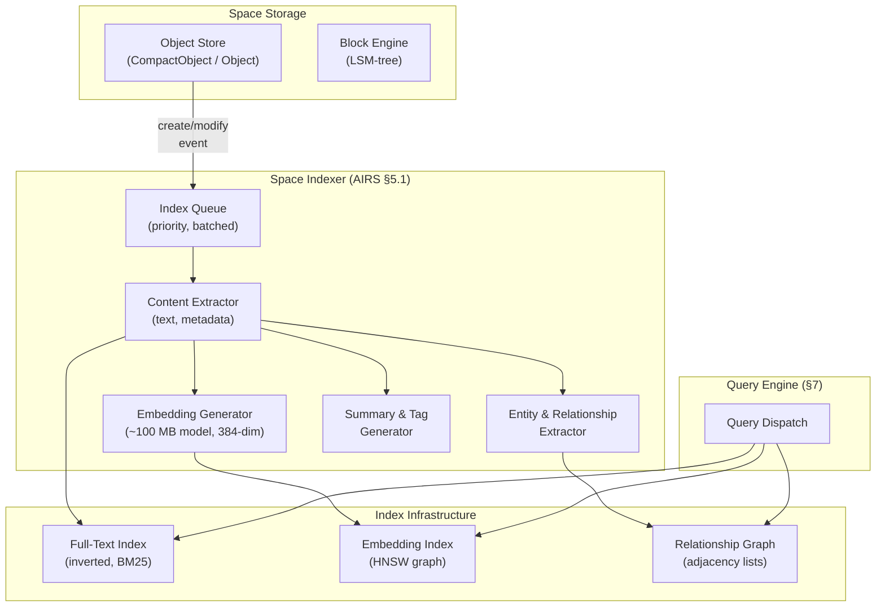

# AIOS Space Indexer

**Parent document:** [airs.md](./airs.md) — AI Runtime Service (§5.1)
**Related:** [spaces/query-engine.md](../storage/spaces/query-engine.md) — Query dispatch & index structures, [spaces/data-structures.md](../storage/spaces/data-structures.md) — CompactObject & promotion, [airs/intelligence-services.md](./airs/intelligence-services.md) — All AIRS intelligence services, [airs/model-registry.md](./airs/model-registry.md) — Embedding model loading, [airs/security.md](./airs/security.md) — Resource path isolation

-----

## 1. Core Insight

Operating systems have always indexed files — Spotlight, Windows Search, Tracker — but they index *metadata*: file names, dates, sizes, MIME types. Finding a document by its *meaning* requires the user to remember the right keywords or navigate a folder hierarchy they built themselves. If you wrote about "quarterly revenue projections" but search for "Q3 financial forecast," traditional indexers return nothing.

AIOS inverts this. The Space Indexer is a **continuous background service** that builds three overlapping indexes over every object in every space:

1. **Full-text index** — inverted index with BM25 scoring. Always current, always available, no AI dependency. This is the baseline that never fails.
2. **Embedding index** — HNSW graph of semantic vectors. Finds objects by *meaning*, not keywords. Requires AIRS inference for embedding generation.
3. **Relationship graph** — bidirectional edges between objects. Tracks provenance ("derived from"), references, dependencies, and AI-inferred semantic similarity.

The key architectural decision is **separation of tiers**: full-text indexing is synchronous and universal (every object, including CompactObjects). Embedding generation is asynchronous and selective (only promoted objects, or on-demand when full-text search fails). Relationship extraction is opportunistic (during promotion, or when AIRS has spare compute). This means the system is always searchable — semantic capabilities grow organically as users interact with their data.

**What makes this different from Spotlight/Windows Search:**

| Property | Spotlight / Windows Search | AIOS Space Indexer |
|---|---|---|
| Indexing scope | File metadata + extracted text | Metadata + text + embeddings + relationships |
| Semantic search | Spotlight added in 2024 (opt-in per app) | Automatic for promoted objects, on-demand fallback |
| Relationship tracking | None | Bidirectional graph (explicit + AI-inferred) |
| Privacy model | Local index, never leaves device | Same — plus capability-gated per-space access |
| AI dependency | Optional enhancement | AIRS enhances but full-text always works |
| Content extraction | IFilter (Windows) / mdimporter (macOS) | Integrated with Space Storage content types |
| Index storage | Proprietary database (ESE / SQLite) | Space objects — versioned, synced, encrypted |

-----

## 2. Architecture

### 2.1 Component Overview



### 2.2 Data Flow

The Space Indexer sits between object mutations and the query engine. Every write to Space Storage triggers an indexing event:

```text
Object mutation (create / modify / promote / delete)
  │
  ├──→ Full-text index update (SYNCHRONOUS — always, all objects)
  │    └── Tokenize text_content → update inverted index → BM25 stats
  │
  └──→ IndexJob queued (ASYNCHRONOUS — Space Indexer picks up)
       │
       ├── Is object promoted? ──→ No: skip AI indexing (full-text sufficient)
       │                          Yes: continue pipeline ↓
       │
       ├── Generate embedding vector (384-dim, via AIRS inference engine)
       ├── Extract entities (people, places, dates, concepts)
       ├── Discover relationships (cross-object similarity, references)
       ├── Generate summary (1-2 sentences) and tags (5-10)
       ├── Store SemanticMetadata on the object
       ├── Insert/update embedding in HNSW index
       └── Insert/update edges in relationship graph
```

### 2.3 Ownership Boundaries

The Space Indexer is part of AIRS (intelligence service §5.1), but its outputs are consumed by Space Storage's query engine. This creates a clear ownership boundary:

| Component | Owner | Availability | Update Mode |
|---|---|---|---|
| Full-text index | Space Storage | Always | Synchronous on write |
| Embedding index (HNSW) | AIRS Space Indexer | Requires AIRS | Asynchronous (may lag) |
| Relationship graph | AIRS Space Indexer | Explicit edges: always; AI-inferred: requires AIRS | Mixed |
| Query dispatch | Space Storage | Always | N/A (read-only) |

This separation ensures the query engine never blocks on AIRS availability. Full-text search and explicit relationship traversal work immediately. Semantic search and AI-inferred relationships degrade gracefully when AIRS is unavailable.

-----

## Document Map

| Document | Sections | Content |
|---|---|---|
| **This file** | §1, §2, §13–§15 | Overview, architecture, implementation order, design principles, future directions |
| [pipeline.md](./space-indexer/pipeline.md) | §3 | Index queue, content extraction, embedding generation, entity extraction, summaries |
| [indexing-policy.md](./space-indexer/indexing-policy.md) | §4 | Full-text vs embedding split, promotion criteria, on-demand embedding |
| [embedding-index.md](./space-indexer/embedding-index.md) | §5 | HNSW graph, quantization, persistence, eviction, filtered search |
| [fulltext-index.md](./space-indexer/fulltext-index.md) | §6 | Inverted index, BM25, tokenization, index maintenance |
| [relationship-graph.md](./space-indexer/relationship-graph.md) | §7 | Relationship types, graph storage, traversal, cross-object discovery |
| [search-integration.md](./space-indexer/search-integration.md) | §8, §9 | Query interface, composed queries, score fusion, cross-service integration |
| [security.md](./space-indexer/security.md) | §10, §11 | Resource path isolation, crash containment, privacy, resource budgets |
| [intelligence.md](./space-indexer/intelligence.md) | §12 | AI-native features: AIRS-dependent and kernel-internal ML |

-----

## 13. Implementation Order

Development plan phases (see [development-plan.md](../project/development-plan.md)):

```text
Dev Phase 10a: Space Indexer core
  - SpaceIndexer struct, IndexQueue, IndexJob, IndexTrigger
  - Content extraction pipeline (all ExtractionStrategy variants)
  - Full-text index: inverted index, BM25 scoring, synchronous updates
  - Embedding model loading via AIRS Model Registry
  - Embedding generation (batch of 16, companion model)
  - HNSW graph: insertion, deletion, basic ANN search
  - Selective indexing: PromotionPolicy, exempt types
  - SemanticMetadata storage on promoted objects
  - Index persistence (WAL + periodic serialization)

Dev Phase 10a+: Search integration
  - SpaceQuery::Semantic handling in query engine
  - On-demand embedding (poor full-text match → real-time embed)
  - Score fusion: RRF implementation
  - Composed queries (Filter + Semantic, TextSearch + Semantic)
  - Graceful degradation (AIRS unavailable → full-text only)

Dev Phase 10b: Entity & relationship extraction
  - Entity extraction (tiered: LLM / companion / rule-based)
  - Relationship graph: storage, edge creation, traversal
  - Cross-object discovery (embedding similarity, entity co-occurrence)
  - Summary and tag generation
  - Graph traversal queries (SpaceQuery::Traverse)

Dev Phase 12a: Full-text index hardening
  - Phrase and proximity queries
  - CJK bigram tokenization
  - Index compaction and tombstone cleanup
  - Bloom filters for negative lookups

Dev Phase 12b: Embedding index optimization
  - Vector quantization (SQ8 and/or RaBitQ)
  - In-algorithm filtered search
  - HNSW eviction and regeneration
  - Batch re-indexing (model update, periodic sweep)

Dev Phase 21+: Advanced intelligence
  - Learned score fusion (linear combination with adaptive alpha)
  - Adaptive indexing priority (search hit tracking)
  - Cross-space semantic clustering
  - Query-aware index optimization (auto-tune ef_search, BM25 params)
  - Relationship prediction (suggested links)
  - PersonalRank traversal
  - Edge aging and confidence decay
```

-----

## 14. Design Principles

1. **Full-text always works.** The full-text index is synchronous, universal, and AI-independent. It is the reliability floor — no failure in AIRS, the embedding model, or the relationship graph can prevent keyword search from working.

2. **Embedding is enhancement, not requirement.** Semantic search makes the system better, but the system works without it. Every feature that depends on embeddings has a non-semantic fallback.

3. **Selective over exhaustive.** Not every object needs an embedding. The promotion model ensures compute is spent on objects users care about, not on config files and cache entries. The 80/20 rule: 20% of objects (promoted) serve 80% of search needs.

4. **Deterministic regeneration.** Embeddings can be evicted and regenerated without information loss. This property — that the embedding model is always resident and outputs are deterministic — makes the entire semantic index a cache, not a data store.

5. **Background, not blocking.** AI indexing never blocks foreground work. The queue absorbs bursts, batch processing amortizes overhead, and scheduling yields to interactive tasks. Users should never feel the indexer running.

6. **Privacy by architecture.** Embeddings never leave the device. Capability-gated access ensures embeddings provide no side channel. Security-sensitive content is never embedded. The threat model is local-only.

7. **Graceful degradation everywhere.** Each component degrades independently. AIRS down → no semantic search. Embedding model updated → stale embeddings served until re-indexed. Storage pressure → quantize, then evict, then stop. The system always does the best it can with available resources.

8. **Relationships are first-class.** The relationship graph is not an afterthought — it is a core index type alongside full-text and embeddings. Provenance, dependency, and similarity relationships enable knowledge exploration that pure search cannot.

9. **Score fusion, not score replacement.** Hybrid search (BM25 + semantic) outperforms either alone. RRF provides a solid baseline; learned fusion adapts to user patterns over time. The system gets better with use.

-----

## 15. Future Directions

### 15.1 Multi-Modal Embeddings

Current design embeds text only. Future embedding models that accept images, audio, and video would enable:

- Search for "sunset photo" returning actual sunset images (not just images with "sunset" in the filename)
- Audio semantic search ("find the meeting where we discussed budget")
- Cross-modal search ("find images related to this document")

Multi-modal embeddings would require a larger companion model (potentially 500 MB+) and would only be practical on Performance-tier hardware (16+ GB RAM).

### 15.2 Federated Search Across Devices

When AIOS runs on multiple devices (§4 in [multi-device.md](../platform/multi-device.md)), federated search could query all devices simultaneously:

- Query is broadcast to all paired devices via the Space Mesh
- Each device runs the query against its local indexes
- Results are merged using RRF across devices
- Only result metadata (ObjectId, score, summary) crosses the network — full content stays on-device

This preserves the privacy model (no raw content transfer) while enabling cross-device knowledge discovery.

### 15.3 Learned Index Structures

As described in [query-engine.md §7.6](../storage/spaces/query-engine.md), traditional index structures (BTreeMap, Bloom filters) can be replaced with learned models trained on actual data distribution:

- **Learned Bloom filters** (Bourbon, OSDI '20): Replace full-text index Bloom filters with learned models for 30-80% lower false positive rates at the same memory budget.
- **Learned HNSW routing**: Train a small model to predict the optimal entry point for a query embedding, reducing traversal hops by ~30%.
- **LearnedKV for posting lists**: Predict posting list locations directly, reducing I/O for full-text lookups.

### 15.4 Incremental Embedding Updates

When an object is slightly modified (e.g., fixing a typo), regenerating the full embedding from scratch is wasteful. Delta embedding approaches could:

- Detect small vs. large content changes (text diff)
- For small changes: apply a learned correction vector to the existing embedding
- For large changes: regenerate from scratch

This would reduce re-embedding compute by 50-70% for common edit patterns (minor revisions, appends, typo fixes).

### 15.5 Graph Neural Networks for Relationship Prediction

The current relationship prediction uses simple cosine similarity and entity co-occurrence. A GNN trained on the relationship graph could:

- Predict missing edges (link prediction) with higher accuracy
- Classify relationship types automatically (not just `RelatedTo`)
- Detect community structure (clusters of related objects)
- Identify bridge objects (objects connecting otherwise separate knowledge domains)

GNN inference would run on the AIRS primary model during idle time, updating the relationship graph with higher-confidence inferred edges.

### 15.6 Streaming Index Updates

Current full-text indexing is synchronous per-object. For high-throughput scenarios (bulk import, sync), a streaming index update pipeline could:

- Buffer multiple object mutations
- Build partial inverted indexes in parallel
- Merge partial indexes into the main index in a single atomic operation
- Reduce per-object overhead by amortizing index structure updates

-----

## Cross-Reference Index

External docs reference Space Indexer sections by number. This index maps each §N.N to its sub-document:

| Section | Title | Location |
|---|---|---|
| §1 | Core Insight | This file |
| §2, §2.1–§2.3 | Architecture | This file |
| §3, §3.1–§3.6 | Indexing Pipeline | [pipeline.md](./space-indexer/pipeline.md) |
| §4, §4.1–§4.4 | Selective Indexing Policy | [indexing-policy.md](./space-indexer/indexing-policy.md) |
| §5, §5.1–§5.6 | Embedding Index (HNSW) | [embedding-index.md](./space-indexer/embedding-index.md) |
| §6, §6.1–§6.6 | Full-Text Index | [fulltext-index.md](./space-indexer/fulltext-index.md) |
| §7, §7.1–§7.7 | Relationship Graph | [relationship-graph.md](./space-indexer/relationship-graph.md) |
| §8, §8.1–§8.3 | Search & Query Integration | [search-integration.md](./space-indexer/search-integration.md) |
| §9, §9.1–§9.5 | Cross-Service Integration | [search-integration.md](./space-indexer/search-integration.md) |
| §10, §10.1–§10.4 | Security & Isolation | [security.md](./space-indexer/security.md) |
| §11, §11.1–§11.4 | Performance & Resource Management | [security.md](./space-indexer/security.md) |
| §12, §12.1–§12.2 | AI-Native Intelligence | [intelligence.md](./space-indexer/intelligence.md) |
| §13 | Implementation Order | This file |
| §14 | Design Principles | This file |
| §15, §15.1–§15.6 | Future Directions | This file |
