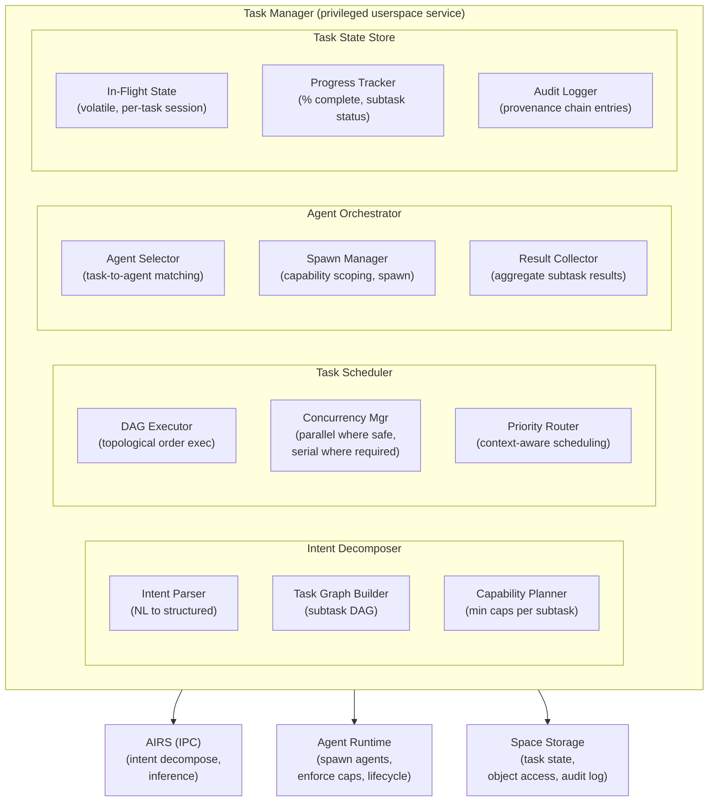
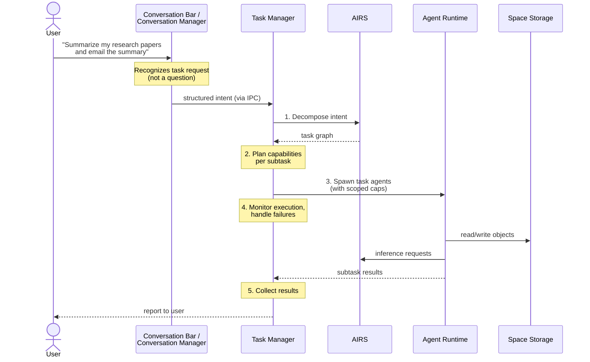
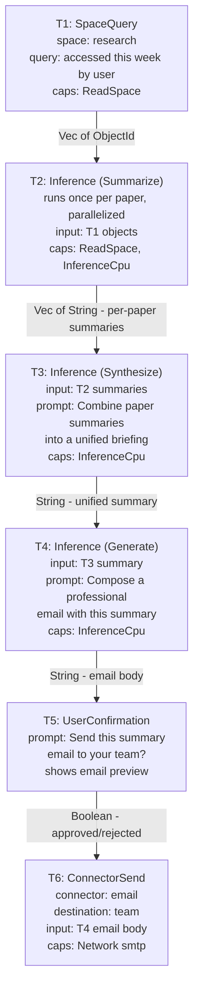
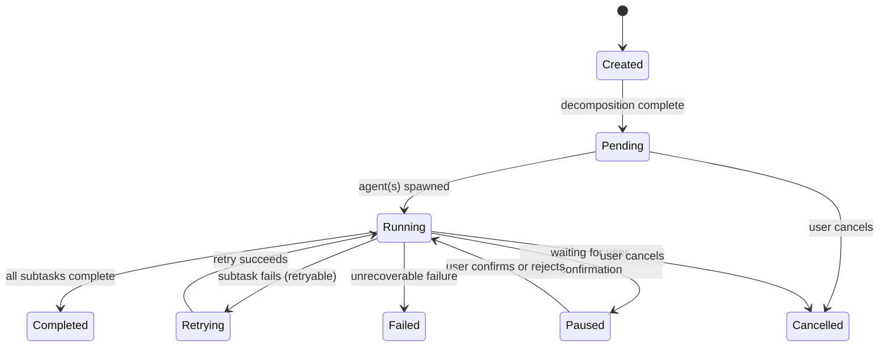
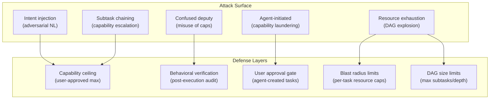
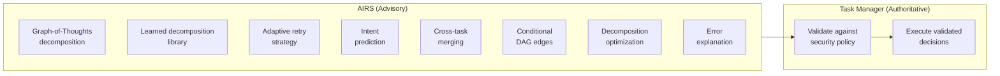

# AIOS Task Manager

## Deep Technical Architecture

**Parent document:** [architecture.md](../project/architecture.md)
**Related:** [agents.md](../applications/agents.md) — Agent framework and task agents, [airs.md](./airs.md) — AI Runtime Service (inference, intent verification), [context-engine.md](./context-engine.md) — Context-aware prioritization, [attention.md](./attention.md) — Notification urgency and delivery, [preferences.md](./preferences.md) — User preference system, [scheduler.md](../kernel/scheduler.md) — Kernel thread scheduling, [model.md](../security/model.md) — Security model and capabilities, [thermal.md](../platform/thermal.md) — Thermal management, [multi-device.md](../platform/multi-device.md) — Multi-device architecture, [lifecycle.md](../kernel/boot/lifecycle.md) — Boot phases and service startup

-----

## 1. Overview

Traditional operating systems have no concept of user intent. The user opens programs, moves files, switches windows. The OS manages processes and memory — it has no idea why. When the user says "organize my photos from the trip," they must manually open an image editor, a file browser, and perhaps a metadata tool, then perform dozens of individual operations that together accomplish the goal. The OS sees thirty file renames and ten program launches. It does not see "organize photos."

AIOS introduces the Task Manager — a system service that bridges the gap between user intent and agent execution. When a user expresses an intent (through the Conversation Bar, a keyboard shortcut, or a long-press context action), the Task Manager decomposes that intent into a structured graph of subtasks, spawns task agents to execute each subtask, orchestrates their coordination, monitors their progress, and reports completion back to the user.

**The Task Manager is not a process list.** It does not display running PIDs or memory usage (that is the Inspector's job). It manages *goals* — what the user wants to accomplish — and coordinates the agents that accomplish them.

**The Task Manager is not AIRS.** AIRS provides the inference engine — it understands natural language, generates embeddings, and verifies intent. The Task Manager *uses* AIRS to decompose intents, but it owns the task lifecycle: creation, scheduling, monitoring, retry, and completion.

**The Task Manager is not the Agent Runtime.** The Agent Runtime manages process isolation, capability enforcement, and sandbox security. The Task Manager tells the Agent Runtime *which* agents to spawn and *what* capabilities they need, then monitors the task-level outcome.

```text
User: "Summarize all the research papers I read this week and
       email the summary to my team"

Without Task Manager:
  User must: open paper space, search by date, open each paper,
  copy text, open AI chat, paste text, request summary, copy
  summary, open email, compose message, paste, send. ~15 minutes.

With Task Manager:
  1. User speaks/types the intent
  2. Task Manager decomposes into subtasks:
     a. Query space "research" for papers accessed this week
     b. For each paper: extract key findings (inference)
     c. Synthesize findings into a unified summary (inference)
     d. Compose email with summary to "team" contact group
     e. Send via email connector (requires user confirmation)
  3. Task agents execute steps a-d autonomously
  4. Step e pauses for user confirmation (send action)
  5. User reviews summary, confirms send
  6. Task complete. ~30 seconds of user time.
```

-----

## 2. Architecture



### 2.1 Relationship to Other Services

The Task Manager sits between the user's intent and the system's execution machinery. It does not duplicate functionality — it coordinates it.



**AIRS** provides:
- Intent decomposition: parsing natural language into a structured task graph
- Inference: subtasks that require LLM reasoning (summarization, classification, generation)
- Intent verification: ensuring spawned agents act within the declared task scope

**Agent Runtime** provides:
- Process isolation: each task agent runs in its own address space (TTBR0)
- Capability enforcement: task agents receive only the capabilities their subtask requires
- Lifecycle management: spawn, pause, suspend, terminate

**Space Storage** provides:
- Object access: task agents read from and write to spaces
- Task state: the Task struct is stored as a space object in `system/tasks/`
- Audit: all task actions are logged to the provenance chain

**Context Engine** provides:
- Priority hints: deep work context may boost task priority; leisure may deprioritize background tasks
- Resource scheduling: context-aware compute allocation for task agent inference requests

-----

## 3. Intent Decomposition

### 3.1 From Natural Language to Task Graph

When the user expresses an intent, the Task Manager asks AIRS to decompose it into a structured task graph. This is the core intelligence step — transforming a fuzzy human goal into a concrete execution plan.

```rust
pub struct Intent {
    /// Raw natural language from the user
    raw: String,
    /// Structured representation (produced by AIRS)
    parsed: Option<ParsedIntent>,
    /// Source of the intent
    source: IntentSource,
    /// Timestamp
    created_at: Timestamp,
}

pub enum IntentSource {
    /// User typed or spoke into the Conversation Bar
    ConversationBar,
    /// User invoked a context action (long-press, right-click)
    ContextAction { object: ObjectId, action: String },
    /// User triggered a keyboard shortcut mapped to a task
    KeyboardShortcut { shortcut: String },
    /// Another agent requested task creation (requires user approval)
    AgentRequest { agent: AgentId },
}

pub struct ParsedIntent {
    /// What the user wants to achieve (high-level summary)
    goal: String,
    /// What spaces are involved
    target_spaces: Vec<SpaceId>,
    /// What objects are involved (if specific)
    target_objects: Vec<ObjectId>,
    /// What actions are required
    actions: Vec<IntentAction>,
    /// Estimated complexity (affects decomposition strategy)
    complexity: IntentComplexity,
    /// Confidence score from AIRS parsing (0.0-1.0)
    confidence: f32,
}

pub enum IntentAction {
    Query,          // search/find objects
    Read,           // read object content
    Summarize,      // generate summary (inference)
    Transform,      // modify content (inference)
    Create,         // create new object
    Send,           // communicate externally (email, message)
    Organize,       // move, tag, relate objects
    Delete,         // remove objects (always requires confirmation)
}

pub enum IntentComplexity {
    /// Single action, single agent — "rename this file"
    Trivial,
    /// Few steps, one agent — "summarize this document"
    Simple,
    /// Multiple steps, possibly multiple agents — "organize my photos"
    Moderate,
    /// Many steps, multiple agents, external services — "research and report"
    Complex,
}
```

### 3.2 Task Graph Construction

AIRS decomposes the parsed intent into a directed acyclic graph (DAG) of subtasks. Edges represent data dependencies — a subtask cannot execute until all its predecessors have completed and their outputs are available.

```rust
pub struct TaskGraph {
    /// Root task (the user's intent)
    root: TaskId,
    /// All subtasks in the graph
    subtasks: HashMap<TaskId, SubTask>,
    /// Dependency edges: (predecessor, successor)
    edges: Vec<(TaskId, TaskId)>,
}

pub struct SubTask {
    id: TaskId,
    /// What this subtask does
    description: String,
    /// What type of work
    action: SubTaskAction,
    /// What capabilities the executing agent needs
    required_capabilities: Vec<Capability>,
    /// Input data (output from predecessor subtasks, or space objects)
    inputs: Vec<SubTaskInput>,
    /// Expected output type
    output_type: OutputType,
    /// Whether this subtask needs user confirmation before executing
    requires_confirmation: bool,
    /// Estimated duration (from AIRS, used for progress reporting)
    estimated_duration: Option<Duration>,
    /// Current state
    state: SubTaskState,
}

pub enum SubTaskAction {
    /// Query a space for matching objects
    SpaceQuery { space: SpaceId, query: String },
    /// Read object content
    SpaceRead { space: SpaceId, object: ObjectId },
    /// Write or create an object
    SpaceWrite { space: SpaceId, content_type: ContentType },
    /// Run AIRS inference (summarize, generate, classify)
    Inference { task_type: InferenceTaskType, prompt_template: String },
    /// Call a registered tool on another agent
    ToolCall { tool_name: String, params: Value },
    /// Send data through a connector (email, chat, etc.)
    ConnectorSend { connector: String, destination: String },
    /// User confirmation gate (execution pauses here)
    UserConfirmation { prompt: String },
}

pub enum SubTaskInput {
    /// Output from a predecessor subtask
    FromSubTask(TaskId),
    /// Object from a space
    FromSpace { space: SpaceId, object: ObjectId },
    /// Literal value (e.g., user-provided text)
    Literal(Value),
}

pub enum OutputType {
    /// Text content (summary, email body, etc.)
    Text,
    /// Structured data (JSON, list, table)
    Structured,
    /// Space object reference (created or modified object)
    ObjectRef,
    /// Boolean (confirmation gate result)
    Boolean,
    /// No output (side-effect only)
    Void,
}
```

### 3.3 Decomposition Example

```text
User intent: "Summarize all the research papers I read this week
              and email the summary to my team"

AIRS decomposition:
```



### 3.4 Decomposition Without AIRS

If AIRS is unavailable (model not loaded, inference engine busy), the Task Manager cannot decompose complex intents. It falls back to:

1. **Direct action intents:** Simple intents that map to a single agent action ("open this document," "play this song") are handled by the Agent Runtime directly, without decomposition. The Task Manager is not involved.

2. **Known task templates:** The Task Manager ships with a library of pre-built task templates for common intents (summarize document, organize photos by date, export space to archive). These templates are static task graphs — no AIRS decomposition needed. They cover the most common use cases with fixed structure.

3. **Deferred execution:** For complex intents that require AIRS decomposition, the Task Manager queues the intent and notifies the user: "I'll start this task when the AI model is ready." When AIRS becomes available, the queued intent is decomposed and executed.

```rust
pub struct TaskTemplateLibrary {
    templates: HashMap<String, TaskTemplate>,
}

pub struct TaskTemplate {
    /// Pattern to match against parsed intent
    pattern: IntentPattern,
    /// Pre-built task graph (no AIRS decomposition needed)
    graph: TaskGraph,
    /// Required capabilities
    capabilities: Vec<Capability>,
}

pub enum IntentPattern {
    /// Exact action on a specific content type
    Exact { action: IntentAction, content_type: ContentType },
    /// Keyword-based matching
    Keywords { keywords: Vec<String>, action: IntentAction },
}
```

-----

## 4. Task Lifecycle

### 4.1 Task States



```rust
pub struct Task {
    /// Unique task identifier
    id: TaskId,
    /// The user's original intent
    intent: Intent,
    /// Decomposed task graph
    graph: TaskGraph,
    /// Current state
    state: TaskState,
    /// Task agents currently executing subtasks
    agents: Vec<AgentId>,
    /// Capability set allocated to this task
    capabilities: CapabilitySet,
    /// Activity log (user-visible progress)
    activity_log: Vec<ActivityEntry>,
    /// Child tasks (if this task spawned sub-tasks)
    children: Vec<TaskId>,
    /// Persistence mode
    persistence: Persistence,
    /// Link to context at creation time
    context: ContextLink,
    /// When the task was created
    created_at: Timestamp,
    /// When the task last changed state
    updated_at: Timestamp,
    /// Priority (derived from context and user interaction)
    priority: TaskPriority,
}

pub enum TaskState {
    /// Intent received, decomposition in progress
    Created,
    /// Decomposed, waiting for agent availability
    Pending,
    /// Subtasks executing
    Running { progress: TaskProgress },
    /// Waiting for user confirmation on a subtask
    Paused { waiting_on: TaskId, prompt: String },
    /// Retrying a failed subtask
    Retrying { subtask: TaskId, attempt: u32 },
    /// All subtasks complete
    Completed { result: TaskResult },
    /// User cancelled
    Cancelled,
    /// Unrecoverable failure
    Failed { error: TaskError },
}

pub enum SubTaskState {
    /// Not yet started (predecessors incomplete)
    Blocked,
    /// Predecessors complete, ready to execute
    Ready,
    /// Agent spawned, executing
    Running { agent: AgentId },
    /// Completed successfully
    Completed { output: Value },
    /// Failed (may be retried)
    Failed { error: SubTaskError, retries: u32 },
    /// Skipped (predecessor failed, this subtask is unreachable)
    Skipped,
}

pub struct TaskProgress {
    /// Total subtasks in the graph
    total: u32,
    /// Subtasks completed
    completed: u32,
    /// Subtasks currently running
    running: u32,
    /// Subtasks blocked (waiting on predecessors)
    blocked: u32,
    /// Estimated time remaining (if AIRS provided duration estimates)
    estimated_remaining: Option<Duration>,
}

pub enum TaskPriority {
    /// User is actively waiting for this result
    Interactive,
    /// User initiated but is doing other things
    Background,
    /// System-initiated task (e.g., scheduled maintenance)
    System,
}

pub enum Persistence {
    /// Task agent state is volatile — lost on crash or reboot
    Ephemeral,
    /// Task metadata (intent, progress) is persisted to space
    /// but in-flight agent state is volatile
    MetadataPersisted,
}

pub struct TaskResult {
    /// Summary of what was accomplished
    summary: String,
    /// Objects created or modified
    affected_objects: Vec<ObjectId>,
    /// Total execution time
    duration: Duration,
}

pub struct TaskError {
    /// Which subtask failed
    subtask: TaskId,
    /// What went wrong
    error: SubTaskError,
    /// How many retries were attempted
    retries_attempted: u32,
    /// What was accomplished before failure
    partial_result: Option<TaskResult>,
}

pub enum SubTaskError {
    /// AIRS inference failed (model unavailable, timeout)
    InferenceFailed(String),
    /// Space operation failed (object not found, permission denied)
    SpaceError(String),
    /// Agent crashed during execution
    AgentCrashed(AgentId),
    /// Tool call failed (target agent unavailable)
    ToolCallFailed { tool: String, reason: String },
    /// Connector failed (network error, auth error)
    ConnectorFailed { connector: String, reason: String },
    /// User rejected at confirmation gate
    UserRejected,
    /// Timeout (subtask exceeded estimated duration by 5x)
    Timeout,
}
```

### 4.2 Task Lifecycle Flow

```text
1. Intent arrives (Conversation Bar, context action, keyboard shortcut)
     │
     ▼
2. Task Manager creates Task in Created state
   Stores to system/tasks/ space
     │
     ▼
3. Task Manager sends intent to AIRS for decomposition
   AIRS returns: ParsedIntent + TaskGraph
     │
     ├── AIRS unavailable → check template library → queue if no match
     │
     └── AIRS returns graph
           │
           ▼
4. Capability planning
   For each subtask, determine minimum capability set
   Verify user has approved these capabilities
   If new capabilities needed → prompt user
     │
     ▼
5. Task enters Pending state
   Task Manager schedules execution based on TaskPriority
     │
     ▼
6. DAG Executor walks the graph in topological order
   For each Ready subtask:
     a. Agent Selector finds or spawns an appropriate task agent
     b. Spawn Manager requests Agent Runtime to create the agent
        with the subtask's minimum capability set
     c. Task agent receives subtask description via IPC
     d. Task agent executes and reports result
     │
     ├── SubTask completes → mark successor subtasks as Ready
     │                         continue DAG walk
     │
     ├── SubTask fails (retryable) → retry up to 3 times
     │                                 exponential backoff
     │
     ├── SubTask fails (unrecoverable) → mark task Failed
     │                                     report to user
     │
     ├── SubTask is UserConfirmation → pause task
     │                                   present to user
     │                                   wait for approval/rejection
     │
     └── All subtasks complete → task enters Completed state
                                  report result to user
                                  terminate task agents
```

-----

## 5. Agent Orchestration

### 5.1 Task Agents

Task agents are ephemeral agents spawned specifically to execute one or more subtasks. Their lifetime is the task's lifetime. They differ from persistent agents in several ways:

| Property | Persistent Agent | Task Agent |
|---|---|---|
| Lifetime | Indefinite, survives reboots | Task duration only |
| State persistence | Saves to spaces, restores on reboot | Volatile — lost on crash/reboot |
| Capabilities | Full set from manifest and user approval | Minimal set per subtask only |
| User installation | Requires manifest review, user approval | Spawned transparently by Task Manager |
| Visibility | Listed in Agent Runtime, visible in Inspector | Shown in task progress UI |
| Reboot behavior | Relaunched by Agent Runtime | NOT relaunched — task is lost |

```rust
pub struct TaskAgentConfig {
    /// Which subtask(s) this agent will execute
    subtasks: Vec<TaskId>,
    /// Minimum capabilities for these subtasks
    capabilities: Vec<Capability>,
    /// Memory limit (conservative — task agents are short-lived)
    memory_limit: usize,
    /// CPU priority (derived from task priority)
    cpu_priority: SchedulingPriority,
    /// Parent task (for audit linkage)
    task: TaskId,
    /// Maximum lifetime (hard timeout — prevents runaway agents)
    max_lifetime: Duration,
}
```

### 5.2 Agent Selection

When a subtask is ready to execute, the Task Manager must decide which agent runs it. Three strategies, tried in order:

**1. Reuse an existing task agent.** If a task agent from the same task is idle and already holds the necessary capabilities, reuse it. This avoids spawn overhead and keeps the agent count low.

**2. Spawn a new task agent from a known manifest.** For common subtask types (space query, inference, file transform), the Task Manager has built-in agent manifests optimized for single-purpose execution. These are lightweight agents (~2 MB memory, <20ms startup) that execute one subtask and exit.

**3. Delegate to a registered tool.** If a third-party agent has registered a tool that matches the subtask (e.g., a PDF parser agent registered `pdf-extract`), the Task Manager delegates via the Tool Manager. The third-party agent runs the subtask in its own process; the Task Manager collects the result.

```rust
pub struct AgentSelector {
    /// Built-in agent manifests for common subtask types
    builtin_manifests: HashMap<SubTaskAction, AgentManifest>,
    /// Tool registry (from AIRS Tool Manager)
    tool_registry: ToolRegistry,
}

impl AgentSelector {
    pub fn select(
        &self,
        subtask: &SubTask,
        active_agents: &[AgentId],
    ) -> AgentSelection {
        // Strategy 1: reuse existing idle agent with matching capabilities
        for agent in active_agents {
            if self.agent_can_handle(agent, subtask) {
                return AgentSelection::Reuse(*agent);
            }
        }

        // Strategy 2: check if a registered tool matches
        if let Some(tool) = self.tool_registry.find_for_action(&subtask.action) {
            return AgentSelection::ToolCall {
                tool_name: tool.name.clone(),
                provider: tool.provider,
            };
        }

        // Strategy 3: spawn a built-in task agent
        let manifest = self.builtin_manifests
            .get(&subtask.action)
            .expect("built-in manifest exists for every SubTaskAction variant");
        AgentSelection::Spawn {
            manifest: manifest.clone(),
            capabilities: subtask.required_capabilities.clone(),
        }
    }
}

pub enum AgentSelection {
    /// Reuse an existing task agent
    Reuse(AgentId),
    /// Delegate to a tool on another agent
    ToolCall { tool_name: String, provider: AgentId },
    /// Spawn a new task agent
    Spawn { manifest: AgentManifest, capabilities: Vec<Capability> },
}
```

### 5.3 Capability Scoping

The Task Manager enforces the principle of least privilege for task agents. Each task agent receives only the capabilities needed for its specific subtask — not the full set the user has approved for the task.

```text
Task: "Summarize papers and email the summary"

User-approved capabilities for this task:
  ReadSpace("research"), InferenceCpu, Network("smtp")

Subtask T1 (SpaceQuery) agent receives:
  ReadSpace("research")
  — no inference, no network

Subtask T2 (Inference) agent receives:
  ReadSpace("research"), InferenceCpu
  — no network

Subtask T6 (ConnectorSend) agent receives:
  Network("smtp")
  — no space read, no inference

Each agent has the minimum capability surface for attack.
A compromised T2 agent cannot send email.
A compromised T6 agent cannot read research papers.
```

```rust
pub struct CapabilityPlanner {
    /// Maps subtask actions to required capability types
    action_caps: HashMap<SubTaskAction, Vec<CapabilityType>>,
}

impl CapabilityPlanner {
    /// Compute the minimum capability set for a subtask
    pub fn plan_capabilities(
        &self,
        subtask: &SubTask,
        task_caps: &CapabilitySet,
    ) -> Result<Vec<Capability>> {
        let required_types = self.action_caps.get(&subtask.action)
            .ok_or(TaskError::UnknownAction)?;

        let mut caps = Vec::new();
        for cap_type in required_types {
            // Find matching capability from the task's approved set
            let cap = task_caps.find_by_type(cap_type)
                .ok_or(TaskError::MissingCapability(cap_type.clone()))?;
            // Attenuate: restrict to only the resources this subtask needs
            let scoped = cap.attenuate(&subtask.scope())?;
            caps.push(scoped);
        }
        Ok(caps)
    }
}
```

-----

## 6. Task Scheduling

### 6.1 DAG Execution

The Task Scheduler executes subtasks in topological order. Subtasks with no unmet dependencies execute concurrently when the DAG structure permits.

```rust
pub struct DagExecutor {
    graph: TaskGraph,
    /// Subtasks with all predecessors complete
    ready_queue: VecDeque<TaskId>,
    /// Currently executing subtasks
    in_flight: HashMap<TaskId, AgentId>,
    /// Maximum concurrent subtasks (based on available resources)
    max_concurrency: usize,
}

impl DagExecutor {
    /// Advance execution: start ready subtasks, collect results
    pub async fn step(&mut self, orchestrator: &mut AgentOrchestrator) -> StepResult {
        // Collect completed subtasks
        let completed = orchestrator.poll_completions().await;
        for (subtask_id, result) in completed {
            self.in_flight.remove(&subtask_id);
            self.mark_completed(subtask_id, result);
            // Check if successors are now ready
            for successor in self.graph.successors(subtask_id) {
                if self.all_predecessors_complete(successor) {
                    self.ready_queue.push_back(successor);
                }
            }
        }

        // Start new subtasks up to concurrency limit
        while self.in_flight.len() < self.max_concurrency {
            match self.ready_queue.pop_front() {
                Some(subtask_id) => {
                    let agent = orchestrator.execute(subtask_id).await?;
                    self.in_flight.insert(subtask_id, agent);
                }
                None => break,
            }
        }

        // Check termination
        if self.in_flight.is_empty() && self.ready_queue.is_empty() {
            if self.all_subtasks_complete() {
                StepResult::TaskComplete
            } else {
                StepResult::TaskFailed
            }
        } else {
            StepResult::InProgress
        }
    }
}
```

### 6.2 Concurrency Limits

The Task Manager limits concurrent subtask execution based on system resources and context:

```rust
pub struct ConcurrencyPolicy {
    /// Maximum concurrent task agents across all tasks
    global_max: usize,                  // default: 4
    /// Maximum concurrent task agents per task
    per_task_max: usize,                // default: 2
    /// Context-aware adjustment
    context_adjustment: ContextAdjustment,
}

pub struct ContextAdjustment {
    /// During deep work (work_engagement > 0.8): reduce task concurrency
    /// to avoid competing with the user's foreground agents
    deep_work_limit: usize,            // default: 1
    /// During idle (no user input for 5 min): increase task concurrency
    idle_limit: usize,                 // default: 4
    /// During leisure: reduce to minimum
    leisure_limit: usize,              // default: 1
}
```

### 6.3 Priority and Preemption

Interactive tasks (user is waiting) take priority over background tasks. When an interactive task arrives while background tasks are running:

1. Background task agents are **not** terminated — they are deprioritized in the scheduler.
2. Interactive task agents get `Interactive` scheduling priority.
3. Inference requests from interactive tasks preempt background inference (AIRS scheduling).
4. If memory pressure is critical, background task agents may be suspended (state lost — task will need to restart later).

-----

## 7. Error Handling and Retry

### 7.1 Subtask Failure

When a subtask fails, the Task Manager applies a retry policy before marking the task as failed:

```rust
pub struct RetryPolicy {
    /// Maximum retry attempts per subtask
    max_retries: u32,                   // default: 3
    /// Backoff between retries
    backoff: BackoffStrategy,
    /// Which errors are retryable
    retryable: Vec<SubTaskError>,
}

pub enum BackoffStrategy {
    /// Fixed delay between retries
    Fixed(Duration),
    /// Exponential: delay * 2^attempt (capped at max_delay)
    Exponential { initial: Duration, max: Duration },
}

impl RetryPolicy {
    pub fn should_retry(&self, error: &SubTaskError, attempt: u32) -> bool {
        if attempt >= self.max_retries {
            return false;
        }
        match error {
            // Retryable: transient failures
            SubTaskError::InferenceFailed(_) => true,   // model may be loading
            SubTaskError::AgentCrashed(_) => true,      // respawn agent
            SubTaskError::ConnectorFailed { .. } => true, // network may recover
            SubTaskError::Timeout => true,              // may succeed with more time

            // Not retryable: permanent failures
            SubTaskError::SpaceError(_) => false,       // object not found, perm denied
            SubTaskError::UserRejected => false,        // user said no
            SubTaskError::ToolCallFailed { .. } => false, // tool agent unavailable
        }
    }

    pub fn retry_delay(&self, attempt: u32) -> Duration {
        match &self.backoff {
            BackoffStrategy::Fixed(d) => *d,
            BackoffStrategy::Exponential { initial, max } => {
                let delay = *initial * 2u32.pow(attempt);
                delay.min(*max)
            }
        }
    }
}
```

### 7.2 Partial Results

When a task fails, the Task Manager preserves partial results. If subtasks T1-T3 completed but T4 failed, the outputs from T1-T3 are still available. The user sees:

```text
Task: "Summarize papers and email summary"
Status: Failed at step 4 of 6 (compose email)
Completed:
  ✓ Found 8 papers from this week
  ✓ Extracted key findings from each paper
  ✓ Generated unified summary
Failed:
  ✗ Compose email — inference timeout (AIRS busy)

[Retry] [View partial summary] [Cancel]
```

The user can retry (Task Manager restarts from the failed subtask, using cached outputs from completed subtasks), view what was accomplished, or cancel.

### 7.3 Task Agent Crashes

Task agents are ephemeral processes. If one crashes:

1. The Agent Runtime reports the crash to the Task Manager via IPC.
2. The Task Manager marks the subtask as `Failed(AgentCrashed)`.
3. The retry policy spawns a new agent and re-executes the subtask.
4. The new agent starts from scratch — there is no in-flight state to recover. This is acceptable because subtasks are designed to be idempotent: re-running a summarization produces the same result.

```rust
impl TaskManager {
    async fn handle_agent_crash(&mut self, agent_id: AgentId) {
        // Find which subtask this agent was running
        if let Some(subtask_id) = self.find_subtask_for_agent(agent_id) {
            let subtask = self.graph.subtask_mut(subtask_id);
            let attempt = subtask.retries();

            if self.retry_policy.should_retry(
                &SubTaskError::AgentCrashed(agent_id),
                attempt,
            ) {
                // Retry: spawn new agent, re-execute subtask
                subtask.set_state(SubTaskState::Failed {
                    error: SubTaskError::AgentCrashed(agent_id),
                    retries: attempt + 1,
                });
                let delay = self.retry_policy.retry_delay(attempt);
                self.schedule_retry(subtask_id, delay).await;
            } else {
                // Max retries exceeded — fail the task
                self.fail_task(subtask_id, SubTaskError::AgentCrashed(agent_id)).await;
            }
        }
    }
}
```

-----

## 8. Task State Persistence

### 8.1 What Is Persisted

Task metadata — the intent, the decomposed graph, subtask states, and progress — is persisted to `system/tasks/` as a space object. This allows the Workspace to display active tasks, the Inspector to show task history, and the user to review what happened.

```rust
pub struct PersistedTaskState {
    /// Task identity and intent
    task_id: TaskId,
    intent: Intent,
    /// Task graph (subtask descriptions and edges)
    graph: TaskGraph,
    /// Current state of each subtask
    subtask_states: HashMap<TaskId, SubTaskState>,
    /// Activity log
    activity_log: Vec<ActivityEntry>,
    /// Creation and completion timestamps
    created_at: Timestamp,
    completed_at: Option<Timestamp>,
    /// Final result (if completed)
    result: Option<TaskResult>,
    /// Final error (if failed)
    error: Option<TaskError>,
}
```

### 8.2 What Is NOT Persisted

Task agent in-flight state is **not** persisted. If the system crashes or reboots while a task is running:

- Task agents are terminated (they are ephemeral — see [agents.md](../applications/agents.md) Section 2.2 and 3.5).
- The task metadata in `system/tasks/` shows the last known subtask states.
- Completed subtask outputs that were written to spaces survive (spaces are persistent).
- In-flight subtask state (partial inference, buffered data) is lost.

**On next boot:** The Task Manager reads `system/tasks/` and finds tasks that were `Running` when the system went down. It marks them as `Failed` with error `SystemReboot`. The user sees:

```text
Task: "Summarize papers and email summary"
Status: Interrupted by system reboot
Completed before reboot:
  ✓ Found 8 papers from this week
  ✓ Extracted findings from 5 of 8 papers
Interrupted:
  ✗ Findings extraction for 3 remaining papers (in progress at reboot)

[Restart task] [Resume from last checkpoint] [Dismiss]
```

"Resume from last checkpoint" re-runs only the incomplete subtasks, using cached outputs from subtasks that completed before the reboot. "Restart task" re-runs everything from scratch.

### 8.3 Design Rationale: Why Task Agents Are Ephemeral

Task agents are deliberately not persisted across reboots for three reasons:

1. **Correctness.** A half-completed inference has no meaningful state to restore. LLM generation is non-deterministic — restoring a partial token sequence would produce incoherent output. It is better to restart the subtask cleanly.

2. **Simplicity.** Persisting agent process state requires checkpointing address spaces, KV caches, and IPC channel state. This is complex, error-prone, and expensive. For short-lived task agents (typical lifetime: seconds to minutes), the cost exceeds the benefit.

3. **Security.** Ephemeral agents leave no residual state. After a task completes, the agent's address space is freed, its capabilities are revoked, and its memory is zeroed. There is no stale process holding capabilities it no longer needs.

-----

## 9. Boot Phase and Dependencies

### 9.1 Boot Phase

The Task Manager starts during **Phase 5 (Experience)** of the boot sequence. It depends on services from Phase 3 (AI Services) and Phase 4 (User Services) being available.

```text
Phase 3: AI Services (non-critical path)
  ├── airs_core ──→ space_indexer
  │       │
  │       └──→ context_engine
  │
Phase 4: User Services (critical path continues)
  ├── identity_service
  │       │
  │       ▼
  │   preference_service
  │       │
  │       ├──→ attention_manager
  │       │
  │       └──→ agent_runtime
  │
Phase 5: Experience (starts when Phase 4 completes)
  ├── workspace ──→ conversation_bar
  │                      │
  │                      └──→ autostart_agents
  │
  └── task_manager  ←── NEW: starts here
         │
         ├── depends on: airs_core (for intent decomposition)
         ├── depends on: agent_runtime (for spawning task agents)
         ├── depends on: space_storage (for task state in system/tasks/)
         └── depends on: context_engine (for priority and scheduling)
```

### 9.2 Service Dependencies

| Dependency | Required? | What It Provides | Degraded Behavior Without |
|---|---|---|---|
| AIRS | Soft | Intent decomposition, inference for subtasks | Template-only decomposition; complex intents queued |
| Agent Runtime | Hard | Spawning and managing task agents | Task Manager cannot execute any tasks |
| Space Storage | Hard | Task state persistence, object access for subtasks | Task Manager cannot start |
| Context Engine | Soft | Priority hints, resource scheduling | All tasks run at default priority |
| Attention Manager | Soft | Task completion notifications | Task results shown only in Workspace |
| Conversation Manager | Soft | Receiving intents from Conversation Bar | Only context-action and shortcut intents work |

### 9.3 Startup Sequence

```rust
pub struct TaskManagerService {
    state_store: TaskStateStore,
    decomposer: IntentDecomposer,
    scheduler: TaskScheduler,
    orchestrator: AgentOrchestrator,
    template_library: TaskTemplateLibrary,
}

impl TaskManagerService {
    /// Called during Phase 5 boot
    pub async fn init(&mut self) -> Result<()> {
        // 1. Connect to Space Storage — load persisted task state
        self.state_store.connect("system/tasks/").await?;

        // 2. Load task template library from system/config/task-templates/
        self.template_library.load().await?;

        // 3. Connect to Agent Runtime — required for spawning task agents
        self.orchestrator.connect_agent_runtime().await?;

        // 4. Connect to AIRS — optional (may not be ready yet)
        match self.decomposer.connect_airs().await {
            Ok(_) => log::info!("Task Manager: AIRS connected, full decomposition available"),
            Err(_) => log::info!("Task Manager: AIRS not ready, using templates only"),
        }

        // 5. Connect to Context Engine — optional
        self.scheduler.connect_context_engine().await.ok();

        // 6. Recover interrupted tasks from previous session
        self.recover_interrupted_tasks().await;

        // 7. Register IPC endpoint at sys.tasks
        self.register_ipc("sys.tasks").await?;

        // 8. Ready to accept intents
        log::info!("Task Manager: ready");
        Ok(())
    }

    async fn recover_interrupted_tasks(&mut self) {
        let interrupted = self.state_store.find_running_tasks().await;
        for task in interrupted {
            // Mark as interrupted — user can restart or dismiss
            self.state_store.mark_interrupted(task.id).await;
            log::info!("Task {}: interrupted by reboot, marked for user review", task.id);
        }
    }
}
```

### 9.4 Late AIRS Connection

AIRS may not be ready when the Task Manager starts (Phase 5 does not wait for Phase 3). The Task Manager handles this gracefully:

1. On startup, attempt to connect to AIRS. If AIRS is not ready, proceed without it.
2. Register for AIRS health notifications. When AIRS becomes healthy, connect.
3. Any intents that arrived before AIRS was ready and could not be decomposed from templates are re-processed.

```rust
impl IntentDecomposer {
    /// Called when AIRS health status changes
    pub async fn on_airs_available(&mut self) {
        // Drain the deferred intent queue
        while let Some(intent) = self.deferred_queue.pop() {
            match self.decompose_with_airs(&intent).await {
                Ok(graph) => self.emit_task_ready(intent, graph),
                Err(e) => log::warn!("Deferred intent decomposition failed: {}", e),
            }
        }
    }
}
```

-----

## 10. SDK API for Agents

Agents interact with the Task Manager through the SDK's `AgentContext` trait. Three categories of operations are available.

### 10.1 Reading Task State

Agents with the `TaskRead` capability can query active tasks and their progress:

```rust
// Agent reads active tasks (e.g., Workspace displaying task list)
let tasks = ctx.tasks().list_active().await?;

for task in &tasks {
    println!("Task: {} — {}", task.intent.raw, task.state.summary());
    println!("  Progress: {}/{} subtasks", task.progress.completed, task.progress.total);
}

// Subscribe to task state changes (real-time updates)
let mut task_stream = ctx.tasks().subscribe().await?;
while let Some(update) = task_stream.next().await {
    match update {
        TaskUpdate::Progress { task_id, progress } => {
            ui.update_task_progress(task_id, progress);
        }
        TaskUpdate::Completed { task_id, result } => {
            ui.show_task_complete(task_id, result);
        }
        TaskUpdate::Failed { task_id, error } => {
            ui.show_task_failed(task_id, error);
        }
    }
}
```

### 10.2 Creating Tasks

Agents with the `TaskCreate` capability can request task creation. Agent-created tasks always require user approval before execution begins:

```rust
// An agent can request task creation on behalf of the user
// (e.g., a scheduling agent creating a "prepare meeting notes" task)
let task_id = ctx.tasks().create(TaskRequest {
    intent: "Prepare meeting notes for tomorrow's standup",
    source: IntentSource::AgentRequest { agent: ctx.agent_id() },
    priority: TaskPriority::Background,
}).await?;

// The task is Created but Pending until the user approves
// User sees: "Scheduling Agent wants to create a task:
//            'Prepare meeting notes for tomorrow's standup'
//            [Approve] [Deny]"
```

### 10.3 Task Agent SDK

Task agents (spawned by the Task Manager) receive their subtask description through a specialized event:

```rust
// Task agent entry point
#[agent(
    name = "Task Worker",
    capabilities = [],  // capabilities are granted dynamically per subtask
)]
async fn task_worker(ctx: AgentContext) -> Result<()> {
    // Receive subtask assignment from Task Manager
    let assignment = ctx.receive_task_assignment().await?;

    match &assignment.action {
        SubTaskAction::SpaceQuery { space, query } => {
            let results = ctx.spaces().query(space, query).await?;
            ctx.report_task_result(Value::from(results)).await?;
        }
        SubTaskAction::Inference { task_type, prompt_template } => {
            let input = ctx.receive_task_input().await?;
            let result = ctx.infer()
                .with_context(&input)
                .prompt(prompt_template)
                .await?;
            ctx.report_task_result(Value::from(result)).await?;
        }
        // ... other subtask types
        _ => {
            ctx.report_task_error("Unknown subtask action").await?;
        }
    }

    Ok(())
}
```

### 10.4 Capability Requirements

| Operation | Required Capability | Notes |
|---|---|---|
| List active tasks | `TaskRead` | Read-only, Workspace and Inspector use this |
| Subscribe to updates | `TaskRead` | Streaming variant of list |
| Create a task | `TaskCreate` | Requires user approval before execution |
| Cancel a task | `TaskWrite` | User can always cancel; agents need capability |
| Execute subtask (task agent) | Dynamic per subtask | Granted by Task Manager, minimum set |
| Read task result | `TaskRead` | After completion, results are in spaces |

-----

## 11. Diagnostics

The Task Manager exposes its internal state through the Inspector, following the same pattern as other AIOS services.

### 11.1 Inspector View

```text
┌───────────────────────────────────────────────────────────────┐
│  Task Manager — Inspector                                      │
│                                                                │
│  Active Tasks: 2                                              │
│                                                                │
│  ┌──────────────────────────────────────────────────────────┐ │
│  │  Task: "Summarize research papers and email summary"      │ │
│  │  State: Running (4/6 subtasks complete)                   │ │
│  │  Priority: Interactive                                    │ │
│  │  Created: 14:32:05 (2 min ago)                           │ │
│  │                                                           │ │
│  │  Subtask Graph:                                          │ │
│  │    ✓ T1: Query research papers (0.3s)                    │ │
│  │    ✓ T2: Extract findings from 8 papers (12.1s)          │ │
│  │    ✓ T3: Synthesize unified summary (3.2s)               │ │
│  │    ▶ T4: Compose email (running, 1.1s elapsed)           │ │
│  │    ○ T5: User confirmation (blocked on T4)               │ │
│  │    ○ T6: Send email (blocked on T5)                      │ │
│  │                                                           │ │
│  │  Agents: 1 active (task-worker-a7f3)                     │ │
│  │  Memory: 18 MB (agent) + 2 MB (Task Manager overhead)    │ │
│  │  Inference: 3 requests completed, 1 in flight            │ │
│  └──────────────────────────────────────────────────────────┘ │
│                                                                │
│  ┌──────────────────────────────────────────────────────────┐ │
│  │  Task: "Organize photos by location"                      │ │
│  │  State: Running (12/47 subtasks complete)                 │ │
│  │  Priority: Background                                     │ │
│  │  Created: 14:15:22 (19 min ago)                          │ │
│  │  Progress: ████████░░░░░░░░░░░░  25%                     │ │
│  └──────────────────────────────────────────────────────────┘ │
│                                                                │
│  Recent Completed: 14 tasks today                             │
│  Recent Failed: 1 task today (network timeout)                │
│                                                                │
│  Service Health:                                              │
│    AIRS connection:     Connected (full decomposition)        │
│    Agent Runtime:       Connected                             │
│    Context Engine:      Connected (priority hints active)     │
│    Template library:    24 templates loaded                   │
│    Deferred queue:      0 intents waiting                     │
└───────────────────────────────────────────────────────────────┘
```

### 11.2 Diagnostic API

```rust
pub enum TaskDiagnostic {
    /// All active tasks with their current state
    ActiveTasks {
        tasks: Vec<TaskSummary>,
    },
    /// Detailed view of a specific task
    TaskDetail {
        task: Task,
        agents: Vec<AgentId>,
        resource_usage: TaskResourceUsage,
    },
    /// Service connection health
    ServiceHealth {
        airs: ConnectionStatus,
        agent_runtime: ConnectionStatus,
        context_engine: ConnectionStatus,
        space_storage: ConnectionStatus,
    },
    /// Historical statistics
    Statistics {
        tasks_today: u64,
        tasks_completed: u64,
        tasks_failed: u64,
        avg_task_duration: Duration,
        avg_subtasks_per_task: f32,
        most_common_intents: Vec<(String, u64)>,
    },
}

pub struct TaskSummary {
    id: TaskId,
    intent_summary: String,
    state: TaskState,
    progress: TaskProgress,
    priority: TaskPriority,
    created_at: Timestamp,
    duration: Duration,
}

pub struct TaskResourceUsage {
    /// Total memory used by task agents
    agent_memory: usize,
    /// Total CPU time consumed
    cpu_time: Duration,
    /// Total inference requests
    inference_requests: u64,
    /// Total inference tokens generated
    inference_tokens: u64,
    /// Space operations
    space_reads: u64,
    space_writes: u64,
}
```

-----

## 12. Implementation Order

The Task Manager is built incrementally across several development phases. Each phase delivers independently testable functionality.

```text
Phase 10: Basic Task Model
  ├── Task struct and TaskState enum
  ├── Task state persistence in system/tasks/ space
  ├── IPC endpoint (sys.tasks) with basic operations
  ├── Workspace integration (display active tasks)
  └── Manual task creation from Conversation Bar (single-step tasks)

Phase 11: Task Decomposition and Execution
  ├── Intent decomposition via AIRS (NL → task graph)
  ├── Task template library (common intents without AIRS)
  ├── DAG executor (topological order, sequential execution)
  ├── Task agent spawning via Agent Runtime
  ├── Capability planner (minimum capability per subtask)
  ├── User confirmation gates
  └── Result collection and task completion

Phase 12: Agent Orchestration and Concurrency
  ├── Agent selector (reuse, tool delegation, spawn)
  ├── Concurrent subtask execution (parallel DAG branches)
  ├── Concurrency limits (global and per-task)
  ├── Context-aware priority adjustment
  └── Inspector integration (task diagnostics)

Phase 13: Error Handling and Resilience
  ├── Retry policy (exponential backoff, retryable errors)
  ├── Partial result preservation
  ├── Agent crash recovery (respawn and re-execute)
  ├── Interrupted task recovery on reboot
  └── Deferred intent queue (AIRS unavailable)

Phase 14: Optimization and Intelligence
  ├── Task history learning (common intents → cached decompositions)
  ├── Predictive task preparation (Context Engine signals)
  ├── Agent pool (pre-warmed task agents for fast startup)
  ├── Streaming progress to Workspace (real-time subtask updates)
  └── SDK: TaskRead, TaskCreate, TaskWrite capabilities for agents

Phase 14-15: Security and Observability (§14-§15)
  ├── Per-task capability ceiling enforcement
  ├── BlastRadiusPolicy and DAG size limits
  ├── Behavioral verification (post-execution IPC audit)
  ├── Task provenance chain (TaskProvenanceEntry)
  ├── Trust boundary enforcement (TL2-TL4)
  ├── Structured logging (Subsystem::TaskManager)
  ├── Task lifecycle metrics and trace points
  └── SLO target definitions and monitoring

Phase 18-19: AI-Native Intelligence (§18-§19)
  ├── Graph-of-Thoughts decomposition (multi-candidate scoring)
  ├── Learned decomposition library (Voyager-style)
  ├── ReAct/Reflexion adaptive retry
  ├── Proactive intent prediction (pre-decomposition)
  ├── Cross-task subtask merging
  ├── Conditional DAG edges (runtime branching)
  ├── DSPy-style decomposition optimization
  ├── Decision tree template matching (kernel-internal)
  ├── Task duration and failure prediction
  ├── Critical-path DAG scheduling
  └── Idempotency tokens for crash-safe execution

Phase 20+: Multi-Device and Power-Aware (§16-§17)
  ├── Task handoff via Space Sync (TaskHandoffPayload)
  ├── Checkpoint protocol (incremental Merkle DAG sync)
  ├── Device-aware DAG partitioning
  ├── Distributed failure handling and reconciliation
  ├── Thermal state integration (concurrency throttling)
  ├── Battery-aware concurrency limits
  └── Power budget estimation per subtask type
```

**Critical dependencies:**

- Task Manager requires IPC (Phase 3) — all communication is IPC-based.
- Task Manager requires Agent Runtime (Phase 10) — cannot spawn task agents without it.
- Task Manager requires Space Storage (Phase 4) — task state persisted in `system/tasks/`.
- AIRS integration requires AIRS inference engine (Phase 8) — intent decomposition needs inference.
- Context-aware scheduling requires Context Engine (Phase 8) — priority hints from context state.
- Workspace display requires Compositor (Phase 6) — task progress shown in the Workspace UI.

-----

## 13. Design Principles

1. **Users think about goals, not programs.** The user says what they want. The Task Manager figures out which agents to run, in what order, with what data. The user never has to manually coordinate agents.

2. **Minimum capability per subtask.** Each task agent receives only the capabilities it needs for its specific subtask. A summarization agent cannot send email. An email agent cannot read research papers. This limits blast radius even within a single task.

3. **Ephemeral by default.** Task agents are born, execute, and die. They do not accumulate state, do not persist across reboots, and do not hold capabilities after completion. This is a security property: there is no residual attack surface from completed tasks.

4. **Graceful degradation.** Without AIRS, the Task Manager still handles common intents through templates. Without the Context Engine, tasks run at default priority. The system gets less intelligent, but it never stops working.

5. **Partial results are valuable.** A failed task that completed 4 of 6 steps still produced useful work. The user can see and use partial results. The system never discards work that was done correctly.

6. **Transparency.** Every task, every subtask, every agent spawn, every capability grant is visible in the Inspector. The user can always see what the system is doing on their behalf and why.

7. **User confirmation for irreversible actions.** Sending email, deleting objects, posting to external services — these actions always pause for user approval. The Task Manager automates the boring parts; the user approves the consequential parts.

8. **Idempotent subtasks.** Subtasks are designed so that re-executing them produces the same result. This makes retry safe: if an agent crashes during summarization, respawning and re-running the summarization produces the same summary. Side-effecting subtasks (send email) are gated behind user confirmation, which naturally prevents duplicate execution.

9. **Defense in depth for task agents.** Task agents are constrained by multiple overlapping mechanisms: capability attenuation (§5.3), blast radius containment (§14.2), behavioral verification (§14.3), and provenance auditing (§14.4). A single mechanism failure does not compromise the system.

10. **Task state is portable.** Task metadata, checkpoint data, and completed subtask outputs are stored in Space Storage (§8.1), making tasks inherently movable across devices via Space Sync (§16.1). The Task Manager does not hold non-recoverable state in volatile memory.

11. **Every decision is auditable.** Every AI-driven decision — which decomposition was chosen, which agent was selected, which retry strategy was applied — produces a provenance record (§14.4). Users and auditors can trace any task outcome back to its decision chain.

-----

## 14. Security Integration

The Task Manager occupies a unique security position: it dynamically spawns agents with computed capability sets based on AI-generated decompositions. A compromised decomposition could cause the Task Manager to grant capabilities the user didn't intend. This section describes the security architecture that prevents such attacks.

**Cross-references:** [model.md](../security/model.md) §1.4 (attack scenarios), §3 (capability system); [agents.md](../applications/agents.md) §2.2 (task agents); [model/capabilities.md](../security/model/capabilities.md) §3.1-§3.6 (token lifecycle, attenuation)

### 14.1 Threat Model

The Task Manager faces five primary attack vectors:

| Threat | Attack Vector | Impact | Mitigation |
|---|---|---|---|
| Intent injection | Adversarial text in intent that causes AIRS to generate a malicious task graph | Unauthorized capability grants | Capability ceiling (§14.2), intent verification (§14.3) |
| Subtask chaining escalation | Chain of individually-safe subtasks that collectively achieve unauthorized access | Privilege escalation through composition | Per-task capability ceiling, cross-subtask dataflow analysis |
| Confused deputy | Task agent uses legitimately-held capability for a purpose outside its declared subtask | Information leakage, unauthorized actions | Behavioral verification (§14.3), IPC audit |
| Agent-initiated task manipulation | Third-party agent requests task creation to exploit Task Manager's elevated privileges | Capability laundering | User approval gate for agent-created tasks (§10.2) |
| Resource exhaustion | Malicious intent causes decomposition into thousands of subtasks, spawning excessive agents | DoS, memory exhaustion | Blast radius limits (§14.2), DAG size limits |



### 14.2 Capability Enforcement

The Task Manager enforces two layers of capability control:

**Layer 1: Per-task capability ceiling.** When a task is created, the user approves a set of capabilities for the entire task. No subtask agent can receive capabilities outside this ceiling — even if AIRS requests them during decomposition. The ceiling is fixed at task creation time and cannot be expanded without user re-approval.

**Layer 2: Per-subtask attenuation.** Within the task's ceiling, each subtask agent receives only the minimum capabilities needed for its specific action (already described in §5.3). This is computed by the `CapabilityPlanner` and enforced by the Agent Runtime at spawn time.

```rust
pub struct TaskSecurityPolicy {
    /// Maximum capabilities for this task (user-approved ceiling)
    capability_ceiling: CapabilitySet,
    /// Resource limits for the entire task
    blast_radius: BlastRadiusPolicy,
    /// Maximum DAG size (prevents decomposition explosion)
    max_subtasks: u32,                   // default: 100
    /// Maximum DAG depth (prevents deep chaining)
    max_depth: u32,                      // default: 10
    /// Maximum total agent memory across all subtasks
    max_total_memory: usize,             // default: 256 MB
    /// Maximum concurrent agents for this task
    max_concurrent_agents: u32,          // default: 4
}

pub struct BlastRadiusPolicy {
    /// Per-agent memory limit
    per_agent_memory: usize,             // default: 32 MB
    /// Per-agent CPU time limit
    per_agent_cpu_time: Duration,        // default: 60 seconds
    /// Per-agent maximum IPC calls
    per_agent_max_ipc: u32,             // default: 1000
    /// Per-agent maximum space writes
    per_agent_max_writes: u32,          // default: 100
}
```

**Capability validation flow:**

1. User intent arrives → Task Manager creates task with `Created` state
2. AIRS decomposes → returns `TaskGraph` with per-subtask capability requests
3. Task Manager computes union of all requested capabilities
4. If union exceeds user's pre-approved set → prompt user for approval
5. User approves → sets `capability_ceiling`; denies → task cancelled
6. During execution, each subtask's capabilities are checked: `subtask_caps ⊆ capability_ceiling`

### 14.3 Intent Verification

After a task agent executes, but before its results propagate to successor subtasks, the Task Manager can verify that the agent's behavior matched its declared subtask scope. This post-execution audit catches confused deputy scenarios.

```rust
pub struct BehavioralAudit {
    /// IPC calls made by the agent during execution
    ipc_log: Vec<IpcRecord>,
    /// Spaces accessed (read/write) during execution
    space_accesses: Vec<SpaceAccess>,
    /// Inference requests made during execution
    inference_requests: Vec<InferenceRecord>,
    /// Network connections attempted
    network_accesses: Vec<NetworkRecord>,
}

pub enum VerificationResult {
    /// Agent behavior matches declared subtask scope
    Consistent,
    /// Minor deviation (e.g., read from related space) — log but allow
    MinorDeviation { details: String },
    /// Major deviation (e.g., accessed unrelated spaces, excessive network) — quarantine
    Anomalous { details: String, severity: AnomalySeverity },
}
```

**Verification modes:**

- **Basic (kernel-internal):** Compare agent's `space_accesses` against subtask's declared space scope. Flag any access to spaces not listed in the subtask's capability set. This is a simple set-membership check — no AIRS needed.

- **Semantic (AIRS-dependent):** Send the behavioral audit log and subtask description to AIRS for semantic analysis: "This agent was supposed to query space 'research' for recent papers. It accessed spaces 'research' and 'personal-finance'. Is this consistent with the declared task?" AIRS flags anomalies that basic checks miss.

On anomaly detection, the Task Manager quarantines the subtask result, notifies the user via the Attention Manager, and blocks successor subtasks until the user reviews.

### 14.4 Audit Trail and Provenance

Every decision in the task pipeline produces a provenance record, stored as part of the task's persisted state in `system/tasks/`. This provides a complete chain of accountability for AI-driven decisions.

```rust
pub struct TaskProvenanceEntry {
    /// When this decision was made
    timestamp: Timestamp,
    /// What type of decision
    decision: TaskDecision,
    /// What inputs informed the decision
    inputs: Vec<DecisionInput>,
    /// What was chosen
    output: String,
    /// Why (AIRS rationale or template match score)
    rationale: Option<String>,
    /// Which model was used (if AIRS)
    model_id: Option<String>,
}

pub enum TaskDecision {
    /// AIRS decomposed the intent into this task graph
    IntentDecomposed,
    /// Template was matched instead of AIRS decomposition
    TemplateMatched { template_id: String, confidence: f32 },
    /// Agent was selected for a subtask
    AgentSelected { subtask: TaskId, selection: AgentSelection },
    /// Retry strategy was chosen after failure
    RetryStrategyChosen { subtask: TaskId, strategy: String },
    /// User confirmation was requested
    ConfirmationRequested { subtask: TaskId },
    /// Behavioral verification completed
    VerificationCompleted { subtask: TaskId, result: VerificationResult },
    /// Capability was attenuated for subtask
    CapabilityAttenuated { subtask: TaskId, original: String, attenuated: String },
}
```

Provenance records link to the `ProvenanceEntry` and `ProvenanceAction` types defined in [shared/src/storage.rs](../../shared/src/storage.rs), enabling unified provenance queries across task actions and space object changes.

### 14.5 Trust Boundaries

Task agents inherit trust levels from the context in which they are spawned:

| Scenario | Task Agent Trust Level | Rationale |
|---|---|---|
| User-initiated intent from Conversation Bar | TL2 (native experience) | User directly authorized the task |
| Agent-initiated task (approved by user) | TL3 (third-party) | Agent requested, user approved, but source is third-party |
| Template-based task (no AIRS) | TL2 (native experience) | Pre-approved template, no dynamic decomposition risk |
| Cross-device resumed task | Same as originating device | Trust level travels with the task metadata |

**Cross-trust-level delegation:** A task cannot delegate subtasks to agents at a higher trust level than itself. A TL3-initiated task cannot spawn TL2 task agents. This prevents third-party agents from using the Task Manager as a privilege escalation vector.

-----

## 15. Observability and Metrics

The Task Manager follows the structured observability patterns established in [observability.md](../kernel/observability.md). All task lifecycle events, AI-driven decisions, and resource consumption are observable through the kernel's logging, metrics, and tracing infrastructure.

### 15.1 Structured Logging

Task Manager events are logged with `Subsystem::TaskManager` (to be added to the `Subsystem` enum in [shared/src/observability.rs](../../shared/src/observability.rs)).

```rust
/// Task lifecycle log events
pub enum TaskLogEvent {
    /// Task created from user intent
    TaskCreated { task_id: TaskId, intent_summary: String, source: IntentSource },
    /// Intent decomposed into task graph
    TaskDecomposed { task_id: TaskId, subtask_count: u32, method: DecompositionMethod },
    /// Subtask started execution
    SubtaskStarted { task_id: TaskId, subtask_id: TaskId, agent_id: AgentId },
    /// Subtask completed
    SubtaskCompleted { task_id: TaskId, subtask_id: TaskId, duration_ms: u64 },
    /// Subtask failed
    SubtaskFailed { task_id: TaskId, subtask_id: TaskId, error: String, retries: u32 },
    /// Task completed
    TaskCompleted { task_id: TaskId, total_duration_ms: u64, subtasks_completed: u32 },
    /// Task failed
    TaskFailed { task_id: TaskId, failed_subtask: TaskId, error: String },
    /// Task cancelled by user
    TaskCancelled { task_id: TaskId },
    /// Security event (anomaly detected, capability denied)
    SecurityEvent { task_id: TaskId, event: SecurityEventType },
}

pub enum DecompositionMethod {
    /// AIRS performed full NL decomposition
    AirsDecomposition { model_id: String, latency_ms: u64 },
    /// Template matched from library
    TemplateMatch { template_id: String, confidence: f32 },
    /// Deferred (queued for later AIRS processing)
    Deferred,
}
```

### 15.2 Metrics

The Task Manager exports the following metrics through the `KernelMetrics` registry:

| Metric | Type | Description |
|---|---|---|
| `task_manager.tasks_created` | Counter | Total tasks created since boot |
| `task_manager.tasks_completed` | Counter | Total tasks completed successfully |
| `task_manager.tasks_failed` | Counter | Total tasks that failed (unrecoverable) |
| `task_manager.tasks_cancelled` | Counter | Total tasks cancelled by user |
| `task_manager.tasks_active` | Gauge | Currently active tasks |
| `task_manager.agents_active` | Gauge | Currently running task agents |
| `task_manager.task_duration_ms` | Histogram | End-to-end task duration |
| `task_manager.subtask_duration_ms` | Histogram | Per-subtask execution duration |
| `task_manager.decomposition_latency_ms` | Histogram | Time to decompose intent (AIRS or template) |
| `task_manager.subtask_retries` | Counter | Total subtask retry attempts |
| `task_manager.dag_parallelism_ratio` | Histogram | Ratio of parallel to sequential subtask execution |
| `task_manager.agent_memory_bytes` | Histogram | Memory usage per task agent |
| `task_manager.capability_denials` | Counter | Capability requests denied by ceiling |
| `task_manager.security_anomalies` | Counter | Behavioral verification anomalies detected |

### 15.3 Trace Points

Task lifecycle events emit trace points via the `trace_point!` macro for fine-grained performance analysis. These are feature-gated behind `kernel-tracing`.

```rust
/// TraceEvent variants for task lifecycle (to be added to kernel/src/observability/trace.rs)
pub enum TaskTraceEvent {
    TaskCreated(TaskId),
    DecompositionStart(TaskId),
    DecompositionEnd(TaskId),
    SubtaskScheduled(TaskId, TaskId),
    SubtaskAgentSpawned(TaskId, AgentId),
    SubtaskAgentExited(TaskId, AgentId),
    RetryAttempted(TaskId, TaskId, u32),
    UserConfirmationWait(TaskId, TaskId),
    UserConfirmationReceived(TaskId, bool),
    TaskStateTransition(TaskId, TaskState, TaskState),
}
```

### 15.4 SLO Definitions

Target performance for key task operations:

| Operation | Target (Interactive) | Target (Background) | Degraded Threshold |
|---|---|---|---|
| Intent to first subtask start | < 2 seconds | < 10 seconds | > 5 seconds (interactive) |
| AIRS decomposition latency | < 500 ms | < 2 seconds | > 1 second (interactive) |
| Template match latency | < 1 ms | < 1 ms | > 10 ms |
| Task completion notification | < 100 ms | < 1 second | > 500 ms (interactive) |
| Agent spawn latency | < 50 ms | < 200 ms | > 100 ms (interactive) |
| Subtask result collection | < 10 ms | < 50 ms | > 50 ms |

When degraded thresholds are exceeded, the Task Manager logs a warning and increments the `task_manager.slo_violations` counter. Persistent SLO violations trigger an `AttentionRequest` to the Attention Manager for system health monitoring.

-----

## 16. Multi-Device Task Continuity

When the user moves between devices (laptop to phone, phone to tablet), running tasks should follow them. The Task Manager integrates with the multi-device architecture described in [multi-device.md](../platform/multi-device.md) and [experience.md](../platform/multi-device/experience.md) §4.1 to enable task handoff, checkpoint, and cross-device execution.

### 16.1 Task Handoff

Task handoff extends the existing `HandoffPacket` mechanism with task-specific metadata. When the user initiates a handoff (explicit or proximity-triggered), the Task Manager serializes the active task's state and offers it to the target device.

```rust
pub struct TaskHandoffPayload {
    /// Serialized task metadata (intent, graph, subtask states)
    task_state: PersistedTaskState,
    /// References to completed subtask outputs (stored in Space Storage)
    completed_outputs: Vec<(TaskId, ObjectId)>,
    /// Active agent states (best-effort — volatile state may be lost)
    agent_snapshots: Vec<AgentSnapshot>,
    /// Provenance chain (for audit continuity)
    provenance: Vec<TaskProvenanceEntry>,
    /// Device capabilities required to resume (inference, GPU, network)
    required_capabilities: Vec<DeviceCapability>,
}

pub enum DeviceCapability {
    /// Requires AIRS inference engine
    AirsInference,
    /// Requires GPU for compute subtasks
    GpuCompute,
    /// Requires network access for connectors
    NetworkAccess,
    /// Requires specific space (must be synced)
    SpaceAccess(SpaceId),
}
```

**Handoff flow:**

1. Source device: Task Manager serializes `TaskHandoffPayload`
2. Source device: Space Sync ensures completed subtask outputs are replicated
3. Target device: Task Manager receives handoff via AIOS Peer Protocol
4. Target device: Validates `required_capabilities` — can this device resume the task?
5. Target device: If capable, loads task state, marks in-flight subtasks as `Failed(DeviceHandoff)`, and re-executes them from their inputs
6. Target device: If not capable (e.g., no GPU for inference), notifies user: "This task requires capabilities not available on this device. [Continue on original device] [Wait for sync]"

### 16.2 Checkpoint Protocol

To support reliable handoff and crash recovery, the Task Manager writes incremental checkpoints after each subtask completion:

```rust
pub struct TaskCheckpoint {
    /// Task identity
    task_id: TaskId,
    /// Monotonic checkpoint sequence number
    sequence: u64,
    /// Subtask states at this checkpoint
    subtask_states: Vec<(TaskId, SubTaskState)>,
    /// References to output objects in Space Storage
    output_refs: Vec<(TaskId, ObjectId)>,
    /// Activity log entries since last checkpoint
    new_activity: Vec<ActivityEntry>,
    /// Timestamp
    checkpoint_at: Timestamp,
}
```

Checkpoints are stored as versioned objects in `system/tasks/{task_id}/checkpoints/` using the Version Store's Merkle DAG (see [versioning.md](../storage/spaces/versioning.md) §5.1). Space Sync replicates them incrementally via Merkle exchange, so only the delta since the last checkpoint is transferred during handoff.

### 16.3 Device-Aware DAG Partitioning

For complex tasks spanning multiple devices, the Task Manager can partition the DAG so that subtasks execute on the most appropriate device:

```rust
pub struct DeviceAnnotation {
    /// Preferred device for this subtask (None = any device)
    preferred_device: Option<DeviceId>,
    /// Why this device was preferred
    reason: DevicePreference,
}

pub enum DevicePreference {
    /// Subtask accesses a space stored locally on this device
    LocalSpaceAccess(SpaceId),
    /// Subtask requires GPU/NPU available on this device
    HardwareCapability,
    /// Subtask requires network access available on this device
    NetworkAccess,
    /// No preference — any device in the mesh
    Any,
}
```

Cross-device subtask dependencies use Flow ([flow.md](../storage/flow.md)) for data transfer: when subtask T1 completes on device A and successor T2 runs on device B, the output of T1 is sent as a `FlowEntry` to device B's Task Manager, which unblocks T2.

### 16.4 Distributed Failure Handling

When devices in the mesh become unreachable during distributed task execution:

1. **Network partition:** The Task Manager on each device continues executing its local subtasks. Subtasks that depend on results from the unreachable device enter a `Blocked(DeviceUnreachable)` state. When connectivity resumes, the Task Manager reconciles subtask states via checkpoint exchange.

2. **Partial completion:** If device A completes subtasks T1-T3 and device B completes T4-T5, but T6 (which depends on both T3 and T5) cannot execute because the devices are partitioned, T6 waits until the outputs from both devices are available. No work is lost — completed subtask outputs are persisted in Space Storage on each device.

3. **Conflict resolution:** If both devices attempt to execute the same subtask (due to a race during handoff), the idempotency token mechanism (§19.6) ensures the subtask's side effects are not duplicated. The first result to arrive wins; the duplicate result is discarded.

-----

## 17. Power and Thermal-Aware Task Scheduling

The Task Manager adjusts its behavior based on the device's power and thermal state. Background tasks are the first workload to be throttled under constrained conditions, preserving interactive responsiveness.

**Cross-references:** [thermal/scheduling.md](../platform/thermal/scheduling.md) §6 (ThermalState), §7 (load balancing); [power-management.md](../platform/power-management.md) §2 (policy engine); [thermal/integration.md](../platform/thermal/integration.md) §10.2 (headroom API)

### 17.1 Thermal State Integration

The Task Manager subscribes to `ThermalState` updates from the thermal subsystem. When thermal conditions change, the Task Manager adjusts its concurrency policy:

```rust
pub struct ThermalTaskPolicy {
    /// Normal: full concurrency
    normal: ConcurrencyPolicy,
    /// Warm: reduce background concurrency
    warm: ConcurrencyPolicy,
    /// Hot: pause background tasks, reduce interactive concurrency
    hot: ConcurrencyPolicy,
    /// Critical: only interactive tasks, single agent
    critical: ConcurrencyPolicy,
}

impl ThermalTaskPolicy {
    pub fn default() -> Self {
        Self {
            normal: ConcurrencyPolicy {
                global_max: 4,
                per_task_max: 2,
                background_allowed: true,
            },
            warm: ConcurrencyPolicy {
                global_max: 2,
                per_task_max: 1,
                background_allowed: true,
            },
            hot: ConcurrencyPolicy {
                global_max: 1,
                per_task_max: 1,
                background_allowed: false,
            },
            critical: ConcurrencyPolicy {
                global_max: 1,
                per_task_max: 1,
                background_allowed: false,
            },
        }
    }
}
```

When transitioning from `Normal` to `Hot`, the Task Manager does not terminate running background agents. Instead, it:

1. Stops spawning new background task agents
2. Allows in-flight background subtasks to complete (they are short-lived)
3. Queues ready background subtasks until thermal state recovers
4. Logs the throttling event for observability

### 17.2 Battery-Aware Concurrency

On battery-powered devices, the Task Manager further adjusts concurrency based on battery level:

| Battery Level | Policy |
|---|---|
| > 50% (healthy) | Normal concurrency, all task types allowed |
| 20-50% (moderate) | Halve `global_max` concurrency for background tasks |
| 5-20% (low) | Only interactive tasks; background tasks deferred |
| < 5% (critical) | Only user-initiated interactive tasks; system tasks deferred |

Battery state is obtained from the Context Engine's `ContextState.battery_level` signal. The Task Manager combines battery and thermal policies, taking the more restrictive of the two.

### 17.3 Headroom API Usage

Task agents can query the thermal headroom API (see [integration.md](../platform/thermal/integration.md) §10.2) to proactively reduce their workload before the kernel forces throttling:

```rust
/// Task agent checks headroom before requesting inference
async fn execute_inference(ctx: &AgentContext, prompt: &str) -> Result<String> {
    let headroom = ctx.thermal_headroom().await?;

    if headroom.remaining_budget_percent < 20 {
        // Low headroom: request smaller model or shorter max_tokens
        ctx.infer()
            .prompt(prompt)
            .max_tokens(256)  // reduced from default 1024
            .model_preference(ModelSize::Small)
            .await
    } else {
        // Normal headroom: full inference
        ctx.infer()
            .prompt(prompt)
            .await
    }
}
```

This voluntary throttling is advisory — the kernel's thermal governor is the authoritative enforcement mechanism. But agents that voluntarily reduce load maintain better performance because they avoid the governor's more aggressive throttling.

### 17.4 Power Budget Estimation

The Task Manager maintains per-subtask-type power cost estimates, used to schedule power-expensive subtasks during favorable conditions:

| Subtask Type | Relative Power Cost | Scheduling Hint |
|---|---|---|
| `SpaceQuery` | Low | No restriction |
| `SpaceRead` / `SpaceWrite` | Low-Medium | No restriction |
| `Inference` (small model) | Medium | Defer on battery < 20% |
| `Inference` (large model) | High | Prefer charging or AC power |
| `ConnectorSend` (network) | Medium | Defer on battery < 5% |
| `ToolCall` (compute-heavy) | Variable | Query headroom first |

When a high-power subtask is ready but the device is on low battery, the Task Manager can notify the user: "This task requires a large inference model. Run now (will use ~15% battery) or wait until plugged in?" This respects the design principle of transparency (§13, principle 6) while giving the user control.

-----

## 18. AI-Native Task Intelligence (AIRS-Dependent)

Features in this section require the AIRS inference engine ([airs.md](./airs.md)). When AIRS is unavailable, the Task Manager falls back to template matching (§3.4) and kernel-internal heuristics (§19). AIRS is advisory — the Task Manager is authoritative. AIRS suggestions are validated against security policies (§14) before execution; AIRS cannot override capability ceilings or bypass user confirmation gates.



### 18.1 Graph-of-Thoughts Decomposition

**Problem:** A single decomposition may not be optimal. Different graph structures trade off latency (parallelism) against capability surface area (security) against inference cost (resource efficiency).

**Mechanism:** Instead of requesting a single `TaskGraph` from AIRS, the Task Manager requests 3-5 candidate graphs. AIRS generates graph variants by exploring different decomposition strategies (breadth-first, depth-first, merged, split). Each graph is scored:

```rust
pub struct DecompositionCandidate {
    graph: TaskGraph,
    scores: DecompositionScores,
}

pub struct DecompositionScores {
    /// Estimated total duration (lower is better)
    estimated_duration_ms: u64,
    /// Total unique capabilities required across all subtasks (fewer is more secure)
    capability_surface: u32,
    /// Maximum parallelism available in the DAG (higher is faster)
    parallelism_ratio: f32,
    /// Number of AIRS inference calls required (fewer is cheaper)
    inference_calls: u32,
    /// AIRS confidence in this decomposition (higher is more reliable)
    confidence: f32,
}
```

The Task Manager selects the Pareto-optimal candidate: the graph with the lowest capability surface that meets the latency target for the task's priority level. Interactive tasks prefer low latency; background tasks prefer minimal capability surface.

**Fallback:** Without AIRS, single-graph decomposition from templates (§3.4).

**Research basis:** Besta et al., "Graph of Thoughts: Solving Elaborate Problems with Large Language Models" (2023).

### 18.2 Learned Decomposition Library (Voyager-Style)

**Problem:** Common user intents are decomposed by AIRS repeatedly, consuming inference budget for patterns the system has seen before.

**Mechanism:** After each successful task completion, the Task Manager stores the (intent embedding, validated TaskGraph, execution outcome) tuple in `system/tasks/templates/learned/`. On future intents:

1. Embed the new intent using AIRS
2. Retrieve top-k similar past decompositions via embedding similarity search (leveraging the Space Storage query engine's vector search, see [query-engine.md](../storage/spaces/query-engine.md) §7.5)
3. Present retrieved decompositions to AIRS as few-shot examples
4. AIRS adapts a retrieved decomposition or generates a new one

Over time, the library grows organically. Common user-specific patterns (e.g., "summarize my weekly research" every Monday morning) get near-instant decomposition from cached graphs — AIRS only needs to verify the cached graph is still appropriate, not generate from scratch.

```rust
pub struct LearnedDecomposition {
    /// Embedding of the original intent
    intent_embedding: Vec<f32>,
    /// The validated task graph that was successfully executed
    graph: TaskGraph,
    /// Execution statistics
    execution_stats: ExecutionStats,
    /// How many times this decomposition was reused
    reuse_count: u32,
    /// Last time this decomposition was used
    last_used: Timestamp,
    /// Success rate when reused
    success_rate: f32,
}
```

**Fallback:** Without AIRS, the static `TaskTemplateLibrary` (§3.4) provides pre-built decompositions.

**Research basis:** Wang et al., "Voyager: An Open-Ended Embodied Agent with LLMs" (2023).

### 18.3 ReAct/Reflexion Adaptive Retry

**Problem:** The current retry policy (§7.1) is static — it matches error variants and applies exponential backoff. It cannot adapt to the specific error context or learn from past failures.

**Mechanism:** When a subtask fails, the Task Manager sends the error context to AIRS for analysis:

```rust
pub struct RetryAnalysisRequest {
    /// The failed subtask description
    subtask: SubTask,
    /// The error that occurred
    error: SubTaskError,
    /// System state at failure time
    system_state: SystemSnapshot,
    /// Previous retry attempts and their outcomes
    retry_history: Vec<RetryAttempt>,
}

pub enum AdaptiveRetryStrategy {
    /// Retry with the same parameters (transient failure)
    RetryUnchanged { delay: Duration },
    /// Retry with modified subtask description (e.g., rephrased query)
    RetryModified { modified_subtask: SubTask, delay: Duration },
    /// Insert a prerequisite subtask before retrying (e.g., check connectivity first)
    InsertPrerequisite { prerequisite: SubTask },
    /// Give up with a human-readable explanation
    GiveUp { explanation: String, user_action: Option<String> },
}
```

AIRS returns an `AdaptiveRetryStrategy` that may modify the subtask (rephrase a query that returned zero results), insert a prerequisite (check network before retrying a connector send), or provide a user-facing explanation of why the task cannot be completed. This replaces opaque error codes with actionable guidance.

**Fallback:** Without AIRS, the static `RetryPolicy` (§7.1) applies.

**Research basis:** Yao et al., "ReAct" (ICLR 2023); Shinn et al., "Reflexion: Language Agents with Verbal Reinforcement Learning" (NeurIPS 2023).

### 18.4 Proactive Intent Prediction

**Problem:** Users repeat similar tasks regularly (weekly summaries, morning email triage, meeting prep). Each time, they must explicitly state the intent, wait for decomposition, and wait for agent spawn.

**Mechanism:** AIRS maintains a lightweight intent prediction model trained on the user's task history:

- **Features:** Context Engine state (active space, time of day, day of week, calendar events, running agents), recent task history (last 10 intents)
- **Output:** Predicted intent + confidence score
- **Threshold:** Only act when confidence > 0.8

When the model predicts a high-confidence intent, the Task Manager pre-decomposes it and pre-warms agents (allocated but not executing). If the user then requests the predicted task, execution starts immediately — latency drops from ~2 seconds (decompose + spawn) to ~200ms (agents already allocated).

```rust
pub struct PredictedTask {
    /// The predicted intent
    predicted_intent: Intent,
    /// Confidence score (0.0-1.0)
    confidence: f32,
    /// Pre-decomposed graph (ready to execute)
    graph: TaskGraph,
    /// Pre-allocated agents (waiting for confirmation)
    pre_warmed_agents: Vec<AgentId>,
    /// Expiry (prediction becomes stale)
    expires_at: Timestamp,
}
```

If the user does not confirm the predicted task within 5 minutes, the pre-warmed agents are released and the predicted graph is discarded. The user is never shown the prediction — they are never aware the system was preparing. If the prediction is wrong, no resources are wasted beyond the short pre-warm period.

**Fallback:** Without AIRS, no intent prediction. Tasks always require explicit user initiation.

**Research basis:** Zeng et al., "AgentTuning" (2023); Google Proactive Computing (Android Gemini features, 2024).

### 18.5 Cross-Task Subtask Merging

**Problem:** When multiple tasks are active simultaneously, they may contain semantically equivalent subtasks. Executing the same space query twice wastes I/O and inference budget.

**Mechanism:** Before executing a ready subtask, the Task Manager checks all active tasks' ready queues for semantic overlap using AIRS embedding comparison:

1. Embed each ready subtask's description
2. Compute pairwise similarity (cosine distance)
3. For pairs with similarity > 0.95 and compatible capability sets:
   - Execute the subtask once
   - Fan the result out to both task graphs

```rust
pub struct MergeCandidate {
    /// Subtasks that can be merged
    subtasks: Vec<(TaskId, TaskId)>,  // (task_id, subtask_id) pairs
    /// Similarity score
    similarity: f32,
    /// Merged capability set (union of both subtasks' caps)
    merged_capabilities: CapabilitySet,
}
```

**Security constraint:** The merged subtask receives the union of both subtasks' capabilities. This union must still be within both tasks' capability ceilings. If the union exceeds either ceiling, the merge is rejected and subtasks execute independently.

**Fallback:** Without AIRS, no subtask merging. Each task executes its subtasks independently.

**Research basis:** Shen et al., "HuggingGPT" (NeurIPS 2023); Wu et al., "TaskMatrix.AI" (2023).

### 18.6 Conditional DAG Edges

**Problem:** Standard DAGs have fixed edges — the execution path is determined at decomposition time. But some tasks require dynamic branching based on intermediate results (e.g., "if the summary is too long, condense it").

**Mechanism:** The task graph supports conditional edges where the next subtask depends on the output of the current subtask:

```rust
pub enum Edge {
    /// Unconditional: successor always executes after predecessor
    Unconditional { from: TaskId, to: TaskId },
    /// Conditional: successor executes only if condition is met
    Conditional { from: TaskId, condition: EdgeCondition, to: TaskId },
}

pub enum EdgeCondition {
    /// Output value matches a pattern (evaluated by AIRS)
    OutputMatches { pattern: String },
    /// Output size exceeds threshold (evaluated locally)
    SizeExceeds { bytes: usize },
    /// Boolean output is true/false (evaluated locally)
    BooleanValue(bool),
    /// User selected this option at a confirmation gate
    UserChoice(String),
}
```

When a subtask completes and its output reaches a conditional edge:

- **Local conditions** (`SizeExceeds`, `BooleanValue`): Evaluated immediately by the DAG executor
- **Semantic conditions** (`OutputMatches`): Sent to AIRS for evaluation

AIRS can also dynamically insert new subtasks at runtime by returning an `InsertSubtask` directive. The Task Manager validates that the new subtask's capabilities are within the task's ceiling before inserting it.

**Fallback:** Without AIRS, only local conditions (`SizeExceeds`, `BooleanValue`, `UserChoice`) are evaluated. Semantic conditions default to true (edge is taken).

**Research basis:** LangGraph (LangChain, 2024); AutoGen conversation patterns (Microsoft Research, 2023).

### 18.7 DSPy-Style Decomposition Optimization

**Problem:** The quality of AIRS decompositions depends on the prompt and few-shot examples used. Suboptimal prompts produce suboptimal task graphs.

**Mechanism:** The Task Manager tracks decomposition outcomes:

```rust
pub struct DecompositionFeedback {
    /// Original intent
    intent: Intent,
    /// Which decomposition was used
    graph: TaskGraph,
    /// Outcome: success, partial, or failure
    outcome: TaskOutcome,
    /// Execution duration
    duration: Duration,
    /// Number of retries required
    retries: u32,
    /// User satisfaction signal (if provided via feedback button)
    user_rating: Option<u8>,  // 1-5
}
```

Periodically (e.g., during idle time), AIRS re-optimizes the decomposition prompt and few-shot examples based on accumulated feedback. The optimization maximizes a metric that combines task completion rate, execution efficiency, and user satisfaction. This is a lightweight version of DSPy's programmatic prompt optimization.

**Fallback:** Without optimization, the Task Manager uses the default decomposition prompt. Tasks still execute correctly, just less efficiently.

**Research basis:** Khattab et al., "DSPy: Compiling Declarative Language Model Calls into Self-Improving Pipelines" (ICLR 2024).

### 18.8 Natural Language Error Explanation

**Problem:** When a task fails, users see error messages like "InferenceFailed: timeout" or "ConnectorFailed: auth error." These are opaque to non-technical users.

**Mechanism:** On task failure, the Task Manager sends the error context (subtask description, error, partial results, system state) to AIRS for natural language explanation:

```rust
pub struct ErrorExplanation {
    /// User-friendly summary of what went wrong
    summary: String,
    /// What was accomplished before the failure
    partial_progress: String,
    /// Suggested user actions
    suggestions: Vec<String>,
    /// Whether automatic retry is likely to succeed
    retry_likelihood: RetryLikelihood,
}

pub enum RetryLikelihood {
    /// Transient error — retry will likely succeed
    Likely,
    /// Unclear — may or may not succeed
    Uncertain,
    /// Permanent error — retry will not help; user action needed
    Unlikely { reason: String },
}
```

**Example output:**

```text
"I couldn't finish composing the email because the AI model is currently
busy with other tasks. Your paper summaries (all 8 of them) are ready —
I saved them in your research space.

Suggestions:
  • Retry in a few minutes (the model should be available soon)
  • View the summaries now and compose the email manually
  • Schedule this task for later tonight when the system is idle"
```

**Fallback:** Without AIRS, the Task Manager shows the raw error message with a generic "retry or cancel" option.

-----

## 19. Kernel-Internal Task Intelligence (No AIRS Dependency)

Features in this section use frozen models, heuristics, and statistical techniques that run without AIRS. They are available from boot on every device, regardless of whether the AI inference engine has loaded. These models are small (< 50 KB), execute in microseconds, and require no GPU or tensor acceleration.

### 19.1 Decision Tree Template Matching

**Problem:** The existing `IntentPattern` matching (§3.4) uses exact keyword matching or specific action-content type pairs. This misses many valid intents that use different phrasing.

**Mechanism:** A compact decision tree (trained offline on a corpus of user intents) maps feature vectors to template IDs:

```rust
pub struct IntentClassifier {
    /// Frozen decision tree model (~50 KB)
    model: DecisionTree,
    /// Feature extractor
    features: FeatureExtractor,
    /// Confidence threshold (below this, fall through to AIRS)
    confidence_threshold: f32,  // default: 0.7
}

pub struct FeatureExtractor {
    /// Top 500 intent keywords (bag-of-words)
    vocabulary: Vec<String>,
    /// Space category at request time
    active_space_category: SpaceCategory,
    /// Time-of-day bucket (morning/afternoon/evening/night)
    time_bucket: TimeBucket,
    /// Day-of-week
    day_of_week: u8,
}
```

The decision tree classifies ~80% of common intents without an AIRS call. For the remaining 20% (novel or complex intents), the classifier returns low confidence and the Task Manager falls back to AIRS decomposition or deferred execution.

**Model lifecycle:** The decision tree is trained offline on anonymized intent logs and shipped with OS updates. It is not retrained on-device (that is the domain of the AIRS-dependent learned library, §18.2).

**Research basis:** ghOSt (Google, SOSP 2021) demonstrated that small decision trees make effective kernel-level scheduling decisions with < 1μs overhead.

### 19.2 Task Duration Prediction

**Problem:** The `SubTask.estimated_duration` field (§3.2) is populated by AIRS during decomposition. Without AIRS, progress bars and timeout calibration have no estimates.

**Mechanism:** A regression tree trained on historical execution data predicts subtask duration:

- **Features:** subtask_type (enum ordinal), input_size_bytes (log-scaled), system_load (0-100), active_agent_count
- **Output:** estimated_duration_ms
- **Model size:** ~10 KB, ~5 μs inference time

```rust
pub struct DurationPredictor {
    /// Frozen regression tree
    model: RegressionTree,
    /// Exponential moving average of actual durations per subtask type
    ema: HashMap<SubTaskAction, ExponentialMovingAverage>,
}
```

The EMA serves as a backup for the regression tree and as a source of online calibration data. After each subtask completion, the EMA is updated with the actual duration. The EMA predictions are used when the regression tree's confidence is low (e.g., for subtask types with < 10 historical observations).

### 19.3 Failure Prediction

**Problem:** Spawning a task agent for a subtask that is likely to fail (e.g., because AIRS is overloaded or the network is down) wastes resources and increases user-visible latency.

**Mechanism:** Before scheduling a ready subtask, the Task Manager evaluates a lightweight failure predictor:

```rust
pub struct FailurePredictor {
    /// Threshold-based rules per subtask type
    rules: Vec<FailurePredictionRule>,
}

pub struct FailurePredictionRule {
    /// Which subtask types this rule applies to
    subtask_types: Vec<SubTaskAction>,
    /// System state condition that predicts failure
    condition: FailureCondition,
    /// What to do when the condition is met
    action: PredictionAction,
}

pub enum FailureCondition {
    /// AIRS inference queue depth exceeds threshold
    AirsQueueDepth { threshold: u32 },  // default: 50
    /// Memory pressure is critical
    MemoryPressure(MemoryPressure),
    /// Network is unreachable
    NetworkUnreachable,
    /// Recent failure rate for this subtask type exceeds threshold
    RecentFailureRate { rate: f32, window: Duration },
}

pub enum PredictionAction {
    /// Delay subtask execution by this duration
    Delay(Duration),
    /// Skip this subtask and try an alternative (if DAG has one)
    SkipIfAlternative,
    /// Warn user that this subtask may fail
    WarnUser,
}
```

When the failure predictor triggers, the `DagExecutor` delays the subtask and prioritizes other ready subtasks that are less likely to fail. This improves overall task throughput by avoiding predictable failures.

### 19.4 Critical-Path DAG Scheduling

**Problem:** The `DagExecutor` processes ready subtasks in FIFO order (§6.1). This misses optimization opportunities: subtasks on the critical path (those with the most downstream dependents) should be prioritized to maximize parallelism.

**Mechanism:** When multiple subtasks are ready simultaneously, score each by its downstream impact:

```rust
impl DagExecutor {
    /// Score a ready subtask by how many downstream subtasks it unblocks
    fn critical_path_score(&self, subtask_id: TaskId) -> u32 {
        let mut count = 0;
        let mut visited = HashSet::new();
        let mut queue = VecDeque::new();
        queue.push_back(subtask_id);

        while let Some(id) = queue.pop_front() {
            for successor in self.graph.successors(id) {
                if visited.insert(successor) {
                    count += 1;
                    queue.push_back(successor);
                }
            }
        }
        count
    }

    /// Sort ready queue by critical path score (descending)
    fn prioritize_ready_queue(&mut self) {
        let scores: Vec<_> = self.ready_queue.iter()
            .map(|id| (*id, self.critical_path_score(*id)))
            .collect();
        // Sort by score descending — prefer subtasks that unblock more work
        self.ready_queue = scores.into_iter()
            .sorted_by(|a, b| b.1.cmp(&a.1))
            .map(|(id, _)| id)
            .collect();
    }
}
```

This is a simple graph traversal — no ML model needed. For a task with 10 subtasks, the critical path computation takes < 1 μs. The heuristic "prefer subtasks with more successors" is well-established in DAG scheduling literature.

**Research basis:** Mao et al., "Learning Scheduling Algorithms for Data Processing Clusters" (Decima, SIGCOMM 2019).

### 19.5 Resource Budget Estimation

**Problem:** The `TaskAgentConfig.memory_limit` (§5.1) uses a fixed default (32 MB). This wastes memory for lightweight subtasks and may be insufficient for heavy ones.

**Mechanism:** The Task Manager maintains per-subtask-type resource statistics using exponential moving averages:

```rust
pub struct ResourceEstimator {
    /// Per-subtask-type resource statistics
    stats: HashMap<SubTaskAction, ResourceStats>,
}

pub struct ResourceStats {
    /// Memory usage EMA (bytes)
    memory_ema: ExponentialMovingAverage,
    /// CPU time EMA (microseconds)
    cpu_time_ema: ExponentialMovingAverage,
    /// Inference token count EMA
    token_count_ema: ExponentialMovingAverage,
    /// Sample count (for confidence)
    sample_count: u64,
}
```

After each subtask completion, the `ResourceEstimator` updates the relevant EMA with actual resource usage. When spawning a new task agent, the estimated resource budget is set to `EMA + 2 * standard_deviation` (99.7th percentile) to avoid OOM kills while minimizing waste.

When fewer than 10 samples are available for a subtask type, the estimator falls back to conservative defaults.

### 19.6 Idempotency Tokens

**Problem:** The "Resume from last checkpoint" feature (§8.2) may re-execute side-effecting subtasks (`SpaceWrite`, `ConnectorSend`). Re-sending an email or re-creating a duplicate space object is undesirable.

**Mechanism:** Each subtask execution carries a unique idempotency token:

```rust
pub struct IdempotencyToken {
    /// Unique identifier for this subtask execution attempt
    key: [u8; 16],  // UUID
    /// Task and subtask IDs for correlation
    task_id: TaskId,
    subtask_id: TaskId,
    /// Attempt number (for retries)
    attempt: u32,
}
```

Before executing a side-effecting operation, the task agent checks `system/tasks/{task_id}/idempotency/{key}`:

- **Key exists:** A previous execution already completed this operation. Return the cached result without re-executing.
- **Key absent:** Execute the operation, then write the result to the idempotency store.

This makes crash recovery and cross-device resume safe for side-effecting subtasks. The idempotency store is cleaned up when the task reaches a terminal state (Completed, Failed, Cancelled).

**Research basis:** Helland, "Life Beyond Distributed Transactions: an Apostate's Opinion" (2007).

-----

## 20. Future Directions

These capabilities are not scheduled for near-term implementation but represent the long-term vision for the Task Manager.

### 20.1 Distributed DAG Execution Across Device Mesh

Full distributed task execution where the Task Manager automatically partitions DAGs across devices based on their capabilities, with consensus-based state management. This requires mature Space Mesh (Phase 26+) and the AIOS Peer Protocol for reliable cross-device subtask coordination. Builds on the device-aware DAG partitioning described in §16.3.

### 20.2 Federated Task Learning

Share anonymized decomposition patterns across AIOS devices to improve the learned decomposition library (§18.2) collectively. A user who discovers an effective decomposition for "prepare meeting notes from calendar and email" benefits all AIOS users. Privacy-preserving techniques (differential privacy, federated averaging) ensure individual task data remains private.

### 20.3 Formal Verification of DAG Scheduling Properties

Apply formal methods to verify that the DAG executor guarantees:

- **Deadlock freedom:** No circular dependency can form in the task graph (DAGs are acyclic by construction, but conditional edges §18.6 could introduce cycles if not validated)
- **Progress:** Every task that enters `Running` state eventually reaches a terminal state (Completed, Failed, or Cancelled) within bounded time
- **Capability monotonicity:** A subtask's effective capability set never exceeds the task's capability ceiling

### 20.4 Task Composability

User-defined task templates as first-class space objects. Users can:

- Record a successful task execution as a reusable template
- Share templates with other users or publish to the Agent Store
- Compose templates (the output of template A feeds into template B)
- Version templates using the Version Store's Merkle DAG

### 20.5 Voice-Driven Task Refinement

Mid-execution user feedback to modify a running DAG. When the user sees partial results from a running task and says "actually, focus on the machine learning papers only," the Task Manager:

- Pauses execution
- Sends the refinement to AIRS for task graph modification
- Receives a modified DAG that preserves completed work and adjusts remaining subtasks
- Resumes execution with the refined graph

This requires real-time DAG modification with careful handling of in-flight subtasks and capability re-evaluation.

-----

## 21. Cross-Reference Index

| Section | External Reference | Topic |
|---|---|---|
| §2.1 | [airs.md](./airs.md) §3, §4 | Inference engine, model registry |
| §2.1 | [context-engine.md](./context-engine.md) §2, §4 | ContextState, priority hints |
| §2.1 | [attention.md](./attention.md) §2, §3 | AttentionRequest, urgency routing |
| §2.1 | [preferences.md](./preferences.md) §12 | Task-related preference categories |
| §5.1, §5.2 | [agents.md](../applications/agents.md) §2.2, §2.3, §3.3 | Task agent category, AgentProcess, manifests |
| §8.1 | [spaces.md](../storage/spaces.md) §3 | Task state as space objects |
| §9.1 | [lifecycle.md](../kernel/boot/lifecycle.md) §4-§5 | Boot phase assignment |
| §14.1-§14.5 | [model.md](../security/model.md) §1.4, §3 | Attack scenarios, capability system |
| §14.2 | [model/capabilities.md](../security/model/capabilities.md) §3.1-§3.6 | Token lifecycle, attenuation |
| §14.4 | [shared/src/storage.rs](../../shared/src/storage.rs) | ProvenanceEntry, ProvenanceAction types |
| §15.1 | [observability.md](../kernel/observability.md) | Logging, metrics, trace infrastructure |
| §16.1-§16.2 | [multi-device/experience.md](../platform/multi-device/experience.md) §4.1 | HandoffPacket, ActivityType |
| §16.2 | [spaces/versioning.md](../storage/spaces/versioning.md) §5.1 | Merkle DAG, checkpoint storage |
| §16.3 | [flow.md](../storage/flow.md) | Cross-device data transfer |
| §17.1 | [thermal/scheduling.md](../platform/thermal/scheduling.md) §6, §7 | ThermalState, load balancing |
| §17.2 | [context-engine.md](./context-engine.md) §3.1 | Battery state signal |
| §17.3 | [thermal/integration.md](../platform/thermal/integration.md) §10.2 | Headroom API |
| §18.2 | [spaces/query-engine.md](../storage/spaces/query-engine.md) §7.5 | Vector search for embeddings |
