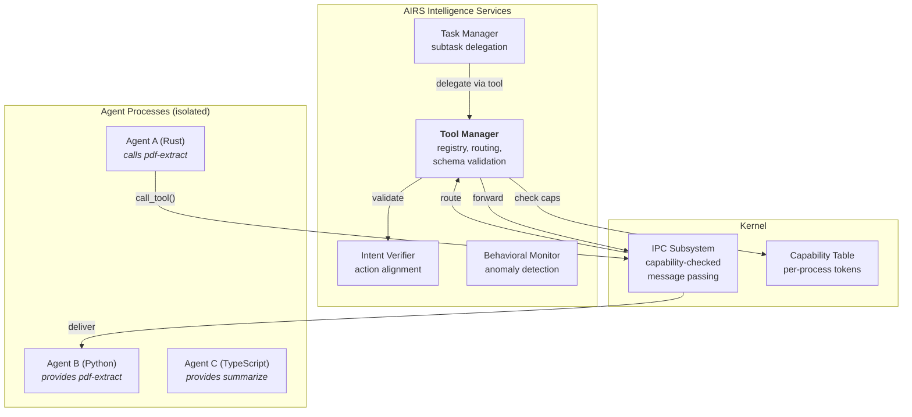
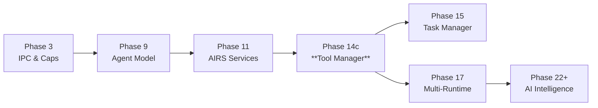

# AIOS Tool Manager

## Deep Technical Architecture

**Parent document:** [airs.md](./airs.md) — AI Runtime Service
**Related:** [agents.md](../applications/agents.md) — Agent Framework & SDK, [ipc.md](../kernel/ipc.md) — IPC & Syscalls, [model.md](../security/model.md) — Security Model, [task-manager.md](./task-manager.md) — Task Decomposition & Delegation, [language-ecosystem.md](../project/language-ecosystem.md) — Multi-Runtime Architecture

-----

## 1. Core Insight

Agents are black boxes. Each runs in its own process with its own capabilities, address space, and runtime. A PDF parser agent knows how to extract text from documents. A research agent knows how to search the web and summarize findings. A coding agent knows how to read, modify, and test code.

The Tool Manager makes these abilities composable. When one agent registers a tool — a named, typed function — any other agent with the right capabilities can call it. The research agent calls `pdf-extract` without knowing it's Python, without sharing memory with the PDF parser, without even knowing the parser's process ID. It just says "I need text from this PDF" and the Tool Manager routes the call, validates capabilities, and delivers the result.

**This is the agent cooperation primitive.** Traditional multi-agent frameworks (LangChain, CrewAI, AutoGen) bolt tool calling on top of an LLM orchestration loop. AIOS builds it into the operating system. Tool calls are IPC messages. Capability enforcement is kernel-level. Sandboxing is process isolation. The framework plumbing disappears — what remains is typed, auditable, capability-gated function invocation across isolated agents.

**Key distinction from MCP:** The Model Context Protocol assumes a single host process orchestrating tool calls to colocated or remote servers. AIOS distributes tool execution across isolated agent processes with kernel-enforced capability boundaries. MCP's tool schema format aligns closely with AIOS's `ToolDefinition` — the protocols are complementary, not competing. AIOS can serve as an MCP client (consuming external MCP servers as tools) and expose its registered tools as MCP endpoints (see [interop.md](./tool-manager/interop.md) §10).



-----

## 2. Architecture

The Tool Manager operates across three tiers:

### 2.1 Three-Tier Architecture

| Tier | Component | Responsibility |
|---|---|---|
| **Agent SDK** | `register_tool()`, `call_tool()`, `list_tools()` | Typed API for agent developers; serialization at language boundaries |
| **AIRS Tool Manager** | `ToolRegistry`, `ToolCallPipeline` | Registration, discovery, schema validation, routing, AI-powered selection |
| **Kernel IPC** | `ToolRegister` syscall, capability enforcement | Capability-checked message passing, process isolation, audit |

```mermaid
flowchart LR
    subgraph SDK["Agent SDK (per-runtime)"]
        direction TB
        RT["register_tool()"]
        CT["call_tool()"]
        LT["list_tools()"]
    end

    subgraph TM["AIRS Tool Manager"]
        direction TB
        TR["ToolRegistry"]
        SV["Schema Validator"]
        RP["Route & Pipeline"]
        TS["Tool Selector (AI)"]
    end

    subgraph KI["Kernel IPC"]
        direction TB
        SC["ToolRegister syscall"]
        CC["Capability Check"]
        MP["Message Passing"]
        AU["Audit Ring"]
    end

    SDK -->|"IPC"| TM
    TM -->|"syscall / IPC"| KI
    KI -->|"result"| TM
    TM -->|"result"| SDK
```



### 2.2 Key Abstractions

| Abstraction | Role | Defined In |
|---|---|---|
| `ToolId` | Unique tool identifier: `(AgentId, tool_name)` | [registry.md](./tool-manager/registry.md) §3.1 |
| `RegisteredTool` | Full tool record: schema, capability, provider, metadata | [registry.md](./tool-manager/registry.md) §3.2 |
| `ToolRegistry` | Central store of all registered tools with secondary indexes | [registry.md](./tool-manager/registry.md) §3.3 |
| `ToolSchema` | JSON Schema parameter/return validation | [registry.md](./tool-manager/registry.md) §4.1 |
| `ToolCallPipeline` | 7-stage execution pipeline from call to result | [execution.md](./tool-manager/execution.md) §5 |
| `ToolSandbox` | Execution isolation boundary (process + capability) | [sandboxing.md](./tool-manager/sandboxing.md) §7 |
| `ToolBridge` | Multi-runtime serialization adapter | [interop.md](./tool-manager/interop.md) §9 |
| `McpAdapter` | MCP protocol bridge for external tool servers | [interop.md](./tool-manager/interop.md) §10 |

-----

## Document Map

| Document | Sections | Content |
|---|---|---|
| **This file** | §1, §2, §13, §14 | Core insight, architecture overview, implementation order, design principles |
| [registry.md](./tool-manager/registry.md) | §3, §4 | Tool registration, data structures, schema system, discovery API, versioning |
| [execution.md](./tool-manager/execution.md) | §5, §6 | 7-stage execution pipeline, capability validation, timeout/cancellation, error handling |
| [sandboxing.md](./tool-manager/sandboxing.md) | §7, §8 | Process isolation, resource limits, capability attenuation, crash containment |
| [interop.md](./tool-manager/interop.md) | §9, §10 | Multi-runtime tool bridging (Rust/Python/TS/WASM), cross-runtime calls, MCP protocol alignment |
| [security.md](./tool-manager/security.md) | §11, §12 | Capability enforcement deep dive, trust levels, rate limiting, audit, observability |
| [intelligence.md](./tool-manager/intelligence.md) | §15, §16, §17 | AI-native tool selection, kernel-internal ML, future directions |

-----

## 13. Implementation Order

Development plan phases (see [development-plan.md](../project/development-plan.md)):

```text
Dev Phase 14c: Tool Manager + Agent Lifecycle         → core framework
  ├── ToolRegistry data structures (RegisteredTool, ToolId, ToolSchema)
  ├── ToolRegister syscall handler in AIRS
  ├── Tool call routing via IPC
  ├── 3-level capability enforcement
  ├── SDK API (register_tool, call_tool, list_tools) for Rust runtime
  ├── Schema validation (JSON Schema subset)
  ├── Task Manager integration (AgentSelector.tool_registry)
  └── Audit logging for all tool calls

Dev Phase 17: Agent Orchestration                     → multi-runtime & advanced
  ├── Multi-runtime SDK bindings (Python, TypeScript, WASM)
  ├── Cross-runtime tool bridging via WIT
  ├── Tool versioning (SemVer, schema diff, deprecation)
  ├── Concurrent tool execution limits
  └── Tool call timeout escalation and cancellation

Dev Phase 22+: AI-Native Tool Intelligence            → intelligent routing
  ├── LLM-powered tool selection (constrained decoding)
  ├── Tool recommendation based on user context
  ├── Behavioral anomaly detection for tool call patterns
  ├── Latency prediction and pre-warming
  └── MCP bridge for external tool servers
```



-----

## 14. Design Principles

1. **Tools are typed IPC.** Schema validation happens before dispatch, not after. A tool call with invalid parameters never reaches the provider.

2. **Capability-first.** No tool call succeeds without kernel-validated capability tokens. The Tool Manager cannot bypass the capability system — it is a consumer of capabilities, not a source.

3. **Provider isolation.** Tool handlers run in the provider's process, never in the caller's. Parameters cross process boundaries through serialized IPC messages. No shared memory, no shared state.

4. **Timeout-mandatory.** Every tool call has a deadline, inherited from the IPC timeout design ([ipc.md](../kernel/ipc.md) §4). A tool call that doesn't return within its deadline fails with `ProviderTimeout` — the caller is never left waiting indefinitely.

5. **Schema is the contract.** JSON Schema defines the tool's API surface. The schema is the single source of truth for what a tool accepts and returns. Language-specific types are projections of this schema.

6. **Runtime-agnostic.** Rust, Python, TypeScript, and WASM tools are equivalent at the registry level. The Tool Manager routes by capability and schema, not by runtime. A Python tool and a Rust tool with the same schema are interchangeable.

7. **Discovery is opt-in.** Tools are visible only to agents with appropriate capabilities. An agent cannot enumerate tools it lacks the capability to call. Discovery respects the principle of least privilege.

8. **Crash-contained.** If a tool provider crashes during execution, the caller receives an error (`ProviderCrashed`). The caller's process is never affected. The crashed provider's tools are deregistered, and the service manager handles restart.

9. **Audited.** Every tool call produces an audit record: caller, provider, tool name, parameter hash, result status, latency. The audit trail is continuous, not opt-in.

10. **AI-assistable.** Tool descriptions are designed for LLM consumption. AIRS selects tools by embedding tool descriptions and matching against user intent — tool naming and description quality directly affects selection accuracy.

-----

## Cross-Reference Index

External docs reference Tool Manager sections by number. This index maps each §N.N to its sub-document:

| Section | Title | Location |
|---|---|---|
| §1 | Core Insight | This file |
| §2, §2.1, §2.2 | Architecture | This file |
| §3, §3.1–§3.4 | Tool Registry | [registry.md](./tool-manager/registry.md) |
| §4, §4.1–§4.4 | Schema System & Discovery | [registry.md](./tool-manager/registry.md) |
| §5, §5.1–§5.7 | Execution Pipeline | [execution.md](./tool-manager/execution.md) |
| §6, §6.1–§6.4 | Timeout, Cancellation, Errors | [execution.md](./tool-manager/execution.md) |
| §7, §7.1–§7.3 | Execution Isolation | [sandboxing.md](./tool-manager/sandboxing.md) |
| §8, §8.1–§8.3 | Crash Containment | [sandboxing.md](./tool-manager/sandboxing.md) |
| §9, §9.1–§9.7 | Multi-Runtime Bridging | [interop.md](./tool-manager/interop.md) |
| §10, §10.1–§10.5 | MCP Alignment | [interop.md](./tool-manager/interop.md) |
| §11, §11.1–§11.4 | Capability Enforcement | [security.md](./tool-manager/security.md) |
| §12, §12.1–§12.4 | Audit & Observability | [security.md](./tool-manager/security.md) |
| §13 | Implementation Order | This file |
| §14 | Design Principles | This file |
| §15, §15.1–§15.4 | AI-Native Tool Selection | [intelligence.md](./tool-manager/intelligence.md) |
| §16, §16.1–§16.3 | Kernel-Internal ML | [intelligence.md](./tool-manager/intelligence.md) |
| §17, §17.1–§17.7 | Future Directions | [intelligence.md](./tool-manager/intelligence.md) |
