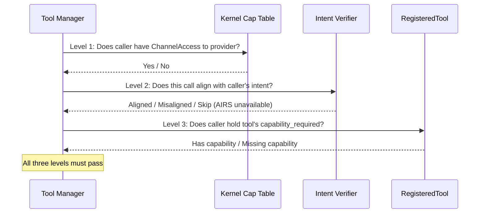
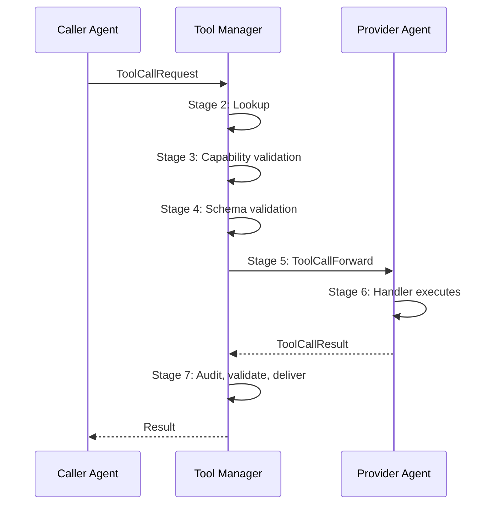

# AIOS Tool Call Execution Pipeline

Part of: [tool-manager.md](../tool-manager.md) — Tool Manager
**Related:** [registry.md](./registry.md) — Tool registration & schema, [sandboxing.md](./sandboxing.md) — Execution isolation, [security.md](./security.md) — Capability enforcement

---

## 5. Tool Call Execution Pipeline

Every tool call passes through a 7-stage pipeline. The pipeline is synchronous from the caller's perspective — the caller blocks (with a timeout) until the result arrives. Internally, the stages execute as an async event sequence within AIRS.

### 5.1 Stage 1: Call Initiation

The caller invokes `ctx.call_tool(name, params)` through the agent SDK. The SDK:

1. Serializes `params` to MessagePack (or JSON in debug mode)
2. Constructs a `ToolCallRequest` IPC message
3. Sends the message to the AIRS Tool Manager channel
4. Blocks the caller (with timeout) waiting for the response

```rust
pub struct ToolCallRequest {
    /// Unique call identifier for correlation
    pub call_id: ToolCallId,
    /// Tool name to invoke
    pub tool_name: ToolName,
    /// Specific provider (optional — if None, Tool Manager selects)
    pub provider: Option<AgentId>,
    /// Serialized parameters
    pub params: Vec<u8>,
    /// Serialization format
    pub format: SerializationFormat,
    /// Caller-specified timeout (capped by system maximum)
    pub timeout_ms: u64,
    /// Caller's agent ID (set by kernel, not caller — tamper-proof)
    pub caller: AgentId,
}

pub enum SerializationFormat {
    MessagePack,
    Json,
}
```

### 5.2 Stage 2: Registry Lookup

The Tool Manager receives the `ToolCallRequest` and looks up the tool:

1. If `provider` is specified: direct lookup via `ToolId(provider, tool_name)`
2. If `provider` is `None`: search `by_name` index for all providers of this tool name
3. If multiple providers found: select using capability filtering and ranking (§5.2.1)
4. If no providers found: return `ToolNotFound` error

**Provider liveness check:** Before proceeding, the Tool Manager verifies the selected provider is alive by checking the service registry. Dead providers are cleaned up lazily — the first call to a dead provider triggers deregistration.

#### 5.2.1 Multi-Provider Selection

When multiple agents provide a tool with the same name, the Tool Manager ranks them:

| Priority | Criterion | Rationale |
|---|---|---|
| 1 | Caller's explicit `provider` field | User knows what they want |
| 2 | Trust level (system > verified > community) | Higher trust = safer default |
| 3 | Historical latency (p50) | Faster providers preferred |
| 4 | Error rate (lower is better) | More reliable providers preferred |
| 5 | Registration order (earlier wins) | Deterministic tie-breaking |

### 5.3 Stage 3: Capability Validation

Three levels of capability validation must pass before a tool call is dispatched. Failure at any level returns a `CapabilityDenied` error to the caller.



**Level 1 — Kernel capability check:**
Does the caller hold a `ChannelAccess` capability that permits IPC with the provider agent? This is checked by the kernel IPC subsystem, not by the Tool Manager. The Tool Manager invokes IPC to the provider; if the kernel rejects it, the call fails at the IPC layer.

Cross-reference: [capabilities.md](../../security/model/capabilities.md) §3.1 for capability token structure.

**Level 2 — Intent verification (AIRS):**
The Intent Verifier ([layers.md](../../security/model/layers.md) §2.1) checks whether this tool call is consistent with what the caller agent is supposed to be doing. This is the AI-powered security layer — a research agent that suddenly calls `delete-file` tools will be flagged even if it holds the capability.

Intent verification is:
- **Synchronous** for destructive tool calls (write, delete, send)
- **Asynchronous** for read-only tool calls (logged, verified in background)
- **Skipped** if AIRS is unavailable (falls back to Level 1 + Level 3 only)

**Level 3 — Tool-specific capability:**
The tool's `capability_required` field specifies what capability the caller must hold. This is checked by the Tool Manager against the caller's capability set. Common patterns:

| Tool | Required Capability | Why |
|---|---|---|
| `pdf-extract` | `ReadSpace("documents")` | Needs document access |
| `send-email` | `Network("smtp.gmail.com")` | Needs network access |
| `web-search` | `Network("*")` | Needs general internet |
| `calculator` | `None` | Pure computation, no resources |

### 5.4 Stage 4: Schema Validation

The caller's parameters are validated against the tool's `ToolSchema` ([registry.md](./registry.md) §4.1):

1. Deserialize `params` from MessagePack/JSON
2. Walk the schema tree, validating each field
3. Check required fields, types, constraints
4. On failure: return `SchemaValidationFailed` with specific error details
5. On success: the validated params proceed to dispatch

**Type coercion rules (lenient mode):**

| Input Type | Schema Type | Coercion | Example |
|---|---|---|---|
| Integer | Number | Allowed | `42` → `42.0` |
| String (numeric) | Number | Rejected | `"42"` ≠ `42.0` |
| String (numeric) | Integer | Rejected | `"42"` ≠ `42` |
| Null | Any (with default) | Replaced with default | `null` → `"en"` |

Strict mode (no coercion) is the default. Lenient mode is opt-in via tool metadata.

### 5.5 Stage 5: IPC Dispatch

The validated call is forwarded to the provider agent via IPC:

1. Construct `ToolCallForward` message (includes `call_id`, `tool_name`, `params`, `caller`)
2. Send via the provider's IPC channel
3. Arm timeout timer (from `ToolCallRequest.timeout_ms`, capped at system maximum)
4. The provider's SDK receives the message and invokes the registered `ToolHandler`

```rust
pub struct ToolCallForward {
    /// Correlation ID (matches ToolCallRequest.call_id)
    pub call_id: ToolCallId,
    /// Tool name to invoke
    pub tool_name: ToolName,
    /// Validated, serialized parameters
    pub params: Vec<u8>,
    /// Serialization format
    pub format: SerializationFormat,
    /// Caller identity (for audit and access decisions)
    pub caller: AgentId,
    /// Remaining timeout budget (decremented by pipeline overhead)
    pub remaining_timeout_ms: u64,
}
```

Cross-reference: [ipc.md](../../kernel/ipc.md) §3 for IPC message mechanics, §4 for timeout architecture.

### 5.6 Stage 6: Provider Execution

The provider agent's SDK receives the `ToolCallForward`, deserializes the parameters, and invokes the registered `ToolHandler::invoke()`:

```rust
#[async_trait]
pub trait ToolHandler: Send + Sync {
    /// Execute the tool with the given parameters.
    ///
    /// The handler runs in the provider's process with the provider's
    /// capabilities. It cannot access the caller's address space or
    /// capabilities.
    async fn invoke(&self, params: Value, ctx: &dyn AgentContext) -> Result<Value>;
}
```

**Execution constraints:**

- The handler runs in the provider's process and address space
- It has access to the provider's capabilities, not the caller's
- Resource usage is bounded by the provider's `KernelResourceLimits` ([process.rs](../../kernel/task/process.rs))
- If the handler panics, the provider process is terminated (see [sandboxing.md](./sandboxing.md) §8.1)

Cross-reference: [agents.md](../../applications/agents.md) §5.3 for `ToolHandler` and SDK integration.

### 5.7 Stage 7: Result Delivery

The handler returns a `Result<Value>` which flows back through the pipeline:

1. Provider SDK serializes the result
2. Result sent via IPC back to the Tool Manager
3. **Optional output validation:** If the tool has a `return_schema`, the result is validated (§4.2)
4. **Audit log entry:** Record caller, provider, tool name, parameter hash, result status, latency (see [security.md](./security.md) §12.1)
5. **Latency recording:** Update histogram for this tool (see [security.md](./security.md) §12.2)
6. Result forwarded to caller via IPC
7. Caller's SDK deserializes and returns to the calling code



**Result types:**

```rust
pub struct ToolCallResult {
    /// Correlation ID
    pub call_id: ToolCallId,
    /// Success or error
    pub outcome: ToolOutcome,
    /// Execution latency (provider-side, microseconds)
    pub latency_us: u64,
}

pub enum ToolOutcome {
    /// Successful execution with return value
    Success(Value),
    /// Provider returned an application-level error
    ProviderError { code: String, message: String },
    /// Provider process crashed during execution
    ProviderCrashed,
    /// Provider did not respond within timeout
    ProviderTimeout,
}
```

---

## 6. Timeout, Cancellation, and Error Handling

### 6.1 Timeout Model

Every tool call has a mandatory timeout. This inherits from the IPC timeout architecture ([ipc.md](../../kernel/ipc.md) §4) and prevents callers from waiting indefinitely on unresponsive providers.

**Timeout hierarchy:**

| Source | Priority | Default |
|---|---|---|
| Caller-specified (`timeout_ms`) | Highest (if ≤ system max) | — |
| Tool metadata (`latency_class`) | Medium | Instant: 100ms, Fast: 5s, Slow: 60s, LongRunning: 300s |
| System maximum | Lowest (cap) | 600s (10 minutes) |

**Timeout budget tracking:** The pipeline deducts processing time from the caller's timeout budget at each stage. If schema validation takes 2ms, the provider receives `remaining_timeout_ms = original - 2`. The provider's handler sees only the remaining budget.

### 6.2 Cancellation

Cancellation is caller-initiated:

1. Caller calls `cancel_tool_call(call_id)` through the SDK
2. SDK sends `ToolCallCancel` IPC message to the Tool Manager
3. Tool Manager forwards cancellation to the provider via IPC
4. Provider's SDK sets a cancellation flag on the handler context
5. Well-behaved handlers check the flag periodically and return early
6. Ill-behaved handlers ignore the flag — the timeout still applies

```rust
/// Cancellation-aware handler pattern
#[async_trait]
impl ToolHandler for LongRunningHandler {
    async fn invoke(&self, params: Value, ctx: &dyn AgentContext) -> Result<Value> {
        for chunk in self.process_chunks(&params)? {
            if ctx.is_cancelled() {
                return Err(ToolError::Cancelled);
            }
            self.process_one(chunk).await?;
        }
        Ok(self.finalize()?)
    }
}
```

**Partial results:** If a tool supports partial results, it can return what it has computed so far upon cancellation. The `ToolOutcome` for cancelled calls includes any partial data the provider emitted before stopping.

### 6.3 Error Taxonomy

Tool call errors fall into distinct categories with different recovery strategies:

```rust
pub enum ToolError {
    // === Registry errors (Stage 2) ===
    /// No tool with this name exists (or caller can't see it)
    ToolNotFound,
    /// Tool exists but is deprecated past sunset date
    ToolDeprecated { replacement: Option<ToolId> },

    // === Capability errors (Stage 3) ===
    /// Caller lacks capability to communicate with provider
    ChannelCapabilityDenied,
    /// Caller's intent doesn't align with tool call (Layer 2)
    IntentMisaligned { reason: String },
    /// Caller lacks the tool-specific capability
    ToolCapabilityDenied { required: Capability },

    // === Schema errors (Stage 4) ===
    /// Parameters don't match the tool's schema
    SchemaValidationFailed(Vec<SchemaValidationError>),
    /// Parameters exceed maximum payload size
    PayloadTooLarge { max_bytes: usize, actual_bytes: usize },

    // === Execution errors (Stages 5–7) ===
    /// Provider process crashed during execution
    ProviderCrashed,
    /// Provider didn't respond within timeout
    ProviderTimeout,
    /// Provider rejected the call (application-level error)
    ProviderRejected { code: String, message: String },
    /// Caller cancelled the call
    Cancelled,

    // === Rate limiting ===
    /// Caller has exceeded tool call rate limit
    RateLimited { retry_after_ms: u64 },
}
```

### 6.4 Retry Policy

The Tool Manager does **not** automatically retry failed tool calls. This is a deliberate design choice:

- **Provider crashes** may leave side effects. Retrying a `send-email` tool after a crash could send duplicate emails.
- **Timeouts** may indicate the provider is overloaded. Immediate retry adds load.
- **Callers know their context.** A caller building a search result can retry safely; a caller sending a notification cannot.

Instead, the Tool Manager provides information to help callers make retry decisions:

| Tool Metadata | How It Helps |
|---|---|
| `idempotent: true` | Safe to retry — no side effects |
| `latency_class` | Helps set appropriate retry timeout |
| `ProviderError.code` | Application-defined error codes for programmatic retry logic |

**Circuit breaker pattern:** If a provider's tool fails repeatedly (configurable threshold: N failures in M seconds), the Tool Manager marks the tool as `Degraded` and stops routing new calls to it for a cooldown period. This prevents cascading failures where a broken provider overwhelms the system with error responses.
