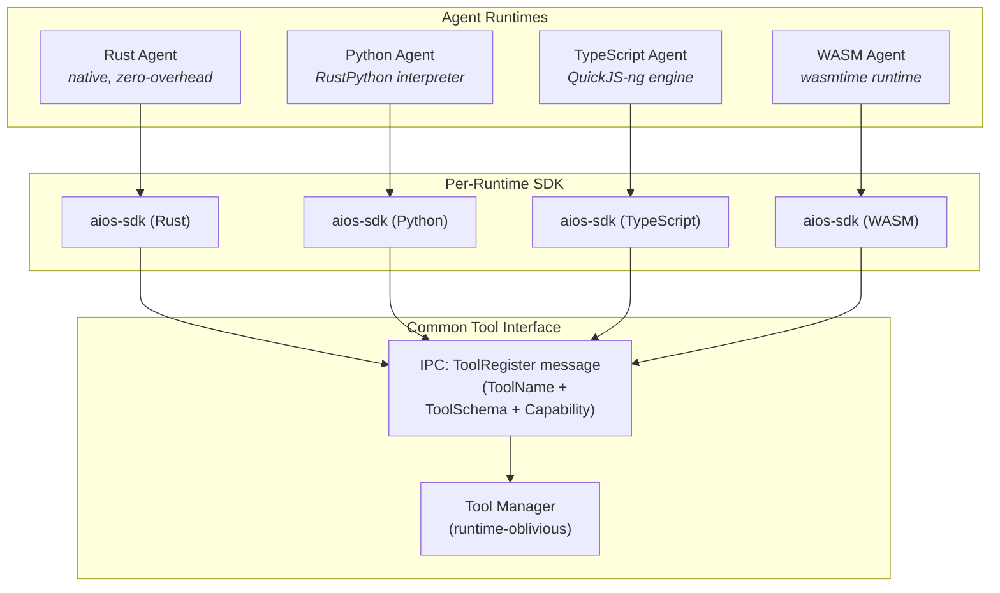
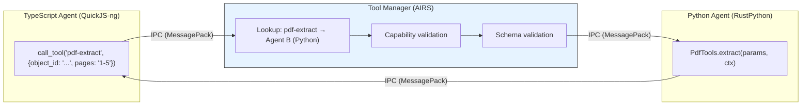
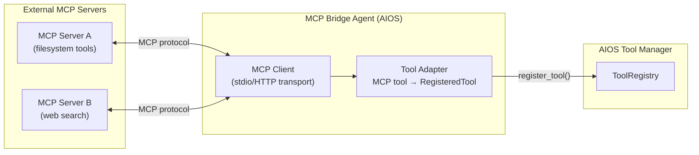

# AIOS Multi-Runtime Tool Bridging & MCP Alignment

Part of: [tool-manager.md](../tool-manager.md) — Tool Manager
**Related:** [registry.md](./registry.md) — Tool registration, [execution.md](./execution.md) — Execution pipeline, [security.md](./security.md) — Capability enforcement

---

## 9. Multi-Runtime Tool Bridging

AIOS supports four agent runtimes: Rust (native), Python (RustPython), TypeScript (QuickJS-ng), and WebAssembly (wasmtime). Tools registered from any runtime are interchangeable at the Tool Manager level — the manager routes by capability and schema, not by runtime.

### 9.1 Runtime-Agnostic Registration

All four runtimes register tools through the same IPC-based path. The runtime-specific SDK handles serialization and type marshaling; the Tool Manager receives a `ToolRegister` IPC message with identical format regardless of source runtime.



**Key property:** The `ToolSchema` is JSON Schema — a language-neutral format. A tool registered from Python with parameters `{"filename": string, "pages": string}` is indistinguishable from the same schema registered from Rust or TypeScript. The Tool Manager never inspects or cares about the provider's runtime.

Cross-reference: [language-ecosystem.md](../../project/language-ecosystem.md) §1 for the `RuntimeAdapter` trait that each runtime implements.

### 9.2 Serialization at Boundaries

Tool parameters and results cross process boundaries through serialized IPC messages. The serialization format is negotiated between the Tool Manager and the SDKs:

| Format | When Used | Overhead | Features |
|---|---|---|---|
| MessagePack | Default (production) | Low (~10% vs raw) | Binary, compact, fast |
| JSON | Debug mode, MCP bridge | Medium (~50% vs raw) | Human-readable, debuggable |

**Why not shared memory:** Cross-runtime shared memory requires coordinating garbage collectors across interpreters. Python's reference-counting GC and JavaScript's mark-and-sweep GC use different strategies for tracking live objects. Sharing memory between them creates subtle race conditions that are nearly impossible to debug. Serialization provides a clean ownership boundary — each side works with its own copy.

This design matches the approach of seL4 CAmkES connectors and Fuchsia FIDL. See [operations.md](../../project/language-ecosystem/operations.md) §9 for the full rationale.

**Exception: bulk data via object references.** For large payloads, tools should pass `ObjectId` references rather than inline data. The provider reads the object from Space Storage using its own capabilities. This avoids copying large buffers through IPC.

### 9.3 Rust Tool Example

Rust tools are the most efficient — no interpreter overhead, direct SDK calls:

```rust
use aios_sdk::prelude::*;

#[agent(
    name = "Code Analyzer",
    capabilities = [ReadSpace("source")],
)]
async fn code_analyzer(ctx: AgentContext) -> Result<()> {
    ctx.register_tool(ToolDefinition {
        name: "analyze-complexity".into(),
        description: "Calculate cyclomatic complexity of a source file".into(),
        parameters: json_schema!({
            "object_id": { "type": "string", "description": "ObjectId of source file" },
            "language": { "type": "string", "enum": ["rust", "python", "typescript"] },
        }),
        capability_required: Some(Capability::ReadSpace("source".into())),
        handler: Box::new(ComplexityHandler),
    }).await?;

    ctx.run_loop().await
}

struct ComplexityHandler;

#[async_trait]
impl ToolHandler for ComplexityHandler {
    async fn invoke(&self, params: Value, ctx: &dyn AgentContext) -> Result<Value> {
        let object_id: ObjectId = params["object_id"].as_str()
            .ok_or(ToolError::InvalidParams)?
            .parse()?;
        let source = ctx.spaces().read(object_id).await?;
        let complexity = calculate_complexity(&source, &params["language"])?;
        Ok(json!({ "complexity": complexity, "rating": rate(complexity) }))
    }
}
```

### 9.4 Python Tool Example

Python tools run inside RustPython. The Python SDK marshals between Python dicts and JSON Schema:

```python
from aios_sdk import Agent, tool, Capability

@Agent(
    name="PDF Tools",
    capabilities=[Capability.ReadSpace("documents")]
)
class PdfTools:

    @tool(
        name="pdf-extract",
        description="Extract text and metadata from a PDF document",
        capability_required=Capability.ReadSpace("documents"),
        parameters={
            "object_id": {"type": "string", "description": "ObjectId of the PDF"},
            "pages": {"type": "string", "description": "Page range, e.g. '1-5'"},
        }
    )
    async def extract(self, params, ctx):
        obj = await ctx.spaces.read(params["object_id"])
        text = extract_pdf_text(obj, params.get("pages"))
        return {"text": text, "page_count": count_pages(obj)}
```

**Marshaling path:** `Python dict` → `json.dumps()` → `IPC (MessagePack)` → `Tool Manager` → (on call) → `IPC (MessagePack)` → `json.loads()` → `Python dict`

The Python SDK handles all marshaling transparently. The `@tool` decorator generates the JSON Schema from the `parameters` dict, registers via IPC at agent startup, and routes incoming tool calls to the decorated method.

### 9.5 TypeScript Tool Example

TypeScript tools run inside QuickJS-ng. The TypeScript SDK uses standard TypeScript types:

```typescript
import { Agent, tool, Capability } from 'aios-sdk';

@Agent({
  name: 'Summarizer',
  capabilities: [Capability.ReadSpace('documents'), Capability.Inference],
})
class Summarizer {

  @tool({
    name: 'summarize',
    description: 'Summarize a document using AI inference',
    capabilityRequired: Capability.ReadSpace('documents'),
    parameters: {
      object_id: { type: 'string', description: 'ObjectId of the document' },
      max_words: { type: 'integer', description: 'Maximum summary length', default: 200 },
    },
  })
  async summarize(params: { object_id: string; max_words?: number }, ctx: AgentContext) {
    const doc = await ctx.spaces.read(params.object_id);
    const summary = await ctx.ai.complete(
      `Summarize in ${params.max_words ?? 200} words: ${doc}`,
      { maxTokens: params.max_words ?? 200 }
    );
    return { summary, word_count: summary.split(' ').length };
  }
}
```

### 9.6 WASM Tool Example

WASM tools use the Component Model with WIT interfaces for tool registration:

```text
// tool-provider.wit
package my-tools:image-tools@1.0.0;

interface tool-handler {
    record tool-params {
        object-id: string,
        width: u32,
        height: u32,
        format: string,
    }

    record tool-result {
        output-id: string,
        original-size: u64,
        resized-size: u64,
    }

    resize: func(params: tool-params) -> result<tool-result, string>;
}

world image-tool-provider {
    import aios:sdk/spaces@0.1.0;
    export tool-handler;
}
```

The WASM runtime (wasmtime) bridges WIT types to the Tool Manager's JSON Schema format:
- WIT `record` fields → JSON Schema `object` properties
- WIT `string` → JSON Schema `"type": "string"`
- WIT `u32` → JSON Schema `"type": "integer"`
- WIT `result<T, E>` → Tool returns `T` on success, `ProviderError` with `E` on failure

Cross-reference: [operations.md](../../project/language-ecosystem/operations.md) §9 for WIT and the Component Model's role in AIOS.

### 9.7 Cross-Runtime Tool Call

The Tool Manager is runtime-oblivious. A TypeScript agent calling a Python tool works identically to a Rust agent calling a Rust tool:



The caller never knows the provider's runtime. The Tool Manager's abstraction layer ensures:
- Parameter types are validated against the schema (runtime-neutral)
- Serialization format is consistent (MessagePack/JSON)
- Errors are normalized to `ToolError` variants
- Latency includes serialization overhead from both sides

---

## 10. MCP (Model Context Protocol) Alignment

The Model Context Protocol (MCP) is Anthropic's open standard for connecting AI models to external tools and data sources. AIOS's Tool Manager and MCP share foundational concepts but differ in scope, security model, and transport.

### 10.1 MCP Overview

MCP defines a client-server protocol where:

- **MCP Server:** Exposes tools, resources, and prompts to an AI host
- **MCP Client:** Connects to servers and makes tools available to AI models
- **Transport:** Stdio (local), Streamable HTTP (remote), with OAuth 2.1 for authentication
- **Tool format:** Name + description + JSON Schema parameters (identical to OpenAI function calling format)
- **Lifecycle:** Initialize → list tools → call tool → receive result

### 10.2 Alignment Points

AIOS Tool Manager aligns with MCP in several fundamental ways:

| Concept | MCP | AIOS Tool Manager | Alignment |
|---|---|---|---|
| Tool definition | `name + description + inputSchema (JSON Schema)` | `ToolName + description + ToolSchema (JSON Schema)` | **Identical format** |
| Tool call format | `{ name, arguments: { ... } }` | `ToolCallRequest { tool_name, params }` | **Identical structure** |
| Tool result | `{ content: [{ type, text }] }` | `ToolCallResult { outcome: Success(Value) }` | **Compatible** |
| Tool discovery | `tools/list` → array of tool definitions | `list_tools()` → `Vec<ToolInfo>` | **Same concept** |
| Schema validation | Server-side or client-side | Tool Manager validates before dispatch | **Same concept** |
| Tool descriptions for LLM | Part of protocol | Core design (AI-assistable, §14 principle 10) | **Aligned philosophy** |

### 10.3 Divergence Points

Where AIOS differs from MCP, and why:

| Aspect | MCP | AIOS Tool Manager | Why AIOS Diverges |
|---|---|---|---|
| **Isolation model** | Tools run in server process (shared memory possible) | Tools run in isolated agent processes (no shared memory) | OS-level security: kernel-enforced address space separation |
| **Authorization** | OAuth 2.1 for transport auth; no per-tool capability model | 3-level capability validation (kernel + intent + tool-specific) | MCP trusts the server; AIOS trusts nobody — every call is validated |
| **Topology** | 1:1 client-server (one host, one server) | N:M mesh (any agent calls any tool, subject to capabilities) | Multi-agent OS vs single-host LLM |
| **Transport** | Stdio / Streamable HTTP | Kernel IPC (sub-5µs latency) | In-OS calls don't need HTTP overhead |
| **Provider identity** | Server URL / process path | AgentId (kernel-assigned, tamper-proof) | OS agents have kernel-verified identity |
| **Audit** | No built-in audit trail | Every call audited (caller, provider, hash, latency) | OS security requirement |
| **Trust levels** | Implicit (server is trusted or not) | Explicit 4-tier trust (System/Verified/Community/Untrusted) | Graduated trust for agent ecosystem |
| **Rate limiting** | No built-in rate limiting | Per-caller, per-tool, and global rate limits | Multi-tenant OS environment |
| **Tool versioning** | No versioning standard | SemVer with schema diff and deprecation flow | Long-lived OS services need version management |
| **Resources** | MCP has a `resources` concept (data sources) | AIOS uses Space Storage objects | Different data model — MCP resources map to AIOS Space objects |
| **Prompts** | MCP has a `prompts` concept (reusable templates) | AIOS uses Conversation Manager + Context Engine | Different abstraction — MCP prompts map to AIOS conversation context |
| **Sampling** | MCP allows servers to request LLM completions | AIOS agents request inference through AgentContext.ai | Tighter integration — AIOS inference is kernel-scheduled |

### 10.4 MCP Bridge

AIOS exposes an MCP bridge agent that enables two-way interoperability with the MCP ecosystem:

**Inbound: External MCP servers as AIOS tools**

An MCP adapter agent connects to external MCP servers (via stdio or HTTP) and registers their tools in the AIOS Tool Registry:



**How it works:**

1. The MCP bridge agent is configured with a list of MCP servers (config file or user settings)
2. At startup, the bridge connects to each server and calls `tools/list`
3. For each MCP tool, the bridge creates a `RegisteredTool` with:
   - Name: `mcp-{server_name}-{tool_name}` (namespaced to avoid collisions)
   - Schema: Directly from MCP's `inputSchema` (already JSON Schema)
   - Capability: `Network(server_endpoint)` for HTTP servers; `None` for local stdio servers
4. When an AIOS agent calls an MCP-bridged tool, the bridge translates the call to MCP `tools/call` format, sends it to the external server, and returns the result
5. MCP resources are exposed as read-only tools (`mcp-{server}-read-{resource}`)

**Security considerations for MCP bridge:**

- External MCP servers are treated as **Untrusted (TL0)** by default
- All MCP tool calls go through full 3-level capability validation
- The bridge agent itself needs `Network` capabilities for remote MCP servers
- MCP servers cannot access AIOS spaces, capabilities, or agent state — they only receive the parameters the caller provides
- Response data from MCP servers is treated as untrusted input (the adversarial defense layer screens it)

**Outbound: AIOS tools as MCP servers**

AIOS can expose registered tools as an MCP server, allowing external LLM hosts (Claude Desktop, VS Code, etc.) to call AIOS tools:

1. AIOS runs an MCP server (Streamable HTTP transport) on a configured endpoint
2. The server exposes a filtered view of the Tool Registry (only tools marked `mcp_exportable: true`)
3. External clients connect via MCP protocol and call tools through the standard MCP lifecycle
4. Authentication: AIOS validates the external client's identity via OAuth 2.1
5. Each external client is mapped to an AIOS agent identity with restricted capabilities

### 10.5 Tool Definition Portability

AIOS tool definitions and MCP tool definitions are structurally compatible:

```rust
/// Convert AIOS tool to MCP tool definition
pub fn to_mcp_tool(tool: &RegisteredTool) -> McpToolDefinition {
    McpToolDefinition {
        name: tool.id.name.as_str().to_string(),
        description: Some(tool.description.clone()),
        input_schema: tool.parameters.to_json_schema(),
    }
}

/// Convert MCP tool to AIOS RegisteredTool (partial — needs provider info)
pub fn from_mcp_tool(
    mcp_tool: &McpToolDefinition,
    bridge_agent: AgentId,
    server_name: &str,
) -> RegisteredTool {
    RegisteredTool {
        id: ToolId {
            provider: bridge_agent,
            name: ToolName::new(&format!("mcp-{}-{}", server_name, mcp_tool.name))
                .expect("valid MCP tool name"),
        },
        description: mcp_tool.description.clone().unwrap_or_default(),
        parameters: ToolSchema::from_json_schema(&mcp_tool.input_schema),
        return_schema: None, // MCP doesn't define output schemas
        capability_required: None,
        version: ToolVersion { major: 1, minor: 0, patch: 0 },
        deprecated: false,
        deprecation_info: None,
        tags: vec!["mcp".into(), server_name.into()],
        registered_at: Timestamp::now(),
        idempotent: false, // Unknown — conservative default
        latency_class: LatencyClass::Slow, // External call — conservative
    }
}
```

**Limitations of portability:**

- AIOS capability requirements have no MCP equivalent — they are dropped during export
- MCP `resources` and `prompts` have no direct AIOS tool equivalent — they map to Spaces and Conversation Manager respectively
- MCP's `sampling` (server requests LLM completion) maps to AIOS's `AgentContext.ai.complete()` but requires the bridge to hold an `Inference` capability
- MCP tool descriptions may need enhancement for AIOS's AI-powered tool selection (richer descriptions improve selection accuracy)
