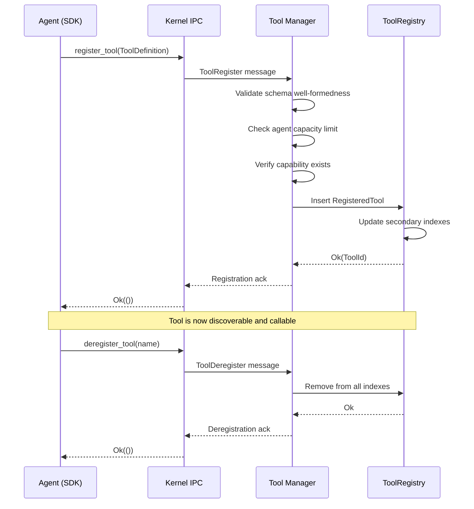
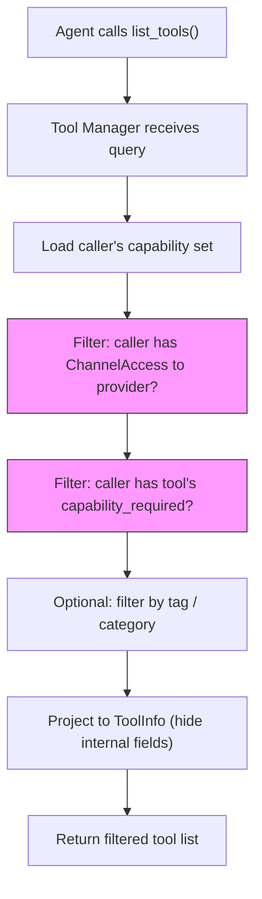

# AIOS Tool Registry & Schema System

Part of: [tool-manager.md](../tool-manager.md) — Tool Manager
**Related:** [execution.md](./execution.md) — Execution pipeline, [security.md](./security.md) — Capability enforcement, [interop.md](./interop.md) — Multi-runtime bridging

---

## 3. Tool Registry

The Tool Registry is the central store of all tools registered by agents in the system. It lives inside the AIRS process as part of the Tool Manager intelligence service, with secondary indexes for efficient lookup by category, capability, and provider.

### 3.1 ToolId and Naming

A tool is uniquely identified by the combination of its provider agent and its name:

```rust
/// Globally unique tool identifier
#[derive(Clone, Debug, Eq, PartialEq, Hash)]
pub struct ToolId {
    /// The agent that provides this tool
    pub provider: AgentId,
    /// The tool name (unique within this agent)
    pub name: ToolName,
}

/// Tool name constraints: lowercase alphanumeric + hyphens, 1–64 chars
#[derive(Clone, Debug, Eq, PartialEq, Hash)]
pub struct ToolName(String);

impl ToolName {
    pub fn new(name: &str) -> Result<Self, ToolError> {
        if name.is_empty() || name.len() > 64 {
            return Err(ToolError::InvalidName);
        }
        if !name.chars().all(|c| c.is_ascii_lowercase() || c.is_ascii_digit() || c == '-') {
            return Err(ToolError::InvalidName);
        }
        if name.starts_with('-') || name.ends_with('-') {
            return Err(ToolError::InvalidName);
        }
        Ok(Self(name.to_string()))
    }
}
```

**Naming conventions:**

| Pattern | Example | Usage |
|---|---|---|
| `verb-noun` | `extract-pdf`, `search-web` | Standard tool names |
| `namespace-verb-noun` | `fs-read-file`, `net-fetch-url` | Namespaced system tools |
| `noun` | `calculator`, `translator` | Simple single-purpose tools |

**Collision handling:** Since `ToolId` includes the provider `AgentId`, two agents can register tools with the same name without conflict. When a caller invokes `call_tool("pdf-extract", params)`, the Tool Manager resolves the provider using capability-based filtering — the caller only sees tools from agents it has communication capabilities with.

### 3.2 RegisteredTool

The full tool record stored in the registry:

```rust
pub struct RegisteredTool {
    /// Unique identifier
    pub id: ToolId,
    /// Human-readable description (used by AIRS for tool selection)
    pub description: String,
    /// JSON Schema describing accepted parameters
    pub parameters: ToolSchema,
    /// JSON Schema describing the return value (optional)
    pub return_schema: Option<ToolSchema>,
    /// Capability the caller must hold to invoke this tool
    pub capability_required: Option<Capability>,
    /// Tool version (SemVer)
    pub version: ToolVersion,
    /// Whether this tool version is deprecated
    pub deprecated: bool,
    /// Deprecation message and replacement tool (if deprecated)
    pub deprecation_info: Option<DeprecationInfo>,
    /// Metadata tags for categorization and discovery
    pub tags: Vec<String>,
    /// Registration timestamp
    pub registered_at: Timestamp,
    /// Idempotency hint: can this tool be safely retried?
    pub idempotent: bool,
    /// Expected latency class
    pub latency_class: LatencyClass,
}

pub enum LatencyClass {
    /// Sub-millisecond (in-memory computation)
    Instant,
    /// Milliseconds (local I/O, simple processing)
    Fast,
    /// Seconds (inference, network, heavy computation)
    Slow,
    /// Minutes (long-running workflows)
    LongRunning,
}

pub struct DeprecationInfo {
    /// Human-readable deprecation message
    pub message: String,
    /// Replacement tool (if any)
    pub replacement: Option<ToolId>,
    /// Grace period end (after which tool may be deregistered)
    pub sunset_date: Option<Timestamp>,
}
```

**Reconciliation note:** The `RegisteredTool` struct consolidates two slightly different definitions from existing docs:

- [intelligence-services.md](../airs/intelligence-services.md) §5.7 defines `RegisteredTool` with `agent: AgentId` — this maps to `id.provider`
- [agents.md](../../applications/agents.md) §5.3 defines `ToolDefinition` with `handler: Box<dyn ToolHandler>` — the handler lives in the agent's SDK, not in the registry

The registry stores the *metadata* about the tool. The *handler* lives in the provider agent's process and is never serialized into the registry. The SDK-side `ToolDefinition` is the agent developer's view; `RegisteredTool` is the Tool Manager's internal view.

### 3.3 ToolRegistry Data Structures

```rust
pub struct ToolRegistry {
    /// Primary index: ToolId → RegisteredTool
    tools: HashMap<ToolId, RegisteredTool>,
    /// Secondary index: tool name → list of providers
    by_name: HashMap<ToolName, Vec<AgentId>>,
    /// Secondary index: tag → list of ToolIds
    by_tag: HashMap<String, Vec<ToolId>>,
    /// Secondary index: provider → list of ToolIds
    by_provider: HashMap<AgentId, Vec<ToolId>>,
    /// Capacity limits
    config: RegistryConfig,
}

pub struct RegistryConfig {
    /// Maximum tools per agent (prevents registry flooding)
    pub max_tools_per_agent: usize,     // default: 64
    /// Maximum total tools in the system
    pub max_tools_total: usize,         // default: 4096
    /// Maximum schema size in bytes (prevents oversized schemas)
    pub max_schema_bytes: usize,        // default: 16384
    /// Maximum description length
    pub max_description_chars: usize,   // default: 1024
}
```

**Thread-safety model:** The ToolRegistry lives inside the AIRS process. AIRS is single-threaded with an event loop (see [airs.md](../airs.md) §2.1). All registry mutations are serialized through the event loop — no locks required. Read queries during tool call routing are served from the same thread.

**Integration with Task Manager:** The Task Manager's `AgentSelector` ([task-manager.md](../task-manager.md) §5.2) holds a reference to the `ToolRegistry` for looking up tools that match subtask actions. This reference is a read-only view refreshed on each delegation cycle.

### 3.4 Registration Lifecycle

Tools go through a defined lifecycle from registration to deregistration:



**Registration validation checklist:**

1. **Schema well-formedness:** The JSON Schema must parse correctly and use only the supported subset (see §4.1)
2. **Capacity check:** The provider agent must not exceed `max_tools_per_agent`; the system must not exceed `max_tools_total`
3. **Name validity:** Must conform to `ToolName` constraints (§3.1)
4. **Capability existence:** If `capability_required` is specified, the capability type must be recognized by the kernel
5. **Description non-empty:** Tools without descriptions are rejected (descriptions are essential for AI-powered selection)

**Update (version bump):** An agent re-registers a tool with the same name but a new `ToolVersion`. The old entry is replaced atomically. In-flight calls to the old version complete normally; new calls route to the new version.

**Provider death cleanup:** When the service manager detects an agent process death ([ipc.md](../../kernel/ipc.md) §5.5), it notifies the Tool Manager, which deregisters all tools from that agent. Any in-flight calls receive `ProviderCrashed` errors. See [sandboxing.md](./sandboxing.md) §8.2 for full crash recovery details.

---

## 4. Schema System and Discovery

### 4.1 ToolSchema

Tool parameters and return values are defined using a JSON Schema subset. JSON Schema was chosen over WIT for tool definitions because:

- **LLM compatibility:** Every major LLM tool-calling format (OpenAI, Anthropic, Google) uses JSON Schema for parameters. AIOS tool schemas are directly consumable by AIRS's inference engine for constrained decoding.
- **Runtime neutrality:** JSON Schema is language-agnostic. Rust, Python, TypeScript, and WASM agents all work with JSON natively.
- **MCP alignment:** The Model Context Protocol uses JSON Schema for tool definitions (see [interop.md](./interop.md) §10.2).

WIT remains the standard for *agent API contracts* and *IPC interfaces* (see [operations.md](../../project/language-ecosystem/operations.md) §9). The distinction: WIT defines the plumbing (how agents connect); JSON Schema defines the tool surface (what tools accept and return).

**Supported JSON Schema subset:**

```rust
pub enum SchemaType {
    /// Primitive types
    String,
    Number,
    Integer,
    Boolean,
    Null,
    /// Compound types
    Object { properties: HashMap<String, SchemaField> },
    Array { items: Box<SchemaType> },
    /// Union type (matches any of the listed types)
    OneOf(Vec<SchemaType>),
}

pub struct SchemaField {
    pub schema_type: SchemaType,
    pub description: Option<String>,
    pub required: bool,
    pub default: Option<Value>,
    pub enum_values: Option<Vec<Value>>,
    /// String constraints
    pub min_length: Option<usize>,
    pub max_length: Option<usize>,
    pub pattern: Option<String>,
    /// Number constraints
    pub minimum: Option<f64>,
    pub maximum: Option<f64>,
}
```

**Not supported** (kept out for simplicity and security):

- `$ref` / `$defs` (no recursive schemas — prevents DoS via deeply nested validation)
- `additionalProperties` (all properties must be explicitly declared)
- `if`/`then`/`else` conditional schemas
- External schema references (`$id` with URIs)

### 4.2 Schema Validation

Validation occurs at two points in the tool call pipeline:

1. **Input validation (Stage 4):** Before dispatching a call to the provider, the Tool Manager validates the caller's parameters against the tool's `parameters` schema. Invalid parameters never reach the provider.

2. **Output validation (optional, Stage 7):** If the tool has a `return_schema`, the result is validated before delivery to the caller. This catches provider bugs early.

**Validation errors** are returned as structured IPC errors:

```rust
pub enum SchemaValidationError {
    /// A required field is missing
    MissingField { path: String, field: String },
    /// A field has the wrong type
    TypeMismatch { path: String, expected: String, got: String },
    /// A string field violates constraints (length, pattern)
    StringConstraint { path: String, constraint: String },
    /// A number field violates constraints (min, max)
    NumberConstraint { path: String, constraint: String },
    /// An enum field has an invalid value
    InvalidEnum { path: String, allowed: Vec<String> },
    /// The parameters exceed the maximum size
    PayloadTooLarge { max_bytes: usize, actual_bytes: usize },
}
```

### 4.3 Discovery API

Agents discover available tools through the `list_tools()` SDK call. The returned list is **capability-filtered** — an agent only sees tools from providers it has communication capabilities with.



**Discovery modes:**

| Mode | API | Use Case |
|---|---|---|
| List all | `list_tools()` | Browse available tools |
| Filter by tag | `list_tools_by_tag("pdf")` | Find tools in a category |
| Search by description | `search_tools("extract text from documents")` | Semantic search via Space Indexer embeddings |
| Lookup by name | `get_tool_info("pdf-extract")` | Get details for a known tool |

**Semantic search integration:** Tool descriptions are indexed by the Space Indexer ([intelligence-services.md](../airs/intelligence-services.md) §5.1) as part of the system knowledge graph. When an agent or AIRS searches for tools by description, the query is embedded and matched against tool description embeddings. This enables natural-language tool discovery — "I need something that can extract text from images" finds an `ocr-extract` tool even without knowing its exact name.

### 4.4 Tool Versioning

Tools follow semantic versioning (SemVer):

```rust
pub struct ToolVersion {
    pub major: u16,
    pub minor: u16,
    pub patch: u16,
}
```

**Version compatibility rules:**

| Change Type | Version Bump | Breaking? | Example |
|---|---|---|---|
| Add optional parameter | Minor | No | New `format` param with default |
| Add new return field | Minor | No | Extra metadata in result |
| Remove parameter | Major | Yes | Drop required `pages` param |
| Change parameter type | Major | Yes | `pages: string` → `pages: array` |
| Bug fix (no schema change) | Patch | No | Fix edge case in handler |

**Schema diff detection:** When a tool is re-registered with a new version, the Tool Manager compares the old and new schemas. If the diff includes breaking changes (removed required fields, type changes) but only the minor version was bumped, registration fails with `BreakingChangeRequiresMajorBump`.

**Deprecation flow:**

1. Provider registers new version with `deprecated: false` and marks old version `deprecated: true` with a `DeprecationInfo` pointing to the new version
2. Callers receive a deprecation warning in the tool call response headers (non-blocking)
3. After the sunset date, the old version is automatically deregistered
4. Callers that haven't updated receive `ToolNotFound` and must migrate
