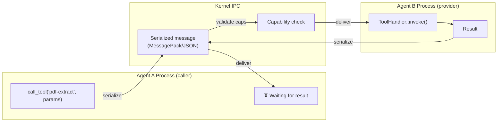
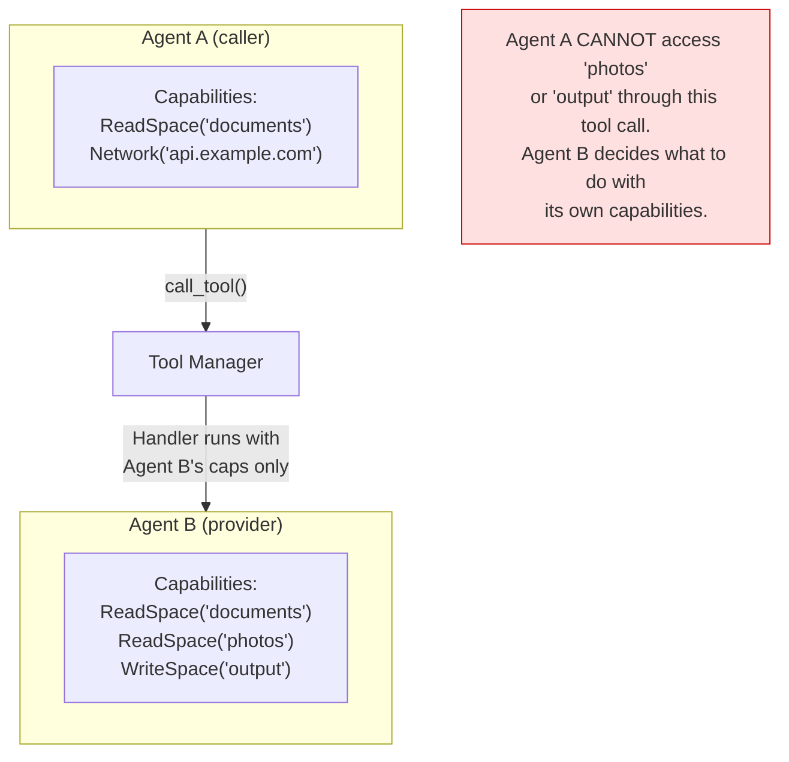

# AIOS Tool Execution Isolation & Crash Containment

Part of: [tool-manager.md](../tool-manager.md) — Tool Manager
**Related:** [execution.md](./execution.md) — Execution pipeline, [security.md](./security.md) — Capability enforcement, [interop.md](./interop.md) — Multi-runtime bridging

---

## 7. Execution Isolation

Tool execution inherits AIOS's process-level isolation model. Every agent runs in its own address space with its own capability set. When Agent A calls a tool provided by Agent B, the tool handler executes in Agent B's process — never in Agent A's.

### 7.1 Process-Level Isolation



**Isolation guarantees:**

| Property | Mechanism | Cross-Reference |
|---|---|---|
| Address space separation | Separate TTBR0 per process | [virtual.md](../../kernel/memory/virtual.md) §5 |
| No shared memory | Parameters serialized via IPC | [ipc.md](../../kernel/ipc.md) §3 |
| Capability separation | Per-process capability tables | [capabilities.md](../../security/model/capabilities.md) §3.1 |
| Fault containment | Process crash doesn't affect other processes | [ipc.md](../../kernel/ipc.md) §5.5 |

**Why no shared memory for tool calls:** Cross-runtime GC coordination is unsafe. A Python agent's garbage collector tracking a shared memory region could conflict with a Rust agent's ownership semantics. Serialization at IPC boundaries provides a clean cut — both sides work with owned copies. This is the same approach used by Fuchsia's FIDL and seL4's CAmkES (see [operations.md](../../project/language-ecosystem/operations.md) §9).

**Exception: bulk data.** For tools that process large data (image processing, video transcoding), passing data through IPC serialization is expensive. These tools should access data through Space Storage object references — the caller passes an `ObjectId`, and the provider reads the object from its own space access capability. The data itself never crosses the IPC boundary.

### 7.2 Resource Limits

Tool handlers run under the provider agent's resource limits. The kernel enforces these limits regardless of how many concurrent tool calls the provider is servicing.

```rust
pub struct KernelResourceLimits {
    /// Maximum CPU time per scheduling quantum (microseconds)
    pub cpu_time_limit_us: u64,
    /// Maximum memory pages allocated
    pub max_memory_pages: usize,
    /// Maximum IPC messages in flight
    pub max_ipc_messages: usize,
    /// Maximum open channels
    pub max_channels: usize,
    /// Maximum child processes
    pub max_children: usize,
}
```

Cross-reference: [process.rs](../../../kernel/src/task/process.rs) for `KernelResourceLimits` and trust-level defaults.

**Per-tool-call resource accounting** is not enforced at the kernel level — the kernel tracks resources per-process, not per-tool-call. However, the provider SDK can implement cooperative resource accounting:

```rust
/// Provider-side resource guard (SDK-level, not kernel-enforced)
pub struct ToolCallResourceGuard {
    /// Memory allocated during this tool call
    allocated_bytes: AtomicUsize,
    /// Memory budget for this tool call
    budget_bytes: usize,
    /// Start time (for CPU time tracking)
    start_time: Instant,
    /// CPU time budget
    cpu_budget_us: u64,
}
```

This cooperative model means a malicious provider can ignore resource budgets. The defense is the kernel-level process limits — even if a single tool call is greedy, the provider process as a whole cannot exceed its allocation.

### 7.3 Capability Attenuation for Tool Calls

A critical security property: **tool calls never escalate privileges.**

When Agent A calls a tool on Agent B, the tool handler runs with Agent B's capabilities — not Agent A's, and not the union of both. Agent A cannot use tool calls to access resources it doesn't have by routing through a more-privileged agent.



**Attenuation chain tracking:** The Tool Manager records the full chain of delegation for each tool call. If Agent A calls Agent B's tool, which internally calls Agent C's tool, the audit trail captures: `A → B → C`. This enables post-hoc analysis of privilege flow — if a data leak occurs, the chain shows exactly which agents handled the data.

Cross-reference: [capabilities.md](../../security/model/capabilities.md) §3.6 for capability attenuation mechanics.

---

## 8. Crash Containment and Recovery

### 8.1 Provider Crash During Tool Call

When a provider process crashes while executing a tool handler:

1. **Detection:** The kernel detects the process exit and notifies the service manager
2. **Notification:** The service manager sends a death notification to all channels connected to the crashed process
3. **Error delivery:** The Tool Manager receives the death notification and maps it to all in-flight `ToolCallRequest`s from that provider
4. **Caller notification:** Each waiting caller receives a `ProviderCrashed` error
5. **Registry cleanup:** All tools registered by the crashed agent are removed from the `ToolRegistry`
6. **Task Manager notification:** If the Task Manager had delegated subtasks to the crashed provider, it is notified for re-delegation

**Caller state is never corrupted.** The caller's process continues normally after receiving the error. The serialized IPC boundary ensures no shared state exists between caller and provider.

Cross-reference: [ipc.md](../../kernel/ipc.md) §5.5 for service death notifications.

### 8.2 Tool Deregistration on Provider Death

When a provider agent dies:

```rust
impl ToolManager {
    fn handle_provider_death(&mut self, agent_id: AgentId) {
        // Remove all tools from this provider
        let tool_ids: Vec<ToolId> = self.registry
            .by_provider
            .remove(&agent_id)
            .unwrap_or_default();

        for tool_id in &tool_ids {
            // Capture tags before removing the tool entry
            let tags = self.registry.tools.get(tool_id)
                .map(|t| t.tags.clone())
                .unwrap_or_default();

            self.registry.tools.remove(tool_id);
            // Remove from secondary indexes
            if let Some(providers) = self.registry.by_name.get_mut(&tool_id.name) {
                providers.retain(|id| *id != agent_id);
            }
            // Remove from tag indexes
            for tag in &tags {
                if let Some(ids) = self.registry.by_tag.get_mut(tag) {
                    ids.retain(|id| id != tool_id);
                }
            }
        }

        // Fail all in-flight calls to this provider
        self.fail_inflight_calls(agent_id, ToolError::ProviderCrashed);

        // Notify Task Manager
        self.task_manager_notify(agent_id, &tool_ids);
    }
}
```

**Re-registration on restart:** If the service manager restarts the crashed agent (per its restart policy), the agent re-registers its tools during initialization. There is a window between crash and re-registration where the tools are unavailable. Callers during this window receive `ToolNotFound`.

### 8.3 Blast Radius Analysis

The blast radius of a malicious or buggy tool provider is bounded:

| Attack Vector | Impact | Bounded By |
|---|---|---|
| Provider returns garbage data | Caller receives invalid result | Output schema validation (§5.7) |
| Provider delays indefinitely | Caller waits up to timeout | Mandatory timeout (§6.1) |
| Provider consumes excessive CPU | Provider's own tasks slow down | Per-process CPU limits (§7.2) |
| Provider allocates excessive memory | Provider hits OOM, crashes | Per-process memory limits (§7.2) |
| Provider makes excessive IPC calls | Provider hits IPC limit | Per-process IPC limits (§7.2) |
| Provider returns different data each call | Caller gets inconsistent results | Idempotency hints + caller retry logic |
| Provider lies about capabilities | Cannot access resources it lacks | Kernel capability enforcement |
| Provider crashes intentionally | Caller gets error, retries elsewhere | Crash containment (§8.1) |

**Maximum damage a malicious provider can inflict:**
- Waste the caller's time (up to the timeout duration)
- Return incorrect but schema-valid data (caller must validate semantics)
- Deny service by crashing repeatedly (circuit breaker prevents call flooding)

**What a malicious provider CANNOT do:**
- Access the caller's memory or address space
- Read the caller's capabilities or capability table
- Access spaces the provider doesn't have capabilities for
- Escalate privileges through the tool call interface
- Crash or hang the caller's process

Cross-reference: [layers.md](../../security/model/layers.md) §2.8 for the security model's blast radius analysis.
