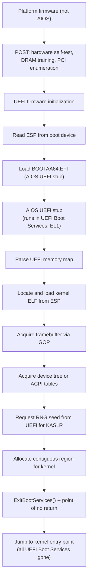

# AIOS Firmware Handoff

Part of: [boot.md](./boot.md) — Boot and Init Sequence
**Related:** [boot-kernel.md](./boot-kernel.md) — Kernel early boot, [boot-services.md](./boot-services.md) — Service startup, [hal.md](./hal.md) — Platform trait

-----

## 2. Firmware Handoff

### 2.1 UEFI Boot on aarch64

AIOS boots via UEFI on aarch64. The firmware is not part of AIOS — it's provided by the platform (QEMU's built-in UEFI, or the Pi's firmware). AIOS controls everything from the moment the kernel receives execution.

**Boot flow:**



### 2.2 What the Kernel Receives

The UEFI stub assembles a `BootInfo` structure and passes it to the kernel entry point in register `x0`. This is the kernel's only source of information about the hardware. The struct uses **flat `u64` fields** (not `Option<T>`) for a stable C ABI across toolchain updates — zero means "not present":

```rust
// Source: shared/src/boot.rs

/// Information passed from UEFI stub to kernel entry point.
/// All fields use fixed-layout primitives for a stable C ABI.
/// Fields that may be absent use u64 with 0 meaning "not present".
#[repr(C)]
pub struct BootInfo {
    /// Magic number for validation: 0x41494F53_424F4F54 ("AIOSBOOT")
    pub magic: u64,

    /// UEFI memory map: physical address of the MemoryDescriptor array (0 = absent).
    pub memory_map_addr: u64,
    /// Number of MemoryDescriptor entries in the memory map.
    pub memory_map_count: u64,
    /// Size of each MemoryDescriptor entry in bytes (UEFI descriptor size may exceed sizeof).
    pub memory_map_entry_size: u64,

    /// Framebuffer base address (0 = not available / headless).
    pub framebuffer: u64,

    /// Device tree blob base address (0 = not present).
    pub device_tree: u64,

    /// ACPI RSDP physical address (0 = not present).
    pub acpi_rsdp: u64,

    /// UEFI Runtime Services table address (0 = not available).
    pub runtime_services: u64,

    /// Random seed from UEFI RNG protocol for KASLR.
    pub rng_seed: [u8; 32],

    /// Physical address where the kernel ELF was loaded.
    pub kernel_phys_base: PhysAddr,

    /// Size of kernel image in memory.
    pub kernel_size: u64,

    /// Physical address of the initramfs (0 = not present).
    pub initramfs_base: u64,
    /// Size of the initramfs in bytes (0 = not present).
    pub initramfs_size: u64,

    /// Command line string address (0 = not present).
    pub cmdline_addr: u64,
    /// Command line length in bytes.
    pub cmdline_len: u64,

    /// Framebuffer width in pixels (0 = not available).
    pub fb_width: u32,
    /// Framebuffer height in pixels.
    pub fb_height: u32,
    /// Framebuffer stride in bytes (byte offset from one row to the next).
    pub fb_stride: u32,
    /// Framebuffer pixel format: 0 = Bgr8, 1 = Rgb8 (matches PixelFormat repr).
    pub fb_pixel_format: u32,
    /// Framebuffer total size in bytes (stride * height).
    pub fb_size: u64,
}
```

The BootInfo struct is allocated as **1 page (4 KiB)** by the UEFI stub, though the struct itself is ~160 bytes. The UEFI stub populates all available fields before calling `ExitBootServices()`.

**Memory descriptors** follow the EFI_MEMORY_DESCRIPTOR layout with a 4-byte padding field for alignment:

```rust
// Source: shared/src/boot.rs

#[repr(C)]
pub struct MemoryDescriptor {
    /// UEFI memory type (EFI_MEMORY_TYPE).
    pub ty: u32,
    /// Padding to align phys_start to 8 bytes (UEFI ABI requirement).
    pub _pad: u32,
    /// Physical address of the start of the memory region.
    pub phys_start: u64,
    /// Virtual address (set by SetVirtualAddressMap; unused by kernel).
    pub virt_start: u64,
    /// Number of 4 KiB pages in the region.
    pub page_count: u64,
    /// Memory attributes (EFI_MEMORY_ATTRIBUTES).
    pub attribute: u64,
}

/// Classification of physical memory regions.
/// See also memory.md §2 for the canonical definition.
#[repr(u32)]
pub enum MemoryType {
    Conventional = 0,    // free, usable by kernel
    LoaderCode = 1,      // UEFI stub code, reclaimable
    LoaderData = 2,      // UEFI stub data, reclaimable
    BootServicesCode = 3,// reclaimable after ExitBootServices
    BootServicesData = 4,// reclaimable after ExitBootServices
    RuntimeServicesCode = 5,// reserved, UEFI Runtime uses this
    RuntimeServicesData = 6,// reserved, UEFI Runtime uses this
    Reserved = 7,        // firmware-reserved, do not touch
    AcpiReclaimable = 8, // ACPI tables, reclaimable after parsing
    AcpiNvs = 9,         // ACPI non-volatile storage, reserved
    MemoryMappedIO = 10, // device MMIO, not real RAM
    BootInfo = 11,       // the BootInfo struct itself
    KernelImage = 12,    // where the kernel ELF was loaded
    Initramfs = 13,      // the initial ramdisk
}

#[repr(u32)]
pub enum PixelFormat {
    Bgr8 = 0,           // most common: blue-green-red, 8 bits each
    Rgb8 = 1,
}
```

**Note on UEFI memory type mapping:** UEFI type values differ from AIOS `MemoryType` values. The `MemoryDescriptor::memory_type()` method translates: UEFI type 0 (Reserved) → `Reserved`, UEFI type 7 (Conventional) → `Conventional`, UEFI types 8 (Unusable) and 13 (PalCode) → `Reserved`, UEFI types 11–12 (MMIO variants) → `MemoryMappedIO`. See `shared/src/boot.rs` for the full translation table.

### 2.3 Kernel Command Line

The `CommandLine` in `BootInfo` is a UTF-8 string parsed by the kernel during Step 4 (device tree parse). It comes from `boot.cfg` on the ESP or from the UEFI `LoadOptions` variable. Recognized options:

```text
Option              Default   Description
────────────────────────────────────────────────────────────
quiet               off       Suppress kernel log output to UART. Boot phase
                              transitions are still logged; service logs are not.
debug               off       Enable verbose kernel logging: page table setup
                              details, capability minting, IPC channel creation.
safe                off       Boot into safe mode (§9.3) — reduced service set,
                              no AIRS, no agents, no network.
console=<device>    uart0     Kernel log output device. Supported: uart0, none.
                              "none" disables UART logging entirely.
earlybreak          off       Halt after kernel early boot completes (before
                              launching Service Manager). Drop to UART debug
                              prompt. Useful for kernel debugging.
maxcpus=<n>         all       Limit the number of secondary CPUs brought online
                              via PSCI. 1 = boot CPU only (single-core mode).
kaslr=<on|off>      on        Enable or disable KASLR. Off is useful for
                              debugging with predictable addresses.
airs.timeout=<ms>   5000      Override the AIRS health timeout. Set higher on
                              slow storage (e.g., SD card on Pi 4).
audit=<on|off>      on        Enable or disable the kernel audit log.
```

Unknown options are ignored and logged at `debug` level if `debug` is on. The command line is stored in `KernelState` and available to the Service Manager via its `ServiceManagerBootInfo`.

### 2.4 EFI System Partition Layout

The ESP is a FAT32 partition at the start of the boot device:

```text
/EFI/BOOT/
    BOOTAA64.EFI            — AIOS UEFI stub (fallback boot path)
/EFI/AIOS/
    BOOTAA64.EFI            — AIOS UEFI stub (primary boot path)
    aios.elf                — kernel ELF image
    initramfs.cpio          — initial ramdisk (cpio archive)
    boot.cfg                — boot configuration (command line, options)
    aios.elf.prev           — previous kernel (for rollback)
    initramfs.cpio.prev     — previous initramfs (for rollback)
```

The ESP is small (64-256 MB). It holds only the boot chain. The OS itself lives in the AIOS partition (raw block device managed by the Block Engine). The `.prev` files support A/B rollback: if a new kernel fails to boot three times, the UEFI stub loads `.prev` instead.

### 2.5 QEMU Boot vs Real Hardware

```text
                        QEMU                    Raspberry Pi 4/5         Apple Silicon
─────────────────────────────────────────────────────────────────────────────────────────
Firmware                Built-in UEFI           VideoCore + UEFI         m1n1 + U-Boot + UEFI
                        (edk2-aarch64)          (via edk2-rpi)           (Asahi Linux chain)
Boot device             VirtIO-Blk disk         SD card or USB           NVMe (ANS)
Device discovery        DTB (QEMU-generated)    DTB (Pi firmware)        ADT → FDT (m1n1)
ACPI                    Available               Not available            Not available
Interrupt controller    GICv3 (virtual)         GIC-400 (GICv2)          AIC (Apple custom)
Timer                   ARM Generic Timer       ARM Generic Timer        ARM Generic Timer
UART                    PL011 (MMIO)            PL011 (MMIO)             S5L UART (Apple)
GPU                     VirtIO-GPU              VideoCore VI/VII         AGX (Apple custom)
Network                 VirtIO-Net              Genet Ethernet           PCIe Ethernet
Storage                 VirtIO-Blk              SD/eMMC + USB            NVMe (ANS)
RNG                     VirtIO-RNG              bcm2835-rng              Apple TRNG
Framebuffer             UEFI GOP (VirtIO-GPU)   UEFI GOP (HDMI)          simplefb (m1n1)
Acceleration            HVF (macOS), KVM (Linux) Native aarch64          Native aarch64
```

**Key difference for boot:** QEMU provides GICv3, Pi 4 provides GICv2 (GIC-400), Pi 5 provides GICv3 natively, and Apple Silicon uses AIC (Apple Interrupt Controller) — a completely different interrupt architecture requiring its own driver. The kernel's interrupt setup path branches based on the device tree. See hal.md §4.1 for AIC details.

### 2.6 Exception Level Model

AIOS runs at **EL1** (OS kernel privilege). It does not use EL2 (hypervisor) and does not act as a hypervisor. The levels below the kernel:

```text
Exception Level     Who occupies it            AIOS's relationship
────────────────────────────────────────────────────────────────────
EL3 (Secure Monitor) ARM Trusted Firmware (ATF)  AIOS calls it via SMC for PSCI
                     Present on Pi 4/5.          (CPU_ON, SYSTEM_RESET, etc.)
                     Not present on QEMU.

EL2 (Hypervisor)    KVM (if QEMU uses -enable-kvm) AIOS is unaware of EL2.
                     Not used on Pi bare-metal.     UEFI drops to EL1 before
                                                    jumping to kernel.

EL1 (OS Kernel)     AIOS kernel                 This is where we run.
                     Full access to page tables,
                     interrupt controller, timers.

EL0 (User)          Service Manager, all services, All userspace processes.
                     agents, compositor.
```

**PSCI conduit selection:** The device tree `/psci` node specifies the conduit:
- `method = "smc"` → Pi 4/5 (ATF at EL3 handles the call)
- `method = "hvc"` → QEMU without KVM (QEMU emulates PSCI at EL2)
- `method = "hvc"` → QEMU with KVM (KVM intercepts HVC and handles PSCI)
- `method = "hvc"` → Apple Silicon (m1n1 hypervisor at EL2 handles PSCI)

The kernel reads this during Step 4 (device tree parse) and stores it for SMP bringup (§3.5). The choice of HVC vs SMC is the *only* place where exception levels affect AIOS — everything else runs at EL1/EL0 uniformly.

**UEFI guarantees:** The UEFI firmware (edk2) always drops to EL1 before calling `ExitBootServices()`. By the time the kernel entry point runs, EL2 is either not present (bare metal Pi) or occupied by KVM/QEMU (transparent to the kernel). The kernel never touches EL2 registers.

The kernel abstracts these differences behind a `Platform` trait initialized during early boot. The full HAL specification — device abstractions, MMIO primitives, VirtIO transport, DMA, and the guide for adding new platforms — is in [hal.md](./hal.md).

```rust
// Source: kernel/src/platform/mod.rs

/// Hardware abstraction trait for platform-specific initialization.
///
/// Each platform (QEMU virt, Raspberry Pi 4/5, Apple Silicon) implements
/// this trait. Methods are added as subsystems are implemented across phases.
pub trait Platform: Send + Sync {
    fn name(&self) -> &'static str;

    // Phase 1 — kernel early boot
    fn init_uart(&self, dt: &DeviceTree) -> Uart;
    fn init_interrupts(&self, dt: &DeviceTree) -> InterruptController;
    fn init_timer(&self, dt: &DeviceTree, ic: &InterruptController) -> Timer;

    // Phase 2+ — subsystem initialization (added as subsystems land)
    fn init_gpu(&self, dt: &DeviceTree) -> Option<GpuDevice>;
    fn init_network(&self, dt: &DeviceTree) -> Option<NetworkDevice>;
    fn init_storage(&self, dt: &DeviceTree) -> Option<StorageDevice>;
    fn init_rng(&self, dt: &DeviceTree) -> Option<RngDevice>;
}

/// Detect the platform from the device tree root compatible string.
/// Returns a static reference because there is no heap at detection time.
pub fn detect_platform(dt: &DeviceTree) -> &'static dyn Platform {
    let compat = dt.root_compatible_str();
    if compat.contains("virt") || compat.contains("qemu") {
        static QEMU: qemu::QemuPlatform = qemu::QemuPlatform;
        return &QEMU;
    }
    if compat.contains("brcm,bcm2711") {  // Pi 4
        static PI4: pi4::Pi4Platform = pi4::Pi4Platform;
        return &PI4;
    }
    if compat.contains("brcm,bcm2712") {  // Pi 5
        static PI5: pi5::Pi5Platform = pi5::Pi5Platform;
        return &PI5;
    }
    panic!("Unknown platform: {}", compat);
}
```

Detection returns a `&'static dyn Platform` (not `Box<dyn Platform>`) because there is no heap at detection time. See hal.md §3.2 for the full initialization order and device driver architecture.

-----
