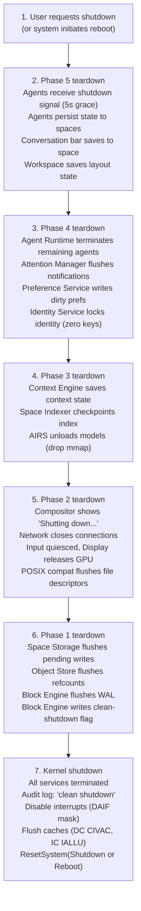

# AIOS Boot Lifecycle: Shutdown, Implementation, and Principles

Part of: [boot.md](./boot.md) — Boot and Init Sequence
**Related:** [boot-suspend.md](./boot-suspend.md) — Suspend/resume, [boot-testing.md](./boot-testing.md) — Test strategy, [boot-services.md](./boot-services.md) — Service startup

-----

## 11. Shutdown and Reboot

### 11.1 Graceful Shutdown Sequence

Shutdown is the reverse of boot, with extra care for data integrity:



### 11.2 Forced Shutdown

If graceful shutdown takes longer than 10 seconds, the kernel forces the issue:

```text
 0s    Graceful shutdown begins
 5s    Services still running → warning logged
 8s    Remaining services receive SIGKILL
10s    Force: storage flush (WAL commit), then power off
       No data loss thanks to WAL, but state may be incomplete
```

The watchdog timer (ARM Generic Timer) is set to 15 seconds at shutdown start. If the kernel hangs during shutdown, the hardware watchdog forces a reset. On the next boot, the WAL replay recovers any incomplete writes.

### 11.3 Agent State Persistence

Agents that need to survive reboot set `persistent: true` in their manifest (see [agents.md](../applications/agents.md) §2.4 `AgentManifest` and §3 Agent Lifecycle). Their state is stored in their designated space:

```text
Agent receives: ShutdownSignal { deadline: Timestamp }
Agent has 5 seconds to:
  1. Save conversation context to space
  2. Save task progress to space
  3. Close open sessions
  4. Reply: ShutdownAck
If no ack within 5 seconds: agent is killed
Agent state in spaces survives the reboot
On next boot: agent is relaunched and reads state from space
```

-----

## 12. Implementation Order

The boot sequence maps to the earliest development phases. Week ranges below match the canonical durations in overview.md §10. These are *development plan* phases, not boot phases — see boot.md §4-5 for runtime boot phases.

```text
Phase 0: Foundation & Tooling (Weeks 1-2)
  - Cross-compilation toolchain (Rust → aarch64)
  - QEMU runner scripts
  - UEFI stub skeleton
  - Build system for kernel + initramfs

Phase 1: Boot & First Pixels (Weeks 3-6)
  - UEFI stub: memory map, framebuffer, device tree, RNG
  - Kernel entry: exception vectors, UART, device tree parse
  - Interrupt controller (GICv3/GICv2/AIC) + timer
  - MMU enable: page tables, W^X
  - Early framebuffer: splash screen
  - Kernel writes "Hello from AIOS" to screen and UART

Phase 2: Memory Management (Weeks 7-10)
  - Buddy allocator (physical pages)
  - Slab allocator (kernel heap)
  - KASLR
  - Per-process address spaces (TTBR0 switching)
  - Shared memory regions

Phase 3: IPC & Capability System (Weeks 11-16)
  - Syscall handler (SVC trap)
  - IPC channels (send/recv/call)
  - Capability manager (create, transfer, revoke)
  - Audit log (ring buffer)
  - Process manager + scheduler
  - Service Manager (PID 1)
  - Provenance chain (first entry)

Phase 4: Block Storage & Object Store (Weeks 17-21)
  - Block Engine (superblock, WAL, LSM-tree)
  - Object Store (content-addressing, dedup)
  - Space Storage (system spaces, Space API)
  - Kernel audit log flush to space storage
  - Phase 1 boot sequence operational

Phase 5-6: GPU, Display, Compositor (Weeks 22-30)
  - VirtIO-GPU driver
  - Framebuffer handoff
  - Compositor
  - Phase 2 boot sequence operational

Phase 7: Input, Terminal, Networking (Weeks 31-34)
  - VirtIO-Input, keyboard/mouse
  - Network (smoltcp, VirtIO-Net)
  - Terminal emulator
  - Phase 2 fully operational

Phase 8: AIRS Core (Weeks 35-39)
  - GGML integration, model loading
  - Phase 3 boot sequence operational

(Phases 9-13 and 15-23 are defined in development-plan.md)

Phase 14: Performance & Optimization (Weeks 64-66)
  - Boot time profiling and optimization
  - Achieve < 3 second boot target
  - Recovery mode implementation
  - Safe mode
  - Rollback mechanism

Phase 24: Secure Boot (Weeks 113-116)
  - Verified boot chain
  - A/B partition scheme
  - Boot counter in UEFI variables
  - Automatic rollback on failure
```

The boot sequence is built incrementally. After Phase 1, the kernel boots and shows pixels. After Phase 3, it launches the Service Manager. After Phase 4, storage works. After Phase 6, there's a desktop. Each phase is a demonstrable milestone — the boot sequence is never "all or nothing."

-----

## 23. Documentation Gaps

Concepts referenced in boot.md that do not yet have full documentation elsewhere. These are placeholders for future doc work. Gaps marked **RESOLVED** have been addressed.

1. **Agent state persistence across reboot** — **RESOLVED.** agents.md §3.5 now documents the Reboot Recovery mechanism: `RunningManifest` in `system/agents/running.manifest`, per-agent `PreRebootState`, Phase 5 relaunch order, and the `AgentEvent::SystemReboot` SDK event.

2. **Attention Manager initialization requirements** — **RESOLVED.** attention.md §15 now documents boot-time initialization: pre-AIRS rule-based triage (§15.2), minimal startup state table (§15.3), and compositor connection buffering (§15.4).

3. **AIRS default model selection** — **RESOLVED.** airs.md §4.6 now documents full RAM-based thresholds (including <2 GB no-model and ≥16 GB higher-quantization tiers), the `BootModelSelector` implementation, first-boot degraded mode, and model integrity verification.

4. **Context Engine boot behavior** — **RESOLVED.** context-engine.md §8.3 now documents boot-time signal availability, the `boot_context()` function, conservative defaults, and the transition from boot heuristics to AIRS inference.

5. **Task Manager service** — **RESOLVED.** [task-manager.md](../intelligence/task-manager.md) now documents: intent decomposition, task lifecycle, agent orchestration, Phase 5 boot assignment, and the SDK API.

6. **Recovery mode and safe mode operational procedures** — §9 describes recovery mode commands and safe mode service lists, but there is no standalone troubleshooting or operations guide documenting: how to connect a UART console on each platform, how to diagnose common boot failures, or how to restore from backup after a factory reset. This could be a future `docs/operations/recovery.md`.

7. **USB host controller driver** — **RESOLVED.** hal.md §14 now documents: xHCI ring buffer architecture (command/transfer/event rings), DWC2 controller for Pi 4, USB device enumeration sequence, HID class driver with input latency analysis, and hub enumeration.

8. **Audio subsystem architecture** — **RESOLVED.** [audio.md](../platform/audio.md) now documents: PCM mixing engine, per-platform device drivers (VirtIO-Sound, I2S/PWM, HDMI audio), RT scheduling integration, A/V sync with compositor, and latency requirements.

9. **Measured boot and attestation** — Implementation Order lists "Phase 24: Secure Boot" but boot.md does not describe *what* gets measured or *where* measurements are stored. On Pi there is no discrete TPM — measurements would need to use a software TPM (fTPM in ARM TrustZone) or the UEFI variable store. A future `docs/security/secure-boot.md` should cover: firmware measurement, kernel hash verification, initramfs integrity, and remote attestation for enterprise deployment.

10. **SMMU driver internals** — **RESOLVED.** hal.md §15 now documents: SMMUv3 stream table architecture, command/event queues, per-device TLB invalidation, and BCM2712 platform-specific quirks.

11. **Suspend/resume device state** — **RESOLVED.** hal.md §16 now documents: per-device power state machine, suspend/resume actions for each HAL device (GIC, timer, UART, GPU, network, storage, USB, RNG, SMMU), resume ordering, and S3 vs S4 differences.

12. **Hibernate image management** — §15.2 describes the hibernate image format and partition, but the background S3→S4 writeback mechanism (DMA engine writing DRAM during suspend) needs hardware-specific documentation per platform. Not all platforms support DMA during low-power states.

13. **Proactive Wake scheduling** — §15.5 describes the concept, but the AIRS usage prediction model, RTC alarm programming per platform, and power policy interaction need a dedicated document, possibly `docs/intelligence/proactive-wake.md`.

14. **Boot-time encryption unlock UX** — §18.3 describes the unlock flow, but the Argon2id tuning parameters per platform, hardware key (FIDO2) integration, and biometric reader support need documentation in `docs/security/encryption.md`.

15. **Accessibility engine** — **RESOLVED.** [accessibility.md](../experience/accessibility.md) now documents: screen reader (eSpeak-NG), Braille display support, switch scanning, high contrast/magnification, voice control, boot-time accessibility, accessibility tree integration, and AIRS enhancement with no-AIRS fallback.

16. **Single-address-space boot validation** — §22.2 describes running Phase 1 services as kernel modules. The dual-compilation build system, the state handoff mechanism from kernel-module mode to isolated-process mode, and the safety audit requirements for `#![forbid(unsafe_code)]` enforcement need documentation in the build system guide.

17. **Heterogeneous compute dispatch** — §22.6 introduces the `ComputeDomain` abstraction for CPU/GPU/NPU dispatch, but the concrete GPU command queue protocol for VirtIO-GPU (QEMU) and V3D (Pi) is not documented. hal.md should add a "Compute Dispatch" section covering: command ring buffer format, completion interrupt handling, memory transfer (DMA vs. cache-coherent) per platform, and how the inference engine selects CPU vs. GPU for a given model size. Additionally, the NPU `ComputeType` variant is forward-looking — when NPU hardware is targeted, a dedicated `docs/platform/npu.md` will be needed.

18. **Kernel invariant verification tooling** — §22.7 proposes formal verification of capability, IPC, and memory isolation invariants using Kani and proptest. The CI pipeline configuration for running these verifiers, the invariant specification format, and the Lean 4 proof roadmap need documentation. A future `docs/project/verification.md` should cover: which invariants are verified today (model checking), which are planned for full proofs, how verification failures block releases, and the expected person-effort for each verified subsystem.

19. **Crate-level kernel fault isolation** — §22.8 describes Theseus-style crate isolation and hot-swappable drivers. The mechanism for detecting a crate panic (unwinding across crate boundaries in `#![no_std]`), the state extraction protocol for hot-swap (`export_state()`/`init_with_state()`), and the crate dependency enforcement in CI need documentation. hal.md should add a "Driver Hot-Swap" section specifying which drivers support hot-swap (storage: no, network: yes, display: partial) and the quiesce requirements for each.

20. **Per-agent namespace implementation** — §22.9 describes Plan 9-style per-agent namespaces. The namespace creation during agent spawn, the mount table storage (kernel memory vs. space-backed), namespace inheritance rules, and the interaction with the POSIX compatibility layer (§posix.md) need documentation. When an agent makes a POSIX `open()` call, the path is resolved through its namespace — posix.md should document this resolution order and what happens when a path resolves to "not mounted" (ENOENT vs. EACCES).

21. **Async kernel executor** — **RESOLVED.** scheduler.md §13 now documents: kernel async tasks vs scheduler threads, per-CPU executor architecture, waker registration for IPC/timer/DMA/service-ready sources, priority inheritance for async tasks, the Service Manager's async boot loop, and the interaction between the executor and scheduler run queues (including cost comparison table).

22. **Live kernel patch safety and rollback** — §22.11 describes function-level live patching. The safety constraints (which functions can be patched, how to verify ABI compatibility, how to handle in-flight calls to the patched function), the rollback mechanism (restoring the saved prologue), and the patch distribution format (how patches are delivered via OTA and verified) need documentation. security.md should cover the capability requirements for installing live patches (root-only, with audit logging).

23. **Boot trace storage and replay tooling** — §22.12 describes boot trace recording for deterministic replay. The trace storage partition layout (shared with panic dump), the QEMU replay harness, and the trace analysis tooling need documentation. The interaction between boot trace recording and boot performance (2% overhead claim needs benchmarking methodology). A future `docs/project/debugging.md` should cover the end-to-end workflow: recording a trace on hardware, transferring it to a development machine, and replaying in QEMU with GDB attached.

24. **Learned component training and deployment** — §22.13 describes AIRS-powered OS tuning (learned readahead, scheduler boost, memory pressure response). The training pipeline (when and how models are trained on observed behavior), the model update mechanism (how a new readahead model replaces the old one), the accuracy monitoring system, and the fallback trigger thresholds need documentation. The privacy implications of learning from user behavior patterns should be addressed in security.md — all training data stays on-device and is never transmitted.

25. **Zero-copy page transfer TLB coherence** — §22.14 describes zero-copy IPC via page transfer. The TLB flush strategy (per-page IPI vs. full flush vs. ASID-based invalidation), the interaction with the SMMU (§3.6) when DMA is in flight to transferred pages, and the performance characteristics per platform (QEMU's TLB flush is a no-op; Pi's requires explicit maintenance) need documentation in memory.md. Edge cases: what happens when a page being transferred is also memory-mapped by a third process (answer: transfer fails, falls back to copy).

26. **Service manifest schema and static verification** — §22.15 describes Fuchsia-style service manifests. The manifest file format (TOML? embedded in binary? stored in Space?), the static verification tool (run at build time or boot time?), and the capability routing resolution algorithm need documentation. A future `docs/project/service-manifests.md` should specify the full manifest schema, provide examples for each system service, and document the verification errors and how to resolve them.

27. **Power management policy engine** — **RESOLVED.** [power-management.md](../platform/power-management.md) now documents: unified power state machine (S0/S0ix/S3/S4/S5), sensor inputs, policy rules, thermal management, AIRS integration for predictive power management, battery management, per-platform behavior, and scheduler integration.

28. **Thermal management during boot and inference** — **RESOLVED.** hal.md §17 now documents: thermal zone abstraction, per-platform thermal configuration (thresholds for QEMU/Pi 4/Pi 5/Apple Silicon), thermal-aware inference (ThrottleLevel states and AIRS pause behavior), and boot-time thermal monitoring during Phase 2-3.

29. **OTA update atomicity and rollback** — §9.6 describes OTA updates at a high level, but the atomic update mechanism (A/B partitions? overlay filesystem? content-addressed deduplication?), the update verification chain (signature verification, hash checking), the rollback trigger (failed health check after update), and the interaction with live kernel patching (§22.11) need comprehensive documentation. A future `docs/platform/ota-updates.md` should cover the end-to-end update flow from download to verification to installation to rollback.

30. **Cross-device migration and Semantic Resume portability** — §15.3 claims Semantic Resume survives "cross-device migration" but the mechanism is not specified. How does a SemanticSnapshot transfer between devices? What happens when the target device has different hardware (different GPU, different screen resolution, different model availability)? How is the snapshot authenticated and encrypted during transfer? This needs its own section in boot.md or a dedicated `docs/experience/device-migration.md`.

31. **Watchdog timer integration** — hal.md documents watchdog init, but boot.md does not specify watchdog behavior during each boot phase: which phase starts the watchdog, what the timeout is per phase (Phase 1 storage init may take longer on first boot with filesystem creation), and what happens when the watchdog fires during boot (recovery mode? restart current phase? full reboot?). The watchdog-to-recovery-mode escalation path needs documentation.

32. **Multi-user boot behavior** — AIOS identity.md describes user identity, but boot.md assumes a single-user device. If multiple identities exist, boot.md should specify: which user's Semantic Resume state is restored (last active user? auto-detected via biometrics?), how per-user service instances are managed (separate AIRS contexts per user?), and how the login/identity-selection screen interacts with the boot splash timeline (§7).

-----

## 24. Design Principles

1. **Usable at each phase boundary.** Every service is optional except storage and display. AIRS failure doesn't break boot. Network failure doesn't break boot.
2. **Fast on the critical path.** Only the minimum services needed for a desktop are on the critical path. Everything else runs in parallel or deferred.
3. **Visual feedback from the start.** The user sees a splash screen within 500ms of power-on. Never stare at a black screen.
4. **Recovery is always possible.** Three consecutive failures trigger recovery mode. Rollback to previous kernel is always available. Factory reset is the last resort.
5. **Services are independent.** Each service has its own process, its own capabilities, its own restart policy. One service crashing doesn't take down the system.
6. **Boot is audited.** Every phase transition, every service start, every failure is logged. The audit trail is queryable after boot via `system/audit/boot/`.
7. **First boot and normal boot are the same code path.** The only difference is whether system spaces exist yet (first boot creates them). No separate "installer" or "setup wizard."
8. **State is never lost.** Ambient continuity ensures the user never loses more than ~2 seconds of work, regardless of how the system goes down — crash, panic, power loss.
9. **Boot adapts to context.** The system detects *why* it's booting and adapts the service graph. A proactive wake doesn't light the screen. A scheduled task doesn't load the compositor. Intent drives behavior.
10. **The system learns.** Boot readahead, model pre-selection, and proactive wake improve over time as AIRS observes usage patterns. The 100th boot is faster and smarter than the first.
11. **Accessibility from the first frame.** A user with a disability must be able to complete first boot independently. No accessibility feature requires AIRS, network, or user preferences to function.
12. **Research ideas, pragmatically applied.** Orthogonal persistence, single-address-space boot, capability persistence, self-healing services, and live service replacement are adopted from research kernels — but adapted to work with real hardware, existing software, and Rust's safety guarantees.
13. **Heterogeneity is the norm.** CPU, GPU, and future NPU are treated as distinct compute domains with explicit communication, not a uniform shared-memory machine. The OS acknowledges hardware diversity instead of hiding it.
14. **Verify what matters most.** Security-critical invariants (capability attenuation, memory isolation, IPC confidentiality) are formally verified or model-checked. The rest relies on Rust's compile-time guarantees and thorough testing.
15. **The language is the first line of defense.** Rust's type system, ownership model, and crate boundaries provide isolation guarantees that traditional OSes achieve only through hardware mechanisms. AIOS uses both — language safety inside the kernel, hardware isolation at the kernel-userspace boundary.
16. **Every namespace is private.** Agents and services see only what their capabilities allow. There is no global namespace, no ambient authority, no way to discover resources that haven't been explicitly granted. Invisible means inaccessible.
17. **Async by default.** No kernel syscall blocks. Every I/O operation returns immediately or yields to the scheduler. Boot is maximally parallel because services are async tasks, not sequential thread launches.
18. **The kernel is patchable.** Security fixes and performance improvements can be applied to the running kernel without rebooting. When deeper changes require a reboot, Semantic Resume makes it feel seamless.
19. **Every boot is recorded.** Boot trace recording captures non-deterministic events for offline replay and debugging. A boot failure that happens once in 100 boots can be diagnosed from its trace.
20. **Learned components always have fallbacks.** ML-powered optimizations (readahead, scheduling, memory eviction) improve performance when accurate but degrade gracefully to traditional heuristics when the model is unavailable or inaccurate. Intelligence is an optimization, never a correctness requirement.
21. **Zero-copy is the fast path.** Large data (model weights, framebuffers, space objects) moves between processes via page transfer, not memory copy. The kernel's job is to remap page tables, not to copy bytes.
22. **Composition over configuration.** Services and agents are composed from declarative manifests, not configured by imperative scripts. Static verification catches errors before boot. The manifest is the single source of truth for a component's interface.
