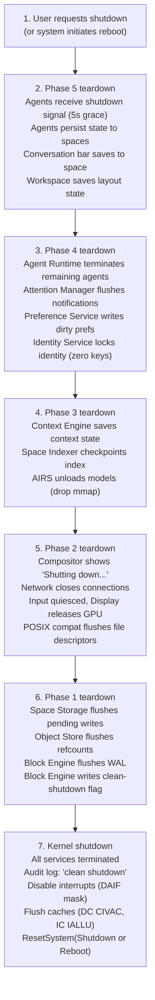
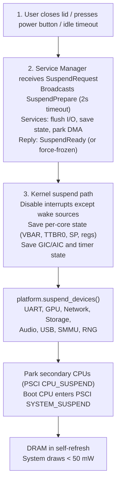
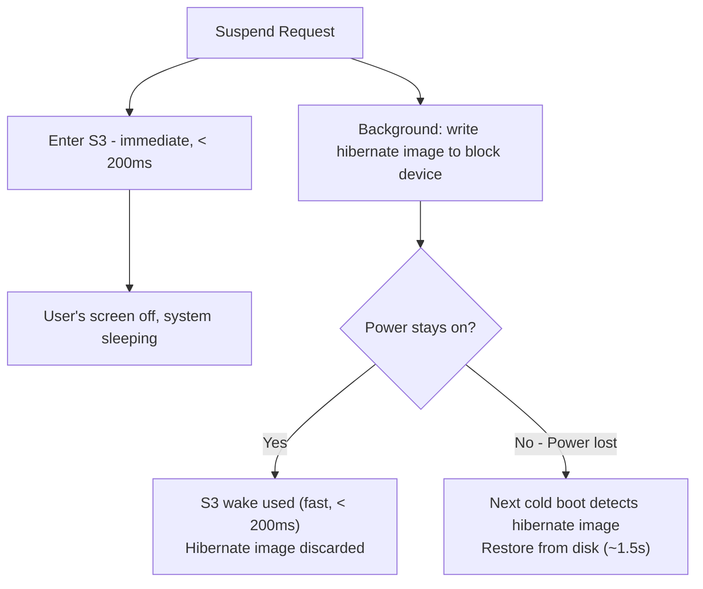
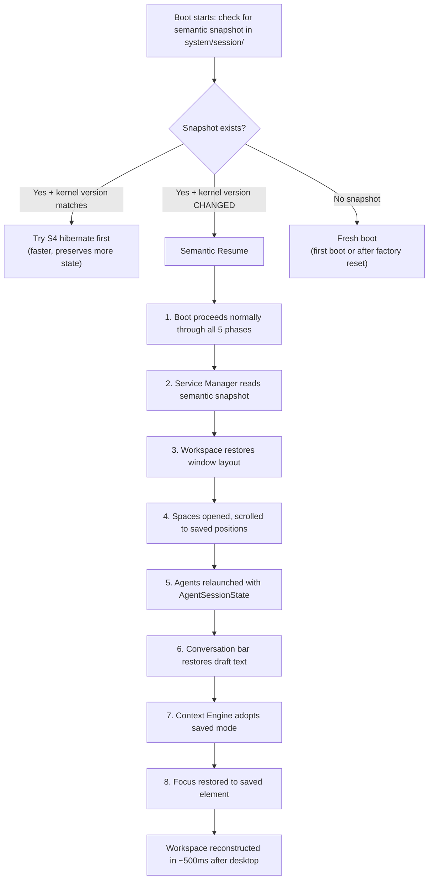
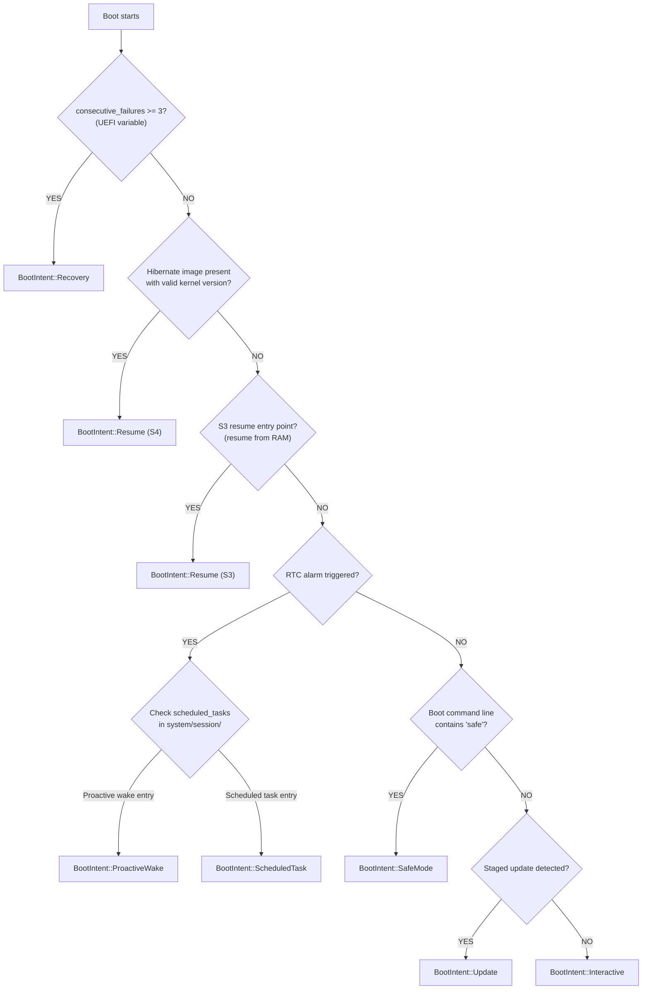
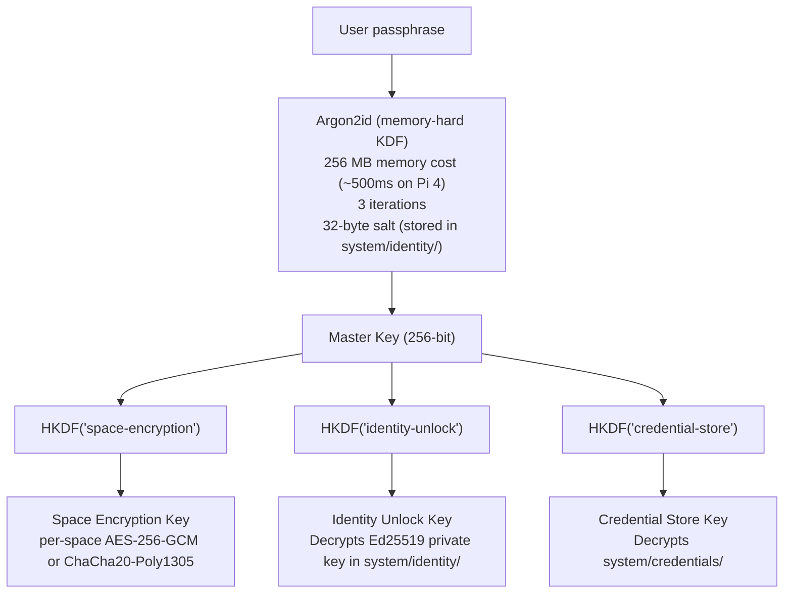
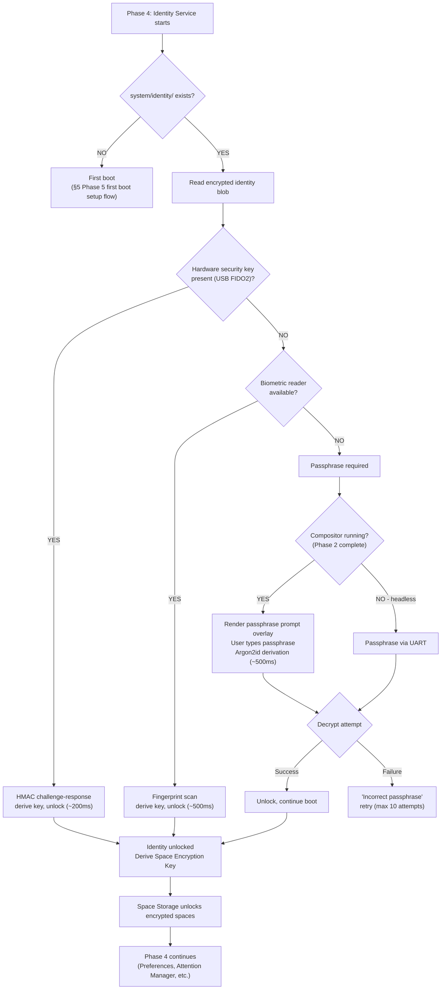
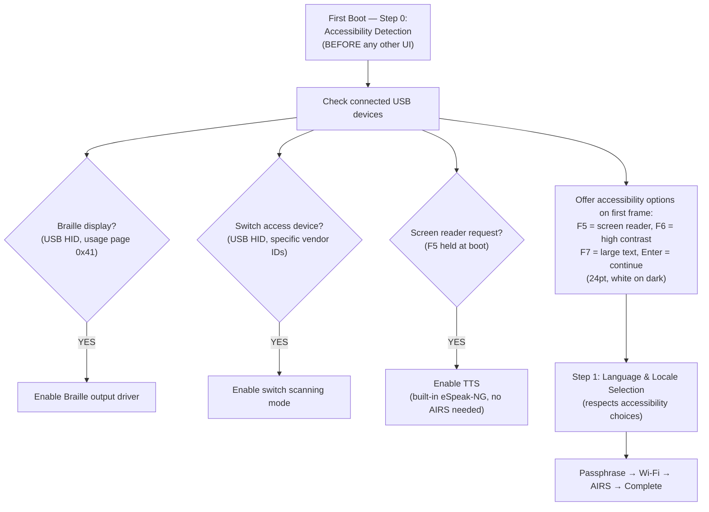

# AIOS Boot Lifecycle and Advanced Topics

## Deep Technical Architecture

**Parent document:** [architecture.md](../project/architecture.md) — Section 6.1 Boot Sequence
**Companion:** [boot.md](./boot.md) — Core boot sequence (firmware handoff, kernel early boot, service startup phases, boot performance, framebuffer, panic handler, recovery mode, initramfs)
**Related:** [hal.md](./hal.md) — Platform trait and device abstractions, [ipc.md](./ipc.md) — IPC and syscalls, [scheduler.md](./scheduler.md) — Scheduling classes, [memory.md](./memory.md) — Memory management, [spaces.md](../storage/spaces.md) — Space Storage, [airs.md](../intelligence/airs.md) — AI Runtime Service, [compositor.md](../platform/compositor.md) — Display and framebuffer, [security.md](../security/security.md) — Capability system, [identity.md](../experience/identity.md) — Identity initialization, [agents.md](../applications/agents.md) — Agent lifecycle, [attention.md](../intelligence/attention.md) — Attention Manager, [context-engine.md](../intelligence/context-engine.md) — Context Engine, [preferences.md](../intelligence/preferences.md) — Preference Service

-----

## 11. Shutdown and Reboot

### 11.1 Graceful Shutdown Sequence

Shutdown is the reverse of boot, with extra care for data integrity:



### 11.2 Forced Shutdown

If graceful shutdown takes longer than 10 seconds, the kernel forces the issue:

```
 0s    Graceful shutdown begins
 5s    Services still running → warning logged
 8s    Remaining services receive SIGKILL
10s    Force: storage flush (WAL commit), then power off
       No data loss thanks to WAL, but state may be incomplete
```

The watchdog timer (ARM Generic Timer) is set to 15 seconds at shutdown start. If the kernel hangs during shutdown, the hardware watchdog forces a reset. On the next boot, the WAL replay recovers any incomplete writes.

### 11.3 Agent State Persistence

Agents that need to survive reboot set `persistent: true` in their manifest (see [agents.md](../applications/agents.md) §2.4 `AgentManifest` and §3 Agent Lifecycle). Their state is stored in their designated space:

```
Agent receives: ShutdownSignal { deadline: Timestamp }
Agent has 5 seconds to:
  1. Save conversation context to space
  2. Save task progress to space
  3. Close open sessions
  4. Reply: ShutdownAck
If no ack within 5 seconds: agent is killed
Agent state in spaces survives the reboot
On next boot: agent is relaunched and reads state from space
```

-----

## 12. Implementation Order

The boot sequence maps to the earliest development phases. Week ranges below match the canonical durations in overview.md §10. These are *development plan* phases, not boot phases — see §11 for runtime boot phases.

```
Phase 0: Foundation & Tooling (Weeks 1-2)
  - Cross-compilation toolchain (Rust → aarch64)
  - QEMU runner scripts
  - UEFI stub skeleton
  - Build system for kernel + initramfs

Phase 1: Boot & First Pixels (Weeks 3-6)
  - UEFI stub: memory map, framebuffer, device tree, RNG
  - Kernel entry: exception vectors, UART, device tree parse
  - Interrupt controller (GICv3/GICv2/AIC) + timer
  - MMU enable: page tables, W^X
  - Early framebuffer: splash screen
  - Kernel writes "Hello from AIOS" to screen and UART

Phase 2: Memory Management (Weeks 7-10)
  - Buddy allocator (physical pages)
  - Slab allocator (kernel heap)
  - KASLR
  - Per-process address spaces (TTBR0 switching)
  - Shared memory regions

Phase 3: IPC & Capability System (Weeks 11-16)
  - Syscall handler (SVC trap)
  - IPC channels (send/recv/call)
  - Capability manager (create, transfer, revoke)
  - Audit log (ring buffer)
  - Process manager + scheduler
  - Service Manager (PID 1)
  - Provenance chain (first entry)

Phase 4: Block Storage & Object Store (Weeks 17-21)
  - Block Engine (superblock, WAL, LSM-tree)
  - Object Store (content-addressing, dedup)
  - Space Storage (system spaces, Space API)
  - Kernel audit log flush to space storage
  - Phase 1 boot sequence operational

Phase 5-6: GPU, Display, Compositor (Weeks 22-30)
  - VirtIO-GPU driver
  - Framebuffer handoff
  - Compositor
  - Phase 2 boot sequence operational

Phase 7: Input, Terminal, Networking (Weeks 31-34)
  - VirtIO-Input, keyboard/mouse
  - Network (smoltcp, VirtIO-Net)
  - Terminal emulator
  - Phase 2 fully operational

Phase 8: AIRS Core (Weeks 35-39)
  - GGML integration, model loading
  - Phase 3 boot sequence operational

(Phases 9-13 and 15-23 are defined in development-plan.md)

Phase 14: Performance & Optimization (Weeks 64-66)
  - Boot time profiling and optimization
  - Achieve < 3 second boot target
  - Recovery mode implementation
  - Safe mode
  - Rollback mechanism

Phase 24: Secure Boot (Weeks 113-116)
  - Verified boot chain
  - A/B partition scheme
  - Boot counter in UEFI variables
  - Automatic rollback on failure
```

The boot sequence is built incrementally. After Phase 1, the kernel boots and shows pixels. After Phase 3, it launches the Service Manager. After Phase 4, storage works. After Phase 6, there's a desktop. Each phase is a demonstrable milestone — the boot sequence is never "all or nothing."

-----

## 13. Boot Test Strategy

The boot sequence is the most critical code path in AIOS — if it breaks, nothing works. Every change to boot-related code must be validated by automated tests before merging.

### 13.1 CI Boot Smoke Test

Every PR runs a QEMU boot smoke test:

```
Boot smoke test (runs in CI on every PR):

1. Build kernel + initramfs + UEFI stub
2. Launch QEMU (aarch64, no KVM, 4 GB RAM, VirtIO devices)
3. Capture UART output
4. Assert: "[boot] Complete" appears within 500ms (kernel early boot)
5. Assert: "Phase 1 complete" appears within 1000ms
6. Assert: "Phase 2 complete" appears within 2000ms
7. Assert: "Phase 5 complete — boot to desktop" appears within 5000ms
8. Assert: no "[PANIC]" in UART output
9. Assert: "Services: N running, 0 failed, 0 degraded" (0 failures)
10. Shutdown cleanly, verify "[shutdown] clean shutdown" in UART

Total CI time: ~10 seconds per run (dominated by QEMU startup)
```

### 13.2 Platform Test Matrix

```
Test Level     QEMU (CI)       Pi 4 (manual/nightly)  Pi 5 (manual/nightly)
──────────────────────────────────────────────────────────────────────────────
Normal boot    Every PR        Nightly                 Nightly
First boot     Every PR        Weekly                  Weekly
Recovery mode  Every PR        Monthly                 Monthly
Rollback       Every PR        Monthly                 Monthly
Safe mode      Every PR        Monthly                 Monthly
SMP (4 cores)  Every PR        Nightly                 Nightly
maxcpus=1      Weekly          Monthly                 Monthly
```

Pi testing uses physical hardware connected to a CI runner via serial console (UART) and relay-controlled power for automated reboot. The relay allows hard power-cycle testing — essential for verifying watchdog and WAL recovery paths.

### 13.3 Boot Timing Regression

The CI records Phase 5 completion time from UART output. A **regression threshold** of +10% from the rolling average triggers a warning; +20% blocks the PR. This catches accidental performance regressions (e.g., a new service added to the critical path, or an accidentally-synchronous operation in Phase 2).

```
Tracked metrics (from UART timestamps):
  - Kernel early boot (entry → Complete)
  - Phase 1 duration (storage)
  - Phase 2 duration (core services)
  - Phase 4 duration (user services)
  - Total boot-to-desktop (entry → Phase 5 complete)
  - AIRS health time (Phase 3, non-critical but tracked)
```

### 13.4 Failure Injection Tests

Run weekly in CI (slower, ~60 seconds each):

- **Service crash during boot:** Kill a Phase 2 service mid-startup. Verify: Service Manager restarts it, boot completes, audit log records the failure.
- **AIRS timeout:** Start QEMU with insufficient RAM for any model. Verify: Phase 3 times out, Phase 4-5 proceed, desktop appears without AIRS.
- **Storage corruption:** Corrupt the WAL header before boot. Verify: Block Engine detects corruption, WAL replay recovers, boot completes.
- **Three consecutive failures:** Kill the kernel three times before Phase 5. Verify: Fourth boot enters recovery mode, UART shows recovery shell prompt.
- **Watchdog expiry:** Inject a `sleep(35s)` in Phase 1. Verify: Watchdog fires, system reboots, `consecutive_failures` increments.

-----

## 14. Cross-Document Dependencies

This section tracks concepts that boot.md references which are defined (or need to be defined) in other documents. If you modify any of these, check the corresponding document for consistency.

| Concept used in boot.md | Defined in | What boot.md needs from it |
|---|---|---|
| `Platform` trait, 7 `init_*` methods, `InterruptController`, `Timer`, `Uart`, `GpuDevice`, `NetworkDevice`, `StorageDevice`, `RngDevice` | [hal.md](./hal.md) §3 (Platform Trait), §4 (Device Abstractions) | Device trait signatures must match hal.md §3. Initialization order (UART/interrupts/timer early, GPU/network/storage in service phases) must agree with hal.md §3.2. |
| `Scheduler`, four scheduling classes (RT, Interactive, Normal, Idle), 1ms tick | [scheduler.md](./scheduler.md) §3.1, §10.1 | Timer tick rate (Step 6) and scheduling class names in Step 15 must stay consistent with scheduler.md. |
| `BuddyAllocator`, `SlabAllocator`, slab size classes | [memory.md](./memory.md) | Buddy allocator order range (0–10) and slab size classes (64–4096 bytes) cited in Steps 8–9 must match memory.md. |
| `CapabilityManager`, `CapabilityToken`, root capability, trust levels, `Capability::Root` | [security.md](../security/security.md) §10 | `Timestamp::MAX` for Trust Level 0 tokens (Step 12) and capability delegation model (§4.7) must stay aligned. |
| `IpcSubsystem`, `ChannelId`, health check protocol | [ipc.md](./ipc.md) | Health check protocol (boot.md §4.4) and Service Manager IPC channels (ipc.md §4.1) must match ipc.md's channel semantics. |
| Compositor framebuffer handoff, display subsystem, wgpu pipeline | [compositor.md](../platform/compositor.md) | Handoff sequence (§7.4) and Phase 2 display startup must match compositor.md's initialization. |
| AIRS model selection by RAM, `system/models/` space, GGML runtime, 5-second timeout | [airs.md](../intelligence/airs.md) | Model size thresholds (§5 Phase 3: ≥16 GB → 8B Q5_K_M, ≥8 GB → 8B Q4_K_M, ≥4 GB → 3B, ≥2 GB → 1B, <2 GB → no local model) and the 5-second health timeout must stay consistent with airs.md §4.6. |
| Identity Service, Ed25519 keypair, `system/identity/` space | [identity.md](../experience/identity.md) | Phase 4 Identity startup and identity unlock flow must match identity.md's key management. |
| Attention Manager, AI triage vs rule-based fallback | [attention.md](../intelligence/attention.md) | The soft AIRS dependency described in Phase 4 must match attention.md's initialization requirements. |
| Context Engine, signal collection, rule-based heuristic fallback | [context-engine.md](../intelligence/context-engine.md) | Phase 3 Context Engine startup and its AIRS dependency must match context-engine.md's fallback behavior. |
| Preference Service, `user/preferences/` space | [preferences.md](../intelligence/preferences.md) | Phase 4 Preference startup and the preference space path must match preferences.md. |
| `AgentManifest.persistent`, agent shutdown protocol, `ShutdownSignal` | [agents.md](../applications/agents.md) §2.4, §3 | The 5-second shutdown grace period (§11.3) and persistent agent relaunching must match agents.md's lifecycle model. |
| Block Engine, Object Store, Space Storage, WAL, LSM-tree, system spaces | [spaces.md](../storage/spaces.md) | Phase 1 startup sequence and system space paths (`system/audit/`, `system/models/`, etc.) must agree with spaces.md's space hierarchy. |
| ARM SMMU (SMMUv3), stream tables, DMA isolation, bounce buffers | [hal.md](./hal.md) | SMMU initialization (hal.md §15) and per-device DMA page tables must align with hal.md's DMA abstractions. Pi 4 bounce buffer strategy must match hal.md's DMA API. |
| USB host controller (xHCI), USB HID, hub enumeration | [hal.md](./hal.md) | Phase 2 USB input path on Pi must match hal.md's USB abstraction (if defined). xHCI driver is platform-specific (DesignWare on Pi 4, RP1 on Pi 5). |
| Audio subsystem (PCM, mixing, I2S/PWM, HDMI audio) | [audio.md](../platform/audio.md) | Phase 2 Audio Subsystem startup must match audio.md. RT scheduling class for audio threads must match scheduler.md. |
| Watchdog timer (virtual watchdog on QEMU, bcm2835-wdt on Pi), boot timeout, runtime ping | [hal.md](./hal.md) | Watchdog hardware abstraction and timeout values (30s boot, 60s runtime, 15s shutdown) must be consistent across hal.md and boot.md. |
| GPU memory reservation (`/reserved-memory` node, `gpu_mem`), VideoCore carve-out | [compositor.md](../platform/compositor.md) | GPU memory split on Pi (76 MB Pi 4, 64 MB Pi 5) and its effect on available RAM must match compositor.md's VRAM requirements. |

-----

## 15. Suspend, Resume, and Semantic State

Users rarely cold boot. The daily experience is closing a lid, pressing a power button, or walking away. The system's job is to make returning feel instantaneous and *lossless* — nothing should ever be lost, regardless of how the system went down. AIOS provides four layers of state continuity, from fastest-cheapest to most-resilient:

```
Layer               Resume Time    Survives          State Fidelity
──────────────────────────────────────────────────────────────────────
S3 (Suspend-to-RAM)     < 200ms   Lid close/open    Perfect (RAM powered)
S4 (Hibernate)          ~1.5s     Power loss         Perfect (RAM → disk)
Semantic Resume         ~2.0s     Kernel update      Reconstructed (semantic)
Ambient Continuity     (always on) Crash, panic, fire Continuous (Spaces)
```

### 15.1 Suspend-to-RAM (S3)

The fastest resume path. CPU cores are powered down, DRAM stays in self-refresh, and all device state is saved to kernel memory. On wake, the kernel restores device state and resumes exactly where it left off.

**Suspend sequence:**



**Wake sequence:**

```
Wake source fires (lid open, power button, RTC alarm, network wake-on-LAN)
     │
     ▼
1. Firmware restarts boot CPU at the suspend resume entry point
   - NOT the normal boot path — jumps to saved resume address
   - Boot CPU restores: MMU (TTBR1_EL1), stack pointer, exception vectors
     │
     ▼
2. Kernel resume path
   - Restore interrupt controller state (GIC distributor/redistributor, or AIC)
   - Restore timer state, re-arm scheduler tick
   - Call platform.resume_devices() (reverse of suspend_devices)
   - Resume secondary CPUs via PSCI CPU_ON (same trampoline as boot)
     │
     ▼
3. Service Manager resumes
   - Broadcasts ResumeNotify to all frozen services
   - Services restore volatile state, re-establish connections
   - Compositor presents the last frame immediately (no re-render needed)
     │
     ▼
4. User sees their desktop — exactly as they left it
   Total resume time: < 200ms (dominated by device re-init)
```

**Wake sources by platform:**

```
Platform    Wake Sources                                Notes
──────────────────────────────────────────────────────────────
QEMU        Keyboard, timer (RTC alarm)                 No lid, no real power mgmt
Pi 4        GPIO (power button), USB (keyboard),        No built-in RTC; external
            Genet (wake-on-LAN), timer (ext RTC)        RTC module needed for timed wake
Pi 5        GPIO (power button), USB, Genet,            Built-in RTC with battery
            RTC (built-in), PCIe wake                   connector — timed wake works
Apple       Power button, USB, lid open,               SMC handles wake, always-on
Silicon     Thunderbolt, RTC, network (WiFi/BT)        RTC, lid switch via SMC
```

**PSCI power states:** ARM PSCI defines power states for suspend. AIOS uses the deepest state that preserves DRAM:

```rust
pub enum SuspendPowerState {
    /// CPU cores off, L2 off, DRAM in self-refresh.
    /// Deepest state that preserves memory. Used for S3.
    DeepSleep,
    /// CPU cores in WFI, L2 retained, DRAM active.
    /// Used for short idle (< 30 seconds). Faster wake (~5ms).
    LightSleep,
}
```

### 15.2 Hibernate (S4)

Hibernate writes the entire system state to persistent storage, then powers off completely. On wake, the state is read back and the system resumes. This survives complete power loss — pull the plug, replace the battery, come back a week later, everything is exactly where you left it.

**Hibernate is S3 with a safety net.** AIOS enters S3 first (fast wake), and starts writing the hibernate image to storage *in the background while the system is suspended*. If power fails during S3 (DRAM loses content), the next boot detects the hibernate image and resumes from it. If S3 wake succeeds normally, the hibernate image is discarded.



**Hibernate image format:**

```rust
pub struct HibernateImage {
    magic: u64,                         // 0x41494F53_48494245 ("AIOSHIBE")
    version: u32,                       // format version
    kernel_version: u64,                // must match running kernel
    checksum: [u8; 32],                // SHA-256 of payload
    page_count: u64,                   // number of pages saved
    compressed_size: u64,              // zstd-compressed payload size

    // CPU state for each core
    cpu_states: [CpuSuspendState; MAX_CPUS],

    // Device state snapshots
    device_states: DeviceStateBlock,

    // Compressed memory pages (zstd stream)
    // Only dirty pages are saved — clean pages backed by
    // Space Storage or mmap'd files are not included
    // (they'll be demand-paged from storage on access).
    pages: CompressedPageStream,
}
```

**Key optimization:** Only dirty pages are written. Clean pages (kernel text, mmap'd model weights, read-only space data) are demand-paged from storage on resume. On a system with 4 GB RAM where 1.5 GB is clean file-backed pages, the hibernate image is ~2.5 GB uncompressed, ~1.2 GB compressed. At SD card write speeds (50 MB/s), that's ~24 seconds to write — which is fine because it happens in background during S3.

**Hibernate partition:** A dedicated raw partition on the block device (not a Space — it must be accessible before Space Storage starts). The Block Engine reserves this during first-boot formatting:

```
Block device layout:
  [Superblock] [Panic dump] [Hibernate partition] [WAL] [Main storage]
                              └─ sized to match physical RAM
```

### 15.3 Semantic Resume

This is where AIOS diverges from every other OS.

Traditional hibernate saves raw memory — a perfect snapshot of RAM. But that snapshot is brittle: it's tied to a specific kernel version (data structures must match), specific hardware (device handles are meaningless after a hardware change), and a specific moment (no way to partially resume). If you update the kernel, the hibernate image is invalid. If you move the disk to a different machine, the image is useless.

**Semantic Resume saves meaning, not bits.** Instead of dumping 4 GB of RAM, it captures a compact semantic description of the user's state:

```rust
pub struct SemanticSnapshot {
    /// When this snapshot was taken
    timestamp: Timestamp,

    /// Active workspace layout
    workspace: WorkspaceState,

    /// Open spaces and cursor positions within each
    open_spaces: Vec<OpenSpaceState>,

    /// Active agents and their conversation context
    active_agents: Vec<AgentSessionState>,

    /// Compositor window geometry and z-order
    window_layout: Vec<WindowState>,

    /// Conversation bar state (draft text, history position)
    conversation: ConversationBarState,

    /// Context Engine's last inference (work/play/focus mode)
    context_mode: ContextMode,

    /// Attention Manager's pending notification queue
    pending_notifications: Vec<NotificationState>,

    /// Currently focused element (which window, which field)
    focus: FocusState,

    /// Scroll positions, selection ranges, cursor positions
    /// across all visible content
    view_states: Vec<ViewState>,
}

pub struct OpenSpaceState {
    space_id: SpaceId,
    /// Content hash of the object being viewed/edited
    object_hash: ContentHash,
    /// Cursor/selection within the content
    cursor: CursorState,
    /// Scroll position (normalized 0.0–1.0)
    scroll: f64,
    /// Unsaved edits (stored as a diff against the object)
    pending_edits: Option<EditDiff>,
}

pub struct AgentSessionState {
    agent_id: AgentId,
    /// Conversation history (lightweight: just message IDs referencing Spaces)
    conversation_ref: ObjectRef,  // see spaces.md §3.0 for ObjectRef
    /// Agent's declared resumable state (agent-specific, opaque to the kernel)
    agent_state: Vec<u8>,
    /// What the agent was doing when suspended
    active_task: Option<TaskDescription>,
}

pub struct WindowState {
    service_id: ServiceId,
    /// Position and size (logical pixels)
    geometry: Rect,
    /// Z-order index
    z_order: u32,
    /// Minimized / maximized / floating
    display_mode: WindowDisplayMode,
    /// Content identity (which space/object/agent this window shows)
    content_ref: ContentReference,
}
```

**When Semantic Resume is used:**



**Why this matters:**
- **Kernel updates don't disrupt your session.** Update, reboot, everything is back. No other OS does this.
- **Cross-device continuity.** Copy your Spaces to a new device, boot, and your workspace reconstructs itself. The semantic snapshot travels with your data because it's stored *in* Spaces.
- **Crash recovery.** Even after a kernel panic, the last semantic snapshot (written continuously — see §15.4) restores context.
- **Partial resume.** Semantic Resume can skip stale elements. If an agent was uninstalled since the snapshot, it's silently dropped. If a space was deleted, that window is omitted. The system doesn't crash on stale state — it adapts.

**The semantic snapshot is written to `system/session/` as a Space object.** This means it's versioned, content-addressed, and encrypted (if user spaces are encrypted). The Service Manager writes a new snapshot every 60 seconds during normal operation, and immediately before suspend/shutdown. The overhead is negligible — it's typically < 50 KiB of structured data.

### 15.4 Ambient State Continuity

Semantic Resume captures state every 60 seconds. But what about the 59 seconds between snapshots? If the power cuts 30 seconds after the last snapshot, 30 seconds of work could be lost.

**Ambient State Continuity** is the principle that user-visible state is *continuously* persisted. The system should *never* lose more than a few seconds of user activity, regardless of how it goes down.

This is possible because Spaces already provides content-addressed, versioned storage. The missing piece is making writes *continuous* rather than batched:

```
Traditional OS:
  User types → in-memory buffer → "Save" → disk
  Power loss before save → data lost

AIOS Ambient Continuity:
  User types → in-memory buffer → continuous trickle to Space WAL
  Power loss → WAL replay → at most ~2 seconds of keystrokes lost
```

**Implementation — three tiers:**

**Tier 1: Edit Journal (< 2 second loss window).** Every user input event that modifies content (keystroke, paste, drag, delete) is appended to a per-space *edit journal* in the Block Engine's WAL. The WAL is designed for sequential appends and is fsynced every 2 seconds. On crash, WAL replay reapplies the journal to the last committed object version.

```rust
pub struct EditJournalEntry {
    space_id: SpaceId,
    object_hash: ContentHash,          // base version
    timestamp: Timestamp,
    operation: EditOperation,
}

pub enum EditOperation {
    InsertText { offset: usize, text: String },
    DeleteRange { offset: usize, len: usize },
    ReplaceRange { offset: usize, len: usize, text: String },
    // ... extensible per content type
}
```

**Tier 2: Semantic Snapshot (60-second interval).** The full SemanticSnapshot from §15.3, capturing workspace layout, agent states, and view positions. Written to `system/session/` as a Space object.

**Tier 3: Space Object Commits (application-driven).** Agents and services commit completed units of work to Spaces on their own schedule. A document agent commits after each paragraph. A music agent commits its playlist state after each track change. These are full content-addressed objects with version history.

**On recovery (crash, panic, power loss):**

```
1. Block Engine starts, replays WAL
   → Tier 1 edit journal entries applied to objects
   → At most ~2 seconds of edits lost

2. Space Storage starts, verifies objects
   → Tier 3 committed objects are intact (content-addressed, checksummed)

3. Phase 5 starts, reads semantic snapshot from system/session/
   → Tier 2 workspace layout restored (at most ~60 seconds stale)
   → Window positions may be slightly off; agents may ask
     "Resume from where you left off?" if their state is stale

4. User sees their workspace, with content intact
   → The document they were typing has everything except
     the last ~2 seconds of keystrokes
```

**Cost:** The WAL write overhead for Tier 1 is ~500 bytes per keystroke event, fsynced in batches every 2 seconds. On a 100 WPM typist, that's ~4 KB/s — negligible even on SD cards. The semantic snapshot (Tier 2) is < 50 KiB every 60 seconds. The total overhead of ambient continuity is unmeasurable in normal usage.

### 15.5 Proactive Wake

AIRS observes usage patterns over time: when the user typically wakes the device, how long boot takes, which services and models they use first. Proactive Wake uses this to pre-warm the system *before* the user arrives.

```
Monday–Friday:
  User's alarm is 7:00 AM (calendar event in Spaces)
  User typically opens the laptop at 7:15 AM
  AIRS model load takes ~3 seconds

  → System wakes at 7:12 AM (3 minutes before predicted use)
  → Pre-loads AIRS model into memory (fault in pages from mmap)
  → Warms Space index caches (recent workspaces)
  → Checks for and downloads OTA updates (if idle window)
  → NTP sync (clock may have drifted during sleep)
  → Screen stays off — no power wasted on display
  → When user opens lid at 7:15 → instant response, model warm
```

**How it works:**

```rust
pub struct ProactiveWakeConfig {
    /// Whether proactive wake is enabled (user preference).
    /// Default: on. Can be disabled for power savings.
    enabled: bool,

    /// Minimum confidence before scheduling a proactive wake.
    /// Range: 0.0–1.0. Default: 0.7 (70% confidence).
    confidence_threshold: f32,

    /// How far ahead of predicted use to wake (for pre-warming).
    /// Default: 180 seconds. Adjusted by AIRS based on observed
    /// pre-warm duration (model load time + cache warming time).
    lead_time: Duration,

    /// Maximum time to stay awake if the user doesn't arrive.
    /// Default: 600 seconds (10 minutes). After this, re-suspend.
    max_idle_awake: Duration,

    /// Power source requirement. Default: AcOrBatteryAbove50.
    power_policy: ProactiveWakePowerPolicy,
}

pub enum ProactiveWakePowerPolicy {
    /// Only proactive-wake on AC power
    AcOnly,
    /// AC or battery above threshold
    AcOrBatteryAbove50,
    /// Always (even on low battery)
    Always,
}
```

**Wake scheduling:** The kernel programs the RTC (Pi 5's built-in RTC, or an external RTC module on Pi 4) with a wake alarm. On QEMU, the UEFI RTC is used. The alarm fires, the system resumes from S3, runs the pre-warm tasks with the screen off, then either:
- The user arrives → screen on, instant response
- The timeout expires → re-suspend (cost: a few seconds of power)

**Learning:** AIRS maintains a simple usage model in `system/session/proactive_wake`:

```
Day-of-week × hour-of-day → probability of first interaction
```

A 7×24 grid (168 cells), updated daily with exponential decay. After two weeks of consistent usage, predictions are reliable. No cloud needed — all local.

**Privacy:** Proactive Wake schedules are stored locally in `system/session/` and never leave the device. The usage model is a simple probability grid, not a detailed activity log. The user can inspect and delete it via Preferences.

-----

## 16. Boot Intelligence

### 16.1 Boot Intent Detection

Not every boot should result in a full desktop. AIOS detects *why* it's booting and adapts the service graph accordingly:

```rust
pub enum BootIntent {
    /// Normal boot — user pressed power button or opened lid.
    /// Full service graph: Phases 1-5.
    Interactive,

    /// Resume from suspend — S3 or S4.
    /// Skip Phases 1-5, restore from memory or disk image.
    Resume,

    /// Proactive wake — RTC alarm, no user yet.
    /// Phase 1-2 only. Pre-warm caches. Screen off. Re-suspend after timeout.
    ProactiveWake,

    /// Scheduled task — calendar event, backup schedule, OTA check.
    /// Phase 1-3 only. Run the task, then suspend.
    ScheduledTask { task: ScheduledTaskId },

    /// Recovery — three consecutive boot failures.
    /// Minimal services, UART console.
    Recovery,

    /// Safe mode — user held Shift during boot.
    /// Reduced services, no AIRS, no agents.
    SafeMode,

    /// Update — staged update, need to apply and verify.
    /// Full boot but with update verification on Phase 5 completion.
    Update,

    /// Data transfer — USB device plugged into a powered-off device.
    /// (Pi only: USB-C power + data) Phase 1-2 only, expose storage via USB gadget.
    DataTransfer,
}
```

**How intent is detected:**



**Service graph adaptation:** The Service Manager reads `BootIntent` from `KernelState` and adjusts the phase plan:

```
Intent              Phases Run          Display   AIRS    Network   Services
──────────────────────────────────────────────────────────────────────────────
Interactive         1-5 (full)          On        Yes     Yes       All
Resume              (skipped)           On        Warm    Restore   Restore
ProactiveWake       1-2 (partial)       Off       Warm    Yes       Minimal
ScheduledTask       1-3 (partial)       Off       Maybe   Yes       Task-specific
Recovery            1 + recovery shell  UART      No      No        Minimal
SafeMode            1-2, 4 (partial)    On        No      No        Reduced
Update              1-5 (full)          On        Yes     Yes       All + verify
DataTransfer        1-2 (partial)       Off       No      USB only  Storage + USB
```

### 16.2 Predictive Boot Configuration

AIRS learns usage patterns and adjusts the boot configuration to optimize for expected use. This isn't about changing *which* services start — it's about changing *how* they start:

**Model pre-selection:** If AIRS observes that the user always loads the coding agent on weekday mornings, and that agent benefits from the code-specialized model variant, AIRS can pre-select that model during Phase 3 instead of the general-purpose default. The model switch is seamless — by the time the user opens the coding agent, the right model is already loaded.

**Cache warming:** The Block Engine can prefetch blocks that are likely to be needed. AIRS maintains a per-intent block access trace:

```rust
pub struct BootAccessTrace {
    intent: BootIntent,
    context: BootContext,           // day of week, time of day, peripherals
    blocks_accessed: Vec<BlockId>,  // ordered by first access time
    timestamp: Timestamp,
}
```

On the next boot with a matching context, the Block Engine prefetches these blocks during Phase 1 (while other services are initializing). By the time Phase 5 renders the workspace, the hot data is already in the page cache. This is similar to Linux's `readahead` but context-aware — different prefetch sets for different usage patterns.

**Agent prelaunch:** If the user always launches the same three agents after boot, the Agent Runtime can start them during Phase 5 before the workspace is visible. The agents are ready by the time the user sees the desktop. This is controlled by a frequency threshold — agents launched in 80%+ of recent boots are auto-prelaunch candidates (distinct from the explicit "autostart" flag in agent manifests).

### 16.3 Readahead and Predictive I/O

Beyond AIRS-driven prediction, the kernel itself performs boot readahead — a proven technique made smarter:

**Boot trace recording:** During every boot, the Block Engine records which blocks are read, in what order, and at what time relative to boot start. This trace is saved to `system/session/boot_trace`:

```rust
pub struct BootTrace {
    boot_id: u64,
    intent: BootIntent,
    entries: Vec<BootTraceEntry>,
}

pub struct BootTraceEntry {
    block_id: BlockId,
    time_offset_us: u64,    // microseconds since kernel entry
    service: ServiceId,     // which service requested the read
}
```

**Readahead replay:** On the next boot, the Block Engine starts a readahead thread immediately after init. It reads the previous boot trace and issues prefetch requests for blocks in the recorded order, staying ~500ms ahead of expected demand. The prefetch runs at the lowest I/O priority (below any foreground service reads).

**Adaptive merging:** Over multiple boots, traces converge. The Block Engine merges the last 5 traces, keeping blocks that appear in 60%+ of them and ordering by median access time. Blocks unique to a single boot (one-time operations) are dropped.

**Impact on SD card:** Random 4K reads on a Class 10 SD card: ~2 MB/s. Sequential reads: ~50 MB/s. By converting random boot reads into a sequential prefetch stream, readahead can reduce Phase 1 storage init from 300ms to ~100ms on SD-backed Pi devices.

-----

## 17. On-Demand Services (Socket Activation)

Not every service needs to run from boot. Some services are used infrequently and waste memory and CPU time if started eagerly. AIOS supports *on-demand activation*: a service starts the first time something tries to communicate with it.

### 17.1 Mechanism

The Service Manager creates IPC channels for on-demand services at boot, but does *not* start the service process. When a message arrives on the channel, the Service Manager intercepts it, starts the service, delivers the buffered message, and connects the channel transparently:

```rust
pub struct ServiceDescriptor {
    // ... existing fields ...

    /// Activation mode for this service.
    activation: ActivationMode,
}

pub enum ActivationMode {
    /// Start during the assigned boot phase (current behavior).
    Boot,
    /// Start on first IPC message to this service's channel.
    OnDemand {
        /// Pre-create channels during boot so senders don't need
        /// to know whether the service is running.
        channel_count: usize,
    },
    /// Start on a timer (e.g., daily maintenance tasks).
    Scheduled { interval: Duration },
}
```

### 17.2 Which Services Benefit

```
Service               Default Mode   Why
──────────────────────────────────────────────────────────────
block_engine          Boot           Critical path. Must exist for everything.
space_storage         Boot           Critical path. Storage for all services.
compositor            Boot           Critical path. User needs to see something.
airs_core             Boot           Loads asynchronously already. Model pre-warm.
posix_compat          OnDemand       Only needed when running BSD/Linux binaries.
                                     Many users may never need it.
audio_subsystem       OnDemand       No audio until user plays media or receives
                                     a notification sound. First audio event
                                     triggers start (~100ms latency on first sound).
browser_runtime       OnDemand       Only needed when opening web content.
print_subsystem       OnDemand       Only needed when printing.
bluetooth_subsystem   OnDemand       Only needed when connecting BT devices.
```

### 17.3 Impact

Moving `posix_compat`, `audio_subsystem`, and `bluetooth_subsystem` from Boot to OnDemand saves:
- ~80ms off Phase 2 critical path (three fewer services to health-check)
- ~15 MB RSS on idle system (three fewer processes resident)

The first activation of an on-demand service adds ~50-150ms latency (process create, ELF load, init). For POSIX compat this means the first Unix command takes an extra 100ms. For audio, the first notification sound has ~100ms extra latency. These are acceptable trade-offs for a faster boot and lower idle memory.

-----

## 18. Encrypted Storage Unlock

AIOS encrypts user data at rest. The encryption key is derived from the user's passphrase (or biometric, or hardware key). The boot sequence must handle the unlock ceremony — the point where the user provides their credential so encrypted spaces become readable.

### 18.1 What's Encrypted

```
Space                    Encrypted?   Why
──────────────────────────────────────────────────────────
system/config/           No          Needed before unlock (device settings)
system/devices/          No          Hardware config, no user data
system/audit/            No          Must be writable before unlock
system/models/           No          AI models are not user-sensitive
system/services/         No          Service binaries, no user data
system/session/          Yes         Contains user activity patterns
system/credentials/      Yes         Passwords, tokens, keys
system/identity/         Yes*        Encrypted with hardware-derived key
                                     (separate from user passphrase)
user/                    Yes         All user data
shared/                  Yes         Collaborative data
web-storage/             Yes         Browser data
```

### 18.2 Key Derivation



### 18.3 Boot-Time Unlock Flow



**Timing impact:** On a fast path (hardware key or biometric), unlock adds ~200-500ms. With a passphrase, it adds user-wait time (typing) + 500ms (Argon2id). The Argon2id cost is tunable — faster on powerful hardware, deliberately slow enough on all platforms to resist brute force.

**Lock-on-suspend:** When the system enters S3/S4, the master key is zeroed from memory. On resume, the unlock ceremony runs again. For S3 resume (< 200ms), this means the user must authenticate again — but a hardware key or fingerprint makes this near-instant. The passphrase prompt appears on the compositor's first resume frame.

-----

## 19. Boot Accessibility

AIOS is unusable if a user with a disability cannot complete the first boot experience. Accessibility must work from the *first frame* — before user preferences exist, before AIRS loads, before any setup occurs.

### 19.1 Pre-Setup Accessibility

The first-boot setup flow (§5 Phase 5) includes accessibility as its very first step — *before* language selection:



### 19.2 Built-In Accessibility Engine

The compositor includes a minimal accessibility engine that works without AIRS:

```
Accessibility Feature          AIRS Required?   Boot Availability
──────────────────────────────────────────────────────────────────
High contrast mode             No               From first frame
Large text (2× font scaling)   No               From first frame
Screen reader (eSpeak-NG TTS)  No               From first frame (initramfs)
Braille display output         No               From first frame (USB HID)
Switch scanning (single-switch No               From first frame
  or two-switch navigation)
Reduced motion                 No               From first frame
AI-enhanced descriptions       Yes              After Phase 3 (AIRS)
AI-powered voice control       Yes              After Phase 3 (AIRS)
```

**eSpeak-NG** is compiled into the initramfs (~800 KiB, supports 100+ languages). It provides functional (if robotic) text-to-speech from boot without requiring AIRS. When AIRS loads (Phase 3), voice output can be upgraded to neural TTS if the user prefers.

### 19.3 Accessibility Persistence

Once the user selects accessibility options during first boot, they're stored in `system/config/accessibility` (unencrypted — must be readable before identity unlock):

```rust
pub struct BootAccessibilityConfig {
    screen_reader: bool,
    high_contrast: bool,
    large_text: bool,
    reduced_motion: bool,
    braille_display: bool,
    switch_access: bool,
    tts_voice: TtsVoice,           // eSpeak variant
    tts_rate: f32,                 // speech rate multiplier
    preferred_language: String,     // for TTS
}
```

This config is read by the compositor during Phase 2, before the identity unlock prompt. This means the passphrase entry screen is already accessible — the screen reader is active, text is large, contrast is high — before the user has to type their passphrase.

-----

## 20. Hardware Boot Feedback

### 20.1 The Problem

Not every boot has a display. A headless Pi (server, IoT, NAS) has no monitor. Even on a display-equipped system, there's a gap between power-on and the first framebuffer pixel (~500ms firmware time). During this gap, the user has no indication that the system is alive.

### 20.2 LED Status Indicators

The Raspberry Pi has a green Activity LED (active-low GPIO on Pi 4, RP1-controlled on Pi 5). AIOS uses this LED to communicate boot progress via blink patterns:

```
Pattern                 Meaning                          Duration
──────────────────────────────────────────────────────────────────
Solid on                Firmware running                  0-500ms
1 blink/sec             Kernel early boot                 500-700ms
2 blinks/sec            Phase 1 (storage)                 700-1000ms
3 blinks/sec            Phase 2 (core services)           1000-1500ms
Solid on                Phase 5 complete (boot OK)        1500ms+
SOS pattern             Kernel panic (... --- ...)        Until reboot
Fast flash (10 Hz)      Recovery mode                     Until resolved
```

```rust
pub struct LedBootIndicator {
    gpio: GpioPin,      // Pi 4: GPIO 42, Pi 5: via RP1
}

impl LedBootIndicator {
    /// Called by advance_boot_phase() alongside UART logging
    fn indicate_phase(&mut self, phase: EarlyBootPhase) {
        let pattern = match phase {
            EarlyBootPhase::EntryPoint ..= EarlyBootPhase::TimerReady
                => BlinkPattern::Hertz(1),
            EarlyBootPhase::MmuEnabled ..= EarlyBootPhase::Complete
                => BlinkPattern::Hertz(2),
            _ => BlinkPattern::SolidOn,
        };
        self.set_pattern(pattern);
    }

    fn indicate_panic(&mut self) {
        self.set_pattern(BlinkPattern::Sos);
    }
}
```

On QEMU, the LED indicator is a no-op (no physical LED). The UART output serves the same purpose.

### 20.3 Audio Boot Chime

If an audio output device is detected during Phase 2 (HDMI audio, 3.5mm jack, or USB audio), the kernel can play a short boot chime:

```
Boot chime timing:
  Phase 2 complete → play a short tone (200ms, 440 Hz sine wave)
                     Indicates: display + audio + input are working
  Phase 5 complete → play completion chime (two ascending tones)
                     Indicates: system fully booted, desktop visible
  Panic            → play error tone (low descending tone)
                     Indicates: something went very wrong
```

The boot chime is a generated waveform (no audio file needed), written directly to the audio hardware's PCM buffer. It works before the Audio Subsystem service starts — the HAL provides raw audio output for this purpose.

**User preference:** The boot chime can be disabled via `system/config/boot` (`chime: false`). Default: on. It's one of the few settings read from unencrypted system config before identity unlock.

-----

## 21. First Boot as Conversation

The traditional first-boot experience is a wizard: fixed steps, fixed order, multiple screens of settings the user doesn't understand. AIOS replaces this with a conversation — a natural language exchange that adapts to the user.

### 21.1 How It Works

The first-boot setup flow (§5 Phase 5) already describes the fixed steps: language, passphrase, Wi-Fi, AIRS model. The conversational first boot wraps these steps in a natural interaction:

```
[Screen: clean dark background with AIOS logo]
[After Phase 3 AIRS loads (typically ~3 seconds into boot):]

AIOS:  "Hello! I'm setting up your new computer.
        What language do you prefer?"

User:  "English"

AIOS:  "Got it — English. I've also detected a US keyboard layout.
        Does that look right?"

User:  "Yes"

AIOS:  "To protect your data, I'll encrypt everything on this device.
        Please choose a passphrase — something you'll remember but
        others won't guess."

       [Passphrase input field appears]

User:  [types passphrase]

AIOS:  "Strong passphrase. I see a Wi-Fi network nearby — 'HomeNetwork'.
        Want to connect?"

User:  "Yes, the password is ..."

AIOS:  "Connected. One last thing — I can help you find files, draft
        text, and manage your work using a local AI model that runs
        entirely on this device. Nothing leaves your computer.
        Want to set that up? It'll take about a minute to download."

User:  "Sure"

AIOS:  "Downloading now. You're all set — your desktop is ready.
        If you need anything, I'm in the bar at the bottom of the screen."

       [Setup overlay fades out → Workspace]
```

### 21.2 Adaptive Flow

The conversation adapts based on the user's responses and detected context:

- **No network available?** Skip Wi-Fi, don't offer AIRS download: "No Wi-Fi detected. You can connect later from the network settings."
- **User says "I'm blind"** → immediately activates screen reader + Braille if connected, continues setup via speech: "Screen reader activated. I'll speak all options aloud."
- **User says "I don't want AI"** → AIRS download skipped, conversation bar configured for keyword search only: "No problem. You can always enable it later in preferences."
- **User asks "What is this?"** → explains AIOS briefly: "AIOS is an operating system designed around you. Your files are organized by meaning, not folders. Everything is encrypted and runs locally."
- **Young user / simple responses** → simplifies language. **Technical user** → offers advanced options (UART console access, developer mode, custom partitioning).

### 21.3 Fallback: Fixed Wizard

If AIRS fails to load during first boot (model not available, insufficient RAM, Phase 3 timeout), the setup falls back to the fixed step-by-step wizard described in §5. The wizard is functional but non-conversational — it uses standard UI elements (buttons, text fields, dropdowns) instead of natural language. The user experience is merely good instead of great.

The conversational flow and the fixed wizard produce the same result: an identity, a passphrase, optional Wi-Fi, optional AIRS model. The difference is in the experience.

-----

## 22. Research Kernel Innovations

Several ideas from research and niche kernels have proven valuable but never reached mainstream operating systems. AIOS adopts the best of these, adapted to its architecture.

### 22.1 Orthogonal Persistence (from EROS / KeyKOS / Phantom OS)

**The idea:** There is no "boot" — only resume. The entire system state (processes, capabilities, memory) is continuously checkpointed to persistent storage. Power loss is indistinguishable from a pause. The OS resumes from the last checkpoint as if nothing happened.

**History:** KeyKOS (1983) introduced persistent capabilities that survived across reboots. EROS (Extremely Reliable Operating System, 1991) formalized this into *orthogonal persistence* — the programmer never explicitly saves or loads data. Phantom OS (2009, Russian research) extended this to a full persistent object space where processes literally cannot tell that the machine was powered off.

None of these reached mainstream adoption. The reasons: performance overhead of continuous checkpointing, incompatibility with existing software that assumes volatile memory, and the difficulty of handling hardware state (device registers, DMA buffers) across power cycles.

**What AIOS takes from this:**

AIOS cannot adopt full orthogonal persistence (it needs to run legacy POSIX software, and device state is too complex to checkpoint). But it adopts the *user-facing* principle: **the user should never notice that the machine was off.**

- **Ambient State Continuity (§15.4)** is AIOS's version of continuous checkpointing. User-visible state (edits, scroll positions, selections) trickles into the WAL continuously. The checkpoint granularity is ~2 seconds for keystrokes, ~60 seconds for workspace layout. This provides the *illusion* of orthogonal persistence without the overhead of checkpointing the entire address space.

- **Semantic Resume (§15.3)** is AIOS's version of persistent capabilities. Instead of persisting raw memory (which breaks across kernel updates), AIOS persists *meaning*: which spaces are open, which agents are active, what the user was looking at. This is more resilient than EROS's approach because it survives kernel changes, hardware changes, and even cross-device migration.

- **Space Storage** is inherently persistent and content-addressed. Objects are never lost once committed. Version history is preserved. This gives AIOS the storage semantics of a persistent OS without requiring the kernel to manage persistence.

**What's different from EROS/Phantom:** Those systems persisted the entire process state (registers, stack, heap). AIOS persists only the *semantic* state and lets services reconstruct their process state from it. This means services can be updated, patched, or replaced between checkpoints — something impossible in EROS. The trade-off is that reconstruction takes ~500ms (vs. instant resume in EROS), but reconstruction survives changes that EROS cannot.

### 22.2 Single-Address-Space Boot (from Singularity / Unikernels)

**The idea:** During boot, there is only one process: the kernel. All boot-critical code — the Block Engine, Object Store, Space Storage — runs in kernel space with no context switches, no IPC overhead, no page table switches. After core services are initialized, the kernel "splits" them into separate isolated processes.

**History:** Microsoft Research's Singularity OS (2003-2010) used Software Isolated Processes (SIPs) — processes that share a single address space but are isolated by the type system (Sing#, a dialect of C#). Boot was fast because there was no hardware isolation overhead. Unikernels (MirageOS, IncludeOS, Unikraft) take this further: the entire application is compiled into the kernel with no process boundary at all, booting in as little as 5ms.

Mainstream OSes never adopted this because they rely on hardware isolation (page tables, privilege rings) for security. Running services in kernel space means a bug in any service can corrupt the kernel.

**What AIOS takes from this — Phase 0 Boot Acceleration:**

AIOS is written in Rust. Rust's ownership and borrowing system provides compile-time memory safety guarantees that are normally provided by hardware isolation (page tables). During early boot, when there's only one CPU and no untrusted code, this safety guarantee is sufficient.

**The optimization:** Phase 1 services (Block Engine, Object Store, Space Storage) can be compiled as *kernel modules* that run in the kernel's address space during boot. No process creation, no context switches, no IPC — direct function calls:

```rust
/// During early boot, Phase 1 runs as direct function calls
/// in the kernel's address space. No process isolation overhead.
mod boot_phase1 {
    pub fn init_storage(
        platform: &dyn Platform,
        dt: &DeviceTree,
        allocator: &BuddyAllocator,
    ) -> Result<SpaceStorageHandle> {
        // These are direct function calls, not IPC:
        let block_engine = block_engine::init(platform.init_storage(dt)?)?;
        let object_store = object_store::init(&block_engine)?;
        let space_storage = space_storage::init(&object_store)?;
        Ok(space_storage)
    }
}

/// After Phase 1, the kernel spawns these as separate processes
/// with their own address spaces, capabilities, and IPC channels.
/// The transition is seamless — the running state is handed off.
fn transition_to_isolated(
    space_storage: SpaceStorageHandle,
    svcmgr: &ServiceManager,
) {
    // Create process for Block Engine
    let be_proc = svcmgr.spawn_service(ServiceId::BlockEngine);
    // Transfer device handle to the new process via capability
    be_proc.grant_capability(space_storage.block_device_cap);
    // The in-kernel Block Engine code is now unreachable
    // and its memory is reclaimed.

    // Repeat for Object Store and Space Storage...
}
```

**Why this is safe in Rust:** The Block Engine, Object Store, and Space Storage are Rust crates with `#![forbid(unsafe_code)]` (except for the thin MMIO layer, which is audited). Rust's type system prevents them from corrupting the kernel's data structures. A logic bug in the Block Engine during boot might cause incorrect behavior, but it cannot overwrite kernel memory, jump to arbitrary addresses, or escalate privileges — the compiler prevents it.

**Performance impact:** Eliminating process creation and IPC for Phase 1 saves:
- ~3 context switches per service start (create process, switch to it, switch back) → 0
- ~6 IPC round-trips for health checks and dependency signals → 0 (direct function calls)
- Estimated savings: **50-80ms off Phase 1** (from ~300ms to ~220ms)

**When isolation begins:** After Phase 1 completes and storage is healthy, the kernel transitions to normal isolated mode. Phase 2+ services always run as separate processes with hardware isolation — they interact with untrusted input (network, USB, user content) and must be sandboxed. The single-address-space optimization is *only* for Phase 1, which processes only trusted, integrity-checked data (the superblock, WAL, and content-addressed objects).

**Build system support:** The same Rust crates are compiled twice:
1. As `#[no_std]` kernel modules (for Phase 1 boot, linked into the kernel binary)
2. As standalone ELF binaries (for post-boot isolated operation, in the initramfs)

The dual-compilation is managed by the build system with feature flags:

```toml
# block_engine/Cargo.toml
[features]
default = ["standalone"]
standalone = ["std", "ipc-client"]     # normal isolated mode
kernel-module = ["no_std", "direct"]    # Phase 1 boot mode
```

### 22.3 Capability Persistence Across Reboot (from KeyKOS / EROS)

**The idea:** In KeyKOS and EROS, capabilities are persistent — they survive reboots. A process holding a capability to access a file still holds that capability after a power cycle. The capability system is part of the persistent state.

**Mainstream OSes don't do this.** On Linux/macOS/Windows, all permissions are re-established on every boot. File descriptors are gone. POSIX capabilities are reset. Every service re-authenticates, re-opens files, re-establishes connections.

**What AIOS takes from this:**

Agent capabilities are stored in Spaces. When an agent is shut down (§11.3), its capability set is serialized to `system/agents/<agent_id>/capabilities`. On relaunch, the Agent Runtime reads this set and re-mints equivalent capabilities — provided the capability policy still allows them.

```rust
pub struct PersistedCapabilitySet {
    agent_id: AgentId,
    /// Capabilities the agent held at shutdown.
    /// These are capability *descriptions*, not live tokens.
    /// Live tokens are re-minted on relaunch.
    capabilities: Vec<CapabilityDescription>,
    /// The manifest version that granted these capabilities.
    /// If the manifest has changed (updated agent), capabilities
    /// are re-evaluated against the new manifest.
    manifest_version: ContentHash,
}

pub struct CapabilityDescription {
    capability: Capability,
    reason: String,
    granted_at: Timestamp,
    granted_by: Identity,
}
```

**Key difference from EROS:** EROS persists the raw capability tokens. AIOS persists the *descriptions* and re-mints new tokens. This means:
- A revoked capability stays revoked across reboots (the re-mint check catches it)
- A policy change takes effect on the next boot (new manifest → re-evaluation)
- Capability tokens have fresh nonces and timestamps (preventing replay attacks)
- The capability system doesn't need to be part of the checkpoint (it's reconstructed)

This gives AIOS the *user experience* of persistent capabilities (agents resume with their permissions intact) without the security risks of blindly restoring old tokens.

### 22.4 Self-Healing Services (from MINIX 3)

**The idea:** MINIX 3's Reincarnation Server monitors every driver and service. If one crashes, it is restarted transparently — the rest of the system never notices. This works because MINIX 3 is a microkernel: drivers run in userspace and communicate via IPC, so a crashed driver can be restarted without rebooting.

**AIOS already has this.** The Service Manager (§4) monitors services via health checks and restarts them according to their `RestartPolicy`. But MINIX 3 adds one important detail that AIOS should adopt: **stateless restart with client-side retry.**

In MINIX 3, IPC clients buffer their last request. When a service crashes and is restarted, clients automatically re-send their buffered request. The service restarts from a clean state, processes the request, and the client never sees an error — just a brief delay.

AIOS adopts this for Phase 2+ services:

```rust
pub struct ResilientChannel {
    channel: ChannelId,
    /// Last sent message, buffered for retry
    last_request: Option<Message>,
    /// Service Manager notification channel for service restarts
    svcmgr_events: ChannelId,
}

impl ResilientChannel {
    pub fn send_and_recv(&mut self, msg: Message) -> Result<Message> {
        self.last_request = Some(msg.clone());
        match self.channel.call(msg) {
            Ok(reply) => Ok(reply),
            Err(ChannelError::PeerDied) => {
                // Service crashed. Wait for Service Manager to restart it.
                let new_channel = self.wait_for_service_restart()?;
                self.channel = new_channel;
                // Re-send the buffered request to the new instance
                self.channel.call(self.last_request.take().unwrap())
            }
        }
    }
}
```

**Impact:** A transient crash in the Network Subsystem during boot doesn't fail the boot — the client (e.g., NTP sync) retries transparently after restart. A crash in the Display Subsystem triggers a restart and the compositor re-renders — the user sees a brief flicker instead of a failed boot.

### 22.5 Incremental Boot (from Genode / seL4)

**The idea:** In Genode (and other L4-family systems), the system starts with a tiny trusted computing base (TCB) and incrementally extends itself. Each new component runs in its own protection domain with only the capabilities explicitly granted to it. There is no "big bang" moment where the system suddenly becomes functional — functionality accumulates smoothly.

AIOS's phased boot (§4-5) already follows this pattern, but Genode takes it further: **every component can be started, stopped, and replaced at any time**, not just during boot phases. The system is always in a partial state, and that's fine.

**What AIOS takes from this:**

The Service Manager already restarts failed services. Extending this to **live service replacement** — upgrading a running service without rebooting — is the natural next step:

```
Live service upgrade:
  1. New binary placed in system/services/ (via OTA or manual update)
  2. Service Manager notices the content hash changed
  3. Service Manager spawns new instance alongside the old one
  4. New instance initializes and reports healthy
  5. Service Manager redirects IPC channels from old → new
  6. Old instance receives GracefulStop, saves state, exits
  7. New instance takes over seamlessly
  No reboot. No downtime. No user disruption.
```

This is particularly valuable for AIRS model updates (swap in a new model without restarting the entire AI stack), compositor patches (fix a rendering bug without losing window state), and security patches (apply a fix to the Network Subsystem without dropping connections).

**Constraint:** Live replacement only works for services whose state is serializable to Spaces. Kernel-level components (memory manager, IPC subsystem, scheduler) cannot be live-replaced — they require a reboot. But with Semantic Resume (§15.3), even kernel updates feel almost seamless.

### 22.6 Multikernel Architecture (from Barrelfish)

**The idea:** Barrelfish (ETH Zurich / Microsoft Research, 2009) treats a multicore machine as a distributed system. Each core runs its own OS kernel instance. Cores communicate via explicit message passing, not shared memory. There is no shared kernel state — each core has its own scheduler, its own memory allocator, its own page tables.

**History:** Traditional OSes treat multicores as a shared-memory machine and use locks to synchronize kernel data structures. This worked on 4-8 cores but scales poorly to 64+ cores — lock contention, cache-line bouncing, and NUMA effects dominate. Barrelfish demonstrated that a message-passing architecture eliminates contention entirely: each core makes local decisions and coordinates asynchronously.

The key insight is that modern hardware is already heterogeneous. A phone has CPU cores, GPU cores, a neural processing unit (NPU), a DSP, and various I/O coprocessors. They don't share memory coherently — they communicate via DMA, command queues, and interrupts. A multikernel architecture acknowledges this reality instead of pretending everything is a uniform shared-memory machine.

**What AIOS takes from this — per-core boot and heterogeneous dispatch:**

AIOS doesn't fully adopt the multikernel model (the overhead of cross-core message passing is unnecessary on 4-core Pi/QEMU with coherent caches). But it adopts two key ideas:

1. **Per-core boot independence.** During SMP bringup (§3.5), secondary cores boot independently. Each core initializes its own scheduler run queue, its own per-core allocator slab, and its own interrupt configuration. No global lock is held during secondary boot — the boot CPU and secondary CPUs operate in parallel after the trampoline.

2. **Heterogeneous compute dispatch for AI.** The AIRS inference engine treats the CPU and GPU as separate *compute domains* with explicit data transfer, not shared memory. Model weights are loaded into GPU memory via DMA. Inference requests are submitted via a command queue. Results are read back via a completion queue. This is Barrelfish's message-passing model applied to the CPU↔GPU boundary:

```rust
pub struct ComputeDomain {
    domain_type: ComputeType,  // CPU, GPU, NPU (future)
    /// Command queue for submitting work
    command_queue: RingBuffer<ComputeCommand>,
    /// Completion queue for receiving results
    completion_queue: RingBuffer<ComputeResult>,
    /// Memory region owned by this domain (not shared)
    local_memory: MemoryRegion,
}

pub enum ComputeType {
    /// ARM CPU cores — general compute, scheduling, IPC
    Cpu,
    /// GPU (VirtIO-GPU on QEMU, VC4/V3D on Pi) — inference, rendering
    Gpu,
    /// Neural Processing Unit (future hardware) — dedicated inference
    Npu,
}
```

**Why this matters for AI:** AI workloads are inherently heterogeneous — model loading is I/O-bound, tokenization is CPU-bound, matrix multiplication is GPU-bound. Barrelfish's insight that each processing element should be treated as its own domain with explicit communication maps perfectly to AI inference pipelines. When AIOS eventually supports hardware with dedicated NPUs (Apple Neural Engine, Qualcomm Hexagon), the multikernel communication model is already in place.

### 22.7 Formal Verification (from seL4)

**The idea:** seL4 (NICTA/Data61, 2009) is the world's first formally verified OS kernel. A machine-checked proof (in Isabelle/HOL) guarantees that the C implementation correctly implements the abstract specification. This means: no buffer overflows, no null pointer dereferences, no privilege escalation, no information leaks — these are *mathematically impossible*, not just unlikely.

**History:** Formal verification of a full kernel was considered impossible until seL4 proved otherwise. The proof covers the entire kernel: capability system, IPC, scheduling, memory management, interrupt handling. It took approximately 11 person-years to verify ~10,000 lines of C. Subsequent work extended the proof to the binary level (translation validation), proving that the compiler didn't introduce bugs.

The verification only covers the kernel (~10K LOC). Drivers, services, and applications are not verified. But because seL4 is a microkernel with strong isolation, unverified code cannot violate the kernel's guarantees — a buggy driver can crash itself but cannot corrupt the kernel or other processes.

**What AIOS takes from this — verified kernel invariants:**

Full formal verification of AIOS is not practical (the kernel will be larger than seL4, and verification scales poorly). But AIOS adopts verified *invariants* for security-critical subsystems:

1. **Capability system invariants.** The capability derivation and delegation logic — the part that determines who can access what — is small enough (~2K LOC) to verify. Key properties to prove:
   - *Monotonic attenuation:* a derived capability never has more permissions than its parent
   - *No capability amplification:* holding two capabilities never grants more than their union
   - *Revocation completeness:* revoking a capability revokes all its descendants

2. **IPC channel isolation.** The kernel IPC path is the security boundary between all services. Proving that messages cannot leak across channels, that capability transfer respects the derivation tree, and that no TOCTOU races exist in the message copy path.

3. **Memory isolation.** The page table management code guarantees that no process can map another process's physical pages without holding a valid capability. This is the foundation of all isolation in AIOS.

```rust
/// These invariants are verified via model checking (Kani / MIRI)
/// and exhaustive testing. Full Isabelle/HOL proofs are a future goal.
///
/// Invariant 1: Capability attenuation
/// For all cap_child derived from cap_parent:
///   cap_child.permissions ⊆ cap_parent.permissions
///
/// Invariant 2: Address space isolation
/// For all processes p1, p2 where p1 ≠ p2:
///   mapped_pages(p1) ∩ mapped_pages(p2) = ∅
///   unless shared via explicit shared-memory capability
///
/// Invariant 3: IPC confidentiality
/// For all channels c, messages m sent on c:
///   only the holder of c's receive capability can read m
```

**Rust's role:** Rust provides a significant head start. Memory safety, the absence of data races, and ownership semantics are *already* verified at compile time. seL4's proof had to establish these properties manually for C code. In Rust, the verifier only needs to prove higher-level properties (capability semantics, scheduling fairness) — the memory safety layer is already handled by `rustc`.

**Practical approach:** AIOS uses Kani (Rust model checker) and proptest for automated verification of kernel invariants during CI. Full formal proofs in Lean 4 or Isabelle are a long-term research goal, starting with the capability subsystem.

### 22.8 Intralingual OS Design (from Theseus OS)

**The idea:** Theseus OS (Yale/Rice, 2020) builds the OS using the programming language's type system and module system as the primary isolation and composition mechanism. Instead of hardware-enforced process boundaries, Theseus uses Rust's ownership, lifetimes, and crate boundaries to isolate OS components. Each component is a separately compiled crate that can be loaded, unloaded, and replaced at runtime — like a microkernel, but without the IPC overhead.

**History:** Traditional OSes have two isolation mechanisms: hardware isolation (page tables, privilege rings) for strong boundaries, and nothing at all within the kernel. Theseus introduces a third option: *language-level isolation*. Each kernel component (scheduler, memory manager, device driver) is a Rust crate with explicit dependencies. The type system ensures that one crate cannot access another's internal state. Crate boundaries are *compilation boundaries* — a bug in the network driver cannot corrupt the scheduler because they're in separate crates with no unsafe shared state.

The key innovation is **live evolution**: any crate can be swapped at runtime without rebooting. The old crate is unloaded, its resources are transferred to the new crate, and execution continues. This works because Rust's ownership system makes resource transfers explicit and safe.

**What AIOS takes from this — crate-level kernel modularity:**

AIOS's kernel is already structured as separate Rust crates (allocator, scheduler, IPC, capability system, HAL). Theseus validates that this is the right architecture and suggests going further:

1. **Crate-level fault isolation.** If the network driver panics, only that crate's state is lost. The panic handler (§8) catches the panic, unloads the faulted crate, and the Service Manager restarts the corresponding userspace service. Other kernel crates continue unaffected because they share no mutable state with the faulted crate.

2. **Hot-swappable drivers.** Device drivers are kernel crates that implement the HAL's `Platform` trait. A new driver version can be loaded alongside the old one, tested, and atomically swapped:

```rust
/// Hot-swap a kernel driver crate at runtime.
/// Only possible for drivers that implement the HAL trait
/// and hold no state that cannot be transferred.
pub fn hot_swap_driver(
    old: &dyn Platform,
    new_crate: &LoadedCrate,
) -> Result<()> {
    // 1. Quiesce the old driver (stop DMA, drain queues)
    old.quiesce()?;

    // 2. Extract transferable state (device register base, IRQ number)
    let device_state = old.export_state()?;

    // 3. Initialize new driver with the extracted state
    let new_driver = new_crate.init_with_state(device_state)?;

    // 4. Atomically swap the driver reference
    //    (protected by a brief interrupt-disable window)
    kernel::swap_platform_driver(old, new_driver);

    // 5. Unload old crate, reclaim its memory
    old.unload();
    Ok(())
}
```

3. **Compile-time dependency auditing.** The crate dependency graph is the kernel's architectural blueprint. CI checks enforce: no circular dependencies, no `unsafe` in non-HAL crates, no shared mutable statics, and every inter-crate interface goes through a defined trait.

**What's different from Theseus:** Theseus uses language isolation *instead of* hardware isolation — all code runs in a single address space. AIOS keeps hardware isolation for userspace services (they handle untrusted input and must be sandboxed) but uses Theseus-style crate isolation *within the kernel*. This is the best of both worlds: zero-overhead isolation inside the kernel, hardware-enforced isolation at the kernel-userspace boundary.

### 22.9 Per-Process Namespaces (from Plan 9)

**The idea:** In Plan 9 (Bell Labs, 1992), every process has its own private namespace — its own view of the filesystem tree. Resources are presented as files, and each process can mount, bind, and arrange its namespace independently. There is no single global filesystem; instead, each process constructs its view of the world from composable building blocks.

**History:** Unix has a single global namespace (the filesystem tree). Every process sees the same `/etc/passwd`, the same `/dev/`, the same `/tmp/`. Plan 9 replaced this with *per-process namespaces*: process A might see network resources mounted at `/net/`, while process B sees a completely different network stack — or none at all. This was the intellectual ancestor of Linux mount namespaces, Docker containers, and FreeBSD jails.

The power of Plan 9's design is *composability*. A network filesystem, a local disk, an in-memory filesystem, and a synthetic filesystem (like `/proc`) are all interchangeable. A process can rearrange its namespace without any kernel changes — it's just a user-level operation.

**What AIOS takes from this — per-agent namespaces:**

AIOS agents run in sandboxed processes with capabilities controlling their access. Plan 9's namespace model maps naturally to AIOS's agent isolation:

1. **Each agent sees only its own spaces.** An agent's namespace contains its own spaces (`/spaces/<agent_id>/`), system services it has capabilities for, and nothing else. It cannot even *see* other agents' spaces — they don't exist in its namespace. This is stronger than file permissions: the names themselves are invisible.

2. **Composable service mounting.** When an agent acquires a capability for a new service, that service is *mounted into its namespace*. Losing the capability unmounts it. The namespace is the live reflection of the agent's capability set:

```rust
pub struct AgentNamespace {
    agent_id: AgentId,
    /// Mount table: maps path prefixes to capabilities
    mounts: BTreeMap<PathBuf, CapabilityId>,
}

impl AgentNamespace {
    /// Mount a service into this agent's namespace.
    /// Requires the agent to hold a valid capability for the service.
    pub fn mount(&mut self, path: &Path, cap: CapabilityId) -> Result<()> {
        // Verify the capability is valid and not revoked
        let cap_info = kernel::validate_capability(cap)?;
        self.mounts.insert(path.to_owned(), cap);
        Ok(())
    }

    /// Resolve a path in this agent's namespace.
    /// Returns None if no mount covers this path (the resource
    /// is invisible to this agent).
    pub fn resolve(&self, path: &Path) -> Option<(CapabilityId, &Path)> {
        for (prefix, cap) in self.mounts.iter().rev() {
            if path.starts_with(prefix) {
                let suffix = path.strip_prefix(prefix).unwrap();
                return Some((*cap, suffix));
            }
        }
        None  // Path doesn't exist in this namespace
    }
}
```

3. **Namespace inheritance and restriction.** When an agent spawns a sub-agent, the sub-agent receives a *subset* of the parent's namespace — never more. This is Plan 9's namespace fork, adapted to AIOS's capability model.

**Why this matters for AI:** AI agents need clear, composable boundaries. An agent helping with email should see the user's email space but not their financial documents. Plan 9's namespace model makes this natural: the agent's world is literally limited to what's mounted in its namespace. No ambient authority, no confused deputy, no accidental access.

### 22.10 Asynchronous Everything (from Midori)

**The idea:** Midori (Microsoft Research, 2008-2014, evolved from Singularity) made every operation asynchronous. There are no blocking system calls. Every I/O operation, every IPC message, every resource acquisition returns a promise (future). The scheduler interleaves work across thousands of lightweight tasks without ever blocking a thread on I/O.

**History:** Traditional OSes have blocking syscalls: `read()` blocks until data arrives, `send()` blocks until the buffer is available, `wait()` blocks until the child exits. This means the OS needs one kernel thread per concurrent operation, and thread context switches dominate latency. Midori eliminated this: the entire system — kernel, services, applications — ran on async/await with cooperative scheduling. A single CPU core could handle thousands of concurrent operations because no thread ever blocked.

Midori was cancelled before shipping, but its ideas influenced C#'s async/await, Rust's `Future` trait, and modern JavaScript runtimes.

**What AIOS takes from this — async kernel I/O and boot pipeline:**

Rust's `async/await` gives AIOS native support for Midori-style async. AIOS adopts this at two levels:

1. **Async boot pipeline.** Boot phases (§4-5) launch services as async tasks. Within a phase, all independent services start concurrently. The Service Manager is an async executor:

```rust
/// Service Manager boot: launch all Phase 2 services concurrently
async fn boot_phase2(svcmgr: &ServiceManager) -> Result<()> {
    let display = svcmgr.start(ServiceId::Display);
    let input = svcmgr.start(ServiceId::Input);
    let network = svcmgr.start(ServiceId::Network);
    let audio = svcmgr.start(ServiceId::Audio);

    // All four start concurrently. We only wait for display + input
    // (critical path). Network and audio continue in background.
    let (display_result, input_result) = join!(display, input);
    display_result?;
    input_result?;

    // Phase 2 critical path complete. Move to Phase 3.
    // Network and audio will complete asynchronously.
    Ok(())
}
```

2. **Non-blocking kernel syscalls.** All AIOS syscalls are fundamentally non-blocking. A `read()` on an IPC channel returns immediately with `Poll::Pending` if no message is available. The process yields to the scheduler, which runs other tasks. When the message arrives, the scheduler wakes the waiting task:

```rust
/// Kernel syscall: non-blocking channel receive
pub fn sys_channel_recv(channel: ChannelId) -> SyscallResult {
    match kernel::channel_try_recv(channel) {
        Some(msg) => SyscallResult::Ready(msg),
        None => {
            // No message yet. Register this task for wakeup
            // when a message arrives, then yield to scheduler.
            kernel::register_wakeup(channel, current_task());
            SyscallResult::Pending
        }
    }
}
```

**Impact on boot:** The async model means boot is maximally parallel without explicit thread management. Phase 2 launches display, input, network, and audio as four concurrent async tasks on (potentially) two CPU cores. The scheduler interleaves them based on I/O readiness. There is no "wait for display to finish before starting network" — they naturally interleave around I/O waits.

**Impact on AI inference:** AIRS inference is I/O-heavy (loading model weights from storage, transferring tensors to GPU). Async I/O means the CPU can tokenize the next request while the previous request's weights are still loading from storage. The inference pipeline is naturally pipelined without explicit threading.

### 22.11 Live Kernel Patching (from kpatch / ksplice / kGraft)

**The idea:** Apply security patches and bug fixes to the running kernel without rebooting. The patching system replaces individual functions at runtime by redirecting their call sites to new implementations.

**History:** kpatch (Red Hat, 2014), ksplice (MIT/Oracle, 2009), and kGraft (SUSE, 2014) enable live patching on Linux. The mechanism: a patch is compiled into a kernel module, loaded into memory, and each patched function's entry point is overwritten with a jump to the new implementation. The old function code remains in memory (for rollback). kpatch uses ftrace trampolines; ksplice uses stop_machine() to ensure a consistent state.

The main limitation: live patches can only change function bodies, not data structures. If a bug fix requires changing a struct layout, live patching won't work — a reboot is needed.

**What AIOS takes from this — function-level kernel patching:**

AIOS's Rust kernel can adopt a simplified version of live patching. Because Rust functions are monomorphized and have stable ABIs when `#[repr(C)]` is used, function replacement is straightforward:

```rust
/// Live patch registry: maps function addresses to replacement addresses.
/// Patched functions redirect via a trampoline at their entry point.
pub struct LivePatchRegistry {
    patches: BTreeMap<FunctionAddr, PatchEntry>,
}

pub struct PatchEntry {
    original_addr: FunctionAddr,
    replacement_addr: FunctionAddr,
    /// SHA-256 of the original function bytes (for validation)
    original_hash: [u8; 32],
    /// Capability required to install this patch (Root only)
    required_capability: Capability,
    /// Rollback: original first 16 bytes (overwritten by trampoline)
    saved_prologue: [u8; 16],
}

impl LivePatchRegistry {
    pub fn apply(&mut self, patch: PatchEntry) -> Result<()> {
        // 1. Verify the original function matches expected hash
        //    (ensures we're patching the right thing)
        verify_function_hash(patch.original_addr, &patch.original_hash)?;

        // 2. Disable interrupts on all cores (brief ~10μs window)
        let _guard = kernel::disable_all_interrupts();

        // 3. Overwrite function prologue with branch to replacement
        //    ARM64: B <offset> (unconditional branch, 4 bytes)
        unsafe {
            write_branch_instruction(
                patch.original_addr,
                patch.replacement_addr,
            );
        }

        // 4. Flush instruction caches on all cores
        kernel::flush_icache_all();

        // 5. Register for rollback
        self.patches.insert(patch.original_addr, patch);
        Ok(())
    }
}
```

**Use cases for AIOS:**
- **Security patches:** Fix a vulnerability in the IPC message validation path without rebooting. Critical for an always-on device.
- **Performance tuning:** Replace the scheduler's load balancing function with an improved version observed from runtime profiling.
- **AIRS model loading path:** Patch the model weight decompression function with a faster implementation without interrupting running inference.

**Constraint:** Live patches in AIOS are limited to `#[repr(C)]` kernel functions that don't change their signature or data structure layouts. The Semantic Resume path (§15.3) handles the cases where deeper changes require a reboot.

### 22.12 Deterministic Record-Replay (from rr / PANDA / Mozilla)

**The idea:** Record the entire execution of a program (all inputs, all scheduling decisions, all non-deterministic events) so it can be replayed exactly, instruction by instruction. A bug that took hours to reproduce can be replayed instantly, with full reverse debugging.

**History:** rr (Mozilla, 2014) records Linux program execution by intercepting syscalls, signals, and non-deterministic instructions (RDTSC, CPUID). The recording is compact — only non-deterministic inputs are saved, not the full instruction stream. Replay uses hardware performance counters (perf_event) to count retired instructions, ensuring the replay follows the exact same execution path. PANDA (MIT Lincoln Lab, 2013) extends this to full-system record-replay, capturing every instruction executed by a virtual machine.

Record-replay has been transformative for debugging. Mozilla used rr to find and fix hundreds of concurrency bugs in Firefox. The ability to "go back in time" and inspect any state at any point in a recorded execution makes previously-impossible bugs trivial to diagnose.

**What AIOS takes from this — boot trace recording:**

Boot is the hardest thing to debug in an OS. It happens once, quickly, with limited diagnostic tools (no filesystem, no network, no debugger). A race condition during boot may appear once every 100 boots and vanish under debug instrumentation. Record-replay solves this:

1. **Boot trace recording.** Every boot records a compact trace of non-deterministic events: timer interrupts, device responses, MMIO reads, scheduling decisions. The trace is stored in the panic dump partition (boot.md §8.2) — available before Space Storage starts.

```rust
pub struct BootReplayTrace {
    /// Monotonic counter of recorded events
    sequence: u64,
    events: Vec<BootTraceEvent>,
}

pub enum BootTraceEvent {
    /// Timer interrupt on core N at instruction count C
    TimerInterrupt { core: u8, instruction_count: u64 },
    /// MMIO read returned value V from address A
    MmioRead { address: PhysicalAddress, value: u64 },
    /// Scheduler chose task T on core N
    SchedulerDecision { core: u8, task_id: TaskId },
    /// RNG produced bytes B
    RngOutput { bytes: [u8; 32] },
    /// IPC message M delivered to channel C
    IpcDelivery { channel: ChannelId, message_hash: u64 },
}
```

2. **Boot replay in QEMU.** The recorded trace can be replayed in QEMU, reproducing the exact boot sequence. Combined with GDB, this allows stepping through a boot failure that happened on real hardware, instruction by instruction.

3. **AI behavior replay.** When AIRS produces an unexpected result during boot (wrong context mode, incorrect preference inference), the boot trace includes the model inputs and outputs. The AI team can replay the exact inference that produced the bad result and diagnose whether it was a model issue, a data issue, or a timing issue.

**Overhead:** Boot trace recording adds ~2% overhead (dominated by MMIO interception). The trace for a typical 3-second boot is ~500 KB. This is small enough to record every boot and keep the last 10 traces in the panic dump partition.

### 22.13 Learned OS Components (from ML-for-Systems Research)

**The idea:** Replace hand-tuned OS heuristics with machine learning models that adapt to workload patterns. Instead of fixed algorithms for scheduling, caching, memory management, and prefetching, use models that learn from observed behavior.

**History:** Google's "The Case for Learned Index Structures" (Kraska et al., 2018) showed that a simple neural network could replace a B-tree index with lower latency and smaller memory footprint. This sparked a wave of "ML for systems" research: learned scheduling (Decima, MIT, 2019), learned memory allocators, learned admission control for caches (LRB, Carnegie Mellon, 2020), and learned I/O schedulers. The key insight: traditional OS heuristics are fixed policies designed for *average* workloads, but real workloads are *specific* and *predictable*.

**What AIOS takes from this — AIRS-powered OS tuning:**

AIOS has a unique advantage: it already has an AI runtime (AIRS) in the critical path. Using AIRS to optimize OS behavior is natural:

1. **Learned readahead.** The Block Engine's readahead prefetcher (§16.3) currently uses fixed heuristics (sequential detection, stride detection). AIRS replaces these with a tiny model (~100K parameters, runs on CPU) that predicts the next N blocks based on the access pattern history:

```rust
pub struct LearnedReadahead {
    /// Lightweight model (quantized, CPU-only)
    model: TinyModel,
    /// Recent access history (ring buffer of last 1024 block addresses)
    history: RingBuffer<BlockAddress>,
    /// Prediction accuracy tracker (for self-assessment)
    hit_rate: ExponentialMovingAverage,
}

impl LearnedReadahead {
    pub fn predict_next(&self) -> Vec<BlockAddress> {
        let features = self.history.as_feature_vector();
        let predictions = self.model.infer(&features);
        // Only prefetch if the model is confident (> 70% hit rate)
        if self.hit_rate.value() > 0.7 {
            predictions
        } else {
            // Fall back to simple sequential readahead
            self.sequential_fallback()
        }
    }
}
```

2. **Learned scheduler boost.** The scheduler (§scheduler.md) assigns context multipliers based on task class (UI, background, AI inference). AIRS can refine these multipliers based on observed behavior: if the user consistently interacts with a particular agent during morning hours, that agent's tasks get a preemptive boost before the user opens it.

3. **Learned memory pressure response.** The memory manager's eviction policy currently uses a fixed LRU-with-working-set heuristic. AIRS can learn which pages are likely to be re-accessed and prioritize eviction of pages with low predicted reuse probability.

**Safety:** All learned components have a hard fallback to traditional heuristics. If the model's accuracy drops below a threshold, or if AIRS is unavailable (early boot, recovery mode), the system uses fixed algorithms. The learned component is an *optimization*, never a correctness requirement:

```rust
pub trait AdaptivePolicy {
    /// Learned policy (may be unavailable or inaccurate)
    fn learned_decision(&self) -> Option<Decision>;
    /// Fixed fallback (always available, always correct)
    fn fallback_decision(&self) -> Decision;

    fn decide(&self) -> Decision {
        self.learned_decision().unwrap_or_else(|| self.fallback_decision())
    }
}
```

### 22.14 Zero-Copy IPC via Memory Transfer (from L4 / Fuchsia VMOs / seL4)

**The idea:** Instead of copying message data between address spaces, transfer *ownership* of memory pages. The sender unmaps the page from its address space and the receiver maps it into theirs. No data is copied — only page table entries change. For large messages (model weights, image buffers, tensor data), this reduces IPC cost from O(n) to O(1).

**History:** L4 (Jochen Liedtke, 1993) pioneered fast IPC with small messages passed in registers. For large data, L4 introduced *grant* and *map* operations: a sender could grant a page to a receiver (removing it from the sender's space) or map it (sharing read-only). Fuchsia's Zircon kernel formalized this as Virtual Memory Objects (VMOs) — kernel objects that represent contiguous regions of memory and can be transferred between processes via handles. seL4 uses a similar mechanism via its capability-based memory model.

**What AIOS takes from this — zero-copy tensor and space transfer:**

AIOS's IPC (§ipc.md) supports small messages in registers (≤64 bytes) and larger messages via shared-memory channels. For AI-specific workloads, zero-copy page transfer is critical:

1. **Model weight loading.** When AIRS loads a model from Space Storage, the model weights (often hundreds of MB) are read into pages. With zero-copy, these pages are *transferred* from the Block Engine to the Object Store to AIRS — the data never moves, only the page mappings change:

```rust
/// Zero-copy page transfer between processes.
/// The sender loses access; the receiver gains access.
/// Only page table entries are modified — no data copy.
pub fn transfer_pages(
    from: ProcessId,
    to: ProcessId,
    pages: &[PhysicalPage],
) -> Result<VirtualAddress> {
    // 1. Unmap pages from sender's address space
    for page in pages {
        kernel::unmap_page(from, page)?;
    }
    // 2. Map pages into receiver's address space
    let base = kernel::find_free_region(to, pages.len())?;
    for (i, page) in pages.iter().enumerate() {
        kernel::map_page(to, base + i * PAGE_SIZE, page, PageFlags::READ)?;
    }
    // 3. Flush TLB entries for both processes
    kernel::flush_tlb_range(from, pages);
    kernel::flush_tlb_range(to, pages);
    Ok(base)
}
```

2. **Compositor buffer handoff.** When an application renders a frame, the framebuffer pages are transferred to the compositor — no copy of the pixel data. The compositor composes multiple application buffers into the scanout buffer, then transfers the scanout buffer to the GPU — again, no copy.

3. **Space object transfer.** When a user opens a space (document, image, conversation), the space data is read from storage into pages. These pages are transferred to the application — zero copy. When the application saves, modified pages are transferred back to storage — zero copy.

**Performance impact:** For a 1 GB model weight load, zero-copy saves ~5ms (memcpy at 200 GB/s) and eliminates the need for 2x the physical memory (no source + destination copies). For a 4K framebuffer (33 MB at 60fps), zero-copy saves ~0.16ms per frame — the difference between hitting and missing 60fps on Pi hardware.

### 22.15 Component-Based OS with Manifest-Driven Composition (from Fuchsia)

**The idea:** Fuchsia (Google, 2016-present) structures the entire OS as a tree of *components*. Each component has a manifest declaring its capabilities, dependencies, and exposed services. The component framework resolves dependencies, creates sandboxes, and routes capabilities — all driven by declarative manifests, not imperative code.

**History:** Traditional OSes have a flat process model: every process can (in principle) access any system resource. Sandboxing is bolted on after the fact (seccomp, AppArmor, macOS sandbox profiles). Fuchsia inverts this: every component starts with *zero* capabilities and must declare what it needs. The component framework grants only what the manifest requests and the policy allows. Components discover each other through capability routing, not global names.

This is powerful for composition: a component can be dropped into any system that satisfies its declared dependencies. There's no "install process" beyond placing the component and its manifest.

**What AIOS takes from this — service manifests and capability routing:**

AIOS's Service Manager (§4) already uses service descriptors that declare dependencies. Fuchsia validates this approach and suggests deeper adoption:

1. **Declarative service manifests.** Every AIOS service has a manifest that declares its complete interface: what capabilities it needs, what services it exposes, what resources it consumes, and what its failure mode is:

```rust
pub struct ServiceManifest {
    id: ServiceId,
    binary: ContentHash,

    /// Capabilities this service requires to function
    required_capabilities: Vec<ServiceCapabilityRequest>,

    /// Services this service exposes to others
    exposed_services: Vec<ServiceInterface>,

    /// Resource limits (memory, CPU, file descriptors)
    resource_limits: ResourceLimits,

    /// Boot phase this service belongs to (determines start order)
    boot_phase: BootPhase,

    /// How to handle service failure
    restart_policy: RestartPolicy,

    /// Health check configuration
    health_check: HealthCheckConfig,

    /// Dependencies: services that must be healthy before this one starts
    dependencies: Vec<ServiceId>,

    /// Capability routing: how this service's capabilities
    /// are derived from the system's root capabilities
    capability_route: Vec<CapabilityRoute>,
}

pub struct CapabilityRoute {
    /// What the service requests (e.g., "storage:read")
    request: ServiceCapabilityRequest,
    /// Where it comes from (e.g., from parent, from framework, from child)
    source: RouteSource,
    /// Attenuation applied during routing
    attenuation: Option<CapabilityAttenuation>,
}
```

2. **Static capability routing verification.** Before boot, the service dependency graph can be statically verified: every capability request has a source, no circular dependencies exist, no service requests capabilities beyond what the system provides. This catches configuration errors *before boot*, not during.

3. **Component isolation profiles.** Each service's manifest generates a precise sandbox: only the declared capabilities are available, only the declared resources are allocated, only the declared IPC channels are created. A service that doesn't declare network access literally has no network syscalls available — they don't exist in its namespace.

**Why this matters for AIOS:** The component model extends naturally to agents. Agent manifests (already described in agents.md) are a special case of service manifests. The unified manifest system means the same tooling, the same static verification, and the same capability routing work for both system services and user-installed agents.

-----

## 23. Documentation Gaps

Concepts referenced in boot.md that do not yet have full documentation elsewhere. These are placeholders for future doc work. Gaps marked **RESOLVED** have been addressed.

1. **Agent state persistence across reboot** — **RESOLVED.** agents.md §3.5 now documents the Reboot Recovery mechanism: `RunningManifest` in `system/agents/running.manifest`, per-agent `PreRebootState`, Phase 5 relaunch order, and the `AgentEvent::SystemReboot` SDK event.

2. **Attention Manager initialization requirements** — **RESOLVED.** attention.md §15 now documents boot-time initialization: pre-AIRS rule-based triage (§15.2), minimal startup state table (§15.3), and compositor connection buffering (§15.4).

3. **AIRS default model selection** — **RESOLVED.** airs.md §4.6 now documents full RAM-based thresholds (including <2 GB no-model and ≥16 GB higher-quantization tiers), the `BootModelSelector` implementation, first-boot degraded mode, and model integrity verification.

4. **Context Engine boot behavior** — **RESOLVED.** context-engine.md §8.3 now documents boot-time signal availability, the `boot_context()` function, conservative defaults, and the transition from boot heuristics to AIRS inference.

5. **Task Manager service** — **RESOLVED.** [task-manager.md](../intelligence/task-manager.md) now documents: intent decomposition, task lifecycle, agent orchestration, Phase 5 boot assignment, and the SDK API.

6. **Recovery mode and safe mode operational procedures** — §9 describes recovery mode commands and safe mode service lists, but there is no standalone troubleshooting or operations guide documenting: how to connect a UART console on each platform, how to diagnose common boot failures, or how to restore from backup after a factory reset. This could be a future `docs/operations/recovery.md`.

7. **USB host controller driver** — **RESOLVED.** hal.md §14 now documents: xHCI ring buffer architecture (command/transfer/event rings), DWC2 controller for Pi 4, USB device enumeration sequence, HID class driver with input latency analysis, and hub enumeration.

8. **Audio subsystem architecture** — **RESOLVED.** [audio.md](../platform/audio.md) now documents: PCM mixing engine, per-platform device drivers (VirtIO-Sound, I2S/PWM, HDMI audio), RT scheduling integration, A/V sync with compositor, and latency requirements.

9. **Measured boot and attestation** — Implementation Order lists "Phase 24: Secure Boot" but boot.md does not describe *what* gets measured or *where* measurements are stored. On Pi there is no discrete TPM — measurements would need to use a software TPM (fTPM in ARM TrustZone) or the UEFI variable store. A future `docs/security/secure-boot.md` should cover: firmware measurement, kernel hash verification, initramfs integrity, and remote attestation for enterprise deployment.

10. **SMMU driver internals** — **RESOLVED.** hal.md §15 now documents: SMMUv3 stream table architecture, command/event queues, per-device TLB invalidation, and BCM2712 platform-specific quirks.

11. **Suspend/resume device state** — **RESOLVED.** hal.md §16 now documents: per-device power state machine, suspend/resume actions for each HAL device (GIC, timer, UART, GPU, network, storage, USB, RNG, SMMU), resume ordering, and S3 vs S4 differences.

12. **Hibernate image management** — §15.2 describes the hibernate image format and partition, but the background S3→S4 writeback mechanism (DMA engine writing DRAM during suspend) needs hardware-specific documentation per platform. Not all platforms support DMA during low-power states.

13. **Proactive Wake scheduling** — §15.5 describes the concept, but the AIRS usage prediction model, RTC alarm programming per platform, and power policy interaction need a dedicated document, possibly `docs/intelligence/proactive-wake.md`.

14. **Boot-time encryption unlock UX** — §18.3 describes the unlock flow, but the Argon2id tuning parameters per platform, hardware key (FIDO2) integration, and biometric reader support need documentation in `docs/security/encryption.md`.

15. **Accessibility engine** — **RESOLVED.** [accessibility.md](../experience/accessibility.md) now documents: screen reader (eSpeak-NG), Braille display support, switch scanning, high contrast/magnification, voice control, boot-time accessibility, accessibility tree integration, and AIRS enhancement with no-AIRS fallback.

16. **Single-address-space boot validation** — §22.2 describes running Phase 1 services as kernel modules. The dual-compilation build system, the state handoff mechanism from kernel-module mode to isolated-process mode, and the safety audit requirements for `#![forbid(unsafe_code)]` enforcement need documentation in the build system guide.

17. **Heterogeneous compute dispatch** — §22.6 introduces the `ComputeDomain` abstraction for CPU/GPU/NPU dispatch, but the concrete GPU command queue protocol for VirtIO-GPU (QEMU) and V3D (Pi) is not documented. hal.md should add a "Compute Dispatch" section covering: command ring buffer format, completion interrupt handling, memory transfer (DMA vs. cache-coherent) per platform, and how the inference engine selects CPU vs. GPU for a given model size. Additionally, the NPU `ComputeType` variant is forward-looking — when NPU hardware is targeted, a dedicated `docs/platform/npu.md` will be needed.

18. **Kernel invariant verification tooling** — §22.7 proposes formal verification of capability, IPC, and memory isolation invariants using Kani and proptest. The CI pipeline configuration for running these verifiers, the invariant specification format, and the Lean 4 proof roadmap need documentation. A future `docs/project/verification.md` should cover: which invariants are verified today (model checking), which are planned for full proofs, how verification failures block releases, and the expected person-effort for each verified subsystem.

19. **Crate-level kernel fault isolation** — §22.8 describes Theseus-style crate isolation and hot-swappable drivers. The mechanism for detecting a crate panic (unwinding across crate boundaries in `#![no_std]`), the state extraction protocol for hot-swap (`export_state()`/`init_with_state()`), and the crate dependency enforcement in CI need documentation. hal.md should add a "Driver Hot-Swap" section specifying which drivers support hot-swap (storage: no, network: yes, display: partial) and the quiesce requirements for each.

20. **Per-agent namespace implementation** — §22.9 describes Plan 9-style per-agent namespaces. The namespace creation during agent spawn, the mount table storage (kernel memory vs. space-backed), namespace inheritance rules, and the interaction with the POSIX compatibility layer (§posix.md) need documentation. When an agent makes a POSIX `open()` call, the path is resolved through its namespace — posix.md should document this resolution order and what happens when a path resolves to "not mounted" (ENOENT vs. EACCES).

21. **Async kernel executor** — **RESOLVED.** scheduler.md §13 now documents: kernel async tasks vs scheduler threads, per-CPU executor architecture, waker registration for IPC/timer/DMA/service-ready sources, priority inheritance for async tasks, the Service Manager's async boot loop, and the interaction between the executor and scheduler run queues (including cost comparison table).

22. **Live kernel patch safety and rollback** — §22.11 describes function-level live patching. The safety constraints (which functions can be patched, how to verify ABI compatibility, how to handle in-flight calls to the patched function), the rollback mechanism (restoring the saved prologue), and the patch distribution format (how patches are delivered via OTA and verified) need documentation. security.md should cover the capability requirements for installing live patches (root-only, with audit logging).

23. **Boot trace storage and replay tooling** — §22.12 describes boot trace recording for deterministic replay. The trace storage partition layout (shared with panic dump), the QEMU replay harness, and the trace analysis tooling need documentation. The interaction between boot trace recording and boot performance (2% overhead claim needs benchmarking methodology). A future `docs/project/debugging.md` should cover the end-to-end workflow: recording a trace on hardware, transferring it to a development machine, and replaying in QEMU with GDB attached.

24. **Learned component training and deployment** — §22.13 describes AIRS-powered OS tuning (learned readahead, scheduler boost, memory pressure response). The training pipeline (when and how models are trained on observed behavior), the model update mechanism (how a new readahead model replaces the old one), the accuracy monitoring system, and the fallback trigger thresholds need documentation. The privacy implications of learning from user behavior patterns should be addressed in security.md — all training data stays on-device and is never transmitted.

25. **Zero-copy page transfer TLB coherence** — §22.14 describes zero-copy IPC via page transfer. The TLB flush strategy (per-page IPI vs. full flush vs. ASID-based invalidation), the interaction with the SMMU (§3.6) when DMA is in flight to transferred pages, and the performance characteristics per platform (QEMU's TLB flush is a no-op; Pi's requires explicit maintenance) need documentation in memory.md. Edge cases: what happens when a page being transferred is also memory-mapped by a third process (answer: transfer fails, falls back to copy).

26. **Service manifest schema and static verification** — §22.15 describes Fuchsia-style service manifests. The manifest file format (TOML? embedded in binary? stored in Space?), the static verification tool (run at build time or boot time?), and the capability routing resolution algorithm need documentation. A future `docs/project/service-manifests.md` should specify the full manifest schema, provide examples for each system service, and document the verification errors and how to resolve them.

27. **Power management policy engine** — **RESOLVED.** [power-management.md](../platform/power-management.md) now documents: unified power state machine (S0/S0ix/S3/S4/S5), sensor inputs, policy rules, thermal management, AIRS integration for predictive power management, battery management, per-platform behavior, and scheduler integration.

28. **Thermal management during boot and inference** — **RESOLVED.** hal.md §17 now documents: thermal zone abstraction, per-platform thermal configuration (thresholds for QEMU/Pi 4/Pi 5/Apple Silicon), thermal-aware inference (ThrottleLevel states and AIRS pause behavior), and boot-time thermal monitoring during Phase 2-3.

29. **OTA update atomicity and rollback** — §9.6 describes OTA updates at a high level, but the atomic update mechanism (A/B partitions? overlay filesystem? content-addressed deduplication?), the update verification chain (signature verification, hash checking), the rollback trigger (failed health check after update), and the interaction with live kernel patching (§22.11) need comprehensive documentation. A future `docs/platform/ota-updates.md` should cover the end-to-end update flow from download to verification to installation to rollback.

30. **Cross-device migration and Semantic Resume portability** — §15.3 claims Semantic Resume survives "cross-device migration" but the mechanism is not specified. How does a SemanticSnapshot transfer between devices? What happens when the target device has different hardware (different GPU, different screen resolution, different model availability)? How is the snapshot authenticated and encrypted during transfer? This needs its own section in boot.md or a dedicated `docs/experience/device-migration.md`.

31. **Watchdog timer integration** — hal.md documents watchdog init, but boot.md does not specify watchdog behavior during each boot phase: which phase starts the watchdog, what the timeout is per phase (Phase 1 storage init may take longer on first boot with filesystem creation), and what happens when the watchdog fires during boot (recovery mode? restart current phase? full reboot?). The watchdog-to-recovery-mode escalation path needs documentation.

32. **Multi-user boot behavior** — AIOS identity.md describes user identity, but boot.md assumes a single-user device. If multiple identities exist, boot.md should specify: which user's Semantic Resume state is restored (last active user? auto-detected via biometrics?), how per-user service instances are managed (separate AIRS contexts per user?), and how the login/identity-selection screen interacts with the boot splash timeline (§7).

-----

## 24. Design Principles

1. **Usable at each phase boundary.** Every service is optional except storage and display. AIRS failure doesn't break boot. Network failure doesn't break boot.
2. **Fast on the critical path.** Only the minimum services needed for a desktop are on the critical path. Everything else runs in parallel or deferred.
3. **Visual feedback from the start.** The user sees a splash screen within 500ms of power-on. Never stare at a black screen.
4. **Recovery is always possible.** Three consecutive failures trigger recovery mode. Rollback to previous kernel is always available. Factory reset is the last resort.
5. **Services are independent.** Each service has its own process, its own capabilities, its own restart policy. One service crashing doesn't take down the system.
6. **Boot is audited.** Every phase transition, every service start, every failure is logged. The audit trail is queryable after boot via `system/audit/boot/`.
7. **First boot and normal boot are the same code path.** The only difference is whether system spaces exist yet (first boot creates them). No separate "installer" or "setup wizard."
8. **State is never lost.** Ambient continuity ensures the user never loses more than ~2 seconds of work, regardless of how the system goes down — crash, panic, power loss.
9. **Boot adapts to context.** The system detects *why* it's booting and adapts the service graph. A proactive wake doesn't light the screen. A scheduled task doesn't load the compositor. Intent drives behavior.
10. **The system learns.** Boot readahead, model pre-selection, and proactive wake improve over time as AIRS observes usage patterns. The 100th boot is faster and smarter than the first.
11. **Accessibility from the first frame.** A user with a disability must be able to complete first boot independently. No accessibility feature requires AIRS, network, or user preferences to function.
12. **Research ideas, pragmatically applied.** Orthogonal persistence, single-address-space boot, capability persistence, self-healing services, and live service replacement are adopted from research kernels — but adapted to work with real hardware, existing software, and Rust's safety guarantees.
13. **Heterogeneity is the norm.** CPU, GPU, and future NPU are treated as distinct compute domains with explicit communication, not a uniform shared-memory machine. The OS acknowledges hardware diversity instead of hiding it.
14. **Verify what matters most.** Security-critical invariants (capability attenuation, memory isolation, IPC confidentiality) are formally verified or model-checked. The rest relies on Rust's compile-time guarantees and thorough testing.
15. **The language is the first line of defense.** Rust's type system, ownership model, and crate boundaries provide isolation guarantees that traditional OSes achieve only through hardware mechanisms. AIOS uses both — language safety inside the kernel, hardware isolation at the kernel-userspace boundary.
16. **Every namespace is private.** Agents and services see only what their capabilities allow. There is no global namespace, no ambient authority, no way to discover resources that haven't been explicitly granted. Invisible means inaccessible.
17. **Async by default.** No kernel syscall blocks. Every I/O operation returns immediately or yields to the scheduler. Boot is maximally parallel because services are async tasks, not sequential thread launches.
18. **The kernel is patchable.** Security fixes and performance improvements can be applied to the running kernel without rebooting. When deeper changes require a reboot, Semantic Resume makes it feel seamless.
19. **Every boot is recorded.** Boot trace recording captures non-deterministic events for offline replay and debugging. A boot failure that happens once in 100 boots can be diagnosed from its trace.
20. **Learned components always have fallbacks.** ML-powered optimizations (readahead, scheduling, memory eviction) improve performance when accurate but degrade gracefully to traditional heuristics when the model is unavailable or inaccurate. Intelligence is an optimization, never a correctness requirement.
21. **Zero-copy is the fast path.** Large data (model weights, framebuffers, space objects) moves between processes via page transfer, not memory copy. The kernel's job is to remap page tables, not to copy bytes.
22. **Composition over configuration.** Services and agents are composed from declarative manifests, not configured by imperative scripts. Static verification catches errors before boot. The manifest is the single source of truth for a component's interface.
