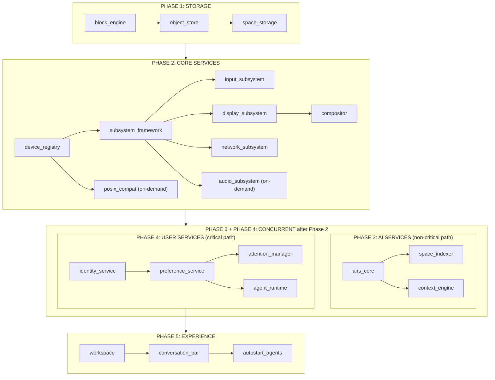
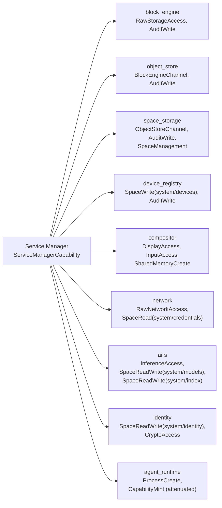

# AIOS Service Manager and Startup Phases

Part of: [boot.md](./boot.md) — Boot and Init Sequence
**Related:** [boot-kernel.md](./boot-kernel.md) — Kernel early boot, [boot-performance.md](./boot-performance.md) — Boot timing, [boot-recovery.md](./boot-recovery.md) — Recovery mode, [boot-lifecycle.md](./boot-lifecycle.md) — Shutdown

-----

## 4. Service Manager

The Service Manager is the first userspace process. It's the PID 1 of AIOS — responsible for starting, monitoring, and restarting every system service. If the Service Manager dies, the kernel panics (there's nothing left to manage the system).

### 4.1 How It's Spawned

The kernel creates the Service Manager directly, without going through the normal `ProcessCreate` syscall path (since there's no process to call the syscall yet):

```text
1. Kernel reads Service Manager ELF from initramfs
   (the initramfs is in memory, loaded by the UEFI stub)
2. Kernel creates a new address space (TTBR0)
3. Kernel loads ELF segments into the new address space
4. Kernel mints a ServiceManagerCapability from the root capability:
   - Can create processes
   - Can create IPC channels
   - Can mint service-level capabilities (but not kernel-level)
   - Can read/write system spaces (once storage exists)
   - Cannot modify kernel state directly
5. Kernel creates IPC channels:
   - svcmgr_to_kernel: for process creation requests
   - kernel_to_svcmgr: for kernel notifications (process exit, etc.)
6. Kernel sets up initial register state:
   - x0 = pointer to ServiceManagerBootInfo (capability tokens, channel IDs)
   - sp = top of allocated user stack
   - pc = ELF entry point
7. Kernel adds the process to the scheduler
8. Scheduler picks up the Service Manager and runs it
```

### 4.2 Service Descriptors

Every service is described by a `ServiceDescriptor` that the Service Manager reads from the initramfs at startup. The descriptors are compiled into the initramfs as a serialized array:

```rust
pub struct ServiceDescriptor {
    /// Unique identifier for this service.
    id: ServiceId,

    /// Human-readable name.
    name: &'static str,

    /// ELF binary content hash (in initramfs or system space).
    binary: ContentHash,

    /// Which boot phase this service belongs to.
    phase: BootPhase,

    /// Services that must be running before this one starts.
    dependencies: &'static [ServiceId],

    /// Capabilities this service needs.
    capabilities: &'static [ServiceCapabilityRequest],

    /// How to handle failures.
    restart_policy: RestartPolicy,

    /// Maximum time to wait for the service to report healthy.
    health_timeout: Duration,

    /// Whether this service is required for boot to proceed.
    /// If true, boot halts if this service fails to start.
    /// If false, boot continues and the service is retried in background.
    critical: bool,

    /// Priority for scheduling within its phase.
    /// Higher priority services start first when dependencies allow.
    priority: u8,
}

#[derive(Debug, Clone, Copy, PartialEq, Eq)]
pub enum BootPhase {
    Phase1Storage,
    Phase2Core,
    Phase3Ai,
    Phase4User,
    Phase5Experience,
}

/// Capability request for system services (compiled into initramfs).
/// Simpler than agent CapabilityRequest (agents.md §2.4) — system services
/// are always required and have static justification strings.
pub struct ServiceCapabilityRequest {
    capability: Capability,
    justification: &'static str,
}

pub enum RestartPolicy {
    /// Restart immediately on failure, with exponential backoff.
    Always {
        max_restarts: u32,          // within the window
        window: Duration,           // observation window
        backoff_base: Duration,     // initial delay
        backoff_max: Duration,      // maximum delay
    },
    /// Restart once, then mark as degraded.
    Once,
    /// Never restart. If it dies, it's gone.
    Never,
}
```

### 4.3 Service State Machine

Each service tracks its state through a state machine:

```rust
#[derive(Debug, Clone)]
pub enum ServiceState {
    /// Waiting for dependencies to be satisfied.
    Pending,
    /// Dependencies met, waiting for a slot in the phase.
    Ready,
    /// Process created, waiting for health check.
    Starting {
        pid: ProcessId,
        started_at: Timestamp,
    },
    /// Service reported healthy and is operational.
    Running {
        pid: ProcessId,
        started_at: Timestamp,
        channels: Vec<ChannelId>,
    },
    /// Service exited or crashed. May be restarted.
    Failed {
        exit_code: Option<i32>,
        restart_count: u32,
        last_failure: Timestamp,
        reason: FailureReason,
    },
    /// Service deliberately stopped (shutdown sequence).
    Stopped,
    /// Service failed too many times. Not retrying.
    Degraded {
        restart_count: u32,
        last_failure: Timestamp,
    },
}

pub enum FailureReason {
    ProcessExited(i32),
    ProcessCrashed(Signal),
    HealthCheckTimeout,
    DependencyFailed(ServiceId),
    ResourceExhausted,
}
```

### 4.4 Health Checking

Services report health via a dedicated IPC channel. The protocol is simple:

```text
Service Manager sends: HealthCheck { deadline: Timestamp }
Service replies:       HealthStatus::Healthy
                    or HealthStatus::Degraded { reason: String }
                    or (no reply within deadline → timeout → restart)
```

Health checks run every 10 seconds for critical services, every 30 seconds for non-critical. The first health check after startup has a longer timeout (`health_timeout` from the descriptor) to allow for initialization.

### 4.5 Service Dependency Graph

Services form a directed acyclic graph (DAG) where edges represent "must start after" relationships. The Service Manager uses topological sort within each phase to determine startup order, then starts independent services in parallel.

**Cross-phase dependencies:** Each phase requires all services from every previous phase to be healthy before it starts. The graph below shows only intra-phase dependencies. Cross-phase dependencies are implicit: every Phase 2 service depends on `space_storage` (Phase 1), every Phase 3 service depends on Phase 2 core services (specifically `space_storage` for persistent state and `compositor` for display access where needed), and so on. Phase 3 (AI) and Phase 4 (User) run in parallel after Phase 2 completes — they depend on Phase 2 but not on each other (see §6.1 timeline).



**Service count:** The graph shows 21 nodes, but `autostart_agents` is a boot step (the Agent Runtime spawning user agents), not a persistent system service. The actual service count is **20** (3 + 8 + 3 + 4 + 2).

### 4.6 Parallel Startup Within Phases

Within each phase, the Service Manager starts services in dependency order but launches independent services in parallel. For example, in Phase 2:

```text
t=0ms:   Start device_registry (no dependencies within phase)
         (posix_compat and audio_subsystem are on-demand — not started here;
          see boot-intelligence.md §17 for activation modes)
t=50ms:  device_registry reports healthy
         Start subsystem_framework (depends on device_registry)
t=80ms:  subsystem_framework reports healthy
         Start input_subsystem, display_subsystem, network_subsystem
         (all three in parallel — they depend on subsystem_framework
          but not on each other)
t=120ms: input_subsystem healthy
t=150ms: display_subsystem healthy
         Start compositor (depends on display_subsystem)
t=160ms: network_subsystem healthy
t=200ms: compositor healthy
         Phase 2 complete
```

### 4.7 Root Capability Delegation

The Service Manager holds a `ServiceManagerCapability` derived from the kernel's root capability. When it starts a service, it mints the minimum set of capabilities that service needs:



Each service receives exactly the capabilities it needs. No service holds the `ServiceManagerCapability` itself. Capability escalation is impossible — a compromised service cannot mint capabilities beyond its own set.

### 4.8 Service Discovery

When the Service Manager spawns a service, it creates IPC channels connecting that service to its dependencies. But a newly started service needs to know *which* channel connects to *which* dependency. This is the service discovery problem.

**Solution: `ServiceBootInfo` channel table.** Each service receives a `ServiceBootInfo` structure (passed via `x0`, just like the kernel passes `BootInfo` to the Service Manager). It contains the service's capability tokens and a table mapping `ServiceId` → `ChannelId`:

```rust
pub struct ServiceBootInfo {
    /// This service's identity
    service_id: ServiceId,

    /// Capability tokens granted to this service
    capabilities: Vec<CapabilityToken>,

    /// Channel table: maps dependency ServiceId to the ChannelId
    /// for communicating with that dependency.
    /// Example: space_storage's table contains:
    ///   { ObjectStore → ChannelId(7), AuditLog → ChannelId(12) }
    channels: HashMap<ServiceId, ChannelId>,

    /// Channel for receiving health checks from Service Manager
    health_channel: ChannelId,

    /// Channel for sending lifecycle events to Service Manager
    lifecycle_channel: ChannelId,
}
```

**How it works:**

1. Service Manager creates all IPC channels before starting the service.
2. Each channel has two endpoints — one for the new service, one for the existing dependency.
3. The dependency's endpoint is delivered to the already-running service via a `NewPeer` message on its lifecycle channel.
4. The new service's endpoints are all packed into `ServiceBootInfo.channels`.
5. The service looks up a dependency by `ServiceId` and gets back a `ChannelId` — no runtime discovery needed.

**Late discovery:** If a service starts after its dependents (e.g., AIRS starts late due to the 5-second timeout), the Service Manager sends `ServiceAvailable { id, channel }` messages to all services that declared a soft dependency on it. Those services can then establish communication. This is how the Attention Manager picks up AIRS after boot.

-----

## 5. Service Startup Phases (Detail)

### Phase 1: Storage

Storage is the first service phase because almost everything else depends on persistent state. Before storage, the system has only the initramfs (read-only, in memory).

**Block Engine** starts first. It takes ownership of the raw block device (VirtIO-Blk on QEMU, SD/eMMC on Pi). On first boot, it formats the device: writes the superblock, initializes the WAL region, creates the empty LSM-tree index (empty MemTable, no SSTables). On subsequent boots, it reads the superblock, replays the WAL to recover from any incomplete writes, and verifies the SSTable manifest.

```text
Block Engine startup:
  1. Open raw block device (via kernel device handle)
  2. Read superblock at LBA 0
     First boot:  magic absent → format device
     Normal boot: magic present → verify checksum
  3. Replay WAL (skip if clean shutdown flag is set)
     - Scan WAL from tail to head
     - Apply committed entries not yet in main storage
     - Discard uncommitted entries
  4. Verify SSTable manifest (which SSTables are live)
  5. Report healthy to Service Manager
  Target: ~100ms (dominated by device I/O)
```

**Object Store** starts after Block Engine. It provides content-addressed object storage on top of raw blocks. On first boot, it creates the initial reference count table and content index. On normal boot, it verifies the index root and is ready to serve.

**Space Storage** starts after Object Store. It creates the system spaces on first boot:

```text
First boot:
  system/             — Core zone
  system/devices/     — Device registry
  system/audit/       — Audit logs
  system/audit/boot/  — Boot audit log (flushed from kernel ring buffer)
  system/config/      — System configuration
  system/models/      — AI model storage
  system/index/       — Search indexes
  system/crash/       — Kernel panic logs
  system/agents/      — Installed agent manifests
  system/credentials/ — Credential store
  system/context/     — Context Engine learned patterns
  system/services/    — Service binaries (loaded in Phase 3-5)
  system/session/     — Semantic snapshots, boot traces
  system/identity/    — Identity keypairs, authentication state
```

On normal boot, Space Storage verifies these spaces exist and are consistent, then reports healthy. At this point, the kernel's audit ring buffer is flushed to `system/audit/boot/`. From now on, all audit events are written to space storage in real time.

**Phase 1 budget: ~300ms.**

### Phase 2: Core Services

These services make the system interactive. After Phase 2, there's a screen with content and the user can type.

**Device Registry** initializes first. It reads the device tree (or ACPI tables) and populates `system/devices/` with entries for all discovered hardware. On QEMU, this means VirtIO devices. On Pi, this means BCM peripherals.

**Subsystem Framework** initializes next. It registers the framework's core traits and the capability gate for hardware access. All subsystems (input, display, network, audio, etc.) register through this framework.

**Input Subsystem** registers with the framework and starts handling keyboard and mouse/touchpad events. On QEMU, this is VirtIO-Input (paravirtualized, no USB stack needed). On Pi, input requires the USB host controller:

```text
Pi 4/5 Input path:
  1. USB host controller init (DesignWare xHCI on Pi 4, RP1 xHCI on Pi 5)
     - Controller is discovered from Device Registry (device tree node)
     - xHCI rings allocated from kernel DMA-safe memory (bounce buffer
       region on Pi 4 where there's no SMMU; SMMU-mapped on Pi 5)
     - Controller reset, port power-on, initial hub enumeration
  2. USB hub enumeration
     - Pi 4: integrated VL805 USB 3.0 hub (4 ports)
     - Pi 5: RP1 southbridge (4 USB ports, 2× USB 3.0 + 2× USB 2.0)
     - Enumerate all connected devices, match USB class codes
  3. USB HID driver
     - Claim keyboard (class 0x03, subclass 0x01, protocol 0x01)
     - Claim mouse/touchpad (class 0x03, subclass 0x01, protocol 0x02)
     - Set up interrupt transfers for input polling
  4. Route events to compositor's input router

Apple Silicon Input path:
  External keyboards/mice use USB HID (same xHCI path as Pi 5).
  Built-in keyboard and trackpad (on laptops) use SPI transport
  — discovered from device tree, handled by a dedicated SPI HID driver.

Timing: USB enumeration takes 50-200ms (device-dependent).
If USB fails on Pi, keyboard/mouse are unavailable — this is a
Phase 2 critical failure on Pi (but not on QEMU, which uses VirtIO-Input).
On Apple Silicon laptops, the SPI keyboard provides a fallback.
```

**Display Subsystem** initializes the GPU driver. On QEMU, this is VirtIO-GPU: the driver negotiates display resolution, allocates scanout buffers, and sets up the rendering pipeline via wgpu. On Pi, this is the VC4/V3D driver (Pi 4) or V3D 7.1 (Pi 5), which provides Vulkan capabilities. On Apple Silicon, this is the AGX GPU driver (~150ms init, custom command queue interface). The display subsystem takes over from the early framebuffer (see Section 7 for the handoff).

**GPU memory:** VideoCore VI/VII on Pi shares system RAM with the CPU — there is no discrete VRAM. The Pi firmware reserves a contiguous region for the GPU (specified in `config.txt` as `gpu_mem`, default 76 MB on Pi 4, 64 MB on Pi 5). The kernel discovers this reservation via the device tree `/reserved-memory` node during Step 4 and excludes it from the buddy allocator. The Display Subsystem uses this region for scanout buffers, texture memory, and render targets. On Apple Silicon, AGX uses unified memory with no static reservation — the GPU allocates from the same physical pages as the CPU, managed by DART (Apple's IOMMU). Importantly, the AIRS model selection thresholds (§5 Phase 3) account for GPU-reserved memory — "available RAM" means total RAM minus kernel minus GPU reservation:

```text
Pi 4 (4 GB model):  4096 - ~2 (kernel) - 76 (GPU) = ~4018 MB available
                     → selects 3B Q4_K_M (~2.0 GB)
Pi 4 (8 GB model):  8192 - ~2 (kernel) - 76 (GPU) = ~8114 MB available
                     → selects 8B Q4_K_M (~4.5 GB)
Pi 5 (8 GB):        8192 - ~2 (kernel) - 64 (GPU) = ~8126 MB available
                     → selects 8B Q4_K_M (~4.5 GB)
Apple M1 (8 GB):    8192 - ~2 (kernel) = ~8190 MB available
                     → selects 8B Q4_K_M (~4.5 GB)
                     (unified memory — AGX GPU shares with CPU, no reservation)
Apple M1 (16 GB):   16384 - ~2 (kernel) = ~16382 MB available
                     → selects 8B Q5_K_M (~4.5 GB, higher quality)
QEMU (default 4 GB): no GPU reservation (VirtIO-GPU uses host memory)
                     → selects 3B Q4_K_M (~2.0 GB)
```

**Compositor** starts after display. It creates the initial render pipeline, registers with the input subsystem for event routing, and presents the first composited frame. At this point, the splash screen transitions from the early framebuffer to the compositor.

**Network Subsystem** starts in parallel with display/compositor. It initializes the network stack (smoltcp), configures the network interface (VirtIO-Net on QEMU, Genet Ethernet on Pi), and starts DHCP. Basic TCP/IP is available from this point — but the full Network Translation Module (space resolver, shadow engine, etc.) comes later (Phase 16 in the development plan).

**POSIX Compatibility** starts in parallel with other Phase 2 services. It initializes the translation layer: mounts the POSIX filesystem view over spaces (`/spaces/`, `/home/`, `/tmp/`, `/dev/`, `/proc/`), sets up the C library (musl libc) shim, and makes BSD tools available.

**Audio Subsystem** starts in parallel with network and POSIX. It registers with the Subsystem Framework and initializes the audio hardware: VirtIO-Sound on QEMU, PWM/I2S via the BCM audio peripheral on Pi 4/5 (accessed through the BCM2711 DMA controller on Pi 4, RP1 I2S on Pi 5), or the Apple MCA (Multi-Channel Audio) codec on Apple Silicon. The audio subsystem is **not critical** — if it fails, boot continues without sound. It provides: PCM output (mixing engine), optional input (microphone), and routing (HDMI audio vs 3.5mm jack vs Bluetooth). The scheduler grants audio threads RT class scheduling (same as compositor) to meet latency deadlines (scheduler.md §3.1).

**Phase 2 budget: ~500ms.**

### Phase 3: AI Services

AI services are **not on the critical boot path**. Phase 3 runs in parallel with Phase 4 after Phase 2 completes. If AIRS takes too long, the desktop appears without it.

**AIRS Core** starts first. It scans `system/models/` for available models, loads the default model's weights into memory (memory-mapped from space storage — this is fast because `mmap` avoids copying), and allocates the initial KV cache. The dominant cost is reading model weights from disk: a 4.5 GB Q4_K_M model takes ~2 seconds to memory-map from NVMe, longer from SD card.

```text
AIRS startup:
  1. Read model registry from system/models/ space
  2. Select default model based on available RAM
     (see airs.md §4.6 for full thresholds):
     >= 16 GB RAM: load 8B Q5_K_M  (~4.5 GB, higher quality)
     >= 8 GB RAM:  load 8B Q4_K_M  (~4.5 GB)
     >= 4 GB RAM:  load 3B Q4_K_M  (~2.0 GB)
     >= 2 GB RAM:  load 1B Q4_K_M  (~0.9 GB)
      < 2 GB RAM:  no local model (cloud-only or degraded)
  3. Memory-map model weights (mmap, lazy page-in)
  4. Initialize GGML runtime + NEON SIMD
  5. Warm up: run a short inference to fault in hot pages
  6. Report healthy to Service Manager
```

**The 5-second timeout:** The Service Manager gives AIRS 5 seconds to report healthy. If model loading is slow (large model on slow storage), the Service Manager proceeds to Phase 4 and Phase 5 without AIRS. AIRS continues loading in the background. Once it reports healthy, it's integrated seamlessly — the Context Engine picks it up, the Space Indexer starts, and the conversation bar becomes functional. The user sees the desktop immediately; AI features arrive moments later.

**Space Indexer** starts after AIRS is healthy. On first boot, it has nothing to index. On subsequent boots, it scans for objects modified since the last index update and queues them for embedding generation. This runs entirely in the background at `InferencePriority::Background`.

**Context Engine** starts after AIRS is healthy. It begins collecting signals (active spaces, running agents, input patterns, time of day) and makes its first context inference. If AIRS isn't available, the Context Engine immediately falls back to rule-based heuristics.

**Phase 3 budget: not on critical path. Runs in parallel with Phases 4-5. Target: AIRS healthy within 5 seconds.**

### Phase 4: User Services

User services personalize the system. They depend on storage (Phase 1) and core services (Phase 2), but not necessarily on AIRS (Phase 3).

**Identity Service** starts first. It reads the identity store from `system/identity/` (encrypted). If this is first boot, it generates a new Ed25519 keypair and prompts for a user passphrase (displayed via the compositor, which is already running). On normal boot, it uses the stored passphrase hash (or biometric, or hardware key) to unlock the identity. Once identity is established, per-space encryption keys can be derived.

**Preference Service** starts after Identity. It reads user preferences from the `user/preferences/` space. Display settings, notification thresholds, context overrides, keyboard layout, locale — all loaded and applied. If the preference space doesn't exist (first boot), defaults are used.

**Attention Manager** starts after Preferences (see [attention.md](../intelligence/attention.md) for the full attention model). It initializes the notification pipeline, loads attention rules from preferences, and begins accepting notifications from other services. AIRS is a soft dependency: if available, the Attention Manager enables AI-powered triage; otherwise, it uses rule-based triage. This is why the Attention Manager is in Phase 4 (not Phase 3) — it must not block on AIRS loading.

**Agent Runtime** starts last in this phase. It initializes the agent sandbox infrastructure, loads the list of approved agents from `system/agents/`, and prepares to spawn agents on request. It does not spawn agents yet — that happens in Phase 5.

**Phase 4 budget: ~200ms.**

### Phase 5: Experience

The final phase makes the system user-facing.

**Workspace** renders the home view. It queries the Agent Runtime for active agent tasks, Space Storage for recent spaces, and the Attention Manager for the notification digest. The first frame of the Workspace is the "boot complete" moment — the user sees a usable desktop.

**Conversation Bar** initializes. If AIRS is available, it's fully functional. If AIRS is still loading, it shows a subtle "AI loading..." indicator and disables natural language features until AIRS reports healthy. Keyword search (via the full-text index) works immediately.

**Autostart Agents** are spawned. Any agents marked as autostart in the user's preferences are launched by the Agent Runtime. These are lightweight agents the user wants always running — a music agent, a backup agent, etc.

**Boot Complete Signal:** The Service Manager records the total boot time in `system/audit/boot/` and logs it to UART:

```text
[boot] Phase 5 complete — boot to desktop in 1,847ms
[boot] Services: 20 running, 0 failed, 0 degraded
[boot] AIRS: healthy (model: llama-3.1-8b-q4_k_m, loaded in 3,200ms)
```

**Phase 5 budget: ~150ms (first frame).**

### First Boot Experience

Design principle 7 says "first boot and normal boot are the same code path." The code path is the same — but what the user *sees* is different, because there's no identity, no preferences, and no spaces yet.

**What's different on first boot:**

| Phase | Normal boot | First boot |
|---|---|---|
| Phase 1 | Verify existing spaces | **Format storage, create system spaces** (~200ms extra) |
| Phase 2 | Normal startup | Same (compositor, input ready) |
| Phase 3 | Load existing model | Same (or skip if no model pre-loaded in `system/models/`) |
| Phase 4 Identity | Unlock with stored passphrase/biometric | **Setup flow: create new identity** |
| Phase 4 Preferences | Load from space | Use defaults |
| Phase 5 | Desktop with recent spaces | **Empty desktop → setup flow overlay** |

**The setup flow** is a compositor overlay rendered by the Identity Service in coordination with the Workspace. It is *not* a separate installer binary — it runs inside the normal service pipeline, using the same compositor, input subsystem, and IPC channels as any other UI.

```text
First Boot Setup Flow (compositor overlay):

1. Language & Locale Selection
   - Grid of language options, keyboard layout detection
   - Selected via touchscreen, mouse, or keyboard arrows
   - This sets initial preferences (written to user/preferences/ when created)

2. Passphrase Creation
   - "Create a passphrase to protect your data"
   - Min 8 characters, strength meter
   - This passphrase derives the master encryption key for user spaces
   - Optionally: connect hardware security key (USB)
   - On Pi 5: optionally enable fingerprint (if USB reader present)

3. Wi-Fi Configuration (if network not already connected)
   - Scan for networks, select, enter password
   - Skippable — AIOS is fully functional offline
   - If connected: time sync via NTP (see boot-performance.md §6.5)

4. AIRS Model Selection (if not pre-loaded)
   - "AIOS includes a local AI assistant. Choose a model:"
   - Options based on available RAM (same thresholds as §5 Phase 3)
   - Download starts in background if network available
   - Skippable — AIOS works without AIRS (conversation bar degraded)

5. Complete
   - Identity created, user space created, preferences written
   - Setup overlay fades out, Workspace renders home view
   - First provenance entry for user identity recorded
```

**Timing:** The setup flow adds user-wait time (passphrase typing, Wi-Fi selection) but no extra code path. Once complete, the system is in the same state as a normal boot — identity unlocked, preferences loaded, Workspace visible. Subsequent boots skip the setup flow entirely because `system/identity/` already exists.

**Headless first boot (no display):** If no framebuffer is available (UEFI GOP absent), the setup flow runs on UART. The Identity Service detects the absence of the compositor and falls back to a text-mode setup. This is primarily for development (QEMU `-nographic` mode).

-----
