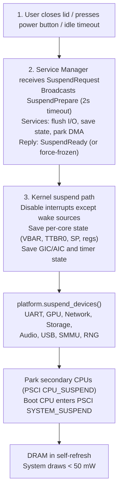
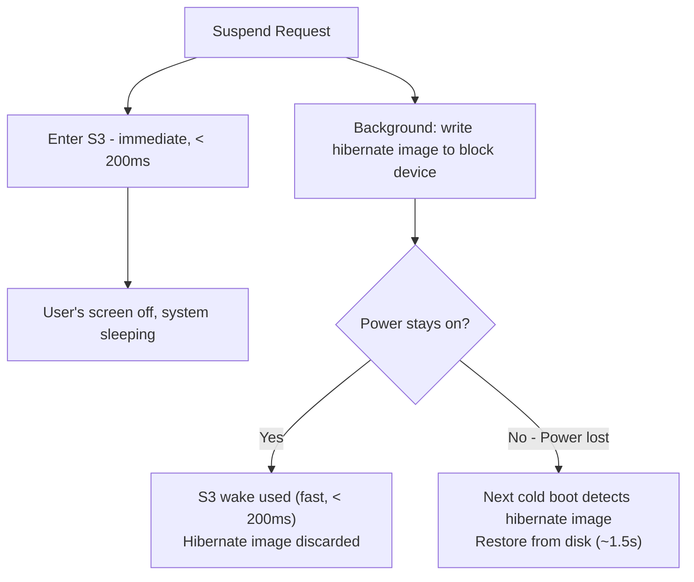
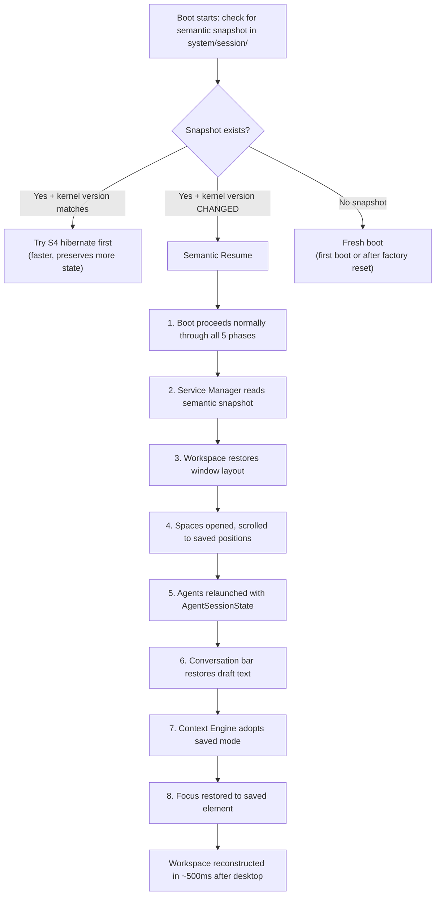

# AIOS Suspend, Resume, and Semantic State

Part of: [boot.md](./boot.md) — Boot and Init Sequence
**Related:** [boot-lifecycle.md](./boot-lifecycle.md) — Shutdown, [boot-intelligence.md](./boot-intelligence.md) — Boot intelligence, [boot-kernel.md](./boot-kernel.md) — Kernel early boot, [power-management.md](../platform/power-management.md) — Power management

-----

## 15. Suspend, Resume, and Semantic State

Users rarely cold boot. The daily experience is closing a lid, pressing a power button, or walking away. The system's job is to make returning feel instantaneous and *lossless* — nothing should ever be lost, regardless of how the system went down. AIOS provides four layers of state continuity, from fastest-cheapest to most-resilient:

```text
Layer               Resume Time    Survives          State Fidelity
──────────────────────────────────────────────────────────────────────
S3 (Suspend-to-RAM)     < 200ms   Lid close/open    Perfect (RAM powered)
S4 (Hibernate)          ~1.5s     Power loss         Perfect (RAM → disk)
Semantic Resume         ~2.0s     Kernel update      Reconstructed (semantic)
Ambient Continuity     (always on) Crash, panic, fire Continuous (Spaces)
```

### 15.1 Suspend-to-RAM (S3)

The fastest resume path. CPU cores are powered down, DRAM stays in self-refresh, and all device state is saved to kernel memory. On wake, the kernel restores device state and resumes exactly where it left off.

**Suspend sequence:**



**Wake sequence:**

```text
Wake source fires (lid open, power button, RTC alarm, network wake-on-LAN)
     │
     ▼
1. Firmware restarts boot CPU at the suspend resume entry point
   - NOT the normal boot path — jumps to saved resume address
   - Boot CPU restores: MMU (TTBR1_EL1), stack pointer, exception vectors
     │
     ▼
2. Kernel resume path
   - Restore interrupt controller state (GIC distributor/redistributor, or AIC)
   - Restore timer state, re-arm scheduler tick
   - Call platform.resume_devices() (reverse of suspend_devices)
   - Resume secondary CPUs via PSCI CPU_ON (same trampoline as boot)
     │
     ▼
3. Service Manager resumes
   - Broadcasts ResumeNotify to all frozen services
   - Services restore volatile state, re-establish connections
   - Compositor presents the last frame immediately (no re-render needed)
     │
     ▼
4. User sees their desktop — exactly as they left it
   Total resume time: < 200ms (dominated by device re-init)
```

**Wake sources by platform:**

```text
Platform    Wake Sources                                Notes
──────────────────────────────────────────────────────────────
QEMU        Keyboard, timer (RTC alarm)                 No lid, no real power mgmt
Pi 4        GPIO (power button), USB (keyboard),        No built-in RTC; external
            Genet (wake-on-LAN), timer (ext RTC)        RTC module needed for timed wake
Pi 5        GPIO (power button), USB, Genet,            Built-in RTC with battery
            RTC (built-in), PCIe wake                   connector — timed wake works
Apple       Power button, USB, lid open,               SMC handles wake, always-on
Silicon     Thunderbolt, RTC, network (WiFi/BT)        RTC, lid switch via SMC
```

**PSCI power states:** ARM PSCI defines power states for suspend. AIOS uses the deepest state that preserves DRAM:

```rust
pub enum SuspendPowerState {
    /// CPU cores off, L2 off, DRAM in self-refresh.
    /// Deepest state that preserves memory. Used for S3.
    DeepSleep,
    /// CPU cores in WFI, L2 retained, DRAM active.
    /// Used for short idle (< 30 seconds). Faster wake (~5ms).
    LightSleep,
}
```

### 15.2 Hibernate (S4)

Hibernate writes the entire system state to persistent storage, then powers off completely. On wake, the state is read back and the system resumes. This survives complete power loss — pull the plug, replace the battery, come back a week later, everything is exactly where you left it.

**Hibernate is S3 with a safety net.** AIOS enters S3 first (fast wake), and starts writing the hibernate image to storage *in the background while the system is suspended*. If power fails during S3 (DRAM loses content), the next boot detects the hibernate image and resumes from it. If S3 wake succeeds normally, the hibernate image is discarded.



**Hibernate image format:**

```rust
pub struct HibernateImage {
    magic: u64,                         // 0x41494F53_48494245 ("AIOSHIBE")
    version: u32,                       // format version
    kernel_version: u64,                // must match running kernel
    checksum: [u8; 32],                // SHA-256 of payload
    page_count: u64,                   // number of pages saved
    compressed_size: u64,              // zstd-compressed payload size

    // CPU state for each core
    cpu_states: [CpuSuspendState; MAX_CPUS],

    // Device state snapshots
    device_states: DeviceStateBlock,

    // Compressed memory pages (zstd stream)
    // Only dirty pages are saved — clean pages backed by
    // Space Storage or mmap'd files are not included
    // (they'll be demand-paged from storage on access).
    pages: CompressedPageStream,
}
```

**Key optimization:** Only dirty pages are written. Clean pages (kernel text, mmap'd model weights, read-only space data) are demand-paged from storage on resume. On a system with 4 GB RAM where 1.5 GB is clean file-backed pages, the hibernate image is ~2.5 GB uncompressed, ~1.2 GB compressed. At SD card write speeds (50 MB/s), that's ~24 seconds to write — which is fine because it happens in background during S3.

**Hibernate partition:** A dedicated raw partition on the block device (not a Space — it must be accessible before Space Storage starts). The Block Engine reserves this during first-boot formatting:

```text
Block device layout:
  [Superblock] [Panic dump] [Hibernate partition] [WAL] [Main storage]
                              └─ sized to match physical RAM
```

### 15.3 Semantic Resume

This is where AIOS diverges from every other OS.

Traditional hibernate saves raw memory — a perfect snapshot of RAM. But that snapshot is brittle: it's tied to a specific kernel version (data structures must match), specific hardware (device handles are meaningless after a hardware change), and a specific moment (no way to partially resume). If you update the kernel, the hibernate image is invalid. If you move the disk to a different machine, the image is useless.

**Semantic Resume saves meaning, not bits.** Instead of dumping 4 GB of RAM, it captures a compact semantic description of the user's state:

```rust
pub struct SemanticSnapshot {
    /// When this snapshot was taken
    timestamp: Timestamp,

    /// Active workspace layout
    workspace: WorkspaceState,

    /// Open spaces and cursor positions within each
    open_spaces: Vec<OpenSpaceState>,

    /// Active agents and their conversation context
    active_agents: Vec<AgentSessionState>,

    /// Compositor window geometry and z-order
    window_layout: Vec<WindowState>,

    /// Conversation bar state (draft text, history position)
    conversation: ConversationBarState,

    /// Context Engine's last inference (work/play/focus mode)
    context_mode: ContextMode,

    /// Attention Manager's pending notification queue
    pending_notifications: Vec<NotificationState>,

    /// Currently focused element (which window, which field)
    focus: FocusState,

    /// Scroll positions, selection ranges, cursor positions
    /// across all visible content
    view_states: Vec<ViewState>,
}

pub struct OpenSpaceState {
    space_id: SpaceId,
    /// Content hash of the object being viewed/edited
    object_hash: ContentHash,
    /// Cursor/selection within the content
    cursor: CursorState,
    /// Scroll position (normalized 0.0–1.0)
    scroll: f64,
    /// Unsaved edits (stored as a diff against the object)
    pending_edits: Option<EditDiff>,
}

pub struct AgentSessionState {
    agent_id: AgentId,
    /// Conversation history (lightweight: just message IDs referencing Spaces)
    conversation_ref: ObjectRef,  // see spaces-data-structures.md §3.3 for ObjectRef
    /// Agent's declared resumable state (agent-specific, opaque to the kernel)
    agent_state: Vec<u8>,
    /// What the agent was doing when suspended
    active_task: Option<TaskDescription>,
}

pub struct WindowState {
    service_id: ServiceId,
    /// Position and size (logical pixels)
    geometry: Rect,
    /// Z-order index
    z_order: u32,
    /// Minimized / maximized / floating
    display_mode: WindowDisplayMode,
    /// Content identity (which space/object/agent this window shows)
    content_ref: ContentReference,
}
```

**When Semantic Resume is used:**



**Why this matters:**
- **Kernel updates don't disrupt your session.** Update, reboot, everything is back. No other OS does this.
- **Cross-device continuity.** Copy your Spaces to a new device, boot, and your workspace reconstructs itself. The semantic snapshot travels with your data because it's stored *in* Spaces.
- **Crash recovery.** Even after a kernel panic, the last semantic snapshot (written continuously — see §15.4) restores context.
- **Partial resume.** Semantic Resume can skip stale elements. If an agent was uninstalled since the snapshot, it's silently dropped. If a space was deleted, that window is omitted. The system doesn't crash on stale state — it adapts.

**The semantic snapshot is written to `system/session/` as a Space object.** This means it's versioned, content-addressed, and encrypted (if user spaces are encrypted). The Service Manager writes a new snapshot every 60 seconds during normal operation, and immediately before suspend/shutdown. The overhead is negligible — it's typically < 50 KiB of structured data.

### 15.4 Ambient State Continuity

Semantic Resume captures state every 60 seconds. But what about the 59 seconds between snapshots? If the power cuts 30 seconds after the last snapshot, 30 seconds of work could be lost.

**Ambient State Continuity** is the principle that user-visible state is *continuously* persisted. The system should *never* lose more than a few seconds of user activity, regardless of how it goes down.

This is possible because Spaces already provides content-addressed, versioned storage. The missing piece is making writes *continuous* rather than batched:

```text
Traditional OS:
  User types → in-memory buffer → "Save" → disk
  Power loss before save → data lost

AIOS Ambient Continuity:
  User types → in-memory buffer → continuous trickle to Space WAL
  Power loss → WAL replay → at most ~2 seconds of keystrokes lost
```

**Implementation — three tiers:**

**Tier 1: Edit Journal (< 2 second loss window).** Every user input event that modifies content (keystroke, paste, drag, delete) is appended to a per-space *edit journal* in the Block Engine's WAL. The WAL is designed for sequential appends and is fsynced every 2 seconds. On crash, WAL replay reapplies the journal to the last committed object version.

```rust
pub struct EditJournalEntry {
    space_id: SpaceId,
    object_hash: ContentHash,          // base version
    timestamp: Timestamp,
    operation: EditOperation,
}

pub enum EditOperation {
    InsertText { offset: usize, text: String },
    DeleteRange { offset: usize, len: usize },
    ReplaceRange { offset: usize, len: usize, text: String },
    // ... extensible per content type
}
```

**Tier 2: Semantic Snapshot (60-second interval).** The full SemanticSnapshot from §15.3, capturing workspace layout, agent states, and view positions. Written to `system/session/` as a Space object.

**Tier 3: Space Object Commits (application-driven).** Agents and services commit completed units of work to Spaces on their own schedule. A document agent commits after each paragraph. A music agent commits its playlist state after each track change. These are full content-addressed objects with version history.

**On recovery (crash, panic, power loss):**

```text
1. Block Engine starts, replays WAL
   → Tier 1 edit journal entries applied to objects
   → At most ~2 seconds of edits lost

2. Space Storage starts, verifies objects
   → Tier 3 committed objects are intact (content-addressed, checksummed)

3. Phase 5 starts, reads semantic snapshot from system/session/
   → Tier 2 workspace layout restored (at most ~60 seconds stale)
   → Window positions may be slightly off; agents may ask
     "Resume from where you left off?" if their state is stale

4. User sees their workspace, with content intact
   → The document they were typing has everything except
     the last ~2 seconds of keystrokes
```

**Cost:** The WAL write overhead for Tier 1 is ~500 bytes per keystroke event, fsynced in batches every 2 seconds. On a 100 WPM typist, that's ~4 KB/s — negligible even on SD cards. The semantic snapshot (Tier 2) is < 50 KiB every 60 seconds. The total overhead of ambient continuity is unmeasurable in normal usage.

### 15.5 Proactive Wake

AIRS observes usage patterns over time: when the user typically wakes the device, how long boot takes, which services and models they use first. Proactive Wake uses this to pre-warm the system *before* the user arrives.

```text
Monday–Friday:
  User's alarm is 7:00 AM (calendar event in Spaces)
  User typically opens the laptop at 7:15 AM
  AIRS model load takes ~3 seconds

  → System wakes at 7:12 AM (3 minutes before predicted use)
  → Pre-loads AIRS model into memory (fault in pages from mmap)
  → Warms Space index caches (recent workspaces)
  → Checks for and downloads OTA updates (if idle window)
  → NTP sync (clock may have drifted during sleep)
  → Screen stays off — no power wasted on display
  → When user opens lid at 7:15 → instant response, model warm
```

**How it works:**

```rust
pub struct ProactiveWakeConfig {
    /// Whether proactive wake is enabled (user preference).
    /// Default: on. Can be disabled for power savings.
    enabled: bool,

    /// Minimum confidence before scheduling a proactive wake.
    /// Range: 0.0–1.0. Default: 0.7 (70% confidence).
    confidence_threshold: f32,

    /// How far ahead of predicted use to wake (for pre-warming).
    /// Default: 180 seconds. Adjusted by AIRS based on observed
    /// pre-warm duration (model load time + cache warming time).
    lead_time: Duration,

    /// Maximum time to stay awake if the user doesn't arrive.
    /// Default: 600 seconds (10 minutes). After this, re-suspend.
    max_idle_awake: Duration,

    /// Power source requirement. Default: AcOrBatteryAbove50.
    power_policy: ProactiveWakePowerPolicy,
}

pub enum ProactiveWakePowerPolicy {
    /// Only proactive-wake on AC power
    AcOnly,
    /// AC or battery above threshold
    AcOrBatteryAbove50,
    /// Always (even on low battery)
    Always,
}
```

**Wake scheduling:** The kernel programs the RTC (Pi 5's built-in RTC, or an external RTC module on Pi 4) with a wake alarm. On QEMU, the UEFI RTC is used. The alarm fires, the system resumes from S3, runs the pre-warm tasks with the screen off, then either:
- The user arrives → screen on, instant response
- The timeout expires → re-suspend (cost: a few seconds of power)

**Learning:** AIRS maintains a simple usage model in `system/session/proactive_wake`:

```text
Day-of-week × hour-of-day → probability of first interaction
```

A 7×24 grid (168 cells), updated daily with exponential decay. After two weeks of consistent usage, predictions are reliable. No cloud needed — all local.

**Privacy:** Proactive Wake schedules are stored locally in `system/session/` and never leave the device. The usage model is a simple probability grid, not a detailed activity log. The user can inspect and delete it via Preferences.

-----
