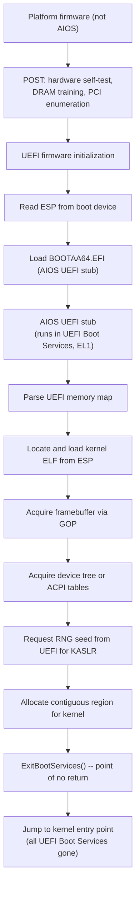
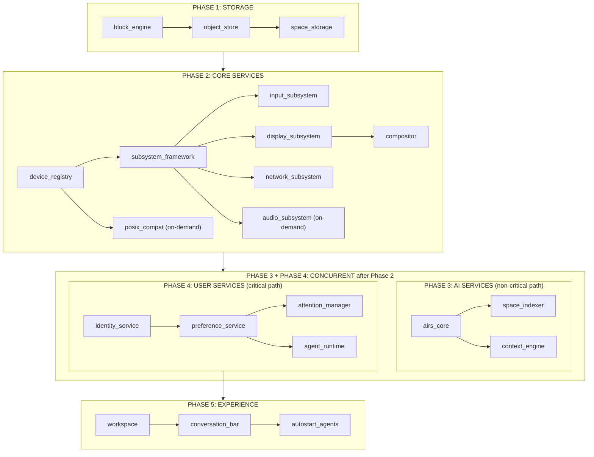
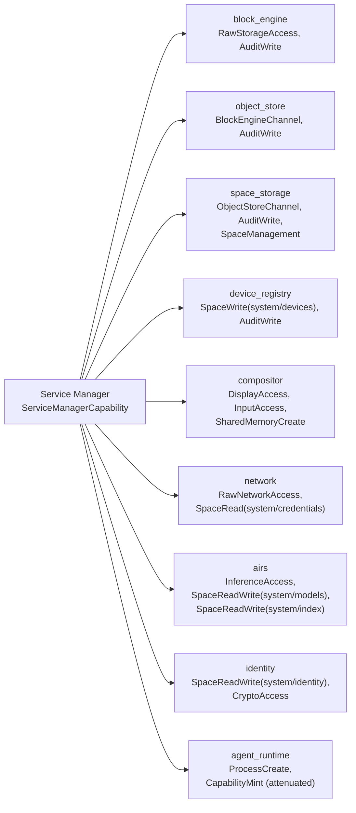
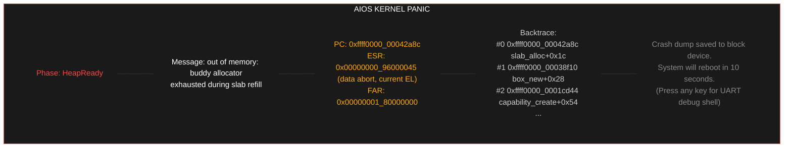
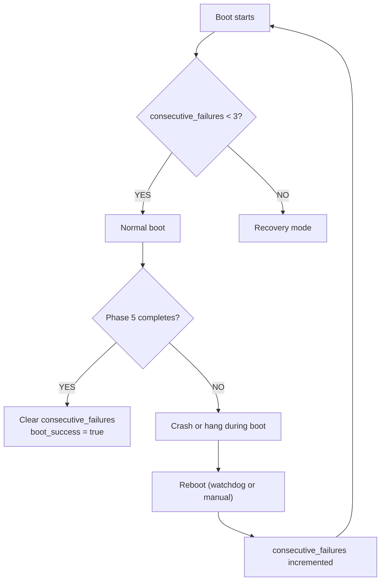
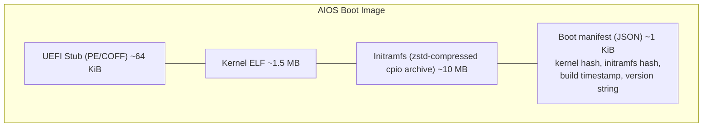

# AIOS Boot and Init Sequence

## Deep Technical Architecture

**Parent document:** [architecture.md](../project/architecture.md) — Section 6.1 Boot Sequence
**Companion:** [boot-lifecycle.md](./boot-lifecycle.md) — Shutdown, suspend/resume, boot intelligence, advanced topics, and design principles
**Related:** [hal.md](./hal.md) — Platform trait, device abstractions, porting guide, [ipc.md](./ipc.md) — IPC and syscalls, [scheduler.md](./scheduler.md) — Scheduling classes and context multipliers, [memory.md](./memory.md) — Memory management and pool sizing, [spaces.md](../storage/spaces.md) — Space Storage, [airs.md](../intelligence/airs.md) — AI Runtime Service, [compositor.md](../platform/compositor.md) — Display handoff and framebuffer, [security.md](../security/security.md) — Capability system and trust levels, [identity.md](../experience/identity.md) — Identity initialization, [agents.md](../applications/agents.md) — Agent lifecycle and state persistence, [attention.md](../intelligence/attention.md) — Attention Manager initialization, [context-engine.md](../intelligence/context-engine.md) — Context Engine startup, [preferences.md](../intelligence/preferences.md) — Preference Service startup, [development-plan.md](../project/development-plan.md) — Phase plan

-----

## 1. Overview

The parent architecture document describes the boot sequence at a high level: five service manager phases layered on top of firmware handoff and kernel early boot. This document goes deeper — the actual data structures, initialization order, timing constraints, hardware differences, recovery paths, and the mechanisms that make a sub-3-second boot possible.

The boot sequence has one invariant that governs every design decision: **the system is usable at each phase boundary.** If any phase after Phase 2 (core services) fails, the user still gets a functional — if degraded — desktop. AIRS failure doesn't block boot. Network failure doesn't block boot. The only hard dependencies on the critical path are: firmware, kernel, storage, display, and the compositor.

-----

## 2. Firmware Handoff

### 2.1 UEFI Boot on aarch64

AIOS boots via UEFI on aarch64. The firmware is not part of AIOS — it's provided by the platform (QEMU's built-in UEFI, or the Pi's firmware). AIOS controls everything from the moment the kernel receives execution.

**Boot flow:**



### 2.2 What the Kernel Receives

The UEFI stub assembles a `BootInfo` structure and passes it to the kernel entry point in a register (`x0`). This is the kernel's only source of information about the hardware:

```rust
/// Passed from UEFI stub to kernel entry point.
/// Lives in a region marked as BootInfo in the memory map.
#[repr(C)]
pub struct BootInfo {
    /// Magic number for validation: 0x41494F53_424F4F54 ("AIOSBOOT")
    magic: u64,

    /// UEFI memory map: array of MemoryDescriptor entries.
    /// The kernel uses this to know what physical memory exists,
    /// what's reserved, and what's free.
    memory_map: MemoryMap,

    /// Framebuffer for early visual output (before compositor exists).
    /// Acquired from UEFI GOP. May be None on headless systems.
    framebuffer: Option<FramebufferInfo>,

    /// Device tree blob (FDT). On QEMU and Pi, this describes
    /// all hardware: interrupt controllers, timers, UARTs, etc.
    device_tree: Option<DeviceTreeInfo>,

    /// ACPI RSDP (Root System Description Pointer).
    /// QEMU provides both DTB and ACPI. Pi provides DTB only.
    /// Kernel prefers DTB when both are present.
    acpi_rsdp: Option<PhysicalAddress>,

    /// UEFI Runtime Services function table.
    /// Provides: GetTime, SetTime, ResetSystem, GetVariable.
    /// Available after ExitBootServices (unlike Boot Services).
    runtime_services: Option<PhysicalAddress>,

    /// Random seed from UEFI RNG protocol. Used for KASLR.
    /// If unavailable, kernel falls back to timer-based entropy.
    rng_seed: [u8; 32],

    /// Physical address where the kernel ELF was loaded.
    kernel_phys_base: PhysicalAddress,

    /// Size of kernel image in memory (text + rodata + data + bss).
    kernel_size: usize,

    /// Physical address of the initramfs (cpio archive).
    initramfs_base: PhysicalAddress,
    initramfs_size: usize,

    /// Command line arguments (from UEFI boot variable or config).
    cmdline: CommandLine,
}

#[repr(C)]
pub struct MemoryMap {
    entries: *const MemoryDescriptor,
    entry_count: usize,
    entry_size: usize,          // UEFI descriptor size (may be > sizeof)
}

#[repr(C)]
pub struct MemoryDescriptor {
    memory_type: MemoryType,
    physical_start: PhysicalAddress,
    virtual_start: VirtualAddress, // unused, UEFI sets to 0
    page_count: u64,            // pages of 4 KiB each
    attributes: u64,            // cacheability, write-protection
}

/// Classification of physical memory (see also memory.md §2 for canonical definition).
pub enum MemoryType {
    Conventional,               // free, usable by kernel
    LoaderCode,                 // UEFI stub code, reclaimable
    LoaderData,                 // UEFI stub data, reclaimable
    BootServicesCode,           // reclaimable after ExitBootServices
    BootServicesData,           // reclaimable after ExitBootServices
    RuntimeServicesCode,        // reserved, UEFI Runtime uses this
    RuntimeServicesData,        // reserved, UEFI Runtime uses this
    Reserved,                   // firmware-reserved, do not touch
    AcpiReclaimable,            // ACPI tables, reclaimable after parsing
    AcpiNvs,                    // ACPI non-volatile storage, reserved
    MemoryMappedIO,             // device MMIO, not real RAM
    BootInfo,                   // the BootInfo struct itself
    KernelImage,                // where the kernel ELF was loaded
    Initramfs,                  // the initial ramdisk
}

#[repr(C)]
pub struct FramebufferInfo {
    base: PhysicalAddress,             // physical address of pixel buffer
    size: usize,                // total buffer size in bytes
    width: u32,                 // pixels
    height: u32,                // pixels
    stride: u32,                // bytes per row (may include padding)
    format: PixelFormat,        // Bgr8, Rgb8, or custom bitmask
}

pub enum PixelFormat {
    Bgr8,                       // most common: blue-green-red, 8 bits each
    Rgb8,
    Bitmask {
        red: PixelBitmask,
        green: PixelBitmask,
        blue: PixelBitmask,
    },
}

#[repr(C)]
pub struct DeviceTreeInfo {
    base: PhysicalAddress,
    size: usize,
}

#[repr(C)]
pub struct CommandLine {
    ptr: *const u8,
    len: usize,
}
```

### 2.3 Kernel Command Line

The `CommandLine` in `BootInfo` is a UTF-8 string parsed by the kernel during Step 4 (device tree parse). It comes from `boot.cfg` on the ESP or from the UEFI `LoadOptions` variable. Recognized options:

```
Option              Default   Description
────────────────────────────────────────────────────────────
quiet               off       Suppress kernel log output to UART. Boot phase
                              transitions are still logged; service logs are not.
debug               off       Enable verbose kernel logging: page table setup
                              details, capability minting, IPC channel creation.
safe                off       Boot into safe mode (§9.3) — reduced service set,
                              no AIRS, no agents, no network.
console=<device>    uart0     Kernel log output device. Supported: uart0, none.
                              "none" disables UART logging entirely.
earlybreak          off       Halt after kernel early boot completes (before
                              launching Service Manager). Drop to UART debug
                              prompt. Useful for kernel debugging.
maxcpus=<n>         all       Limit the number of secondary CPUs brought online
                              via PSCI. 1 = boot CPU only (single-core mode).
kaslr=<on|off>      on        Enable or disable KASLR. Off is useful for
                              debugging with predictable addresses.
airs.timeout=<ms>   5000      Override the AIRS health timeout. Set higher on
                              slow storage (e.g., SD card on Pi 4).
audit=<on|off>      on        Enable or disable the kernel audit log.
```

Unknown options are ignored and logged at `debug` level if `debug` is on. The command line is stored in `KernelState` and available to the Service Manager via its `ServiceManagerBootInfo`.

### 2.4 EFI System Partition Layout

The ESP is a FAT32 partition at the start of the boot device:

```
/EFI/BOOT/
    BOOTAA64.EFI            — AIOS UEFI stub (fallback boot path)
/EFI/AIOS/
    BOOTAA64.EFI            — AIOS UEFI stub (primary boot path)
    aios.elf                — kernel ELF image
    initramfs.cpio          — initial ramdisk (cpio archive)
    boot.cfg                — boot configuration (command line, options)
    aios.elf.prev           — previous kernel (for rollback)
    initramfs.cpio.prev     — previous initramfs (for rollback)
```

The ESP is small (64-256 MB). It holds only the boot chain. The OS itself lives in the AIOS partition (raw block device managed by the Block Engine). The `.prev` files support A/B rollback: if a new kernel fails to boot three times, the UEFI stub loads `.prev` instead.

### 2.5 QEMU Boot vs Real Hardware

```
                        QEMU                    Raspberry Pi 4/5         Apple Silicon
─────────────────────────────────────────────────────────────────────────────────────────
Firmware                Built-in UEFI           VideoCore + UEFI         m1n1 + U-Boot + UEFI
                        (edk2-aarch64)          (via edk2-rpi)           (Asahi Linux chain)
Boot device             VirtIO-Blk disk         SD card or USB           NVMe (ANS)
Device discovery        DTB (QEMU-generated)    DTB (Pi firmware)        ADT → FDT (m1n1)
ACPI                    Available               Not available            Not available
Interrupt controller    GICv3 (virtual)         GIC-400 (GICv2)          AIC (Apple custom)
Timer                   ARM Generic Timer       ARM Generic Timer        ARM Generic Timer
UART                    PL011 (MMIO)            PL011 (MMIO)             S5L UART (Apple)
GPU                     VirtIO-GPU              VideoCore VI/VII         AGX (Apple custom)
Network                 VirtIO-Net              Genet Ethernet           PCIe Ethernet
Storage                 VirtIO-Blk              SD/eMMC + USB            NVMe (ANS)
RNG                     VirtIO-RNG              bcm2835-rng              Apple TRNG
Framebuffer             UEFI GOP (VirtIO-GPU)   UEFI GOP (HDMI)          simplefb (m1n1)
Acceleration            HVF (macOS), KVM (Linux) Native aarch64          Native aarch64
```

**Key difference for boot:** QEMU provides GICv3, Pi 4 provides GICv2 (GIC-400), Pi 5 provides GICv3 natively, and Apple Silicon uses AIC (Apple Interrupt Controller) — a completely different interrupt architecture requiring its own driver. The kernel's interrupt setup path branches based on the device tree. See hal.md §4.1 for AIC details.

### 2.6 Exception Level Model

AIOS runs at **EL1** (OS kernel privilege). It does not use EL2 (hypervisor) and does not act as a hypervisor. The levels below the kernel:

```
Exception Level     Who occupies it            AIOS's relationship
────────────────────────────────────────────────────────────────────
EL3 (Secure Monitor) ARM Trusted Firmware (ATF)  AIOS calls it via SMC for PSCI
                     Present on Pi 4/5.          (CPU_ON, SYSTEM_RESET, etc.)
                     Not present on QEMU.

EL2 (Hypervisor)    KVM (if QEMU uses -enable-kvm) AIOS is unaware of EL2.
                     Not used on Pi bare-metal.     UEFI drops to EL1 before
                                                    jumping to kernel.

EL1 (OS Kernel)     AIOS kernel                 This is where we run.
                     Full access to page tables,
                     interrupt controller, timers.

EL0 (User)          Service Manager, all services, All userspace processes.
                     agents, compositor.
```

**PSCI conduit selection:** The device tree `/psci` node specifies the conduit:
- `method = "smc"` → Pi 4/5 (ATF at EL3 handles the call)
- `method = "hvc"` → QEMU without KVM (QEMU emulates PSCI at EL2)
- `method = "hvc"` → QEMU with KVM (KVM intercepts HVC and handles PSCI)
- `method = "hvc"` → Apple Silicon (m1n1 hypervisor at EL2 handles PSCI)

The kernel reads this during Step 4 (device tree parse) and stores it for SMP bringup (§3.5). The choice of HVC vs SMC is the *only* place where exception levels affect AIOS — everything else runs at EL1/EL0 uniformly.

**UEFI guarantees:** The UEFI firmware (edk2) always drops to EL1 before calling `ExitBootServices()`. By the time the kernel entry point runs, EL2 is either not present (bare metal Pi) or occupied by KVM/QEMU (transparent to the kernel). The kernel never touches EL2 registers.

The kernel abstracts these differences behind a `Platform` trait initialized during early boot. The full HAL specification — device abstractions, MMIO primitives, VirtIO transport, DMA, and the guide for adding new platforms — is in [hal.md](./hal.md).

```rust
pub trait Platform: Send + Sync {
    fn init_interrupts(&self, dt: &DeviceTree) -> Result<InterruptController>;
    fn init_timer(&self, dt: &DeviceTree) -> Result<Timer>;
    fn init_uart(&self, dt: &DeviceTree) -> Result<Uart>;
    fn init_gpu(&self, dt: &DeviceTree) -> Result<GpuDevice>;
    fn init_network(&self, dt: &DeviceTree) -> Result<NetworkDevice>;
    fn init_storage(&self, dt: &DeviceTree) -> Result<StorageDevice>;
    fn init_rng(&self, dt: &DeviceTree) -> Result<RngDevice>;

    /// Allows downcasting to concrete platform type for extension trait checks.
    /// See hal.md §12.3 for the runtime discovery pattern.
    fn as_any(&self) -> &dyn Any;
}

pub struct QemuPlatform;
pub struct RaspberryPi4Platform;
pub struct RaspberryPi5Platform;
pub struct AppleSiliconPlatform { soc: AppleSoc }

/// Selected at boot time by reading the DTB compatible string.
/// See hal.md §2 for the full platform detection and compatible strings.
pub fn detect_platform(dt: &DeviceTree) -> Box<dyn Platform> {
    let compat = dt.root_compatible();
    match compat {
        c if c.contains("qemu") => Box::new(QemuPlatform),
        c if c.contains("brcm,bcm2711") => Box::new(RaspberryPi4Platform),
        c if c.contains("brcm,bcm2712") => Box::new(RaspberryPi5Platform),
        c if c.contains("apple,t8103") => Box::new(AppleSiliconPlatform::new(AppleSoc::T8103)),
        c if c.contains("apple,t6000") => Box::new(AppleSiliconPlatform::new(AppleSoc::T6000)),
        c if c.contains("apple,t6020") => Box::new(AppleSiliconPlatform::new(AppleSoc::T6020)),
        c if c.contains("apple,t6031") => Box::new(AppleSiliconPlatform::new(AppleSoc::T6031)),
        c if c.contains("apple,t6040") => Box::new(AppleSiliconPlatform::new(AppleSoc::T6040)),
        _ => panic!("Unknown platform: {}", compat),
    }
}
```

The seven `init_*` methods are called at different points during boot — UART, interrupts, timer, and RNG during kernel early boot (before heap), and GPU, network, and storage during service manager phases (after heap). The trait also includes `as_any()` for extension trait discovery (see hal.md §12). See hal.md §3.2 for the full initialization order.

-----

## 3. Kernel Early Boot

Early boot runs entirely in kernel space (EL1). No interrupts, no virtual memory (initially), no heap. Everything is statically allocated or uses the boot stack. Each step must complete before the next begins.

### 3.1 Phase Tracking

The kernel tracks its boot progress through an enum. This is written to the UART at each transition and recorded for crash diagnostics:

```rust
#[derive(Debug, Clone, Copy, PartialEq, Eq)]
pub enum EarlyBootPhase {
    /// Entered kernel entry point. Stack pointer set. BSS zeroed.
    EntryPoint,
    /// Exception vectors installed at VBAR_EL1.
    ExceptionVectors,
    /// Device tree parsed. Platform detected.
    DeviceTreeParsed,
    /// UART initialized. kprintln!() works from here.
    UartReady,
    /// Interrupt controller initialized (GICv3, GICv2, or AIC).
    InterruptsReady,
    /// ARM Generic Timer configured. Timer interrupts enabled.
    TimerReady,
    /// MMU enabled. TTBR0 (user) and TTBR1 (kernel) page tables active.
    /// Identity mapping removed. Running on virtual addresses.
    MmuEnabled,
    /// Physical page allocator (buddy system) initialized.
    PageAllocatorReady,
    /// Kernel heap (slab allocator) initialized. alloc works.
    HeapReady,
    /// Hardware RNG initialized. Runtime entropy available.
    RngReady,
    /// KASLR slide applied (if RNG seed was available).
    KaslrApplied,
    /// Capability manager initialized. Root capability exists.
    CapabilityManagerReady,
    /// IPC subsystem initialized. Channels and endpoints available.
    IpcReady,
    /// Audit log ring buffer initialized. Kernel events are logged.
    AuditLogReady,
    /// Process manager initialized. Can create and schedule processes.
    ProcessManagerReady,
    /// Provenance chain initialized. Can sign and record events.
    ProvenanceReady,
    /// Early boot complete. Ready to launch Service Manager.
    Complete,
}

/// Mutable global, accessed only from the boot CPU during single-threaded init.
static mut BOOT_PHASE: EarlyBootPhase = EarlyBootPhase::EntryPoint;

fn advance_boot_phase(phase: EarlyBootPhase) {
    unsafe { BOOT_PHASE = phase; }
    // If UART is ready, print the transition
    if phase as u32 >= EarlyBootPhase::UartReady as u32 {
        kprintln!("[boot] {:?} — {}ms", phase, boot_elapsed_ms());
    }
}
```

### 3.2 Kernel State

The kernel maintains a global state structure that tracks all initialized subsystems. This is built up during early boot and consulted by all kernel code:

```rust
pub struct KernelState {
    pub boot_info: &'static BootInfo,
    pub platform: &'static dyn Platform,
    pub boot_phase: EarlyBootPhase,

    // HAL devices (see hal.md for type definitions)
    pub interrupt_controller: Option<InterruptController>,
    pub timer: Option<Timer>,
    pub uart: Option<Uart>,
    pub rng: Option<RngDevice>,
    pub gpu: Option<GpuDevice>,
    pub network: Option<NetworkDevice>,
    pub storage: Option<StorageDevice>,

    // Memory
    pub page_allocator: Option<BuddyAllocator>,
    pub kernel_page_table: Option<PageTable>,
    pub heap: Option<SlabAllocator>,
    pub kaslr_offset: usize,

    // Core subsystems
    pub capability_manager: Option<CapabilityManager>,
    pub ipc: Option<IpcSubsystem>,
    pub audit_log: Option<AuditRingBuffer>,
    pub process_manager: Option<ProcessManager>,
    pub provenance: Option<ProvenanceChain>,
    pub scheduler: Option<Scheduler>,

    // Boot timing
    pub boot_start: u64,           // timer counter value at entry
    pub phase_timestamps: [u64; 17], // indexed by EarlyBootPhase as usize (0-based); resize if enum grows
}
```

### 3.3 Step-by-Step Early Boot

Each step below includes what it initializes and why it must happen at that point.

**Step 1: Entry point.** The UEFI stub jumps here. The kernel is running on a temporary stack allocated by the UEFI stub. BSS is zeroed. `x0` holds the physical address of `BootInfo`. The processor is at EL1, MMU is on (UEFI's identity mapping), caches are on.

Immediately at entry, before any other code runs:

```asm
// Enable FP/NEON (CPACR_EL1.FPEN = 0b11)
// Without this, any floating-point or NEON instruction traps to EL1.
// Rust's codegen freely uses NEON registers for memcpy/memset,
// so this must happen before ANY Rust code executes.
mrs  x1, CPACR_EL1
orr  x1, x1, #(3 << 20)    // FPEN = 0b11: no trapping
msr  CPACR_EL1, x1
isb                          // ensure the change is visible

// Save BootInfo pointer
mov  x19, x0                // x19 is callee-saved
```

This enables the Advanced SIMD (NEON) and floating-point unit. On aarch64, NEON is mandatory (not optional like on ARMv7), but access still traps unless `CPACR_EL1.FPEN` is set. UEFI may or may not have enabled it — the kernel sets it unconditionally. NEON is later used by: GGML runtime (Phase 3 AIRS inference), `memcpy`/`memset` optimizations throughout the kernel, and cryptographic operations (AES-NI equivalent instructions via ARMv8 Crypto Extensions).

**Step 2: Exception vectors.** Write `VBAR_EL1` to point to the kernel's exception vector table. This must happen first because any unexpected exception before this point would jump to whatever garbage is at the current `VBAR_EL1`. The vectors handle: synchronous exceptions (syscalls, page faults, alignment faults), IRQ, FIQ, and SError. All vectors initially point to a panic handler that dumps registers to UART.

```
Exception Vector Table (aligned to 2048 bytes):
  Offset    Exception             Handler
  ─────────────────────────────────────────
  0x000     Sync from current EL  sync_current_el_handler
  0x080     IRQ from current EL   irq_current_el_handler
  0x100     FIQ from current EL   fiq_current_el_handler
  0x180     SError from current   serror_current_el_handler
  0x200     Sync from lower EL    sync_lower_el_handler  (syscalls)
  0x280     IRQ from lower EL     irq_lower_el_handler
  0x300     FIQ from lower EL     fiq_lower_el_handler
  0x380     SError from lower EL  serror_lower_el_handler
```

**Step 3: UART initialization.** Parse the device tree (minimal parse — just find the `/chosen/stdout-path` node) to locate the PL011 UART base address. Initialize the UART with 115200 baud, 8N1. From this point, `kprintln!()` works. This is the first sign of life visible to a developer watching the serial console:

```
[boot] AIOS kernel v0.1.0 (aarch64)
[boot] BootInfo at 0x4000_0000, magic OK
[boot] UartReady — 2ms
```

**Step 4: Device tree parse.** Full parse of the FDT (flattened device tree). Extract: CPU count, memory regions (cross-checked against UEFI memory map), interrupt controller type and base address, timer frequency, all device nodes. Platform detection happens here.

**Step 5: Interrupt controller initialization.** GICv3 on QEMU and Pi 5. GICv2 on Pi 4. AIC (Apple Interrupt Controller) on Apple Silicon — a completely different architecture that uses device tree–assigned hardware IRQ numbers directly (no SPI/PPI distinction), see hal.md §4.1. Configure the distributor and redistributor (GICv3) or distributor and CPU interface (GICv2), or the AIC event registers and per-CPU mask sets (Apple Silicon). Enable the maintenance timer interrupt (for preemptive scheduling). All other device interrupts are disabled until the relevant driver is loaded.

**Step 6: Timer setup.** Read `CNTFRQ_EL0` for the timer frequency (typically 62.5 MHz on QEMU, varies on Pi). Configure `CNTP_CTL_EL0` for the physical timer. Set a **1ms tick** (1000 Hz) for the scheduler — this provides < 1ms worst-case scheduling latency, necessary for the compositor's 16.6ms frame deadline (scheduler.md §10.1). Enable the timer interrupt in the GIC (or register it with AIC on Apple Silicon).

**Watchdog timer:** Also at this step, arm a hardware watchdog using the ARM Generic Timer's watchdog function (or the platform's dedicated watchdog: virtual watchdog on QEMU, bcm2835-wdt on Pi, SoC watchdog on Apple Silicon — see hal.md §12.5 `PlatformWatchdog`). The watchdog is set to a **30-second timeout** — long enough for a normal boot (target ~1.8s) plus margin for slow storage. If the kernel hangs during boot and never clears the watchdog, the hardware forces a reset after 30 seconds, incrementing the `consecutive_failures` counter in UEFI variables (see §9.1). After Phase 5 completes (boot success), the watchdog is reconfigured to a **60-second timeout** and becomes the runtime watchdog — the Service Manager pings it every 30 seconds via syscall. During shutdown, it's shortened to 15 seconds (boot-lifecycle.md §11.2). Recovery mode disables the watchdog to allow interactive debugging via UART.

**Step 7: MMU enable — page table setup.** This is the most complex step:

```
Before MMU reconfiguration:
  TTBR0_EL1 → UEFI's identity map (phys == virt)
  TTBR1_EL1 → not set (no kernel high-half mapping)

After:
  TTBR1_EL1 → Kernel page table (high-half mapping)
    0xFFFF_0000_0000_0000          → kernel text (RX) + rodata (RO) + data/bss (RW, NX)
    0xFFFF_0000_4000_0000          → kernel heap
    0xFFFF_0000_8000_0000          → kernel stacks (per-core + per-process, with guard pages)
    0xFFFF_0001_0000_0000          → physical memory direct map
    0xFFFF_0002_0000_0000          → MMIO regions (device memory)

  TTBR0_EL1 → Temporary identity map (will be replaced per-process)
    Keep identity map active briefly so the instruction that
    enables the new TTBR1 can still execute (it's at a physical
    address). After switching, the identity map entries are removed.

Page table format: 4-level, 4 KiB granule, 48-bit VA
  L0 (PGD) → L1 (PUD) → L2 (PMD) → L3 (PTE)

W^X enforcement:
  Every page is either Writable or Executable, never both.
  Kernel text:   PXN=0, UXN=1, AP=RO   (executable, not writable)
  Kernel rodata: PXN=1, UXN=1, AP=RO   (not executable, not writable)
  Kernel data:   PXN=1, UXN=1, AP=RW   (not executable, writable)
```

**Kernel stack lifecycle:** At entry (Step 1), the boot CPU runs on a temporary stack allocated by the UEFI stub — typically 64 KiB, location unknown to the kernel. During Step 7, the kernel allocates a proper 16 KiB kernel stack at a known virtual address (`0xFFFF_0000_8000_0000 + core_id * 0x10000`) with a **guard page** — a 4 KiB page mapped as no-access immediately below the stack. Stack overflow writes to the guard page, triggering a page fault caught by the exception handler (instead of silently corrupting the heap). After the stack switch, the UEFI stub stack is released. Secondary cores (§3.5) receive their own 16 KiB stacks with guard pages at the same virtual base + offset. User processes receive stacks from the Process Manager (Step 15); user stacks are allocated in the process's TTBR0 address space, default 1 MiB, also with guard pages.

**Cache coherency:** ARMv8 provides hardware cache coherency between cores (MOESI protocol via the Cache Coherent Interconnect). The kernel does *not* need explicit D-cache maintenance for inter-core communication — hardware handles it. However, two cache maintenance operations are required during boot:

1. **After KASLR remapping (Step 11):** `IC IALLU` (Invalidate All to Point of Unification, inner shareable) + `ISB` — ensures the instruction cache reflects the new kernel virtual addresses. Without this, stale I-cache entries pointing at old addresses cause unpredictable execution.
2. **After writing exception vectors (Step 2):** `DC CVAU` (Clean by VA to Point of Unification) on the vector table, then `IC IVAU` + `ISB` — ensures instruction cache sees the freshly written handlers. (On most ARMv8 implementations this is handled by hardware, but the architecture does not guarantee it — clean + invalidate is required for correctness.)

MMIO regions (device memory) are mapped as `nGnRnE` (non-Gathering, non-Reordering, non-Early Write Acknowledgement) — strongly-ordered, uncacheable. This ensures device register accesses are not reordered or cached.

**Step 8: Physical page allocator.** Initialize a buddy allocator using the free physical pages from the UEFI memory map. Pages of type `Conventional`, `LoaderCode`, `LoaderData`, `BootServicesCode`, and `BootServicesData` are added to the free pool. Pages occupied by the kernel, initramfs, BootInfo, UEFI Runtime, and MMIO are excluded.

The buddy allocator manages pages in orders 0 through 10 (4 KiB to 4 MiB blocks). Allocation and deallocation are O(log n) in the number of orders.

**Step 9: Kernel heap.** Initialize a slab allocator on top of the buddy allocator. The slab allocator provides `alloc::alloc::GlobalAlloc` — from this point, `Box`, `Vec`, `String`, `HashMap`, and all other heap types work. The slab allocator uses named object caches for common kernel types: `ipc_message` (64 bytes), `capability_token` (128 bytes), `channel` (256 bytes), `process_descriptor` (512 bytes), `vm_region` (128 bytes), `page_table` (4096 bytes). Allocations that don't fit any cache go directly to the buddy allocator. See memory.md §4.1 for the full cache definitions.

**Step 10: Hardware RNG.** Call `platform.init_rng(dt)` to initialize the hardware random number generator. On QEMU this is VirtIO-RNG (virtqueue-based, entropy from host `/dev/urandom`). On Pi 4/5 this is the bcm2835-rng (MMIO TRNG). On Apple Silicon this is the Apple TRNG (hardware true random number generator). The returned `RngDevice` is stored in `KernelState.rng` and provides runtime entropy for KASLR, capability token generation, nonces, and key derivation — replacing reliance on the one-shot 32-byte UEFI seed.

**Step 11: KASLR.** Use the hardware RNG to compute a random kernel base offset (aligned to 2 MiB). Remap the kernel at the new virtual address. Update all absolute address references (the kernel is compiled as position-independent). This makes kernel address prediction harder for exploits. Falls back to `BootInfo.rng_seed` if the hardware RNG init failed (should not happen on supported platforms).

**Step 12: Capability manager.** Create the root capability — the single capability from which all others are derived:

```rust
pub struct CapabilityManager {
    root: CapabilityToken,
    token_table: HashMap<TokenId, CapabilityToken>,
    next_id: AtomicU64,
}

impl CapabilityManager {
    fn bootstrap() -> Self {
        let root = CapabilityToken {
            id: TokenId(0),
            capability: Capability::Root,     // can derive any capability
            holder: AgentId::KERNEL,
            granted_by: Identity::Kernel,
            created_at: Timestamp::BOOT,
            expires: Timestamp::MAX, // Trust Level 0: Duration::MAX (security.md §10.3)
            delegatable: true,
            attenuations: vec![],
            revoked: false,
            parent_token: None,
            usage_count: 0,
            last_used: Timestamp::BOOT,
        };
        Self {
            root,
            token_table: HashMap::new(),
            next_id: AtomicU64::new(1),
        }
    }
}
```

The root capability is held by the kernel. The Service Manager receives a derived capability that can create any service-level capability but cannot modify the kernel itself.

**Step 13: IPC subsystem.** Initialize the endpoint table and message buffer pools. No channels exist yet — they'll be created when the Service Manager spawns services. But the infrastructure must be ready.

**Step 14: Audit log.** Initialize a kernel ring buffer (64 KiB, circular) for audit events. During early boot, events are buffered here. Once Space Storage is available (Phase 1 of the Service Manager), the ring buffer is flushed to `system/audit/boot/` and subsequent events are written to space storage in real time.

**Step 15: Process manager.** Initialize the process table and scheduler. The scheduler uses four scheduling classes — RT (EDF for compositor/audio deadlines), Interactive (priority round-robin with input boost), Normal (Weighted Fair Queuing for agents and inference), and Idle (FIFO for background maintenance). See scheduler.md §3.1. The kernel itself runs as process 0.

**Step 16: Provenance chain.** Initialize the append-only Merkle-linked provenance log. The first entry records the kernel boot event, signed by the kernel's built-in key. All subsequent system events (service start, capability grant, agent spawn) are appended to this chain.

**Step 17: Early boot complete.** All kernel subsystems are initialized. The kernel is ready to create userspace processes.

```
[boot] Complete — 180ms
[boot] Memory: 3847 MiB free of 4096 MiB total
[boot] Kernel: 1.4 MiB (text: 680 KiB, data: 720 KiB)
[boot] Launching Service Manager...
```

### 3.4 PL011 UART for Early Debug

The PL011 UART is the first and last resort for debugging. It's initialized before anything else (after exception vectors) and remains available even after the display subsystem takes over. On Pi hardware, it's accessible via GPIO pins 14/15 (or the dedicated UART header on Pi 5).

The UART is configured at 115200 baud, 8N1, no flow control. The kernel's `kprintln!()` macro writes directly to the UART data register. In early boot (before the heap exists), formatting uses a small fixed buffer on the stack.

During normal operation, the UART is used by the recovery shell (see Section 9). In production builds, kernel log output to UART can be disabled via the command line (`quiet` flag in `boot.cfg`).

### 3.5 SMP Boot: Secondary CPU Bringup

The entire early boot sequence (Steps 1–17) runs on the boot CPU (core 0) only. Secondary cores are parked by firmware in a WFI (Wait For Interrupt) loop. They are brought online after the Process Manager and Scheduler are initialized (after Step 15), but before the Service Manager is launched.

**Why not earlier?** Secondary cores need working page tables (Step 7), a heap (Step 9), and a scheduler (Step 15). Bringing them online before these exist would require separate bootstrap stacks and synchronization primitives that add complexity with no benefit — there's nothing for them to do during single-threaded init.

**PSCI (Power State Coordination Interface):** AIOS uses the ARM PSCI interface to bring secondary cores online. PSCI is provided by firmware (EL3 on real hardware, or the hypervisor on QEMU). The kernel discovers the PSCI conduit (HVC or SMC) from the device tree `/psci` node.

```rust
pub fn bring_secondary_cpus_online(dt: &DeviceTree, scheduler: &Scheduler) {
    let psci_method = dt.psci_conduit(); // HVC on QEMU, SMC on Pi
    let cpu_nodes = dt.cpu_nodes();      // one per core

    for (i, cpu) in cpu_nodes.iter().enumerate().skip(1) {
        // Skip core 0 (boot CPU, already running)
        let mpidr = cpu.mpidr();

        // Allocate a per-core kernel stack (16 KiB)
        let stack = alloc_kernel_stack(SECONDARY_STACK_SIZE);

        // Set up a trampoline: the secondary core will jump here
        // and find its stack pointer, page table, and entry function.
        let trampoline = SecondaryTrampoline {
            stack_top: stack.top(),
            page_table: kernel_page_table_phys(),
            entry: secondary_cpu_entry as usize,
            core_id: i,
        };
        SECONDARY_TRAMPOLINES[i].store(trampoline);

        // PSCI CPU_ON: wake the core
        // target_cpu: MPIDR of the core to wake
        // entry_point: physical address of trampoline code
        // context_id: index into SECONDARY_TRAMPOLINES
        psci_cpu_on(psci_method, mpidr, secondary_trampoline_phys(), i);

        kprintln!("[boot] CPU {} online (MPIDR: {:#x})", i, mpidr);
    }

    // Wait for all secondaries to check in
    while ONLINE_CPU_COUNT.load(Ordering::Acquire) < cpu_nodes.len() {
        core::hint::spin_loop();
    }
    kprintln!("[boot] All {} CPUs online", cpu_nodes.len());
}

/// Entry point for secondary CPUs after trampoline sets up stack and MMU.
fn secondary_cpu_entry(core_id: usize) {
    // Install this core's exception vectors
    write_vbar_el1(exception_vectors_phys());

    // Enable this core's interrupt controller (GIC redistributor/CPU interface, or AIC)
    enable_interrupts_for_core(core_id);

    // Enable the timer interrupt for this core (scheduler tick)
    enable_timer_interrupt();

    // Register this core with the scheduler
    scheduler_register_core(core_id);

    // Signal that this core is online
    ONLINE_CPU_COUNT.fetch_add(1, Ordering::Release);

    // Enter the scheduler idle loop — this core will pick up
    // work when the Service Manager starts spawning services.
    scheduler_idle_loop();
}
```

**Per-platform core counts:**

```
Platform            Cores   PSCI Conduit    Notes
──────────────────────────────────────────────────────────────────
QEMU (default)      4      HVC             Configurable via -smp
Raspberry Pi 4      4      SMC             Cortex-A72
Raspberry Pi 5      4      SMC             Cortex-A76
Apple M1            8      HVC             4× Firestorm + 4× Icestorm (big.LITTLE)
Apple M1 Pro/Max   10/10   HVC             8× Firestorm + 2× Icestorm (varies)
Apple M2 Pro       12      HVC             8× Avalanche + 4× Blizzard
```

**The `maxcpus=` command line option** limits how many secondary cores are brought online. `maxcpus=1` keeps the system single-core (useful for debugging race conditions). Default is all available cores.

**Timing:** Secondary CPU bringup takes ~5ms total (PSCI call + per-core init). It happens between Step 15 (Process Manager) and Step 17 (Early boot complete). By the time the Service Manager launches, all cores are online and the scheduler can distribute work across them.

### 3.6 SMMU / IOMMU: DMA Protection

Without an IOMMU, any DMA-capable device can read or write arbitrary physical memory — effectively bypassing all kernel page table isolation. On a capability-based OS, this is a critical gap: a compromised USB or network device could read kernel memory, steal capability tokens, or corrupt the provenance chain.

**ARM SMMU (System Memory Management Unit)** provides per-device address translation and access control for DMA transactions, analogous to Intel VT-d:

```
Without SMMU:
  Device → DMA request (physical address) → RAM (any address!)

With SMMU:
  Device → DMA request (IOVA) → SMMU → translate via device page table
                                       → check permissions
                                       → physical address (restricted)
                                       → RAM (only allowed regions)
```

**Per-platform status:**

```
Platform       SMMU Hardware          Status
──────────────────────────────────────────────────
QEMU           VirtIO IOMMU           Optional; enabled with -device virtio-iommu
               (or iommu=smmuv3)      Required for testing DMA isolation.
Pi 4           None                   No SMMU. DMA is unrestricted.
                                      Mitigation: restricted device drivers,
                                      bounce buffering for untrusted devices.
Pi 5           SMMU (in BCM2712)      Available. Configured during boot.
Apple Silicon  DART (Apple IOMMU)     Available. Per-device DARTs configured
                                      during boot. Different register interface
                                      from ARM SMMU — requires dedicated driver.
```

**When SMMU is initialized:** After Step 8 (page allocator ready — SMMU page tables need physical pages) but before the Service Manager launches any device-accessing services. Specifically:

1. **Step 8.5 (new, between page allocator and heap):** If the device tree contains an SMMU node (`/smmu` or `/iommu`), initialize the SMMU hardware: program the Stream Table (maps device stream IDs to per-device page tables), configure the Command Queue and Event Queue, and enable translation.
2. **Per-device page tables** are created when device drivers initialize. Each device's DMA is restricted to specific physical regions: the Block Engine can DMA to/from its I/O buffers, but not to kernel text or capability tables.
3. **On Pi 4 (no SMMU):** The kernel uses *bounce buffers* — all DMA goes through a dedicated physical region, and the kernel copies data in/out. This is slower but safe. Drivers for untrusted buses (USB) always use bounce buffers regardless of SMMU presence.

```rust
pub struct SmmuConfig {
    /// Physical base address of SMMU registers (from device tree)
    base: PhysicalAddress,
    /// Stream table: maps StreamId → device context (page table, config)
    stream_table: &'static mut [StreamTableEntry],
    /// Command queue for SMMU configuration commands
    cmd_queue: CommandQueue,
    /// Event queue for SMMU faults (DMA access violations)
    event_queue: EventQueue,
}

pub fn init_smmu(dt: &DeviceTree, page_allocator: &BuddyAllocator) -> Option<SmmuConfig> {
    let smmu_node = dt.find_compatible("arm,smmu-v3")?;
    let base = smmu_node.reg_base();
    // ... configure stream table, queues, enable translation
    Some(config)
}
```

**SMMU faults** (device tries to DMA to an unauthorized address) are logged as audit events and the offending transaction is aborted. The kernel does not crash — the device driver receives an I/O error, and the Service Manager may restart the affected service.

-----

## 4. Service Manager

The Service Manager is the first userspace process. It's the PID 1 of AIOS — responsible for starting, monitoring, and restarting every system service. If the Service Manager dies, the kernel panics (there's nothing left to manage the system).

### 4.1 How It's Spawned

The kernel creates the Service Manager directly, without going through the normal `ProcessCreate` syscall path (since there's no process to call the syscall yet):

```
1. Kernel reads Service Manager ELF from initramfs
   (the initramfs is in memory, loaded by the UEFI stub)
2. Kernel creates a new address space (TTBR0)
3. Kernel loads ELF segments into the new address space
4. Kernel mints a ServiceManagerCapability from the root capability:
   - Can create processes
   - Can create IPC channels
   - Can mint service-level capabilities (but not kernel-level)
   - Can read/write system spaces (once storage exists)
   - Cannot modify kernel state directly
5. Kernel creates IPC channels:
   - svcmgr_to_kernel: for process creation requests
   - kernel_to_svcmgr: for kernel notifications (process exit, etc.)
6. Kernel sets up initial register state:
   - x0 = pointer to ServiceManagerBootInfo (capability tokens, channel IDs)
   - sp = top of allocated user stack
   - pc = ELF entry point
7. Kernel adds the process to the scheduler
8. Scheduler picks up the Service Manager and runs it
```

### 4.2 Service Descriptors

Every service is described by a `ServiceDescriptor` that the Service Manager reads from the initramfs at startup. The descriptors are compiled into the initramfs as a serialized array:

```rust
pub struct ServiceDescriptor {
    /// Unique identifier for this service.
    id: ServiceId,

    /// Human-readable name.
    name: &'static str,

    /// ELF binary content hash (in initramfs or system space).
    binary: ContentHash,

    /// Which boot phase this service belongs to.
    phase: BootPhase,

    /// Services that must be running before this one starts.
    dependencies: &'static [ServiceId],

    /// Capabilities this service needs.
    capabilities: &'static [ServiceCapabilityRequest],

    /// How to handle failures.
    restart_policy: RestartPolicy,

    /// Maximum time to wait for the service to report healthy.
    health_timeout: Duration,

    /// Whether this service is required for boot to proceed.
    /// If true, boot halts if this service fails to start.
    /// If false, boot continues and the service is retried in background.
    critical: bool,

    /// Priority for scheduling within its phase.
    /// Higher priority services start first when dependencies allow.
    priority: u8,
}

#[derive(Debug, Clone, Copy, PartialEq, Eq)]
pub enum BootPhase {
    Phase1Storage,
    Phase2Core,
    Phase3Ai,
    Phase4User,
    Phase5Experience,
}

/// Capability request for system services (compiled into initramfs).
/// Simpler than agent CapabilityRequest (agents.md §2.4) — system services
/// are always required and have static justification strings.
pub struct ServiceCapabilityRequest {
    capability: Capability,
    justification: &'static str,
}

pub enum RestartPolicy {
    /// Restart immediately on failure, with exponential backoff.
    Always {
        max_restarts: u32,          // within the window
        window: Duration,           // observation window
        backoff_base: Duration,     // initial delay
        backoff_max: Duration,      // maximum delay
    },
    /// Restart once, then mark as degraded.
    Once,
    /// Never restart. If it dies, it's gone.
    Never,
}
```

### 4.3 Service State Machine

Each service tracks its state through a state machine:

```rust
#[derive(Debug, Clone)]
pub enum ServiceState {
    /// Waiting for dependencies to be satisfied.
    Pending,
    /// Dependencies met, waiting for a slot in the phase.
    Ready,
    /// Process created, waiting for health check.
    Starting {
        pid: ProcessId,
        started_at: Timestamp,
    },
    /// Service reported healthy and is operational.
    Running {
        pid: ProcessId,
        started_at: Timestamp,
        channels: Vec<ChannelId>,
    },
    /// Service exited or crashed. May be restarted.
    Failed {
        exit_code: Option<i32>,
        restart_count: u32,
        last_failure: Timestamp,
        reason: FailureReason,
    },
    /// Service deliberately stopped (shutdown sequence).
    Stopped,
    /// Service failed too many times. Not retrying.
    Degraded {
        restart_count: u32,
        last_failure: Timestamp,
    },
}

pub enum FailureReason {
    ProcessExited(i32),
    ProcessCrashed(Signal),
    HealthCheckTimeout,
    DependencyFailed(ServiceId),
    ResourceExhausted,
}
```

### 4.4 Health Checking

Services report health via a dedicated IPC channel. The protocol is simple:

```
Service Manager sends: HealthCheck { deadline: Timestamp }
Service replies:       HealthStatus::Healthy
                    or HealthStatus::Degraded { reason: String }
                    or (no reply within deadline → timeout → restart)
```

Health checks run every 10 seconds for critical services, every 30 seconds for non-critical. The first health check after startup has a longer timeout (`health_timeout` from the descriptor) to allow for initialization.

### 4.5 Service Dependency Graph

Services form a directed acyclic graph (DAG) where edges represent "must start after" relationships. The Service Manager uses topological sort within each phase to determine startup order, then starts independent services in parallel.

**Cross-phase dependencies:** Each phase requires all services from every previous phase to be healthy before it starts. The graph below shows only intra-phase dependencies. Cross-phase dependencies are implicit: every Phase 2 service depends on `space_storage` (Phase 1), every Phase 3 service depends on Phase 2 core services (specifically `space_storage` for persistent state and `compositor` for display access where needed), and so on. Phase 3 (AI) and Phase 4 (User) run in parallel after Phase 2 completes — they depend on Phase 2 but not on each other (see §6.1 timeline).



**Service count:** The graph shows 21 nodes, but `autostart_agents` is a boot step (the Agent Runtime spawning user agents), not a persistent system service. The actual service count is **20** (3 + 8 + 3 + 4 + 2).

### 4.6 Parallel Startup Within Phases

Within each phase, the Service Manager starts services in dependency order but launches independent services in parallel. For example, in Phase 2:

```
t=0ms:   Start device_registry (no dependencies within phase)
         (posix_compat and audio_subsystem are on-demand — not started here;
          see boot-lifecycle.md §17 for activation modes)
t=50ms:  device_registry reports healthy
         Start subsystem_framework (depends on device_registry)
t=80ms:  subsystem_framework reports healthy
         Start input_subsystem, display_subsystem, network_subsystem
         (all three in parallel — they depend on subsystem_framework
          but not on each other)
t=120ms: input_subsystem healthy
t=150ms: display_subsystem healthy
         Start compositor (depends on display_subsystem)
t=160ms: network_subsystem healthy
t=200ms: compositor healthy
         Phase 2 complete
```

### 4.7 Root Capability Delegation

The Service Manager holds a `ServiceManagerCapability` derived from the kernel's root capability. When it starts a service, it mints the minimum set of capabilities that service needs:



Each service receives exactly the capabilities it needs. No service holds the `ServiceManagerCapability` itself. Capability escalation is impossible — a compromised service cannot mint capabilities beyond its own set.

### 4.8 Service Discovery

When the Service Manager spawns a service, it creates IPC channels connecting that service to its dependencies. But a newly started service needs to know *which* channel connects to *which* dependency. This is the service discovery problem.

**Solution: `ServiceBootInfo` channel table.** Each service receives a `ServiceBootInfo` structure (passed via `x0`, just like the kernel passes `BootInfo` to the Service Manager). It contains the service's capability tokens and a table mapping `ServiceId` → `ChannelId`:

```rust
pub struct ServiceBootInfo {
    /// This service's identity
    service_id: ServiceId,

    /// Capability tokens granted to this service
    capabilities: Vec<CapabilityToken>,

    /// Channel table: maps dependency ServiceId to the ChannelId
    /// for communicating with that dependency.
    /// Example: space_storage's table contains:
    ///   { ObjectStore → ChannelId(7), AuditLog → ChannelId(12) }
    channels: HashMap<ServiceId, ChannelId>,

    /// Channel for receiving health checks from Service Manager
    health_channel: ChannelId,

    /// Channel for sending lifecycle events to Service Manager
    lifecycle_channel: ChannelId,
}
```

**How it works:**

1. Service Manager creates all IPC channels before starting the service.
2. Each channel has two endpoints — one for the new service, one for the existing dependency.
3. The dependency's endpoint is delivered to the already-running service via a `NewPeer` message on its lifecycle channel.
4. The new service's endpoints are all packed into `ServiceBootInfo.channels`.
5. The service looks up a dependency by `ServiceId` and gets back a `ChannelId` — no runtime discovery needed.

**Late discovery:** If a service starts after its dependents (e.g., AIRS starts late due to the 5-second timeout), the Service Manager sends `ServiceAvailable { id, channel }` messages to all services that declared a soft dependency on it. Those services can then establish communication. This is how the Attention Manager picks up AIRS after boot.

-----

## 5. Service Startup Phases (Detail)

### Phase 1: Storage

Storage is the first service phase because almost everything else depends on persistent state. Before storage, the system has only the initramfs (read-only, in memory).

**Block Engine** starts first. It takes ownership of the raw block device (VirtIO-Blk on QEMU, SD/eMMC on Pi). On first boot, it formats the device: writes the superblock, initializes the WAL region, creates the empty LSM-tree index (empty MemTable, no SSTables). On subsequent boots, it reads the superblock, replays the WAL to recover from any incomplete writes, and verifies the SSTable manifest.

```
Block Engine startup:
  1. Open raw block device (via kernel device handle)
  2. Read superblock at LBA 0
     First boot:  magic absent → format device
     Normal boot: magic present → verify checksum
  3. Replay WAL (skip if clean shutdown flag is set)
     - Scan WAL from tail to head
     - Apply committed entries not yet in main storage
     - Discard uncommitted entries
  4. Verify SSTable manifest (which SSTables are live)
  5. Report healthy to Service Manager
  Target: ~100ms (dominated by device I/O)
```

**Object Store** starts after Block Engine. It provides content-addressed object storage on top of raw blocks. On first boot, it creates the initial reference count table and content index. On normal boot, it verifies the index root and is ready to serve.

**Space Storage** starts after Object Store. It creates the system spaces on first boot:

```
First boot:
  system/             — Core zone
  system/devices/     — Device registry
  system/audit/       — Audit logs
  system/audit/boot/  — Boot audit log (flushed from kernel ring buffer)
  system/config/      — System configuration
  system/models/      — AI model storage
  system/index/       — Search indexes
  system/crash/       — Kernel panic logs
  system/agents/      — Installed agent manifests
  system/credentials/ — Credential store
  system/context/     — Context Engine learned patterns
  system/services/    — Service binaries (loaded in Phase 3-5)
  system/session/     — Semantic snapshots, boot traces
  system/identity/    — Identity keypairs, authentication state
```

On normal boot, Space Storage verifies these spaces exist and are consistent, then reports healthy. At this point, the kernel's audit ring buffer is flushed to `system/audit/boot/`. From now on, all audit events are written to space storage in real time.

**Phase 1 budget: ~300ms.**

### Phase 2: Core Services

These services make the system interactive. After Phase 2, there's a screen with content and the user can type.

**Device Registry** initializes first. It reads the device tree (or ACPI tables) and populates `system/devices/` with entries for all discovered hardware. On QEMU, this means VirtIO devices. On Pi, this means BCM peripherals.

**Subsystem Framework** initializes next. It registers the framework's core traits and the capability gate for hardware access. All subsystems (input, display, network, audio, etc.) register through this framework.

**Input Subsystem** registers with the framework and starts handling keyboard and mouse/touchpad events. On QEMU, this is VirtIO-Input (paravirtualized, no USB stack needed). On Pi, input requires the USB host controller:

```
Pi 4/5 Input path:
  1. USB host controller init (DesignWare xHCI on Pi 4, RP1 xHCI on Pi 5)
     - Controller is discovered from Device Registry (device tree node)
     - xHCI rings allocated from kernel DMA-safe memory (bounce buffer
       region on Pi 4 where there's no SMMU; SMMU-mapped on Pi 5)
     - Controller reset, port power-on, initial hub enumeration
  2. USB hub enumeration
     - Pi 4: integrated VL805 USB 3.0 hub (4 ports)
     - Pi 5: RP1 southbridge (4 USB ports, 2× USB 3.0 + 2× USB 2.0)
     - Enumerate all connected devices, match USB class codes
  3. USB HID driver
     - Claim keyboard (class 0x03, subclass 0x01, protocol 0x01)
     - Claim mouse/touchpad (class 0x03, subclass 0x01, protocol 0x02)
     - Set up interrupt transfers for input polling
  4. Route events to compositor's input router

Apple Silicon Input path:
  External keyboards/mice use USB HID (same xHCI path as Pi 5).
  Built-in keyboard and trackpad (on laptops) use SPI transport
  — discovered from device tree, handled by a dedicated SPI HID driver.

Timing: USB enumeration takes 50-200ms (device-dependent).
If USB fails on Pi, keyboard/mouse are unavailable — this is a
Phase 2 critical failure on Pi (but not on QEMU, which uses VirtIO-Input).
On Apple Silicon laptops, the SPI keyboard provides a fallback.
```

**Display Subsystem** initializes the GPU driver. On QEMU, this is VirtIO-GPU: the driver negotiates display resolution, allocates scanout buffers, and sets up the rendering pipeline via wgpu. On Pi, this is the VC4/V3D driver (Pi 4) or V3D 7.1 (Pi 5), which provides Vulkan capabilities. On Apple Silicon, this is the AGX GPU driver (~150ms init, custom command queue interface). The display subsystem takes over from the early framebuffer (see Section 7 for the handoff).

**GPU memory:** VideoCore VI/VII on Pi shares system RAM with the CPU — there is no discrete VRAM. The Pi firmware reserves a contiguous region for the GPU (specified in `config.txt` as `gpu_mem`, default 76 MB on Pi 4, 64 MB on Pi 5). The kernel discovers this reservation via the device tree `/reserved-memory` node during Step 4 and excludes it from the buddy allocator. The Display Subsystem uses this region for scanout buffers, texture memory, and render targets. On Apple Silicon, AGX uses unified memory with no static reservation — the GPU allocates from the same physical pages as the CPU, managed by DART (Apple's IOMMU). Importantly, the AIRS model selection thresholds (§5 Phase 3) account for GPU-reserved memory — "available RAM" means total RAM minus kernel minus GPU reservation:

```
Pi 4 (4 GB model):  4096 - ~2 (kernel) - 76 (GPU) = ~4018 MB available
                     → selects 3B Q4_K_M (~2.0 GB)
Pi 4 (8 GB model):  8192 - ~2 (kernel) - 76 (GPU) = ~8114 MB available
                     → selects 8B Q4_K_M (~4.5 GB)
Pi 5 (8 GB):        8192 - ~2 (kernel) - 64 (GPU) = ~8126 MB available
                     → selects 8B Q4_K_M (~4.5 GB)
Apple M1 (8 GB):    8192 - ~2 (kernel) = ~8190 MB available
                     → selects 8B Q4_K_M (~4.5 GB)
                     (unified memory — AGX GPU shares with CPU, no reservation)
Apple M1 (16 GB):   16384 - ~2 (kernel) = ~16382 MB available
                     → selects 8B Q5_K_M (~4.5 GB, higher quality)
QEMU (default 4 GB): no GPU reservation (VirtIO-GPU uses host memory)
                     → selects 3B Q4_K_M (~2.0 GB)
```

**Compositor** starts after display. It creates the initial render pipeline, registers with the input subsystem for event routing, and presents the first composited frame. At this point, the splash screen transitions from the early framebuffer to the compositor.

**Network Subsystem** starts in parallel with display/compositor. It initializes the network stack (smoltcp), configures the network interface (VirtIO-Net on QEMU, Genet Ethernet on Pi), and starts DHCP. Basic TCP/IP is available from this point — but the full Network Translation Module (space resolver, shadow engine, etc.) comes later (Phase 16 in the development plan).

**POSIX Compatibility** starts in parallel with other Phase 2 services. It initializes the translation layer: mounts the POSIX filesystem view over spaces (`/spaces/`, `/home/`, `/tmp/`, `/dev/`, `/proc/`), sets up the C library (musl libc) shim, and makes BSD tools available.

**Audio Subsystem** starts in parallel with network and POSIX. It registers with the Subsystem Framework and initializes the audio hardware: VirtIO-Sound on QEMU, PWM/I2S via the BCM audio peripheral on Pi 4/5 (accessed through the BCM2711 DMA controller on Pi 4, RP1 I2S on Pi 5), or the Apple MCA (Multi-Channel Audio) codec on Apple Silicon. The audio subsystem is **not critical** — if it fails, boot continues without sound. It provides: PCM output (mixing engine), optional input (microphone), and routing (HDMI audio vs 3.5mm jack vs Bluetooth). The scheduler grants audio threads RT class scheduling (same as compositor) to meet latency deadlines (scheduler.md §3.1).

**Phase 2 budget: ~500ms.**

### Phase 3: AI Services

AI services are **not on the critical boot path**. Phase 3 runs in parallel with Phase 4 after Phase 2 completes. If AIRS takes too long, the desktop appears without it.

**AIRS Core** starts first. It scans `system/models/` for available models, loads the default model's weights into memory (memory-mapped from space storage — this is fast because `mmap` avoids copying), and allocates the initial KV cache. The dominant cost is reading model weights from disk: a 4.5 GB Q4_K_M model takes ~2 seconds to memory-map from NVMe, longer from SD card.

```
AIRS startup:
  1. Read model registry from system/models/ space
  2. Select default model based on available RAM
     (see airs.md §4.6 for full thresholds):
     >= 16 GB RAM: load 8B Q5_K_M  (~4.5 GB, higher quality)
     >= 8 GB RAM:  load 8B Q4_K_M  (~4.5 GB)
     >= 4 GB RAM:  load 3B Q4_K_M  (~2.0 GB)
     >= 2 GB RAM:  load 1B Q4_K_M  (~0.9 GB)
      < 2 GB RAM:  no local model (cloud-only or degraded)
  3. Memory-map model weights (mmap, lazy page-in)
  4. Initialize GGML runtime + NEON SIMD
  5. Warm up: run a short inference to fault in hot pages
  6. Report healthy to Service Manager
```

**The 5-second timeout:** The Service Manager gives AIRS 5 seconds to report healthy. If model loading is slow (large model on slow storage), the Service Manager proceeds to Phase 4 and Phase 5 without AIRS. AIRS continues loading in the background. Once it reports healthy, it's integrated seamlessly — the Context Engine picks it up, the Space Indexer starts, and the conversation bar becomes functional. The user sees the desktop immediately; AI features arrive moments later.

**Space Indexer** starts after AIRS is healthy. On first boot, it has nothing to index. On subsequent boots, it scans for objects modified since the last index update and queues them for embedding generation. This runs entirely in the background at `InferencePriority::Background`.

**Context Engine** starts after AIRS is healthy. It begins collecting signals (active spaces, running agents, input patterns, time of day) and makes its first context inference. If AIRS isn't available, the Context Engine immediately falls back to rule-based heuristics.

**Phase 3 budget: not on critical path. Runs in parallel with Phases 4-5. Target: AIRS healthy within 5 seconds.**

### Phase 4: User Services

User services personalize the system. They depend on storage (Phase 1) and core services (Phase 2), but not necessarily on AIRS (Phase 3).

**Identity Service** starts first. It reads the identity store from `system/identity/` (encrypted). If this is first boot, it generates a new Ed25519 keypair and prompts for a user passphrase (displayed via the compositor, which is already running). On normal boot, it uses the stored passphrase hash (or biometric, or hardware key) to unlock the identity. Once identity is established, per-space encryption keys can be derived.

**Preference Service** starts after Identity. It reads user preferences from the `user/preferences/` space. Display settings, notification thresholds, context overrides, keyboard layout, locale — all loaded and applied. If the preference space doesn't exist (first boot), defaults are used.

**Attention Manager** starts after Preferences (see [attention.md](../intelligence/attention.md) for the full attention model). It initializes the notification pipeline, loads attention rules from preferences, and begins accepting notifications from other services. AIRS is a soft dependency: if available, the Attention Manager enables AI-powered triage; otherwise, it uses rule-based triage. This is why the Attention Manager is in Phase 4 (not Phase 3) — it must not block on AIRS loading.

**Agent Runtime** starts last in this phase. It initializes the agent sandbox infrastructure, loads the list of approved agents from `system/agents/`, and prepares to spawn agents on request. It does not spawn agents yet — that happens in Phase 5.

**Phase 4 budget: ~200ms.**

### Phase 5: Experience

The final phase makes the system user-facing.

**Workspace** renders the home view. It queries the Agent Runtime for active agent tasks, Space Storage for recent spaces, and the Attention Manager for the notification digest. The first frame of the Workspace is the "boot complete" moment — the user sees a usable desktop.

**Conversation Bar** initializes. If AIRS is available, it's fully functional. If AIRS is still loading, it shows a subtle "AI loading..." indicator and disables natural language features until AIRS reports healthy. Keyword search (via the full-text index) works immediately.

**Autostart Agents** are spawned. Any agents marked as autostart in the user's preferences are launched by the Agent Runtime. These are lightweight agents the user wants always running — a music agent, a backup agent, etc.

**Boot Complete Signal:** The Service Manager records the total boot time in `system/audit/boot/` and logs it to UART:

```
[boot] Phase 5 complete — boot to desktop in 1,847ms
[boot] Services: 20 running, 0 failed, 0 degraded
[boot] AIRS: healthy (model: llama-3.1-8b-q4_k_m, loaded in 3,200ms)
```

**Phase 5 budget: ~150ms (first frame).**

### First Boot Experience

Design principle 7 says "first boot and normal boot are the same code path." The code path is the same — but what the user *sees* is different, because there's no identity, no preferences, and no spaces yet.

**What's different on first boot:**

| Phase | Normal boot | First boot |
|---|---|---|
| Phase 1 | Verify existing spaces | **Format storage, create system spaces** (~200ms extra) |
| Phase 2 | Normal startup | Same (compositor, input ready) |
| Phase 3 | Load existing model | Same (or skip if no model pre-loaded in `system/models/`) |
| Phase 4 Identity | Unlock with stored passphrase/biometric | **Setup flow: create new identity** |
| Phase 4 Preferences | Load from space | Use defaults |
| Phase 5 | Desktop with recent spaces | **Empty desktop → setup flow overlay** |

**The setup flow** is a compositor overlay rendered by the Identity Service in coordination with the Workspace. It is *not* a separate installer binary — it runs inside the normal service pipeline, using the same compositor, input subsystem, and IPC channels as any other UI.

```
First Boot Setup Flow (compositor overlay):

1. Language & Locale Selection
   - Grid of language options, keyboard layout detection
   - Selected via touchscreen, mouse, or keyboard arrows
   - This sets initial preferences (written to user/preferences/ when created)

2. Passphrase Creation
   - "Create a passphrase to protect your data"
   - Min 8 characters, strength meter
   - This passphrase derives the master encryption key for user spaces
   - Optionally: connect hardware security key (USB)
   - On Pi 5: optionally enable fingerprint (if USB reader present)

3. Wi-Fi Configuration (if network not already connected)
   - Scan for networks, select, enter password
   - Skippable — AIOS is fully functional offline
   - If connected: time sync via NTP (see §6.5)

4. AIRS Model Selection (if not pre-loaded)
   - "AIOS includes a local AI assistant. Choose a model:"
   - Options based on available RAM (same thresholds as §5 Phase 3)
   - Download starts in background if network available
   - Skippable — AIOS works without AIRS (conversation bar degraded)

5. Complete
   - Identity created, user space created, preferences written
   - Setup overlay fades out, Workspace renders home view
   - First provenance entry for user identity recorded
```

**Timing:** The setup flow adds user-wait time (passphrase typing, Wi-Fi selection) but no extra code path. Once complete, the system is in the same state as a normal boot — identity unlocked, preferences loaded, Workspace visible. Subsequent boots skip the setup flow entirely because `system/identity/` already exists.

**Headless first boot (no display):** If no framebuffer is available (UEFI GOP absent), the setup flow runs on UART. The Identity Service detects the absence of the compositor and falls back to a text-mode setup. This is primarily for development (QEMU `-nographic` mode).

-----

## 6. Boot Performance Budget

### 6.1 Critical Path Timeline

The critical path is the sequence of steps that cannot be parallelized — each depends on the previous:

```
Time (ms)     Phase                    What happens
──────────────────────────────────────────────────────────────────
   0          Firmware                 POST, DRAM, UEFI init
 500          Firmware complete        Load AIOS kernel from ESP
──────────────────────────────────────────────────────────────────
 510          Kernel entry             Exception vectors, UART
 530          Device tree parsed       Platform detected
 550          Interrupts + timer       Interrupt controller initialized
 600          MMU enabled              Page tables, W^X
 640          Page allocator + heap    Memory management ready
 645          Hardware RNG             RngDevice initialized, entropy available
 650          KASLR                    Kernel address randomized
 660          Core subsystems          Cap mgr, IPC, audit, procmgr
 665          SMP bringup              Secondary CPUs online via PSCI (~5ms)
 700          Kernel boot complete     Launch Service Manager
──────────────────────────────────────────────────────────────────
 710          Phase 1: Storage         Block Engine start
 810          Block Engine healthy     Object Store start
 880          Object Store healthy     Space Storage start
1000          Phase 1 complete         System spaces ready
──────────────────────────────────────────────────────────────────
1010          Phase 2: Core            Device registry, subsystem
1050          Subsystem framework up   Input, display, network start
1150          Display ready            Compositor start
1200          Network ready            (not on critical path)
1300          Compositor healthy       Early framebuffer → compositor
1350          Audio subsystem up       (non-critical, continues in bg)
1400          POSIX compat ready       BSD userland bridge
1500          Phase 2 complete
──────────────────────────────────────────────────────────────────
1510          Phase 3: AI              AIRS starts (PARALLEL)
1510          Phase 4: User            Identity, prefs, attention
1600          Identity authenticated
1650          Preferences loaded
1700          Phase 4 complete
──────────────────────────────────────────────────────────────────
1710          Phase 5: Experience      Workspace renders
1850          First frame presented    BOOT COMPLETE
──────────────────────────────────────────────────────────────────
...           Phase 3 (background)     AIRS model loading continues
4500          AIRS healthy             AI features available
```

### 6.2 Budget Breakdown

```
Component                Target     Notes
─────────────────────────────────────────────────────────────────
Firmware                 ~500ms     Not controllable. DRAM training dominates.
                                    QEMU is faster (~200ms). Pi 4 is ~500ms.
                                    Pi 5 is ~400ms. Apple Silicon is ~300ms
                                    (m1n1 + U-Boot).
Kernel early boot         200ms     Most time in page table setup and
                                    device tree parsing.
Phase 1 (storage)         300ms     WAL replay adds time after dirty shutdown.
                                    First boot adds ~200ms for formatting.
Phase 2 (core services)   500ms     GPU init is the bottleneck.
                                    VirtIO-GPU is fast (~50ms).
                                    Pi VC4/V3D is slower (~200ms).
                                    Apple AGX is ~150ms (custom init).
Phase 4 (user services)   200ms     Identity unlock may block on user input
                                    (passphrase). Biometric is faster.
Phase 5 (experience)      150ms     First compositor frame.
─────────────────────────────────────────────────────────────────
Software critical path: ~1,350ms    Kernel + Phase 1–5, excludes firmware.
Total (with firmware):  ~1,850ms    Well under 3-second target.
```

### 6.3 Parallel vs Sequential Timeline

```
Time: 0       500      1000      1500      2000      2500      3000
      |--------|---------|---------|---------|---------|---------|
      ████████████████████                                        Firmware
               ██████████                                         Kernel boot
                         ███████████                               Phase 1
                                    ████████████████               Phase 2
                                                   ·················> Phase 3 (AI, bg)
                                                   ███████         Phase 4
                                                          █████    Phase 5
                                                              ↑
                                                      BOOT COMPLETE
                                                        ~1,850ms
                                                     (includes firmware)

Legend: █ = on critical path    · = parallel (not blocking boot)
```

### 6.4 Optimization Techniques

Several techniques keep boot under budget:

**Lazy model loading.** AIRS memory-maps model weights instead of reading them into RAM. Pages fault in on first access. The model starts generating tokens before all weights are in memory. This turns a 2-second read into a ~100ms mmap + progressive fault-in during first inference.

**Parallel service startup.** Within each phase, independent services start simultaneously. Phase 2 starts input, display, and network in parallel.

**Initramfs in memory.** The UEFI stub loads the initramfs into contiguous physical memory. The kernel reads it directly — no disk I/O during early service startup.

**Deferred indexing.** The Space Indexer doesn't run during boot. It starts background work after the desktop is visible.

**Warm page cache.** On repeated boots, frequently accessed blocks (superblock, SSTable manifest, model metadata) are likely in the storage device's internal cache, making reads faster.

### 6.5 Time and Timestamps

**Before NTP:** From kernel entry until the Network Subsystem obtains an NTP response, all timestamps are *monotonic, relative to boot*. The ARM Generic Timer counter starts at an arbitrary value set by firmware; the kernel normalizes this to `0 = kernel entry`. All audit log entries, provenance records, and boot timing measurements use this monotonic counter.

UEFI Runtime Services provide `GetTime()` which returns a wall-clock time from the platform's RTC (Real-Time Clock). On QEMU, this is the host's wall clock. On Pi 4/5, this is the hardware RTC if a battery-backed module is attached, or epoch (January 1, 2000) if not. On Apple Silicon, m1n1 provides an accurate RTC backed by the always-on SoC RTC block (battery-backed via the PMU). The kernel reads UEFI `GetTime()` once during early boot (after Step 6, timer setup) and stores it as `boot_wall_time` in `KernelState`. This provides a *best-effort* wall-clock time that may be inaccurate but is not zero.

**NTP sync:** The Network Subsystem initiates an NTP query as one of its first actions after DHCP completes (Phase 2). When the NTP response arrives:

1. Compute the delta between NTP time and `boot_wall_time + elapsed_monotonic`.
2. Store the delta in `KernelState.ntp_offset`.
3. From this point, `wall_time() = boot_wall_time + elapsed_monotonic + ntp_offset`.
4. Retroactively patch audit log entries? **No.** Audit entries keep their original monotonic timestamps. The NTP offset is recorded as a single audit event: `NtpSync { offset_ms: i64 }`. Log readers apply the offset when displaying wall-clock times.

**If NTP never arrives** (offline system), wall-clock time is derived from the UEFI RTC. If the RTC has no battery (common on Pi 4), times are wrong but monotonically increasing — which is sufficient for audit ordering and provenance chain integrity.

-----

## 7. Early Framebuffer and Splash

### 7.1 The Problem

The compositor is a complex userspace service that starts in Phase 2. It depends on the display subsystem, which depends on the subsystem framework, which depends on storage. That's at least 1,000ms into boot before the compositor can display anything.

A 1,000ms black screen is unacceptable. The user needs visual feedback that the system is alive.

### 7.2 The Solution: Kernel Framebuffer

The UEFI stub acquires a framebuffer via the Graphics Output Protocol (GOP) before calling `ExitBootServices()`. This framebuffer is a simple linear pixel buffer at a physical address — no GPU driver required, no complex protocol. The kernel can write pixels to it directly.

```rust
pub struct EarlyFramebuffer {
    info: FramebufferInfo,          // from BootInfo
    buffer: &'static mut [u32],    // mapped into kernel virtual address space
}

impl EarlyFramebuffer {
    /// Called once during kernel early boot (after MMU is enabled)
    fn init(boot_info: &BootInfo) -> Option<Self> {
        let fb = boot_info.framebuffer.as_ref()?;
        let buffer = unsafe {
            // Map framebuffer physical address into kernel address space
            // as device memory (uncacheable, write-combining)
            kernel_map_device(fb.base, fb.size)
        };
        Some(Self { info: fb.clone(), buffer })
    }

    /// Draw a pixel at (x, y) with the given color
    fn put_pixel(&mut self, x: u32, y: u32, color: u32) {
        let offset = (y * self.info.stride / 4 + x) as usize;
        if offset < self.buffer.len() {
            self.buffer[offset] = color;
        }
    }

    /// Fill rectangle
    fn fill_rect(&mut self, x: u32, y: u32, w: u32, h: u32, color: u32) {
        for dy in 0..h {
            for dx in 0..w {
                self.put_pixel(x + dx, y + dy, color);
            }
        }
    }

    /// Draw the AIOS splash screen
    fn draw_splash(&mut self) {
        // Dark background
        self.fill_rect(0, 0, self.info.width, self.info.height, 0x001A1A2E);

        // Simple centered logo (compiled-in bitmap, ~2 KiB)
        let logo_x = (self.info.width - LOGO_WIDTH) / 2;
        let logo_y = (self.info.height - LOGO_HEIGHT) / 2 - 40;
        self.blit_bitmap(logo_x, logo_y, &AIOS_LOGO);

        // Progress bar area (drawn empty, updated by advance_progress)
        let bar_x = (self.info.width - PROGRESS_WIDTH) / 2;
        let bar_y = logo_y + LOGO_HEIGHT + 30;
        self.fill_rect(bar_x, bar_y, PROGRESS_WIDTH, PROGRESS_HEIGHT, 0x00333355);
    }

    /// Called at each boot phase to advance the progress bar
    fn advance_progress(&mut self, phase: EarlyBootPhase) {
        let fraction = phase as u32 as f32 / EarlyBootPhase::Complete as u32 as f32;
        let bar_x = (self.info.width - PROGRESS_WIDTH) / 2;
        let bar_y = /* ... */;
        let filled = (PROGRESS_WIDTH as f32 * fraction) as u32;
        self.fill_rect(bar_x, bar_y, filled, PROGRESS_HEIGHT, 0x006C63FF);
    }
}
```

### 7.3 Visual Feedback Timeline

```
Time      Visual
──────────────────────────────────────────
  0ms     Screen off / firmware POST
500ms     AIOS splash appears (kernel draws to GOP framebuffer)
520ms     Progress bar: 10% (UART, device tree)
600ms     Progress bar: 30% (MMU, heap)
700ms     Progress bar: 50% (kernel subsystems)
1000ms    Progress bar: 70% (storage ready)
1300ms    FRAMEBUFFER HANDOFF: compositor takes over
          Smooth transition — compositor's first frame replaces splash
1850ms    Workspace visible. Boot complete.
```

### 7.4 Framebuffer Handoff to Compositor

When the compositor starts, it takes ownership of the display hardware. The handoff must be smooth — no black frame, no flicker:

```
1. Compositor initializes GPU driver (wgpu, VirtIO-GPU or VC4/V3D)
2. Compositor reads the current framebuffer content
   (the splash screen with progress bar)
3. Compositor renders its first frame:
   - Start with the splash screen as the background
   - Cross-fade to the Workspace over ~200ms
4. Compositor signals the kernel: "display handoff complete"
5. Kernel unmaps the early framebuffer
6. From this point, only the compositor writes to the display
```

On headless systems (no framebuffer from UEFI GOP), the early framebuffer is skipped entirely. Boot progress is visible only on UART.

-----

## 8. Kernel Panic Handler

When the kernel encounters an unrecoverable error — double fault, assertion failure, out-of-memory with no recourse, or an explicit `panic!()` — the panic handler takes over. Its job: capture maximum diagnostic information and persist it, even if the heap, storage, or display subsystem is broken.

### 8.1 What Gets Captured

```rust
#[repr(C)]
pub struct PanicDump {
    magic: u64,                             // 0x41494F53_50414E43 ("AIOSPAN C")
    boot_phase: EarlyBootPhase,             // how far boot got before panic
    timestamp: u64,                         // timer counter value
    panic_message: [u8; 512],               // truncated panic!() message
    cpu_id: usize,                          // which core panicked

    // Full register state at point of panic
    registers: RegisterDump,

    // Exception context (if panic was triggered by an exception)
    exception: Option<ExceptionInfo>,

    // Stack trace: return addresses from the stack
    backtrace: [u64; 32],                   // up to 32 frames
    backtrace_depth: usize,

    // Last 16 KiB of the kernel log ring buffer
    log_tail: [u8; 16384],
    log_tail_len: usize,
}

pub struct RegisterDump {
    x: [u64; 31],                           // x0–x30
    sp: u64,
    pc: u64,
    pstate: u64,                            // CPSR/SPSR
    esr_el1: u64,                           // Exception Syndrome Register
    far_el1: u64,                           // Fault Address Register
    elr_el1: u64,                           // Exception Link Register
}
```

### 8.2 Persistence Strategy

The panic handler cannot assume the heap, Space Storage, or even the Block Engine are functional. It uses a layered persistence strategy — try the best option, fall back:

```
Persistence priority (try in order):

1. Reserved panic region on block device
   - A 64 KiB region at a fixed LBA (right after the superblock)
   - Written via raw block I/O (direct MMIO to the storage controller)
   - Does NOT go through the Block Engine, Object Store, or WAL
   - Works even if the entire storage stack is corrupt
   - On next boot, the Block Engine reads this region and copies
     the dump to system/crash/ if Space Storage is functional

2. UEFI Runtime Variable
   - If raw block I/O fails (storage hardware dead)
   - Write a truncated dump (< 1 KiB: message, registers, PC, ESR)
     to a UEFI variable via Runtime Services
   - Survives power cycle (stored in SPI flash / NVRAM)
   - Limited size, but captures the most critical info

3. UART only
   - If both of the above fail
   - Dump everything to UART (serial console)
   - Requires a connected terminal to capture output
   - Always attempted regardless of other persistence
```

### 8.3 Panic Display

If the early framebuffer is available (before compositor handoff) or can be reclaimed (after compositor, by reverting to the GOP framebuffer):



The panic screen is rendered with the same `EarlyFramebuffer` code used for the splash screen — direct pixel writes, no GPU driver, no heap allocation. The font is a compiled-in 8x16 bitmap font, not the TTF fonts from the initramfs.

### 8.4 Multi-Core Panic

If one core panics, it must stop the others:

1. Panicking core sets a global `PANIC_FLAG` (atomic store, `Ordering::Release`).
2. Panicking core sends an SGI (Software Generated Interrupt) to all other cores (IPI on Apple Silicon via AIC).
3. Other cores receive the SGI/IPI, check `PANIC_FLAG`, and enter a `WFI` loop.
4. Panicking core now has exclusive access to UART, framebuffer, and block device.
5. Dump proceeds single-threaded.

If the panicking core is unable to send SGIs/IPIs (interrupt controller not initialized yet), the other cores are still in their PSCI WFI loop from firmware and won't interfere.

-----

## 9. Recovery Mode

### 9.1 Failure Detection

The Service Manager tracks boot attempts using a counter stored in UEFI Runtime Variables (persistent across reboots):

```rust
pub struct BootAttemptTracker {
    /// Incremented at kernel entry, cleared when Phase 5 completes.
    /// If this reaches 3 without being cleared, recovery mode triggers.
    consecutive_failures: u32,

    /// Set to true when Phase 5 completes and user sees the desktop.
    boot_success: bool,
}
```

**Decision tree:**



### 9.2 Recovery Shell

Recovery mode boots with minimal services: kernel + storage + UART console. No compositor, no networking, no AIRS.

```
[AIOS RECOVERY MODE]
Boot failed 3 consecutive times. Starting recovery shell.
Last failure: Phase 2 — compositor failed to start (HealthCheckTimeout)

Available commands:
  status          — show service states from last boot attempt
  logs            — show kernel and service logs
  safe-boot       — boot without AI services, without agents
  rollback        — revert to previous kernel and initramfs
  fsck            — verify and repair storage integrity
  factory-reset   — wipe user spaces, preserve system (DESTRUCTIVE)
  reboot          — attempt normal boot again
  shell           — drop to BSD sh (if POSIX compat is available)

recovery>
```

The recovery shell is a minimal Rust binary compiled into the initramfs. It communicates with the kernel and storage via direct IPC. It does not require the compositor, networking, or any AI services.

### 9.3 Safe Mode

Safe mode boots with reduced services. It's triggered by the `safe-boot` command in the recovery shell, or by a keyboard shortcut held during boot (e.g., holding Shift):

```
Safe mode service list:
  Phase 1: Storage (full)               — spaces must work
  Phase 2: Core (reduced)               — compositor + input only
            No network, no POSIX compat
  Phase 3: SKIPPED                      — no AIRS, no indexer
  Phase 4: Identity only                — no prefs, no attention, no agents
  Phase 5: Workspace (minimal)          — basic desktop, no conversation bar
```

Safe mode is useful for diagnosing issues caused by agents, broken preferences, or AIRS configuration problems. The user gets a functional desktop and can use the Inspector to diagnose what went wrong.

### 9.4 Rollback

If the current kernel or initramfs is broken, the UEFI stub can load the previous versions:

```
ESP layout:
  aios.elf              — current kernel
  aios.elf.prev         — previous kernel
  initramfs.cpio        — current initramfs
  initramfs.cpio.prev   — previous initramfs
```

The `rollback` command in recovery mode:
1. Renames current → `.bad`
2. Renames `.prev` → current
3. Reboots

This restores the last known-good kernel and service binaries.

### 9.5 Factory Reset

Nuclear option. Wipes user spaces but preserves the system:

```
Factory reset:
  1. Wipe user/ space (all personal data)
  2. Wipe shared/ space (all collaborative data)
  3. Wipe web-storage/ space (all browser data)
  4. Wipe system/agents/ (remove all installed agents)
  5. Wipe system/credentials/ (remove all stored credentials)
  6. Preserve system/config/ (keep hardware configuration)
  7. Preserve system/models/ (keep downloaded models)
  8. Preserve kernel + initramfs
  9. Reset boot counter
  10. Reboot → first-boot experience
```

Factory reset requires confirmation (type "FACTORY RESET" on the UART console). It's irreversible. Models are preserved because they're large downloads that aren't user-sensitive.

### 9.6 OTA Updates

The A/B rollback mechanism (§9.4) protects against bad updates, but this section describes how updates arrive on the ESP in the first place.

**Update delivery:** A system update is a signed archive containing any combination of: a new kernel ELF, a new initramfs, and new Phase 3-5 service binaries. Updates are fetched by the Network Translation Module (when available) from a configured update endpoint, or applied manually from a USB drive.

```
Update flow:

1. Update agent (Phase 5 background agent) checks for updates
   - Fetches update manifest from configured endpoint (HTTPS)
   - Compares manifest version against current version
   - If newer: downloads update archive to a temporary space

2. Signature verification
   - Archive is signed with AIOS release key (Ed25519)
   - Public key is compiled into the kernel (immutable)
   - If signature fails: discard archive, log audit event, done

3. Stage the update (while system is running)
   - Mount ESP (FAT32) via the Block Engine's ESP access path
   - Rename current kernel → aios.elf.prev
   - Rename current initramfs → initramfs.cpio.prev
   - Write new kernel → aios.elf
   - Write new initramfs → initramfs.cpio
   - Sync ESP

4. Stage service updates
   - New Phase 3-5 service binaries → system/services/ space
   - Old binaries are retained as previous versions (Object Store
     keeps them as content-addressed objects; the old content hashes
     remain valid until garbage collection)

5. Trigger reboot (user-confirmed or automatic at next idle period)
   - Boot counter is NOT reset — the new kernel must reach Phase 5
   - If the new kernel fails 3 times, rollback to .prev (§9.4)

6. Post-update verification
   - New kernel boots, reaches Phase 5, clears boot counter
   - Update agent records successful update in system/audit/
   - .prev files remain on ESP as rollback targets
```

**ESP write access:** Only the update agent and the recovery shell can write to the ESP. The ESP is not mounted during normal operation. Write access requires a `EspWriteAccess` capability that the Service Manager mints only for the update agent.

**Manual updates (USB):** Plug in a USB drive with a signed update archive at `/aios-update/`. The update agent detects it (via the device registry) and follows the same verification and staging flow. This works even without network.

-----

## 10. Initramfs and System Image

### 10.1 What's in the Initramfs

The initramfs is a cpio archive loaded into memory by the UEFI stub. It contains everything needed to reach the end of Phase 2 (core services running), at which point the system can access the persistent storage partition:

```
initramfs.cpio contents:
  /svcmgr                — Service Manager binary
  /services/
    block_engine          — Block Engine service
    object_store          — Object Store service
    space_storage         — Space Storage service
    device_registry       — Device Registry service
    subsystem_framework   — Subsystem Framework service
    input_subsystem       — Input subsystem service
    display_subsystem     — Display subsystem service
    compositor            — Compositor service
    network_subsystem     — Network subsystem service
    audio_subsystem       — Audio subsystem service
    posix_compat          — POSIX compatibility service
  /service_descriptors    — serialized Vec<ServiceDescriptor>
  /logo.bin               — splash screen bitmap (compiled-in fallback too)
  /fonts/
    mono.ttf              — monospace font for terminal
    sans.ttf              — UI font
  /bin/
    sh                    — FreeBSD /bin/sh (for recovery shell)
    ls, cat, grep, ...    — minimal BSD tools (for recovery)
  /lib/
    libc.so               — musl libc shared library
```

Total initramfs size target: **< 32 MB**. The initramfs is compressed (zstd) to ~10 MB on the ESP.

### 10.2 Boot Image Format

The kernel and initramfs are bundled as a single boot image by the build system:



The UEFI stub extracts the kernel and initramfs into separate physical memory regions, populates `BootInfo`, and jumps to the kernel. The boot manifest provides integrity verification — the stub checks hashes before jumping.

### 10.3 Transition from Initramfs to System Space

Once Space Storage is running (end of Phase 1), services can be loaded from the persistent `system/services/` space instead of the initramfs. This transition matters for Phase 3-5 services:

```
Phase 1-2 services:  loaded from initramfs (in memory, fast)
Phase 3-5 services:  loaded from system/services/ space (persistent storage)
```

The distinction matters because Phase 3-5 services can be updated independently of the kernel. Updating AIRS doesn't require a new initramfs — just update the binary in `system/services/`. The initramfs contains only the minimum needed to bootstrap storage and core services.

On first boot, the Service Manager copies Phase 3-5 service binaries from the initramfs to `system/services/`. On subsequent boots, it loads from the space. If a service binary in the space is corrupt, it falls back to the initramfs copy.

-----

**Continued in [boot-lifecycle.md](./boot-lifecycle.md):** Shutdown and reboot, implementation order, boot testing, suspend/resume, boot intelligence, on-demand services, encrypted storage unlock, boot accessibility, hardware boot feedback, first boot experience, research kernel innovations, and design principles.
