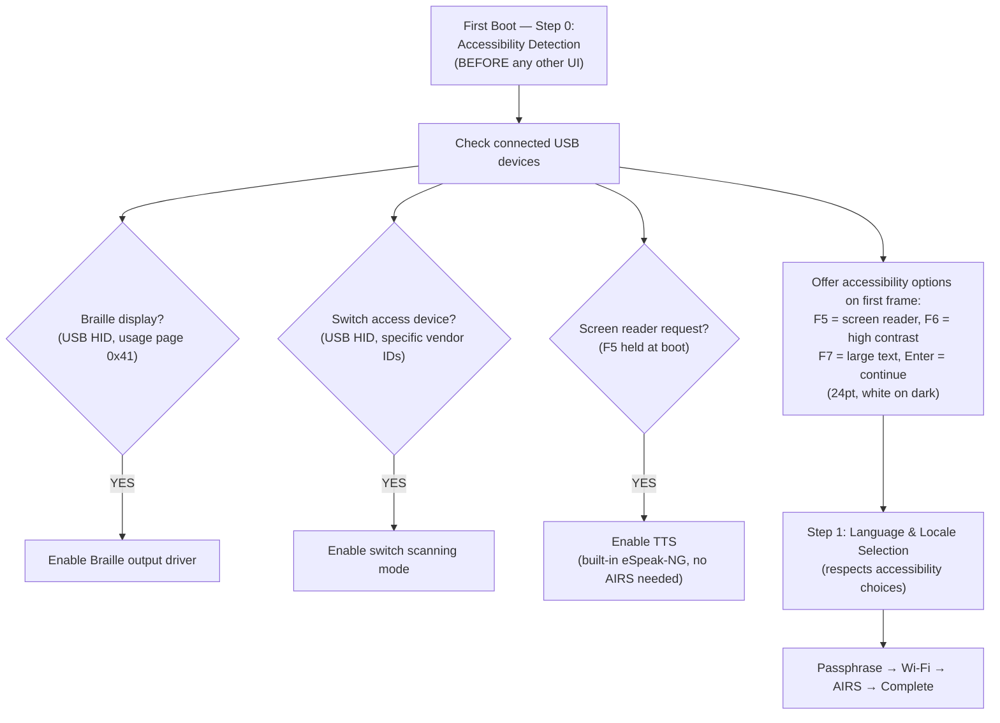

# AIOS Boot Accessibility and First Boot Experience

Part of: [boot.md](../boot.md) — Boot and Init Sequence
**Related:** [services.md](./services.md) — Service startup, [intelligence.md](./intelligence.md) — Boot intelligence, [accessibility.md](../experience/accessibility.md) — Accessibility, [identity.md](../experience/identity.md) — Identity

-----

## 19. Boot Accessibility

AIOS is unusable if a user with a disability cannot complete the first boot experience. Accessibility must work from the *first frame* — before user preferences exist, before AIRS loads, before any setup occurs.

### 19.1 Pre-Setup Accessibility

The first-boot setup flow (§5 Phase 5) includes accessibility as its very first step — *before* language selection:



### 19.2 Built-In Accessibility Engine

The compositor includes a minimal accessibility engine that works without AIRS:

```text
Accessibility Feature          AIRS Required?   Boot Availability
──────────────────────────────────────────────────────────────────
High contrast mode             No               From first frame
Large text (2× font scaling)   No               From first frame
Screen reader (eSpeak-NG TTS)  No               From first frame (initramfs)
Braille display output         No               From first frame (USB HID)
Switch scanning (single-switch No               From first frame
  or two-switch navigation)
Reduced motion                 No               From first frame
AI-enhanced descriptions       Yes              After Phase 3 (AIRS)
AI-powered voice control       Yes              After Phase 3 (AIRS)
```

**eSpeak-NG** is compiled into the initramfs (~800 KiB, supports 100+ languages). It provides functional (if robotic) text-to-speech from boot without requiring AIRS. When AIRS loads (Phase 3), voice output can be upgraded to neural TTS if the user prefers.

### 19.3 Accessibility Persistence

Once the user selects accessibility options during first boot, they're stored in `system/config/accessibility` (unencrypted — must be readable before identity unlock):

```rust
pub struct BootAccessibilityConfig {
    screen_reader: bool,
    high_contrast: bool,
    large_text: bool,
    reduced_motion: bool,
    braille_display: bool,
    switch_access: bool,
    tts_voice: TtsVoice,           // eSpeak variant
    tts_rate: f32,                 // speech rate multiplier
    preferred_language: String,     // for TTS
}
```

This config is read by the compositor during Phase 2, before the identity unlock prompt. This means the passphrase entry screen is already accessible — the screen reader is active, text is large, contrast is high — before the user has to type their passphrase.

-----

## 20. Hardware Boot Feedback

### 20.1 The Problem

Not every boot has a display. A headless Pi (server, IoT, NAS) has no monitor. Even on a display-equipped system, there's a gap between power-on and the first framebuffer pixel (~500ms firmware time). During this gap, the user has no indication that the system is alive.

### 20.2 LED Status Indicators

The Raspberry Pi has a green Activity LED (active-low GPIO on Pi 4, RP1-controlled on Pi 5). AIOS uses this LED to communicate boot progress via blink patterns:

```text
Pattern                 Meaning                          Duration
──────────────────────────────────────────────────────────────────
Solid on                Firmware running                  0-500ms
1 blink/sec             Kernel early boot                 500-700ms
2 blinks/sec            Phase 1 (storage)                 700-1000ms
3 blinks/sec            Phase 2 (core services)           1000-1500ms
Solid on                Phase 5 complete (boot OK)        1500ms+
SOS pattern             Kernel panic (... --- ...)        Until reboot
Fast flash (10 Hz)      Recovery mode                     Until resolved
```

```rust
pub struct LedBootIndicator {
    gpio: GpioPin,      // Pi 4: GPIO 42, Pi 5: via RP1
}

impl LedBootIndicator {
    /// Called by advance_boot_phase() alongside UART logging
    fn indicate_phase(&mut self, phase: EarlyBootPhase) {
        let pattern = match phase {
            EarlyBootPhase::EntryPoint ..= EarlyBootPhase::TimerReady
                => BlinkPattern::Hertz(1),
            EarlyBootPhase::MmuEnabled ..= EarlyBootPhase::Complete
                => BlinkPattern::Hertz(2),
            _ => BlinkPattern::SolidOn,
        };
        self.set_pattern(pattern);
    }

    fn indicate_panic(&mut self) {
        self.set_pattern(BlinkPattern::Sos);
    }
}
```

On QEMU, the LED indicator is a no-op (no physical LED). The UART output serves the same purpose.

### 20.3 Audio Boot Chime

If an audio output device is detected during Phase 2 (HDMI audio, 3.5mm jack, or USB audio), the kernel can play a short boot chime:

```text
Boot chime timing:
  Phase 2 complete → play a short tone (200ms, 440 Hz sine wave)
                     Indicates: display + audio + input are working
  Phase 5 complete → play completion chime (two ascending tones)
                     Indicates: system fully booted, desktop visible
  Panic            → play error tone (low descending tone)
                     Indicates: something went very wrong
```

The boot chime is a generated waveform (no audio file needed), written directly to the audio hardware's PCM buffer. It works before the Audio Subsystem service starts — the HAL provides raw audio output for this purpose.

**User preference:** The boot chime can be disabled via `system/config/boot` (`chime: false`). Default: on. It's one of the few settings read from unencrypted system config before identity unlock.

-----

## 21. First Boot as Conversation

The traditional first-boot experience is a wizard: fixed steps, fixed order, multiple screens of settings the user doesn't understand. AIOS replaces this with a conversation — a natural language exchange that adapts to the user.

### 21.1 How It Works

The first-boot setup flow (§5 Phase 5) already describes the fixed steps: language, passphrase, Wi-Fi, AIRS model. The conversational first boot wraps these steps in a natural interaction:

```text
[Screen: clean dark background with AIOS logo]
[After Phase 3 AIRS loads (typically ~3 seconds into boot):]

AIOS:  "Hello! I'm setting up your new computer.
        What language do you prefer?"

User:  "English"

AIOS:  "Got it — English. I've also detected a US keyboard layout.
        Does that look right?"

User:  "Yes"

AIOS:  "To protect your data, I'll encrypt everything on this device.
        Please choose a passphrase — something you'll remember but
        others won't guess."

       [Passphrase input field appears]

User:  [types passphrase]

AIOS:  "Strong passphrase. I see a Wi-Fi network nearby — 'HomeNetwork'.
        Want to connect?"

User:  "Yes, the password is ..."

AIOS:  "Connected. One last thing — I can help you find files, draft
        text, and manage your work using a local AI model that runs
        entirely on this device. Nothing leaves your computer.
        Want to set that up? It'll take about a minute to download."

User:  "Sure"

AIOS:  "Downloading now. You're all set — your desktop is ready.
        If you need anything, I'm in the bar at the bottom of the screen."

       [Setup overlay fades out → Workspace]
```

### 21.2 Adaptive Flow

The conversation adapts based on the user's responses and detected context:

- **No network available?** Skip Wi-Fi, don't offer AIRS download: "No Wi-Fi detected. You can connect later from the network settings."
- **User says "I'm blind"** → immediately activates screen reader + Braille if connected, continues setup via speech: "Screen reader activated. I'll speak all options aloud."
- **User says "I don't want AI"** → AIRS download skipped, conversation bar configured for keyword search only: "No problem. You can always enable it later in preferences."
- **User asks "What is this?"** → explains AIOS briefly: "AIOS is an operating system designed around you. Your files are organized by meaning, not folders. Everything is encrypted and runs locally."
- **Young user / simple responses** → simplifies language. **Technical user** → offers advanced options (UART console access, developer mode, custom partitioning).

### 21.3 Fallback: Fixed Wizard

If AIRS fails to load during first boot (model not available, insufficient RAM, Phase 3 timeout), the setup falls back to the fixed step-by-step wizard described in §5. The wizard is functional but non-conversational — it uses standard UI elements (buttons, text fields, dropdowns) instead of natural language. The user experience is merely good instead of great.

The conversational flow and the fixed wizard produce the same result: an identity, a passphrase, optional Wi-Fi, optional AIRS model. The difference is in the experience.

-----
