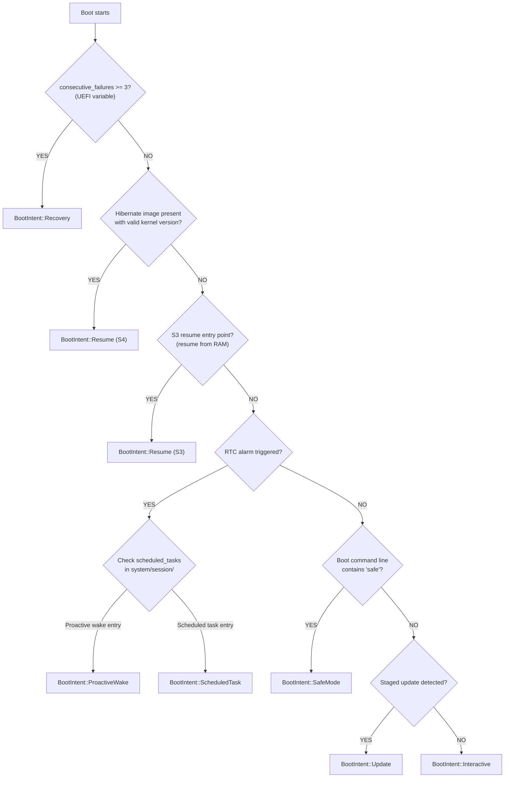
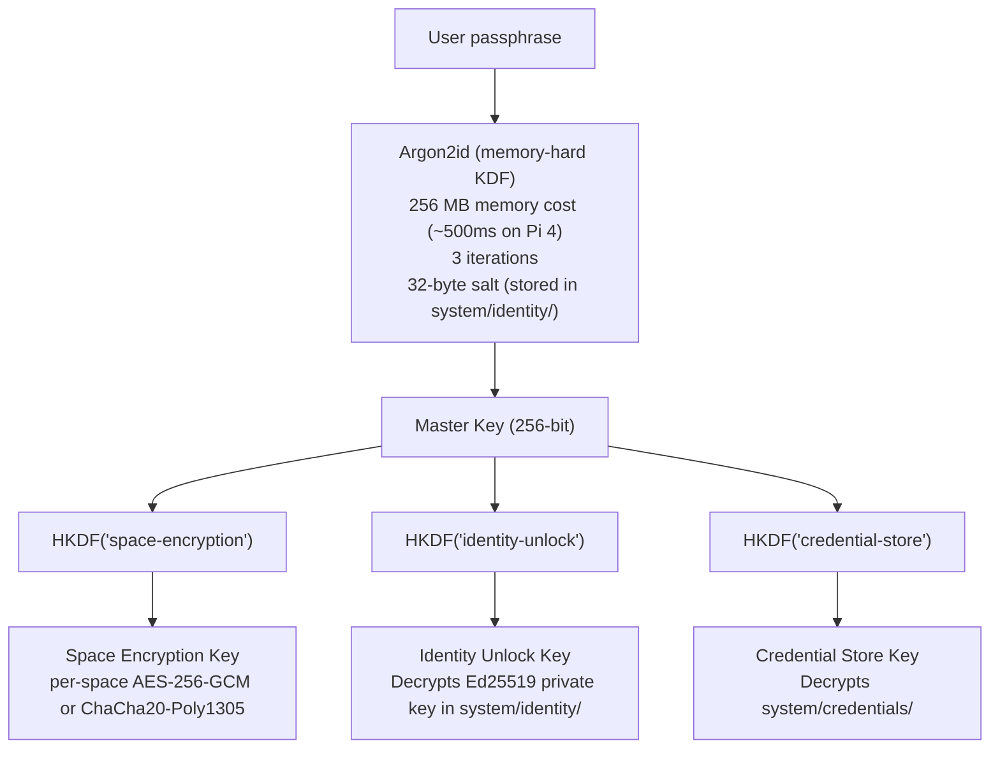
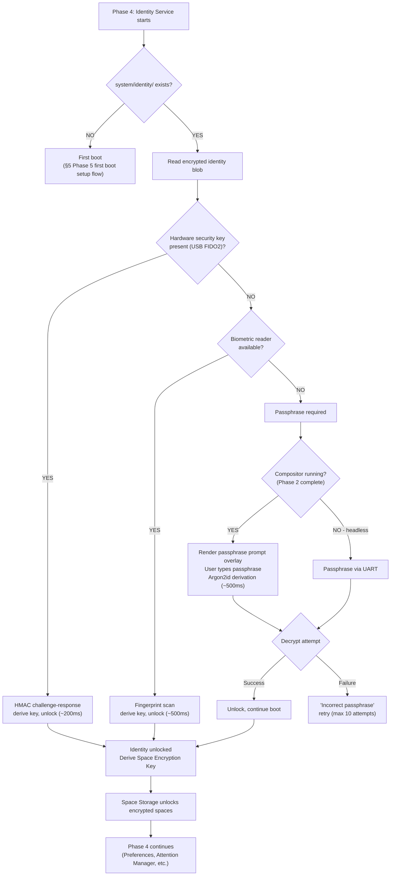

# AIOS Boot Intelligence and On-Demand Services

Part of: [boot.md](../boot.md) — Boot and Init Sequence
**Related:** [suspend.md](./suspend.md) — Suspend/resume, [services.md](./services.md) — Service startup, [research.md](./research.md) — Research innovations, [airs.md](../intelligence/airs.md) — AI Runtime Service

-----

## 16. Boot Intelligence

### 16.1 Boot Intent Detection

Not every boot should result in a full desktop. AIOS detects *why* it's booting and adapts the service graph accordingly:

```rust
pub enum BootIntent {
    /// Normal boot — user pressed power button or opened lid.
    /// Full service graph: Phases 1-5.
    Interactive,

    /// Resume from suspend — S3 or S4.
    /// Skip Phases 1-5, restore from memory or disk image.
    Resume,

    /// Proactive wake — RTC alarm, no user yet.
    /// Phase 1-2 only. Pre-warm caches. Screen off. Re-suspend after timeout.
    ProactiveWake,

    /// Scheduled task — calendar event, backup schedule, OTA check.
    /// Phase 1-3 only. Run the task, then suspend.
    ScheduledTask { task: ScheduledTaskId },

    /// Recovery — three consecutive boot failures.
    /// Minimal services, UART console.
    Recovery,

    /// Safe mode — user held Shift during boot.
    /// Reduced services, no AIRS, no agents.
    SafeMode,

    /// Update — staged update, need to apply and verify.
    /// Full boot but with update verification on Phase 5 completion.
    Update,

    /// Data transfer — USB device plugged into a powered-off device.
    /// (Pi only: USB-C power + data) Phase 1-2 only, expose storage via USB gadget.
    DataTransfer,
}
```

**How intent is detected:**



**Service graph adaptation:** The Service Manager reads `BootIntent` from `KernelState` and adjusts the phase plan:

```text
Intent              Phases Run          Display   AIRS    Network   Services
──────────────────────────────────────────────────────────────────────────────
Interactive         1-5 (full)          On        Yes     Yes       All
Resume              (skipped)           On        Warm    Restore   Restore
ProactiveWake       1-2 (partial)       Off       Warm    Yes       Minimal
ScheduledTask       1-3 (partial)       Off       Maybe   Yes       Task-specific
Recovery            1 + recovery shell  UART      No      No        Minimal
SafeMode            1-2, 4 (partial)    On        No      No        Reduced
Update              1-5 (full)          On        Yes     Yes       All + verify
DataTransfer        1-2 (partial)       Off       No      USB only  Storage + USB
```

### 16.2 Predictive Boot Configuration

AIRS learns usage patterns and adjusts the boot configuration to optimize for expected use. This isn't about changing *which* services start — it's about changing *how* they start:

**Model pre-selection:** If AIRS observes that the user always loads the coding agent on weekday mornings, and that agent benefits from the code-specialized model variant, AIRS can pre-select that model during Phase 3 instead of the general-purpose default. The model switch is seamless — by the time the user opens the coding agent, the right model is already loaded.

**Cache warming:** The Block Engine can prefetch blocks that are likely to be needed. AIRS maintains a per-intent block access trace:

```rust
pub struct BootAccessTrace {
    intent: BootIntent,
    context: BootContext,           // day of week, time of day, peripherals
    blocks_accessed: Vec<BlockId>,  // ordered by first access time
    timestamp: Timestamp,
}
```

On the next boot with a matching context, the Block Engine prefetches these blocks during Phase 1 (while other services are initializing). By the time Phase 5 renders the workspace, the hot data is already in the page cache. This is similar to Linux's `readahead` but context-aware — different prefetch sets for different usage patterns.

**Agent prelaunch:** If the user always launches the same three agents after boot, the Agent Runtime can start them during Phase 5 before the workspace is visible. The agents are ready by the time the user sees the desktop. This is controlled by a frequency threshold — agents launched in 80%+ of recent boots are auto-prelaunch candidates (distinct from the explicit "autostart" flag in agent manifests).

### 16.3 Readahead and Predictive I/O

Beyond AIRS-driven prediction, the kernel itself performs boot readahead — a proven technique made smarter:

**Boot trace recording:** During every boot, the Block Engine records which blocks are read, in what order, and at what time relative to boot start. This trace is saved to `system/session/boot_trace`:

```rust
pub struct BootTrace {
    boot_id: u64,
    intent: BootIntent,
    entries: Vec<BootTraceEntry>,
}

pub struct BootTraceEntry {
    block_id: BlockId,
    time_offset_us: u64,    // microseconds since kernel entry
    service: ServiceId,     // which service requested the read
}
```

**Readahead replay:** On the next boot, the Block Engine starts a readahead thread immediately after init. It reads the previous boot trace and issues prefetch requests for blocks in the recorded order, staying ~500ms ahead of expected demand. The prefetch runs at the lowest I/O priority (below any foreground service reads).

**Adaptive merging:** Over multiple boots, traces converge. The Block Engine merges the last 5 traces, keeping blocks that appear in 60%+ of them and ordering by median access time. Blocks unique to a single boot (one-time operations) are dropped.

**Impact on SD card:** Random 4K reads on a Class 10 SD card: ~2 MB/s. Sequential reads: ~50 MB/s. By converting random boot reads into a sequential prefetch stream, readahead can reduce Phase 1 storage init from 300ms to ~100ms on SD-backed Pi devices.

-----

## 17. On-Demand Services (Socket Activation)

Not every service needs to run from boot. Some services are used infrequently and waste memory and CPU time if started eagerly. AIOS supports *on-demand activation*: a service starts the first time something tries to communicate with it.

### 17.1 Mechanism

The Service Manager creates IPC channels for on-demand services at boot, but does *not* start the service process. When a message arrives on the channel, the Service Manager intercepts it, starts the service, delivers the buffered message, and connects the channel transparently:

```rust
pub struct ServiceDescriptor {
    // ... existing fields ...

    /// Activation mode for this service.
    activation: ActivationMode,
}

pub enum ActivationMode {
    /// Start during the assigned boot phase (current behavior).
    Boot,
    /// Start on first IPC message to this service's channel.
    OnDemand {
        /// Pre-create channels during boot so senders don't need
        /// to know whether the service is running.
        channel_count: usize,
    },
    /// Start on a timer (e.g., daily maintenance tasks).
    Scheduled { interval: Duration },
}
```

### 17.2 Which Services Benefit

```text
Service               Default Mode   Why
──────────────────────────────────────────────────────────────
block_engine          Boot           Critical path. Must exist for everything.
space_storage         Boot           Critical path. Storage for all services.
compositor            Boot           Critical path. User needs to see something.
airs_core             Boot           Loads asynchronously already. Model pre-warm.
posix_compat          OnDemand       Only needed when running BSD/Linux binaries.
                                     Many users may never need it.
audio_subsystem       OnDemand       No audio until user plays media or receives
                                     a notification sound. First audio event
                                     triggers start (~100ms latency on first sound).
browser_runtime       OnDemand       Only needed when opening web content.
print_subsystem       OnDemand       Only needed when printing.
bluetooth_subsystem   OnDemand       Only needed when connecting BT devices.
```

### 17.3 Impact

Moving `posix_compat`, `audio_subsystem`, and `bluetooth_subsystem` from Boot to OnDemand saves:
- ~80ms off Phase 2 critical path (three fewer services to health-check)
- ~15 MB RSS on idle system (three fewer processes resident)

The first activation of an on-demand service adds ~50-150ms latency (process create, ELF load, init). For POSIX compat this means the first Unix command takes an extra 100ms. For audio, the first notification sound has ~100ms extra latency. These are acceptable trade-offs for a faster boot and lower idle memory.

-----

## 18. Encrypted Storage Unlock

AIOS encrypts user data at rest. The encryption key is derived from the user's passphrase (or biometric, or hardware key). The boot sequence must handle the unlock ceremony — the point where the user provides their credential so encrypted spaces become readable.

### 18.1 What's Encrypted

```text
Space                    Encrypted?   Why
──────────────────────────────────────────────────────────────
system/config/           No          Needed before unlock (device settings)
system/devices/          No          Hardware config, no user data
system/audit/            No          Must be writable before unlock
system/models/           No          AI models are not user-sensitive
system/services/         No          Service binaries, no user data
system/session/          Yes         Contains user activity patterns
system/credentials/      Yes         Passwords, tokens, keys
system/identity/         Yes*        Encrypted with hardware-derived key
                                     (separate from user passphrase)
user/                    Yes         All user data
shared/                  Yes         Collaborative data
web-storage/             Yes         Browser data
```

### 18.2 Key Derivation



### 18.3 Boot-Time Unlock Flow



**Timing impact:** On a fast path (hardware key or biometric), unlock adds ~200-500ms. With a passphrase, it adds user-wait time (typing) + 500ms (Argon2id). The Argon2id cost is tunable — faster on powerful hardware, deliberately slow enough on all platforms to resist brute force.

**Lock-on-suspend:** When the system enters S3/S4, the master key is zeroed from memory. On resume, the unlock ceremony runs again. For S3 resume (< 200ms), this means the user must authenticate again — but a hardware key or fingerprint makes this near-instant. The passphrase prompt appears on the compositor's first resume frame.

-----
