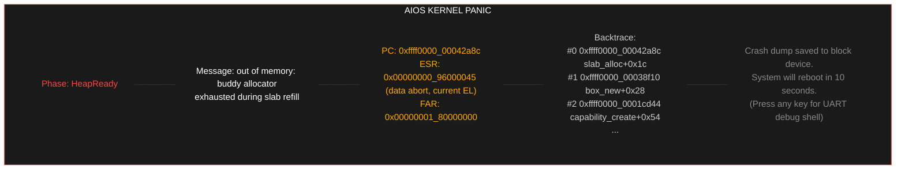
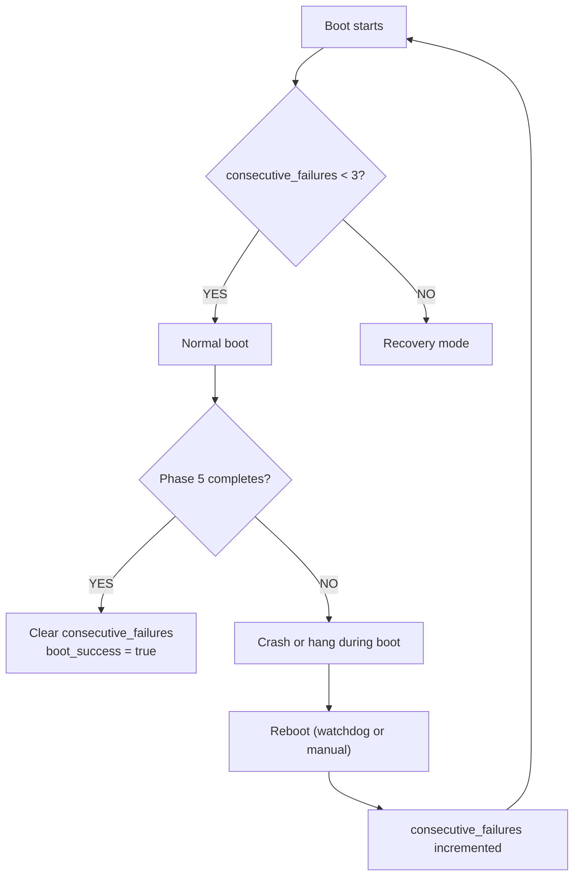
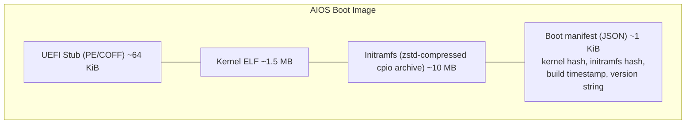

# AIOS Panic Handler, Recovery, and Initramfs

Part of: [boot.md](../boot.md) — Boot and Init Sequence
**Related:** [kernel.md](./kernel.md) — Kernel early boot, [services.md](./services.md) — Service startup, [performance.md](./performance.md) — Boot timing

-----

## 8. Kernel Panic Handler

When the kernel encounters an unrecoverable error — double fault, assertion failure, out-of-memory with no recourse, or an explicit `panic!()` — the panic handler takes over. Its job: capture maximum diagnostic information and persist it, even if the heap, storage, or display subsystem is broken.

### 8.1 What Gets Captured

```rust
#[repr(C)]
pub struct PanicDump {
    magic: u64,                             // 0x41494F53_50414E43 ("AIOSPANC")
    boot_phase: EarlyBootPhase,             // how far boot got before panic
    timestamp: u64,                         // timer counter value
    panic_message: [u8; 512],               // truncated panic!() message
    cpu_id: usize,                          // which core panicked

    // Full register state at point of panic
    registers: RegisterDump,

    // Exception context (if panic was triggered by an exception)
    exception: Option<ExceptionInfo>,

    // Stack trace: return addresses from the stack
    backtrace: [u64; 32],                   // up to 32 frames
    backtrace_depth: usize,

    // Last 16 KiB of the kernel log ring buffer
    log_tail: [u8; 16384],
    log_tail_len: usize,
}

pub struct RegisterDump {
    x: [u64; 31],                           // x0–x30
    sp: u64,
    pc: u64,
    pstate: u64,                            // CPSR/SPSR
    esr_el1: u64,                           // Exception Syndrome Register
    far_el1: u64,                           // Fault Address Register
    elr_el1: u64,                           // Exception Link Register
}
```

### 8.2 Persistence Strategy

The panic handler cannot assume the heap, Space Storage, or even the Block Engine are functional. It uses a layered persistence strategy — try the best option, fall back:

```text
Persistence priority (try in order):

1. Reserved panic region on block device
   - A 64 KiB region at a fixed LBA (right after the superblock)
   - Written via raw block I/O (direct MMIO to the storage controller)
   - Does NOT go through the Block Engine, Object Store, or WAL
   - Works even if the entire storage stack is corrupt
   - On next boot, the Block Engine reads this region and copies
     the dump to system/crash/ if Space Storage is functional

2. UEFI Runtime Variable
   - If raw block I/O fails (storage hardware dead)
   - Write a truncated dump (< 1 KiB: message, registers, PC, ESR)
     to a UEFI variable via Runtime Services
   - Survives power cycle (stored in SPI flash / NVRAM)
   - Limited size, but captures the most critical info

3. UART only
   - If both of the above fail
   - Dump everything to UART (serial console)
   - Requires a connected terminal to capture output
   - Always attempted regardless of other persistence
```

### 8.3 Panic Display

If the early framebuffer is available (before compositor handoff) or can be reclaimed (after compositor, by reverting to the GOP framebuffer):



The panic screen is rendered with the same `EarlyFramebuffer` code used for the splash screen — direct pixel writes, no GPU driver, no heap allocation. The font is a compiled-in 8x16 bitmap font, not the TTF fonts from the initramfs.

### 8.4 Multi-Core Panic

If one core panics, it must stop the others:

1. Panicking core sets a global `PANIC_FLAG` (atomic store, `Ordering::Release`).
2. Panicking core sends an SGI (Software Generated Interrupt) to all other cores (IPI on Apple Silicon via AIC).
3. Other cores receive the SGI/IPI, check `PANIC_FLAG`, and enter a `WFI` loop.
4. Panicking core now has exclusive access to UART, framebuffer, and block device.
5. Dump proceeds single-threaded.

If the panicking core is unable to send SGIs/IPIs (interrupt controller not initialized yet), the other cores are still in their PSCI WFI loop from firmware and won't interfere.

-----

## 9. Recovery Mode

### 9.1 Failure Detection

The Service Manager tracks boot attempts using a counter stored in UEFI Runtime Variables (persistent across reboots):

```rust
pub struct BootAttemptTracker {
    /// Incremented at kernel entry, cleared when Phase 5 completes.
    /// If this reaches 3 without being cleared, recovery mode triggers.
    consecutive_failures: u32,

    /// Set to true when Phase 5 completes and user sees the desktop.
    boot_success: bool,
}
```

**Decision tree:**



### 9.2 Recovery Shell

Recovery mode boots with minimal services: kernel + storage + UART console. No compositor, no networking, no AIRS.

```text
[AIOS RECOVERY MODE]
Boot failed 3 consecutive times. Starting recovery shell.
Last failure: Phase 2 — compositor failed to start (HealthCheckTimeout)

Available commands:
  status          — show service states from last boot attempt
  logs            — show kernel and service logs
  safe-boot       — boot without AI services, without agents
  rollback        — revert to previous kernel and initramfs
  fsck            — verify and repair storage integrity
  factory-reset   — wipe user spaces, preserve system (DESTRUCTIVE)
  reboot          — attempt normal boot again
  shell           — drop to BSD sh (if POSIX compat is available)

recovery>
```

The recovery shell is a minimal Rust binary compiled into the initramfs. It communicates with the kernel and storage via direct IPC. It does not require the compositor, networking, or any AI services.

### 9.3 Safe Mode

Safe mode boots with reduced services. It's triggered by the `safe-boot` command in the recovery shell, or by a keyboard shortcut held during boot (e.g., holding Shift):

```text
Safe mode service list:
  Phase 1: Storage (full)               — spaces must work
  Phase 2: Core (reduced)               — compositor + input only
            No network, no POSIX compat
  Phase 3: SKIPPED                      — no AIRS, no indexer
  Phase 4: Identity only                — no prefs, no attention, no agents
  Phase 5: Workspace (minimal)          — basic desktop, no conversation bar
```

Safe mode is useful for diagnosing issues caused by agents, broken preferences, or AIRS configuration problems. The user gets a functional desktop and can use the Inspector to diagnose what went wrong.

### 9.4 Rollback

If the current kernel or initramfs is broken, the UEFI stub can load the previous versions:

```text
ESP layout:
  aios.elf              — current kernel
  aios.elf.prev         — previous kernel
  initramfs.cpio        — current initramfs
  initramfs.cpio.prev   — previous initramfs
```

The `rollback` command in recovery mode:
1. Renames current → `.bad`
2. Renames `.prev` → current
3. Reboots

This restores the last known-good kernel and service binaries.

### 9.5 Factory Reset

Nuclear option. Wipes user spaces but preserves the system:

```text
Factory reset:
  1. Wipe user/ space (all personal data)
  2. Wipe shared/ space (all collaborative data)
  3. Wipe web-storage/ space (all browser data)
  4. Wipe system/agents/ (remove all installed agents)
  5. Wipe system/credentials/ (remove all stored credentials)
  6. Preserve system/config/ (keep hardware configuration)
  7. Preserve system/models/ (keep downloaded models)
  8. Preserve kernel + initramfs
  9. Reset boot counter
  10. Reboot → first-boot experience
```

Factory reset requires confirmation (type "FACTORY RESET" on the UART console). It's irreversible. Models are preserved because they're large downloads that aren't user-sensitive.

### 9.6 OTA Updates

The A/B rollback mechanism (§9.4) protects against bad updates, but this section describes how updates arrive on the ESP in the first place.

**Update delivery:** A system update is a signed archive containing any combination of: a new kernel ELF, a new initramfs, and new Phase 3-5 service binaries. Updates are fetched by the AI Network Model (ANM) (when available) from a configured update endpoint, or applied manually from a USB drive.

```text
Update flow:

1. Update agent (Phase 5 background agent) checks for updates
   - Fetches update manifest from configured endpoint (HTTPS)
   - Compares manifest version against current version
   - If newer: downloads update archive to a temporary space

2. Signature verification
   - Archive is signed with AIOS release key (Ed25519)
   - Public key is compiled into the kernel (immutable)
   - If signature fails: discard archive, log audit event, done

3. Stage the update (while system is running)
   - Mount ESP (FAT32) via the Block Engine's ESP access path
   - Rename current kernel → aios.elf.prev
   - Rename current initramfs → initramfs.cpio.prev
   - Write new kernel → aios.elf
   - Write new initramfs → initramfs.cpio
   - Sync ESP

4. Stage service updates
   - New Phase 3-5 service binaries → system/services/ space
   - Old binaries are retained as previous versions (Object Store
     keeps them as content-addressed objects; the old content hashes
     remain valid until garbage collection)

5. Trigger reboot (user-confirmed or automatic at next idle period)
   - Boot counter is NOT reset — the new kernel must reach Phase 5
   - If the new kernel fails 3 times, rollback to .prev (§9.4)

6. Post-update verification
   - New kernel boots, reaches Phase 5, clears boot counter
   - Update agent records successful update in system/audit/
   - .prev files remain on ESP as rollback targets
```

**ESP write access:** Only the update agent and the recovery shell can write to the ESP. The ESP is not mounted during normal operation. Write access requires a `EspWriteAccess` capability that the Service Manager mints only for the update agent.

**Manual updates (USB):** Plug in a USB drive with a signed update archive at `/aios-update/`. The update agent detects it (via the device registry) and follows the same verification and staging flow. This works even without network.

-----

## 10. Initramfs and System Image

### 10.1 What's in the Initramfs

The initramfs is a cpio archive loaded into memory by the UEFI stub. It contains everything needed to reach the end of Phase 2 (core services running), at which point the system can access the persistent storage partition:

```text
initramfs.cpio contents:
  /svcmgr                — Service Manager binary
  /services/
    block_engine          — Block Engine service
    object_store          — Object Store service
    space_storage         — Space Storage service
    device_registry       — Device Registry service
    subsystem_framework   — Subsystem Framework service
    input_subsystem       — Input subsystem service
    display_subsystem     — Display subsystem service
    compositor            — Compositor service
    network_subsystem     — Network subsystem service
    audio_subsystem       — Audio subsystem service
    posix_compat          — POSIX compatibility service
  /service_descriptors    — serialized Vec<ServiceDescriptor>
  /logo.bin               — splash screen bitmap (compiled-in fallback too)
  /fonts/
    mono.ttf              — monospace font for terminal
    sans.ttf              — UI font
  /bin/
    sh                    — FreeBSD /bin/sh (for recovery shell)
    ls, cat, grep, ...    — minimal BSD tools (for recovery)
  /lib/
    libc.so               — musl libc shared library
```

Total initramfs size target: **< 32 MB**. The initramfs is compressed (zstd) to ~10 MB on the ESP.

### 10.2 Boot Image Format

The kernel and initramfs are bundled as a single boot image by the build system:



The UEFI stub extracts the kernel and initramfs into separate physical memory regions, populates `BootInfo`, and jumps to the kernel. The boot manifest provides integrity verification — the stub checks hashes before jumping.

### 10.3 Transition from Initramfs to System Space

Once Space Storage is running (end of Phase 1), services can be loaded from the persistent `system/services/` space instead of the initramfs. This transition matters for Phase 3-5 services:

```text
Phase 1-2 services:  loaded from initramfs (in memory, fast)
Phase 3-5 services:  loaded from system/services/ space (persistent storage)
```

The distinction matters because Phase 3-5 services can be updated independently of the kernel. Updating AIRS doesn't require a new initramfs — just update the binary in `system/services/`. The initramfs contains only the minimum needed to bootstrap storage and core services.

On first boot, the Service Manager copies Phase 3-5 service binaries from the initramfs to `system/services/`. On subsequent boots, it loads from the space. If a service binary in the space is corrupt, it falls back to the initramfs copy.

-----
