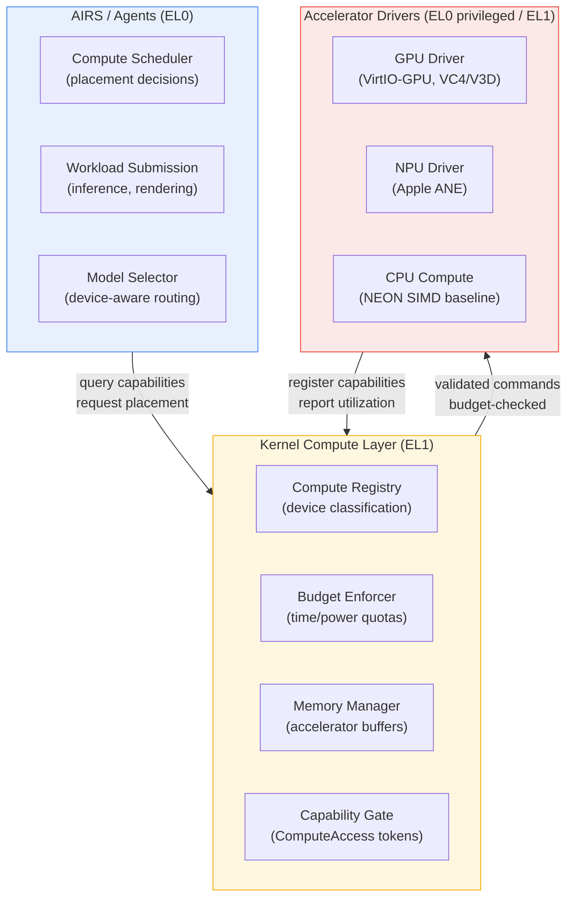
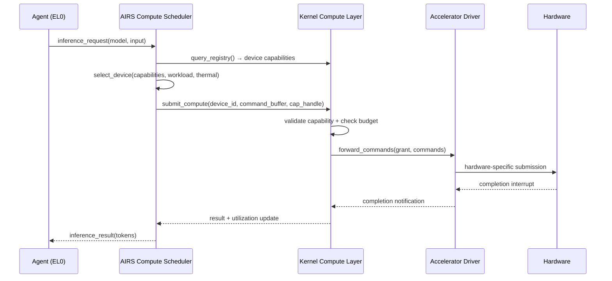
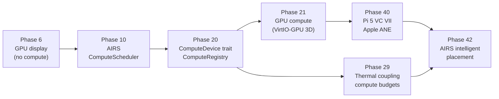

# AIOS Kernel Compute Abstraction

## Deep Technical Architecture

**Parent document:** [architecture.md](../project/architecture.md)
**Kit overview:** [Compute Kit](../kits/kernel/compute.md) — 3-tier app-facing API (Display Surface, Render Pipeline, Inference Pipeline)
**Related:** [device-model.md](./device-model.md) — Device representation and driver framework, [scheduler.md](./scheduler.md) — CPU scheduling and compute affinity, [memory.md](./memory.md) — Physical/virtual memory and DMA pools, [hal.md](./hal.md) — Platform trait and hardware access

-----

## 1. Core Insight

Modern SoCs bundle multiple compute engines onto a single die: CPU cores for general-purpose work, GPU shader cores for parallel computation, NPUs for fixed-point neural inference, DSPs for signal processing, and increasingly specialized ASICs for video encoding, cryptography, or image processing. Each engine has different strengths — the CPU excels at branching and control flow, the GPU at data-parallel throughput, the NPU at low-precision matrix operations, and the DSP at real-time signal chains.

Traditional operating systems treat this heterogeneity as a driver concern: each accelerator has its own ioctl interface, its own memory model, its own access control. The kernel provides no unified abstraction. The result is that applications must know exactly which hardware exists and how to talk to it — there is no equivalent of the CPU scheduler's "submit a thread, the kernel decides where it runs" for accelerator workloads.

AIOS introduces a **kernel compute abstraction** that sits between the device model (which knows about hardware) and AIRS (which knows about workloads). The kernel classifies compute devices, enforces capability-gated access, tracks per-agent compute budgets, and manages accelerator memory. AIRS queries the kernel's compute registry to make intelligent placement decisions — but the kernel enforces the constraints. A misbehaving AIRS or a compromised agent cannot monopolize an accelerator, bypass thermal limits, or access another agent's compute buffers, because the kernel mediates every operation.

**The fundamental design split:** The kernel classifies; AIRS decides. The kernel knows what devices exist and what they can do. AIRS decides which device should run a given workload. The boundary is enforcement (kernel) versus intelligence (AIRS).

**Compute Kit 3-tier model:** The kernel compute abstraction surfaces to applications through Compute Kit ([Compute Kit overview](../kits/kernel/compute.md)), which defines three tiers of app-facing API: **Tier 1 (Display Surface)** for framebuffer/scanout access, **Tier 2 (Render Pipeline)** for GPU shader submission, and **Tier 3 (Inference Pipeline)** for NPU→GPU→CPU inference fallback. wgpu and Vulkan are bridges above Compute Kit Tiers 1–2 (for apps wanting standard graphics APIs). candle is a bridge above Tier 3 (for inference workloads). See [ADR: Compute Kit](../knowledge/decisions/2026-03-22-jl-compute-kit.md).

-----

## 2. Architecture Overview

### 2.1 Three-Layer Compute Stack

The compute abstraction is **not** a scheduler. The kernel CPU scheduler ([scheduler.md](./scheduler.md)) schedules threads. The compute abstraction manages non-CPU compute devices — their classification, access control, budget enforcement, and memory. The CPU appears in the compute registry as the baseline compute device (every workload can always fall back to CPU), but CPU thread scheduling remains the scheduler's domain.

### 2.2 Key Abstractions

| Abstraction | Role | Defined in |
| --- | --- | --- |
| `ComputeDevice` | Trait interface for all compute-capable hardware | [classification.md](./compute/classification.md) §3 |
| `ComputeClass` | Device type: CPU, GPU, NPU, DSP, TPU, ASIC | [classification.md](./compute/classification.md) §3.2 |
| `ComputeCapabilityDescriptor` | What a device can do: throughput, data types, memory, latency, power | [classification.md](./compute/classification.md) §4 |
| `ComputeDeviceId` | Unique identifier extending DeviceId for compute devices | [classification.md](./compute/classification.md) §3.3 |
| `ComputeRegistry` | Central store of compute-capable devices, queryable by AIRS | [registry.md](./compute/registry.md) §5 |
| `ComputeTopology` | Graph of compute devices with interconnect/latency metadata | [registry.md](./compute/registry.md) §6 |
| `ComputeBudget` | Per-agent compute time and power budget enforcement | [budget.md](./compute/budget.md) §7 |
| `ComputeQuota` | Kernel-enforced limits on accelerator usage | [budget.md](./compute/budget.md) §8 |
| `ComputeMemoryModel` | Device memory model: Unified, Discrete, or Scratchpad | [memory.md](./compute/memory.md) §9 |
| `ComputeBuffer` / `BufferOwnership` | Zero-copy buffer sharing and ownership protocol | [memory.md](./compute/memory.md) §10 |
| `ComputeAccess` | Capability token for compute device access | [security.md](./compute/security.md) §11 |
| `ComputeGrant` | Capability granting command submission rights to a specific device | [security.md](./compute/security.md) §12 |
| `GpuSurface` (Kit Tier 1) | App-facing trait for framebuffer/scanout access | [Compute Kit](../kits/kernel/compute.md) |
| `GpuRender` (Kit Tier 2) | App-facing trait for GPU shader submission | [Compute Kit](../kits/kernel/compute.md) |
| `InferencePipeline` (Kit Tier 3) | App-facing trait for NPU→GPU→CPU inference fallback | [Compute Kit](../kits/kernel/compute.md) |

### 2.3 Data Flow: Workload Submission

-----

## Document Map

| Document | Sections | Content |
| --- | --- | --- |
| **This file** | §1, §2, §15, §16 | Core insight, architecture overview, implementation order, design principles |
| [classification.md](./compute/classification.md) | §3, §4 | ComputeDevice trait, ComputeClass enum, ComputeCapabilityDescriptor, ComputeDeviceId |
| [registry.md](./compute/registry.md) | §5, §6 | ComputeRegistry (extends DeviceRegistry), compute topology graph, enumeration flow |
| [budget.md](./compute/budget.md) | §7, §8 | Per-agent compute budget enforcement, time-slice accounting, power budget, quota enforcement |
| [memory.md](./compute/memory.md) | §9, §10 | Accelerator memory model (discrete/unified/scratchpad), zero-copy buffer exchange |
| [security.md](./compute/security.md) | §11, §12 | ComputeAccess capability, ComputeGrant, command stream isolation, audit trail |
| [intelligence.md](./compute/intelligence.md) | §13, §14, §17 | Cross-device thermal coupling, kernel-internal ML for compute, future directions |

-----

## 15. Implementation Order

The compute abstraction is built incrementally, layered on top of the device model and scheduler:

| Phase | Compute Deliverables | Dependencies |
| --- | --- | --- |
| 6 | GPU display driver (VirtIO-GPU) — no compute path yet | Phase 4 (device model) |
| 10 | AIRS ComputeScheduler with standalone `Vec<ComputeDevice>` | Phase 6 (GPU driver infra) |
| 20 | ComputeDevice trait, ComputeRegistry, CPU-as-compute baseline, ComputeAccess capability, ComputeSubsystem skeleton | Phase 10 (AIRS) |
| 29 | Thermal coupling with compute budget integration, cross-device thermal zones | Phase 20 (compute abstraction) |
| 21 | GPU compute path via VirtIO-GPU 3D on QEMU, MediaCodec acceleration | Phase 20 (compute abstraction) |
| 40 | VideoCore VII compute driver (Pi 5), Apple Neural Engine driver | Phase 21 (GPU compute) |
| 42 | AIRS intelligent placement using full compute registry, learned cost models | Phase 40 (real hardware) |

**Compute Kit tiers are the app-facing API surface** — the `GpuSurface`, `GpuRender`, and `InferencePipeline` traits are extracted organically as each tier's kernel implementation stabilizes. Phase 6 establishes Tier 1 (display), Phase 21 establishes Tier 2 (GPU compute), and Phase 10 establishes Tier 3 (inference). The Kit trait definitions live in `docs/kits/kernel/compute.md`.

**Phase 20 is the pivotal phase.** Before Phase 20, AIRS manages its own `Vec<ComputeDevice>` without kernel involvement ([inference.md](../intelligence/airs/inference.md) §3.2). Phase 20 introduces the kernel compute registry and AIRS transitions from standalone device tracking to querying the kernel's canonical registry. This is a refactor of AIRS internals, not a breaking change — the `ComputeDevice` variants (Cpu, Gpu, Npu) gain a `kernel_device_id: ComputeDeviceId` field linking to the kernel's registry.

-----

## 16. Design Principles

1. **CPU is a compute device.** The CPU is the first compute device registered in the ComputeRegistry. Every workload can always fall back to CPU compute. Accelerators are optimizations — they make workloads faster, not possible. This ensures graceful degradation on minimal hardware.

2. **The kernel classifies; AIRS decides.** The kernel knows what devices exist and their capabilities. AIRS decides which device should run a given workload. The boundary is enforcement versus intelligence. The kernel enforces budgets and access control; AIRS makes intelligent placement decisions within those constraints.

3. **Capability-gated all the way down.** No agent accesses any compute device without a `ComputeAccess` capability token. ComputeAccess follows the same lifecycle as `ChannelAccess` ([capabilities.md](../security/model/capabilities.md) §3.1): CREATE → GRANT → USE → ATTENUATE → DELEGATE → REVOKE. Attenuation can restrict access to specific compute classes (GPU but not NPU) or impose time budgets.

4. **Unified memory is the common case.** ARM SoCs — the primary AIOS target — typically share system RAM between CPU and accelerators. The compute memory abstraction must not penalize unified memory architectures with unnecessary copy abstractions. Cache operations (flush/invalidate) are the fast path. DMA transfers are the slow path for discrete memory.

5. **Thermal coupling is mandatory.** Every compute device reports its thermal contribution to the thermal framework ([thermal.md](../platform/thermal.md)). The Policy Engine sees all heat sources holistically — GPU compute at 80% utilization affects CPU thermal headroom. The compute budget integrates with thermal budgets: approaching thermal limits reduces compute quotas before hardware throttling hits.

6. **Drivers implement ComputeDevice alongside Driver.** A GPU driver implements both the `Driver` trait ([device-model/discovery.md](./device-model/discovery.md) §6) and the `ComputeDevice` trait (§3). There is no separate "compute driver" — it is the same driver with an additional interface. This avoids driver proliferation and ensures the device lifecycle is managed in one place.

7. **Budget enforcement is kernel-level.** AIRS can suggest workload placement, but the kernel enforces time and power budgets. A misbehaving AIRS cannot monopolize hardware. A compromised agent cannot consume unlimited GPU time. The damage ceiling for compute abuse is denial of service (throttling), not data breach.

-----

## Cross-Reference Index

| Section | Sub-document | Related Docs |
| --- | --- | --- |
| §1 Core Insight | This file | [device-model.md](./device-model.md) §1, [airs.md](../intelligence/airs.md) §1, [scheduler.md](./scheduler.md) §1 |
| §2 Architecture Overview | This file | [device-model.md](./device-model.md) §2, [subsystem-framework.md](../platform/subsystem-framework.md) §3, [airs/inference.md](../intelligence/airs/inference.md) §3.2 |
| §3 ComputeDevice Trait | [classification.md](./compute/classification.md) | [device-model/discovery.md](./device-model/discovery.md) §6, [hal.md](./hal.md) §4.4 |
| §4 ComputeCapabilityDescriptor | [classification.md](./compute/classification.md) | [airs/inference.md](../intelligence/airs/inference.md) §3.2, [airs/ai-native.md](../intelligence/airs/ai-native.md) §13.1 |
| §5 ComputeRegistry | [registry.md](./compute/registry.md) | [device-model/representation.md](./device-model/representation.md) §4, [airs/inference.md](../intelligence/airs/inference.md) §3.2 |
| §6 ComputeTopology | [registry.md](./compute/registry.md) | [scheduler.md](./scheduler.md) §8, [thermal/scheduling.md](../platform/thermal/scheduling.md) §6 |
| §7 ComputeBudget | [budget.md](./compute/budget.md) | [scheduler.md](./scheduler.md) §7, [airs/inference.md](../intelligence/airs/inference.md) §3.1 |
| §8 ComputeQuota | [budget.md](./compute/budget.md) | [security/model/capabilities.md](../security/model/capabilities.md) §3 |
| §9 Accelerator Memory | [memory.md](./compute/memory.md) | [memory/physical.md](./memory/physical.md) §2.4, [device-model/dma.md](./device-model/dma.md) §11 |
| §10 Zero-Copy Paths | [memory.md](./compute/memory.md) | [gpu/rendering.md](../platform/gpu/rendering.md) §12, [accelerators/memory.md](../platform/accelerators/memory.md) §8 |
| §11 ComputeAccess Capability | [security.md](./compute/security.md) | [security/model/capabilities.md](../security/model/capabilities.md) §3, [device-model/security.md](./device-model/security.md) §13 |
| §12 Command Stream Isolation | [security.md](./compute/security.md) | [device-model/lifecycle.md](./device-model/lifecycle.md) §8, [gpu/security.md](../platform/gpu/security.md) §15 |
| §13 Thermal Coupling | [intelligence.md](./compute/intelligence.md) | [thermal/scheduling.md](../platform/thermal/scheduling.md) §6, [thermal/intelligence.md](../platform/thermal/intelligence.md) §12 |
| §14 Kernel-Internal ML | [intelligence.md](./compute/intelligence.md) | [airs/ai-native.md](../intelligence/airs/ai-native.md) §13, [device-model/intelligence.md](./device-model/intelligence.md) §16 |
| §15 Implementation Order | This file | [development-plan.md](../project/development-plan.md) §8 |
| §16 Design Principles | This file | — |
| §17 Future Directions | [intelligence.md](./compute/intelligence.md) | [airs/scaling.md](../intelligence/airs/scaling.md) §11.4 |
