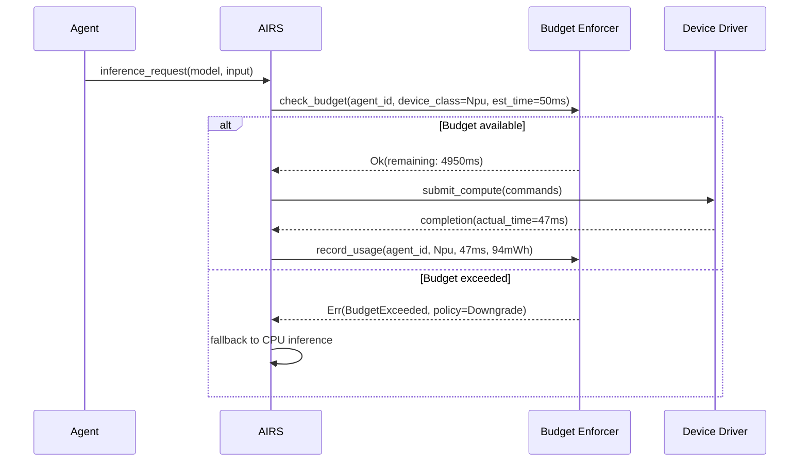

# AIOS Compute Budget Enforcement

Part of: [compute.md](../compute.md) — Kernel Compute Abstraction
**Related:** [security.md](./security.md) — Capability-gated compute access, [registry.md](./registry.md) — ComputeRegistry utilization tracking

-----

## 7. ComputeBudget

Every agent that submits compute work to a non-CPU device has a kernel-enforced budget. The budget prevents a single agent from monopolizing shared accelerators, provides fairness across concurrent inference sessions, and integrates with the thermal framework to proactively reduce compute load before hardware throttling hits.

### 7.1 Budget Model

```rust
/// Per-agent compute budget, enforced by the kernel.
///
/// The budget tracks two resources: compute time (how long the agent
/// has used a device) and power (estimated energy consumption based
/// on device TDP and utilization). Both are enforced independently —
/// an agent can hit its time budget before its power budget or vice versa.
///
/// Budget parameters are set based on the agent's trust level
/// (security/model/capabilities.md §3.1):
///   Level 1 (System):      Unlimited time, power-aware
///   Level 2 (Native):      Generous limits, power-capped
///   Level 3 (Third-party): Strict limits per window
///   Level 4 (Web content): Minimal compute access
pub struct ComputeBudget {
    /// Agent this budget belongs to.
    pub agent_id: AgentId,

    /// Per-device-class time budgets.
    pub time_budgets: HashMap<ComputeClass, TimeBudget>,

    /// Global power budget across all compute devices.
    pub power_budget: PowerBudget,

    /// Current window start timestamp.
    pub window_start: Timestamp,

    /// Window duration (default: 1 hour for Level 3, 24 hours for Level 2).
    pub window_duration: Duration,
}

pub struct TimeBudget {
    /// Maximum compute time per window on this device class.
    pub max_time: Duration,
    /// Time consumed in the current window.
    pub consumed: Duration,
    /// Action when budget exceeded.
    pub exceeded_policy: BudgetExceededPolicy,
}

pub struct PowerBudget {
    /// Maximum estimated energy consumption per window (milliwatt-hours).
    pub max_energy_mwh: u64,
    /// Energy consumed in the current window.
    pub consumed_mwh: u64,
}

#[derive(Debug, Clone, Copy)]
pub enum BudgetExceededPolicy {
    /// Queue future requests until the next window opens.
    Queue,
    /// Allow the request but downgrade to a lower-power device (GPU → CPU).
    Downgrade,
    /// Reject the request with ComputeError::BudgetExceeded.
    Reject,
    /// Allow but log an audit event for administrator review.
    AuditOnly,
}
```

### 7.2 Budget Enforcement Flow



### 7.3 Time Accounting

Compute time is measured by the driver and reported to the budget enforcer on workload completion. The kernel does not poll — it trusts the driver's timing but cross-validates with wall-clock measurements:

```rust
impl ComputeBudget {
    /// Check whether a workload can proceed within budget.
    /// Called by the kernel before forwarding commands to the driver.
    pub fn check_budget(
        &self,
        device_class: ComputeClass,
        estimated_time: Duration,
    ) -> Result<Duration, BudgetExceededPolicy> {
        let time_budget = self.time_budgets.get(&device_class)
            .unwrap_or(&DEFAULT_TIME_BUDGET);

        let remaining = time_budget.max_time
            .saturating_sub(time_budget.consumed);

        if remaining < estimated_time {
            Err(time_budget.exceeded_policy)
        } else {
            Ok(remaining)
        }
    }

    /// Record actual compute time after workload completion.
    pub fn record_usage(
        &mut self,
        device_class: ComputeClass,
        actual_time: Duration,
        power_mwh: u64,
    ) {
        if let Some(budget) = self.time_budgets.get_mut(&device_class) {
            budget.consumed += actual_time;
        }
        self.power_budget.consumed_mwh += power_mwh;
    }

    /// Reset budgets at window boundary.
    pub fn reset_window(&mut self, now: Timestamp) {
        self.window_start = now;
        for budget in self.time_budgets.values_mut() {
            budget.consumed = Duration::ZERO;
        }
        self.power_budget.consumed_mwh = 0;
    }
}
```

### 7.4 Default Budgets by Trust Level

```text
Trust Level    GPU Time/hr    NPU Time/hr    Power/hr    Policy
───────────    ───────────    ───────────    ────────    ──────────
1 (System)     Unlimited      Unlimited      Audit       AuditOnly
2 (Native)     30 min         30 min         500 mWh     Downgrade
3 (Third)      5 min          5 min          100 mWh     Queue
4 (Web)        30 sec         0 (no NPU)     10 mWh      Reject
```

System agents (AIRS itself, intent verifier, behavioral monitor) have unlimited budgets because their compute work is security-critical. The budget still tracks their usage for audit and thermal awareness — it just never rejects their requests.

-----

## 8. ComputeQuota

While ComputeBudget operates per-agent, ComputeQuota operates **system-wide** to prevent aggregate overload on a shared compute device.

### 8.1 Quota Model

```rust
/// System-wide quota on a compute device.
///
/// Ensures that the aggregate compute load from all agents does not
/// exceed the device's sustainable capacity. This is separate from
/// thermal throttling — the quota acts proactively, before the device
/// overheats.
pub struct ComputeQuota {
    /// The device this quota applies to.
    pub device_id: ComputeDeviceId,

    /// Maximum aggregate utilization target (0.0 to 1.0).
    /// Default: 0.8 (leave 20% headroom for burst and system work).
    pub max_utilization: f32,

    /// Maximum concurrent compute sessions on this device.
    pub max_sessions: u32,

    /// Current number of active sessions.
    pub active_sessions: u32,

    /// Admission policy when quota is reached.
    pub admission_policy: QuotaAdmissionPolicy,
}

pub enum QuotaAdmissionPolicy {
    /// Queue incoming requests in priority order.
    PriorityQueue,
    /// Reject lowest-priority active session to make room.
    Preempt,
    /// Reject new requests until utilization drops.
    Reject,
}
```

### 8.2 Quota and Thermal Integration

The compute quota integrates with the thermal framework ([thermal/scheduling.md](../../platform/thermal/scheduling.md) §6):

```text
Thermal State     Quota Adjustment              Rationale
─────────────     ──────────────────────────    ─────────────────────
Nominal           max_utilization = 0.8          Normal headroom
Warm              max_utilization = 0.6          Proactive reduction
Hot               max_utilization = 0.3          Prevent throttling
Critical          max_utilization = 0.0          Device shutdown
```

The thermal framework notifies the budget enforcer when thermal state changes. The budget enforcer adjusts quotas immediately — no polling. This means compute workloads are throttled before the hardware's own thermal protection kicks in, providing a smoother degradation curve.

### 8.3 Quota Fairness

When multiple agents compete for a quota-limited device, the budget enforcer uses a weighted fair queuing model:

1. **Interactive** workloads (user-facing inference) get 60% of available quota
2. **System** workloads (security, indexing) get 25%
3. **Background** workloads (batch, offline processing) get 15%

Within each class, agents are served in round-robin order. An agent that consumes its time budget is paused until its next window, regardless of quota availability — budget enforcement is strict even when the device has spare capacity.
