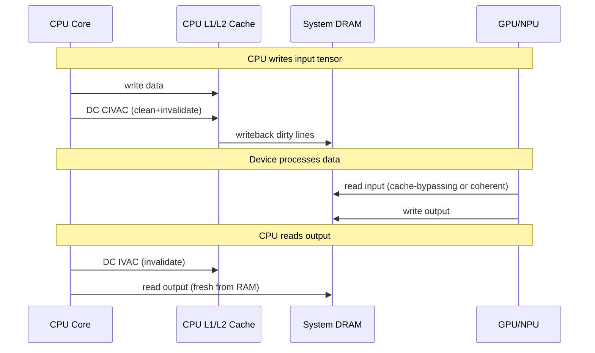
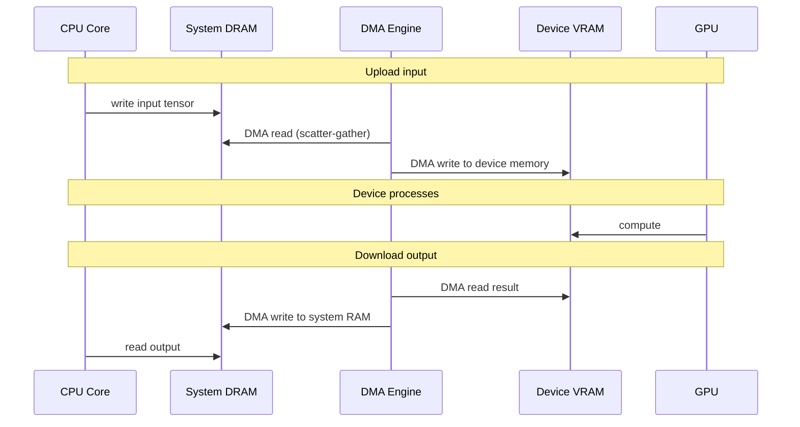

# AIOS Compute Memory Model

Part of: [compute.md](../compute.md) — Kernel Compute Abstraction
**Related:** [classification.md](./classification.md) — ComputeCapabilityDescriptor (memory fields), [budget.md](./budget.md) — Power budget (memory transfers consume power)

-----

## 9. Accelerator Memory Model

Compute devices interact with memory in fundamentally different ways depending on their architecture. The kernel must abstract these differences to provide a uniform buffer exchange interface while preserving the performance characteristics of each model.

### 9.1 Three Memory Models

```rust
/// How a compute device accesses memory.
///
/// This classification drives the kernel's buffer allocation strategy
/// and determines what cache maintenance operations are needed for
/// CPU-accelerator data exchange.
#[derive(Debug, Clone, Copy, PartialEq, Eq)]
pub enum ComputeMemoryModel {
    /// Unified memory — device shares system RAM with the CPU.
    /// No data copy needed. Buffer exchange requires cache maintenance
    /// (flush CPU caches before device reads, invalidate before CPU reads
    /// device output).
    ///
    /// Examples: ARM SoCs (Apple Silicon, Pi 5, Qualcomm).
    /// This is the common case for AIOS target platforms.
    Unified {
        /// Whether hardware maintains coherency automatically (ARM CCI/ACE).
        /// If true, no explicit cache ops needed — fastest path.
        hardware_coherent: bool,
    },

    /// Discrete memory — device has its own dedicated memory (VRAM).
    /// Buffer exchange requires explicit DMA transfers between system RAM
    /// and device memory. The kernel manages transfer scheduling.
    ///
    /// Examples: discrete GPUs (hypothetical future target for AIOS).
    Discrete {
        /// Device memory size in bytes.
        vram_bytes: usize,
        /// DMA transfer bandwidth in bytes per second.
        transfer_bandwidth: u64,
    },

    /// Scratchpad memory — device has small, fast on-chip buffers.
    /// Data must be tiled and streamed through scratchpad in chunks.
    /// The driver manages tiling; the kernel manages allocation.
    ///
    /// Examples: Some NPUs (Apple ANE internal buffers), DSP SRAM.
    Scratchpad {
        /// Total scratchpad size in bytes.
        scratchpad_bytes: usize,
        /// Maximum single allocation size.
        max_alloc_bytes: usize,
    },
}
```

### 9.2 Memory Allocation

```rust
/// A compute buffer allocated for use with an accelerator.
///
/// On unified memory, this is backed by a frame from the DMA pool
/// (memory/physical.md §2.4). On discrete memory, this is a handle
/// to device-local VRAM. On scratchpad, this is a reservation within
/// the device's on-chip buffer.
pub struct ComputeBuffer {
    /// Unique identifier for this buffer.
    pub id: ComputeBufferId,
    /// The device this buffer is associated with.
    pub device_id: ComputeDeviceId,
    /// Size in bytes.
    pub size: usize,
    /// Memory model that governs this buffer's access semantics.
    pub memory_model: ComputeMemoryModel,
    /// Physical address (for unified/DMA pool buffers).
    pub phys_addr: Option<PhysAddr>,
    /// Device-local handle (for discrete/scratchpad buffers).
    pub device_handle: Option<DeviceMemoryHandle>,
    /// Access flags.
    pub flags: ComputeBufferFlags,
    /// The agent that owns this buffer (for cleanup on process exit).
    pub owner: AgentId,
}

bitflags! {
    pub struct ComputeBufferFlags: u32 {
        /// Buffer is readable by the compute device.
        const DEVICE_READ   = 0b0001;
        /// Buffer is writable by the compute device.
        const DEVICE_WRITE  = 0b0010;
        /// Buffer is readable by the CPU.
        const HOST_READ     = 0b0100;
        /// Buffer is writable by the CPU.
        const HOST_WRITE    = 0b1000;
    }
}
```

### 9.3 Inference Buffer Types

For AI inference workloads — the primary use case for compute buffers — there are three semantically distinct buffer types with different lifecycle patterns:

```text
Buffer Type      Size                Lifecycle              Sharing
────────────     ─────────────       ────────────────       ──────────────────
Weight buffer    ~2-8 GB (model)     Load once, read many   Shared across sessions
Activation buf   ~10-500 MB/layer    Per-inference          Per-session, private
KV cache buf     ~50 MB-2 GB         Grows per-token        Per-session, private
```

**Weight buffers** are the largest and most static. A loaded model's weights are mapped read-only into the compute device's address space. On unified memory, this is a no-op — the weights are already in system RAM. On discrete memory, this is a one-time DMA transfer at model load time.

**Activation buffers** are allocated and freed per inference call. They hold intermediate layer outputs. The kernel pools these to avoid allocation overhead per-inference.

**KV cache buffers** grow monotonically during a conversation. They are per-session and private. AIRS manages their lifecycle ([airs/inference.md](../../intelligence/airs/inference.md) §3.3); the kernel tracks their memory consumption for budget accounting.

-----

## 10. Zero-Copy Buffer Exchange

The performance-critical path is moving data between CPU and accelerator with minimal copying. On ARM unified memory SoCs — the primary AIOS target — zero-copy is achievable with cache maintenance alone.

### 10.1 Unified Memory Path (Fast Path)



On hardware-coherent platforms (ARM CCI/ACE), the explicit cache operations are unnecessary — the hardware snoops CPU caches on device DMA reads and invalidates on device writes. This is the fastest path and the one optimized for.

### 10.2 Discrete Memory Path (Slow Path)



This path is only used for hypothetical discrete GPU support. The DMA engine ([device-model/dma.md](../device-model/dma.md) §11) manages the transfers. The kernel batches small transfers to amortize DMA setup overhead.

### 10.3 Buffer Ownership Protocol

To prevent data races between CPU and accelerator, the kernel enforces a strict ownership protocol:

```rust
/// Buffer ownership state machine.
///
/// A buffer is owned by exactly one party (CPU or device) at any time.
/// Ownership transfer requires explicit cache maintenance on non-coherent
/// platforms.
#[derive(Debug, Clone, Copy, PartialEq, Eq)]
pub enum BufferOwnership {
    /// CPU owns the buffer — safe to read/write from CPU.
    /// Device access would see stale data.
    Host,
    /// Device owns the buffer — safe to read/write from device.
    /// CPU access would see stale data.
    Device,
    /// Buffer is in transition — neither party should access it.
    Transitioning,
}
```

Ownership transitions:

```text
Host → Transitioning → Device:
  1. CPU finishes writing
  2. Kernel flushes CPU caches (DC CIVAC) for non-coherent platforms
  3. Kernel marks buffer as Device-owned
  4. Driver submits compute commands referencing this buffer

Device → Transitioning → Host:
  1. Driver signals completion
  2. Kernel invalidates CPU caches (DC IVAC) for non-coherent platforms
  3. Kernel marks buffer as Host-owned
  4. CPU can now read results
```

### 10.4 SMMU Integration

On platforms with an ARM SMMU (System Memory Management Unit), the kernel programs per-device stream IDs to restrict which physical pages each accelerator can access. This provides hardware-enforced isolation — a compromised GPU driver cannot read another agent's compute buffers, even if it knows the physical address.

The SMMU configuration is part of the device model's DMA engine ([device-model/dma.md](../device-model/dma.md) §11). The compute memory layer adds compute-buffer-specific SMMU mappings: when a `ComputeBuffer` is allocated, the kernel adds the buffer's physical pages to the device's SMMU context. When the buffer is freed, the pages are unmapped.
