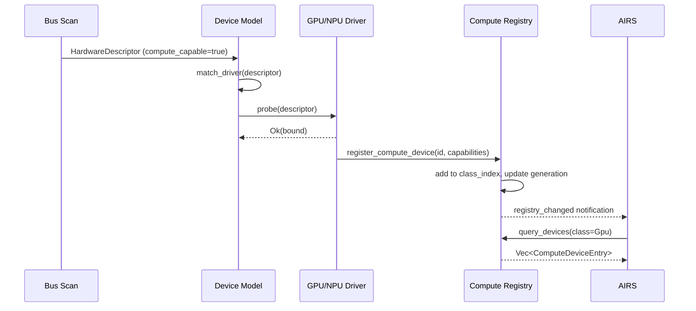

# AIOS Compute Device Registry

Part of: [compute.md](../compute.md) — Kernel Compute Abstraction
**Related:** [classification.md](./classification.md) — ComputeDevice trait and classification, [budget.md](./budget.md) — Per-agent compute budgets

-----

## 5. ComputeRegistry

The ComputeRegistry is the kernel's canonical store of all compute-capable devices. When a driver that implements both `Driver` and `ComputeDevice` successfully binds to a device, the device model registers it in the ComputeRegistry. AIRS queries this registry to discover available compute resources and make placement decisions.

### 5.1 Registry Structure

```rust
/// Central registry of all compute-capable devices in the system.
///
/// Extends the DeviceRegistry (device-model/representation.md §4) with
/// compute-specific metadata. The ComputeRegistry does not replace the
/// DeviceRegistry — a compute device appears in BOTH registries. The
/// ComputeRegistry adds ComputeCapabilityDescriptor, utilization tracking,
/// and compute-specific query APIs.
pub struct ComputeRegistry {
    /// All registered compute devices, indexed by ComputeDeviceId.
    devices: BTreeMap<ComputeDeviceId, ComputeDeviceEntry>,

    /// Index by compute class for fast filtering.
    /// AIRS typically queries "all GPUs" or "all NPUs".
    class_index: HashMap<ComputeClass, Vec<ComputeDeviceId>>,

    /// Topology graph — interconnect latency between compute devices.
    topology: ComputeTopology,

    /// Generation counter for change detection.
    /// Incremented on every device add/remove. AIRS caches the registry
    /// and re-queries only when the generation changes.
    generation: u64,
}

pub struct ComputeDeviceEntry {
    /// The compute device identifier.
    pub id: ComputeDeviceId,

    /// Capability descriptor — populated by the driver at probe time.
    pub capabilities: ComputeCapabilityDescriptor,

    /// Current utilization (0.0 to 1.0), updated by the driver.
    pub utilization: f32,

    /// Current thermal state, reported by the driver or thermal subsystem.
    pub thermal_state: ThermalState,

    /// Current power draw in milliwatts.
    pub power_draw_mw: u32,

    /// Total compute time consumed since registration (for budget accounting).
    pub total_compute_time: Duration,

    /// Number of active compute sessions on this device.
    pub active_sessions: u32,

    /// Timestamp of last workload completion.
    pub last_active: Timestamp,
}
```

### 5.2 Registration Flow



The CPU compute device is registered at boot by the kernel itself — it does not go through the driver probe flow. The kernel reads CPU capabilities from system registers (`ID_AA64ISAR0_EL1`, `ID_AA64PFR0_EL1`) and constructs the capability descriptor directly.

### 5.3 Query API

```rust
impl ComputeRegistry {
    /// Return all compute devices, optionally filtered by class.
    pub fn query_devices(&self, filter: Option<ComputeClass>)
        -> Vec<&ComputeDeviceEntry>
    {
        match filter {
            Some(class) => self.class_index.get(&class)
                .map(|ids| ids.iter()
                    .filter_map(|id| self.devices.get(id))
                    .collect())
                .unwrap_or_default(),
            None => self.devices.values().collect(),
        }
    }

    /// Return the best device for a given workload profile.
    /// "Best" means: supports required data types, has lowest utilization,
    /// is within thermal budget, and has the highest throughput.
    /// This is a hint — AIRS may override with its own cost model.
    pub fn suggest_device(&self, requirements: &WorkloadRequirements)
        -> Option<ComputeDeviceId>
    {
        self.devices.values()
            .filter(|d| d.capabilities.supported_types
                .contains(requirements.required_types))
            .filter(|d| d.thermal_state != ThermalState::Critical)
            .min_by(|a, b| a.utilization
                .partial_cmp(&b.utilization)
                .unwrap_or(core::cmp::Ordering::Equal))
            .map(|d| d.id)
    }

    /// Return the registry generation for change detection.
    pub fn generation(&self) -> u64 {
        self.generation
    }

    /// Return the compute topology graph.
    pub fn topology(&self) -> &ComputeTopology {
        &self.topology
    }
}

/// Workload requirements for device matching.
pub struct WorkloadRequirements {
    /// Required data type support (e.g., INT8 for quantized inference).
    pub required_types: ComputeDataTypes,
    /// Preferred compute class (None = any).
    pub preferred_class: Option<ComputeClass>,
    /// Maximum acceptable submission-to-first-result latency.
    pub max_latency_us: Option<u32>,
    /// Minimum required device memory (for model loading).
    pub min_device_memory: Option<usize>,
}
```

### 5.4 Space Integration

The ComputeRegistry is exposed as a space (`system/devices/compute/`) in the Space Storage system ([spaces.md](../../storage/spaces.md) §3). Each compute device has a CompactObject entry:

```text
system/devices/compute/
├── cpu-cortex-a72-0          # CPU compute entry
│   ├── class: "cpu"
│   ├── peak_ops: 4000000000
│   ├── supported_types: ["fp32", "fp64", "int8", "neon"]
│   ├── unified_memory: true
│   ├── utilization: 0.35
│   └── thermal_state: "nominal"
├── gpu-virtio-0              # VirtIO-GPU compute entry (QEMU)
│   ├── class: "gpu"
│   ├── peak_ops: 0           # VirtIO-GPU 2D has no compute
│   └── ...
└── npu-ane-0                 # Apple Neural Engine (real hardware)
    ├── class: "npu"
    ├── peak_ops: 15800000000000
    ├── supported_types: ["int8", "fp16"]
    ├── quant_formats: ["q4_k_m", "q5_k_m", "q8_0"]
    └── ...
```

-----

## 6. ComputeTopology

The compute topology captures the physical relationship between compute devices — which CPU cores have the fastest path to which accelerator, memory coherency domains, and NUMA-like distance metrics. On QEMU this is trivial (all devices on one bus), but on real hardware the topology affects placement cost.

### 6.1 Topology Model

```rust
/// Graph of compute devices and their interconnect properties.
///
/// On simple SoCs (Pi 5, Apple M-series), all compute devices share
/// the same memory bus and the topology is flat. On more complex systems
/// (multi-chip modules, disaggregated compute), the topology captures
/// asymmetric access costs.
pub struct ComputeTopology {
    /// Adjacency matrix: latency in nanoseconds between device pairs.
    /// Entry (i, j) = estimated data transfer latency from device i
    /// to device j. Symmetric for most SoCs.
    adjacency: Vec<Vec<u32>>,

    /// Which CPU cores have the fastest path to each compute device.
    /// Used by the scheduler to pin compute-managing threads to optimal cores.
    cpu_affinity: HashMap<ComputeDeviceId, CpuSet>,

    /// Memory coherency domains — devices within the same domain share
    /// a coherent cache view. Devices in different domains require
    /// explicit cache maintenance for buffer sharing.
    coherency_domains: Vec<CoherencyDomain>,
}

pub struct CoherencyDomain {
    /// Devices in this coherency domain.
    pub devices: Vec<ComputeDeviceId>,
    /// Whether hardware maintains coherency (e.g., ARM CCI/ACE).
    pub hardware_coherent: bool,
}
```

### 6.2 Platform Topologies

**QEMU virt (flat):**

```text
CPU ←→ VirtIO-GPU    latency: ~1 μs (MMIO)
CPU ←→ memory        latency: ~100 ns
All devices in one coherency domain (no SMMU, no IOMMU)
```

**Raspberry Pi 5 (unified SoC):**

```text
Cortex-A76 ←→ VideoCore VII    latency: ~500 ns (shared L3/DRAM)
Both share LPDDR4X bandwidth (~18 GB/s aggregate)
Software-managed coherency (explicit cache maintenance)
```

**Apple M-series (unified SoC with heterogeneous engines):**

```text
P-cores ←→ E-cores      latency: ~50 ns (shared L2)
CPU ←→ GPU              latency: ~200 ns (shared unified memory)
CPU ←→ ANE              latency: ~500 ns (DMA-based, not coherent)
CPU ←→ GPU: hardware coherent (ARM ACE); ANE: separate DMA domain (scratchpad, explicit cache ops)
```

### 6.3 Topology Discovery

The topology is constructed from three sources:

1. **Device tree (DTB)**: On platforms with detailed DTBs (QEMU, Pi 5), the kernel reads interconnect nodes and cache hierarchy to derive latency estimates.
2. **Platform tables**: For known platforms ([bsp.md](../../platform/bsp.md) §2), hardcoded topology tables provide accurate latency values that DTB alone cannot express.
3. **Runtime calibration**: On first use, the kernel measures actual transfer latency between device pairs (a small DMA benchmark) and updates the topology. This corrects for firmware-level configuration that the kernel cannot read statically.
