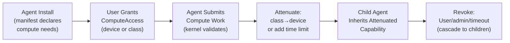

# AIOS Compute Security

Part of: [compute.md](../compute.md) — Kernel Compute Abstraction
**Related:** [budget.md](./budget.md) — Budget enforcement (economic denial-of-service prevention), [memory.md](./memory.md) — Buffer isolation via SMMU

-----

## 11. ComputeAccess Capability

Access to compute devices follows the same capability model as all other AIOS resources ([security/model/capabilities.md](../../security/model/capabilities.md) §3). An agent must hold a valid `ComputeAccess` capability token to submit work to any compute device. CPU compute is an exception — all agents have implicit CPU access via normal thread scheduling. The `ComputeAccess` capability governs non-CPU accelerators.

### 11.1 Capability Variants

```rust
/// Compute-specific capability variants.
///
/// Extends the Capability enum (shared/src/cap.rs) — target design.
/// Follows the same pattern as ChannelAccess(ChannelId).
pub enum Capability {
    // ... existing variants (ReadSpace, WriteSpace, ChannelCreate,
    //     ChannelAccess, CameraAccess, AudioCapture, etc.) ...

    /// Permission to submit compute work to a specific device.
    /// The ComputeDeviceId must match — a capability for GPU-0 does not
    /// grant access to NPU-0.
    ComputeAccess(ComputeDeviceId),

    /// Permission to submit compute work to any device of a given class.
    /// Less specific than ComputeAccess — typically granted to system agents
    /// that need to use whatever accelerator is available.
    ComputeClassAccess(ComputeClass),

    /// Permission to allocate memory on a compute device.
    /// Separate from ComputeAccess because memory allocation is a
    /// resource-consumption operation that may need tighter control.
    ComputeMemoryAlloc {
        device_id: ComputeDeviceId,
        max_bytes: usize,
    },
}
```

### 11.2 Capability Lifecycle



**Attenuation examples:**

```text
Original:    ComputeClassAccess(Gpu)          → can use any GPU
Attenuated:  ComputeAccess(gpu-virtio-0)      → specific device only

Original:    ComputeAccess(npu-ane-0)         → unlimited time
Attenuated:  ComputeAccess(npu-ane-0) + TTL   → 5 minutes only

Original:    ComputeMemoryAlloc(gpu-0, 1GB)   → 1 GB allocation
Attenuated:  ComputeMemoryAlloc(gpu-0, 128MB) → 128 MB only
```

### 11.3 Manifest Declaration

Agent manifests declare required compute capabilities. The Service Manager presents these to the user during installation:

```text
[capabilities.compute]
required = ["gpu"]              # Agent needs GPU compute (any GPU)
optional = ["npu"]              # Would benefit from NPU but works without
max_memory = "512MB"            # Maximum accelerator memory allocation
justification = "Image generation requires GPU shader compute"
```

The Service Manager translates manifest declarations into capability tokens at install time. The user sees: "This agent requests GPU access for image generation. Allow?"

-----

## 12. Command Stream Isolation

When multiple agents share a compute device, their command streams must be isolated. An agent cannot inspect, modify, or influence another agent's compute operations.

### 12.1 Isolation Mechanisms

The isolation mechanism depends on hardware capabilities:

```text
Hardware Feature     Isolation Level     Platform Examples
────────────────     ───────────────     ────────────────
SMMU context IDs     Hardware-enforced   Pi 5, Apple Silicon
GPU hardware ctx     Hardware-enforced   Most modern GPUs
Software queuing     Kernel-enforced     VirtIO-GPU, simple NPUs
No isolation         Single-agent mode   Legacy devices, DSP
```

**SMMU context descriptors** (highest isolation): Each agent's compute work gets a unique SMMU context descriptor. The SMMU enforces that device DMA from context A cannot access physical pages mapped to context B. This is the same mechanism used for GPU buffer isolation ([gpu/security.md](../../platform/gpu/security.md) §15).

**GPU hardware contexts**: Modern GPUs support multiple hardware contexts that share the device but have independent register state and command streams. Context switching is done by the GPU hardware — the kernel programs which context to run.

**Software queuing**: For devices without hardware context support (VirtIO-GPU in 2D mode, simple NPUs), the kernel serializes command streams. Only one agent's commands execute at a time. The kernel validates that command buffers reference only buffers owned by the submitting agent.

**Single-agent mode**: For devices with no isolation support (some DSPs, simple ASICs), the kernel grants exclusive access to one agent at a time. Other agents queue until the device becomes available.

### 12.2 ComputeGrant

```rust
/// A validated, time-limited grant for compute device access.
///
/// Created by the kernel when an agent submits compute work with a
/// valid ComputeAccess capability. The grant is checked by the driver
/// on every command submission — it is NOT a long-lived token.
///
/// Grants are per-submission, not per-session. The agent presents its
/// ComputeAccess capability → kernel creates a short-lived ComputeGrant
/// → driver uses the grant to validate command buffer references →
/// grant expires after submission completes.
pub struct ComputeGrant {
    /// The device this grant is valid for.
    pub device_id: ComputeDeviceId,

    /// The agent this grant was issued to.
    pub agent_id: AgentId,

    /// SMMU context ID (if available) — restricts device DMA to this
    /// agent's buffers. None if no SMMU.
    pub smmu_context: Option<SmmuContextId>,

    /// Set of ComputeBufferIds this grant authorizes access to.
    /// The driver must validate that every buffer referenced in the
    /// command buffer is in this set.
    pub authorized_buffers: Vec<ComputeBufferId>,

    /// Grant creation timestamp (for timeout enforcement).
    pub created_at: Timestamp,

    /// Grant validity duration (default: 10 seconds).
    pub ttl: Duration,
}
```

### 12.3 Audit Trail

Every compute operation is logged to the audit space (`system/audit/compute/`):

```text
AuditEvent::ComputeSubmit {
    agent_id: AgentId,
    device_id: ComputeDeviceId,
    compute_class: ComputeClass,
    buffers_accessed: Vec<ComputeBufferId>,
    estimated_time: Duration,
    timestamp: Timestamp,
}

AuditEvent::ComputeComplete {
    agent_id: AgentId,
    device_id: ComputeDeviceId,
    actual_time: Duration,
    power_consumed_mwh: u64,
    timestamp: Timestamp,
}

AuditEvent::ComputeDenied {
    agent_id: AgentId,
    device_id: ComputeDeviceId,
    reason: ComputeError,
    timestamp: Timestamp,
}
```

The user can query audit via the Inspector application ([inspector.md](../../applications/inspector.md)): "Which agents have used the GPU in the last hour?" This is equivalent to the camera and microphone access audit — compute access is a privacy-relevant operation because it reveals what workloads an agent is running.
