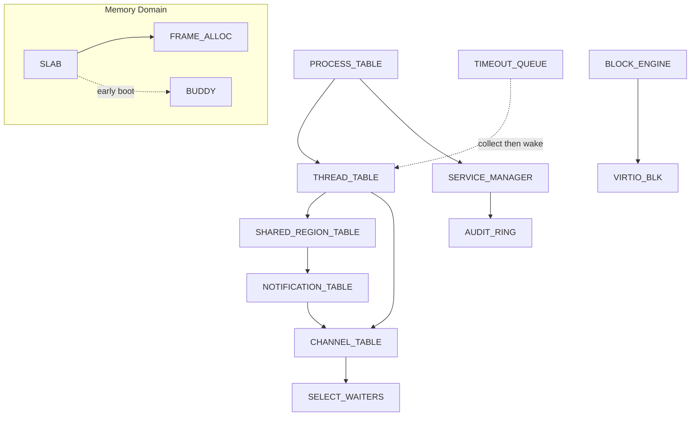

# AIOS Deadlock Prevention Architecture

**Parent document:** [architecture.md](../project/architecture.md)
**Related:** [ipc.md](./ipc.md) — IPC timeouts (§3.1), synchronous call-reply (§4.2), priority inheritance (§9.2) | [scheduler.md](./scheduler.md) — Lock ordering (§9.1), preemption model (§10.3), async priority inheritance (§13.4) | [physical.md](./memory/physical.md) — Slab allocator with per-cache magazines (§4.1), kernel allocation API (§4.2) | [model.md](../security/model.md) — Capability model

-----

## 1. Overview

Deadlocks occur when two or more threads each hold a resource the other needs, creating a circular wait. Traditional operating systems are plagued by deadlocks because they rely on coarse-grained locking and allow arbitrary resource acquisition orders. AIOS eliminates deadlocks through a layered strategy: **structural prevention** (making deadlocks impossible by design), **timeout-based detection** (bounding the cost when prevention alone is insufficient), and **contention-reducing fast paths** (minimizing lock hold times in the hottest code paths).

This document catalogs every deadlock prevention mechanism in the AIOS kernel, explains why each works, and describes how they compose into a system where deadlocks are a non-issue rather than a constant threat. Section 3 serves as the **definitive lock ordering reference** for the kernel.

-----

## 2. The Four Coffman Conditions

A deadlock requires all four conditions simultaneously (Coffman et al., 1971):

1. **Mutual exclusion** — a resource can only be held by one thread
2. **Hold and wait** — a thread holds one resource while waiting for another
3. **No preemption** — resources cannot be forcibly taken from a thread
4. **Circular wait** — a cycle exists in the resource dependency graph

AIOS breaks one or more of these conditions at every level of the system, supplemented by liveness mechanisms that bound delays even when structural prevention alone is insufficient. The table below summarizes which condition each mechanism targets:

| Mechanism | Breaks | This doc | Subsystem source |
|---|---|---|---|
| Lock ordering (per-CPU + global hierarchy) | Circular wait | §3 | [scheduler.md §9.1](./scheduler.md) |
| Mandatory IPC timeouts | Circular wait (bounded) | §4 | [ipc.md §3.1](./ipc.md) |
| Priority inheritance† | *(liveness)* | §5 | [ipc.md §9.2](./ipc.md), [scheduler.md §4.2](./scheduler.md) |
| Per-cache magazine fast path¶ | *(contention reduction)* | §6 | [physical.md §4.1](./memory/physical.md) |
| Capability-based resource model | Circular wait (graph constraint) | §7 | [ipc.md §4.1](./ipc.md), [model.md](../security/model.md) |
| Synchronous IPC (no callback chains) | Circular wait | §8 | [ipc.md §4.2](./ipc.md) |
| Preemptive kernel‡ | *(liveness)* | §9 | [scheduler.md §10.3](./scheduler.md) |
| Wait-Die / Wound-Wait | Circular wait | §10 | Future — resource arbitration layer |

†Priority inheritance does not break a Coffman condition directly. It prevents unbounded priority inversion — a liveness hazard where a high-priority thread is indefinitely delayed by lower-priority work (§5.1). It is included here because unbounded priority inversion is operationally indistinguishable from deadlock.

‡A preemptive kernel does not break Coffman's *no preemption* condition for lock-based deadlocks. Preempting a thread reclaims CPU time but does not forcibly strip locks or other resources the thread holds. Preemption is a **liveness** mechanism: it bounds how long any thread can monopolize the CPU and — in combination with priority inheritance — helps ensure that lock holders (and thus their waiters) are scheduled promptly to release locks and unblock higher-priority work.

¶Per-cache magazines do not break a Coffman condition. They reduce contention duration — the magazine's two-chance swap shortens average critical section length, making lock-related hazards less likely. See §6 for details.

-----

## 3. Lock Ordering

### 3.1 The Problem

When multiple locks exist in a system, acquiring them in inconsistent orders creates the potential for ABBA deadlocks. Thread T1 holds lock A and requests lock B, while thread T2 holds lock B and requests lock A — both block forever. This is the most common source of kernel deadlocks in traditional operating systems.

### 3.2 Per-CPU Run Queue Ordering

The load balancer migrates threads between CPUs to maintain even utilization. Migrating a thread from CPU A to CPU B requires locking both run queues. If CPU A's balancer tries to pull from CPU B while CPU B's balancer simultaneously pulls from CPU A, a classic ABBA deadlock occurs.

AIOS enforces a simple rule: **run queue locks are always acquired in ascending CPU ID order**. This breaks the circular wait condition — two CPUs can never form a cycle because both will attempt to lock the lower-numbered CPU first.

```rust
// kernel/src/sched/init.rs — try_load_balance()
// Lock in ascending CPU order to prevent deadlock.
let (first, second) = if max_cpu < min_cpu {
    (max_cpu, min_cpu)
} else {
    (min_cpu, max_cpu)
};

let mut rq_first = match RUN_QUEUES[first].try_lock() { /* ... */ };
let mut rq_second = match RUN_QUEUES[second].try_lock() { /* ... */ };
```

*Source: [scheduler.md §9.1 — Load Balancer Strategy](./scheduler.md) (lock ordering implementation)*

### 3.3 Global Subsystem Lock Hierarchy

Beyond per-CPU ordering, the kernel maintains a **global lock hierarchy** for subsystem-level locks. Every production subsystem `Mutex` in the kernel has a defined position in this hierarchy. Test-only locks (e.g., `TEST_CHANNEL`, `PI_TEST_CHANNEL` in `ipc/tests.rs`) are excluded — they run in single-threaded test contexts and do not interact with production lock paths. A thread that holds a lock at position N may only acquire locks at positions > N (increasing position number) — never at position ≤ N.

**Primary hierarchy** (locks must be acquired in increasing position order; never acquire a lower-numbered lock while holding a higher-numbered one):

| Pos | Lock | Location | Type | Notes |
|---|---|---|---|---|
| 1 | `PROCESS_TABLE` | `task/process.rs` | `Mutex<[Option<ProcessControl>; 32]>` | Top of hierarchy |
| 2 | `THREAD_TABLE` | `task/mod.rs` | `Mutex<[Option<Thread>; 64]>` | Snapshot under lock, release before acting |
| 3 | `SERVICE_MANAGER` | `service/mod.rs` | `Mutex<ServiceManager>` | Released before `AUDIT_RING` |
| 4 | `SHARED_REGION_TABLE` | `ipc/shmem.rs` | `Mutex<[Option<SharedMemoryRegion>; 64]>` | Released before `PROCESS_TABLE` re-acquire |
| 5 | `NOTIFICATION_TABLE` | `ipc/notify.rs` | `Mutex<[Option<NotificationObject>; 64]>` | After `SHARED_REGION_TABLE` |
| 6 | `CHANNEL_TABLE` | `ipc/mod.rs` | `Mutex<[Option<Channel>; 128]>` | After `THREAD_TABLE` |
| 7 | `SELECT_WAITERS` | `ipc/select.rs` | `Mutex<[Option<SelectWaiter>; 64]>` | After `NOTIFICATION_TABLE` and `CHANNEL_TABLE` |
| 8 | `TIMEOUT_QUEUE` | `ipc/timeout.rs` | `Mutex<[Option<TimeoutEntry>; 64]>` | Collect expired, wake outside lock |
| 9 | `REPLY_SLOTS` | `ipc/timeout.rs` | `Mutex<[Option<ReplySlot>; 64]>` | Per-thread reply buffer |
| 10 | `WAKEUP_ERRORS` | `ipc/timeout.rs` | `Mutex<[i64; 64]>` | Leaf lock, short hold |
| 11 | `BLOCK_ENGINE` | `storage/block_engine.rs` | `Mutex<Option<BlockEngine>>` | Calls VirtIO internally |
| 12 | `VIRTIO_BLK` | `drivers/virtio_blk.rs` | `Mutex<Option<VirtioBlk>>` | Bottom of storage stack |
| 13 | `AUDIT_RING` | `service/mod.rs` | `Mutex<[AuditEntry; 256]>` | Leaf lock, acquired after `SERVICE_MANAGER` release |

**Code evidence** for the ordering:

- `shmem.rs:9` — *"Lock ordering: PROCESS_TABLE > SHARED_REGION_TABLE > CHANNEL_TABLE."*
- `shmem.rs:158-159` — *"PROCESS_TABLE must not be acquired while SHARED_REGION_TABLE is held."*
- `shmem.rs:429` — *"SHARED_REGION_TABLE lock released before acquiring PROCESS_TABLE (lock ordering)."*
- `process.rs:103` — *"Lock ordering: THREAD_TABLE before CHANNEL_TABLE."*
- `notify.rs:55-56` — *"Lock ordering: after SHARED_REGION_TABLE, before CHANNEL_TABLE."*
- `select.rs:30-31` — *"Lock ordering: after NOTIFICATION_TABLE, after CHANNEL_TABLE."*
- `timeout.rs:88` — *"avoid lock ordering issues (TIMEOUT_QUEUE → THREAD_TABLE)."*
- `block_engine.rs:153` — *"Lock ordering: BLOCK_ENGINE > VIRTIO_BLK."*
- `service/mod.rs:106` — *"Drop the manager lock before calling audit_log to avoid potential lock ordering issues."*



**Leaf and utility locks** (not part of the main hierarchy — used in isolation or as leaf locks with no nesting):

| Lock | Location | Notes |
|---|---|---|
| `PROCESS_WAITERS` | `task/process.rs` | Process wait/reap, leaf lock |
| `CURRENT_THREAD[N]` | `task/mod.rs` | Per-CPU, no cross-CPU acquisition |
| `NOTIFY_RESULTS` | `ipc/notify.rs` | Per-thread notification result, leaf |
| `NOTIFY_DEADLINES` | `ipc/notify.rs` | Timeout scheduling, leaf |
| `ECHO_CHANNEL` | `service/mod.rs` | Test infrastructure, leaf |
| `SAMPLE_BUF` | `bench.rs` | Benchmark data collection, leaf |
| `ASID_ALLOC` | `mm/uspace.rs` | ASID allocation, leaf |
| `RUN_QUEUES[N]` | `sched/mod.rs` | Per-CPU, ascending CPU ID order (§3.2) |

### 3.4 Memory Allocator Locks

Memory allocator locks operate in a **separate domain** from the subsystem hierarchy above. They are called implicitly via `alloc::alloc()` from almost any context, which is why they must be treated as leaf locks with minimal hold times:

| Lock | Location | Type | Notes |
|---|---|---|---|
| `SLAB` | `mm/slab.rs` | `spin::Mutex<SlabAllocator>` | Global allocator, per-cache magazines inside |
| `FRAME_ALLOC` | `mm/frame.rs` | `Mutex<Option<FrameAllocator>>` | Pool-aware page allocator |
| `BUDDY` | `mm/buddy.rs` | `Mutex<BuddyAllocator>` | Physical page allocator (legacy global; per-pool buddies live in `PagePools`) |

Within the memory domain, nesting follows: `SLAB` → `FRAME_ALLOC` or `BUDDY` (not both simultaneously). On the slab slow path, the allocator calls `FRAME_ALLOC` to obtain pages; `FRAME_ALLOC` internally delegates to pool-specific buddy instances. The `BUDDY` global listed above is the legacy/early-boot allocator — per-pool buddies live inside `PagePools` and are accessed through `FRAME_ALLOC`. The key invariant is that `SLAB` is always acquired first when nesting occurs.

**Critical rule:** Never hold a subsystem lock (positions 1–13) and then allocate memory in a path that might contend on `SLAB`. If allocation is needed while holding a higher lock, pre-allocate before acquiring the lock, or use the collect-then-act pattern (§3.5).

### 3.5 The Collect-Then-Act Pattern

A recurring pattern in the AIOS kernel avoids lock ordering violations when an operation requires data from a high-position lock but must act using a low-position lock (or vice versa). The pattern:

1. **Collect** identifiers or data under the first lock
2. **Release** the first lock
3. **Act** on the collected data (which may require different locks)

Examples in the codebase:

- **`process_exit`** (`task/process.rs`): Snapshots thread IDs and channel IDs under `THREAD_TABLE`, releases the lock, then wakes blocked threads and destroys channels (which acquire `CHANNEL_TABLE`, `WAKEUP_ERRORS`, and scheduler locks).

- **`check_timeouts`** (`ipc/timeout.rs`): Collects expired entries under `TIMEOUT_QUEUE`, releases the lock, then wakes threads (which acquire `THREAD_TABLE` and scheduler locks).

- **`process_cleanup_shared_memory`** (`ipc/shmem.rs`): Collects shared region IDs under `SHARED_REGION_TABLE`, releases the lock, then cleans up mappings. Similarly, `shared_memory_share` drops `SHARED_REGION_TABLE` before calling `grant_to_process` (which may acquire `PROCESS_TABLE`).

- **`revoke_channels_for_cap`** (`cap/mod.rs`): Collects channel IDs associated with a revoked capability under `CHANNEL_TABLE`, then destroys them after releasing the lock.

This pattern trades strict atomicity for deadlock freedom. The window between collecting and acting is microseconds — acceptable because the kernel is preemptive (§9) and operations are idempotent or guarded by generation counters.

### 3.6 Why This Works

Lock ordering is a total order over all lockable resources. Any acyclic total order prevents circular wait — the **circular wait** Coffman condition is broken because a thread holding lock at position N can never form a cycle (it can only request locks at positions > N, and no thread holding a higher-position lock will request position N).

The hierarchy is enforced by convention and documented in code comments at each lock declaration site. The collect-then-act pattern (§3.5) provides an escape hatch for cases where strict nesting would require acquiring a higher-position lock while holding a lower one — by releasing the lower lock first, the ordering invariant is preserved.

### 3.7 Scope

Any new `Mutex` or spinlock added to the kernel **must** be slotted into the hierarchy:

- If it interacts with existing subsystem locks → assign it a position in §3.3 and update the table, diagram, and code comments.
- If it is per-CPU → follow ascending CPU ID ordering (§3.2).
- If it is a leaf lock with no nesting → add it to the leaf table in §3.3.
- If it is a memory allocator lock → add it to §3.4.

-----

## 4. Mandatory IPC Timeouts

### 4.1 The Problem

In a microkernel, every system operation is an IPC message. An agent that calls a service and blocks indefinitely is indistinguishable from a deadlocked thread. If Service A calls Service B and Service B calls Service A (directly or transitively through a chain), both block forever.

### 4.2 The Solution: No Unbounded Waits

Every `IpcCall` in AIOS **requires** a timeout. There is no API to block indefinitely on a synchronous IPC call:

```rust
IpcCall {
    channel: ChannelId,
    send_buf: *const u8,
    send_len: usize,
    recv_buf: *mut u8,
    recv_len: usize,
    timeout: Duration,  // mandatory — no default, no "infinite"
},
```

When the timeout elapses, the kernel returns `ETIMEDOUT` and cleans up the pending call state. The caller can retry, fall back, or propagate the error.

*Source: [ipc.md §3.1 — Syscall Table](./ipc.md) (mandatory timeout field), [ipc.md §4.2 — Synchronous IPC](./ipc.md) (call-reply pattern)*

### 4.3 Complementary: IpcCancel

Agents can also explicitly cancel a pending call via `IpcCancel`, which returns `ECANCELED` to the blocked caller. The kernel uses this during process teardown to release all pending IPC state for a dying process — preventing zombie dependencies.

### 4.4 Why This Works

Mandatory timeouts break the **circular wait** condition with a time bound. Even if a circular dependency forms, the cycle is broken within the shortest timeout in the chain — the timed-out caller releases its wait edge, collapsing the cycle. This converts a permanent deadlock into a transient timeout error.

### 4.5 Design Trade-off

Timeouts mean callers must handle `ETIMEDOUT`. This is intentional — AIOS treats unresponsive services as a fault to be handled, not a state to be tolerated. The SDK provides retry helpers with exponential backoff for the common case.

-----

## 5. Priority Inheritance Across IPC

### 5.1 The Problem

Priority inversion is a deadlock-adjacent hazard. When a high-priority Interactive thread calls a Normal-priority service, and that service is preempted by medium-priority work, the high-priority thread is effectively blocked by medium-priority work — indefinitely in the worst case.

### 5.2 The Solution: Scheduling Context Donation

When an `IpcCall` crosses scheduling classes, the kernel temporarily elevates the receiver to the caller's scheduling class:

```rust
unsafe fn ipc_direct_switch(sender: &mut Thread, receiver: &mut Thread, message: &RawMessage) {
    // ... existing copy and switch logic ...

    // Priority inheritance: receiver inherits caller's scheduling context.
    // Saved and restored on IpcReply.
    receiver.sched.inherited_class = Some(sender.sched.class);
    receiver.sched.inherited_priority = Some(sender.sched.priority);
    receiver.sched.inherited_deadline = sender.sched.deadline;

    // If receiver is in a lower class, temporarily elevate
    if receiver.sched.class < sender.sched.class {
        receiver.sched.effective_class = sender.sched.class;
        receiver.sched.effective_priority = sender.sched.priority;
    }
}
```

On `IpcReply`, the receiver's original scheduling context is restored. This is transitive — if Service B calls Service C while holding A's inherited priority, C also inherits A's priority. Transitivity is bounded to `MAX_INHERITANCE_DEPTH` (8) to prevent unbounded chains.

*Source: [ipc.md §9.2 — Priority Inheritance Across IPC](./ipc.md) (scheduling context donation code), [scheduler.md §4.2 — IPC Direct Switch](./scheduler.md) (fast-path priority fields)*

### 5.3 Async Tasks

The kernel's async executor applies the same principle. When a high-priority scheduler thread blocks waiting for an async task's result, the async task's priority is temporarily boosted:

```rust
impl KernelExecutor {
    /// Boost an async task's priority because a high-priority thread is waiting for it.
    pub fn boost_priority(&mut self, task_id: AsyncTaskId, waiter_priority: Priority) {
        if let Some(task) = self.tasks.get_mut(&task_id) {
            // Lower numerical value = higher priority (Priority(0) is highest)
            task.priority = task.priority.min(waiter_priority);
            // Re-sort ready queue if the task is ready
        }
    }
}
```

*Source: [scheduler.md §13.4 — Priority Inheritance for Async Tasks](./scheduler.md) (boost_priority implementation)*

### 5.4 Why This Works

Priority inheritance prevents the unbounded blocking that makes priority inversion equivalent to deadlock. The high-priority thread's wait is bounded by the time the service needs to process the request (at the caller's priority level), not by unrelated medium-priority work.

-----

## 6. Contention-Reducing Fast Paths in the Memory Allocator

### 6.1 The Problem

Memory allocation is the most frequent kernel operation. If every allocation requires a global lock, contention between CPUs creates both performance bottlenecks and deadlock risk (an interrupt handler allocating memory while the interrupted code holds the allocator lock).

### 6.2 The Solution: Per-Cache Magazines

The slab allocator uses a **per-cache magazine layer** that minimizes lock hold time for the common case. Each of the 5 size classes (64, 128, 256, 512, 4096 bytes) has its own `SlabCache` with a `Magazine` containing two rounds of 32 pre-allocated object pointers:

```text
SlabAllocator (global spin::Mutex)
├── SlabCache[64B]   ── Magazine(current / prev) ── free list ── buddy
├── SlabCache[128B]  ── Magazine(current / prev) ── free list ── buddy
├── SlabCache[256B]  ── Magazine(current / prev) ── free list ── buddy
├── SlabCache[512B]  ── Magazine(current / prev) ── free list ── buddy
└── SlabCache[4096B] ── Magazine(current / prev) ── free list ── buddy
```

The fast path: lock `SLAB`, pop from the current magazine round. If empty, swap current and prev (two-chance fast path), try again. This avoids the slower free-list traversal in the common case. Only when both magazine rounds are empty does the allocator refill from the shared free list or grow from the buddy allocator.

**Important:** The magazine is per-cache (per size class), not per-CPU. There is a single global `spin::Mutex<SlabAllocator>` that protects all caches. The benefit is reduced hold time — most allocations complete with a simple pointer pop from the magazine — not lock elimination.

*Source: [physical.md §4.1 — Slab Allocator](./memory/physical.md) (per-cache magazine architecture)*

### 6.3 Global Singletons

Kernel global allocators are each protected independently:

```rust
// kernel/src/mm/ — actual global declarations
pub static SLAB: spin::Mutex<SlabAllocator> = /* per-cache magazines */;
pub static FRAME_ALLOC: Mutex<Option<FrameAllocator>> = /* pool-aware page alloc */;
pub static BUDDY: Mutex<BuddyAllocator> = /* per-pool physical pages */;
```

The `SLAB` lock is held for the shortest possible duration — a magazine pop or push. The `FRAME_ALLOC` and `BUDDY` locks are only acquired on the slow path (magazine refill or page allocation).

*Source: [physical.md §4.2 — Kernel Allocation API](./memory/physical.md) (global singleton declarations)*

### 6.4 Why This Works

Per-cache magazines **reduce contention** on the slab allocator without eliminating mutual exclusion. The magazine's two-chance swap (current/prev) shortens the average critical section: most allocations complete with a simple pointer pop, avoiding the slower free-list traversal. This does not break any Coffman condition but significantly reduces the probability and duration of contention — making the **hold and wait** window as short as possible. The rare slow path (refilling from the shared free list or growing from buddy) uses fine-grained locks with minimal hold times, subject to the system-wide spinlock budget (< 1 μs target — see §9.2).

-----

## 7. Capability-Based Resource Model

### 7.1 The Problem

Traditional OSes use ambient authority — any thread can attempt to open any file, connect to any service, or acquire any resource. This leads to complex locking because any thread might compete for any resource at any time.

### 7.2 The Solution: Unforgeable Capability Tokens

In AIOS, access to any resource requires a capability token. Channels are created with specific capabilities and cannot be used without them. This constrains the resource dependency graph:

- Agents typically communicate through channels pre-established at boot by the Service Manager
- Runtime channel creation requires explicit `ChannelCreate` capability and is subject to per-process limits
- Capability transfer requires explicit kernel mediation

For the common case — agent-to-service communication — the set of possible resource dependencies is **known at boot time** when the Service Manager creates channels ([ipc.md §4.1](./ipc.md)). Processes with `ChannelCreate` capability can create channels at runtime, but the kernel enforces per-process channel limits (`max_channels` in `KernelResourceLimits`), and circular dependencies between services can be detected in the capability topology.

*Source: [ipc.md §4.1 — Channels](./ipc.md) (Channel struct with capability-gated creation), [ipc.md §4.6 — Capability Transfer](./ipc.md) (move semantics), [model.md](../security/model.md) (capability model overview)*

### 7.3 Why This Works

Capabilities restrict the dependency graph. When services cannot arbitrarily call each other, circular wait becomes a design error that is visible in the capability topology — not a runtime surprise that emerges under load.

-----

## 8. Synchronous IPC Eliminates Callback Cycles

### 8.1 The Problem

Asynchronous message-passing systems can create subtle deadlocks through callback chains: A sends to B, B's callback sends to C, C's callback sends to A, and all message queues fill up — deadlock through backpressure.

### 8.2 The Solution: Synchronous Call-Reply

AIOS's primary IPC pattern is synchronous `IpcCall`/`IpcReply`. The caller blocks until the reply arrives. This means:

- A thread can only have **one outstanding IPC call** at a time
- The call graph is a tree (or chain), never a DAG with cycles
- Backpressure is automatic — a slow service slows its callers, not the whole system

```text
Agent A ──IpcCall──→ Service B ──IpcCall──→ Service C
  (blocked)            (blocked)              (processing)
                                              IpcReply ──→ B
                       (resumes)
         IpcReply ──→ A
(resumes)
```

The asynchronous `IpcSend` (fire-and-forget) exists for notifications and telemetry, but it has explicit backpressure: when the queue is full, `IpcSend` returns `EAGAIN` — it never blocks the sender.

*Source: [ipc.md §4.2 — Synchronous IPC](./ipc.md) (call-reply diagram and backpressure semantics)*

### 8.3 Why This Works

Synchronous IPC creates a strict call chain, but by itself does not guarantee that blocked threads are lock-free. In AIOS we adopt a required coding rule: callers must not hold kernel or user-space locks, or other non-preemptible resources, across an `IpcCall`. Under this rule, a thread that is blocked on an `IpcCall` holds no locks and makes no further blocking calls — it simply waits. This breaks **circular wait** because a blocked thread cannot initiate the other half of a cycle.

-----

## 9. Fully Preemptive Kernel

### 9.1 The Problem

Non-preemptive kernels can deadlock when a thread holding a resource enters a long kernel code path and starves other threads waiting for that resource.

### 9.2 The Solution: Preempt Almost Everywhere

AIOS uses a fully preemptive kernel. User-space threads can be preempted at any instruction boundary. Kernel-mode code can be preempted at most points. Only four narrow regions disable preemption:

1. **Interrupt handler top halves** (< 10 μs)
2. **Spinlock critical sections** (< 1 μs target)
3. **Page table manipulation** (single-page atomic update)
4. **Context switch path** (inherently non-preemptible)

Everything else in the kernel is preemptible. A timer interrupt in preemptible kernel code immediately switches to a higher-priority thread.

*Source: [scheduler.md §10.3 — Preemption Model](./scheduler.md) (preemption-disabled regions list)*

### 9.3 Why This Works

A preemptive kernel does not break Coffman's **no preemption** condition — preempting a thread reclaims CPU time but does not forcibly remove locks or other resources the thread is holding. Rather, preemption is a **liveness** mechanism: it ensures that no thread can monopolize the CPU indefinitely. Threads blocked on a lock still cannot make progress until the lock holder runs and releases the lock, but the combination of preemption (§9.2) and priority inheritance (§5) ensures that a high-priority waiter can cause the lock holder to be scheduled and run promptly, within the bounds imposed by the non-preemptible regions — all of which are on the order of microseconds under the scheduler model in §10.3. This mitigates the *starvation* scenario where a thread holding a resource never gets scheduled to completion, which would be operationally indistinguishable from a deadlock.

-----

## 10. Wait-Die and Wound-Wait: Timestamp-Based Prevention

### 10.1 Background

Wait-Die and Wound-Wait (Rosenkrantz, Stearns, and Lewis, 1978) are classic deadlock prevention schemes from database concurrency control. Both assign each transaction (or thread) a **timestamp** and use age comparisons to decide whether to wait or abort — guaranteeing no circular wait can ever form.

| Scheme | Older requests resource held by younger | Younger requests resource held by older |
|---|---|---|
| **Wait-Die** | Older **waits** (it has priority) | Younger **dies** (aborted, restarts with same timestamp) |
| **Wound-Wait** | Older **wounds** younger (preempts it) | Younger **waits** (older will finish first) |

Both schemes break the **circular wait** condition: because age is a total order, a cycle of "A waits for B waits for A" is impossible — one side will always abort or be preempted.

### 10.2 How This Relates to AIOS

AIOS does not currently implement Wait-Die or Wound-Wait explicitly, but several of its mechanisms are functionally equivalent:

**Mandatory IPC timeouts (§4) approximate Wait-Die.** When a service call times out and the caller retries, the effect is similar to the "die and restart" behavior in Wait-Die — the younger/less-patient caller aborts its attempt and tries again. The difference is that AIOS uses wall-clock timeouts rather than age-based comparisons.

**Priority inheritance (§5) shares Wound-Wait's intuition but differs in mechanism.** In Wound-Wait, the older (higher-priority) transaction forces the younger holder to *abort* and release the resource. In AIOS's priority inheritance, the holder is *boosted* — its scheduling priority is elevated so it completes faster, but it is not aborted. Both ensure higher-priority work is not indefinitely blocked by lower-priority work, but priority inheritance achieves this through acceleration rather than preemption.

### 10.3 Where Wait-Die / Wound-Wait Could Add Value

If AIOS ever needs to manage **contested shared resources** beyond IPC channels — for example, exclusive access to a hardware device, a shared memory region with write locks, or Space Storage write transactions that conflict — a timestamp-based scheme would provide stronger guarantees than timeouts alone:

```text
Scenario: Agent A and Agent B both need exclusive access to
          resources R1 and R2 (in different orders).

With timeouts only:
  A locks R1, requests R2 (held by B) → waits up to timeout
  B locks R2, requests R1 (held by A) → waits up to timeout
  Both time out → both retry → possible livelock (repeated timeouts)

With Wait-Die (agents stamped at creation time):
  A (older) locks R1, requests R2 (held by B, younger) → A waits
  B (younger) locks R2, requests R1 (held by A, older) → B dies (aborts)
  B releases R2 → A acquires R2, completes → no deadlock, no livelock
```

The key advantage over pure timeouts: **Wait-Die and Wound-Wait guarantee progress**, while timeouts can lead to livelock if multiple threads repeatedly time out and retry in sync.

### 10.4 Design Considerations for AIOS

If adopted, the natural timestamp for AIOS would be the **agent creation time** (monotonic, unique, immutable) or the **IPC call sequence number** (for per-request ordering). The scheme would apply at the resource arbitration layer, not within the IPC syscall path itself:

```rust
/// Hypothetical Wait-Die resource arbitration
fn request_resource(requester: &Thread, holder: &Thread, resource: ResourceId) -> WaitOrDie {
    if requester.creation_timestamp < holder.creation_timestamp {
        // Older requester: allowed to wait (it won't cause a cycle)
        WaitOrDie::Wait
    } else {
        // Younger requester: abort and retry (prevents cycle formation)
        WaitOrDie::Die
    }
}
```

This would complement AIOS's existing defenses as a **Layer 8** — a safety net for resource contention patterns that aren't covered by lock ordering or IPC timeouts alone.

-----

## 11. Summary: Defense in Depth

No single mechanism prevents all deadlocks. AIOS layers multiple strategies so that each covers the gaps of the others:

```text
Layer 1: Lock ordering (§3)        → no circular wait among kernel locks (per-CPU + global hierarchy)
Layer 2: Mandatory IPC timeouts     → no unbounded waits between services
Layer 3: Priority inheritance       → no priority inversion stalls
Layer 4: Per-cache magazines        → minimized contention on hot allocation paths
Layer 5: Capability restrictions    → constrained dependency graph
Layer 6: Synchronous IPC            → no callback cycles
Layer 7: Preemptive kernel          → liveness: no CPU starvation of lock waiters
Layer 8: Wait-Die / Wound-Wait     → progress guarantee for contested resources (future)
Layer 9: AI prediction              → break cycles before they form (future, §13.1)
Layer 10: AI lock management        → adaptive splitting + elision (future, §13.2/§13.5)
Layer 11: AI calibration            → learned timeouts per service (future, §13.3)
Layer 12: AI deploy-time check      → cycle detection at install time (future, §13.4)
```

Layers 1 and 5–6 prevent deadlocks structurally (making them impossible by construction). Layer 4 (per-cache magazines) reduces contention probability, making lock-related hazards less likely though not eliminating them. Layer 2 (timeouts) provides detection and recovery — bounding the cost when structural prevention alone is insufficient. Layers 3 and 7 are liveness mechanisms: Layer 3 (priority inheritance) prevents unbounded priority inversion from mimicking deadlock; Layer 7 (preemptive kernel) ensures that no thread can monopolize the CPU and starve lock waiters. The Wound-Wait scheme (§10) offers a path to **guaranteed progress** — eliminating the livelock risk that pure timeouts leave open. Layers 9–12 represent AIOS's AI-driven future: AIRS consumes kernel telemetry ([observability.md §3-4, §10](./observability.md)) and applies machine learning to predict, prevent, and calibrate concurrency mechanisms — shifting deadlock prevention from reactive to proactive (§13). The system never hangs — it either completes the operation or reports a timeout error that the caller can handle.

-----

## 12. Guidance for Kernel Developers

When adding new kernel code that introduces locks or blocking operations:

1. **If you add a new per-CPU lock**, follow ascending CPU ID ordering (§3.2).
2. **If you add a new global lock**, slot it into the hierarchy defined in §3.3. Update the lock ordering table, the Mermaid diagram, and add a lock ordering comment at the lock declaration site.
3. **If you add blocking IPC**, always use `IpcCall` with a finite timeout. Never use `IpcRecv` with `timeout_ns: u64::MAX` in service code that holds resources.
4. **If you add a new allocator or cache**, consider a per-cache magazine or contention-reducing design for the fast path (§6).
5. **If you add inter-service communication**, verify that the capability graph does not create a call cycle. If a cycle is architecturally necessary, ensure every call in the cycle has a timeout (§4).
6. **If your service handles IPC calls from higher-priority callers**, do not drop or ignore the inherited scheduling context. Complete the request promptly — the caller is blocked at your priority level (§5).
7. **Prefer synchronous `IpcCall`/`IpcReply`** for request-reply patterns. If asynchronous `IpcSend` is necessary, handle `EAGAIN` backpressure explicitly — never spin or block waiting for queue space (§8).
8. **Spinlock hold times must remain under 1 μs.** If your critical section might exceed this, restructure the code to do work outside the lock.
9. **Memory allocator locks are leaf locks** (§3.4). If you need to allocate while holding a subsystem lock, pre-allocate before acquiring the lock, or use the collect-then-act pattern (§3.5) to release the subsystem lock first.
10. **Use `try_lock()` in IRQ handlers** (see `check_timeouts` in `ipc/timeout.rs`). If the lock is held, skip the operation — the next timer tick will handle it. Never spin on a lock from IRQ context.

-----

## 13. AI-Driven Deadlock Prevention

Traditional deadlock prevention (§1–12) relies on static invariants — lock ordering, timeouts, capability restrictions. These are sound but inherently reactive: timeouts fire *after* a deadlock has formed, and static ordering cannot adapt to runtime contention patterns. AIOS's intelligence layer (AIRS) extends these mechanisms with machine learning, shifting deadlock prevention from reactive to **proactive and adaptive**.

All AI-driven mechanisms run as AIRS services in user space at `Idle` scheduler class. They consume kernel telemetry via the observability feedback loop ([observability.md §3-4, §10](./observability.md)) and issue adjustments via syscalls. The kernel never depends on AI availability — every AI mechanism has a traditional fallback (the existing layers 1–8).

### 13.1 Predictive Deadlock Detection

**Problem.** Mandatory timeouts (§4) detect deadlocks only after they have formed, wasting up to 5 seconds of blocked time before recovery.

**AI solution.** AIRS trains a graph neural network (GNN) on the IPC call graph, using kernel trace data ([observability.md §3-4](./observability.md)) to learn normal call patterns. When the GNN detects an emerging cycle — two or more services forming a circular wait — it signals the service owning the youngest pending call to cancel via `IpcCancel` ([ipc.md §3.1](./ipc.md)), or uses a privileged kernel cancellation interface, *before* all parties block.

**Advantage.** Breaks cycles in milliseconds rather than waiting for a 5-second timeout. Reduces wasted CPU time and improves tail latency for all services in the call chain.

**Safety and fallback.** The GNN operates on a snapshot of the call graph and cannot cause harm — the worst case is a false positive that cancels a call that would have succeeded. The caller handles the cancellation error like any other IPC failure. If AIRS is unavailable, mandatory timeouts (Layer 2) remain the backstop.

**Research.** KernelOracle [R1] demonstrates that deep learning can predict Linux CFS scheduler decisions from kernel traces with high accuracy — the same trace-based learning approach applied to IPC call graphs. KernelAGI [R6] proposes an embedded ML subsystem for kernel-level prediction, validating the architectural pattern of AI consuming kernel telemetry.

**Target.** Phase 14+ (after AIRS and observability trace infrastructure are stable).

### 13.2 Adaptive Lock Management

**Problem.** Static lock ordering (§3) prevents deadlocks but cannot adapt to runtime contention. Two locks that are rarely contested together may become a hot pair under specific workloads, causing latency spikes without ever deadlocking.

**AI solution.** An AIRS model running at `Idle` class analyzes lock timing data from kernel tracepoints ([observability.md §3-4](./observability.md); lock contention tracepoints are a future addition to the trace infrastructure). It identifies hot lock pairs — locks that are frequently held simultaneously across cores — and suggests dynamic lock splitting for high-contention paths (e.g., separating CPU migration locks from scheduler state locks). The full lock hierarchy (§3.3) provides the static baseline; AI-driven splitting operates within this hierarchy's constraints.

Lock-aware priority inheritance for sleepable kernel mutexes ([scheduler.md §16.2](./scheduler.md)) extends this mechanism by dynamically boosting lock holders' priorities based on observed contention patterns — a runtime complement to the static lock hierarchy.

**Safety and fallback.** The global lock hierarchy (§3.3) is preserved by construction — the AI suggests *new* fine-grained locks that slot into the existing hierarchy, never reorders existing locks. If AIRS is unavailable, the static global ordering (§3) remains in effect.

**Research.** LOFT [R8] (EuroSys'25) demonstrates ML-guided lock-free index structures that dynamically adapt to contention patterns. The AI+OS survey [R7] identifies lock contention prediction as a key capability of "AI-refactored" operating systems.

**Target.** Phase 14+.

### 13.3 Learned Timeout Calibration

**Problem.** The fixed 5-second IPC timeout (§4) is a compromise: too short for slow services (false timeouts), too long for fast services (wasted blocking time when a real deadlock occurs).

**AI solution.** AIRS learns per-service IPC response time distributions from historical call data. It sets optimal timeouts per call pair: if service A typically replies to service B in 200 μs, the timeout is set to 10 ms (50× headroom) rather than 5 s (25,000× headroom). This simultaneously reduces false timeouts *and* wasted wait time during real deadlocks.

**Safety and fallback.** Learned timeouts are always ≥ the observed p99.9 latency, bounding false positive risk. A floor of 100 ms prevents pathologically short timeouts. If AIRS is unavailable, the fixed 5-second default (§4) applies.

**Research.** STUN [R2] validates that Q-learning can optimize OS timing parameters online, achieving measurable throughput gains by tuning scheduler parameters on a running system. ADIOS [R9] applies learning-based deadline calibration to I/O scheduling — the same principle applied to IPC timeouts.

**Target.** Phase 21+ (requires stable per-service latency telemetry).

### 13.4 Deploy-Time Cycle Detection

**Problem.** Runtime deadlock detection catches cycles only after they cause blocking. Static lock ordering prevents kernel-level cycles but cannot prevent application-level IPC cycles between agents.

**AI solution.** When a new agent is installed, AIRS analyzes its declared IPC channels against the existing capability topology ([model.md §3](../security/model.md)). Using the capability graph and historical call patterns, it warns if the new agent creates a potential circular dependency *before it ever runs*. This shifts deadlock prevention from runtime (reactive) to deploy-time (proactive).

**Safety and fallback.** Deploy-time analysis is advisory — it warns but does not block installation. Runtime timeouts (§4) catch cycles that escape static analysis. False positives are acceptable because the warning is informational, not enforced.

**Research.** Linux Lockdep [R11] performs runtime lock dependency graph analysis to detect potential deadlocks at lock acquisition time. AIOS extends this concept to static deploy-time analysis using AI over the capability topology. The AI+OS survey [R7] identifies proactive resource management as a hallmark of Stage 2 ("AI-refactored") operating systems.

**Target.** Phase 14+ (after capability system is stable).

### 13.5 Automatic Lock Elision

**Problem.** All locks impose overhead even when uncontested. On single-core or low-parallelism workloads, many locks protect data that is only accessed from one core, making the synchronization unnecessary.

**AI solution.** AIRS monitors lock contention metrics ([observability.md §3](./observability.md)) and identifies locks with near-zero contention over sustained periods. For these locks, it suggests a runtime switch to a lock-free path — removing the atomic RMW overhead on the hot path. If contention is subsequently detected (a second core accesses the data), the locked path is automatically restored.

**Safety and fallback.** Lock elision is conservative: it only removes locks that have shown zero contention over a configurable window (default: 60 seconds). The reversion to locked mode is immediate (within one scheduling quantum) when contention is detected. If AIRS is unavailable, all locks remain active (current behavior).

**Research.** LOFT [R8] (EuroSys'25) demonstrates ML-guided transitions between locked and lock-free data structures based on observed contention, achieving significant throughput improvements. ghOSt [R4] shows that runtime policy switching is production-viable at Google scale.

**Target.** Phase 21+ (requires stable contention metrics and lock-free alternatives for target locks).

### 13.6 References

| Ref | Paper/Project | Venue | URL |
|-----|--------------|-------|-----|
| R1 | Gupta et al., "KernelOracle: Deep Learning for Linux CFS Scheduling" | arXiv 2025 | https://arxiv.org/abs/2505.15213 |
| R2 | Nair et al., "STUN: Q-Learning Optimization of Scheduler Parameters" | Applied Sciences 2022 | https://www.mdpi.com/2076-3417/12/14/7072 |
| R4 | Humphries et al., "ghOSt: Fast & Flexible User-Space Delegation of Linux Scheduling" | SOSP'21 | https://dl.acm.org/doi/10.1145/3477132.3483542 |
| R6 | "KernelAGI: Composable OS Kernel with Embedded ML Subsystem" | arXiv 2025 | https://arxiv.org/abs/2508.00604 |
| R7 | "AI for Operating Systems: Survey and Roadmap" | arXiv 2024 | https://arxiv.org/abs/2407.14567 |
| R8 | "LOFT: Lock-Free Adaptive Learned Index" | EuroSys'25 | https://dl.acm.org/doi/10.1145/3689031.3717458 |
| R9 | "ADIOS: Adaptive Deadline I/O Scheduler" | GitHub | https://github.com/firelzrd/adios |
| R11 | Linux Lockdep — Runtime Lock Dependency Validator | kernel.org | https://docs.kernel.org/locking/lockdep-design.html |
