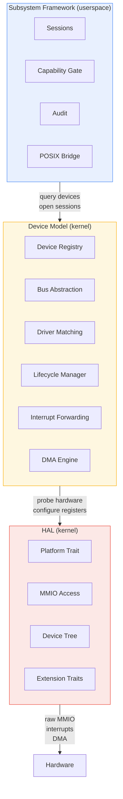
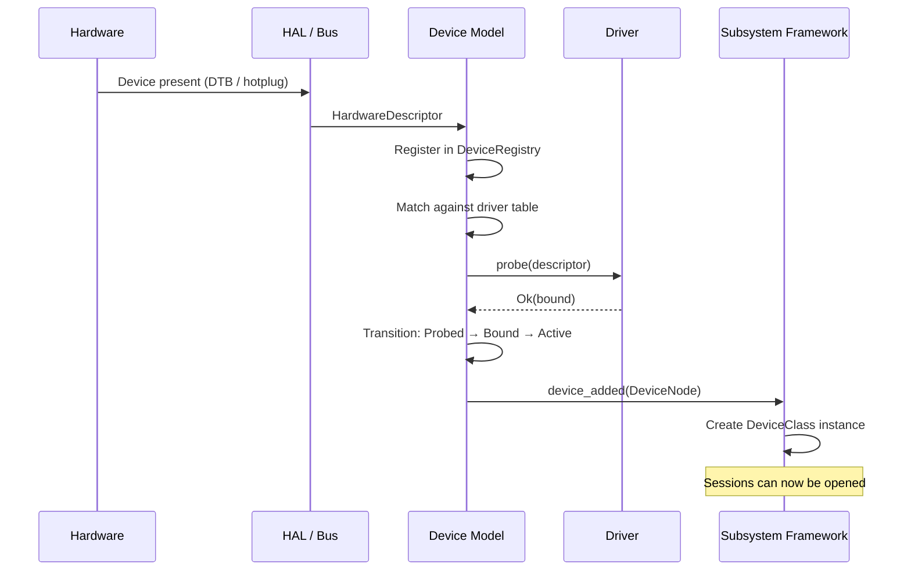
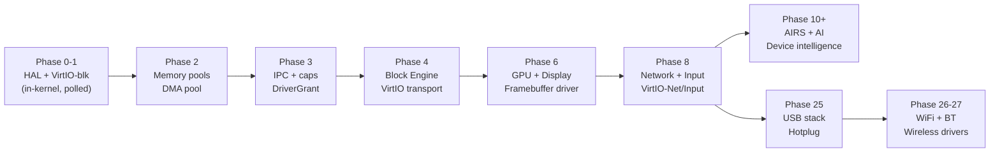

# AIOS Device Model and Driver Framework

## Deep Technical Architecture

**Parent document:** [architecture.md](../project/architecture.md)
**Related:** [hal.md](./hal.md) — Hardware Abstraction Layer (Platform trait, device init), [subsystem-framework.md](../platform/subsystem-framework.md) — Subsystem sessions and capability gates, [ipc.md](./ipc.md) — IPC channels and shared memory, [memory.md](./memory.md) — Physical/virtual memory and DMA pools

-----

## 1. Core Insight

The AIOS device stack has three layers. The bottom layer — the **HAL** ([hal.md](./hal.md)) — initializes hardware at boot: it reads the device tree, configures interrupt controllers, and sets up platform-specific registers. The top layer — the **Subsystem Framework** ([subsystem-framework.md](../platform/subsystem-framework.md)) — manages userspace sessions: capability-gated access, conflict resolution, audit, and POSIX compatibility.

Between these two layers sits the **device model** — the subject of this document. The device model answers questions that neither HAL nor the subsystem framework addresses:

- **How are devices represented?** A device is more than an MMIO region (HAL) and more than a session target (subsystem framework). It has identity, naming, bus membership, power state, and a lifecycle.
- **How do drivers bind to devices?** HAL initializes hardware; the subsystem framework consumes fully-formed devices. The device model defines driver matching, probe ordering, and the binding protocol.
- **How does the kernel–userspace boundary work for drivers?** HAL drivers run in kernel space. Subsystem services run in userspace. The device model specifies how interrupts cross this boundary, how DMA buffers are shared, and how driver crashes are contained and recovered.
- **How does a VirtIO virtqueue actually work?** HAL describes the transport at trait level; the subsystem framework describes the session at API level. The device model specifies the descriptor tables, available/used rings, and scatter-gather chains that make data flow.

**Design principle:** The device model is the *kernel's internal representation of hardware*. It exists whether drivers run in-kernel (Phase 0–4) or in userspace (Phase 6+). The HAL populates it; the subsystem framework queries it. Adding a new bus type, a new device class, or a new driver isolation model changes this layer — not the layers above or below.

-----

## 2. Architecture Overview

### 2.1 Three-Layer Device Stack

The device model is the **kernel-internal** layer. The subsystem framework never touches MMIO registers. The HAL never manages sessions or lifecycle. The device model mediates between them.

### 2.2 Key Abstractions

| Abstraction | Role | Defined in |
|---|---|---|
| `HardwareDescriptor` | Identity of a discovered device (bus, vendor, product, class) | [representation.md](./device-model/representation.md) §3.1 |
| `DeviceId` | Unique identifier, generation-tracked | [representation.md](./device-model/representation.md) §3.2 |
| `DeviceNode` | Runtime device graph node with parent/child/sibling links | [representation.md](./device-model/representation.md) §3.3 |
| `DeviceRegistry` | Central store of all devices, queryable as `system/devices/` space | [representation.md](./device-model/representation.md) §4 |
| `Bus` | Enumeration and discovery abstraction (Platform, VirtIO, USB, PCI) | [discovery.md](./device-model/discovery.md) §5 |
| `Driver` | Probe/attach/detach trait with match tables | [discovery.md](./device-model/discovery.md) §6 |
| `DeviceLifecycle` | State machine: Discovered → Probed → Bound → Active → Removed | [lifecycle.md](./device-model/lifecycle.md) §7 |
| `DriverGrant` | Capability token granting MMIO + IRQ + DMA access to a driver | [lifecycle.md](./device-model/lifecycle.md) §8 |
| `Virtqueue` | Descriptor table + available/used rings for VirtIO data transfer | [virtio.md](./device-model/virtio.md) §10 |
| `DmaEngine` | Buffer lifecycle, IOMMU integration, scatter-gather | [dma.md](./device-model/dma.md) §11 |

### 2.3 Data Flow: Discovery to Operation

-----

## Document Map

| Document | Sections | Content |
|---|---|---|
| **This file** | §1, §2, §17, §18 | Core insight, architecture overview, implementation order, design principles |
| [representation.md](./device-model/representation.md) | §3, §4 | Device representation (HardwareDescriptor, DeviceId, DeviceNode, naming), Device Registry (data structures, space schema, query API) |
| [discovery.md](./device-model/discovery.md) | §5, §6 | Bus abstraction (Platform, VirtIO, USB, PCI), Driver model (Driver trait, match tables, binding protocol) |
| [lifecycle.md](./device-model/lifecycle.md) | §7, §8, §9 | Device lifecycle state machine, kernel-to-userspace driver interface (DriverGrant, interrupt forwarding, DMA sharing), driver isolation and crash recovery |
| [virtio.md](./device-model/virtio.md) | §10 | VirtIO MMIO transport, virtqueue internals, scatter-gather, device types, modern vs legacy |
| [dma.md](./device-model/dma.md) | §11, §12 | DMA engine (buffer lifecycle, descriptor rings, IOMMU, cache coherency), per-subsystem driver patterns |
| [security.md](./device-model/security.md) | §13, §14 | Security model (capability-gated MMIO/IRQ/DMA, trust levels), hot-swap and live driver update |
| [intelligence.md](./device-model/intelligence.md) | §15, §16, §19 | Testing and verification (QEMU harness, fuzz, TLA+, Verus), AI-native device intelligence, future directions |

-----

## 17. Implementation Order

The device model is built incrementally across AIOS phases. Each phase adds capabilities that the next phase depends on:

| Phase | Device Model Deliverables | Dependencies |
|---|---|---|
| 0–1 | HAL Platform trait, VirtIO-blk kernel driver (polled), DTB parsing | — |
| 2 | Physical memory pools (DMA pool), buddy allocator, frame allocator | Phase 1 |
| 3 | IPC channels, capability system, DriverGrant token type | Phase 2 |
| 4 | Block Engine integration, VirtIO transport abstraction, data disk I/O | Phase 3 |
| 5 | GPU driver (VirtIO-GPU on QEMU), framebuffer scanout, display subsystem | Phase 4 |
| 6 | Compositor integration, surface management, multi-monitor | Phase 6 |
| 7 | VirtIO-Net driver, VirtIO-Input driver, network + input subsystems | Phase 4 |
| 9–10 | AIRS kernel-internal statistical models (fault prediction, power hints) | Phase 8 |
| 13–14 | Agent framework integration, device capabilities in agent manifests | Phase 10 |
| 16 | DeviceRegistry as system space, formal verification (TLA+ lifecycle) | Phase 14 |
| 17–18 | Security hardening: MMIO guard pages, DMA IOMMU enforcement | Phase 17 |
| 21 | Performance: interrupt coalescing, zero-copy DataChannel, DMA batching | Phase 18 |
| 24 | USB stack: xHCI driver, hub enumeration, hotplug lifecycle, class drivers | Phase 8 |
| 25–26 | WiFi (802.11), Bluetooth (HCI/L2CAP), wireless power management | Phase 25 |
| 27 | Unified power management: per-device D-states, thermal throttling | Phase 26 |
| 31 | Audio subsystem: VirtIO-Sound, I2S/PWM, period-based DMA | Phase 8 |
| 39 | Real hardware drivers: Pi 4/5 VC4/V3D, Genet, SD/eMMC, Apple AGX/ANS | Phase 28 |

-----

## 18. Design Principles

1. **The kernel owns device identity.** No matter where drivers run — in-kernel or in userspace — the kernel maintains the canonical device graph. The subsystem framework queries it; drivers populate it. This ensures a single source of truth for "what hardware exists."

2. **Drivers are replaceable; the device model is stable.** A VirtIO-blk driver can be swapped for an NVMe driver without changing the block device's DeviceNode, its DeviceId, or its position in the device graph. Drivers are leaves; the device model is the tree.

3. **Capability-gated all the way down.** HAL MMIO regions are mapped into kernel space only. Drivers receive a `DriverGrant` capability token specifying exactly which MMIO regions, interrupt lines, and DMA ranges they may access. No capability → no hardware access.

4. **Bus types are extensible.** The `Bus` trait defines enumerate, match, and interrupt forwarding. Adding USB support means implementing `Bus` for USB — not changing the device model core. The same applies to PCI, I2C, SPI, or any future bus.

5. **Lifecycle is a state machine, not ad-hoc code.** Every device transitions through the same states (Discovered → Probed → Bound → Active → Suspended → Unbound → Removed). Error handling, crash recovery, and hot-swap are defined as state transitions with invariants — not scattered cleanup code.

6. **In-kernel first, userspace later.** Phases 0–4 use in-kernel drivers for simplicity. Phase 6+ introduces userspace driver isolation with interrupt forwarding and DMA sharing. The device model supports both — the `Driver` trait is the same whether the driver is a kernel module or a userspace process.

7. **VirtIO is the development transport.** QEMU's VirtIO MMIO devices are the primary development target through Phase 23. The VirtIO transport abstraction is first-class, not an afterthought. Real hardware transports (PCI, SoC MMIO) are added when hardware phases begin.

8. **DMA is a kernel service.** Drivers request DMA buffers; the kernel allocates from the DMA pool, maps through the IOMMU (if present), and enforces cache coherency. Drivers never allocate DMA memory directly — this is the foundation of DMA isolation.

9. **Every device access is auditable.** The subsystem framework's audit space (`system/audit/`) records session-level access. The device model adds driver-level audit: which driver bound which device, when, and what MMIO/DMA resources were granted. Defense in depth.

10. **AI improves device management without owning it.** Kernel-internal statistical models (fault prediction, power hints, I/O prefetch) run without AIRS. AIRS-dependent features (natural language policies, cross-subsystem threat detection) enhance the device model but are not required for it to function.

-----

## Cross-Reference Index

| Section | Sub-document | Related Docs |
|---|---|---|
| §1 Core Insight | This file | [hal.md](./hal.md) §1.1–1.2, [subsystem-framework.md](../platform/subsystem-framework.md) §1, §3 |
| §2 Architecture Overview | This file | [hal.md](./hal.md) §1.1, [subsystem-framework.md](../platform/subsystem-framework.md) §3 |
| §3 Device Representation | [representation.md](./device-model/representation.md) | [hal.md](./hal.md) §6, [subsystem-framework.md](../platform/subsystem-framework.md) §4.2, §10 |
| §4 Device Registry | [representation.md](./device-model/representation.md) | [subsystem-framework.md](../platform/subsystem-framework.md) §10, [spaces.md](../storage/spaces.md) §2 |
| §5 Bus Abstraction | [discovery.md](./device-model/discovery.md) | [hal.md](./hal.md) §2, §6, §14 |
| §6 Driver Model | [discovery.md](./device-model/discovery.md) | [hal.md](./hal.md) §12, [subsystem-framework.md](../platform/subsystem-framework.md) §20 |
| §7 Device Lifecycle | [lifecycle.md](./device-model/lifecycle.md) | [subsystem-framework.md](../platform/subsystem-framework.md) §20.1, [boot/suspend.md](./boot/suspend.md) §15 |
| §8 Kernel–Userspace Interface | [lifecycle.md](./device-model/lifecycle.md) | [ipc.md](./ipc.md), [hal.md](./hal.md) §18.2–18.3 |
| §9 Driver Isolation | [lifecycle.md](./device-model/lifecycle.md) | [subsystem-framework.md](../platform/subsystem-framework.md) §20.3, [security/model.md](../security/model.md) §2 |
| §10 VirtIO Transport | [virtio.md](./device-model/virtio.md) | [hal.md](./hal.md) §6 |
| §11 DMA Engine | [dma.md](./device-model/dma.md) | [hal.md](./hal.md) §9, §13.1, §15, [memory/physical.md](./memory/physical.md) §2.4 |
| §12 Per-Subsystem Patterns | [dma.md](./device-model/dma.md) | [subsystem-framework.md](../platform/subsystem-framework.md) §14, [audio.md](../platform/audio.md), [networking/stack.md](../platform/networking/stack.md) |
| §13 Security Model | [security.md](./device-model/security.md) | [security/model/capabilities.md](../security/model/capabilities.md) §3, [hal.md](./hal.md) §13 |
| §14 Hot-Swap | [security.md](./device-model/security.md) | [subsystem-framework.md](../platform/subsystem-framework.md) §11, [hal.md](./hal.md) §16 |
| §15 Testing | [intelligence.md](./device-model/intelligence.md) | [subsystem-framework.md](../platform/subsystem-framework.md) §18, [security/fuzzing.md](../security/fuzzing.md) |
| §16 AI-Native | [intelligence.md](./device-model/intelligence.md) | [subsystem-framework.md](../platform/subsystem-framework.md) §22.4–22.5, [airs.md](../intelligence/airs.md) |
| §17 Implementation Order | This file | [development-plan.md](../project/development-plan.md) §8 |
| §18 Design Principles | This file | — |
| §19 Future Directions | [intelligence.md](./device-model/intelligence.md) | [hal.md](./hal.md) §18, [subsystem-framework.md](../platform/subsystem-framework.md) §22 |
