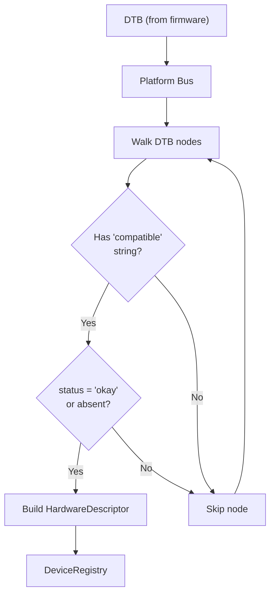
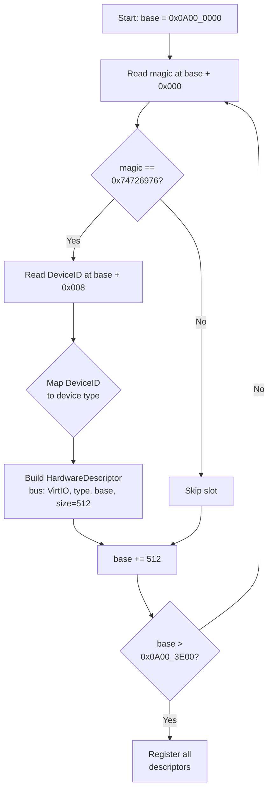
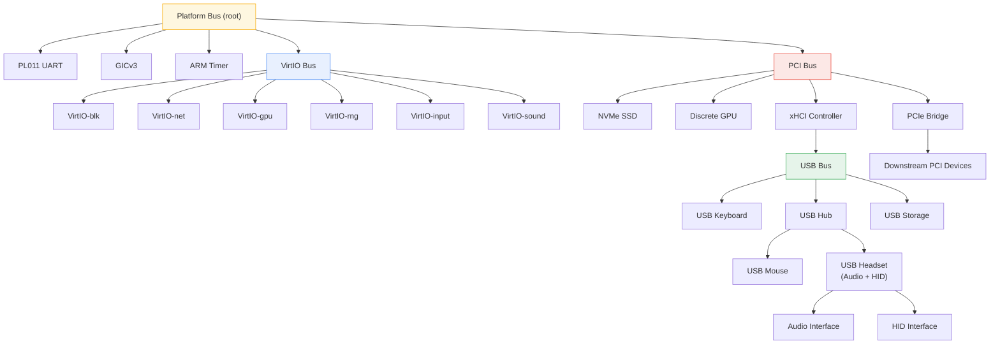
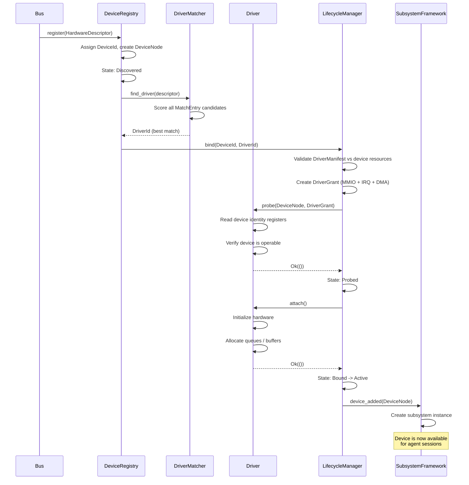

# AIOS Bus Abstraction and Driver Model

Part of: [device-model.md](../device-model.md) — Device Model and Driver Framework
**Related:** [representation.md](./representation.md) — Device representation and registry, [lifecycle.md](./lifecycle.md) — Device lifecycle state machine

-----

## 5. Bus Abstraction and Device Discovery

Every device in the system is discovered by a **bus**. A bus is an abstraction over a hardware enumeration mechanism: the platform device tree, VirtIO MMIO probing, USB hub topology walking, or PCI configuration space scanning. The device model does not hardcode any bus type. Instead, it defines a `Bus` trait that all enumeration mechanisms implement. The DeviceRegistry receives `HardwareDescriptor` values from buses and does not care which bus produced them.

This design means adding a new bus type (I2C, SPI, SDIO) is a trait implementation — not a change to the device model core.

-----

### 5.1 Bus Trait

The `Bus` trait is the contract between a hardware enumeration mechanism and the device model:

```rust
/// A bus discovers devices and provides transport for driver access.
pub trait Bus: Send + Sync {
    /// Human-readable bus name (e.g., "platform", "virtio-mmio", "usb", "pci").
    fn name(&self) -> &'static str;

    /// Enumerate all devices currently present on this bus.
    /// Called at boot (Platform, VirtIO) and on hotplug events (USB, PCI).
    fn enumerate(&self) -> Vec<HardwareDescriptor>;

    /// Find the best matching driver for a discovered device.
    /// Returns None if no driver matches — the device stays in Discovered state.
    fn match_driver(
        &self,
        desc: &HardwareDescriptor,
        drivers: &DriverRegistry,
    ) -> Option<DriverId>;

    /// Forward a hardware interrupt to the correct device's handler.
    /// The bus knows its own interrupt routing (e.g., shared IRQ lines on PCI).
    fn forward_interrupt(&self, device_id: DeviceId, irq: u32) -> Result<()>;

    /// Create a transport handle for safe driver access to device registers.
    /// The transport enforces MMIO region bounds and access width.
    fn create_transport(&self, desc: &HardwareDescriptor) -> Result<Box<dyn Transport>>;
}
```

The `Transport` trait abstracts safe access to device registers. Drivers never perform raw MMIO reads and writes — they call `transport.read32(offset)` and `transport.write32(offset, value)`. The transport validates that the offset falls within the device's granted MMIO region and that the access width matches the register specification.

```rust
/// Safe abstraction over MMIO register access.
pub trait Transport: Send + Sync {
    /// Read a 32-bit register at the given offset from the device base.
    fn read32(&self, offset: usize) -> Result<u32>;

    /// Write a 32-bit register at the given offset from the device base.
    fn write32(&self, offset: usize, value: u32) -> Result<()>;

    /// Read a range of bytes (for config space, descriptor tables, etc.).
    fn read_bytes(&self, offset: usize, buf: &mut [u8]) -> Result<usize>;

    /// Write a range of bytes.
    fn write_bytes(&self, offset: usize, data: &[u8]) -> Result<usize>;

    /// Return the physical base address of the MMIO region (for DMA setup).
    fn mmio_base(&self) -> PhysAddr;

    /// Return the size of the MMIO region in bytes.
    fn mmio_size(&self) -> usize;
}
```

All Transport implementations enforce bounds checking. An out-of-range offset returns `Err(DeviceError::MmioOutOfBounds)` rather than performing an unchecked volatile access. This is a key safety boundary — a misbehaving driver cannot reach beyond its assigned MMIO region.

> **Cross-reference:** [hal.md](../hal.md) §2 defines the Platform trait that provides low-level hardware initialization. The Bus trait operates at a higher level — it uses HAL-initialized hardware to discover and access devices.

-----

### 5.2 Platform Bus

The Platform Bus discovers devices described in the Flattened Device Tree (DTB) that firmware passes to the kernel at boot. On aarch64, the DTB pointer arrives in register `x0` (QEMU direct boot) or through the UEFI configuration table (edk2 boot).

**Enumeration process:**

1. Parse the DTB using `fdt-parser` (already used in `kernel/src/dtb.rs`)
2. Walk all nodes that contain a `compatible` string property
3. For each node, extract: compatible strings, `reg` (MMIO base + size), `interrupts` (IRQ numbers), `status` (must be "okay" or absent)
4. Construct a `HardwareDescriptor` with `bus: Bus::Platform` and the extracted properties
5. Return the full list — Platform Bus enumeration is a one-shot operation at boot

**Key characteristics:**

- **No hotplug.** Platform devices are fixed at boot. The DTB describes the hardware topology and does not change at runtime. Devices that are `status = "disabled"` in the DTB are not enumerated.
- **Compatible string matching.** A device node may have multiple compatible strings (e.g., `"arm,pl011"`, `"arm,primecell"`). The driver matcher tries each string in order, most specific first.
- **Implicit parent-child.** The DTB node hierarchy maps directly to `DeviceNode` parent-child relationships in the DeviceRegistry. A UART node under a bus controller node becomes a child of that controller in the device graph.



> **Cross-reference:** [hal.md](../hal.md) §2 (platform detection and DTB parsing), `kernel/src/dtb.rs` (current DTB wrapper implementation).

-----

### 5.3 VirtIO Bus

The VirtIO Bus discovers VirtIO MMIO transport devices by scanning a fixed address range. On QEMU virt, VirtIO MMIO devices occupy the region `0x0A00_0000` through `0x0A00_3E00` at 512-byte intervals. Each 512-byte slot either contains a VirtIO device (identified by the magic value `0x74726976` at offset 0) or is empty.

**MMIO scan flow:**



**VirtIO device types discovered via DeviceID register:**

| DeviceID | Type | Driver | Phase |
|---|---|---|---|
| 1 | Network | `virtio-net` | Phase 7 |
| 2 | Block | `virtio-blk` | Phase 0 (implemented) |
| 4 | Random | `virtio-rng` | Phase 7 |
| 16 | GPU | `virtio-gpu` | Phase 5 |
| 18 | Input | `virtio-input` | Phase 7 |
| 25 | Sound | `virtio-sound` | Phase 22 |

Each discovered VirtIO device produces a `HardwareDescriptor` with:

- `bus`: `Bus::VirtIO`
- `vendor_id`: read from VendorID register (QEMU = `0x554D4551`)
- `device_class`: mapped from the DeviceID register
- `mmio_regions`: one region (base address, 512 bytes)
- `irq_lines`: one SPI, allocated by QEMU per device slot

The VirtIO Bus creates `VirtioMmioTransport` instances that implement the `Transport` trait. These handle the VirtIO MMIO register layout: magic, version, device ID, vendor ID, device features, queue operations, and configuration space — all through bounds-checked volatile accesses.

> **Cross-reference:** [hal.md](../hal.md) §6 (VirtIO device initialization), [virtio.md](./virtio.md) §10 (virtqueue internals and scatter-gather). The existing `kernel/src/drivers/virtio_blk.rs` is the Phase 0 in-kernel VirtIO-blk driver that will be migrated to the formal driver model.

-----

### 5.4 USB Bus

The USB Bus discovers devices by enumerating the xHCI (USB 3.x) host controller's port topology. Unlike Platform and VirtIO buses, USB supports runtime hotplug — devices appear and disappear while the system is running.

**Discovery process:**

1. **xHCI initialization.** The xHCI controller itself is discovered as a PCI or platform device. Once its driver is bound, the USB Bus becomes operational.
2. **Root port enumeration.** The xHCI controller exposes root ports. Each port's status register indicates whether a device is connected and at what speed (Low/Full/High/Super).
3. **Hub topology walking.** If a connected device is a hub, the USB Bus recursively enumerates the hub's downstream ports. Each hub can have up to 127 downstream devices.
4. **Descriptor fetching.** For each device, the USB Bus reads the device descriptor, configuration descriptor, and all interface descriptors using control transfers on endpoint 0.
5. **Interface splitting.** Composite USB devices (e.g., a headset with audio + HID interfaces) are split into multiple `HardwareDescriptor` instances — one per interface. Each interface is matched and bound independently.

**HardwareDescriptor fields for USB devices:**

```rust
// A USB interface produces a HardwareDescriptor with:
HardwareDescriptor {
    bus: Bus::USB,
    vendor_id: usb_device_descriptor.idVendor as u32,
    product_id: usb_device_descriptor.idProduct as u32,
    device_class: DeviceClassId(usb_interface_descriptor.bInterfaceClass as u32),
    unique_id: Some(format!("usb-{}", serial_number)),
    mmio_regions: Vec::new(),  // USB uses transfer-based I/O, not MMIO
    irq_lines: Vec::new(),     // Interrupts handled by xHCI controller
    dma_capable: false,        // DMA managed by xHCI, not the class driver
    // ...
}
```

**Hotplug handling:**

- Port status change interrupts from the xHCI controller trigger re-enumeration of affected ports.
- New devices are registered in the DeviceRegistry and matched against available drivers.
- Removed devices trigger the lifecycle state machine: Active -> Unbound -> Removed (see [lifecycle.md](./lifecycle.md) §7).
- The USB Bus notifies the subsystem framework via `device_removed()` so that active sessions can be torn down gracefully.

> **Cross-reference:** [subsystem-framework.md](../../platform/subsystem-framework.md) §12 (USB as meta-subsystem), [hal.md](../hal.md) §14 (USB host controller initialization).

-----

### 5.5 PCI/PCIe Bus

The PCI Bus discovers devices by scanning PCI configuration space. On aarch64 platforms, PCI Express (PCIe) is the dominant interconnect for discrete hardware: GPUs, NVMe storage, network adapters, and USB host controllers.

**Configuration space scan:**

1. **Bus enumeration.** Scan bus numbers 0 through 255. For each bus, scan device numbers 0 through 31. For each device, scan function numbers 0 through 7.
2. **Presence detection.** Read the Vendor ID register (offset 0x00) at each bus:device:function. A value of `0xFFFF` means no device is present.
3. **Header parsing.** Read the Class Code (offset 0x08) for device classification. Read BARs (Base Address Registers, offsets 0x10-0x24) for MMIO regions.
4. **Bridge recursion.** If the device is a PCI-to-PCI bridge (class 0x0604), enumerate the secondary bus behind it. This discovers devices behind PCIe switches.

**BAR mapping:**

Each PCI device declares its MMIO regions through BARs. The PCI Bus:

- Reads each BAR to determine size (write all 1s, read back, mask type bits)
- Allocates physical address ranges from the platform's PCI MMIO window
- Programs the BAR with the allocated base address
- Creates a `Transport` that maps the BAR region into kernel virtual address space

**MSI-X interrupt allocation:**

PCI devices use Message Signaled Interrupts (MSI-X) rather than shared IRQ lines:

- Read the MSI-X capability structure from PCI configuration space
- Allocate GICv3 SPIs for each MSI-X vector the device requests
- Program the MSI-X table with the allocated interrupt addresses
- Each interrupt vector maps to a specific device function (e.g., completion queue, error, config change)

**SR-IOV virtual function discovery (future):**

Single Root I/O Virtualization allows a single physical device to present multiple virtual functions, each independently assignable to different agents. The PCI Bus discovers VFs through the SR-IOV Extended Capability structure. This is a future direction — initial PCI support targets physical functions only.

> **Cross-reference:** [hal.md](../hal.md) §18 (future hardware directions including PCIe support).

-----

### 5.6 Bus Hierarchy and Multi-Level Discovery

Buses form a hierarchy. The Platform Bus is always the root — it discovers the foundational controllers that host other buses. VirtIO MMIO devices are discovered directly from the platform's DTB-described address ranges. USB and PCI controllers are themselves devices on the Platform Bus (or on each other — a USB controller may sit behind a PCI bridge).



**Multi-level discovery sequence:**

1. **Boot:** Platform Bus enumerates DTB. VirtIO MMIO range is scanned. PCI ECAM base is read from DTB.
2. **PCI init:** PCI Bus scans configuration space. xHCI controller discovered and bound.
3. **USB init:** xHCI driver enables the USB Bus. Root ports are enumerated. Hubs are recursively walked.
4. **Runtime:** USB and PCI hotplug events trigger incremental re-enumeration. Platform and VirtIO buses are static after boot.

All buses report discovered devices to the single DeviceRegistry. The registry maintains the parent-child graph that mirrors the physical bus hierarchy. Querying `system/devices/usb/` returns all USB devices regardless of which hub or controller they sit behind.

-----

## 6. Driver Model

A **driver** is the code that knows how to operate a specific device (or class of devices). The device model separates device discovery (bus responsibility) from device operation (driver responsibility). A bus discovers hardware and produces descriptors. The driver model matches descriptors to drivers, validates resource requirements, and orchestrates the probe/bind sequence.

-----

### 6.1 Driver Trait

Every driver — whether built-in or loadable, kernel-mode or userspace — implements the `Driver` trait:

```rust
/// A driver knows how to operate a specific device or device class.
pub trait Driver: Send + Sync {
    /// Human-readable driver name (e.g., "virtio-blk", "pl011-uart", "usb-hid").
    fn name(&self) -> &'static str;

    /// Match entries this driver can handle. Checked during driver binding.
    fn match_table(&self) -> &[MatchEntry];

    /// Probe the device: verify it is operable, read identity/config registers.
    /// The DriverGrant provides capability-gated access to MMIO, IRQ, and DMA.
    /// Returns Ok(()) if the driver can operate this device.
    fn probe(&mut self, device: &DeviceNode, grant: DriverGrant) -> Result<()>;

    /// Attach to the device: initialize hardware, allocate resources, start operation.
    /// Called after probe() succeeds. The device transitions to Active state.
    fn attach(&mut self) -> Result<()>;

    /// Detach from the device: quiesce hardware, release resources.
    /// Called on unbind, device removal, or driver replacement.
    fn detach(&mut self) -> Result<()>;

    /// Suspend the device: save state, reduce power.
    /// Returns an opaque state blob that resume() will restore.
    fn suspend(&mut self) -> Result<DriverState>;

    /// Resume the device: restore state from suspend, re-enable operation.
    fn resume(&mut self, state: DriverState) -> Result<()>;
}
```

The `DriverGrant` parameter to `probe()` is a capability token that grants the driver access to exactly the MMIO regions, interrupt lines, and DMA ranges that the device requires. A driver cannot access hardware resources not listed in its grant. See [lifecycle.md](./lifecycle.md) §8 for DriverGrant internals.

The `DriverState` returned by `suspend()` is an opaque byte buffer containing device-specific register snapshots, queue positions, and pending operation state. The driver is responsible for serialization; the device model is responsible for storing and restoring the buffer across power transitions.

-----

### 6.2 Driver Registration and Match Tables

Drivers declare what devices they can handle through **match entries**. Each entry specifies one or more criteria. The driver matcher scores each entry against a `HardwareDescriptor` and selects the highest-specificity match.

```rust
/// A single match criterion for driver-to-device binding.
#[derive(Clone, Debug)]
pub struct MatchEntry {
    /// Exact vendor ID match (e.g., USB vendor, PCI vendor).
    pub vendor_id: Option<u32>,

    /// Exact product ID match (e.g., USB product, PCI device).
    pub product_id: Option<u32>,

    /// Device class match (e.g., USB class 0x03 = HID, PCI class 0x01 = storage).
    pub device_class: Option<u32>,

    /// Device subclass match (narrows within a class).
    pub device_subclass: Option<u32>,

    /// Bus type constraint (e.g., only match on VirtIO bus).
    pub bus: Option<Bus>,

    /// Compatible string match (for platform/DTB devices).
    pub compatible: Option<&'static str>,
}
```

**Specificity scoring:**

The driver matcher assigns a score to each `MatchEntry` that matches a descriptor. Higher scores indicate more specific matches:

| Match level | Score | Example |
|---|---|---|
| Exact vendor + product | 100 | USB vendor=0x046D, product=0x0825 |
| Exact vendor + class | 75 | PCI vendor=0x8086, class=0x02 (network) |
| Exact class + subclass | 50 | USB class=0x01, subclass=0x01 (audio control) |
| Class only | 25 | USB class=0x03 (HID — any HID device) |
| Compatible string | 90 | DTB compatible="arm,pl011" |
| Bus only | 10 | Any device on VirtIO bus |

When multiple match entries from different drivers match the same descriptor, the entry with the highest score wins. Ties are broken by driver registration order (first registered wins).

**DriverRegistry:**

```rust
/// Global registry of available drivers.
pub struct DriverRegistry {
    /// All registered drivers, indexed by DriverId.
    drivers: Vec<RegisteredDriver>,
}

/// A driver registered in the system, with its metadata.
pub struct RegisteredDriver {
    pub id: DriverId,
    pub manifest: DriverManifest,
    pub driver: Box<dyn Driver>,
    pub bound_devices: Vec<DeviceId>,
}
```

The `DriverRegistry` is a kernel-global structure protected by a lock. Registration happens at boot (for built-in drivers) or at runtime (for loadable drivers). The registry is queried by buses during device enumeration and by the lifecycle manager during re-binding after driver updates.

-----

### 6.3 Driver Loading: Built-in vs Loadable

AIOS supports two driver loading models, reflecting the project's incremental development:

**Built-in drivers (Phase 0-4):**

Built-in drivers are compiled directly into the kernel image. They are registered during `kernel_main` initialization, before device enumeration begins. This is the simplest model — no dynamic loading, no trust boundaries, no manifest validation beyond compile-time type checking.

```rust
// Example: registering built-in drivers at boot
pub fn register_builtin_drivers(registry: &mut DriverRegistry) {
    registry.register(VirtioBlkDriver::new());
    registry.register(Pl011UartDriver::new());
    registry.register(VirtioGpuDriver::new());
    // ... additional built-in drivers
}
```

**Loadable drivers (Phase 5+):**

Loadable drivers are compiled as separate crates and loaded at runtime. This model is inspired by Theseus OS's cell-based architecture, where kernel components are independently loadable and swappable without rebooting.

Loadable driver loading sequence:

1. The driver crate is stored as an ELF object in the `system/drivers/` space
2. The kernel's driver loader maps the ELF sections into kernel address space
3. The loader resolves symbols against the kernel's exported symbol table
4. The driver's `init()` function is called, which registers the `Driver` implementation
5. The `DriverManifest` is validated against kernel policy (see section 6.6)

**Trust levels for loadable drivers:**

Loadable drivers carry a trust level that determines their isolation:

- `DriverTrustLevel::KernelTrusted` — runs in EL1, full kernel access (built-in drivers only)
- `DriverTrustLevel::Trusted` — runs in EL1 with MMIO guard pages and DMA bounds checking
- `DriverTrustLevel::Limited` — runs in EL1 with restricted DMA (no scatter-gather)
- `DriverTrustLevel::Untrusted` — runs in EL0 userspace with IPC-based MMIO forwarding, read-only MMIO

> **Cross-reference:** [security.md](./security.md) §14 (hot-swap and live driver update), [lifecycle.md](./lifecycle.md) §9 (driver isolation and crash recovery).

-----

### 6.4 Driver Binding Protocol

The binding protocol is the complete sequence from device discovery through operational readiness. It involves the bus, the DeviceRegistry, the driver matcher, the driver itself, and the subsystem framework.



**Failure handling at each stage:**

- **No driver match:** Device stays in Discovered state. It is periodically re-matched when new drivers are registered.
- **Manifest validation fails:** Binding is rejected. The device stays Discovered. An audit event is logged.
- **probe() fails:** The driver is not bound. The device returns to Discovered. Another driver may be tried if available.
- **attach() fails:** The DriverGrant is revoked. The device returns to Discovered. An error is reported to the subsystem framework.

-----

### 6.5 Driver Priority and Conflict Resolution

When multiple drivers match the same device, the device model resolves the conflict using specificity scoring (section 6.2). The highest-scoring match wins. However, there are additional conflict resolution rules:

**No dual binding.** A device can have at most one bound driver at any time. If a higher-priority driver is registered after a device is already bound, the new driver does not automatically replace the old one. The system administrator (or an agent with the appropriate capability) must explicitly request a driver swap.

**User override via driver preferences.** The `system/config/drivers/` space stores per-device driver preferences:

```text
system/config/drivers/
  virtio-blk/          -> preferred driver for VirtIO block devices
    driver: "virtio-blk-uring"
  usb-hid/             -> preferred driver for USB HID devices
    driver: "usb-hid-gamepad"
```

When a preference exists and the preferred driver's match table includes the device, the preferred driver takes priority regardless of specificity score. This allows users to select specialized drivers (e.g., a gamepad-optimized HID driver) over generic ones.

**Class fallback.** If no vendor/product-specific driver matches, the system falls back to class-level drivers. For example, a USB device with class 0x08 (Mass Storage) uses the generic `usb-mass-storage` driver even if no driver recognizes its specific vendor/product combination.

-----

### 6.6 Driver Manifest

Every driver declares its resource requirements through a `DriverManifest`. The manifest is validated at registration time (for built-in drivers) and at load time (for loadable drivers). The kernel rejects drivers that request more resources than the target device provides or that exceed policy limits.

```rust
/// Static declaration of a driver's identity and resource requirements.
pub struct DriverManifest {
    /// Human-readable driver name.
    pub name: &'static str,

    /// Semantic version (major, minor, patch).
    pub version: (u32, u32, u32),

    /// Match entries — which devices this driver can handle.
    pub match_table: &'static [MatchEntry],

    /// Number of MMIO regions the driver needs access to.
    /// Must be <= the number of regions the device exposes.
    pub mmio_regions: u32,

    /// Number of IRQ lines the driver needs.
    /// Must be <= the number of IRQs the device exposes.
    pub irq_lines: u32,

    /// Whether this driver performs DMA.
    pub dma_capable: bool,

    /// Largest DMA buffer this driver will request (bytes).
    /// Validated against the DMA pool's per-driver allocation limit.
    pub max_dma_size: usize,

    /// Trust level required to run this driver.
    pub trust_level: DriverTrustLevel,
}

/// Trust levels for driver isolation.
/// Ordered from least to most trusted.
#[derive(Clone, Copy, Debug, PartialEq, Eq, PartialOrd, Ord)]
pub enum DriverTrustLevel {
    /// Unknown or newly loaded driver: read-only MMIO, no DMA, no IRQ coalescing.
    Untrusted,
    /// Community or third-party driver: limited DMA, no scatter-gather.
    Limited,
    /// Signed by OS vendor or proven reliable: full DMA, scatter-gather, IRQ coalescing.
    Trusted,
    /// Compiled into the kernel image. Full hardware access.
    KernelTrusted,
}
```

**Manifest validation rules:**

| Check | Condition | Rejection reason |
|---|---|---|
| MMIO count | `manifest.mmio_regions <= device.mmio_region_count` | Driver requests more MMIO regions than device has |
| IRQ count | `manifest.irq_lines <= device.irq_count` | Driver requests more IRQs than device has |
| DMA size | `manifest.max_dma_size <= dma_pool.per_driver_limit` | DMA request exceeds pool policy |
| Trust level | `manifest.trust_level >= system_minimum_trust` | Driver trust level below system policy |
| Version | Loadable: manifest version matches ELF metadata | Version mismatch between manifest and binary |
| Match table | `manifest.match_table.len() > 0` | Driver matches nothing |

The manifest serves as a contract. When the lifecycle manager creates a `DriverGrant` for a driver, the grant's MMIO regions, IRQ lines, and DMA limits are sized to the manifest's declared requirements — not the device's full capabilities. A driver that declares `mmio_regions: 1` receives access to only the first MMIO region, even if the device has three. This is the principle of least privilege applied to hardware access.

> **Cross-reference:** [security.md](./security.md) §13 (capability-gated MMIO/IRQ/DMA access), [lifecycle.md](./lifecycle.md) §8 (DriverGrant construction from manifest).
