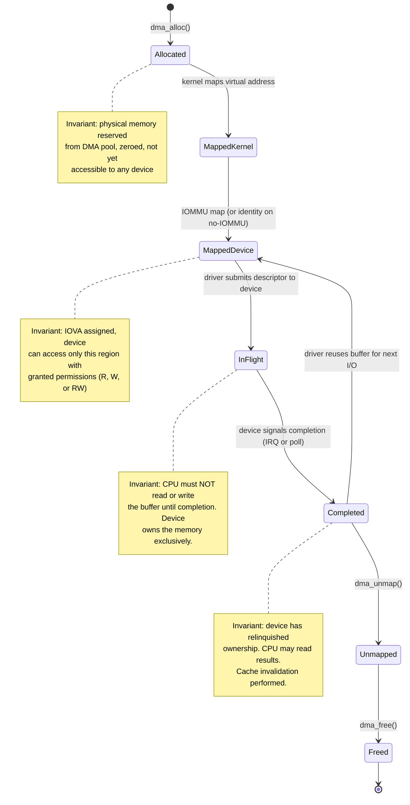
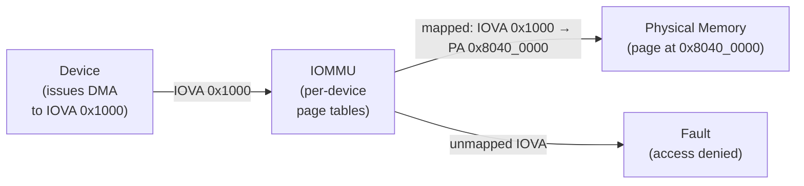

# AIOS DMA Engine and Driver Patterns

Part of: [device-model.md](../device-model.md) — Device Model and Driver Framework
**Related:** [virtio.md](./virtio.md) — VirtIO transport and virtqueue internals, [lifecycle.md](./lifecycle.md) — DriverGrant and DMA sharing (§8.4)

-----

## 11. DMA Engine

Direct Memory Access (DMA) allows devices to read and write system memory without CPU involvement. The DMA engine is the kernel's centralized service for managing DMA buffers, enforcing isolation through the IOMMU, and maintaining cache coherency on ARM's weakly-ordered memory model.

Drivers never allocate DMA memory directly. They request buffers from the DMA engine, which allocates from the DMA pool ([memory/physical.md](../memory/physical.md) §2.4), maps through the IOMMU if available ([hal.md](../hal.md) §13.1), and returns a handle that the driver uses for device programming. This separation is the foundation of DMA isolation — a compromised driver cannot direct a device to DMA into arbitrary kernel memory.

### 11.1 DMA Buffer Lifecycle

A DMA buffer transitions through a strict state machine. Each state has an invariant that the kernel enforces — violating any invariant is a bug, not a policy choice.



**State invariants:**

| State | CPU Access | Device Access | Invariant |
|---|---|---|---|
| Allocated | Write (zero-fill) | None | Physical pages reserved, no IOVA assigned |
| MappedKernel | Read/Write | None | Virtual address mapped, cache lines owned by CPU |
| MappedDevice | Write only (fill data) | Read (IOVA active) | IOVA mapped; device can DMA-read from this point. CPU fills data, then transitions to InFlight |
| InFlight | **Forbidden** | Read and/or Write | Device owns the buffer; CPU access is a data race |
| Completed | Read | None | Device done; CPU reclaims ownership after cache invalidate |
| Unmapped | None | None | IOVA revoked, IOTLB invalidated |
| Freed | None | None | Physical pages returned to DMA pool |

### 11.2 Descriptor Rings

High-throughput devices (NVMe, VirtIO-blk, network) use paired submission and completion queues to batch I/O requests. This avoids per-request traps and allows the device to process requests out of order.

```text
  Submission Queue (SQ)                    Completion Queue (CQ)
 ┌───────────────────────┐               ┌───────────────────────┐
 │  [0] read  LBA 1024   │──────┐        │  [0] completed, ok    │
 │  [1] write LBA 2048   │──────┤        │  [1] completed, ok    │
 │  [2] read  LBA 512    │──────┤  Device│  [2] (empty)          │
 │  [3] (empty)          │      ├───────►│  [3] (empty)          │
 │  ...                  │      │        │  ...                  │
 │  [N-1]               │      │        │  [N-1]               │
 └───────────────────────┘      │        └───────────────────────┘
           ▲                    │                    │
           │                    │                    │
    Driver writes          Doorbell            Driver reads
    new entries            register             completions
                        (MMIO write)
```

**Protocol:**
1. Driver writes one or more descriptors into the submission queue
2. Driver writes the submission queue tail pointer to the doorbell register (single MMIO write)
3. Device reads descriptors, performs DMA, writes results to completion queue
4. Device raises an interrupt (or driver polls the completion queue head)
5. Driver reads completion entries, processes results, advances the completion queue head

```rust
/// A single DMA descriptor in the submission queue.
/// Layout matches NVMe SQE / VirtIO split-virtqueue descriptor format.
#[repr(C)]
pub struct DmaDescriptor {
    /// Physical address (or IOVA) of the data buffer.
    pub addr: u64,
    /// Length of the data buffer in bytes.
    pub len: u32,
    /// Flags: direction (read/write), chained, interrupt-on-completion.
    pub flags: DescriptorFlags,
    /// Opaque identifier returned in the completion entry.
    pub id: u16,
    /// Reserved for alignment.
    _reserved: u16,
}

bitflags::bitflags! {
    /// Descriptor flags controlling DMA direction and behavior.
    pub struct DescriptorFlags: u32 {
        /// Device reads from this buffer (host → device).
        const WRITE       = 1 << 0;
        /// Device writes to this buffer (device → host).
        const READ        = 1 << 1;
        /// This descriptor is chained to the next one (scatter-gather).
        const NEXT        = 1 << 2;
        /// Request an interrupt when this descriptor completes.
        const INTERRUPT   = 1 << 3;
    }
}

/// Completion entry written by the device.
#[repr(C)]
pub struct DmaCompletion {
    /// Matches the `id` field from the submitted descriptor.
    pub id: u16,
    /// Device-specific status code (0 = success).
    pub status: u16,
    /// Number of bytes actually transferred.
    pub bytes_transferred: u32,
}
```

The submission and completion queues are themselves DMA buffers allocated from the DMA pool. The device accesses them via physical addresses (or IOVAs when an IOMMU is present). Queue depth is negotiated during device initialization — typically 32 for VirtIO, 64-256 for NVMe.

### 11.3 Bounce Buffers

When a device cannot DMA to the target address, the kernel interposes a **bounce buffer** in DMA-capable memory. This occurs in two situations:

1. **Address range limitation.** Some devices (32-bit DMA engines, legacy PCI) cannot address memory above 4 GB. If the target buffer resides in high memory, the kernel allocates a bounce buffer below the device's DMA ceiling.

2. **Non-contiguous pages.** Scatter-gather requires physically contiguous segments. If the user buffer spans non-contiguous pages and no IOMMU is available to remap them, the kernel bounces through a contiguous DMA buffer.

```text
  Write path (host → device):

    User buffer (scattered pages)
    ┌────┐ ┌────┐ ┌────┐
    │pg A│ │pg C│ │pg F│     CPU copy
    └──┬─┘ └──┬─┘ └──┬─┘  ───────────►  Bounce buffer (contiguous, DMA-capable)
       │      │      │                   ┌──────────────────┐
       └──────┴──────┘                   │  A' │ C' │ F'   │
                                         └────────┬─────────┘
                                                  │  DMA
                                                  ▼
                                               Device

  Read path (device → host):

    Device  ──DMA──►  Bounce buffer  ──CPU copy──►  User buffer
```

**Performance cost:** One extra `memcpy` per I/O operation. For a 4 KiB block write, the bounce copy adds approximately 200 ns on Cortex-A72 — negligible compared to device latency but measurable at high IOPS. The DMA engine tracks bounce buffer usage in kernel metrics so that performance regressions are visible.

**AIOS policy:** On Raspberry Pi 4 (no IOMMU), all untrusted device DMA uses bounce buffers. On platforms with an IOMMU (Pi 5, QEMU with SMMUv3, Apple Silicon with DART), bounce buffers are only needed for devices with address range limitations.

Cross-reference: [hal.md](../hal.md) §9 (`DmaBuffer` allocation API).

### 11.4 IOMMU Integration

The IOMMU translates device-visible I/O Virtual Addresses (IOVAs) to physical addresses, providing per-device DMA isolation. A device can only access memory regions that the kernel has explicitly mapped into its IOVA space.



**Per-device page tables:** Each device (identified by StreamID on ARM SMMU, or by DART instance on Apple Silicon) has its own set of page tables within the IOMMU. Device A cannot access Device B's DMA regions, and neither can access kernel memory beyond what is explicitly granted.

**IOMMU prevents DMA attacks:** A compromised or malicious device that attempts to DMA to an unmapped IOVA triggers an IOMMU fault. The fault is logged as an audit event, the transaction is aborted, and the kernel may quarantine the device — but the kernel does not crash.

**ARM SMMU mapping flow:**
1. Kernel allocates physical pages from DMA pool
2. Kernel allocates an IOVA range from the device's per-device linear allocator
3. Kernel writes a mapping entry into the device's stage-1 page table (StreamID → context descriptor → page table)
4. Kernel issues an SMMU command queue entry to invalidate the IOTLB for the affected IOVA range
5. Kernel returns the IOVA to the driver; driver programs it into the device's descriptor ring

**IOVA allocation** uses a per-device linear allocator. Each device maintains a simple bump pointer over its IOVA address space. IOVAs are reclaimed on unmap and tracked in a free list for reuse. The IOVA space is sized per device — typically 1 GiB for block devices, 256 MiB for network devices.

```rust
/// Per-device IOVA allocator.
pub struct IovaAllocator {
    /// Start of the IOVA range for this device.
    base: u64,
    /// Current allocation pointer (bump forward).
    next: u64,
    /// End of the IOVA range.
    limit: u64,
    /// Free list of reclaimed IOVA ranges.
    free_list: Vec<IovaRange>,
}

struct IovaRange {
    start: u64,
    size: usize,
}

impl IovaAllocator {
    /// Allocate a contiguous IOVA range of the given size.
    pub fn alloc(&mut self, size: usize, align: usize) -> Result<u64, DmaError> {
        // Try free list first (best-fit)
        if let Some(iova) = self.alloc_from_free_list(size, align) {
            return Ok(iova);
        }
        // Fall back to bump allocation
        let aligned = (self.next + align as u64 - 1) & !(align as u64 - 1);
        if aligned + size as u64 > self.limit {
            return Err(DmaError::IovaExhausted);
        }
        self.next = aligned + size as u64;
        Ok(aligned)
    }

    /// Return an IOVA range to the free list.
    pub fn free(&mut self, iova: u64, size: usize) {
        self.free_list.push(IovaRange { start: iova, size });
    }
}
```

Cross-reference: [hal.md](../hal.md) §13.1 (IOMMU trait), §15 (SMMUv3 driver internals).

### 11.5 Scatter-Gather Lists

Large I/O transfers often span multiple non-contiguous physical pages. A scatter-gather list (SGL) describes these fragments so the device (or IOMMU) can assemble them into a single logical transfer.

```text
  Logical buffer (128 KiB contiguous in virtual memory):

    Page 0     Page 1     Page 2     ...    Page 31
    ┌──────┐  ┌──────┐  ┌──────┐         ┌──────┐
    │0x8000│  │0xA000│  │0x8400│         │0xC800│   (physical addresses)
    └──────┘  └──────┘  └──────┘         └──────┘

  Scatter-gather list:
    SgEntry { phys: 0x8000_0000, len: 4096 }
    SgEntry { phys: 0xA000_0000, len: 4096 }
    SgEntry { phys: 0x8400_0000, len: 4096 }
    ...
    SgEntry { phys: 0xC800_0000, len: 4096 }
```

```rust
/// A single entry in a scatter-gather list.
#[repr(C)]
pub struct SgEntry {
    /// Physical address of this fragment.
    pub phys_addr: u64,
    /// Length of this fragment in bytes.
    pub length: u32,
    /// Padding for alignment.
    _reserved: u32,
}

/// Scatter-gather list for a multi-page DMA transfer.
pub struct SgList {
    /// Individual fragments, each physically contiguous.
    entries: Vec<SgEntry>,
    /// Total logical transfer size (sum of all entry lengths).
    total_len: usize,
}

impl SgList {
    /// Build an SgList from a virtual address range.
    /// Walks the page tables to resolve physical addresses and
    /// coalesces adjacent physical pages into single entries.
    pub fn from_virtual_range(
        vaddr: usize,
        len: usize,
        page_tables: &AddressSpace,
    ) -> Result<Self, DmaError> {
        // Walk pages, resolve phys, coalesce contiguous runs
        todo!()
    }
}
```

**With IOMMU:** The kernel maps each SgEntry's physical page into a contiguous IOVA range. The device sees a single contiguous buffer at the IOVA, even though the underlying physical pages are scattered. This is the ideal path — no data copying, no contiguity requirement.

**Without IOMMU:** The device must support scatter-gather natively (each descriptor points to one fragment), or the kernel falls back to bounce buffers (§11.3) to provide a physically contiguous buffer.

### 11.6 Cache Coherency

ARM implements a weakly-ordered memory model. CPU caches and device DMA operate on the same physical memory but through different paths — the CPU accesses memory through L1/L2 caches, while DMA bypasses caches entirely (accessing DRAM directly). Without explicit cache maintenance, the CPU may read stale data from cache after a device writes to memory, or the device may read stale DRAM after the CPU writes to cache.

**Cache maintenance operations:**

| Operation | ARM Instruction | When Used |
|---|---|---|
| Clean | `DC CVAC` (Clean by VA to PoC) | Before DMA write: flush dirty cache lines to DRAM so the device reads current data |
| Invalidate | `DC IVAC` (Invalidate by VA to PoC) | Before DMA read: discard cache lines so the CPU reads fresh data from DRAM after device writes |
| Clean + Invalidate | `DC CIVAC` | After DMA read completion: ensure no stale lines remain; CPU sees device-written data |

**DMA write (host to device):**
1. CPU writes data into the DMA buffer (cache lines are dirty)
2. `DC CVAC` on every cache line in the buffer range — flushes dirty data to DRAM
3. `DSB SY` — ensures all cache maintenance completes before DMA starts
4. Driver writes the submission queue doorbell — device begins reading from DRAM

**DMA read (device to host):**
1. `DC IVAC` on every cache line in the buffer range — discards any stale cached copies
2. `DSB SY` — ensures invalidation completes before device writes
3. Driver writes the submission queue doorbell — device begins writing to DRAM
4. Device signals completion (IRQ or poll)
5. `DC CIVAC` on every cache line — ensures CPU sees the device-written data
6. `DSB SY` — ensures final invalidation completes before CPU reads

**Non-cacheable alternative:** Mapping DMA buffers with the Non-Cacheable memory attribute (`Normal NC`, MAIR Attr1 on AIOS) eliminates the need for explicit cache maintenance — all accesses go directly to DRAM. This is simpler but slower: every CPU access to the buffer incurs DRAM latency (approximately 100 ns vs. 1-5 ns for L1 cache hits). Non-cacheable mappings are appropriate for descriptor rings (small, infrequently accessed) but not for data buffers (large, frequently accessed).

**AIOS approach:** Data buffers use cacheable mappings with explicit cache maintenance operations. Descriptor rings and completion queues use non-cacheable mappings for simplicity. This balances performance (bulk data through cache) with correctness (no stale descriptors).

-----

## 12. Per-Subsystem Driver Patterns

Each device class has distinct I/O patterns. This section documents the common patterns that drivers within each subsystem follow. The goal is not to specify every driver's implementation but to establish the canonical I/O model that new drivers in each class should follow.

### 12.1 Block Storage Drivers

Block storage devices transfer data in fixed-size sectors (512 bytes or 4 KiB). All I/O is sector-aligned — the kernel never issues a partial-sector read or write.

**Request queue model:**
1. **Read:** Driver posts a read descriptor (LBA, sector count, DMA buffer address) to the submission queue. Device DMAs data from disk into the buffer. Completion entry confirms success or reports an error.
2. **Write:** Driver posts a write descriptor. Device DMAs data from the buffer to disk. Completion confirms persistence (after device-internal flush).
3. **Flush:** A write barrier ensuring all previously submitted writes are persistent on the physical medium. Required before reporting write completion to higher layers (filesystem, WAL).

```text
  Block I/O pipeline:

    Filesystem / Block Engine
           │
           ▼
    ┌─────────────────┐
    │  Request Queue   │  sector-aligned requests, merged + sorted
    │  (depth: 32-256) │
    └────────┬────────┘
             │
             ▼
    ┌─────────────────┐
    │  DMA Engine      │  allocate buffer, map IOVA, cache maintenance
    └────────┬────────┘
             │
             ▼
    ┌─────────────────┐
    │  Device          │  VirtIO-blk, NVMe, SD/eMMC
    │  (submission SQ) │
    └─────────────────┘
```

**Queue depth:** Typically 32 for VirtIO-blk (single virtqueue), 64-256 for NVMe (multiple submission queues). Higher queue depth improves throughput for sequential workloads but increases memory usage for outstanding DMA buffers.

Cross-reference: [virtio.md](./virtio.md) §10.5 (VirtIO-blk device type).

### 12.2 Network Drivers

Network devices use paired ring buffers for receive (RX) and transmit (TX). The key difference from block storage is that RX buffers must be pre-posted — the device needs somewhere to place incoming packets before the driver knows a packet is arriving.

**Ring buffer model:**

```text
  RX path (device → host):                TX path (host → device):

    Driver pre-posts empty buffers          Driver posts filled buffers
    ┌──────────────────────┐               ┌──────────────────────┐
    │ RX Ring (256 entries) │               │ TX Ring (256 entries) │
    │ [0] 2KiB DMA buffer  │               │ [0] packet data      │
    │ [1] 2KiB DMA buffer  │               │ [1] packet data      │
    │ [2] (used by device)  │               │ [2] (sent, reclaimable)│
    │ ...                  │               │ ...                  │
    └──────────────────────┘               └──────────────────────┘
           ▲                                      │
           │                                      │
    Device DMAs packet                     Device DMAs packet
    into buffer, posts                     from buffer, posts
    completion with length                 completion on send
```

**RX flow:**
1. Driver allocates DMA buffers (typically 2 KiB each, accommodating standard MTU 1500 + headers)
2. Driver posts empty buffer addresses to the RX ring
3. Device receives a packet, DMAs it into the next available buffer, posts a completion with the actual packet length
4. Driver reads completion, processes the packet (passes to network stack), reposts the buffer or allocates a new one

**TX flow:**
1. Network stack hands a packet buffer to the driver
2. Driver writes the packet into a DMA buffer (or uses zero-copy if the buffer is already in DMA-capable memory)
3. Driver posts the buffer address and length to the TX ring, rings the doorbell
4. Device DMAs the packet out, posts a completion
5. Driver reads completion, reclaims the DMA buffer

**Checksum offload:** Modern network devices compute TCP/UDP checksums in hardware. The driver marks packets with a flag indicating that the checksum field is incomplete; the device fills it in during transmission. On receive, the device verifies the checksum and reports the result in the completion entry.

**Multi-queue (RSS):** High-throughput network devices provide multiple TX/RX queue pairs. Each CPU core is assigned its own queue pair, eliminating cross-core contention. Receive-side scaling (RSS) hashes incoming packets by flow (src/dst IP + port) to distribute them across queues.

Cross-reference: [networking/stack.md](../../platform/networking/stack.md) §4.1 (smoltcp integration), §4.2 (VirtIO-Net driver).

### 12.3 Display Drivers

Display drivers manage framebuffers and scanout — the continuous process of reading pixel data from memory and sending it to the display. The key constraint is timing: the display expects a new frame at a fixed refresh rate (typically 60 Hz), and the driver must deliver frames on schedule or produce visual artifacts.

**Framebuffer model:**
1. **Single buffer:** CPU writes pixels directly to the framebuffer. The display controller continuously scans out from the same buffer. Simple but causes tearing — the display may scan out a partially-updated frame.
2. **Double buffer (page flip):** Two framebuffers exist. The CPU writes to the back buffer while the display scans out the front buffer. At vsync, the driver atomically swaps front and back by writing a new base address to the display controller. No tearing.
3. **Triple buffer:** Three framebuffers. The CPU can start rendering the next frame without waiting for vsync. Reduces latency at the cost of one extra framebuffer's memory.

```text
  Double-buffer page flip:

    CPU renders to back buffer          Display scans front buffer
    ┌──────────────────┐               ┌──────────────────┐
    │  Back buffer     │               │  Front buffer     │
    │  (frame N+1)     │               │  (frame N)        │
    └────────┬─────────┘               └────────┬─────────┘
             │                                  │
             │         ◄── vsync ──►            │
             └──────── swap ────────────────────┘
                    (atomic base address write)
```

**Cursor plane:** Display controllers typically provide a separate hardware cursor plane that is composited on top of the framebuffer by the scanout hardware. Cursor updates are independent of framebuffer page flips, enabling low-latency pointer movement.

**Mode setting:** Resolution, refresh rate, and color depth are negotiated during display initialization. The driver queries the display's EDID data for supported modes, selects the optimal mode, and programs the display controller's timing registers (pixel clock, hsync/vsync widths, front/back porches).

Cross-reference: [compositor/rendering.md](../../platform/compositor/rendering.md) §5 (scene graph, frame composition).

### 12.4 Audio Drivers

Audio devices use period-based DMA — the audio buffer is divided into fixed-size periods, and the DMA engine advances through them continuously. The driver must refill completed periods before the DMA pointer wraps around, or an underrun occurs.

```text
  Audio DMA ring buffer (4 periods):

    Period 0       Period 1       Period 2       Period 3
    ┌──────────┐  ┌──────────┐  ┌──────────┐  ┌──────────┐
    │ 5ms audio│  │ 5ms audio│  │ 5ms audio│  │ 5ms audio│
    └──────────┘  └──────────┘  └──────────┘  └──────────┘
         ▲                            │
         │                            │
    Driver refills              DMA pointer
    completed periods           (advances continuously)
```

**Period-based flow:**
1. Driver allocates a DMA buffer sized for N periods (e.g., 4 periods x 5 ms = 20 ms total buffer)
2. Driver fills all periods with audio data and starts DMA playback
3. DMA engine reads samples sequentially, advancing through periods
4. When the DMA pointer crosses a period boundary, the device raises an interrupt
5. Driver refills the just-completed period with new audio data
6. Process repeats continuously until playback stops

**Underrun:** If the driver fails to refill a period before the DMA pointer reaches it, the device plays silence or stale data — an audible glitch. Underrun prevention requires RT-class scheduling for the audio thread and a latency budget that accounts for worst-case scheduling delay.

**Sample format negotiation:** Audio devices support varying sample rates (44.1 kHz, 48 kHz, 96 kHz), bit depths (16-bit, 24-bit, 32-bit float), and channel counts (mono, stereo, 5.1, 7.1). The driver queries the device's capabilities and negotiates a format that matches the audio subsystem's requirements. Sample rate conversion (SRC) happens in the mixer, not the driver.

**Latency budget:** For interactive audio (voice chat, musical instruments), the total round-trip latency target is 10 ms. With 5 ms periods and 4-period buffers, the DMA buffer contributes 5–10 ms of latency. The audio thread must run in the RT scheduler class (4 ms quantum) to guarantee period refill within the deadline.

Cross-reference: [audio/scheduling.md](../../platform/audio/scheduling.md) §6 (RT scheduling, latency budgets).

### 12.5 USB Class Drivers

USB devices use four transfer types, each suited to different data patterns. The host controller (xHCI) manages the USB bus; class drivers use these transfer types through the host controller's interface.

| Transfer Type | Use Case | Characteristics |
|---|---|---|
| Control | Device configuration, feature negotiation | Setup → Data → Status; reliable, low bandwidth |
| Bulk | Mass storage, network adapters | Large payloads, bandwidth-guaranteed, error-corrected |
| Interrupt | Keyboards, mice, gamepads | Small payloads (8-64 bytes), polled at fixed interval |
| Isochronous | Audio, video capture | Time-sensitive, fixed bandwidth, no retransmission |

**Control transfers** follow a three-phase protocol: the host sends a setup packet (8 bytes describing the request), optionally exchanges data, then receives a status handshake. Every USB device supports control transfers on endpoint 0 for enumeration and configuration.

**Bulk transfers** are used by storage (USB Mass Storage, UAS) and network (USB Ethernet, USB NCM) class drivers. The host controller schedules bulk transfers in available bus bandwidth after isochronous and interrupt transfers are satisfied. Bulk transfers are retried on error — the data is guaranteed to arrive, but delivery time is not guaranteed.

**Interrupt transfers** are polled by the host controller at a fixed interval (e.g., every 8 ms for USB 1.1, every 1 ms for USB 2.0, every 125 us for USB 3.0). HID class drivers (keyboard, mouse, gamepad) use interrupt transfers to report input events with bounded latency.

**Isochronous transfers** are used for audio and video. The host controller reserves a fixed bandwidth allocation for the duration of the transfer. Data is delivered at a fixed rate with no retransmission — if a packet is corrupted, it is dropped. The driver compensates for dropped packets with interpolation or silence insertion.

Cross-reference: [hal.md](../hal.md) §14 (USB subsystem, xHCI driver).

### 12.6 Input Drivers

Input drivers report discrete events — key presses, mouse movements, touch contacts — using a standardized event format. Each event carries a timestamp, type, code, and value.

```rust
/// A single input event.
#[repr(C)]
pub struct InputEvent {
    /// Timestamp in microseconds (from CNTPCT_EL0).
    pub timestamp_us: u64,
    /// Event type: key, relative axis, absolute axis, etc.
    pub event_type: EventType,
    /// Type-specific code (e.g., KEY_A, REL_X, ABS_MT_POSITION_X).
    pub code: u16,
    /// Event value (1 = press, 0 = release; axis delta or position).
    pub value: i32,
}

#[repr(u16)]
pub enum EventType {
    /// Synchronization event (marks end of a batch of events).
    Syn   = 0x00,
    /// Key or button press/release.
    Key   = 0x01,
    /// Relative axis change (mouse movement).
    Rel   = 0x02,
    /// Absolute axis position (touchscreen, tablet).
    Abs   = 0x03,
}
```

**Poll rates:** USB HID devices are polled at their declared interval — 125 Hz for standard keyboards, up to 1000 Hz for gaming mice. VirtIO-Input devices on QEMU deliver events via virtqueue completions at the host's input rate.

**Debounce:** Mechanical switches produce contact bounce — a single physical press may generate multiple rapid transitions. Input drivers apply a debounce filter (typically 5-20 ms window) to suppress spurious events. The debounce window is configurable per device.

**Event delivery:** Input events flow from the driver through the device model to the compositor's input pipeline. The compositor determines which agent has focus and delivers the event to that agent's input channel. Secure input (password fields, authentication) uses a dedicated channel that bypasses the normal event path.

Cross-reference: [compositor/input.md](../../platform/compositor/input.md) §7 (input pipeline, focus management, secure input).

-----

## Cross-References

| Section | Related Documents |
|---|---|
| §11.1 Buffer Lifecycle | [hal.md](../hal.md) §9 (DmaBuffer), [memory/physical.md](../memory/physical.md) §2.4 (DMA pool) |
| §11.2 Descriptor Rings | [virtio.md](./virtio.md) §10.3 (split virtqueue rings) |
| §11.3 Bounce Buffers | [hal.md](../hal.md) §9 (DmaBuffer alloc), [lifecycle.md](./lifecycle.md) §8.4 (DMA sharing) |
| §11.4 IOMMU | [hal.md](../hal.md) §13.1 (IOMMU trait), §15 (SMMUv3 internals) |
| §11.5 Scatter-Gather | [virtio.md](./virtio.md) §10.4 (indirect descriptors) |
| §11.6 Cache Coherency | [memory/hardening.md](../memory/hardening.md) §11 (performance), [hal.md](../hal.md) §9 |
| §12.1 Block Storage | [virtio.md](./virtio.md) §10.5 (VirtIO-blk), [spaces/block-engine.md](../../storage/spaces/block-engine.md) §4 |
| §12.2 Network | [networking/stack.md](../../platform/networking/stack.md) §4.1–4.2 |
| §12.3 Display | [compositor/rendering.md](../../platform/compositor/rendering.md) §5 |
| §12.4 Audio | [audio/scheduling.md](../../platform/audio/scheduling.md) §6, [audio/drivers.md](../../platform/audio/drivers.md) §5 |
| §12.5 USB | [hal.md](../hal.md) §14 (USB subsystem) |
| §12.6 Input | [compositor/input.md](../../platform/compositor/input.md) §7 |
