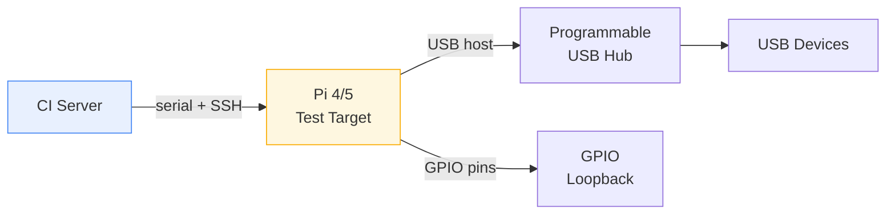
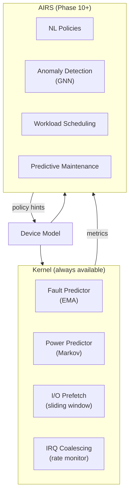
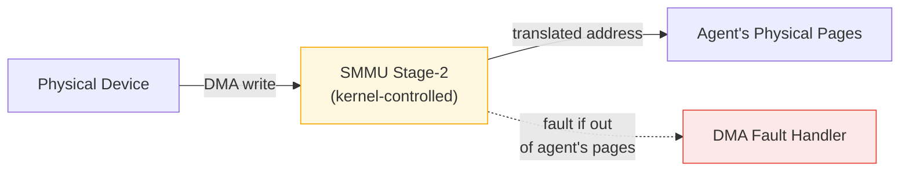

# AIOS Device Model — Testing, Intelligence & Future Directions

Part of: [device-model.md](../device-model.md) — Device Model and Driver Framework
**Related:** [lifecycle.md](./lifecycle.md) — Device lifecycle and driver isolation, [security.md](./security.md) — Security model, [dma.md](./dma.md) — DMA engine

-----

## 15. Testing and Verification

The device model's correctness depends on state machine invariants (no state leaks, no double-bind), driver isolation (MMIO bounds, DMA containment), and lifecycle guarantees (cleanup on removal). Testing addresses each layer: QEMU-based functional tests validate observable behavior, fuzz testing stresses boundary conditions, formal methods prove structural invariants that testing alone cannot cover, and hardware-in-the-loop testing validates real device behavior.

-----

### 15.1 QEMU Test Harness

QEMU's VirtIO MMIO transport provides a deterministic test environment for device model validation. The `-device` flag injects devices into the virtual machine, and UART output parsing validates correct behavior.

**Device injection:**

Each test run specifies a QEMU device configuration via `-device` flags. Configurations range from single device (basic probe) through multiple instances of the same type (multi-bind) to mixed device types (cross-subsystem enumeration). Devices can be added or removed between test runs to exercise different driver binding paths.

**Test categories:**

| Category | What is tested | Acceptance criteria |
|---|---|---|
| Boot enumeration | VirtIO MMIO scan discovers all injected devices | UART logs correct device count and types |
| Driver binding | Driver matches and binds correctly for each VirtIO device type | UART logs `driver bound: virtio-blk` with correct DeviceId |
| Lifecycle transitions | Device progresses through Discovered -> Probed -> Bound -> Active | Each state transition logged with timestamp |
| Error injection | Driver handles non-responsive device (QEMU with broken config) | Timeout error logged, no hang, device stays in Discovered state |
| Multi-device | Multiple instances of same device type bind to separate DeviceNodes | Each device gets unique DeviceId, independent I/O paths verified |

**Test runner integration:**

Device tests run as part of `just test-qemu` (QEMU boot tests). Each test boots the kernel with a specific device configuration, captures UART output for 5 seconds, and matches against expected strings. Tests are non-interactive and CI-compatible.

-----

### 15.2 Fuzz Testing

Fuzz testing targets the boundary between untrusted hardware input and kernel-internal state. A malicious or faulty device can present arbitrary register values, interrupt patterns, and DMA responses.

**Fuzz targets:**

| Target | Attack surface | Technique |
|---|---|---|
| HardwareDescriptor parsing | Invalid bus types, zero-size MMIO regions, overlapping IRQ lines | Structure-aware fuzzing (libFuzzer + custom mutator) |
| Driver match tables | Malformed vendor/product IDs, wildcard overflow | Byte-level mutation of match table entries |
| Virtqueue descriptor chains | Chain loops, out-of-bounds buffer indices, used ring wraparound | Byte-level mutation of virtqueue memory region |
| Malformed DTB entries | Invalid node names, missing properties, truncated blobs | DTB-aware generation with `cargo-fuzz` |
| Invalid MMIO responses | Arbitrary register values from device reads | FuzzTransport replaces MMIO reads with fuzzer-controlled bytes |
| Corrupted virtqueue rings | Flipped bits in available/used ring indices | Bitflip mutation on shared memory region |

**Host-side fuzz harness:**

Fuzz targets are compiled as `#[cfg(fuzzing)]` host-side binaries using `cargo-fuzz`. The harness replaces MMIO reads with fuzzer-controlled byte streams:

```rust
#[cfg(fuzzing)]
fn fuzz_virtio_probe(data: &[u8]) {
    let mut transport = FuzzTransport::new(data);
    let desc = HardwareDescriptor::from_virtio_scan(&transport);
    let _ = driver_registry.find_match(&desc);
    // Verify: no panic, no undefined behavior, descriptor validated or rejected
}
```

**Coverage targets:** all `Bus::enumerate` paths, all `Driver::probe` error paths, all lifecycle state transitions.

> **Cross-reference:** [security/fuzzing.md](../../security/fuzzing.md) §1 (attack surface taxonomy), [security/fuzzing/strategies.md](../../security/fuzzing/strategies.md) §3.5 (driver fuzzing strategies), [security/fuzzing/tooling.md](../../security/fuzzing/tooling.md) §5 (tiered tooling).

-----

### 15.3 Formal Verification

**TLA+ state machine models:**

| Module | Models | Key properties |
|---|---|---|
| `DeviceLifecycle.tla` | Full state machine from [lifecycle.md](./lifecycle.md) §7 | **Safety:** no invalid state combinations. **Liveness:** every Discovered device eventually reaches Removed. **Fairness:** driver crash -> recovery -> rebind terminates. |
| `DriverBinding.tla` | Driver match, probe, attach, detach sequence | **Safety:** at most one driver bound per device. **Liveness:** unmatched devices re-evaluated on new driver registration. |
| `DmaLifecycle.tla` | Buffer allocate, map, transfer, unmap, free | **Safety:** no double-free, no use-after-free. **Liveness:** every buffer eventually freed. |

TLA+ model checking via TLC exhaustively explores all interleavings up to bounded state space (4 devices, 3 drivers, 2 concurrent hotplug events):

```text
\* Safety: no double-bind
DriverBindingSafety == \A d \in Devices :
    Cardinality({dr \in Drivers : bound[dr] = d}) <= 1

\* Liveness: every device eventually removed (under fairness)
DeviceEventualRemoval == \A d \in Devices :
    state[d] = "Discovered" ~> state[d] = "Removed"
```

**Verus proofs for DeviceRegistry invariants:**

| Invariant | What Verus proves | Why it matters |
|---|---|---|
| No duplicate DeviceId | Registry insert rejects duplicate IDs | Duplicate IDs would corrupt the device graph |
| Parent-child consistency | Every child's parent field points to a valid node | Dangling parent references cause use-after-free on removal |
| Generation monotonicity | DeviceId generations never decrease | Decreasing generation would make stale handles appear valid |
| MMIO grant non-overlap | DriverGrant regions for distinct devices have disjoint physical ranges | Overlapping grants let one driver access another device's registers |

**`kani` proofs for DMA buffer lifecycle:**

Bounded model checking via `kani` verifies that all DMA buffer allocation/free paths are paired correctly. The proof explores all interleavings of allocate, map, transfer, unmap, and free operations within a bounded execution of 8 operations and verifies no buffer is double-freed or leaked.

-----

### 15.4 Hardware-in-the-Loop (HIL)

QEMU covers VirtIO devices but cannot exercise real hardware timing, electrical characteristics, or firmware quirks. HIL testing supplements QEMU with physical device testing on Raspberry Pi 4/5 targets.

**Test rack:**



**Test categories:**

| Category | Method | Validates |
|---|---|---|
| USB attach/detach cycling | Programmable USB hub toggles ports | Hotplug lifecycle: bind, operate, unbind, no resource leaks |
| GPIO loopback | Output pins wired to input pins | Platform bus I/O correctness for SoC peripherals |
| Network stress | Sustained iperf3 through real NIC | Driver stability under load, no DMA buffer exhaustion |
| QEMU vs real hardware | Same test suite on both | Timing, interrupt delivery, DMA coherency deltas |

HIL tests run nightly due to hardware availability constraints. Results are reported alongside QEMU CI results.

-----

## 16. AI-Native Device Intelligence

The device model integrates AI at two levels. **Kernel-internal** techniques use lightweight statistical models compiled into the kernel -- they operate on counters, histograms, and simple classifiers with no external dependencies. **AIRS-dependent** techniques require the AI Runtime Service ([airs.md](../../intelligence/airs.md)) and use semantic understanding or graph neural networks too complex for kernel-internal execution.

The boundary is strict: kernel-internal techniques function identically whether AIRS is running or not. They are always-on, low-overhead, and deterministic. AIRS-dependent techniques are opportunistic enhancements.

-----

### 16.1 Kernel-Internal Statistical Models

These run as frozen decision trees, EMA filters, and simple state machines in kernel space. No AIRS dependency.

**Fault prediction:**

An exponential moving average of error rates per device detects impending failure. The predictor tracks timeout count, data CRC failures, and interrupt storm frequency:

```rust
/// Per-device fault prediction using exponential moving average.
pub struct DeviceFaultPredictor {
    /// EMA of error rate, decayed with alpha = 0.1.
    error_ema: f32,
    /// Tick of the last recorded error.
    last_error_tick: u64,
    /// Cumulative error count since device bind.
    error_count: u32,
    /// Device-class-specific threshold for pre-emptive action.
    threshold: f32,
}
```

When EMA crosses threshold, the kernel takes pre-emptive action: driver restart or device isolation. Action thresholds follow the health score model defined in [lifecycle.md](./lifecycle.md) §7.3 -- scores below 0.5 trigger user notification, below 0.2 trigger device degradation.

**Power prediction:**

A Markov chain with 3 states (Active, Idle, Sleep) tracks transition probabilities updated from usage patterns. Given the current state, the predictor estimates the time until next access and selects the lowest-power D-state whose wake latency is less than the predicted idle period. This saves approximately 15-30% device power by avoiding wake latency penalties.

```text
predicted_idle = predict_next_use(device, current_state)
if predicted_idle > D3_ENTRY_COST + D3_EXIT_COST:
    transition to D3 (deep sleep)
elif predicted_idle > D2_ENTRY_COST + D2_EXIT_COST:
    transition to D2 (light sleep)
else:
    remain in D0 (active)
```

> **Cross-reference:** [lifecycle.md](./lifecycle.md) §7.5 (device power states and D-state transition constraints).

**I/O prefetch hints:**

A per-device sliding window tracks the last 8 access addresses and classifies the pattern as sequential (monotonically increasing with constant stride), strided (constant non-unit stride), or random. For block devices with sequential patterns, the prefetch engine issues speculative reads for the next 4-16 blocks at the detected stride. For network devices, burst pattern tracking drives buffer pre-allocation. Cache miss resets the classifier.

**Interrupt coalescing tuning:**

A per-device interrupt rate monitor dynamically adjusts coalescing parameters. When the interrupt rate exceeds a high-water mark, the coalescing timeout increases to batch more interrupts per notification. When the rate drops below a low-water mark, the timeout decreases for lower latency. A hysteresis band between the marks prevents oscillation:

```rust
/// Adaptive interrupt coalescing parameters.
pub struct AdaptiveCoalescing {
    /// Current coalescing timeout in microseconds.
    current_timeout_us: u32,
    /// Interrupt rate (interrupts per second), measured over last 100ms window.
    measured_rate: u32,
    /// High-water mark: increase timeout when rate exceeds this.
    high_water: u32,       // default: 10_000 IRQ/s
    /// Low-water mark: decrease timeout when rate drops below this.
    low_water: u32,        // default: 1_000 IRQ/s
}
```

-----

### 16.2 AIRS-Dependent Intelligence

These require the AIRS runtime ([airs.md](../../intelligence/airs.md)) and use agent-level context. They are unavailable before AIRS initialization and degrade gracefully to kernel-internal defaults when AIRS is not running.

**Natural language device policies:**

Users express device access policies in natural language: "Keep the GPU in low-power mode unless a game is running." AIRS translates the intent into a `StructuredPolicy` object that the kernel's capability system enforces. The kernel never interprets natural language -- it receives typed policy structures and installs them as capability constraints.

| Natural language | Structured policy |
|---|---|
| "Never let background apps use the microphone" | `Deny(AudioCapture, when: !agent.foreground)` |
| "Keep the GPU in low-power mode unless a game is running" | `Constrain(GpuPower, D2, unless: agent.class == Game)` |
| "Disable USB storage after 10 PM" | `Deny(StorageAccess, when: time.hour >= 22 AND device.bus == USB)` |

> **Cross-reference:** [security/model/capabilities.md](../../security/model/capabilities.md) §3 (capability attenuation for policy enforcement).

**Cross-subsystem anomaly detection:**

A GNN-based model correlates device behavior across subsystems. The kernel exports device session open/close events to AIRS via a DataChannel ([subsystem-framework.md](../../platform/subsystem-framework.md) §6). AIRS maintains a heterogeneous graph where nodes are agents and devices, edges are active sessions weighted by access frequency. Periodic inference (every 60 seconds) computes per-agent anomaly scores. Example: an agent that normally accesses only storage suddenly begins accessing the microphone and network -- a pattern consistent with data exfiltration that individual capability checks would not catch.

**Workload-aware device scheduling:**

AIRS observes application intent (e.g., "user is video editing") and adjusts device priorities: GPU gets higher DMA bandwidth, storage gets prefetch hints for timeline scrubbing, audio device gets RT priority boost. Context signals include calendar events, application state, and user intent. Unlike the kernel-internal power predictor (§16.1) which uses simple usage histograms, AIRS can incorporate semantic context to pre-warm devices before they are needed.

**Predictive maintenance:**

AIRS maintains per-device health models using historical data from the audit space (`system/audit/`). It predicts device degradation (storage write endurance, battery cycle count, thermal cycling fatigue) and surfaces recommendations through the attention system ([attention.md](../../intelligence/attention.md)).

**Adaptive driver configuration:**

AIRS analyzes workload patterns over days and weeks and adjusts driver parameters: virtqueue sizes, interrupt coalescing windows, DMA buffer pool sizes, prefetch depth. Parameters are saved to device profiles in `system/devices/` space and restored on next boot. This extends the kernel-internal adaptive coalescing (§16.1) with longer time horizons and cross-device optimization.

-----

### 16.3 Integration Architecture



The kernel-internal models export their metrics (error rates, power state transitions, I/O patterns, interrupt rates) to AIRS via a low-overhead DataChannel. AIRS returns policy hints (target D-states, coalescing parameters, prefetch depth adjustments) that the device model applies. If AIRS stops sending hints, the kernel-internal models continue operating independently with their own defaults.

-----

## 19. Future Directions

This section describes device model extensions that build on the foundations described in sections 3 through 16.

-----

### 19.1 PCI/PCIe Support

Full PCI Express support extends the device model beyond VirtIO MMIO to the dominant hardware interconnect on desktop and server platforms.

- **ECAM enumeration:** Configuration space scanning via Enhanced Configuration Access Mechanism. Bus/device/function enumeration, BAR size detection, base address programming from platform PCI MMIO window.
- **MSI/MSI-X:** Read capability structure, allocate GICv3 SPIs per vector via the ITS (Interrupt Translation Service), program MSI-X table entries for per-queue interrupt steering.
- **PCIe hot-plug:** Attention Button and Power Controller for slot-level hot-plug. Integrates with the device lifecycle state machine ([lifecycle.md](./lifecycle.md) §7) for add/remove transitions.
- **SR-IOV:** Single physical function (PF) presents multiple virtual functions (VFs), each with independent `HardwareDescriptor`, `DriverGrant`, and IOMMU context. Enables direct VF assignment to isolated agents.

> **Cross-reference:** [discovery.md](./discovery.md) §5.5 (PCI bus enumeration), [security.md](./security.md) §13 (IOMMU integration).

-----

### 19.2 Device Passthrough

ARM SMMU stage-2 translation enables direct device assignment to userspace drivers, bypassing the kernel data path entirely for near-native I/O performance.



The kernel configures stage-2 to restrict DMA to the agent's physical memory pages. The agent manages stage-1 tables directly. Use cases: GPU compute agents, high-performance network agents. The SMMU enforces isolation even though the kernel is not in the data path -- a compromised agent cannot DMA to arbitrary memory.

> **Cross-reference:** [dma.md](./dma.md) §11 (DMA engine and IOMMU integration).

-----

### 19.3 Remote Devices

Network-attached devices extend the device model beyond locally connected hardware. A `DeviceProxy` presents a remote device as if it were local, implementing the same `Driver` trait as local drivers. From the subsystem framework's perspective, a remote device is indistinguishable from a local one -- it has a `DeviceNode` in the registry, supports sessions, and exposes properties.

- **Protocol:** IPC-over-network for control, DataChannels for bulk transfer, via the ANM Mesh Protocol
- **Capability tokens:** Device capability tokens that span machine boundaries, authenticated via the mesh protocol's Noise IK channel
- **Use case:** AI model inference on a remote GPU, presented as a local device to the requesting agent
- **Latency tracking:** Kernel-internal statistics track RTT per remote device; the subsystem framework reports latency as a quality-of-service property

> **Cross-reference:** [networking/protocols.md](../../platform/networking/protocols.md) §5.1 (ANM Mesh Protocol).

-----

### 19.4 Disaggregated Storage

NVMe over Fabrics (NVMe-oF) presents remote block devices as local NVMe namespaces. Integration with the Block Engine ([spaces/block-engine.md](../../storage/spaces/block-engine.md)) is transparent to upper layers -- the storage subsystem sees a block device and does not distinguish local from remote. Connection management runs through the NTM ([networking/components.md](../../platform/networking/components.md) §3.2).

-----

### 19.5 CXL Memory Expanders

CXL Type 3 devices provide memory expansion beyond locally attached DRAM. The device model represents each CXL memory expander as a `DeviceNode` with a `MemoryExpander` device class. Device-attached memory is registered as an additional pool with the buddy allocator ([memory/physical.md](../memory/physical.md) §2.2), with distinct latency and bandwidth characteristics that the memory subsystem uses for NUMA-aware placement decisions.

-----

### 19.6 Confidential Computing

ARM Confidential Compute Architecture (CCA) introduces realm-isolated execution environments. The device model extensions for CCA include:

- **Device attestation:** Before driver binding, the device model verifies the device's attestation report against a known-good measurement. Unattested devices are restricted to `Untrusted` level ([lifecycle.md](./lifecycle.md) §9.5).
- **Encrypted DMA:** DMA paths for realm-isolated agents use memory encryption. The SMMU is configured to enforce realm boundary checks on all DMA transactions.
- **Realm device assignment:** A subset of devices can be assigned to a specific realm, invisible to the normal world. The `DeviceRegistry` maintains per-realm device views.

> **Cross-reference:** [security/model/hardening.md](../../security/model/hardening.md) §5 (ARM hardware security features).

-----

## References

- Atmosphere: A Verified Microkernel in Rust. SOSP 2025 Best Paper. [ACM DL](https://dl.acm.org/doi/10.1145/3731569.3764821)
- LionsOS / sDDF. arXiv:2501.06234, Jan 2025. [arXiv](https://arxiv.org/abs/2501.06234)
- Asterinas Framekernel. USENIX ATC 2025. [asterinas.github.io](https://asterinas.github.io/)
- Fuchsia Driver Framework v2. [fuchsia.dev](https://fuchsia.dev/fuchsia-src/concepts/drivers/driver_framework)
- Theseus OS. OSDI 2020. [USENIX](https://www.usenix.org/conference/osdi20/presentation/boos)
- VirtIO OASIS Specification v1.2. [oasis-open.org](https://docs.oasis-open.org/virtio/virtio/v1.2/virtio-v1.2.html)
- tock-registers. [crates.io](https://crates.io/crates/tock-registers)
- DNAFuzz: USB Descriptor-Aware Fuzzing. IEEE 2024. [IEEE Xplore](https://ieeexplore.ieee.org/document/11334375/)
