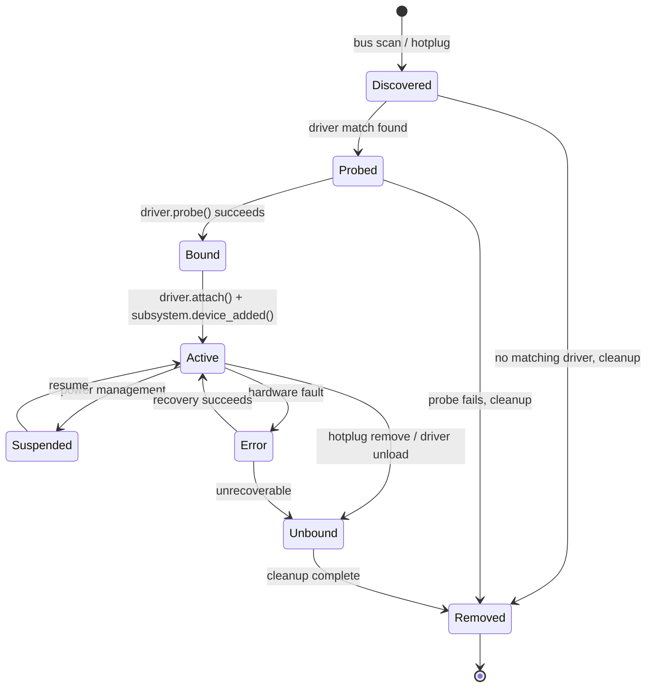
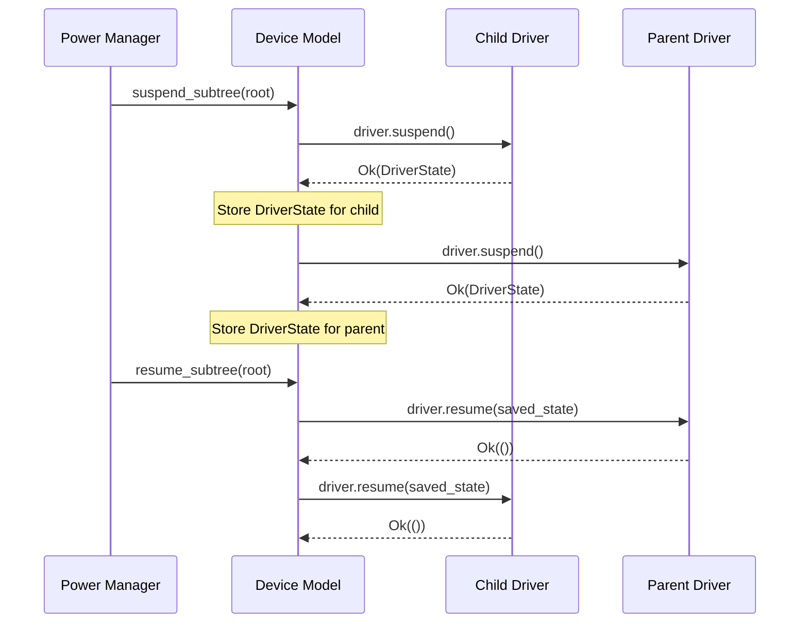
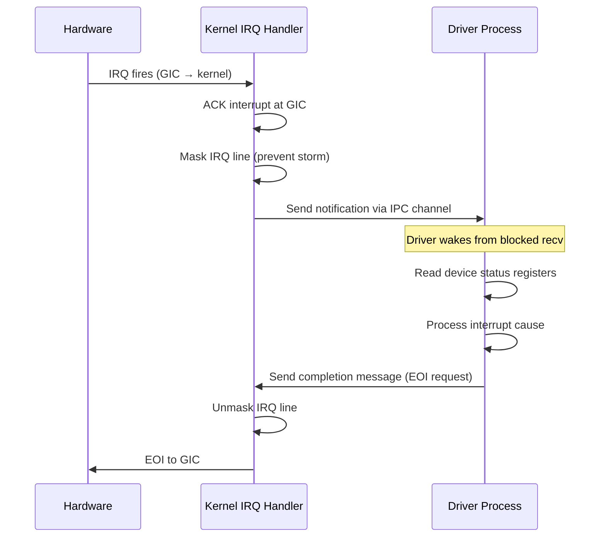
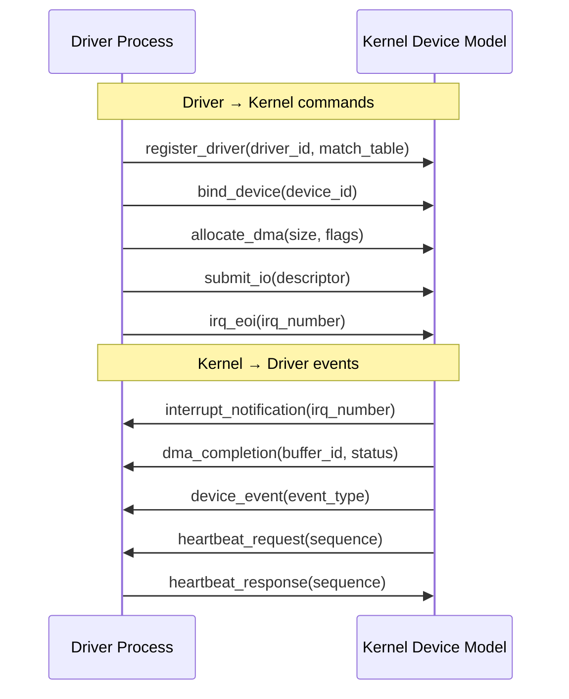
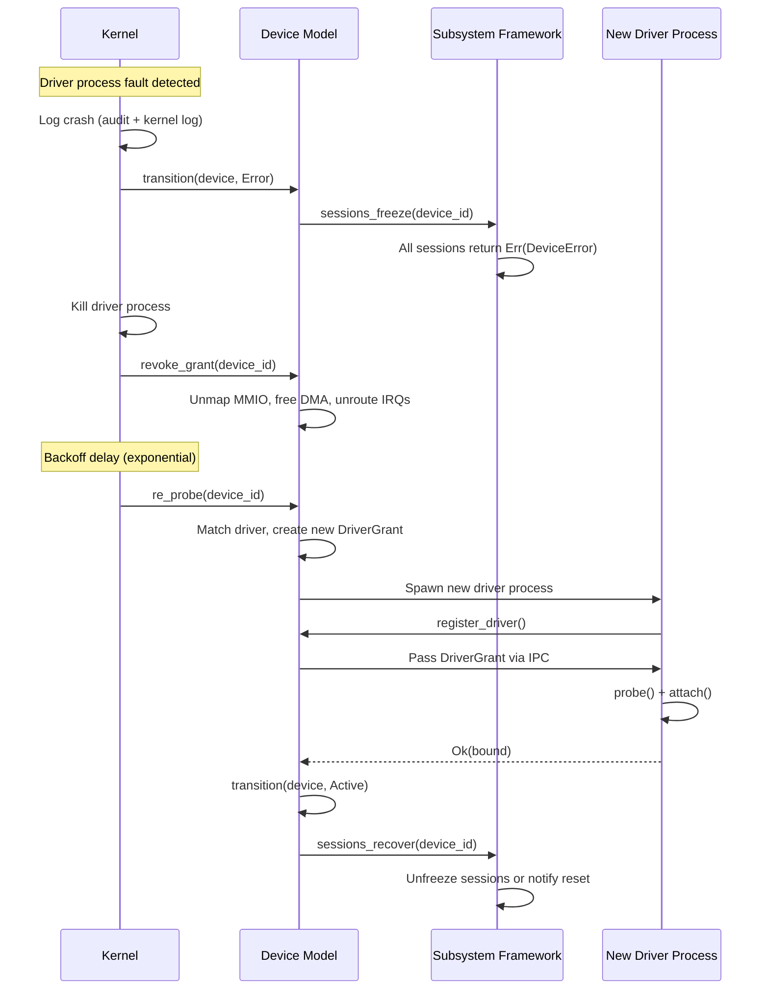

# AIOS Device Lifecycle and Driver Interface

Part of: [device-model.md](../device-model.md) — Device Model and Driver Framework
**Related:** [discovery.md](./discovery.md) — Bus abstraction and driver binding, [security.md](./security.md) — Capability-gated device access and hot-swap

-----

## 7. Device Lifecycle

Every device in the AIOS device model follows a single, deterministic state machine. The lifecycle governs what operations are legal at each point, what invariants must hold across transitions, and how errors and power management interact with device state. This section defines the canonical lifecycle, the rules for every transition, and the recovery mechanisms when things go wrong.

### 7.1 State Machine



This expands the simpler state machine in [subsystem-framework.md](../../platform/subsystem-framework.md) §20.1, which defines only `Available`, `InUse`, `Suspended`, and `Error`. The device model's lifecycle adds `Discovered`, `Probed`, `Bound`, and `Unbound` to capture the full driver binding protocol, and separates `Removed` as a terminal cleanup state.

**State summary:**

| State | Description | Sessions allowed | Driver bound |
|---|---|---|---|
| Discovered | Bus reported device existence; no driver matched yet | No | No |
| Probed | Driver matched; `probe()` is running or has returned | No | Partially |
| Bound | `probe()` succeeded; driver has claimed the device | No | Yes |
| Active | `attach()` complete; device is fully operational | Yes | Yes |
| Suspended | Device in low-power state; sessions paused | Paused | Yes |
| Unbound | Driver detaching; sessions force-closed | No | Detaching |
| Removed | Device cleaned up; DeviceNode will be freed | No | No |
| Error | Hardware fault or driver crash detected | Frozen | Depends |

### 7.2 State Transition Rules

Each transition has preconditions that **must** hold and postconditions that the transition **guarantees**. Violating a precondition is a kernel bug; the device model panics rather than permit an illegal transition.

#### Discovered --> Probed

- **Precondition:** A `Bus` implementation has called `device_registry.register()` with a valid `HardwareDescriptor`. The driver match table has returned a compatible `Driver`.
- **Postcondition:** The `DeviceNode.driver` field points to the matched driver. `DeviceNode.state` is `Probed`.
- **Invariant:** No MMIO regions are mapped yet. The driver has not touched the hardware.

#### Probed --> Bound

- **Precondition:** `driver.probe(&descriptor)` returned `Ok(())`. The driver has validated that it can operate this specific device (checked vendor/product IDs, firmware version, feature bits).
- **Postcondition:** A `DriverGrant` has been allocated (see [section 8.2](#82-drivergrant-capability)) but not yet activated. The driver is logically associated with the device.
- **Invariant:** No sessions exist. No interrupts are routed. DMA is not configured.

#### Bound --> Active

- **Precondition:** `driver.attach()` has returned `Ok(())`. The subsystem framework's `device_added()` callback has been invoked (see [subsystem-framework.md](../../platform/subsystem-framework.md) §10). The `DriverGrant` MMIO regions are mapped. IRQ lines are routed.
- **Postcondition:** The device is fully operational. Sessions may be opened. The `DeviceRegistry` space entry is marked `available`.
- **Invariant:** All resources in the `DriverGrant` are active. The device appears in `system/devices/`.

#### Active --> Suspended

- **Precondition:** Power manager has requested suspension (see [section 7.4](#74-suspendresume)). All active sessions have been notified and have either acknowledged suspension or timed out.
- **Postcondition:** `driver.suspend()` has returned a serializable `DriverState`. MMIO regions remain mapped but are not accessed. IRQ delivery is masked. DMA transfers are drained.
- **Invariant:** The `DriverState` is sufficient to restore the device on resume. No I/O is in flight.

#### Suspended --> Active

- **Precondition:** Power manager has requested resume. Parent device (if any) is already Active.
- **Postcondition:** `driver.resume(saved_state)` has restored the device. IRQ delivery is unmasked. Sessions are unpaused. DMA is re-enabled.
- **Invariant:** Device behavior is indistinguishable from pre-suspend state.

#### Active --> Unbound

- **Precondition:** Hotplug removal detected, or driver unload requested, or unrecoverable error escalation from Error state.
- **Postcondition:** All sessions are force-closed (subsystem framework `device_removed()` called). `driver.detach()` has run. `DriverGrant` is revoked. IRQ lines are unrouted. DMA buffers are freed.
- **Invariant:** No references to the driver remain in the device model. No sessions reference this device.

#### Active --> Error

- **Precondition:** A `DeviceError` has been detected (hardware fault, driver timeout, DMA fault, protocol violation).
- **Postcondition:** Sessions are frozen (reads/writes return `Err(DeviceError)`). An audit event is logged. The recovery protocol is initiated (see [section 7.3](#73-error-states-and-recovery)).
- **Invariant:** The device is not destroyed. Recovery may restore it to Active.

#### Error --> Active

- **Precondition:** Recovery protocol succeeded. `driver.recover()` returned `Ok(())`. Device passed a health check.
- **Postcondition:** Sessions are unfrozen. Normal operation resumes.
- **Invariant:** Any in-flight I/O at the time of the fault has been explicitly failed to callers.

#### Error --> Unbound

- **Precondition:** Recovery protocol failed, or maximum retry count exceeded.
- **Postcondition:** Same as Active --> Unbound. The device is marked permanently failed in the registry.
- **Invariant:** An audit event records the unrecoverable failure.

#### Unbound --> Removed

- **Precondition:** `driver.detach()` has completed. All grant resources are freed. The `DeviceNode` has no outstanding references.
- **Postcondition:** The `DeviceNode` is removed from the `DeviceRegistry`. The `DeviceId` generation is incremented (preventing stale handle use).
- **Invariant:** The `DeviceId` value will never be reused with the same generation.

#### Discovered --> Removed / Probed --> Removed

- **Precondition:** No matching driver was found (Discovered), or `probe()` returned `Err` (Probed).
- **Postcondition:** Any partially allocated resources are freed. The `DeviceNode` is removed from the registry.
- **Invariant:** No side effects remain from the failed discovery/probe attempt.

### 7.3 Error States and Recovery

Device errors are classified by cause and severity. Each error type has a defined recovery strategy.

```rust
#[derive(Debug, Clone, Copy, PartialEq, Eq)]
pub enum DeviceError {
    /// Hardware reported an error (e.g., VirtIO DEVICE_NEEDS_RESET)
    HardwareFault,

    /// Driver did not respond within the expected time
    TimeoutExpired,

    /// Driver process crashed or was killed (userspace drivers only)
    DriverCrash,

    /// DMA transfer failed (IOMMU fault, buffer overrun)
    DmaFault,

    /// Driver violated the device protocol (e.g., invalid register write sequence)
    ProtocolViolation,
}
```

**Recovery strategy per error type:**

| Error | Severity | Recovery Strategy | Max Retries |
|---|---|---|---|
| `HardwareFault` | High | Reset device via bus-specific mechanism, re-probe | 3 |
| `TimeoutExpired` | Medium | Cancel pending I/O, restart driver, re-attach | 5 |
| `DriverCrash` | High | Kill driver process, re-probe device, restart driver (see [section 9.3](#93-crash-recovery-protocol)) | 3 |
| `DmaFault` | Critical | Revoke DMA grant, reset IOMMU mappings, re-attach | 2 |
| `ProtocolViolation` | Medium | Log violation details, restart driver with fresh state | 3 |

Recovery uses exponential backoff: 1s, 2s, 4s, 8s between retries. After max retries, the device transitions to Unbound and is marked permanently failed. A kernel log message and audit event record the failure, including the error type, retry count, and device identity.

Cross-reference: [section 9.3](#93-crash-recovery-protocol) defines the full crash recovery sequence diagram for userspace driver crashes.

### 7.4 Suspend/Resume

AIOS implements per-device power management with ordered suspend and resume. The power manager walks the device graph to determine ordering, and each driver serializes its device state for restoration.

**Suspend order:** Children before parent. The device graph is walked leaf-to-root. A USB keyboard suspends before its parent USB hub, which suspends before the xHCI controller.

**Resume order:** Parent before children. The device graph is walked root-to-leaf. The xHCI controller resumes first, then the USB hub, then the keyboard.



The `DriverState` returned by `suspend()` is an opaque serializable blob. The driver owns its format; the device model stores it without interpretation. On resume, the same blob is passed back to `resume()`. If a driver fails to suspend (returns `Err`), the power manager aborts the suspend for that subtree and logs the failure.

Cross-reference: [boot/suspend.md](../boot/suspend.md) §15 defines system-wide suspend/resume orchestration. [power-management.md](../../platform/power-management.md) defines the policy layer that decides when to suspend.

### 7.5 Device Power States

Each device tracks its current power state independently. The power manager may request transitions based on inactivity, thermal pressure, or user policy.

| State | Name | Wake Latency | Power Draw | Capabilities |
|---|---|---|---|---|
| D0 | Active | 0 | Full | Fully operational; I/O in flight |
| D1 | Light Sleep | < 1 ms | Reduced (~50%) | Context preserved; fast wake; no new I/O |
| D2 | Deep Sleep | < 10 ms | Minimal (~10%) | Partial context preserved; re-init on wake |
| D3 | Off | 50-500 ms | Zero (or leakage) | No context; full re-probe on wake |

**Transition constraints:**

- D0 --> D1: All pending I/O must be drained. Driver saves lightweight context (register snapshot).
- D0 --> D2: All sessions must be paused. Driver saves full context.
- D0 --> D3: All sessions must be closed. Driver performs full detach. Re-entering D0 from D3 requires a full probe/bind/attach cycle.
- D1 --> D0: Driver restores registers from snapshot. Latency target: < 1 ms.
- D2 --> D0: Driver re-initializes hardware from saved context. Latency target: < 10 ms.
- D3 --> D0: Equivalent to a fresh device discovery. The device graph node is preserved but the driver is re-probed.
- Skipping states is allowed: D0 --> D3 is valid (combines pause + close + detach).
- Reverse skipping is not allowed: D3 --> D1 must go through D0 first.

The power manager selects target D-states based on inactivity timers, thermal budget, and battery level. Per-device policies can override the default: a USB keyboard might stay at D1 (fast wake for keypress) while a GPU drops to D3 when no display is active.

-----

## 8. Kernel-to-Userspace Driver Interface

### 8.1 In-Kernel vs Userspace Drivers

AIOS supports two driver execution models through the same `Driver` trait:

- **Phase 0-4: In-kernel drivers.** All drivers run in kernel address space (EL1). They access MMIO regions directly via `read_volatile`/`write_volatile`. Interrupt handlers run in kernel context. DMA buffers are allocated from the kernel DMA pool. This is simpler and has zero IPC overhead, but a driver bug can corrupt kernel memory.

- **Phase 5+: Userspace drivers.** Drivers run as isolated processes in their own address spaces (EL0). They access hardware through a `DriverGrant` capability that the kernel mediates. Interrupts are forwarded as IPC notifications. DMA buffers are shared through the kernel's mapping infrastructure. A driver crash is contained to its own address space.

The `Driver` trait is identical in both models. The difference is in how `probe()`, `attach()`, and `detach()` are invoked:

| Aspect | In-Kernel | Userspace |
|---|---|---|
| Address space | Kernel (TTBR1) | Own process (TTBR0) |
| MMIO access | Direct `volatile` read/write | Via mapped `DriverGrant` regions |
| Interrupt handling | Kernel ISR calls driver directly | Kernel ACKs IRQ, sends IPC notification |
| DMA | Kernel allocates from DMA pool | Kernel maps DMA pages into driver space |
| Crash impact | Kernel panic / data corruption | Driver process killed; device recoverable |
| IPC overhead | None (function call) | Channel send/recv per operation |

### 8.2 DriverGrant Capability

When the device model binds a driver to a device, it constructs a `DriverGrant` that precisely specifies what hardware resources the driver may access. The grant is a capability token: possessing it authorizes access; revoking it terminates access.

```rust
pub struct DriverGrant {
    /// Which device this grant authorizes access to
    pub device_id: DeviceId,

    /// MMIO regions mapped into the driver's address space
    pub mmio_regions: [Option<MmioGrant>; MAX_MMIO_REGIONS],

    /// Interrupt lines with notification channels
    pub irq_lines: [Option<IrqGrant>; MAX_IRQ_LINES],

    /// DMA buffer allocation rights (None = no DMA access)
    pub dma_pool: Option<DmaGrant>,

    /// Trust level determines what operations are permitted
    pub trust_level: DriverTrustLevel,
}

pub struct MmioGrant {
    /// Physical base address of the MMIO region
    pub phys_base: PhysAddr,

    /// Size of the region in bytes
    pub size: usize,

    /// Virtual address where the region is mapped in driver space
    pub virt_base: VirtAddr,

    /// Access permissions for this region
    pub permissions: MmioPerms,
}

#[derive(Debug, Clone, Copy)]
pub enum MmioPerms {
    ReadOnly,
    WriteOnly,
    ReadWrite,
}

pub struct IrqGrant {
    /// Hardware interrupt number (SPI/PPI ID)
    pub irq_number: u32,

    /// IPC channel for kernel-to-driver interrupt notification
    pub notification_channel: ChannelId,
}

pub struct DmaGrant {
    /// Maximum number of DMA pages this driver may allocate
    pub max_pages: usize,

    /// Pool from which DMA pages are allocated
    pub pool: Pool,

    /// Whether scatter-gather is permitted
    pub scatter_gather: bool,
}
```

The `DriverGrant` is constructed by the device model during the Probed --> Bound transition and activated during Bound --> Active. It is revoked during Unbound --> Removed: MMIO mappings are torn down, IRQ channels are destroyed, and DMA pages are reclaimed.

Cross-reference: [security.md](./security.md) §13 defines the capability enforcement rules. [memory/physical.md](../memory/physical.md) §2.4 defines the DMA page pool.

### 8.3 Interrupt Forwarding

For userspace drivers, the kernel cannot call the driver's interrupt handler directly (it runs in a different address space and privilege level). Instead, the kernel acts as a relay:



**Key design decisions:**

1. **Kernel ACKs immediately.** The kernel acknowledges the interrupt at the GIC before notifying the driver. This prevents IRQ storms if the driver is slow to respond. The IRQ line is masked until the driver sends its completion message.

2. **IPC notification channel.** Each `IrqGrant` includes a dedicated `ChannelId`. The kernel sends a lightweight notification (no payload beyond the IRQ number) through this channel. The driver blocks on `ipc_recv()` waiting for notifications.

3. **Interrupt coalescing.** For high-frequency interrupts (e.g., network packet arrival at line rate), the kernel coalesces multiple interrupts into a single notification. The coalescing window is configurable per IRQ line:

```rust
pub struct IrqCoalescing {
    /// Maximum number of interrupts to batch before notification
    pub max_batch: u32,

    /// Maximum time to delay notification (microseconds)
    pub max_delay_us: u32,
}
```

The default is `max_batch = 1, max_delay_us = 0` (no coalescing). Network and storage drivers typically set `max_batch = 16, max_delay_us = 50`.

4. **In-kernel fast path.** For in-kernel drivers (Phase 0-4), interrupt forwarding is a direct function call with zero IPC overhead. The same `IrqGrant` structure exists, but the `notification_channel` is unused; the kernel calls the driver's handler function pointer directly.

### 8.4 DMA Buffer Sharing

DMA buffers must be physically contiguous (for devices without scatter-gather support) and accessible to both the kernel and the driver. The kernel mediates all DMA allocation to enforce isolation.

**Allocation flow:**

1. Driver sends `allocate_dma(size, flags)` request to kernel via IPC.
2. Kernel allocates physically contiguous pages from the DMA pool ([memory/physical.md](../memory/physical.md) §2.4).
3. Kernel maps the pages into both the kernel's direct map and the driver's address space.
4. If an IOMMU is present, kernel programs the IOMMU to allow only this device to DMA to/from these pages.
5. Kernel returns the virtual address (in driver space) and physical address (for programming device DMA registers) to the driver.

**Isolation guarantees:**

- The driver cannot access DMA memory outside its `DmaGrant`. Attempting to map pages beyond `max_pages` fails.
- The IOMMU (when available) restricts the device itself to only the granted physical regions. A buggy device cannot DMA to arbitrary memory.
- DMA buffers are zeroed before being returned to the pool on free. No data leaks between drivers.

Cross-reference: [dma.md](./dma.md) §11 defines the DMA engine internals, including scatter-gather descriptor rings, cache coherency protocol, and IOMMU programming.

### 8.5 IPC Protocol

Userspace drivers communicate with the kernel through a structured IPC protocol built on AIOS IPC channels ([ipc.md](../ipc.md)).



The protocol uses two logical rings per driver:

- **Command ring (driver --> kernel):** The driver submits commands by writing to a shared memory ring buffer and signaling the kernel via IPC. Commands include `register_driver`, `bind_device`, `allocate_dma`, `submit_io`, and `irq_eoi`.

- **Completion ring (kernel --> driver):** The kernel writes completion entries to a shared memory ring buffer and sends an IPC notification to wake the driver. Completions include `interrupt_notification`, `dma_completion`, `device_event`, and `heartbeat_request`.

Both rings are backed by shared memory regions ([ipc/shmem](../ipc.md)) mapped with the appropriate permissions: the command ring is writable by the driver and readable by the kernel; the completion ring is writable by the kernel and readable by the driver.

### 8.6 Driver Process Lifecycle

Userspace drivers are managed as regular AIOS processes with additional supervision.

**Spawn:** When a device transitions from Discovered to Probed and the matched driver is a userspace driver, the kernel spawns a new process for it. The process receives its `DriverGrant` as the first message on a bootstrap IPC channel. The driver reads the grant, maps its MMIO regions, and calls `register_driver` to announce readiness.

**Steady state:** The driver process runs in its own address space, handling interrupts via IPC, performing I/O through DMA, and serving the subsystem framework's requests.

**Crash detection:** The kernel monitors each userspace driver through two mechanisms:

1. **Process exit:** If the driver process exits (crash, signal, or voluntary), the kernel detects this through the process lifecycle system ([service/mod.rs](../../kernel/src/service/mod.rs)).
2. **Watchdog:** The kernel sends heartbeat requests and expects responses (see [section 9.4](#94-watchdog-and-heartbeat)).

**Restart:** When a crash is detected, the kernel:
1. Forces the device to Error state.
2. Runs the crash recovery protocol (see [section 9.3](#93-crash-recovery-protocol)).
3. Spawns a new driver process.
4. Passes a fresh `DriverGrant` to the new process.

**Session continuity:** The subsystem framework attempts to re-create sessions transparently after driver restart. If the subsystem supports stateless sessions (e.g., block device reads), clients see a transient error followed by normal operation. If sessions are stateful (e.g., audio playback), clients receive a session-reset notification and must re-establish state.

-----

## 9. Driver Isolation and Crash Recovery

### 9.1 Fault Domains

Each userspace driver runs in its own fault domain, defined by three isolation boundaries:

1. **Address space isolation.** Each driver process has its own TTBR0 page tables. A memory fault (null pointer dereference, buffer overflow, use-after-free) in the driver triggers a page fault in the driver's address space. The kernel catches this via the exception handler and kills only the faulting process. Other drivers and the kernel are unaffected.

2. **MMIO isolation.** The `DriverGrant` maps only the specific MMIO regions that the device requires. A driver cannot read or write registers belonging to other devices. Attempting to access an unmapped address triggers a page fault, caught by the kernel.

3. **DMA isolation.** When an IOMMU is present, the kernel programs it so that each device can only DMA to/from the physical pages allocated through its `DmaGrant`. A buggy or malicious device cannot overwrite kernel memory or another driver's buffers. On platforms without an IOMMU (e.g., early QEMU configurations), DMA isolation relies on software checks and the trust level system (see [section 9.5](#95-progressive-trust)).

### 9.2 Asterinas Framekernel Pattern

AIOS adopts the Asterinas framekernel pattern for its driver trust boundary (see [subsystem-framework.md](../../platform/subsystem-framework.md) §20.3):

- **Framework core (kernel):** The device model, interrupt forwarding, DMA engine, and capability gate run in kernel space. This code uses `unsafe` for MMIO access, page table manipulation, and GIC register writes. It is the minimal trusted computing base for device I/O.

- **Driver code (safe Rust):** Drivers interact with hardware exclusively through the `Transport` trait abstraction. The transport provides safe methods for register access (`read_reg`, `write_reg`), interrupt subscription (`subscribe_irq`), and DMA operations (`alloc_dma`, `submit_dma`). All safety invariants are enforced by the transport implementation in the kernel.

This separation means that adding a new driver does not increase the amount of `unsafe` code in the system. A driver bug can crash the driver process but cannot corrupt kernel data structures, violate W^X, or access another device's registers.

Cross-reference: [subsystem-framework.md](../../platform/subsystem-framework.md) §20.3 describes the framekernel pattern in the context of subsystem sessions. [security/model/layers.md](../../security/model/layers.md) §2 describes this as Layer 3 (Driver Isolation) in the eight-layer security model.

### 9.3 Crash Recovery Protocol

When a userspace driver crashes, the kernel orchestrates a recovery sequence that aims to restore the device to operational state without requiring a system reboot.



**Backoff schedule:** Retries use exponential backoff with jitter to avoid thundering herd on multi-device failures:

| Retry | Base Delay | Max Jitter |
|---|---|---|
| 1 | 1 second | 250 ms |
| 2 | 2 seconds | 500 ms |
| 3 | 4 seconds | 1 second |
| 4 | 8 seconds | 2 seconds |
| 5+ | 16 seconds | 4 seconds |

**After max retries** (default: 3 for `DriverCrash`, configurable per driver):

1. The device is transitioned to Unbound --> Removed.
2. An audit event with severity `Critical` is recorded.
3. The subsystem framework closes all sessions permanently.
4. The `DeviceRegistry` marks the device as `PermanentlyFailed`.
5. If an AIRS model is available, it logs the failure pattern for future anomaly detection (see [intelligence.md](./intelligence.md) §16).

### 9.4 Watchdog and Heartbeat

The kernel monitors driver liveness through a heartbeat protocol. This catches hung drivers that have not crashed (e.g., infinite loops, deadlocks) in addition to process-level crash detection.

**Protocol:**

1. The kernel sends a `heartbeat_request(sequence_number)` message to the driver's IPC channel every **5 seconds**.
2. The driver must respond with `heartbeat_response(sequence_number)` within **1 second**.
3. If the driver misses **3 consecutive heartbeats**, the kernel assumes the driver is hung and initiates crash recovery.

```rust
pub struct WatchdogConfig {
    /// Interval between heartbeat requests
    pub heartbeat_interval_ms: u64,    // default: 5000

    /// Maximum time to wait for a heartbeat response
    pub response_timeout_ms: u64,      // default: 1000

    /// Number of missed heartbeats before forced recovery
    pub max_missed: u32,               // default: 3
}
```

**Watchdog exceptions:**

- During `probe()` and `attach()`, the heartbeat timer is paused. Some drivers take several seconds to initialize hardware (e.g., WiFi firmware upload).
- During suspend (D1/D2/D3), heartbeats are suspended. The driver is not expected to respond while the device is in a low-power state.
- In-kernel drivers (Phase 0-4) do not use the heartbeat protocol; hangs are detected through kernel watchdog mechanisms (timer-based stack trace dump).

### 9.5 Progressive Trust

New or unknown drivers start with restricted capabilities. As a driver demonstrates reliability, its trust level is upgraded, granting access to more powerful hardware features.

```rust
#[derive(Debug, Clone, Copy, PartialEq, Eq, PartialOrd, Ord)]
pub enum DriverTrustLevel {
    /// New/unknown driver: read-only MMIO, no DMA, no IRQ coalescing
    Untrusted,

    /// After 100 successful operations without fault: read-write MMIO, limited DMA
    Limited,

    /// After 10000 operations without fault: full DMA, scatter-gather, IRQ coalescing
    Trusted,

    /// In-kernel drivers or vendor-signed: unrestricted access
    KernelTrusted,
}
```

**Trust level capabilities:**

| Level | MMIO | DMA | IRQ | Scatter-Gather | Max DMA Pages |
|---|---|---|---|---|---|
| `Untrusted` | Read-only | Denied | Single-shot (no coalescing) | No | 0 |
| `Limited` | Read-write | Single buffer | Normal | No | 16 |
| `Trusted` | Read-write | Full | Coalescing enabled | Yes | 256 |
| `KernelTrusted` | Read-write | Full | Coalescing + batching | Yes | Unlimited |

**Upgrade triggers:**

- `Untrusted` --> `Limited`: 100 successful I/O operations with no faults, no watchdog misses.
- `Limited` --> `Trusted`: 10,000 successful operations with no faults over at least 1 hour of uptime.
- `Trusted` --> `KernelTrusted`: Requires explicit system policy (vendor signature or administrator override). Not granted automatically.

**Downgrade triggers:**

- Any `DeviceError` resets trust to `Untrusted`.
- A single watchdog miss downgrades by one level.
- Crash recovery always restarts at `Untrusted`.

Trust levels are persisted in the `DeviceRegistry` space (`system/devices/<device>/trust_level`). Across reboots, a device's trust history is preserved: a driver that was `Trusted` before reboot starts at `Limited` (not `Untrusted`) as a conservative but not punitive reset.

Cross-reference: [security.md](./security.md) §13 defines how trust levels interact with the capability system. [security/model/capabilities.md](../../security/model/capabilities.md) §3 defines capability attenuation, which is the mechanism used to restrict `DriverGrant` based on trust level.
