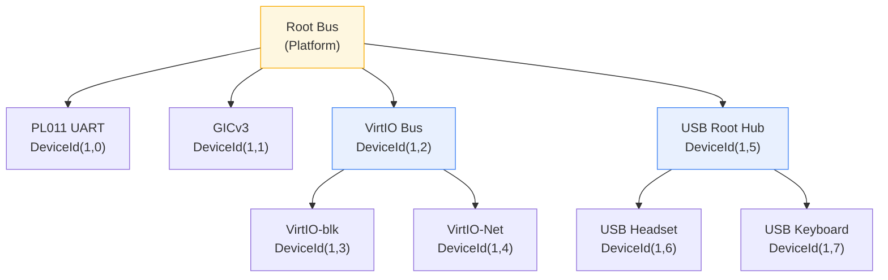
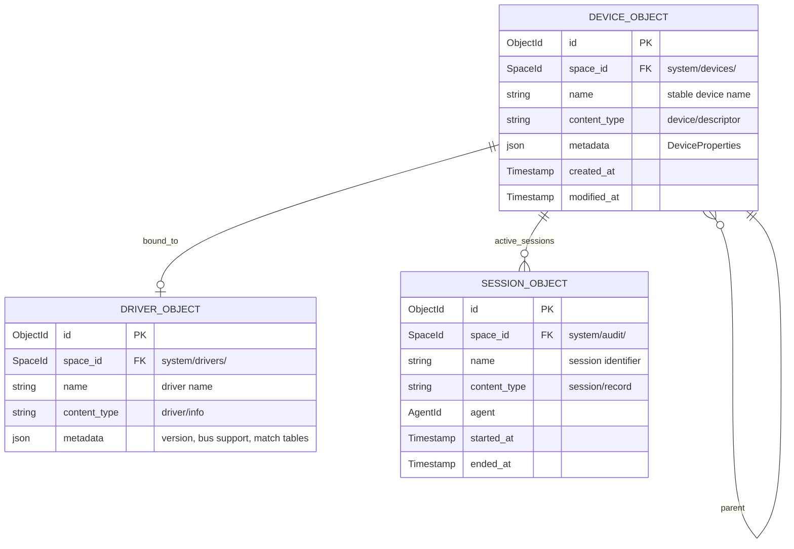
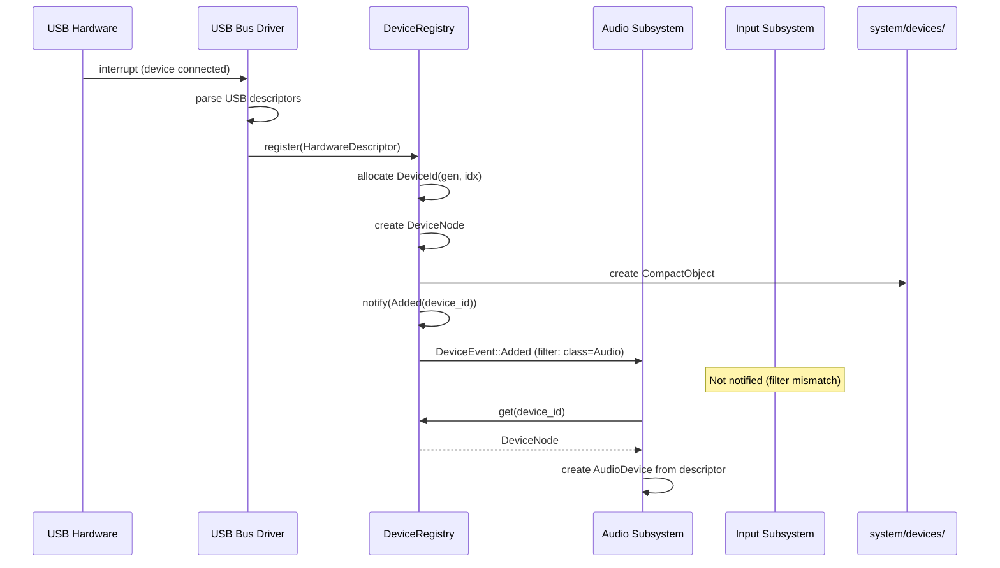

# AIOS Device Representation and Registry

Part of: [device-model.md](../device-model.md) — Device Model and Driver Framework
**Related:** [discovery.md](./discovery.md) — Bus abstraction and driver model, [lifecycle.md](./lifecycle.md) — Device lifecycle and driver interface

-----

## 3. Device Representation

Every piece of hardware in AIOS — whether a VirtIO block device on QEMU, a USB headset plugged in at runtime, or a built-in SoC peripheral — passes through a uniform representation layer before any driver, subsystem, or agent interacts with it. This section defines the data structures that form the kernel's internal model of hardware.

The subsystem framework ([subsystem-framework.md](../../platform/subsystem-framework.md) §4.2) defines `HardwareDescriptor` as the **subsystem-visible** identity of a device. This document expands that definition with kernel-internal fields that subsystems never see: MMIO regions, interrupt lines, DMA capability, and bus topology. The kernel-internal representation is a strict superset — every field in the subsystem-visible descriptor is present, plus fields needed for driver binding, power management, and interrupt routing.

-----

### 3.1 HardwareDescriptor

The `HardwareDescriptor` is created by bus scan (Platform, VirtIO) or hotplug event (USB, Bluetooth) and captures everything the kernel knows about a device at discovery time. It is immutable after creation — runtime state changes are tracked in `DeviceNode` (§3.3), not here.

```rust
/// Bus type — how the device is connected to the system.
///
/// Matches subsystem-framework.md §4.2 Bus enum but includes
/// kernel-internal variants not exposed to subsystems.
#[derive(Debug, Clone, Copy, PartialEq, Eq, Hash)]
pub enum Bus {
    Platform,     // SoC-integrated (UART, GIC, timer, GPU)
    VirtIO,       // VirtIO MMIO transport (QEMU development target)
    USB,          // USB host controller tree
    PCI,          // PCIe/PCI bus
    Bluetooth,    // Bluetooth HCI
    I2C,          // I2C bus (sensors, touchscreens, PMICs)
    SPI,          // SPI bus (flash, displays, audio codecs)
}

/// A contiguous MMIO region that the device occupies.
#[derive(Debug, Clone, Copy)]
pub struct MmioRegion {
    /// Physical base address of the MMIO region.
    pub base: PhysAddr,
    /// Size in bytes.
    pub size: usize,
}

/// Device class identifier — what the device IS, not what it DOES.
/// The subsystem framework's DeviceCapabilityDesc describes what it offers.
#[derive(Debug, Clone, Copy, PartialEq, Eq, Hash)]
pub struct DeviceClassId(pub u32);

impl DeviceClassId {
    pub const AUDIO: Self = Self(0x01);
    pub const NETWORK: Self = Self(0x02);
    pub const STORAGE: Self = Self(0x03);
    pub const INPUT: Self = Self(0x04);
    pub const DISPLAY: Self = Self(0x05);
    pub const SERIAL: Self = Self(0x06);
    pub const CAMERA: Self = Self(0x07);
    pub const PRINTER: Self = Self(0x08);
    pub const BLUETOOTH_HCI: Self = Self(0x09);
    pub const WIRELESS: Self = Self(0x0A);
}

/// Identity of a discovered device.
///
/// The subsystem-visible fields (bus, vendor_id, product_id, device_class,
/// interfaces, power_state, unique_id) match subsystem-framework.md §4.2.
/// The kernel-internal fields (mmio_regions, irq_lines, dma_capable,
/// parent_bus) are only visible within the kernel device model.
pub struct HardwareDescriptor {
    // --- Subsystem-visible fields (per subsystem-framework.md §4.2) ---

    /// Bus type through which this device was discovered.
    pub bus: Bus,

    /// Vendor identifier (USB VID, PCI vendor, VirtIO subsystem vendor).
    pub vendor_id: u32,

    /// Product identifier (USB PID, PCI device, VirtIO device type).
    pub product_id: u32,

    /// High-level device class.
    pub device_class: DeviceClassId,

    /// Interfaces this device offers (e.g., a USB audio device may offer
    /// both playback and capture interfaces).
    pub interfaces: Vec<Interface>,

    /// Power state at discovery time (typically PowerState::Active).
    pub power_state: PowerState,

    /// Unique identifier: serial number, USB iSerialNumber, PCI GUID,
    /// or DTB path. None if the device has no stable identity.
    pub unique_id: Option<String>,

    // --- Kernel-internal fields (NOT visible to subsystems) ---

    /// MMIO regions this device occupies. Populated from DTB, PCI BARs,
    /// or VirtIO MMIO transport base. Empty for pure-software devices.
    pub mmio_regions: Vec<MmioRegion>,

    /// Interrupt lines (GIC SPI numbers, MSI vectors, GPIO IRQs).
    /// The device model maps these to the interrupt controller via
    /// the GIC driver (hal.md §4.1).
    pub irq_lines: Vec<u32>,

    /// Whether this device can perform DMA. Determines whether the
    /// kernel allocates from Pool::Dma (memory/physical.md §2.4).
    pub dma_capable: bool,

    /// The bus device that discovered this device. For a USB device,
    /// this is the USB hub's DeviceId. For a Platform device, this
    /// is the root bus. Forms the parent edge in the device graph (§3.3).
    pub parent_bus: Option<DeviceId>,
}
```

The separation between subsystem-visible and kernel-internal fields enforces a security boundary: subsystems receive a filtered view via the `Subsystem::device_added()` callback ([subsystem-framework.md](../../platform/subsystem-framework.md) §4.1), while the full descriptor — including MMIO regions and IRQ lines — is only available to the device model and the driver that binds to the device.

-----

### 3.2 DeviceId

Every device in the kernel is identified by a `DeviceId` — a 64-bit value that encodes both a unique index and a generation counter. The generation prevents ABA problems: if device index 42 is removed and a new device reuses slot 42, the generation increments, so stale `DeviceId` values from the old device are never confused with the new one.

```rust
/// Generation-tracked unique device identifier.
///
/// Layout: bits[63:48] = generation (u16), bits[47:0] = index (u48).
///
/// Allocated exclusively by DeviceRegistry (§4.1). Drivers, subsystems,
/// and agents receive DeviceId values but never construct them.
#[derive(Debug, Clone, Copy, PartialEq, Eq, Hash)]
pub struct DeviceId(u64);

impl DeviceId {
    /// Sentinel value representing no device.
    pub const NONE: Self = Self(0);

    /// Create a new DeviceId from a generation and index.
    /// Called only by DeviceRegistry internals.
    pub(crate) fn new(generation: u16, index: u64) -> Self {
        debug_assert!(index < (1 << 48), "DeviceId index overflow");
        Self(((generation as u64) << 48) | (index & 0x0000_FFFF_FFFF_FFFF))
    }

    /// Extract the generation counter.
    /// Used to detect stale references after device removal.
    pub fn generation(self) -> u16 {
        (self.0 >> 48) as u16
    }

    /// Extract the slot index into the registry's device table.
    pub fn index(self) -> u64 {
        self.0 & 0x0000_FFFF_FFFF_FFFF
    }
}
```

The 16-bit generation field supports 65,535 reuses per slot before wrapping. Given that device slots are reused only on physical removal and re-insertion, this is sufficient for any realistic hardware lifetime. If a subsystem holds a stale `DeviceId`, the registry detects the generation mismatch and returns an error rather than operating on the wrong device.

-----

### 3.3 DeviceNode

The `DeviceNode` is the runtime representation of a device in the kernel's live device graph. This is distinct from the DTB (Device Tree Blob) — the DTB describes hardware as firmware sees it at boot; the device graph describes hardware as the kernel sees it now, including hotplugged devices and runtime state changes.

Parent/child links form a tree rooted at bus controllers. A USB hub is the parent of the devices connected to it. A PCI root complex is the parent of PCI devices. This hierarchy drives two critical operations:

1. **Power management:** Children are suspended before their parent. A USB hub cannot be suspended while any child device is active. See [power-management.md](../../platform/power-management.md) for the full power state machine.
2. **Hot-swap:** Removing a parent removes all children. Unplugging a USB hub forcibly removes every device attached to it, closing all sessions on those devices.

```rust
/// Runtime device graph node.
///
/// The device graph is the kernel's live representation of hardware
/// topology. It is NOT the DTB device tree — it reflects current
/// runtime state including hotplugged devices.
pub struct DeviceNode {
    /// Unique identifier, generation-tracked (§3.2).
    pub id: DeviceId,

    /// Immutable hardware identity, created at discovery time (§3.1).
    pub descriptor: HardwareDescriptor,

    /// The driver currently bound to this device, if any.
    /// None during the Discovered and Probed states (lifecycle.md §7).
    pub driver: Option<DriverId>,

    /// Current lifecycle state.
    pub state: DeviceState,

    /// Key-value properties queryable by drivers and subsystems (§3.4).
    pub properties: DeviceProperties,

    /// Child devices (e.g., USB devices under a hub, PCI functions
    /// under a multi-function device).
    pub children: Vec<DeviceId>,

    /// Parent device. None only for root bus controllers.
    /// Weak reference avoids circular ownership — the registry
    /// owns all DeviceNodes; parent/child are index links.
    pub parent: Option<DeviceId>,
}
```



The graph is stored as a flat table in the `DeviceRegistry` (§4.1) with parent/child links as `DeviceId` values. This avoids pointer-based trees, simplifies serialization to the `system/devices/` space (§4.2), and enables O(1) lookup by `DeviceId`.

-----

### 3.4 Device Properties

Devices expose key-value properties that drivers populate and subsystems query. Properties describe **what the device can do** in domain-specific terms, separate from the capability system (which describes **what access is granted**).

```rust
/// Property value types.
///
/// Covers the range of metadata that device drivers need to expose:
/// numeric parameters (sample rates, MTU), identifiers (MAC address),
/// flags (DMA support), and opaque blobs (firmware version strings).
#[derive(Debug, Clone)]
pub enum PropertyValue {
    U32(u32),
    U64(u64),
    String(String),
    Bytes(Vec<u8>),
    Bool(bool),
}

/// A typed collection of device properties.
///
/// Backed by a BTreeMap for deterministic iteration order, which
/// matters for serialization to the system/devices/ space (§4.2).
pub type DeviceProperties = BTreeMap<String, PropertyValue>;
```

Properties are domain-specific. Each subsystem defines well-known property keys that drivers must populate:

| Subsystem | Property Keys | Value Types |
|---|---|---|
| Audio | `sample_rates`, `channels`, `formats` | `Vec<U32>`, `U32`, `Vec<String>` |
| Network | `link_speed`, `mac_address`, `mtu` | `U64`, `Bytes(6)`, `U32` |
| Display | `resolutions`, `refresh_rates`, `color_depth` | `Vec<String>`, `Vec<U32>`, `U32` |
| Input | `key_count`, `axes`, `has_touchpad` | `U32`, `U32`, `Bool` |
| Storage | `capacity_bytes`, `sector_size`, `rotational` | `U64`, `U32`, `Bool` |

The `DeviceClass::properties()` method ([subsystem-framework.md](../../platform/subsystem-framework.md) §4.3) returns a reference to the same `DeviceProperties` map. There is one canonical copy per device, owned by the `DeviceNode`.

-----

### 3.5 Device Naming

Devices need names that humans read and that software references. AIOS defines two naming schemes with distinct stability guarantees:

**Stable names** are derived from hardware identity and survive reboots:

- **Serial number:** If `HardwareDescriptor::unique_id` is `Some`, the stable name is derived from it (e.g., `usb-SanDisk_Ultra_4C530001191227116292`).
- **DTB path:** For platform devices without serial numbers, the DTB node path provides a stable name (e.g., `platform-9000000.uart`).
- **PCI topology:** For PCI devices, the bus/device/function address is stable within a given hardware configuration (e.g., `pci-0000:01:00.0`).

**Bus-order names** are assigned at enumeration time and are NOT stable:

- `eth0`, `eth1` — assigned in the order network interfaces are discovered.
- `sda`, `sdb` — assigned in the order storage devices are discovered.
- USB port resets, bus re-enumeration, or probe timing changes can reorder these names.

AIOS prefers stable names for all persistent references. The `system/devices/` space (§4.2) stores objects using stable names as the primary key. Bus-order names are maintained as symlinks for POSIX compatibility ([subsystem-framework.md](../../platform/subsystem-framework.md) §10) but are never used as the canonical identity of a device.

The naming scheme mirrors the Device Registry's role as a system space. Every device's stable name is a path within `system/devices/`:

```text
system/devices/
  platform-9000000.uart          → PL011 UART
  platform-8000000.gic           → GICv3 interrupt controller
  virtio-0a000000.blk            → VirtIO block device
  usb-SanDisk_Ultra_4C530001     → USB flash drive (stable across reboot)
```

-----

## 4. Device Registry

The Device Registry is the single source of truth for "what hardware exists in this system." It bridges two worlds: the kernel-internal device graph (§3.3) used by drivers and the device model, and the `system/devices/` space ([spaces.md](../../storage/spaces.md) §2) used by agents, the subsystem framework, and POSIX tools.

The subsystem framework ([subsystem-framework.md](../../platform/subsystem-framework.md) §10) defines `DeviceRegistry` and `RegisteredDevice` at the subsystem-visible level. This section expands those definitions with kernel-internal state: the generation counter, notification subscribers, and the full `DeviceNode` graph.

-----

### 4.1 Registry Data Structures

```rust
/// Central kernel device registry.
///
/// Owns all DeviceNodes and manages the device graph. Stored as a
/// kernel-internal data structure with a parallel projection into
/// the system/devices/ space (§4.2).
///
/// Expands subsystem-framework.md §10's DeviceRegistry with:
/// - Generation counter for ABA-safe DeviceId allocation
/// - Notification subscriber list for event delivery (§4.4)
/// - Full DeviceNode storage (not just RegisteredDevice summaries)
pub struct DeviceRegistry {
    /// All known devices, indexed by DeviceId slot index.
    /// Slot reuse is tracked by generation (§3.2).
    devices: HashMap<u64, DeviceNode>,

    /// Monotonically increasing generation counter.
    /// Incremented each time a slot is reused after device removal.
    generation: u16,

    /// Next available slot index for new device registration.
    next_index: u64,

    /// Subsystems that have subscribed to device events (§4.4).
    subscribers: Vec<EventSubscription>,
}

/// Subscription entry: which subsystem wants which events.
struct EventSubscription {
    /// The subscribing subsystem.
    subsystem: SubsystemId,

    /// Optional filter: only deliver events matching this predicate.
    /// None means deliver all events.
    filter: Option<DeviceEventFilter>,
}

/// Filter predicate for event subscriptions.
pub struct DeviceEventFilter {
    /// Only events for devices on this bus. None = any bus.
    pub bus: Option<Bus>,

    /// Only events for devices of this class. None = any class.
    pub device_class: Option<DeviceClassId>,

    /// Only these event types. Empty = all event types.
    pub event_types: Vec<DeviceEventKind>,
}

/// Classification of device events for filtering.
#[derive(Debug, Clone, Copy, PartialEq, Eq)]
pub enum DeviceEventKind {
    Added,
    Removed,
    StateChanged,
    DriverBound,
    DriverUnbound,
}
```

The registry uses a `HashMap<u64, DeviceNode>` keyed by slot index rather than `DeviceId` directly. This allows the registry to check the generation stored in a `DeviceId` against the generation stored in the `DeviceNode` before returning any result — stale IDs are rejected at the lookup boundary.

-----

### 4.2 system/devices/ Space Schema

Every device registered with the kernel is projected as a `CompactObject` ([spaces/data-structures.md](../../storage/spaces/data-structures.md) §3.3) in the `system/devices/` space. This projection enables agents and tools to query hardware using the same space query API they use for files, contacts, and application data.



Each `CompactObject` in `system/devices/` contains:

| Field | Value | Source |
|---|---|---|
| `name` | Stable device name (§3.5) | `HardwareDescriptor::unique_id` or DTB path |
| `content_type` | `"device/descriptor"` | Fixed |
| `metadata` | `DeviceProperties` serialized as JSON | `DeviceNode::properties` (§3.4) |
| Relations: `parent` | Parent bus device | `DeviceNode::parent` |
| Relations: `children` | Child devices | `DeviceNode::children` |
| Relations: `driver` | Bound driver object in `system/drivers/` | `DeviceNode::driver` |
| Relations: `active_sessions` | Session records in `system/audit/` | Subsystem framework session tracking |

The space projection is eventually consistent with the kernel-internal `DeviceRegistry`. Device addition and removal update the space asynchronously — the kernel-internal graph is always authoritative for driver binding and interrupt routing. The space is authoritative for agent queries and POSIX `/dev/` name resolution.

-----

### 4.3 Registry Query API

Subsystems, the POSIX bridge, and agents query the registry through a typed API. Each method returns a snapshot — the returned `Vec` is not live-updated as devices come and go.

```rust
/// Query interface for the Device Registry.
///
/// Implemented by DeviceRegistry. Used by subsystems to discover
/// devices matching their domain, by the POSIX bridge to enumerate
/// /dev/ entries, and by agents to query hardware capabilities.
pub trait DeviceQuery {
    /// All devices owned by a specific subsystem.
    ///
    /// Example: the audio subsystem queries for all audio devices
    /// to build its mixer routing table.
    fn by_subsystem(&self, subsystem: SubsystemId) -> Vec<&DeviceNode>;

    /// All devices discovered on a specific bus.
    ///
    /// Example: the USB subsystem queries Bus::USB to enumerate
    /// all USB devices for hub topology display.
    fn by_bus(&self, bus: Bus) -> Vec<&DeviceNode>;

    /// All devices in a specific lifecycle state.
    ///
    /// Example: the power manager queries DeviceState::Suspended
    /// to determine which devices to wake on resume.
    fn by_state(&self, state: DeviceState) -> Vec<&DeviceNode>;

    /// All devices offering a specific capability type.
    ///
    /// Example: an agent searches for devices with audio capture
    /// capability to present a microphone picker.
    fn by_capability(&self, capability: &dyn Capability) -> Vec<&DeviceNode>;

    /// Look up a single device by its DeviceId.
    /// Returns None if the ID is stale (generation mismatch) or
    /// the device has been removed.
    fn get(&self, id: DeviceId) -> Option<&DeviceNode>;

    /// Look up a device by its stable name (§3.5).
    /// Returns None if no device with that name is currently registered.
    fn by_name(&self, name: &str) -> Option<&DeviceNode>;

    /// Total count of registered devices.
    fn count(&self) -> usize;
}
```

All query methods are read-only. Mutation — registering devices, removing devices, changing state — goes through the registry's internal API, called only by the device model core and bus drivers. This separation enforces the design principle that the kernel owns device identity ([device-model.md](../device-model.md) §18, principle 1).

-----

### 4.4 Registry Notifications

When hardware state changes, interested subsystems must be notified. The registry implements a subscribe-and-deliver pattern that replaces the ad-hoc `HardwareEvent` dispatch from [subsystem-framework.md](../../platform/subsystem-framework.md) §4.2 with a structured, filterable notification system.

```rust
/// Events emitted by the Device Registry.
///
/// Delivered to subscribed subsystems via their registered callback.
/// Each event carries the DeviceId so the subscriber can query the
/// registry for full device details if needed.
#[derive(Debug, Clone)]
pub enum DeviceEvent {
    /// A new device has been registered.
    /// Fired after bus scan or hotplug detection, before driver matching.
    Added(DeviceId),

    /// A device has been removed from the registry.
    /// Fired after all sessions are closed and the driver is unbound.
    Removed(DeviceId),

    /// A device's lifecycle state has changed.
    /// Fired on power state transitions, error conditions, and recovery.
    StateChanged(DeviceId, DeviceState),

    /// A driver has been successfully bound to a device.
    /// Fired after the driver's probe() returns Ok.
    DriverBound(DeviceId, DriverId),

    /// A driver has been unbound from a device.
    /// Fired after the driver's detach() completes (or on crash recovery).
    DriverUnbound(DeviceId),
}
```

Subsystems subscribe during their `init()` call:

```rust
impl DeviceRegistry {
    /// Register a subsystem to receive device events.
    ///
    /// The filter determines which events are delivered. A None filter
    /// means all events. Subscriptions persist until the subsystem is
    /// deregistered or the system shuts down.
    pub fn subscribe(
        &mut self,
        subsystem: SubsystemId,
        filter: Option<DeviceEventFilter>,
    ) {
        self.subscribers.push(EventSubscription { subsystem, filter });
    }

    /// Deliver an event to all matching subscribers.
    ///
    /// Called internally by the registry when device state changes.
    /// Filters are evaluated per-subscriber: only subscribers whose
    /// filter matches the event's device and event kind receive it.
    fn notify(&self, event: &DeviceEvent) {
        for sub in &self.subscribers {
            if sub.matches(event) {
                subsystem::deliver_event(sub.subsystem, event.clone());
            }
        }
    }
}
```

The notification flow for a USB device insertion:



Notifications are delivered synchronously within the registry's lock scope. Subscribers must not block or perform long-running operations in their event handler — they should enqueue work for their own event loop. This prevents a slow subscriber from stalling device discovery for the entire system.

-----

## Cross-References

| Section | This Document | Related Documents |
|---|---|---|
| §3.1 HardwareDescriptor | Kernel-internal fields | [subsystem-framework.md](../../platform/subsystem-framework.md) §4.2 (subsystem-visible fields) |
| §3.2 DeviceId | Generation tracking | [subsystem-framework.md](../../platform/subsystem-framework.md) §4.1 (DeviceId usage in Subsystem trait) |
| §3.3 DeviceNode | Device graph topology | [power-management.md](../../platform/power-management.md) (suspend ordering), [lifecycle.md](./lifecycle.md) §7 (state machine) |
| §3.4 DeviceProperties | Property value types | [subsystem-framework.md](../../platform/subsystem-framework.md) §4.3 (DeviceClass::properties()) |
| §3.5 Device Naming | Stable vs bus-order names | [subsystem-framework.md](../../platform/subsystem-framework.md) §10 (DeviceRegistry as space), [posix.md](../../platform/posix.md) §9 (/dev/ nodes) |
| §4.1 Registry Data Structures | Kernel-internal registry | [subsystem-framework.md](../../platform/subsystem-framework.md) §10 (RegisteredDevice) |
| §4.2 Space Schema | CompactObject projection | [spaces.md](../../storage/spaces.md) §2 (Space architecture), [spaces/data-structures.md](../../storage/spaces/data-structures.md) §3.3 (CompactObject) |
| §4.3 Registry Query API | Typed query methods | [subsystem-framework.md](../../platform/subsystem-framework.md) §10 (space-based queries) |
| §4.4 Registry Notifications | Event delivery | [subsystem-framework.md](../../platform/subsystem-framework.md) §4.2 (HardwareEvent), §11 (hotplug) |
