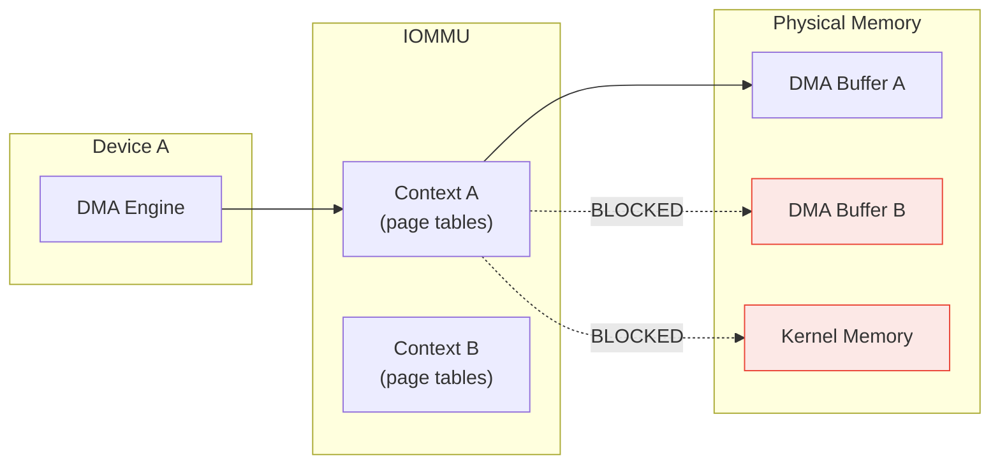
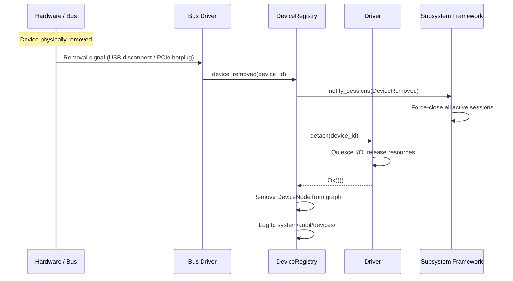
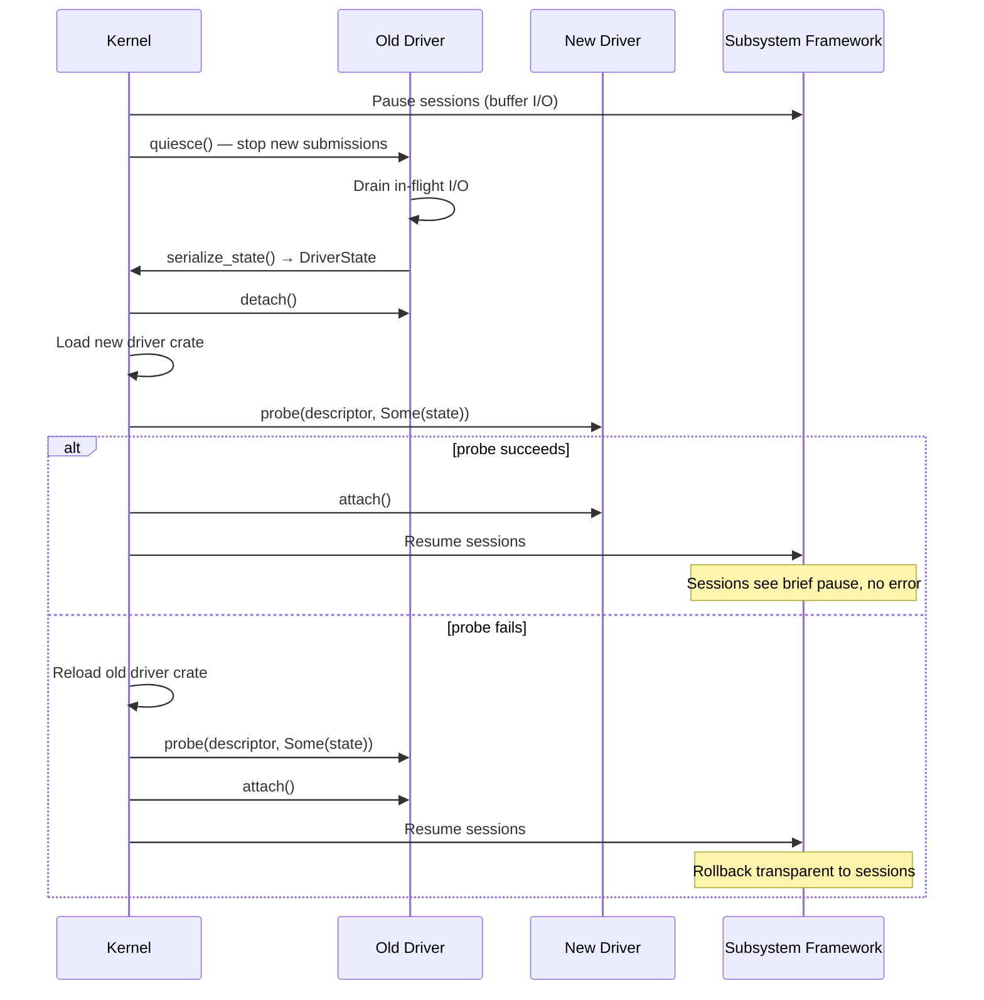
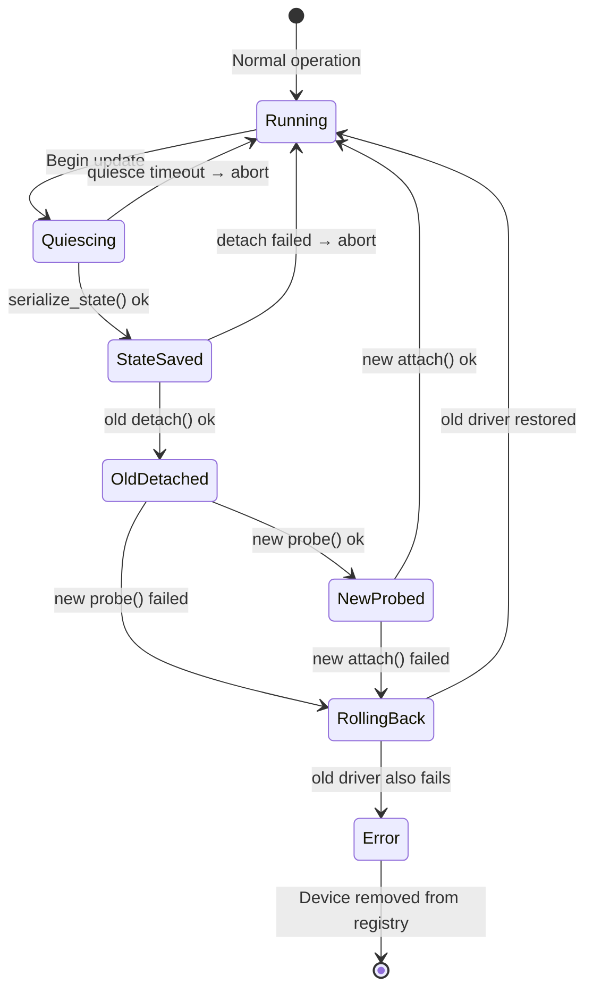

# AIOS Device Security and Hot-Swap

Part of: [device-model.md](../device-model.md) — Device Model and Driver Framework
**Related:** [lifecycle.md](./lifecycle.md) — Driver isolation and crash recovery (§9), [intelligence.md](./intelligence.md) — Testing and verification (§15)

-----

## 13. Security Model

The device model's security model enforces the principle that no driver — whether in-kernel or userspace — accesses hardware it was not explicitly granted. Every MMIO register, interrupt line, and DMA buffer is gated by a capability token. The kernel validates every access, logs every grant, and contains every violation.

This section covers the mechanisms. The capability system infrastructure is defined in [capabilities.md](../../security/model/capabilities.md) §3; this document specifies how that infrastructure applies to device access specifically.

### 13.1 Capability-Gated Device Access

Device access is governed by three capability types, each scoped to a single device:

```rust
pub enum DeviceCapability {
    /// Grant access to specific MMIO register regions.
    /// Each region is a (base_phys_addr, length) pair.
    /// The kernel maps only these regions into the driver's address space.
    Mmio {
        device_id: DeviceId,
        regions: Vec<(PhysAddr, usize)>,
        permissions: MmioPerms,
    },
    /// Grant access to specific interrupt lines.
    /// The kernel forwards only these IRQs to the driver's interrupt handler.
    Irq {
        device_id: DeviceId,
        irq_lines: Vec<u32>,
    },
    /// Grant DMA buffer allocation rights.
    /// The driver may request buffers up to max_buffer_size bytes,
    /// with at most max_buffers outstanding at any time.
    Dma {
        device_id: DeviceId,
        max_buffer_size: usize,
        max_buffers: u32,
    },
}
```

```rust
/// Access permissions for an MMIO region.
/// Matches the MmioPerms enum in lifecycle.md §8.2.
#[derive(Debug, Clone, Copy)]
pub enum MmioPerms {
    ReadOnly,
    WriteOnly,
    ReadWrite,
}
```

A `DriverGrant` ([lifecycle.md](./lifecycle.md) §8.2) bundles MMIO, IRQ, and DMA access rights into a single token that the kernel issues when a driver successfully binds to a device. From the security perspective, the grant carries additional metadata for audit and revocation:

```rust
/// Security envelope for a DriverGrant (see lifecycle.md §8.2 for
/// the full runtime structure with MmioGrant/IrqGrant/DmaGrant).
pub struct DriverGrantEnvelope {
    pub device_id: DeviceId,
    pub mmio_cap: DeviceCapability,   // Mmio variant
    pub irq_cap: DeviceCapability,    // Irq variant
    pub dma_cap: DeviceCapability,    // Dma variant
    pub trust_level: DriverTrustLevel,
    pub issued_at: Timestamp,
    pub token_id: CapabilityTokenId,
}
```

**Enforcement path:** Every MMIO read/write, every IRQ acknowledgment, and every DMA buffer allocation passes through the kernel. The kernel checks the caller's `DriverGrant` before performing the operation. A missing or revoked grant results in an error return (in-kernel driver) or a fault delivery (userspace driver). There is no bypass path.

**Cross-reference:** Capability token lifecycle and attenuation rules are defined in [capabilities.md](../../security/model/capabilities.md) §3.1--§3.5. The `DriverGrant` is a domain-specific application of the general-purpose `CapabilityToken`.

### 13.2 Driver Trust Levels

Each driver is assigned a trust level at load time based on its provenance. The trust level determines which device capabilities the kernel will grant:

```rust
pub enum DriverTrustLevel {
    /// Unknown or newly loaded driver. Minimal access for probing only.
    Untrusted,
    /// Community or third-party driver. Limited access, no privileged operations.
    Limited,
    /// Signed by the OS vendor. Broad access with bounds checking.
    Trusted,
    /// Compiled into the kernel image. Full hardware access.
    KernelTrusted,
}
```

**Access matrix:**

| Level | MMIO | IRQ | DMA | Direct Scanout | Kernel Bypass |
|---|---|---|---|---|---|
| KernelTrusted | Full | Full | Full | Yes | Yes |
| Trusted | Declared | Declared | Bounded | Yes | No |
| Limited | Declared | Declared | Bounded, no SG | No | No |
| Untrusted | Read-only | None | None | No | No |

**Column definitions:**

- **MMIO:** "Full" means any register in the device's MMIO region. "Declared" means only the regions listed in the driver's manifest. "Read-only" prohibits writes.
- **IRQ:** "Full" means the driver can register handlers for any IRQ line the device uses. "Declared" means only lines listed in the manifest. "None" means the kernel does not forward interrupts.
- **DMA:** "Full" means unrestricted buffer sizes and counts. "Bounded" means subject to `max_buffer_size` and `max_buffers` from the DriverGrant. "Bounded, no SG" additionally prohibits scatter-gather chains (single contiguous buffers only). "None" means no DMA access.
- **Direct Scanout:** Whether the driver can request direct framebuffer scanout, bypassing the compositor. See [compositor GPU](../../platform/compositor/gpu.md) §8.
- **Kernel Bypass:** Whether the driver can use fast-path I/O that skips per-operation capability checks (for performance-critical kernel drivers only).

**Trust level assignment:** In-kernel drivers compiled with the kernel image receive `KernelTrusted`. Drivers loaded from the ESP or a signed package receive `Trusted` if the signature chain validates against the OS vendor key. Community packages with a valid but non-vendor signature receive `Limited`. Everything else is `Untrusted`.

### 13.3 MMIO Guard Pages

The kernel inserts unmapped guard pages around every MMIO region granted to a driver:

```text
+---------------------+
| Guard (unmapped)    |  4 KiB
+---------------------+
| Granted MMIO region |  varies
+---------------------+
| Guard (unmapped)    |  4 KiB
+---------------------+
```

Any access to a guard page triggers a synchronous data abort (page fault). The kernel handles this as a driver violation:

1. The faulting instruction address and target address are logged to the audit trail.
2. The driver's `DriverGrant` is revoked.
3. The driver process is terminated (userspace) or the device is unbound (in-kernel).
4. The crash recovery path (§9.3 in [lifecycle.md](./lifecycle.md)) initiates driver restart.

Guard pages also surround DMA buffer grants in the driver's virtual address space, preventing buffer overflows from reaching adjacent device registers or kernel memory.

**Implementation note:** Guard pages use the same page table infrastructure as W^X enforcement ([virtual.md](../memory/virtual.md) §3.2). The PTE for a guard page has the Valid bit cleared. No physical memory is consumed.

### 13.4 DMA Isolation via IOMMU

The IOMMU provides hardware-enforced per-device DMA isolation. Each device receives its own IOMMU context containing page tables that map only the DMA regions granted by the device's `DriverGrant`:



When a driver allocates a DMA buffer, the kernel:

1. Allocates physical frames from the DMA pool ([physical.md](../memory/physical.md) §2.4).
2. Maps the frames into the device's IOMMU context.
3. Returns the IOMMU-mapped (bus) address to the driver.
4. On buffer free: unmaps from IOMMU, returns frames to the DMA pool.

**Without IOMMU (Raspberry Pi 4):** The kernel validates DMA addresses in software before submitting them to the device. The `DriverGrant` specifies the allowed physical address ranges. Any DMA descriptor referencing an address outside the grant is rejected before the device sees it. This is weaker than hardware enforcement but still prevents a well-behaved driver from accidentally accessing the wrong memory.

**Cross-reference:** IOMMU integration details are in [dma.md](./dma.md) §11.4. HAL-level IOMMU abstraction is in [hal.md](../hal.md) §13.1.

### 13.5 Audit Trail

All device access events are logged to the `system/audit/devices/` space. The audit subsystem records:

| Event | Fields | Trigger |
|---|---|---|
| `DriverLoaded` | driver_name, trust_level, hash | Driver binary loaded into memory |
| `DriverUnloaded` | driver_name, reason | Driver removed (normal or crash) |
| `DeviceBound` | device_id, driver_name, grant_summary | Driver successfully bound to device |
| `DeviceUnbound` | device_id, driver_name, reason | Driver detached from device |
| `GrantIssued` | token_id, device_id, mmio_regions, irq_lines, dma_limits | DriverGrant created |
| `GrantRevoked` | token_id, device_id, reason | DriverGrant revoked (normal or violation) |
| `MmioViolation` | device_id, faulting_addr, granted_regions | Out-of-bounds MMIO access attempted |
| `DmaFault` | device_id, target_addr, iommu_context | DMA to ungranted address |
| `IrqRateLimit` | device_id, irq_line, rate, threshold | Interrupt rate exceeded threshold |

Each audit entry includes a monotonic timestamp, the originating process ID, and the CPU core. The audit ring is append-only and survives driver restarts.

**Cross-reference:** The audit infrastructure is defined in [subsystem-framework.md](../../platform/subsystem-framework.md) §7. Kernel observability (log rings, trace points) is in [observability.md](../observability.md).

### 13.6 Threat Model

The device security model addresses the following threats:

| Threat | Attack Vector | Mitigation |
|---|---|---|
| Malicious driver reads arbitrary memory | DMA to ungranted physical address | IOMMU per-device page tables (§13.4); software validation on platforms without IOMMU |
| Driver escalates to kernel privilege | Exploit unsafe code in driver or corrupt kernel data structures | Framekernel isolation pattern ([lifecycle.md](./lifecycle.md) §9.2); userspace drivers cannot access kernel memory |
| Compromised device attacks host via DMA | Device-initiated DMA to kernel code/data | IOMMU per-device page tables restrict device DMA to granted buffers only |
| IRQ storm denial of service | Device floods interrupt lines to starve other devices | Interrupt rate limiting in GIC handler; disable line after threshold; log and notify |
| Driver persists after revocation | Driver ignores detach() and continues MMIO access | Kernel force-terminates process and unmaps MMIO pages; subsequent access faults |
| MMIO probing for undocumented registers | Driver writes to register offsets outside declared range | Guard pages (§13.3) around granted regions; only declared offsets are mapped |
| Stale DMA buffer use-after-free | Driver retains pointer to freed DMA buffer | Kernel zeros and unmaps buffer from IOMMU on free; subsequent DMA faults |
| Cross-device DMA buffer access | Device A's DMA engine targets Device B's buffer | Separate IOMMU contexts per device; no cross-device address translation |

**Defense in depth:** No single mechanism is assumed sufficient. IOMMU enforcement, guard pages, capability checks, and audit logging operate independently. A failure in one layer (e.g., IOMMU misconfiguration) is caught by another (e.g., guard page fault or audit anomaly detection).

-----

## 14. Hot-Swap and Live Driver Update

AIOS supports two forms of runtime device change: physical hot-swap (a device is physically inserted or removed) and live driver update (a running driver is replaced with a new version without device removal). Both preserve session continuity when possible.

### 14.1 Hot-Swap Protocol

Physical hot-swap handles device insertion and removal at runtime. The protocol differs based on whether the removal is orderly (user-initiated eject) or surprise (cable yanked):



**Orderly removal:** The bus driver receives an eject request before the device disappears. It notifies the DeviceRegistry, which tells the subsystem framework to drain active sessions. The driver quiesces in-flight I/O (waits for completions), then detaches cleanly. Sessions receive an orderly close notification.

**Surprise removal:** The device disappears without warning. In-flight I/O fails immediately with `DeviceRemoved`. The bus driver detects the absence (e.g., USB disconnect interrupt, PCIe link down) and reports it. The kernel revokes the `DriverGrant`, unmaps MMIO regions, and terminates the driver if it does not detach within a timeout (default: 2 seconds). Sessions receive a `DeviceRemoved` error on their next operation.

**Insertion** follows the standard discovery path: bus enumerate → HardwareDescriptor → DeviceRegistry → driver match → probe → bind → sessions available. See [discovery.md](./discovery.md) §5 and [lifecycle.md](./lifecycle.md) §7.

### 14.2 Live Driver Update (Theseus-Inspired)

Live driver update replaces a running driver with a new version without removing the device. The protocol is inspired by the [Theseus OS](https://www.theseus-os.com/) approach to live code evolution: serialize driver state, swap the code, restore state.



**Steps in detail:**

1. **Load new driver crate** into memory (does not replace old yet).
2. **Quiesce old driver** — kernel tells the old driver to stop accepting new I/O submissions.
3. **Drain in-flight I/O** — wait for all outstanding operations to complete (with timeout).
4. **Serialize driver state** — the old driver serializes its register values, queue positions, and internal state into a `DriverState` structure.
5. **Detach old driver** — the kernel calls `detach()`, revokes the old DriverGrant.
6. **Probe new driver** — the kernel calls `probe()` on the new driver, passing the serialized state.
7. **Attach new driver** — the new driver issues a new DriverGrant, restores state, and resumes operation.
8. **Resume I/O** — the subsystem framework un-pauses sessions.

If step 6 or 7 fails, the kernel rolls back to the old driver (§14.5).

### 14.3 State Migration

Drivers that support live update implement the `MigrateableDriver` trait:

```rust
pub trait MigrateableDriver: Driver {
    /// Serialize the driver's internal state for migration.
    /// Called after quiesce, before detach.
    fn serialize_state(&self) -> Result<DriverState, DriverError>;

    /// Restore state from a previous driver version.
    /// Called during probe, before attach.
    fn restore_state(&mut self, state: DriverState) -> Result<(), DriverError>;
}
```

```rust
pub struct DriverState {
    /// State format version. Incremented when the serialization format changes.
    pub version: u32,
    /// Saved device register values as (offset, value) pairs.
    pub registers: Vec<(u32, u32)>,
    /// Serialized virtqueue or command queue positions.
    pub queue_state: Vec<u8>,
    /// Driver-specific opaque state (configuration, cached device info, etc.).
    pub custom: Vec<u8>,
}
```

**State format versioning:** The `version` field identifies the serialization format. A new driver that understands the old driver's state version restores it directly. If the version is unrecognized (e.g., a major driver rewrite), `restore_state()` returns `Err(DriverError::IncompatibleState)` and the kernel performs a full re-initialization: `probe()` without state, followed by a fresh `attach()`. Sessions may observe a longer pause but no data loss.

**State size limit:** The kernel enforces a maximum serialized state size (default: 64 KiB) to prevent a misbehaving driver from consuming excessive kernel memory during migration.

### 14.4 Session Continuity

The subsystem framework cooperates with live driver update to maintain session transparency:

1. **Before update:** The subsystem framework pauses all sessions targeting the device. Incoming I/O requests are buffered in the session's command queue.
2. **During update:** Sessions see no activity. The framework returns `EAGAIN` to any synchronous callers, signaling a transient condition.
3. **After successful update:** Buffered I/O is submitted to the new driver. Sessions resume transparently. Applications observe a brief latency spike but no errors.
4. **After failed update + successful rollback:** The old driver resumes. Buffered I/O is submitted to it. Sessions see a brief pause but no error.
5. **After failed update + failed rollback:** Sessions receive a `DeviceError`. Applications must close and re-open the session. The device enters the `Error` lifecycle state ([lifecycle.md](./lifecycle.md) §7).

**Audio/video continuity:** For latency-sensitive subsystems (audio, display), the subsystem framework may pre-buffer a small amount of output data (e.g., 50 ms of audio) before initiating the update. This allows the update to complete within the buffer window without audible glitches or visual artifacts.

### 14.5 Rollback on Failure

The kernel maintains a rollback capability throughout the live update process:



**Rollback procedure:**

1. Before starting the update, the kernel retains a reference to the old driver crate.
2. If the new driver's `probe()` or `attach()` fails, the kernel unloads the new driver.
3. The old driver is re-probed with its own serialized state.
4. If the old driver restores successfully, operation resumes as if no update was attempted.
5. If the old driver also fails (double fault), the device enters the `Error` state and sessions are terminated.

**Timeout:** The entire update sequence has a maximum duration of 5 seconds (tunable via `system/config/driver_update_timeout`). If any step exceeds its share of the timeout, the kernel forces a rollback. This prevents a hung driver from blocking the device indefinitely.

**Audit logging:** Every live update attempt is logged to `system/audit/devices/` with the outcome (success, rollback, or fault), the old and new driver versions, and the duration.
