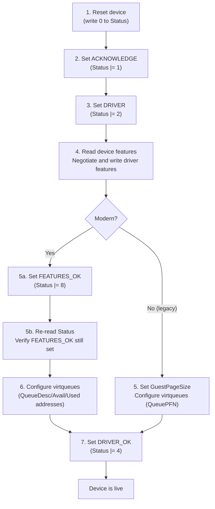
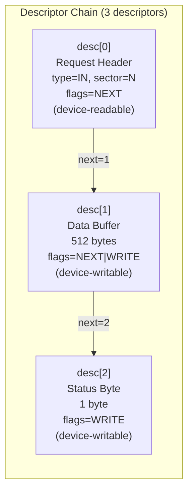
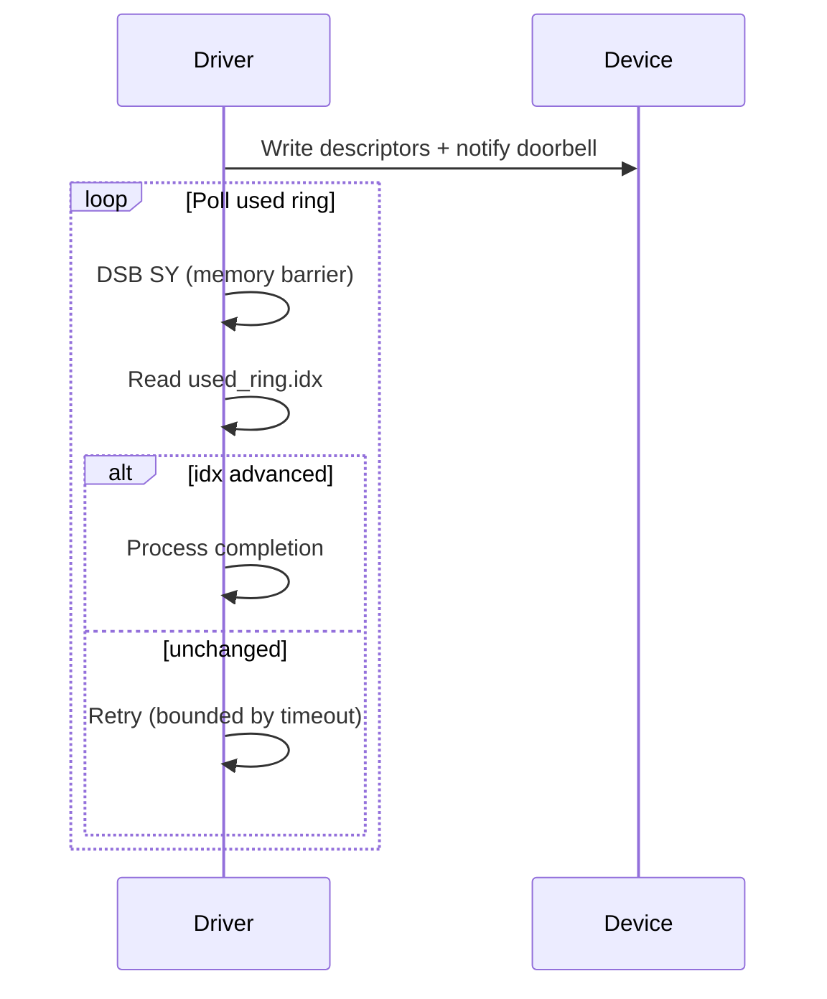
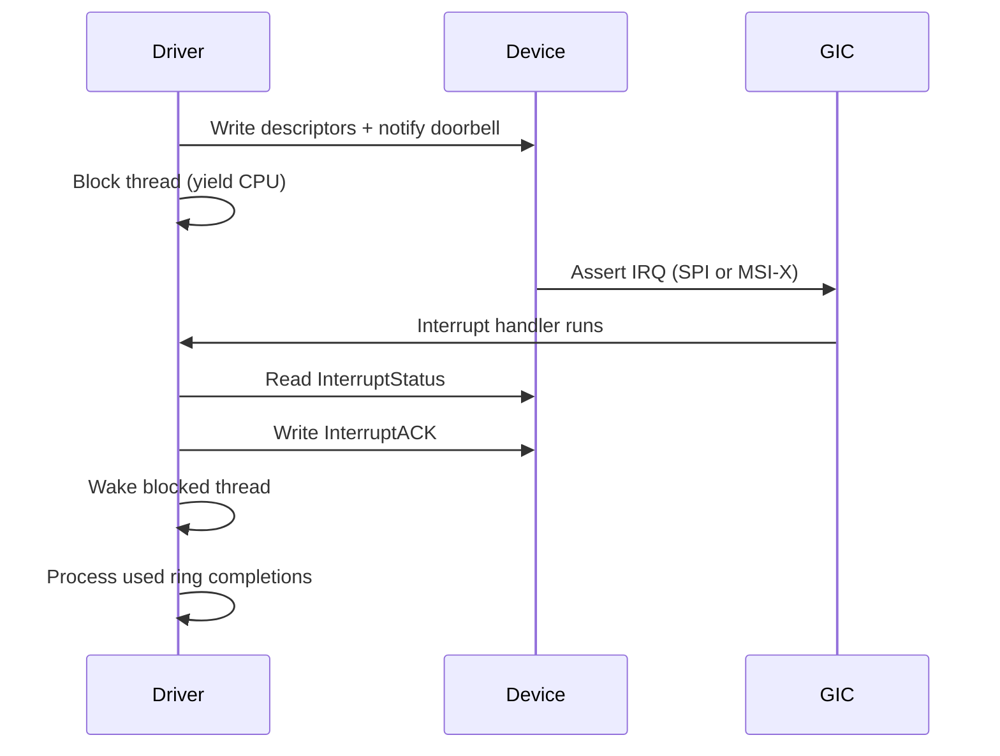

# AIOS VirtIO Transport

Part of: [device-model.md](../device-model.md) — Device Model and Driver Framework
**Related:** [discovery.md](./discovery.md) — VirtIO bus enumeration (§5.3), [dma.md](./dma.md) — DMA engine and buffer lifecycle

-----

## 10. VirtIO Transport Details

VirtIO provides a standardized interface between the kernel and virtual (or physical) devices. Rather than implementing device-specific register protocols, drivers interact through a uniform transport layer: feature negotiation, virtqueue-based data transfer, and a well-defined initialization sequence. AIOS uses VirtIO as its primary device interface on QEMU virt, with the MMIO transport variant (no PCI bus).

This section covers the MMIO register layout, virtqueue data structures, scatter-gather I/O, interrupt handling, supported device types, and the legacy-to-modern migration path.

-----

### 10.1 VirtIO MMIO Transport (QEMU)

The QEMU virt platform exposes VirtIO devices via memory-mapped I/O (MMIO) rather than PCI. Each VirtIO MMIO device occupies a 512-byte register region. On QEMU virt, up to 32 device slots are mapped starting at physical address `0x0A00_0000` with a stride of `0x200` (512 bytes).

#### MMIO Register Map

| Offset | Name | Size | Access | Description |
|--------|------|------|--------|-------------|
| `0x000` | MagicValue | 4 | RO | Must read `0x74726976` ("virt" in little-endian) |
| `0x004` | Version | 4 | RO | Transport version: 1 = legacy, 2 = modern |
| `0x008` | DeviceID | 4 | RO | Device type identifier (0 = no device) |
| `0x00C` | VendorID | 4 | RO | Vendor identifier (QEMU = `0x554D4551`) |
| `0x010` | HostFeatures | 4 | RO | Device feature bits (selected by HostFeaturesSel) |
| `0x014` | HostFeaturesSel | 4 | WO | Feature page selector (0 = bits 0-31, 1 = bits 32-63) |
| `0x020` | GuestFeatures | 4 | WO | Driver-accepted feature bits |
| `0x024` | GuestFeaturesSel | 4 | WO | Feature page selector for guest writes |
| `0x028` | GuestPageSize | 4 | WO | Page size for queue alignment (legacy only) |
| `0x030` | QueueSel | 4 | WO | Selects which virtqueue subsequent queue registers address |
| `0x034` | QueueNumMax | 4 | RO | Maximum queue size for the selected queue |
| `0x038` | QueueNum | 4 | WO | Driver-chosen queue size (must be <= QueueNumMax) |
| `0x03C` | QueueAlign | 4 | WO | Used ring alignment in bytes (legacy only) |
| `0x040` | QueuePFN / QueueReady | 4 | RW | Legacy: page frame number of virtqueue; Modern: queue ready flag |
| `0x050` | QueueNotify | 4 | WO | Queue notification doorbell (write queue index to kick device) |
| `0x060` | InterruptStatus | 4 | RO | Pending interrupt flags |
| `0x064` | InterruptACK | 4 | WO | Acknowledge and clear interrupt flags |
| `0x070` | Status | 4 | RW | Device status register (see status bits below) |
| `0x0FC` | ConfigGeneration | 4 | RO | Config space change counter (modern only) |
| `0x100+` | Config | varies | RW | Device-specific configuration space |

Modern-only registers (Version = 2):

| Offset | Name | Size | Access | Description |
|--------|------|------|--------|-------------|
| `0x080` | QueueDescLow | 4 | WO | Descriptor table physical address (low 32 bits) |
| `0x084` | QueueDescHigh | 4 | WO | Descriptor table physical address (high 32 bits) |
| `0x090` | QueueAvailLow | 4 | WO | Available ring physical address (low 32 bits) |
| `0x094` | QueueAvailHigh | 4 | WO | Available ring physical address (high 32 bits) |
| `0x0A0` | QueueUsedLow | 4 | WO | Used ring physical address (low 32 bits) |
| `0x0A4` | QueueUsedHigh | 4 | WO | Used ring physical address (high 32 bits) |

#### Status Bits

| Bit | Name | Value | Meaning |
|-----|------|-------|---------|
| 0 | ACKNOWLEDGE | 1 | Guest OS has found the device |
| 1 | DRIVER | 2 | Guest OS knows how to drive this device |
| 2 | DRIVER_OK | 4 | Driver is ready, device may start I/O |
| 3 | FEATURES_OK | 8 | Feature negotiation complete (modern only) |
| 6 | NEEDS_RESET | 64 | Device has experienced an unrecoverable error |
| 7 | FAILED | 128 | Guest OS has given up on the device |

#### Device Initialization Sequence

The VirtIO specification (§3.1) defines a strict initialization order. Both legacy and modern transports follow this pattern, with minor differences noted:



**Legacy simplification:** Legacy (v1) transports skip the FEATURES_OK handshake. The driver writes GuestPageSize, sets up queues via QueuePFN (physical page frame number), and proceeds directly to DRIVER_OK.

-----

### 10.2 Virtqueue Internals

A virtqueue is the fundamental data transfer mechanism in VirtIO. Each virtqueue consists of three physically-contiguous memory regions that form a producer-consumer ring buffer between driver and device.

#### Three-Region Layout

```mermaid
flowchart LR
    subgraph VQ["Virtqueue (physically contiguous DMA memory)"]
        direction TB
        subgraph DT["Descriptor Table"]
            D0["desc[0]: addr, len, flags, next"]
            D1["desc[1]: addr, len, flags, next"]
            D2["desc[2]: addr, len, flags, next"]
            DN["...desc[N-1]"]
        end
        subgraph AR["Available Ring (driver -> device)"]
            AF["flags"]
            AI["idx (next slot driver fills)"]
            AE["ring[0..N-1] (descriptor head indices)"]
            AU["used_event (interrupt suppression)"]
        end
        subgraph UR["Used Ring (device -> driver)"]
            UF["flags"]
            UI["idx (next slot device fills)"]
            UE["ring[0..N-1] of {id, len}"]
            UA["avail_event (interrupt suppression)"]
        end
    end

    Driver -->|"1. Fill descriptors<br/>2. Add to avail ring<br/>3. Write doorbell"| DT
    DT -.->|"references"| AR
    AR -->|"device reads"| Device
    Device -->|"4. Process buffers<br/>5. Post to used ring<br/>6. Raise interrupt"| UR
    UR -->|"driver reads"| Driver
```



**Producer-consumer flow:**
1. The driver allocates descriptors in the descriptor table, pointing to data buffers in memory
2. The driver publishes descriptor chain heads to the available ring and increments the available index
3. The driver writes the queue index to the QueueNotify doorbell register
4. The device reads descriptor chains from the available ring, processes the referenced buffers
5. The device posts completed chain heads (with bytes written) to the used ring
6. The device raises an interrupt (or the driver polls the used ring index)

#### Data Structures

```rust
/// A single virtqueue descriptor. Points to one buffer in physical memory.
/// Descriptors can be chained via the `next` field when NEXT flag is set.
#[repr(C)]
pub struct VirtqDesc {
    pub addr: u64,    // physical address of buffer
    pub len: u32,     // buffer length in bytes
    pub flags: u16,   // NEXT, WRITE, INDIRECT
    pub next: u16,    // next descriptor index if NEXT flag set
}

/// Available ring: driver-to-device notification of ready descriptor chains.
/// The driver writes descriptor head indices into ring[], then advances idx.
#[repr(C)]
pub struct VirtqAvail {
    pub flags: u16,
    pub idx: u16,                    // next slot driver will fill
    pub ring: [u16; QUEUE_SIZE],     // descriptor chain head indices
    pub used_event: u16,             // interrupt suppression threshold
}

/// Used ring: device-to-driver notification of completed descriptor chains.
/// The device writes completion entries into ring[], then advances idx.
#[repr(C)]
pub struct VirtqUsed {
    pub flags: u16,
    pub idx: u16,                            // next slot device will fill
    pub ring: [VirtqUsedElem; QUEUE_SIZE],   // completion entries
    pub avail_event: u16,                    // notification suppression threshold
}

/// A single used ring entry. Identifies which descriptor chain completed
/// and how many bytes the device wrote into the writable buffers.
#[repr(C)]
pub struct VirtqUsedElem {
    pub id: u32,   // descriptor chain head index
    pub len: u32,  // total bytes written by device
}
```

#### Descriptor Flags

| Flag | Value | Meaning |
|------|-------|---------|
| `NEXT` | 1 | This descriptor is chained; `next` field is valid |
| `WRITE` | 2 | Buffer is device-writable (device writes data here) |
| `INDIRECT` | 4 | Buffer contains a table of indirect descriptors |

**WRITE flag semantics:** From the device's perspective. A descriptor *without* WRITE is device-readable (the device reads data the driver placed there). A descriptor *with* WRITE is device-writable (the device fills the buffer and the driver reads the result).

#### Legacy vs Modern Alignment

In legacy transports, the three regions are laid out in a single page-aligned allocation:

```text
+------------------+  offset 0
| Descriptor Table |  QUEUE_SIZE x 16 bytes
+------------------+  offset QUEUE_SIZE * 16
| Available Ring   |  6 + QUEUE_SIZE * 2 bytes
+------------------+  page-aligned
| Used Ring        |  6 + QUEUE_SIZE * 8 bytes
+------------------+  page-aligned (end)
```

In modern transports, each region can be placed at an independent physical address via the QueueDescLow/High, QueueAvailLow/High, and QueueUsedLow/High registers. This removes the page-alignment constraint and allows tighter memory packing.

-----

### 10.3 Scatter-Gather I/O

VirtIO uses descriptor chaining to implement scatter-gather I/O. A single logical I/O operation spans multiple descriptors, each pointing to a different buffer in physical memory. The device processes the entire chain atomically.

#### Chain Construction Rules

1. **Read buffers first, write buffers second.** The device reads from (device-readable) descriptors before writing to (device-writable) descriptors. Mixing the order within a chain is undefined.
2. **Chain via NEXT flag.** Set `flags |= NEXT` and populate the `next` field to link descriptors. The final descriptor in the chain has `flags & NEXT == 0`.
3. **Publish only the head.** Only the first descriptor index in the chain is written to the available ring. The device follows the chain from there.

#### Example: VirtIO-blk Read Operation

A block read requires three descriptors chained together:



```rust
// Descriptor 0: request header (16 bytes, device-readable)
// Contains: type (IN=0 for read), reserved, sector number
desc[0] = VirtqDesc {
    addr: header_phys,
    len: 16,
    flags: VIRTQ_DESC_F_NEXT,
    next: 1,
};

// Descriptor 1: data buffer (512 bytes, device-writable)
// Device writes the sector data here
desc[1] = VirtqDesc {
    addr: data_phys,
    len: 512,
    flags: VIRTQ_DESC_F_NEXT | VIRTQ_DESC_F_WRITE,
    next: 2,
};

// Descriptor 2: status byte (1 byte, device-writable)
// Device writes 0 on success, non-zero on failure
desc[2] = VirtqDesc {
    addr: status_phys,
    len: 1,
    flags: VIRTQ_DESC_F_WRITE,
    next: 0,
};
```

#### Example: VirtIO-blk Write Operation

A block write reverses the data direction. The data buffer is device-readable (the device reads data *from* the driver):

```text
desc[0]: Request header  (type=OUT, sector=N)  flags=NEXT          (device-readable)
desc[1]: Data buffer      (512 bytes of data)   flags=NEXT          (device-readable)
desc[2]: Status byte      (1 byte)              flags=WRITE         (device-writable)
```

#### Indirect Descriptors

For devices requiring large scatter-gather lists, the `INDIRECT` flag allows a single descriptor to point to a buffer containing a table of additional descriptors. This avoids exhausting the main descriptor table. AIOS does not use indirect descriptors in the current implementation but supports them in the transport abstraction for future use.

-----

### 10.4 Interrupt Handling

VirtIO devices signal the driver through interrupts when they have completed processing submitted descriptor chains or when their configuration has changed.

#### InterruptStatus Register

| Bit | Name | Meaning |
|-----|------|---------|
| 0 | USED_BUFFER_NOTIFICATION | Device has placed entries in the used ring |
| 1 | CONFIG_CHANGE | Device configuration space has changed |

The driver reads InterruptStatus, handles the indicated events, then writes the same bits to InterruptACK to clear them.

#### Interrupt Modes

**Legacy MMIO:** A single shared IRQ line per device. The driver must read InterruptStatus to determine the cause. Multiple VirtIO devices may share the same IRQ, requiring the driver to check each device.

**Modern MMIO with MSI-X:** Per-queue interrupt vectors allow the device to signal individual virtqueues independently. Each queue maps to a separate interrupt, eliminating the need to poll InterruptStatus. MSI-X requires GIC SPI configuration and per-queue vector assignment.

#### AIOS Interrupt Strategy

| Phase | Strategy | Rationale |
|-------|----------|-----------|
| 0-4 | Polled I/O | Simplicity; storage I/O is synchronous and infrequent |
| 5+ | IRQ-driven | GPU and network devices require asynchronous notification |
| 7+ | Interrupt coalescing | High-throughput network I/O benefits from batching |

**Polled I/O flow (current):**



**IRQ-driven flow (Phase 5+):**



#### Interrupt Suppression

Both the available and used rings contain event index fields (`used_event` in available ring, `avail_event` in used ring) that allow each side to suppress notifications from the other. When the VIRTIO_F_EVENT_IDX feature is negotiated:

- The driver sets `used_event` to tell the device "do not interrupt until used_ring.idx reaches this value"
- The device sets `avail_event` to tell the driver "do not notify until avail_ring.idx reaches this value"

This reduces interrupt frequency under high throughput without sacrificing latency under low throughput.

-----

### 10.5 VirtIO Device Types

AIOS uses the following VirtIO device types across its implementation phases:

| Device Type | ID | Queues | Queue Names | Description | AIOS Phase |
|---|---|---|---|---|---|
| Network | 1 | 2 | rx, tx | Ethernet adapter; packet-based send/receive | Phase 7 |
| Block | 2 | 1 | requests | Block storage; sector-level read/write | Phase 1+ |
| Console | 3 | 2 | receiveq, transmitq | Serial console; byte-stream I/O | -- |
| Entropy | 4 | 1 | requests | Hardware RNG source; fills buffers with random bytes | Phase 1+ |
| GPU | 16 | 2 | controlq, cursorq | 2D/3D display adapter; framebuffer and cursor management | Phase 5 |
| Input | 18 | 2 | events, status | Keyboard, mouse, tablet; HID event delivery | Phase 7 |
| Sound | 25 | 4 | controlq, eventq, txq, rxq | Audio adapter; PCM stream playback and capture | Phase 22 |

#### Per-Device Queue Usage Patterns

**Block (ID=2):** Single request queue. Each I/O operation uses a 3-descriptor chain: request header (type + sector), data buffer(s), status byte. Supports both synchronous (polled) and asynchronous (IRQ) completion. Feature bits control geometry reporting (`SIZE_MAX`, `SEG_MAX`), physical block size (`BLK_SIZE`), and multi-queue (`MQ`).

**Network (ID=1):** Separate receive and transmit queues. The rx queue is pre-populated with empty buffers; the device fills them with incoming packets. The tx queue receives outgoing packets from the driver. Each packet is preceded by a `virtio_net_hdr` describing checksum offload and segmentation. Supports multi-queue (`MQ`) for per-CPU queue pairs.

**GPU (ID=16):** Control queue carries rendering commands (resource creation, framebuffer attachment, display info queries). Cursor queue manages hardware cursor position and image. Both queues use command-response descriptor chains: a device-readable command buffer followed by a device-writable response buffer.

**Input (ID=18):** Event queue delivers HID events (key press, mouse movement, touch). Status queue reports device capabilities (keyboard layout, axis ranges). Events are small fixed-size structures; the driver pre-posts empty buffers to the event queue.

**Sound (ID=25):** Four queues separate control (PCM stream setup/teardown), events (jack detection, xrun notification), transmit (playback PCM data), and receive (capture PCM data). TX and RX queues carry period-sized audio buffers with timing metadata. Low-latency operation requires careful buffer sizing and interrupt coalescing.

**Entropy (ID=4):** Single request queue. The driver posts empty buffers; the device fills them with random bytes. Used during early boot for KASLR seed and cryptographic key generation.

-----

### 10.6 Modern vs Legacy VirtIO

The VirtIO specification has evolved through three major generations, each improving performance and flexibility:

#### Legacy (VirtIO 0.9, MMIO v1)

- Virtqueues must be page-aligned (4 KiB boundary)
- Single contiguous allocation for all three regions (descriptor table, available ring, used ring)
- Queue location communicated via QueuePFN (physical page frame number)
- GuestPageSize register sets the page size for PFN calculation
- No FEATURES_OK status bit; feature negotiation is implicit
- Feature bits limited to 32 (no HostFeaturesSel/GuestFeaturesSel in practice)

**AIOS current implementation uses legacy MMIO v1**, as this is the default for QEMU's `-device virtio-blk-device` when not specifying a version.

#### Modern (VirtIO 1.0+, MMIO v2)

- Virtqueue regions can be placed at arbitrary physical addresses
- Separate registers for descriptor, available, and used ring addresses (64-bit each)
- QueueReady register replaces QueuePFN
- FEATURES_OK handshake: driver must set FEATURES_OK and verify the device accepted
- Full 64-bit feature space (HostFeaturesSel selects 32-bit pages)
- ConfigGeneration counter for safe config space reads

#### Packed Virtqueues (VirtIO 1.2+)

Packed virtqueues replace the three separate regions with a single unified ring:

```text
Split virtqueue:
  [Descriptor Table] + [Available Ring] + [Used Ring]  (3 cache lines per I/O)

Packed virtqueue:
  [Packed Descriptor Ring]  (1 cache line per I/O)
```

Each packed descriptor contains the buffer pointer, length, flags, *and* availability/usage status in a single 16-byte entry. The driver and device alternate ownership of descriptors using wrap counters and availability/used flag bits. Benefits:

- **Better cache locality:** One cache line touch per descriptor vs three separate regions
- **Reduced memory footprint:** No separate index arrays
- **In-order completion:** Hardware can complete descriptors in submission order without an extra indirection

#### AIOS Migration Path

| Milestone | Transport | Rationale |
|-----------|-----------|-----------|
| Phase 1-4 | Legacy MMIO (v1) | Simplicity; QEMU default; sufficient for polled block I/O |
| Phase 5 | Modern MMIO (v2) | GPU and entropy devices benefit from 64-bit feature space |
| Phase 7+ | Modern + packed | Network throughput requires cache-efficient descriptor processing |

The VirtIO transport trait in the driver model (device-model.md §6, hal.md §6) abstracts over legacy/modern/packed differences. Individual device drivers call `virtqueue.add_buf()` and `virtqueue.get_buf()` without knowledge of the underlying ring format.

-----

### 10.7 Cross-References

| Topic | Document | Sections |
|-------|----------|----------|
| VirtIO transport trait API | [hal.md](../hal.md) | §6 — Extension traits for VirtIO MMIO access |
| VirtIO bus enumeration | [discovery.md](./discovery.md) | §5.3 — VirtIO MMIO probe and device tree parsing |
| DMA buffer allocation | [dma.md](./dma.md) | §11 — DMA engine, buffer lifecycle, pool allocation for virtqueue regions |
| Existing VirtIO-blk driver | `kernel/src/drivers/virtio_blk.rs` | Legacy MMIO transport, polled I/O, 3-descriptor chain pattern |
| VirtIO constants | `shared/src/storage.rs` | MMIO register offsets, status bits, feature flags, descriptor flags |
| VirtIO-Net driver design | [networking/stack.md](../../platform/networking/stack.md) | §4.2 — VirtIO-Net multi-queue driver (Phase 7) |
| VirtIO-Sound driver design | [audio/drivers.md](../../platform/audio/drivers.md) | §5.1 — VirtIO-Sound 4-queue driver (Phase 22) |
| VirtIO-GPU driver design | [compositor/gpu.md](../../platform/compositor/gpu.md) | §8.2 — VirtIO-GPU control/cursor queues (Phase 5) |
