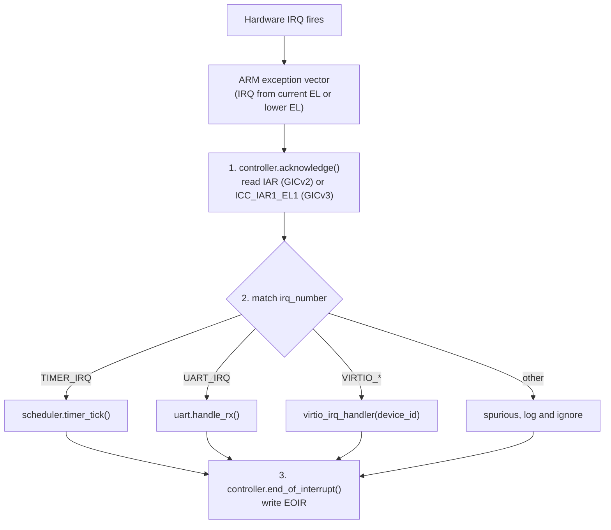
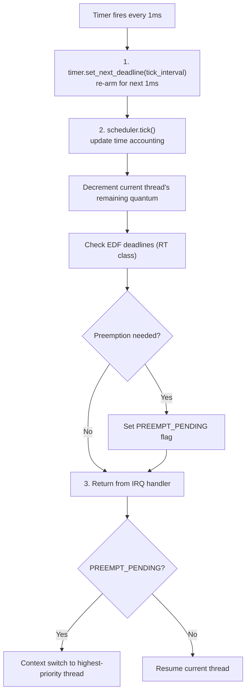
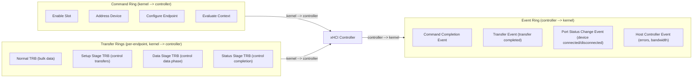
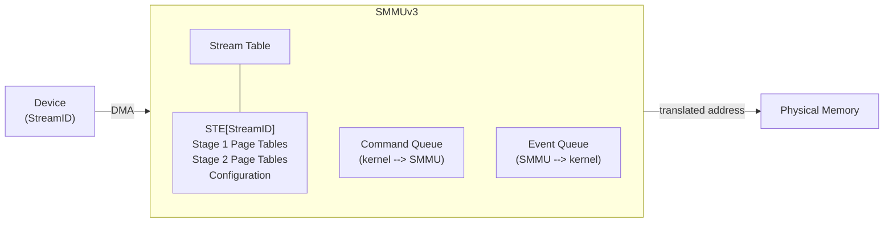
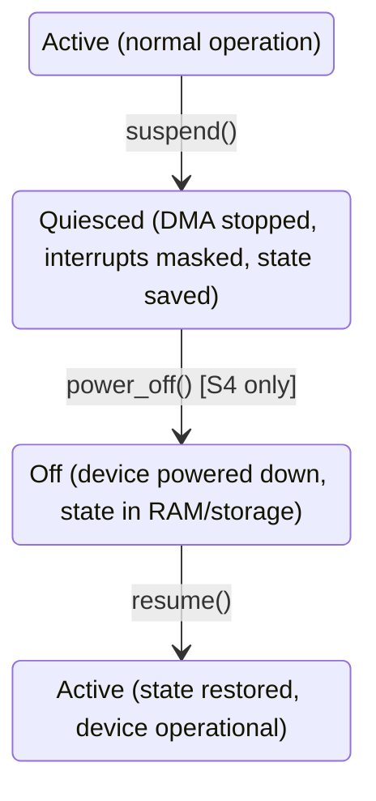

# AIOS Hardware Abstraction Layer (HAL)

## Deep Technical Architecture

**Parent document:** [architecture.md](../project/architecture.md) — Section 2.1 Full Stack Overview (Hardware Abstraction Layer)
**Related:** [boot.md](./boot.md) — Boot sequence and platform detection, [subsystem-framework.md](../platform/subsystem-framework.md) — Userspace device management, [scheduler.md](./scheduler.md) — Timer and GIC integration

-----

## 1. Overview

The HAL is the lowest layer of the AIOS kernel. It sits directly on hardware and exposes a uniform interface that the rest of the kernel programs against. The kernel never touches raw MMIO registers or device-specific data structures outside the HAL — all hardware access flows through trait implementations.

The HAL has one design goal: **adding a new platform is implementing seven methods.** A platform is a specific hardware board — QEMU virt, Raspberry Pi 4 (BCM2711), Raspberry Pi 5 (BCM2712), Apple Silicon Macs (M1–M4), or any future aarch64 board. Each platform provides different hardware for the same logical functions (interrupts, timer, serial, GPU, network, storage, RNG). The HAL abstracts these differences behind a single `Platform` trait with seven initialization methods. For hardware that only some platforms provide (USB, WiFi, Bluetooth), the HAL uses extension traits that platforms opt into — see Section 12.

### 1.1 HAL Boundary

```mermaid
flowchart TD
    subgraph KC["Kernel Core"]
        KCD["`scheduler, IPC, capability manager, memory manager
Programs against abstract types:
InterruptController, Timer, Uart, GpuDevice,
NetworkDevice, StorageDevice, RngDevice`"]
    end

    KC --- HAL["HAL BOUNDARY — Platform trait + device traits"]

    subgraph PI["Platform Implementations (aarch64)"]
        subgraph QEMU["QemuPlatform"]
            direction LR
            Q1["GICv3"]
            Q2["ARM Gen Timer"]
            Q3["PL011 UART"]
            Q4["VirtIO-GPU"]
            Q5["VirtIO-Net"]
            Q6["VirtIO-Blk"]
            Q7["VirtIO-RNG"]
        end
        subgraph PI4["Pi4Platform"]
            direction LR
            P41["GICv2"]
            P42["ARM Timer"]
            P43["PL011"]
            P44["VC4/V3D"]
            P45["Genet"]
            P46["SD/eMMC"]
            P47["bcm2835"]
        end
        subgraph PI5["Pi5Platform"]
            direction LR
            P51["GICv3"]
            P52["ARM Timer"]
            P53["PL011"]
            P54["V3D 7.1"]
            P55["Genet"]
            P56["SD/eMMC"]
            P57["bcm2835"]
        end
        subgraph APPLE["AppleSilicon"]
            direction LR
            A1["AIC"]
            A2["ARM Timer"]
            A3["S5L UART"]
            A4["AGX GPU"]
            A5["PCIe NIC"]
            A6["ANS NVMe"]
            A7["Apple TRNG"]
        end
    end

    HAL --- PI
    PI --- HW["Raw Hardware (MMIO registers, device memory, DMA)"]
```



### 1.2 What the HAL Is Not

The HAL handles **boot-time hardware initialization and kernel-level device access**. It does not cover:

- **Userspace device management** — handled by the Subsystem Framework (subsystem-framework.md). The Subsystem Framework builds on top of HAL-initialized devices.
- **Hot-plug device discovery** — handled by the Device Registry service in userspace. The HAL only initializes hardware present at boot.
- **High-level protocols** — TCP/IP, TLS, HTTP are userspace concerns. The HAL provides raw network device access.

-----

## 2. Platform Detection

Platform detection runs during kernel early boot (boot.md §3.3, Step 4) after the device tree is parsed. The kernel reads the root `compatible` string from the flattened device tree and selects the matching platform implementation:

```rust
/// Selected at boot time by reading the DTB compatible string.
pub fn detect_platform(dt: &DeviceTree) -> Box<dyn Platform> {
    let compat = dt.root_compatible();
    match compat {
        c if c.contains("qemu") => Box::new(QemuPlatform),
        c if c.contains("brcm,bcm2711") => Box::new(RaspberryPi4Platform),
        c if c.contains("brcm,bcm2712") => Box::new(RaspberryPi5Platform),
        c if c.contains("apple,t8103") => Box::new(AppleSiliconPlatform::new(AppleSoc::T8103)),
        c if c.contains("apple,t6000") => Box::new(AppleSiliconPlatform::new(AppleSoc::T6000)),
        c if c.contains("apple,t6020") => Box::new(AppleSiliconPlatform::new(AppleSoc::T6020)),
        c if c.contains("apple,t6031") => Box::new(AppleSiliconPlatform::new(AppleSoc::T6031)),
        c if c.contains("apple,t6040") => Box::new(AppleSiliconPlatform::new(AppleSoc::T6040)),
        _ => panic!("Unknown platform: {}", compat),
    }
}
```

**Compatible strings by platform:**

| Platform | DTB Compatible String | SoC |
|---|---|---|
| QEMU virt | `qemu,virt` | Virtual |
| Raspberry Pi 4 | `brcm,bcm2711` | BCM2711 |
| Raspberry Pi 5 | `brcm,bcm2712` | BCM2712 |
| Apple M1 | `apple,t8103` | T8103 |
| Apple M1 Pro/Max | `apple,t6000` | T6000 |
| Apple M2 | `apple,t6020` | T6020 |
| Apple M3 | `apple,t6031` | T6031 |
| Apple M4 | `apple,t6040` | T6040 |

Apple Silicon Macs use a device tree (ADT — Apple Device Tree) that the Asahi Linux bootloader (m1n1) converts to a standard flattened device tree format compatible with Linux/AIOS. The compatible strings follow the `apple,tXXXX` convention where the number identifies the SoC.

The detected platform is stored in `KernelState.platform` and used for all subsequent hardware initialization.

-----

## 3. Platform Trait

The `Platform` trait is the core abstraction. Every supported platform implements seven `init_*` methods — one for each hardware class the kernel needs during boot — plus an `as_any()` method for extension trait discovery (§12.3):

```rust
pub trait Platform: Send + Sync {
    /// Initialize the interrupt controller.
    ///
    /// QEMU / Pi 5: GICv3 (distributor + redistributor per CPU).
    /// Pi 4: GICv2 GIC-400 (distributor + CPU interface).
    /// Apple Silicon: AIC (Apple Interrupt Controller) — custom, not GIC.
    ///
    /// Called during early boot Step 5. The returned controller is stored
    /// in KernelState and used by the scheduler for IRQ routing.
    fn init_interrupts(&self, dt: &DeviceTree) -> Result<InterruptController>;

    /// Initialize the system timer.
    ///
    /// All platforms use the ARM Generic Timer (CNTFRQ_EL0), but the
    /// frequency varies. QEMU: 62.5 MHz. Pi 4/5: 54 MHz. Apple: 24 MHz.
    ///
    /// Called during early boot Step 6. Configures the 1ms scheduler tick.
    fn init_timer(&self, dt: &DeviceTree) -> Result<Timer>;

    /// Initialize the serial console.
    ///
    /// QEMU / Pi 4/5: PL011 UART (ARM standard).
    /// Apple Silicon: S5L UART (Samsung-derived, Apple custom registers).
    ///
    /// Called during early boot Step 3. From this point kprintln!() works.
    fn init_uart(&self, dt: &DeviceTree) -> Result<Uart>;

    /// Initialize the GPU / display controller.
    ///
    /// QEMU: VirtIO-GPU (virtqueue-based, wgpu backend).
    /// Pi 4: VideoCore VI (VC4/V3D, Vulkan 1.0).
    /// Pi 5: VideoCore VII (V3D 7.1, Vulkan 1.2).
    /// Apple: AGX GPU (Apple custom, tile-based deferred renderer).
    ///
    /// Called during Phase 2 (core services) when the Display Subsystem
    /// starts. Returns a device handle the compositor programs against.
    fn init_gpu(&self, dt: &DeviceTree) -> Result<GpuDevice>;

    /// Initialize the primary network interface.
    ///
    /// QEMU: VirtIO-Net (virtqueue-based).
    /// Pi 4/5: Broadcom Genet (BCM54213PE Gigabit Ethernet).
    /// Apple: PCIe Ethernet (Broadcom via Thunderbolt adapter or built-in).
    ///
    /// Called during Phase 2 when the Network Subsystem starts.
    /// Returns a device handle for the smoltcp network stack.
    fn init_network(&self, dt: &DeviceTree) -> Result<NetworkDevice>;

    /// Initialize the primary storage controller.
    ///
    /// QEMU: VirtIO-Blk (virtqueue-based).
    /// Pi 4/5: Arasan SDHCI (SD/eMMC) + XHCI (USB storage).
    /// Apple: ANS NVMe (Apple custom NVMe controller).
    ///
    /// Called during Phase 1 when the Block Engine starts.
    /// Returns a device handle for raw block I/O.
    fn init_storage(&self, dt: &DeviceTree) -> Result<StorageDevice>;

    /// Initialize the hardware random number generator.
    ///
    /// QEMU: VirtIO-RNG (virtqueue-based).
    /// Pi 4/5: bcm2835-rng (MMIO register).
    /// Apple: Apple TRNG (hardware true random number generator).
    ///
    /// Called during early boot Step 10 (before KASLR). Supplements the
    /// one-shot UEFI rng_seed with a persistent entropy source for runtime
    /// crypto: capability token generation, nonces, key derivation.
    fn init_rng(&self, dt: &DeviceTree) -> Result<RngDevice>;

    /// Allows downcasting to concrete platform type for extension trait checks.
    /// See §12.3 for the runtime discovery pattern.
    fn as_any(&self) -> &dyn Any;
}
```

### 3.1 Platform Implementations

Platform structs are either zero-sized (boards with fixed SoCs) or carry minimal config (Apple SoC variant for driver selection). All device state lives in the returned device handles, not in the platform struct itself:

```rust
// Fixed SoC, zero-sized
pub struct QemuPlatform;
pub struct RaspberryPi4Platform;
pub struct RaspberryPi5Platform;

// Apple Silicon — carries SoC variant for driver selection
pub struct AppleSiliconPlatform {
    soc: AppleSoc,
}

pub enum AppleSoc {
    T8103,  // M1
    T6000,  // M1 Pro/Max
    T6020,  // M2
    T6031,  // M3
    T6040,  // M4
}
```

Apple Silicon carries the SoC variant because different generations have different GPU cores (AGX G13–G16), display controllers, and peripheral IP. The SoC enum selects the correct driver paths within each `init_*` method.

> **Future:** The `Platform` trait is architecture-independent by design. If x86_64 support (Intel, AMD) is added in the future, it would require a parallel `kernel/arch/x86_64/` module and ACPI-based device discovery alongside the device tree path, but the same seven trait methods would apply.

### 3.2 Initialization Order

The seven methods are not called all at once. They're called at specific points during boot as their dependencies become available:

```
Early Boot (kernel space):
  Step 3:  init_uart()        — first sign of life (no heap)
  Step 5:  init_interrupts()  — enables IRQ routing (no heap)
  Step 6:  init_timer()       — enables preemptive scheduling (no heap)
  ──── Step 9: heap initialized ────
  Step 10: init_rng()         — entropy for KASLR and runtime crypto

Service Manager Phases (userspace, heap available):
  Phase 1: init_storage()     — Block Engine needs raw block access
  Phase 2: init_gpu()         — Display Subsystem needs GPU handle
  Phase 2: init_network()     — Network Subsystem needs NIC handle
```

UART, interrupts, and timer run before the heap exists (Steps 3/5/6) and must use only stack and static allocation. RNG runs just after heap init (Step 10) so VirtIO-RNG can allocate its virtqueue; the bcm2835-rng is pure MMIO but uniformity keeps the code simple. Storage, GPU, and network run in userspace service manager phases and can allocate freely.

This initialization order is the same across all platforms. The only difference is what hardware each step initializes — GIC vs AIC for interrupts, PL011 vs S5L for UART, etc. The `Platform` trait ensures each implementation handles its own hardware correctly.

-----

## 4. Device Abstractions

Each `init_*` method returns a device handle that abstracts the underlying hardware. The kernel and userspace services program against these abstractions.

### 4.1 InterruptController

```rust
/// Abstraction over GICv2, GICv3, and Apple AIC.
pub struct InterruptController {
    variant: IrqControllerVariant,
    max_irqs: u32,
}

enum IrqControllerVariant {
    /// ARM GICv2 (Pi 4): distributor + CPU interface.
    GicV2 {
        distributor_base: *mut u8,
        cpu_interface_base: *mut u8,
    },
    /// ARM GICv3 (QEMU, Pi 5): distributor + per-CPU redistributor.
    GicV3 {
        distributor_base: *mut u8,
        redistributor_base: *mut u8,
        redistributor_stride: usize,
    },
    /// Apple Interrupt Controller (Apple Silicon): single MMIO block,
    /// event-driven model with hardware IRQ → event mapping.
    Aic {
        base: *mut u8,
        version: AicVersion,
        num_irqs: u32,
    },
}

pub enum AicVersion {
    V1,  // M1 family
    V2,  // M2+ family (extended die support)
}

impl InterruptController {
    /// Enable a specific interrupt (SPI, PPI, or SGI).
    pub fn enable_irq(&self, irq: u32);

    /// Disable a specific interrupt.
    pub fn disable_irq(&self, irq: u32);

    /// Acknowledge an interrupt (read IAR). Returns the interrupt ID.
    /// Called by the IRQ handler at the start of interrupt servicing.
    pub fn acknowledge(&self) -> u32;

    /// Signal end-of-interrupt (write EOIR).
    /// Called by the IRQ handler after servicing completes.
    pub fn end_of_interrupt(&self, irq: u32);

    /// Set interrupt priority (0 = highest, 255 = lowest).
    pub fn set_priority(&self, irq: u32, priority: u8);

    /// Route an interrupt to a specific CPU (GICv3: affinity routing).
    pub fn set_target(&self, irq: u32, cpu: u32);

    /// Send a software-generated interrupt (SGI) to another CPU.
    /// Used for inter-processor interrupts (IPI) during SMP bringup.
    pub fn send_ipi(&self, target_cpu: u32, sgi_id: u32);

    /// Return the interrupt controller type for platform-specific paths.
    pub fn controller_type(&self) -> IrqControllerType;
}

pub enum IrqControllerType {
    GicV2,
    GicV3,
    Aic,
}
```

**Interrupt controller differences handled internally:**

| Operation | GICv2 (Pi 4) | GICv3 (QEMU, Pi 5) | AIC (Apple) |
|---|---|---|---|
| Acknowledge IRQ | Read GICC_IAR | Read ICC_IAR1_EL1 | Read AIC_EVENT |
| End of interrupt | Write GICC_EOIR | Write ICC_EOIR1_EL1 | Write AIC_SW_CLR |
| CPU target | GICD_ITARGETSR (bitmap) | GICD_IROUTER (affinity) | AIC_TARGET_CPU |
| Per-CPU config | GICC_* registers | GICR_* per redistributor | Per-die AIC regs |
| IPI mechanism | GICD_SGIR | ICC_SGI1R_EL1 | AIC_IPI_SEND |
| Max IRQs | 1020 SPIs | 1020+ (LPIs) | ~1024 |

### 4.2 Timer

```rust
/// ARM Generic Timer abstraction.
///
/// All aarch64 platforms use the ARM architectural timer. Differences are
/// limited to frequency (read from CNTFRQ_EL0) and the GIC/AIC IRQ
/// number for timer interrupts (read from device tree).
pub struct Timer {
    frequency_hz: u64,
    tick_interval: u64,     // counter ticks per scheduler tick (1ms)
    timer_irq: u32,         // IRQ number for the physical timer
}

impl Timer {
    /// Read the current counter value (CNTVCT_EL0).
    pub fn now(&self) -> u64;

    /// Convert counter ticks to nanoseconds.
    pub fn ticks_to_ns(&self, ticks: u64) -> u64;

    /// Convert nanoseconds to counter ticks.
    pub fn ns_to_ticks(&self, ns: u64) -> u64;

    /// Set the next timer interrupt to fire after `ticks` counter ticks.
    /// Writes CNTP_CVAL_EL0 = CNTVCT_EL0 + ticks.
    pub fn set_next_deadline(&self, ticks: u64);

    /// Enable the physical timer (CNTP_CTL_EL0.ENABLE = 1).
    pub fn enable(&self);

    /// Disable the physical timer.
    pub fn disable(&self);

    /// Return the timer frequency in Hz.
    pub fn frequency(&self) -> u64;

    /// Return the IRQ number for this timer.
    pub fn irq(&self) -> u32;
}
```

**Timer frequencies by platform:**

| Platform | CNTFRQ_EL0 | Ticks per 1ms |
|---|---|---|
| QEMU virt | 62,500,000 Hz | 62,500 |
| Raspberry Pi 4 | 54,000,000 Hz | 54,000 |
| Raspberry Pi 5 | 54,000,000 Hz | 54,000 |
| Apple Silicon | 24,000,000 Hz | 24,000 |

### 4.3 Uart

```rust
/// Serial console abstraction.
///
/// QEMU / Pi 4/5: PL011 (ARM standard UART).
/// Apple Silicon: S5L UART (Samsung-derived, Apple custom).
pub struct Uart {
    variant: UartVariant,
}

enum UartVariant {
    /// ARM PL011 UART — MMIO at base address from device tree.
    Pl011 { base: *mut u8 },
    /// Apple S5L UART — MMIO, different register layout from PL011.
    S5l { base: *mut u8 },
}

impl Uart {
    /// Write a single byte. Blocks if the transmit FIFO is full.
    pub fn write_byte(&self, byte: u8);

    /// Read a single byte. Returns None if the receive FIFO is empty.
    pub fn read_byte(&self) -> Option<u8>;

    /// Write a string (convenience wrapper over write_byte).
    pub fn write_str(&self, s: &str);

    /// Check if data is available to read.
    pub fn has_data(&self) -> bool;

    /// Flush the transmit FIFO (wait until all bytes are sent).
    pub fn flush(&self);
}
```

The UART is initialized to 115200 baud, 8N1, no flow control on all platforms. Configuration is hardcoded — there's no need for runtime baud rate changes.

**PL011 registers used (offset from base) — QEMU, Pi 4/5:**

| Register | Offset | Purpose |
|---|---|---|
| UARTDR | 0x000 | Data register (read/write) |
| UARTFR | 0x018 | Flag register (TXFF, RXFE bits) |
| UARTIBRD | 0x024 | Integer baud rate divisor |
| UARTFBRD | 0x028 | Fractional baud rate divisor |
| UARTLCR_H | 0x02C | Line control (8N1 config) |
| UARTCR | 0x030 | Control register (enable TX/RX) |
| UARTIMSC | 0x038 | Interrupt mask |

**Apple S5L UART registers (offset from base) — Apple Silicon:**

The S5L UART uses a Samsung-derived register layout documented in the Asahi Linux project:

| Register | Offset | Purpose |
|---|---|---|
| ULCON | 0x000 | Line control (8N1 config) |
| UCON | 0x004 | Control register (TX/RX mode) |
| UFCON | 0x008 | FIFO control register |
| UTRSTAT | 0x010 | TX/RX status (buffer empty/ready bits) |
| UTXH | 0x020 | Transmit data register |
| URXH | 0x024 | Receive data register |

### 4.4 GpuDevice

```rust
/// GPU device abstraction.
///
/// Provides the interface the Display Subsystem and Compositor
/// program against. Hides VirtIO-GPU vs VideoCore differences.
pub struct GpuDevice {
    variant: GpuVariant,
    capabilities: GpuCapabilities,
}

enum GpuVariant {
    VirtioGpu {
        virtqueues: VirtioQueues,
        scanout_id: u32,
    },
    VideoCore {
        v3d_base: *mut u8,
        hvs_base: *mut u8,
        version: VideoCoreVersion,
    },
    /// Apple AGX GPU — custom command submission, tile-based deferred renderer.
    AppleAgx {
        sgx_base: *mut u8,        // GPU MMIO base
        uat_base: *mut u8,        // Unified Address Translation (GPU page tables)
        generation: AgxGeneration,
    },
}

pub enum VideoCoreVersion {
    /// Raspberry Pi 4: VC4/V3D 4.2, Vulkan 1.0
    V4,
    /// Raspberry Pi 5: V3D 7.1, Vulkan 1.2
    V7,
}

pub enum AgxGeneration {
    G13,  // M1 family
    G14,  // M2 family
    G15,  // M3 family
    G16,  // M4 family
}

pub struct GpuCapabilities {
    pub max_texture_size: u32,
    pub max_framebuffers: u32,
    pub vulkan_version: Option<(u32, u32)>,  // (major, minor)
    pub supports_compute: bool,
    pub video_memory_bytes: usize,
}

impl GpuDevice {
    /// Allocate a framebuffer of the given dimensions.
    pub fn allocate_framebuffer(
        &self,
        width: u32,
        height: u32,
        format: PixelFormat,
    ) -> Result<Framebuffer>;

    /// Present a framebuffer to the display (page flip / scanout).
    pub fn present(&self, fb: &Framebuffer) -> Result<()>;

    /// Return the current display resolution.
    pub fn display_resolution(&self) -> (u32, u32);

    /// Set the display resolution (if supported).
    pub fn set_resolution(&self, width: u32, height: u32) -> Result<()>;

    /// Return the GPU capabilities for this platform.
    pub fn capabilities(&self) -> &GpuCapabilities;

    /// Create a render context for the wgpu backend.
    /// The compositor uses this to obtain a wgpu::Device.
    pub fn create_render_context(&self) -> Result<RenderContext>;
}
```

**GPU differences by platform:**

| Feature | QEMU (VirtIO-GPU) | Pi 4 (VC4) | Pi 5 (V3D 7.1) | Apple (AGX) |
|---|---|---|---|---|
| API | VirtIO virtqueues | V3D MMIO | V3D MMIO | AGX command buffers |
| Vulkan | Via host GPU | 1.0 (conformant) | 1.2 (conformant) | 1.2 (via MoltenVK-like) |
| Compute shaders | Host-dependent | No | Yes | Yes |
| Video memory | Shared (host) | 256 MB dedicated | 512 MB dedicated | Unified (shared with CPU) |
| Max resolution | Host-dependent | 4K@60 (single) | 4K@60 (dual) | 6K@60 (ProRes display) |

### 4.5 NetworkDevice

```rust
/// Network device abstraction.
///
/// Provides raw frame send/receive for the smoltcp network stack.
/// Hides VirtIO-Net vs Broadcom Genet differences.
pub struct NetworkDevice {
    variant: NetworkVariant,
    mac_address: [u8; 6],
    mtu: u16,
}

enum NetworkVariant {
    VirtioNet {
        rx_queue: VirtioQueue,
        tx_queue: VirtioQueue,
    },
    BroadcomGenet {
        base: *mut u8,
        dma_base: *mut u8,
        phy_addr: u8,
    },
    /// Apple PCIe NIC — Broadcom BCM5719 via Thunderbolt Ethernet adapter
    /// or built-in Ethernet on Mac mini/Mac Studio/Mac Pro.
    ApplePcieNic {
        mmio_base: *mut u8,
    },
}

impl NetworkDevice {
    /// Send a raw Ethernet frame.
    pub fn transmit(&self, frame: &[u8]) -> Result<()>;

    /// Receive a raw Ethernet frame into the provided buffer.
    /// Returns the number of bytes written, or None if no frame is available.
    pub fn receive(&self, buffer: &mut [u8]) -> Result<Option<usize>>;

    /// Return the MAC address.
    pub fn mac_address(&self) -> [u8; 6];

    /// Return the maximum transmission unit.
    pub fn mtu(&self) -> u16;

    /// Check if the link is up.
    pub fn link_up(&self) -> bool;

    /// Return the negotiated link speed in Mbps (10, 100, 1000).
    pub fn link_speed(&self) -> u32;
}
```

**Network differences by platform:**

| Feature | QEMU (VirtIO-Net) | Pi 4/5 (Genet) | Apple (PCIe NIC) |
|---|---|---|---|
| Interface | Virtqueue (2 queues) | MMIO + DMA rings | PCIe BAR + DMA |
| Speed | Host-dependent | 1 Gbps | 1–10 Gbps |
| MAC address | QEMU-assigned | OTP fuses | EFI variable |
| Checksum offload | Via virtio features | Hardware | Hardware |
| MTU | 1500 (configurable) | 1500 | 1500 (9000 jumbo) |

### 4.6 StorageDevice

```rust
/// Block storage device abstraction.
///
/// Provides raw block read/write for the Block Engine.
/// Hides VirtIO-Blk vs SD/eMMC differences.
pub struct StorageDevice {
    variant: StorageVariant,
    block_size: u32,
    total_blocks: u64,
}

enum StorageVariant {
    VirtioBlk {
        virtqueue: VirtioQueue,
    },
    SdMmc {
        sdhci_base: *mut u8,
        card_type: SdCardType,
    },
    /// Apple ANS NVMe — Apple's custom NVMe controller.
    /// Uses Apple-specific command submission and power management.
    AppleAns {
        base: *mut u8,
        ans_version: u32,
    },
}

pub enum SdCardType {
    SdHc,    // SD High Capacity
    SdXc,    // SD Extended Capacity
    Emmc,    // Embedded MMC
}

impl StorageDevice {
    /// Read `count` blocks starting at `lba` into `buffer`.
    /// Buffer must be at least count * block_size bytes.
    pub fn read_blocks(
        &self,
        lba: u64,
        count: u32,
        buffer: &mut [u8],
    ) -> Result<()>;

    /// Write `count` blocks starting at `lba` from `buffer`.
    pub fn write_blocks(
        &self,
        lba: u64,
        count: u32,
        buffer: &[u8],
    ) -> Result<()>;

    /// Return the block size in bytes (typically 512).
    pub fn block_size(&self) -> u32;

    /// Return the total number of blocks.
    pub fn total_blocks(&self) -> u64;

    /// Return the total capacity in bytes.
    pub fn capacity_bytes(&self) -> u64 {
        self.total_blocks * self.block_size as u64
    }

    /// Flush any cached writes to stable storage.
    pub fn flush(&self) -> Result<()>;
}
```

**Storage differences by platform:**

| Feature | QEMU (VirtIO-Blk) | Pi 4/5 (SD/eMMC) | Apple (ANS NVMe) |
|---|---|---|---|
| Interface | Virtqueue (1 queue) | SDHCI (Arasan) | Apple ANS |
| Block size | 512 bytes | 512 bytes | 4096 bytes |
| Max capacity | Host file size | Card dependent | Up to 8 TB |
| Flush semantics | Host fsync | CMD12/CMD23 | NVMe flush |
| DMA | VirtIO scatter-gather | ADMA2 | Apple IOMMU (DART) |
| Typical speed | Host disk speed | ~90 MB/s (UHS-I) | ~3–7 GB/s |

### 4.7 RngDevice

```rust
/// Hardware random number generator abstraction.
///
/// Provides cryptographically secure random bytes for KASLR,
/// capability token generation, nonce creation, and key derivation.
/// Supplements the one-shot UEFI rng_seed from BootInfo.
pub struct RngDevice {
    variant: RngVariant,
}

enum RngVariant {
    VirtioRng {
        virtqueue: VirtioQueue,
    },
    Bcm2835 {
        base: *mut u8,
    },
    /// Apple TRNG — hardware true random number generator.
    AppleTrng {
        base: *mut u8,
    },
}

impl RngDevice {
    /// Fill `buffer` with cryptographically secure random bytes.
    /// Blocks until the hardware RNG has enough entropy.
    pub fn fill_bytes(&self, buffer: &mut [u8]) -> Result<()>;

    /// Read a single random u64. Convenience wrapper.
    pub fn next_u64(&self) -> Result<u64>;

    /// Check if the RNG has entropy available (non-blocking).
    pub fn entropy_available(&self) -> bool;
}
```

**RNG differences by platform:**

| Feature | QEMU (VirtIO-RNG) | Pi 4/5 (bcm2835-rng) | Apple (TRNG) |
|---|---|---|---|
| Interface | Virtqueue (1 queue) | MMIO (4 registers) | MMIO |
| Entropy source | Host `/dev/urandom` | Hardware TRNG | Hardware TRNG |
| Throughput | Host-dependent | ~1 MB/s | ~10 MB/s |
| Blocking | Via virtqueue completion | Poll RNG_STATUS register | Poll status register |

**bcm2835-rng registers (offset from base):**

| Register | Offset | Purpose |
|---|---|---|
| RNG_CTRL | 0x00 | Control register (enable bit) |
| RNG_STATUS | 0x04 | Status (bits 24:0 = words available) |
| RNG_DATA | 0x08 | Random data output (32 bits) |

-----

## 5. MMIO Access

All HAL device drivers access hardware through memory-mapped I/O. The HAL provides safe MMIO primitives that enforce volatile semantics and correct memory ordering:

```rust
/// Read a 32-bit register at `base + offset`.
/// Uses volatile read + compiler fence.
#[inline(always)]
pub unsafe fn mmio_read32(base: *const u8, offset: usize) -> u32 {
    let addr = base.add(offset) as *const u32;
    core::ptr::read_volatile(addr)
}

/// Write a 32-bit register at `base + offset`.
/// Uses volatile write + compiler fence.
#[inline(always)]
pub unsafe fn mmio_write32(base: *mut u8, offset: usize, value: u32) {
    let addr = base.add(offset) as *mut u32;
    core::ptr::write_volatile(addr, value);
}

/// Read-modify-write: set specific bits in a register.
#[inline(always)]
pub unsafe fn mmio_set_bits32(base: *mut u8, offset: usize, bits: u32) {
    let val = mmio_read32(base, offset);
    mmio_write32(base, offset, val | bits);
}

/// Read-modify-write: clear specific bits in a register.
#[inline(always)]
pub unsafe fn mmio_clear_bits32(base: *mut u8, offset: usize, bits: u32) {
    let val = mmio_read32(base, offset);
    mmio_write32(base, offset, val & !bits);
}
```

MMIO regions are mapped with device memory attributes (nGnRnE — non-Gathering, non-Reordering, non-Early-write-acknowledgement) in the kernel page tables. This prevents the CPU from reordering or caching device register accesses. The mapping is set up in boot.md §3.3 Step 7 at virtual address `0xFFFF_0002_0000_0000`.

-----

## 6. VirtIO Transport

QEMU devices use the VirtIO specification. The HAL includes a shared VirtIO transport layer used by VirtIO-GPU, VirtIO-Net, and VirtIO-Blk:

```rust
/// A VirtIO virtqueue (shared ring buffer between driver and device).
pub struct VirtioQueue {
    descriptors: *mut VirtqDesc,
    avail: *mut VirtqAvail,
    used: *mut VirtqUsed,
    queue_size: u16,
    free_head: u16,
    last_used_idx: u16,
}

#[repr(C)]
struct VirtqDesc {
    addr: u64,       // physical address of buffer
    len: u32,        // buffer length
    flags: u16,      // NEXT, WRITE, INDIRECT
    next: u16,       // index of next descriptor in chain
}

impl VirtioQueue {
    /// Add a buffer chain to the available ring.
    pub fn submit(&mut self, buffers: &[VirtioBuffer]) -> Result<u16>;

    /// Check for completed buffers in the used ring.
    pub fn poll_used(&mut self) -> Option<(u16, u32)>;

    /// Notify the device that new buffers are available.
    pub fn notify(&self, transport: &VirtioTransport);
}

/// VirtIO transport (MMIO-based for QEMU virt machine).
pub struct VirtioTransport {
    base: *mut u8,
}

impl VirtioTransport {
    /// Probe for a VirtIO device at the given MMIO address.
    /// Reads the magic value, version, and device ID.
    pub fn probe(base: *mut u8) -> Option<VirtioDeviceInfo>;

    /// Negotiate features with the device.
    pub fn negotiate_features(&self, driver_features: u64) -> u64;

    /// Set up a virtqueue.
    pub fn setup_queue(&self, queue_index: u16, queue: &VirtioQueue);

    /// Mark the driver as ready (DRIVER_OK status bit).
    pub fn activate(&self);
}
```

VirtIO devices are discovered from the device tree. Each VirtIO MMIO device has a node like:

```
virtio_mmio@a000000 {
    compatible = "virtio,mmio";
    reg = <0x0 0xa000000 0x0 0x200>;
    interrupts = <GIC_SPI 16 IRQ_TYPE_EDGE_RISING>;
};
```

The HAL enumerates all `virtio,mmio` nodes, probes each one, and matches the device ID to the appropriate driver (GPU = 16, Net = 1, Blk = 2).

-----

## 7. Adding a New Platform

To add support for a new aarch64 board, implement the seven `Platform` trait methods:

### 7.1 Steps

1. **Add a platform struct** in `kernel/hal/platforms/`:

```rust
pub struct NewBoardPlatform;
```

2. **Add the DTB compatible string** to `detect_platform()`:

```rust
c if c.contains("vendor,board-soc") => Box::new(NewBoardPlatform),
```

3. **Implement the seven trait methods.** Each method reads the device tree to find the relevant hardware node and its MMIO base address, then initializes the device:

```rust
impl Platform for NewBoardPlatform {
    fn init_interrupts(&self, dt: &DeviceTree) -> Result<InterruptController> {
        // Read the interrupt-controller node from dt
        // Determine GICv2 vs GICv3 from compatible string
        // Initialize distributor + per-CPU interface
    }

    fn init_timer(&self, dt: &DeviceTree) -> Result<Timer> {
        // Read CNTFRQ_EL0 for frequency
        // Read timer IRQ number from dt
        // Configure 1ms tick
    }

    fn init_uart(&self, dt: &DeviceTree) -> Result<Uart> {
        // Read UART node from dt (or /chosen/stdout-path)
        // PL011 is common; other UART types need new driver code
    }

    fn init_gpu(&self, dt: &DeviceTree) -> Result<GpuDevice> {
        // Platform-specific GPU driver
        // Must implement allocate_framebuffer + present + create_render_context
    }

    fn init_network(&self, dt: &DeviceTree) -> Result<NetworkDevice> {
        // Platform-specific NIC driver
        // Must implement transmit + receive
    }

    fn init_storage(&self, dt: &DeviceTree) -> Result<StorageDevice> {
        // Platform-specific storage driver
        // Must implement read_blocks + write_blocks + flush
    }

    fn init_rng(&self, dt: &DeviceTree) -> Result<RngDevice> {
        // Platform-specific hardware RNG
        // Must implement fill_bytes
    }
}
```

4. **Test on QEMU** (if the board can be emulated) or on real hardware via UART serial console.

### 7.2 What Stays the Same Across Platforms

The following kernel components are platform-independent and do not change when adding a new board:

- Page table format (4-level, 4 KiB granule, 48-bit VA)
- Exception vector table layout
- Syscall interface (SVC #0)
- Capability system
- IPC message format
- Scheduler algorithm
- Memory allocators (buddy + slab)
- All userspace services

### 7.3 What Changes Per Platform

| Component | What varies |
|---|---|
| Interrupt controller | GICv2 vs GICv3 vs AIC (register layout, acknowledge/EOI path) |
| Timer | Frequency only (CNTFRQ_EL0 value) — all aarch64 platforms use ARM Generic Timer |
| UART | PL011 (QEMU, Pi) vs S5L (Apple) — different register layouts |
| GPU | Entire driver (VirtIO vs VC4 vs V3D vs AGX) |
| Network | Entire driver (VirtIO vs Genet vs PCIe NIC) |
| Storage | Entire driver (VirtIO vs SDHCI vs ANS NVMe) |
| RNG | Driver + register layout (VirtIO vs bcm2835 vs Apple TRNG) |

The timer is the simplest to port — only the frequency changes (all aarch64 platforms share the ARM Generic Timer). The interrupt controller requires understanding GIC or AIC but follows a standard pattern. UART is straightforward if the platform uses PL011; Apple's S5L requires a new driver but is well-documented via Asahi Linux. GPU, network, and storage require full device drivers for each new hardware type.

-----

## 8. Kernel Integration

### 8.1 KernelState

The HAL-initialized devices are stored in the global `KernelState` structure (canonical definition in boot.md §3.2; reproduced here for HAL context):

```rust
pub struct KernelState {
    pub boot_info: &'static BootInfo,
    pub platform: &'static dyn Platform,
    pub boot_phase: EarlyBootPhase,

    // HAL devices (see hal.md for type definitions)
    pub interrupt_controller: Option<InterruptController>,
    pub timer: Option<Timer>,
    pub uart: Option<Uart>,
    pub rng: Option<RngDevice>,
    pub gpu: Option<GpuDevice>,
    pub network: Option<NetworkDevice>,
    pub storage: Option<StorageDevice>,

    // Memory
    pub page_allocator: Option<BuddyAllocator>,
    pub kernel_page_table: Option<PageTable>,
    pub heap: Option<SlabAllocator>,
    pub kaslr_offset: usize,

    // Core subsystems
    pub capability_manager: Option<CapabilityManager>,
    pub ipc: Option<IpcSubsystem>,
    pub audit_log: Option<AuditRingBuffer>,
    pub process_manager: Option<ProcessManager>,
    pub provenance: Option<ProvenanceChain>,
    pub scheduler: Option<Scheduler>,

    // Boot timing
    pub boot_start: u64,
    pub phase_timestamps: [u64; 17], // indexed by EarlyBootPhase as usize (0-based); resize if enum grows
}
```

The `Option` wrappers reflect the incremental initialization during boot — UART is `Some` after Step 3, interrupts after Step 5, timer after Step 6, RNG after Step 10, and so on. Accessing a device before its initialization step would panic.

### 8.2 IRQ Flow

The full interrupt path from hardware to handler:



### 8.3 Timer-Scheduler Integration

The timer drives the scheduler's preemption mechanism:



-----

## 9. DMA

Devices that perform DMA (VirtIO, Genet, SDHCI) need physical addresses for their buffer descriptors. The HAL provides DMA buffer allocation:

```rust
/// Allocate a physically contiguous, cache-coherent DMA buffer.
pub fn dma_alloc(size: usize, alignment: usize) -> Result<DmaBuffer> {
    let phys = page_allocator.alloc_contiguous(size, alignment)?;
    let virt = kernel_map_dma(phys, size)?;
    Ok(DmaBuffer { virt, phys, size })
}

pub struct DmaBuffer {
    pub virt: *mut u8,     // kernel virtual address (for CPU access)
    pub phys: u64,         // physical address (for device DMA)
    pub size: usize,
}

impl Drop for DmaBuffer {
    fn drop(&mut self) {
        kernel_unmap_dma(self.virt, self.size);
        page_allocator.free_contiguous(self.phys, self.size);
    }
}
```

DMA buffers are mapped with non-cacheable attributes to ensure coherency between CPU writes and device reads (and vice versa). On aarch64, this is achieved with the `Normal Non-Cacheable` memory type in the page table entry.

-----

## 10. Platform Comparison Reference

Complete hardware matrix for all supported platforms:

```
                        QEMU virt           Raspberry Pi 4      Raspberry Pi 5      Apple Silicon (M1–M4)
─────────────────────────────────────────────────────────────────────────────────────────────────────────
SoC                     Virtual             BCM2711             BCM2712             T8103/T6000/T6020+
CPU                     Cortex-A72 (emu)    Cortex-A72 (4x)    Cortex-A76 (4x)    Firestorm+Icestorm+
RAM                     Configurable        1/2/4/8 GB          4/8 GB              8/16/24/32/64/128 GB
──── HAL Devices (Platform trait, 7 methods) ───────────────────────────────────────────────────────────
Interrupt controller    GICv3 (virtual)     GIC-400 (GICv2)     GICv3               AIC (v1/v2)
Timer frequency         62.5 MHz            54 MHz              54 MHz              24 MHz
UART                    PL011               PL011               PL011               S5L UART
GPU                     VirtIO-GPU          VideoCore VI        VideoCore VII       AGX (G13–G16)
Network                 VirtIO-Net          Genet (1 Gbps)      Genet (1 Gbps)      PCIe NIC (1–10 Gbps)
Storage                 VirtIO-Blk          Arasan SDHCI        Arasan SDHCI        ANS NVMe (3–7 GB/s)
RNG                     VirtIO-RNG          bcm2835-rng         bcm2835-rng         Apple TRNG
──── Extension traits (see §12.6 for full matrix) ──────────────────────────────────────────────────────
USB                     XHCI (virtual)      XHCI (VL805)        XHCI (RP1)          XHCI (Thunderbolt)
Audio                   VirtIO-Sound        HDMI + I2S           HDMI + I2S          HDMI + I2S + speakers
Camera                  None                CSI-2 (1 port)       CSI-2 (2 ports)     FaceTime (ISP)
PCIe                    Virtual root        Gen 2 x1             Gen 3 x4            Thunderbolt 3/4
GPIO                    None                58 pins              28 pins (RP1)       None
DTB compatible          qemu,virt           brcm,bcm2711        brcm,bcm2712        apple,t8103+
```

-----

## 11. Design Principles

1. **Seven methods, one trait.** The Platform trait covers exactly the hardware every AIOS platform must provide: interrupts, timer, UART, GPU, network, storage, and RNG. If a board can't provide all seven, it can't run AIOS. Optional hardware (USB, WiFi, Bluetooth) uses extension traits (Section 12).
2. **Device tree as truth.** The HAL never hardcodes MMIO addresses. All addresses come from the device tree. This means the same binary can run on different revisions of the same board. Apple Silicon uses the Asahi Linux m1n1 bootloader to convert Apple's proprietary ADT into a standard flattened device tree.
3. **No runtime polymorphism in hot paths.** The `GicVariant` enum uses match statements, not trait objects, in the IRQ handler. The compiler inlines the correct path. Interrupt latency is the same as a hand-written driver.
4. **Early boot is allocation-free.** UART, interrupt controller, timer, and RNG initialization use only stack and static memory. The heap doesn't exist yet when these run.
5. **Later devices can allocate.** GPU, network, and storage init happens after the heap is available (Phase 1/2). These drivers can use `Vec`, `Box`, and other heap types.
6. **Platform structs are zero-sized.** All state lives in the returned device handles. The platform struct is just a namespace for the seven init methods.
7. **Extension traits for optional hardware.** The core trait is stable. New optional hardware classes are added as extension traits — existing platforms don't break (Section 12).

-----

## 12. Extension Traits

The core `Platform` trait has seven methods — the mandatory hardware every AIOS platform must provide. But some platforms have additional hardware that others don't. Extension traits handle this without bloating the core trait or breaking existing implementations.

### 12.1 Why Not Add More Methods to Platform?

Adding a method to `Platform` breaks every existing implementation. If we added `init_usb()` to the core trait, every platform would need to implement it — even platforms without USB. The choices would be:

- Return an error (but then the method isn't really "mandatory")
- Provide a default implementation that returns an error (hides the fact that the platform doesn't support it)
- Break the compile for all existing platforms

None of these are good. Extension traits solve this cleanly.

### 12.2 The Pattern

Extension traits extend `Platform` with optional capabilities. The kernel checks at runtime whether the current platform supports each extension:

```rust
/// Optional: platforms with a USB host controller implement this.
pub trait PlatformUsb: Platform {
    fn init_usb(&self, dt: &DeviceTree) -> Result<UsbController>;
}

/// Optional: platforms with WiFi hardware implement this.
pub trait PlatformWifi: Platform {
    fn init_wifi(&self, dt: &DeviceTree) -> Result<WifiDevice>;
}

/// Optional: platforms with Bluetooth hardware implement this.
pub trait PlatformBluetooth: Platform {
    fn init_bluetooth(&self, dt: &DeviceTree) -> Result<BluetoothController>;
}
```

Platforms opt in by implementing the extension trait:

```rust
// QEMU has virtual XHCI, so it implements PlatformUsb
impl PlatformUsb for QemuPlatform {
    fn init_usb(&self, dt: &DeviceTree) -> Result<UsbController> {
        // Initialize virtual XHCI controller
    }
}

// Pi 4 has VL805 XHCI
impl PlatformUsb for RaspberryPi4Platform {
    fn init_usb(&self, dt: &DeviceTree) -> Result<UsbController> {
        // Initialize VL805 XHCI via PCIe
    }
}

// A hypothetical headless board with no USB wouldn't implement PlatformUsb at all.
```

### 12.3 Runtime Discovery

The kernel uses `Any`-based downcasting to check if the platform supports an extension:

```rust
use core::any::Any;

/// Check if the platform supports an extension trait and initialize if so.
fn try_init_usb(platform: &dyn Platform, dt: &DeviceTree) -> Option<UsbController> {
    // The platform object is stored as Box<dyn Platform>.
    // We downcast to the concrete type, then check if it implements PlatformUsb.
    let any = platform.as_any();

    // Try each known platform type
    if let Some(qemu) = any.downcast_ref::<QemuPlatform>() {
        return Some(qemu.init_usb(dt).ok()?);
    }
    if let Some(pi4) = any.downcast_ref::<RaspberryPi4Platform>() {
        return Some(pi4.init_usb(dt).ok()?);
    }
    if let Some(pi5) = any.downcast_ref::<RaspberryPi5Platform>() {
        return Some(pi5.init_usb(dt).ok()?);
    }

    None // Platform doesn't support USB
}
```

To support this, the core `Platform` trait includes an `as_any` method:

```rust
pub trait Platform: Send + Sync {
    // ... the 7 core methods ...

    /// Allows downcasting to concrete platform type for extension trait checks.
    fn as_any(&self) -> &dyn Any;
}

// Every platform implements as_any trivially:
impl Platform for QemuPlatform {
    fn as_any(&self) -> &dyn Any { self }
    // ... 7 init methods ...
}
```

### 12.4 Core vs Extension Decision Rule

A hardware class belongs in the **core trait** if:
- Every realistic AIOS platform has it (interrupts, timer, UART, GPU, network, storage, RNG)
- The kernel cannot boot or function without it
- Absence means "this board cannot run AIOS"

A hardware class belongs in an **extension trait** if:
- Some platforms have it and others don't (USB, WiFi, Bluetooth, camera)
- The kernel can boot and function without it
- Absence means "this feature is unavailable," not "the OS is broken"

### 12.5 Extension Trait Catalog

Each extension trait follows the same pattern as §12.2. This catalog covers all optional hardware classes AIOS may support, organized by implementation priority.

#### Tier 1 — Planned (all current platforms have the hardware)

**`PlatformUsb`** — USB host controller.

```rust
pub trait PlatformUsb: Platform {
    fn init_usb(&self, dt: &DeviceTree) -> Result<UsbController>;
}
```

| Platform | Hardware | Notes |
|---|---|---|
| QEMU | XHCI (virtual) | Emulated xHCI controller |
| Pi 4 | VL805 XHCI | Via PCIe bridge on BCM2711 |
| Pi 5 | RP1 XHCI | Integrated in RP1 south bridge |

USB is a meta-subsystem — plugging in a device can surface new hardware for any subsystem (a webcam → Camera, a headset → Audio, a flash drive → Storage). The USB subsystem discovers devices, matches class drivers, and routes them to the appropriate subsystem via the Subsystem Framework (see subsystem-framework.md §USB).

**`PlatformAudio`** — Audio input/output.

```rust
pub trait PlatformAudio: Platform {
    fn init_audio(&self, dt: &DeviceTree) -> Result<AudioDevice>;
}

pub struct AudioDevice {
    variant: AudioVariant,
    sample_rate: u32,
    channels: u8,
}

enum AudioVariant {
    HdmiAudio { base: *mut u8 },
    I2s { base: *mut u8 },
    VirtioSound { virtqueue: VirtioQueue },
}

impl AudioDevice {
    /// Write PCM samples to the output buffer.
    pub fn write_samples(&self, buffer: &[i16]) -> Result<usize>;

    /// Read PCM samples from the input buffer (microphone).
    pub fn read_samples(&self, buffer: &mut [i16]) -> Result<usize>;

    /// Set the sample rate (e.g. 44100, 48000).
    pub fn set_sample_rate(&self, rate: u32) -> Result<()>;

    /// Set the number of channels (1 = mono, 2 = stereo).
    pub fn set_channels(&self, channels: u8) -> Result<()>;
}
```

| Platform | Hardware | Notes |
|---|---|---|
| QEMU | VirtIO-Sound | Virtual audio device |
| Pi 4 | HDMI audio + PWM + I2S | HDMI audio via VC4; I2S for external DACs |
| Pi 5 | HDMI audio + I2S | HDMI audio via VC7; I2S for external DACs |

Audio is critical for the assistant experience — speech-to-text, text-to-speech, alert sounds, and voice interaction all depend on it. The Audio subsystem provides mixing (multiple agents playing audio simultaneously) and routes through the Subsystem Framework. The scheduler reserves RT-class deadlines for audio (5ms period, 0.5ms WCET — see scheduler.md §5.2).

**`PlatformCamera`** — Camera / image sensor.

```rust
pub trait PlatformCamera: Platform {
    fn init_camera(&self, dt: &DeviceTree) -> Result<CameraDevice>;
}

pub struct CameraDevice {
    variant: CameraVariant,
    max_width: u32,
    max_height: u32,
}

enum CameraVariant {
    Csi { base: *mut u8 },
    UsbUvc { usb_device: UsbDeviceHandle },
}

impl CameraDevice {
    /// Start capturing frames at the given resolution and format.
    pub fn start_capture(
        &self,
        width: u32,
        height: u32,
        format: PixelFormat,
    ) -> Result<()>;

    /// Stop capturing.
    pub fn stop_capture(&self) -> Result<()>;

    /// Dequeue the next captured frame. Returns None if no frame is ready.
    pub fn next_frame(&self, buffer: &mut [u8]) -> Result<Option<FrameInfo>>;
}
```

| Platform | Hardware | Notes |
|---|---|---|
| QEMU | None | No camera emulation by default |
| Pi 4 | CSI-2 (Unicam) | Supports Pi Camera Module v2/v3 |
| Pi 5 | CSI-2 (Unicam, 2 ports) | Dual camera support |

Camera data flows through the Flow framework (see flow.md) for streaming to vision agents. The browser's `getUserMedia()` API maps to `CameraCapability` (prompted — see browser.md §10).

#### Tier 2 — Future (some current platforms, or expected on future boards)

**`PlatformPcie`** — PCIe host controller.

```rust
pub trait PlatformPcie: Platform {
    fn init_pcie(&self, dt: &DeviceTree) -> Result<PcieController>;
}

impl PcieController {
    /// Enumerate devices on the PCIe bus.
    pub fn enumerate(&self) -> Result<Vec<PcieDevice>>;

    /// Read from a device's configuration space.
    pub fn config_read32(&self, bdf: BusDeviceFunction, offset: u16) -> u32;

    /// Write to a device's configuration space.
    pub fn config_write32(&self, bdf: BusDeviceFunction, offset: u16, value: u32);

    /// Map a device's BAR into kernel virtual address space.
    pub fn map_bar(&self, bdf: BusDeviceFunction, bar: u8) -> Result<MappedBar>;
}
```

| Platform | Hardware | Notes |
|---|---|---|
| QEMU | Virtual PCIe root complex | Configurable |
| Pi 4 | BCM2711 PCIe Gen 2 x1 | Used by VL805 USB controller |
| Pi 5 | BCM2712 PCIe Gen 3 x4 | Exposed via RP1; external slot via FPC |

PCIe is the foundation for NVMe storage, external GPUs, and high-speed networking on future boards. Pi 5's exposed PCIe slot makes this increasingly important. The `PlatformUsb` trait on Pi 4 currently initializes the VL805 through PCIe internally; with `PlatformPcie`, this becomes a proper enumerated bus.

**`PlatformNvme`** — NVMe storage (via PCIe).

```rust
pub trait PlatformNvme: Platform {
    fn init_nvme(&self, dt: &DeviceTree) -> Result<NvmeDevice>;
}

impl NvmeDevice {
    /// Submit a read command to an I/O submission queue.
    pub fn read_blocks(
        &self,
        namespace: u32,
        lba: u64,
        count: u32,
        buffer: &mut [u8],
    ) -> Result<()>;

    /// Submit a write command.
    pub fn write_blocks(
        &self,
        namespace: u32,
        lba: u64,
        count: u32,
        buffer: &[u8],
    ) -> Result<()>;

    /// Flush volatile write cache.
    pub fn flush(&self) -> Result<()>;

    /// Return the namespace capacity in bytes.
    pub fn capacity_bytes(&self, namespace: u32) -> u64;
}
```

| Platform | Hardware | Notes |
|---|---|---|
| QEMU | VirtIO-Blk or emulated NVMe | Via `-drive if=none -device nvme` |
| Pi 4 | None | PCIe used by USB controller |
| Pi 5 | Via PCIe Gen 3 x4 | With M.2 HAT or adapter |

NVMe transforms model loading performance: 4.5 GB Q4_K_M in ~2 seconds vs ~45 seconds from SD card (see airs.md §3). The Block Engine can tier storage across NVMe and SD — hot data on NVMe, cold data on SD (see spaces.md §10).

**`PlatformWatchdog`** — Hardware watchdog timer.

```rust
pub trait PlatformWatchdog: Platform {
    fn init_watchdog(&self, dt: &DeviceTree) -> Result<WatchdogTimer>;
}

impl WatchdogTimer {
    /// Start the watchdog with the given timeout.
    pub fn start(&self, timeout: Duration) -> Result<()>;

    /// Pet/kick the watchdog to prevent reset.
    pub fn pet(&self) -> Result<()>;

    /// Stop the watchdog (if hardware supports it).
    pub fn stop(&self) -> Result<()>;

    /// Return the remaining time before reset.
    pub fn time_remaining(&self) -> Duration;
}
```

| Platform | Hardware | Notes |
|---|---|---|
| QEMU | Virtual watchdog | `-device i6300esb` or similar |
| Pi 4 | BCM2835 watchdog | Shared PM/watchdog block |
| Pi 5 | BCM2835 watchdog | Same IP block |

The kernel sets a 15-second watchdog at shutdown start (see [boot-lifecycle.md](./boot-lifecycle.md) §11). A watchdog provides last-resort recovery from kernel hangs in unattended deployments.

**`PlatformGpio`** — General-purpose I/O pins.

```rust
pub trait PlatformGpio: Platform {
    fn init_gpio(&self, dt: &DeviceTree) -> Result<GpioController>;
}

impl GpioController {
    /// Configure a pin as input or output.
    pub fn set_mode(&self, pin: u32, mode: GpioMode) -> Result<()>;

    /// Set an output pin high or low.
    pub fn write(&self, pin: u32, level: bool) -> Result<()>;

    /// Read the current level of a pin.
    pub fn read(&self, pin: u32) -> Result<bool>;

    /// Register an interrupt handler for a pin edge/level.
    pub fn set_interrupt(
        &self,
        pin: u32,
        trigger: GpioTrigger,
        handler: fn(u32),
    ) -> Result<()>;
}

pub enum GpioMode { Input, Output, AltFunc(u8) }
pub enum GpioTrigger { RisingEdge, FallingEdge, BothEdges, HighLevel, LowLevel }
```

| Platform | Hardware | Notes |
|---|---|---|
| QEMU | None | No GPIO emulation |
| Pi 4 | BCM2711 GPIO (58 pins) | Alt functions for I2C, SPI, UART, PWM |
| Pi 5 | RP1 GPIO (28 pins) | Via RP1 south bridge |

GPIO is the gateway to physical computing — sensors, LEDs, buttons, relays. It also multiplexes as I2C, SPI, and PWM (below). On AIOS, GPIO access requires a capability token scoped to specific pins.

#### Tier 3 — Speculative (future platforms or niche use cases)

**`PlatformI2c`** — I2C bus controller.

```rust
pub trait PlatformI2c: Platform {
    fn init_i2c(&self, dt: &DeviceTree, bus: u8) -> Result<I2cBus>;
}

impl I2cBus {
    /// Write bytes to an I2C device at the given address.
    pub fn write(&self, addr: u8, data: &[u8]) -> Result<()>;

    /// Read bytes from an I2C device.
    pub fn read(&self, addr: u8, buffer: &mut [u8]) -> Result<()>;

    /// Write then read (combined transaction).
    pub fn write_read(
        &self,
        addr: u8,
        write_data: &[u8],
        read_buffer: &mut [u8],
    ) -> Result<()>;
}
```

| Platform | Hardware | Notes |
|---|---|---|
| QEMU | None | No I2C emulation |
| Pi 4 | BCM2711 BSC (6 buses) | Sensors, HATs, displays |
| Pi 5 | RP1 I2C (6 buses) | Via RP1 south bridge |

**`PlatformSpi`** — SPI bus controller.

```rust
pub trait PlatformSpi: Platform {
    fn init_spi(&self, dt: &DeviceTree, bus: u8) -> Result<SpiBus>;
}

impl SpiBus {
    /// Transfer: simultaneous write and read.
    pub fn transfer(
        &self,
        write_data: &[u8],
        read_buffer: &mut [u8],
    ) -> Result<()>;

    /// Set the clock speed.
    pub fn set_clock_hz(&self, hz: u32) -> Result<()>;

    /// Set SPI mode (CPOL/CPHA).
    pub fn set_mode(&self, mode: SpiMode) -> Result<()>;
}
```

| Platform | Hardware | Notes |
|---|---|---|
| QEMU | None | No SPI emulation |
| Pi 4 | BCM2711 SPI (multiple) | External flash, ADCs, displays |
| Pi 5 | RP1 SPI (multiple) | Via RP1 south bridge |

**`PlatformPwm`** — PWM output channels.

```rust
pub trait PlatformPwm: Platform {
    fn init_pwm(&self, dt: &DeviceTree) -> Result<PwmController>;
}

impl PwmController {
    /// Set the PWM period and duty cycle for a channel.
    pub fn configure(
        &self,
        channel: u8,
        period_ns: u64,
        duty_ns: u64,
    ) -> Result<()>;

    /// Enable a PWM channel.
    pub fn enable(&self, channel: u8) -> Result<()>;

    /// Disable a PWM channel.
    pub fn disable(&self, channel: u8) -> Result<()>;
}
```

| Platform | Hardware | Notes |
|---|---|---|
| QEMU | None | No PWM emulation |
| Pi 4 | BCM2711 PWM (2 channels) | Audio out, LED brightness, servos |
| Pi 5 | RP1 PWM (4 channels) | Via RP1 south bridge |

**`PlatformCryptoAccel`** — Hardware cryptographic accelerator.

```rust
pub trait PlatformCryptoAccel: Platform {
    fn init_crypto_accel(&self, dt: &DeviceTree) -> Result<CryptoAccelerator>;
}

impl CryptoAccelerator {
    /// AES-256-GCM encrypt in hardware.
    pub fn aes_gcm_encrypt(
        &self,
        key: &[u8; 32],
        nonce: &[u8; 12],
        plaintext: &[u8],
        aad: &[u8],
        ciphertext: &mut [u8],
        tag: &mut [u8; 16],
    ) -> Result<()>;

    /// AES-256-GCM decrypt in hardware.
    pub fn aes_gcm_decrypt(
        &self,
        key: &[u8; 32],
        nonce: &[u8; 12],
        ciphertext: &[u8],
        aad: &[u8],
        plaintext: &mut [u8],
        tag: &[u8; 16],
    ) -> Result<bool>; // false if tag mismatch

    /// SHA-256 hash in hardware.
    pub fn sha256(&self, data: &[u8], hash: &mut [u8; 32]) -> Result<()>;

    /// Query which algorithms the hardware accelerates.
    pub fn capabilities(&self) -> CryptoCapabilities;
}
```

| Platform | Hardware | Notes |
|---|---|---|
| QEMU | None (or VirtIO-Crypto) | Optional with `-device virtio-crypto` |
| Pi 4 | ARMv8 CE (AESCE, SHA) | CPU instruction extensions, not a separate device |
| Pi 5 | ARMv8 CE (AESCE, SHA) | Cortex-A76 crypto extensions |

Note: ARMv8 Cryptography Extensions (CE) are CPU instructions, not a separate MMIO device. They don't need a HAL extension trait — the Cryptographic Core (security.md §4, Cryptographic Foundations) uses them directly via inline assembly. This extension trait is for future platforms with dedicated crypto co-processors (separate DMA-capable engines like CryptoCell or CAAM).

**`PlatformNpu`** — Neural Processing Unit / ML accelerator.

```rust
pub trait PlatformNpu: Platform {
    fn init_npu(&self, dt: &DeviceTree) -> Result<NpuDevice>;
}

impl NpuDevice {
    /// Load a compiled model graph onto the NPU.
    pub fn load_graph(&self, graph: &[u8]) -> Result<GraphHandle>;

    /// Submit an inference job. Returns a handle to poll for completion.
    pub fn submit_inference(
        &self,
        graph: GraphHandle,
        inputs: &[TensorBuffer],
    ) -> Result<InferenceHandle>;

    /// Poll for inference completion. Returns output tensors when done.
    pub fn poll_inference(
        &self,
        handle: InferenceHandle,
    ) -> Result<Option<Vec<TensorBuffer>>>;

    /// Query NPU compute capacity (TOPS).
    pub fn compute_tops(&self) -> f32;
}
```

| Platform | Hardware | Notes |
|---|---|---|
| QEMU | None | No NPU emulation |
| Pi 4 | None | GPU compute only |
| Pi 5 | None | GPU compute only |
| Apple M1 | Apple Neural Engine (16 TOPS) | 16-core NPU |
| Apple M2 | Apple Neural Engine (15.8 TOPS) | 16-core NPU |
| Apple M3 | Apple Neural Engine (18 TOPS) | 16-core NPU |
| Apple M4 | Apple Neural Engine (38 TOPS) | 16-core NPU, enhanced |

Apple Silicon is the first AIOS platform with a dedicated NPU. The Apple Neural Engine (ANE) provides 16–38 TOPS of ML inference throughput, making it a strong candidate for on-device AIRS acceleration. The ANE is accessed through Apple-proprietary MMIO interfaces documented via Asahi Linux reverse engineering. AIRS currently runs inference on CPU (see airs.md), but the NPU extension trait would allow hardware-accelerated inference with the same AIRS API.

### 12.6 Platform Comparison (Extension Traits)

```
                        QEMU virt           Raspberry Pi 4      Raspberry Pi 5      Apple Silicon
──── Tier 1 ────────────────────────────────────────────────────────────────────────────────────────
USB                     XHCI (virtual)      XHCI (VL805)        XHCI (RP1)          XHCI (Thunderbolt)
Audio                   VirtIO-Sound        HDMI + I2S           HDMI + I2S          HDMI + speakers + I2S
Camera                  None                CSI-2 (1 port)       CSI-2 (2 ports)     FaceTime (Apple ISP)
──── Tier 2 ────────────────────────────────────────────────────────────────────────────────────────
PCIe                    Virtual root        Gen 2 x1             Gen 3 x4            Thunderbolt 3/4
NVMe                    Emulated            None                 Via PCIe             ANS (built-in)
Watchdog                Virtual             BCM2835              BCM2835              Apple WDT
GPIO                    None                58 pins              28 pins (RP1)       None
──── Tier 3 ────────────────────────────────────────────────────────────────────────────────────────
I2C                     None                6 buses              6 buses (RP1)       I2C (internal)
SPI                     None                Multiple             Multiple (RP1)      SPI (internal)
PWM                     None                2 channels           4 channels (RP1)    None
Crypto accelerator      None                ARMv8 CE (CPU)       ARMv8 CE (CPU)       ARMv8 CE + Secure Enclave
NPU                     None                None                 None                 Apple Neural Engine (16 TOPS+)
```

### 12.7 WiFi and Bluetooth

```rust
pub trait PlatformWifi: Platform {
    fn init_wifi(&self, dt: &DeviceTree) -> Result<WifiDevice>;
}

pub trait PlatformBluetooth: Platform {
    fn init_bluetooth(&self, dt: &DeviceTree) -> Result<BluetoothController>;
}
```

| Extension Trait | Current Platforms | Notes |
|---|---|---|
| `PlatformWifi` | None | External dongles via USB on all current platforms |
| `PlatformBluetooth` | None | External dongles via USB on all current platforms |

WiFi and Bluetooth are currently external USB devices on all supported platforms, so they're discovered through the USB subsystem → Subsystem Framework path rather than through a platform extension trait. The extension traits exist for future platforms with built-in WiFi/BT hardware (e.g., boards with on-SoC wireless like the ESP32 or future Broadcom SoCs with integrated WLAN).

-----

## 13. HAL Security

The HAL is the lowest software layer — it directly touches hardware registers, DMA buffers, and interrupt controllers. A compromised HAL means a compromised system. This section documents the security properties the HAL enforces and the hardware security features each platform provides.

### 13.1 IOMMU / DMA Protection

DMA-capable devices can read and write physical memory without CPU involvement. Without an IOMMU, a malicious or buggy device (or a compromised driver) can DMA to arbitrary physical addresses — reading kernel secrets, overwriting page tables, or injecting code.

The HAL uses the platform's IOMMU to constrain each device to a restricted set of physical pages:

```rust
/// IOMMU abstraction — restricts device DMA to explicitly mapped regions.
pub struct Iommu {
    variant: IommuVariant,
}

enum IommuVariant {
    /// ARM SMMU (System MMU) — Pi 5, QEMU with smmuv3.
    /// Per-device stream tables map Stream IDs to device page tables.
    Smmu {
        base: *mut u8,
        stream_table: *mut u8,
        command_queue: *mut u8,
        event_queue: *mut u8,
    },
    /// Apple DART (Device Address Resolution Table) — Apple Silicon.
    /// Each device has its own DART instance with per-device page tables.
    Dart {
        base: *mut u8,
        num_streams: u32,
    },
    /// No IOMMU — Pi 4. Use bounce buffers as mitigation.
    None,
}

impl Iommu {
    /// Map a physical page for device DMA access.
    /// The device can only DMA to pages explicitly mapped here.
    pub fn map_for_device(
        &self,
        device_id: u32,
        iova: u64,          // I/O virtual address (device sees this)
        phys: u64,          // physical address (actual memory)
        size: usize,
        permissions: DmaPermissions,
    ) -> Result<()>;

    /// Unmap a previously mapped region. Device can no longer access it.
    pub fn unmap_for_device(
        &self,
        device_id: u32,
        iova: u64,
        size: usize,
    ) -> Result<()>;

    /// Check if the IOMMU has logged any access violations.
    /// Called periodically and on IOMMU fault interrupts.
    pub fn check_faults(&self) -> Vec<IommuFault>;
}

pub struct DmaPermissions {
    pub read: bool,     // Device can read from this region
    pub write: bool,    // Device can write to this region
}

pub struct IommuFault {
    pub device_id: u32,
    pub address: u64,
    pub was_write: bool,
    pub timestamp: u64,
}
```

**IOMMU support by platform:**

| Platform | IOMMU Hardware | Protection Level |
|---|---|---|
| QEMU virt | VirtIO IOMMU or SMMUv3 (configurable) | Full — per-device page tables |
| Raspberry Pi 4 | None | Bounce buffers only (weaker) |
| Raspberry Pi 5 | ARM SMMU in BCM2712 | Full — per-device page tables |
| Apple Silicon | Apple DART | Full — per-device DART instances |

**DART (Apple)** is Apple's proprietary IOMMU. Each PCIe device, USB controller, and internal peripheral has its own DART instance. DART enforces that a device can only access memory regions the kernel has explicitly mapped for it. DART page tables use a two-level structure (similar to ARM stage-2 translation) and are managed entirely by the HAL. A DART fault (unauthorized DMA attempt) triggers an interrupt, logs an audit event, and aborts the transaction — the kernel does not crash.

**Pi 4 mitigation:** On Pi 4 (no SMMU), the HAL uses **bounce buffers** — a dedicated physical memory region for all DMA. The kernel copies data between the bounce buffer and actual buffers before/after each DMA operation. This prevents devices from accessing arbitrary physical memory but adds latency. The bounce buffer region is configured at boot and is not accessible to userspace processes.

### 13.2 MMIO Access Safety

All MMIO access in the HAL goes through the safe primitives in §5 (`mmio_read32`, `mmio_write32`). These enforce:

1. **Volatile semantics** — the compiler cannot optimize away or reorder MMIO accesses.
2. **Device memory attributes** — nGnRnE mapping prevents the CPU from caching, reordering, or coalescing device register accesses.
3. **Kernel-only access** — MMIO regions are mapped in the kernel address space only. Userspace processes cannot access device registers directly; they must go through the Subsystem Framework (subsystem-framework.md) which mediates access through capability-gated IPC.

**Guard pages around MMIO regions:** Each MMIO mapping is surrounded by unmapped guard pages. An off-by-one error in a driver that reads past the end of a device's register space triggers an immediate page fault rather than silently accessing an adjacent device's registers.

### 13.3 Platform Hardware Security Features

Each aarch64 platform provides different hardware security primitives. The HAL exposes these through a `PlatformSecurity` extension trait:

```rust
/// Extension trait: platforms report their hardware security capabilities.
pub trait PlatformSecurity: Platform {
    /// Query which hardware security features this platform supports.
    fn security_capabilities(&self) -> HardwareSecurityCaps;
}

pub struct HardwareSecurityCaps {
    /// Pointer Authentication Codes (ARMv8.3-PAuth).
    /// Signs return addresses and pointers to prevent ROP attacks.
    pub pac: bool,

    /// Branch Target Identification (ARMv8.5-BTI).
    /// Marks valid indirect branch targets; fault on invalid jumps.
    pub bti: bool,

    /// Memory Tagging Extension (ARMv8.5-MTE).
    /// 4-bit tags on pointers and memory granules; detect use-after-free,
    /// buffer overflow, and type confusion at hardware speed.
    pub mte: bool,

    /// IOMMU available for DMA isolation.
    pub iommu: bool,

    /// Hardware cryptographic acceleration (ARMv8 CE: AES, SHA).
    pub crypto_extensions: bool,

    /// Secure Enclave or TrustZone available for key storage.
    pub secure_enclave: bool,

    /// Neural Processing Unit for on-device ML inference.
    pub npu: bool,
}
```

**Hardware security capabilities by platform:**

| Feature | QEMU virt | Raspberry Pi 4 | Raspberry Pi 5 | Apple Silicon |
|---|---|---|---|---|
| **PAC** (Pointer Auth) | Emulated | No (Cortex-A72) | Yes (Cortex-A76) | Yes (all generations) |
| **BTI** (Branch Target ID) | Emulated | No (Cortex-A72) | Yes (Cortex-A76) | Yes (all generations) |
| **MTE** (Memory Tagging) | Emulated | No | No | Yes (M3/M4 only) |
| **IOMMU** (DMA protection) | Configurable | No (bounce buffers) | Yes (SMMU) | Yes (DART) |
| **Crypto Extensions** (AES/SHA) | Emulated | Yes (ARMv8 CE) | Yes (ARMv8 CE) | Yes (ARMv8 CE) |
| **Secure Enclave** | No | No | No | Yes (SEP) |
| **NPU** | No | No | No | Yes (ANE, 16–38 TOPS) |

**Key observations:**

- **PAC/BTI** require ARMv8.3+. Cortex-A72 (Pi 4) lacks them — the kernel must compile with `-mbranch-protection=none` for Pi 4 and `-mbranch-protection=pac-ret+bti` for Pi 5 and Apple Silicon. This is a compile-time decision per target platform.
- **MTE** is the strongest memory safety feature in the ARM architecture. Currently only Apple M3/M4 support it among AIOS platforms. When available, the HAL enables MTE in sync mode for kernel code and async mode for userspace (see security.md §5, ARM Hardware Security Integration).
- **Apple Secure Enclave Processor (SEP)** is a physically separate processor with its own encrypted memory. It stores cryptographic keys, biometric data, and performs attestation. The kernel communicates with SEP via a mailbox interface. SEP provides:
  - Hardware key storage (keys never leave the SEP)
  - Boot attestation (SEP verifies the boot chain before releasing disk encryption keys)
  - Biometric authentication (Touch ID / Face ID)
  - Secure credential storage for capability tokens

### 13.4 DMA Buffer Zeroing

The HAL zeroes all DMA buffers before returning them to the allocator. This prevents data leakage between devices and between driver invocations:

```rust
impl Drop for DmaBuffer {
    fn drop(&mut self) {
        // Zero the buffer before freeing to prevent data leakage.
        // Uses volatile writes to prevent the compiler from optimizing away.
        unsafe {
            core::ptr::write_bytes(self.virt, 0, self.size);
        }
        kernel_unmap_dma(self.virt, self.size);
        page_allocator.free_contiguous(self.phys, self.size);
    }
}
```

This is especially important for network buffers (which may contain credentials or session tokens) and storage buffers (which may contain user data). The zeroing uses volatile writes to prevent the compiler from optimizing it away.

### 13.5 Interrupt Security

The interrupt controller must be protected against:

1. **IRQ flooding** — a device firing interrupts at maximum rate to starve the CPU. The HAL implements per-IRQ rate limiting: if an IRQ fires more than 10,000 times per second, the HAL disables it, logs an audit event, and notifies the Service Manager to investigate the device driver.

2. **Spurious interrupts** — the HAL validates every acknowledged IRQ number against the expected range. Invalid IRQ numbers are logged and discarded, not dispatched to handlers.

3. **IPI injection** — on multi-core systems, one CPU can send an IPI (inter-processor interrupt) to another. The HAL validates that IPIs originate from kernel code (not a compromised device) by checking the interrupt source register.

### 13.6 Device Tree Validation

The device tree is the HAL's source of truth for hardware addresses. A malformed or malicious device tree could direct the kernel to map MMIO at arbitrary physical addresses. The HAL validates device tree entries during platform detection:

```rust
/// Validate that a device tree MMIO region is within expected bounds.
fn validate_mmio_region(phys: u64, size: usize) -> Result<()> {
    // Reject regions that overlap with RAM (DRAM is not MMIO)
    if overlaps_ram(phys, size) {
        return Err(HalError::InvalidMmioRegion);
    }
    // Reject zero-sized regions
    if size == 0 {
        return Err(HalError::InvalidMmioRegion);
    }
    // Reject regions above the physical address space
    if phys + size as u64 > MAX_PHYS_ADDR {
        return Err(HalError::InvalidMmioRegion);
    }
    Ok(())
}
```

On Apple Silicon, the device tree is produced by the m1n1 bootloader from Apple's proprietary ADT format. m1n1 is part of the trusted boot chain — if it's compromised, the device tree cannot be trusted regardless of validation. The HAL validation catches accidental misconfigurations, not adversarial compromise of the bootloader.

### 13.7 Security Design Principles for Platform Implementations

When implementing the `Platform` trait for a new board, follow these security requirements:

1. **Enable IOMMU if available.** Always configure the SMMU/DART before initializing DMA-capable devices. Never allow unrestricted DMA.
2. **Enable PAC/BTI if the CPU supports it.** Query the CPU feature registers (`ID_AA64ISAR1_EL1` for PAC, `ID_AA64PFR1_EL1` for BTI) and enable the corresponding features.
3. **Enable MTE if the CPU supports it.** Query `ID_AA64PFR1_EL1` for MTE support. Configure the kernel for sync mode, userspace for async mode.
4. **Zero all device state on init_*() failure.** If a device initialization fails, ensure no partial state leaks — zero any allocated buffers, unmap any mapped regions.
5. **Validate all device tree addresses.** Never trust MMIO base addresses from the device tree without checking they don't overlap RAM or other sensitive regions.
6. **Rate-limit interrupts.** Configure per-IRQ rate limiting in the interrupt controller to prevent IRQ flooding attacks.
7. **Use bounce buffers on platforms without IOMMU.** Never allow untrusted devices to DMA directly to kernel memory.

-----

## 14. USB Host Controller

USB is the primary input device path on Raspberry Pi hardware and provides expansion connectivity on all platforms. The HAL provides a USB host controller abstraction that covers xHCI (USB 3.x) and the platform-specific DWC2 (DesignWare) controller on Pi 4.

### 14.1 Controller Abstraction

```rust
/// USB host controller abstraction.
pub trait UsbHostController {
    /// Initialize the controller hardware.
    /// Resets the controller, configures ring buffers, enables port power.
    fn init(&mut self) -> Result<()>;

    /// Enumerate devices on all root hub ports.
    /// Returns a tree of discovered devices with their descriptors.
    fn enumerate(&mut self) -> Result<Vec<UsbDevice>>;

    /// Submit a transfer (control, bulk, interrupt, or isochronous).
    fn submit_transfer(&mut self, transfer: UsbTransfer) -> Result<TransferHandle>;

    /// Poll for completed transfers (non-blocking).
    fn poll_completions(&mut self) -> Vec<TransferCompletion>;

    /// Shutdown the controller, release all resources.
    fn shutdown(&mut self);
}
```

### 14.2 xHCI (USB 3.x)

xHCI is the standard USB 3.x host controller interface, used on Pi 5 (VIA VL805 PCIe-USB bridge) and QEMU (emulated xHCI). The xHCI driver manages three ring buffer types:



```rust
pub struct XhciController {
    /// MMIO base address of the xHCI capability registers
    mmio_base: *mut u8,
    /// Operational registers (offset from capability registers)
    op_regs: *mut u8,
    /// Runtime registers (for interrupter management)
    rt_regs: *mut u8,
    /// Doorbell registers (one per device slot + one for command ring)
    db_regs: *mut u8,
    /// Device Context Base Address Array (DCBAA)
    dcbaa: DmaBuffer,
    /// Command ring
    command_ring: TransferRing,
    /// Event ring (single interrupter for simplicity)
    event_ring: EventRing,
    /// Per-slot device state
    slots: [Option<DeviceSlot>; 256],
    /// Scratchpad buffers (required by some controllers)
    scratchpad: Option<DmaBuffer>,
}

pub struct DeviceSlot {
    slot_id: u8,
    device: UsbDevice,
    /// Device context (input/output context structures)
    device_context: DmaBuffer,
    /// Per-endpoint transfer rings
    endpoint_rings: [Option<TransferRing>; 31],
}
```

**xHCI initialization sequence:**

```
1. Reset controller (write USBCMD.HCRST, wait for USBSTS.CNR clear)
2. Read capability registers: MaxSlots, MaxIntrs, MaxPorts
3. Program MaxSlotsEn (we use 64, sufficient for hub topologies)
4. Allocate DCBAA (Device Context Base Address Array) — DMA buffer
5. Write DCBAA base address to DCBAAP register
6. Allocate and initialize Command Ring — DMA buffer, set CCS=1
7. Write Command Ring pointer to CRCR register
8. Allocate and initialize Event Ring — DMA buffer, set interrupter
9. Write Event Ring Segment Table to ERSTBA register
10. Set Event Ring Dequeue Pointer (ERDP)
11. Enable interrupter 0 (IMAN.IE = 1)
12. Start controller (USBCMD.R/S = 1)
13. Wait for USBSTS.HCH = 0 (controller running)
14. Enable port power on all root hub ports
15. Wait for port connect events on event ring
```

### 14.3 DWC2 (Pi 4)

Raspberry Pi 4 uses a DesignWare DWC2 USB 2.0 controller connected to the BCM2711 SoC. This is a fundamentally different interface from xHCI — it uses a channel-based architecture instead of ring buffers.

```rust
pub struct Dwc2Controller {
    mmio_base: *mut u8,
    /// Host channels (Pi 4 has 16 channels)
    channels: [HostChannel; 16],
    /// Channel allocation bitmap
    channel_alloc: u16,
    /// Pending transfers waiting for a free channel
    pending_queue: VecDeque<UsbTransfer>,
}
```

DWC2 is only used on Pi 4. Pi 5 uses xHCI exclusively. QEMU can emulate either. The HAL abstracts both behind the `UsbHostController` trait so upper-layer drivers (HID, mass storage, audio) don't need to know which controller is in use.

### 14.4 USB Device Enumeration and HID

After a device connects, the enumeration sequence discovers its identity and capabilities:

```
1. Port status change event → device connected
2. Reset the port (10ms reset, 10ms recovery)
3. Read device speed (LS/FS/HS/SS from port status register)
4. Assign a device address (Enable Slot → Address Device)
5. Read Device Descriptor (8 bytes, then full 18 bytes)
6. Read Configuration Descriptor (variable length)
7. Parse Interface Descriptors to identify device class
8. For HID devices: read HID Report Descriptor
9. Configure the device (Set Configuration)
10. For HID devices: set idle rate, select boot protocol if needed
```

**HID (Human Interface Device) class driver** handles keyboards, mice, and game controllers. On Pi hardware, this is the primary input path — there is no PS/2 or built-in keyboard.

```rust
pub struct HidDriver {
    device: UsbDevice,
    interface: u8,
    /// Parsed HID report descriptor — describes the report format
    report_descriptor: HidReportDescriptor,
    /// Interrupt IN endpoint for polling input reports
    interrupt_endpoint: EndpointAddress,
    /// Poll interval from endpoint descriptor (in ms)
    poll_interval_ms: u8,
}

impl HidDriver {
    /// Parse an incoming HID input report into structured events.
    pub fn parse_report(&self, report: &[u8]) -> Vec<InputEvent> {
        // The report descriptor defines the layout:
        // - Keyboard: modifier keys (byte 0), reserved (byte 1), keycodes (bytes 2-7)
        // - Mouse: buttons (byte 0), X delta, Y delta, wheel delta
        // - Gamepad: buttons bitmap, analog stick axes
        self.report_descriptor.parse(report)
    }
}
```

**Input latency on real hardware.** USB HID devices poll at their declared interval (typically 1-8ms for keyboards, 1ms for gaming mice). The total input latency chain: USB poll (1-8ms) → xHCI event ring → IRQ → HAL input event → IPC to compositor → compositor frame → display scanout. Target: < 16ms total for keyboard-to-pixel on a 60Hz display.

### 14.5 USB Hub Enumeration

USB hubs create a tree topology. The HAL supports up to 5 levels of hub nesting (USB spec maximum). Hub enumeration is recursive:

```
For each port on the hub:
  1. Check port status (powered, connected, enabled)
  2. If device connected:
     a. Reset port
     b. Enumerate device (§14.4)
     c. If device is a hub:
        - Configure hub (Set Configuration)
        - Read Hub Descriptor (number of ports, power characteristics)
        - Recursively enumerate hub ports
  3. Register for port status change interrupts (device connect/disconnect)
```

Hub hot-plug is supported: when a device connects or disconnects from a hub port, the hub sends a status change interrupt. The HAL re-enumerates the affected port and notifies the Subsystem Framework of the device change.

-----

## 15. SMMUv3 Driver Internals

The ARM System MMU (SMMU) provides IOMMU functionality for DMA isolation on Pi 5 and QEMU. This section documents the SMMUv3 driver internals beyond the high-level IOMMU abstraction in §13.1.

### 15.1 SMMUv3 Architecture



### 15.2 Stream Table

The Stream Table maps device IDs (StreamIDs) to Stream Table Entries (STEs). Each STE points to the device's page tables and configuration:

```rust
pub struct SmmuV3 {
    mmio_base: *mut u8,
    /// Linear stream table (one entry per StreamID)
    stream_table: DmaBuffer,
    /// Number of stream table entries
    num_stes: u32,
    /// Command queue for invalidation and configuration
    command_queue: SmmuQueue,
    /// Event queue for fault reports
    event_queue: SmmuQueue,
}

/// Stream Table Entry — 64 bytes, 8-DWORD aligned
#[repr(C, align(64))]
pub struct StreamTableEntry {
    /// Configuration: bypass, stage-1 only, stage-2 only, or both
    config: SteConfig,
    /// Pointer to Stage-1 Context Descriptor (CD) table
    s1_ctxptr: u64,
    /// Stage-2 translation table base (if using stage-2)
    s2_ttb: u64,
    /// VMID for stage-2 isolation
    vmid: u16,
    /// Stream world: secure or non-secure
    ns: bool,
}

pub enum SteConfig {
    /// All transactions bypass the SMMU (no translation)
    Bypass,
    /// Stage-1 translation only (device → IPA)
    Stage1Only,
    /// Stage-2 translation only (IPA → PA)
    Stage2Only,
    /// Nested: Stage-1 then Stage-2
    Nested,
    /// Abort: all transactions from this device are faulted
    Abort,
}
```

### 15.3 Command and Event Queues

The SMMU uses circular queues for communication with the kernel:

- **Command Queue:** The kernel writes commands (TLB invalidate, STE sync, prefetch) and the SMMU consumes them. The kernel updates CMDQ_PROD; the SMMU updates CMDQ_CONS.
- **Event Queue:** The SMMU writes fault events (translation fault, permission fault, unknown StreamID) and the kernel consumes them. The kernel reads EVTQ_CONS and advances it.

```rust
impl SmmuV3 {
    /// Invalidate TLB entries for a specific device after updating page tables.
    pub fn invalidate_device_tlb(&mut self, stream_id: u32) {
        self.command_queue.push(SmmuCommand::TlbiByStreamId {
            stream_id,
        });
        self.command_queue.push(SmmuCommand::Sync);
        // Ring the doorbell to notify SMMU of new commands
        self.write_cmdq_prod();
        // Wait for SMMU to consume the sync command
        self.wait_for_sync();
    }

    /// Process fault events from the SMMU event queue.
    pub fn drain_events(&mut self) -> Vec<SmmuFault> {
        let mut faults = Vec::new();
        while let Some(event) = self.event_queue.pop() {
            faults.push(SmmuFault {
                stream_id: event.stream_id,
                address: event.address,
                fault_type: event.fault_type, // TranslationFault, PermissionFault, etc.
                was_write: event.was_write,
            });
            // Log to audit system
            audit_log!(
                "SMMU fault: device {} accessed {:#x} ({})",
                event.stream_id, event.address,
                if event.was_write { "write" } else { "read" }
            );
        }
        faults
    }
}
```

### 15.4 Pi 5 BCM2712 SMMU Quirks

The BCM2712 SoC in Pi 5 includes an ARM SMMUv3 implementation with several platform-specific behaviors:

1. **Limited StreamID space.** BCM2712 supports fewer StreamIDs than a full SMMUv3 implementation. The HAL queries the IDR1 register for the actual StreamID width and sizes the stream table accordingly.
2. **PCIe requester ID mapping.** PCIe devices present BDF (Bus:Device:Function) as their requester ID. The SMMU maps these to StreamIDs via the StreamID translation mechanism. On BCM2712, the PCIe root complex assigns predictable StreamIDs based on BDF.
3. **Coherent DMA.** BCM2712 supports hardware cache coherency for DMA (ACE-Lite). When coherent DMA is available, the kernel can skip cache maintenance operations around DMA transfers, reducing CPU overhead. The HAL detects coherent DMA support from the device tree `dma-coherent` property.
4. **SMMU bypass for VideoCore.** The VideoCore GPU on Pi 5 may bypass the SMMU for performance. The kernel must ensure VideoCore DMA buffers are in a pre-approved physical range. This is a trust boundary — VideoCore firmware is not fully open-source.

-----

## 16. Suspend/Resume Device State

When the system enters S3 suspend (RAM stays powered, CPU off) or S4 hibernate (state written to storage, everything off), each HAL device must save its state and restore it on resume. This section specifies the per-device quiesce and restore requirements.

### 16.1 Device Power State Machine



### 16.2 Per-Device Suspend/Resume

```rust
/// Every HAL device driver implements this trait for power transitions.
pub trait DevicePowerManagement {
    /// Save device state and quiesce hardware.
    /// After this call, the device must not generate interrupts or DMA.
    fn suspend(&mut self) -> Result<DeviceSavedState>;

    /// Restore device state from a previous suspend.
    /// Re-initializes hardware, restores configuration, re-enables interrupts.
    fn resume(&mut self, state: &DeviceSavedState) -> Result<()>;

    /// Estimated time to resume this device (for boot/resume planning).
    fn resume_latency(&self) -> Duration;
}
```

**Per-device requirements:**

| Device | Suspend Action | Resume Action | Resume Latency |
|---|---|---|---|
| GIC (interrupt controller) | Save distributor + redistributor state, mask all IRQs | Restore distributor config, re-enable IRQs | < 1ms |
| ARM Generic Timer | Save CNTV_CTL, CNTV_CVAL | Restore timer registers, re-arm tick | < 1ms |
| UART (serial console) | Drain TX FIFO, save baud/config | Re-init UART with saved config | < 1ms |
| GPU (framebuffer) | Flush pending draws, save FB base | Re-init display pipeline, restore FB | 10-50ms |
| GPU (3D/compute) | Wait for command queue drain | Full re-init (context lost) | 50-200ms |
| Network (VirtIO-Net) | Stop TX/RX queues, save MAC + config | Restore virtqueues, re-enable | 5-10ms |
| Network (BCM GENET) | Save PHY state, disable DMA rings | Re-init PHY, restore DMA rings | 50-100ms (PHY link) |
| Storage (VirtIO-Blk) | Drain request queue | Restore virtqueues | 1-5ms |
| Storage (SD/eMMC) | Save clock/bus width config | Re-init controller, restore config | 10-50ms |
| USB (xHCI) | Stop controller (USBCMD.R/S=0), save port state | Reset controller, re-enumerate ports | 100-500ms |
| RNG | No state to save | Re-seed from hardware | < 1ms |
| SMMU | Save stream table config | Restore stream table, invalidate TLB | 1-5ms |
| Watchdog | Save timeout value | Restore and re-arm | < 1ms |

### 16.3 Resume Ordering

Devices must resume in dependency order:

```
1. Timer         — needed for timeouts in subsequent driver init
2. GIC           — needed for interrupt-driven device init
3. UART          — needed for debug output during resume
4. SMMU          — needed before any DMA-capable device resumes
5. Storage       — needed if hibernate image must be read (S4)
6. RNG           — needed for security operations
7. Network       — can be lazy-resumed (only if network needed)
8. GPU           — re-init display pipeline, show resume splash
9. USB           — re-enumerate devices (slowest, runs last)
10. Watchdog     — re-arm after all devices are up
```

### 16.4 S3 vs S4 Differences

- **S3 (Suspend to RAM):** RAM stays powered. Device register state may be lost (device powers off) but the saved state structures in RAM are preserved. Resume is fast because saved state is already in memory.
- **S4 (Hibernate):** Everything powers off. The saved state must be written to storage as part of the hibernate image. Resume requires reading the image from storage, then restoring device state. This is slower but survives complete power loss.

The HAL's `DeviceSavedState` is a serializable structure. For S3, it stays in RAM. For S4, the hibernate manager serializes all saved states to the hibernate partition alongside the memory image.

-----

## 17. Thermal Management

AI inference generates significant heat, particularly on SBC hardware like Raspberry Pi. The HAL provides thermal zone monitoring and throttling interfaces that the scheduler and AIRS use to prevent thermal damage and maintain system stability.

### 17.1 Thermal Zone Abstraction

```rust
/// Each platform defines its thermal zones — regions with temperature sensors.
pub trait PlatformThermal: Platform {
    /// List all thermal zones on this platform.
    fn thermal_zones(&self) -> Vec<ThermalZone>;

    /// Read current temperature from a thermal zone (millidegrees Celsius).
    fn read_temperature(&self, zone: &ThermalZone) -> Result<i32>;

    /// Get the throttling thresholds for a zone.
    fn throttle_thresholds(&self, zone: &ThermalZone) -> ThermalThresholds;

    /// Apply a frequency cap to reduce heat generation.
    fn set_frequency_cap(&mut self, max_freq_mhz: u32) -> Result<()>;
}

pub struct ThermalZone {
    pub name: &'static str,            // "cpu", "gpu", "pmic", "soc"
    pub sensor_address: u64,           // MMIO address of temperature register
    pub zone_type: ThermalZoneType,
}

pub struct ThermalThresholds {
    /// Temperature at which throttling begins (passive cooling)
    pub passive_trip: i32,             // millidegrees C (e.g., 80_000 = 80°C)
    /// Temperature at which aggressive throttling kicks in
    pub hot_trip: i32,                 // e.g., 90_000 = 90°C
    /// Temperature at which the system must shut down to prevent damage
    pub critical_trip: i32,            // e.g., 100_000 = 100°C
}
```

### 17.2 Per-Platform Thermal Configuration

| Platform | Thermal Zones | Passive Trip | Hot Trip | Critical Trip | Throttling Mechanism |
|---|---|---|---|---|---|
| QEMU | 1 (virtual) | N/A | N/A | N/A | No real throttling (emulated) |
| Pi 4 | 1 (cpu) | 80°C | 85°C | 90°C | VideoCore firmware reduces `arm_freq` via mailbox |
| Pi 5 | 2 (cpu, pmic) | 80°C | 85°C | 90°C | DVFS via SCMI (ARM System Control and Management Interface) |
| Apple Silicon | 3+ (cpu, gpu, npu, soc) | 95°C | 100°C | 105°C | SMC frequency table, per-cluster P-state control |

**Pi thermal reality:** On Pi 4/5 without a heatsink, sustained AI inference (100% CPU on all cores) reaches the passive trip point within 30-60 seconds. With the official heatsink, this extends to 2-5 minutes. With active cooling (fan), the CPU stays below 80°C indefinitely. The HAL reads the thermal sensor every 500ms during normal operation and every 100ms when above the passive trip point.

### 17.3 Thermal-Aware Inference

During AIRS model loading and inference, the HAL monitors thermal state and reports it to the scheduler:

```rust
/// Raw thermal readings from the HAL. The kernel converts this into the
/// scheduler-facing `ThermalState` enum (see scheduler.md §8.4) using the
/// threshold table below.
pub struct ThermalReading {
    pub current_temp: i32,
    pub throttle_level: ThrottleLevel,
    pub frequency_cap: Option<u32>,
    pub time_to_critical: Option<Duration>,
}

pub enum ThrottleLevel {
    /// Below passive trip — full performance
    None,
    /// At passive trip — reduce frequency by 25%
    Passive,
    /// At hot trip — reduce frequency by 50%, pause background inference
    Hot,
    /// At critical trip — emergency: stop all inference, max fan
    Critical,
}
```

When `ThrottleLevel::Hot` is reached:
1. The scheduler reduces inference thread priority to Idle class
2. AIRS pauses background tasks (indexing, embedding generation)
3. Interactive inference continues at reduced throughput (frequency cap)
4. The Attention Manager posts a system notification: "System is running hot — AI tasks slowed"

When `ThrottleLevel::Critical` is reached:
1. All inference stops immediately
2. The scheduler enters thermal emergency mode (only essential services run)
3. The system logs the thermal event to `system/audit/thermal/`
4. If temperature does not drop within 30 seconds: orderly shutdown

### 17.4 Boot-Time Thermal Monitoring

Thermal monitoring begins in Phase 2 (HAL initialization), before AIRS loads. During Phase 3 (AIRS model loading), the HAL provides temperature readings so the boot sequence can adapt:

- If the device is already warm at boot (e.g., quick reboot after heavy use): delay model loading until temperature drops below passive trip
- On first boot with no cooling solution: the boot sequence logs a warning if temperature rises rapidly during model pre-faulting
- The AIRS model selection (see [airs.md §4.6](../intelligence/airs.md)) considers thermal headroom: on a Pi without a heatsink, selecting a smaller model reduces sustained thermal load
