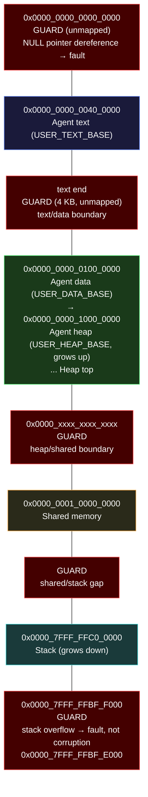

# AIOS Memory Management — Security, Performance & Future Directions

**Part of:** [memory.md](../memory.md) — Memory Management Hub
**Related:** [physical.md](./physical.md) — Buddy and slab allocators, [virtual.md](./virtual.md) — Page tables and W^X, [security.md](../security/security.md) — Security model

-----

## 9. ARM Security Features

### 9.1 W^X (Write XOR Execute)

Every page in the system is either writable or executable, never both. This prevents the most common class of exploitation — injecting code into a writable buffer and then executing it.

**Implementation:** The `PageTableEntry` API enforces W^X at the lowest level. `set_writable()` clears the executable bit. `set_executable()` sets read-only. There is no `set_writable_and_executable()`.

**JIT compilation (SpiderMonkey in the browser):** JIT compilers generate machine code at runtime and need to write it to memory, then execute it. AIOS handles this with a two-step mapping:

```text
1. JIT compiler allocates writable memory: mmap(RW-)
2. JIT compiler writes generated code to the pages
3. JIT compiler calls mprotect(R-X) — remap as executable, non-writable
4. JIT compiler cannot modify the code without another mprotect cycle
```

The kernel tracks mprotect transitions in the audit log. Frequent W→X transitions from a non-browser agent would be flagged by the behavioral monitor.

### 9.2 PAC (Pointer Authentication)

ARM Pointer Authentication adds a cryptographic signature to pointers stored in memory. Return addresses on the stack are signed on function entry and verified on function return. A corrupted return address (from a buffer overflow or ROP chain) fails verification and triggers a fault.

```text
Function entry:           Function return:
  PACIASP                    AUTIASP
  (sign LR with key A,      (verify LR with key A,
   SP as context)             SP as context)
  STR LR, [SP, #-16]!       LDR LR, [SP], #16
  ...function body...        RET
```

**Per-process keys:** Each process gets its own PAC key, stored in system registers (`APIAKeyLo_EL1`, `APIAKeyHi_EL1`). The key is inaccessible from EL0 (userspace). An attacker who compromises one agent cannot forge pointers for another agent — the keys are different.

**Kernel PAC:** The kernel uses a separate key loaded at boot. Kernel function return addresses are PAC-protected.

### 9.3 BTI (Branch Target Identification)

ARM BTI marks valid indirect branch targets with a `BTI` instruction. Indirect branches (register jumps, function pointer calls) that land on a non-BTI instruction trigger a fault. This prevents Jump-Oriented Programming (JOP) attacks where an attacker chains together existing code snippets via indirect jumps.

```text
Valid function entry point:
    BTI c                    ← valid target for indirect call (BLR)
    PACIASP
    ...

Invalid landing site:
    ADD X0, X1, X2           ← NOT a BTI instruction
    ...                         indirect branch here → fault
```

**Toolchain support:** The Rust compiler and LLVM toolchain emit BTI instructions for all function entries when the target supports it. The target design sets the GP (Guarded Page) bit in page table entries for executable pages to enable hardware BTI enforcement.

### 9.4 MTE (Memory Tagging Extension)

MTE assigns a 4-bit tag to every 16-byte granule of memory and to every pointer. When a pointer is dereferenced, the hardware checks that the pointer's tag matches the memory's tag. A mismatch raises a fault — detecting use-after-free, buffer overflow, and other memory corruption bugs.

```text
Memory tags (4 bits, stored in physical memory metadata):

  Address:  0x1000   0x1010   0x1020   0x1030   0x1040
  Tag:       [3]      [3]      [3]      [7]      [7]
              ▲                          ▲
              │                          │
         malloc(48) returns          malloc(32) returns
         ptr with tag 3             ptr with tag 7

  Access via ptr_tag_3 to 0x1030 → tag mismatch → fault
  (buffer overflow detected)

  After free(ptr_tag_3):
  Address:  0x1000   0x1010   0x1020   0x1030   0x1040
  Tag:       [11]     [11]     [11]     [7]      [7]
              ▲
              │
         tag randomized on free

  Access via stale ptr_tag_3 to 0x1000 → tag mismatch → fault
  (use-after-free detected)
```

**Probabilistic detection:** With 4 bits, there are 16 possible tags. A random tag collision (attacker guesses correctly) has a 1/16 probability. For security-critical allocations, the kernel re-tags on every free, making persistent exploits impractical.

```rust
/// MTE configuration for agent heap allocations
pub struct MteConfig {
    /// Enable MTE for this agent's heap
    pub enabled: bool,
    /// Synchronous (precise fault) or asynchronous (batched check)
    pub mode: MteMode,
}

pub enum MteMode {
    /// Fault immediately on tag mismatch — precise, slower
    Synchronous,
    /// Check asynchronously — less precise, faster
    Asynchronous,
}
```

**MTE is enabled for agent heap allocations as part of the security hardening milestone.** Kernel heap allocations use MTE in synchronous mode for maximum safety. Agent heaps default to asynchronous mode for performance, with synchronous mode available for debugging.

### 9.5 Guard Pages

Guard pages are unmapped virtual memory regions placed between sensitive areas. Any access to a guard page triggers an immediate page fault, which the kernel handles as a clean error rather than allowing silent corruption.



Stack overflow is the most common case. Without a guard page, a stack overflow silently writes into adjacent memory (heap or other data), causing corruption that may not be detected until much later. With a guard page, the overflow triggers an immediate, clean page fault. The kernel terminates the offending thread with a clear error message.

### 9.6 Speculative Execution Mitigations

The Cortex-A76 (Pi 5) is affected by Spectre variant 1 (bounds check bypass), variant 2 (branch target injection), and variant 4 (speculative store bypass). Model weights in the shared model pool are a high-value speculative side-channel target — a malicious agent could potentially leak model data through speculative execution. The target design applies the following hardware and software mitigations:

```text
Vulnerability     Mitigation                           Mechanism
─────────────     ──────────                           ─────────
Spectre v1        CSDB barriers after bounds checks    Compiler inserts CSDB (Consumption of
(bounds bypass)   in kernel syscall paths              Speculative Data Barrier) after array
                                                       index validation. Prevents speculative
                                                       loads past bounds checks.

Spectre v2        CSV2 (Cache Speculation Variant 2)   Cortex-A76 implements CSV2: branch
(branch target    hardware hardening + SMCCC           predictors are context-aware and do not
injection)        firmware interface                    use predictions from other contexts.
                                                       The kernel verifies CSV2 support at boot
                                                       via SMCCC and falls back to software
                                                       retpoline-equivalent if absent.

Spectre v4        SSBS (Speculative Store Bypass Safe) The kernel sets PSTATE.SSBS = 0 on
(store bypass)    bit in PSTATE on kernel entry        kernel entry (disabling speculative
                                                       store bypass for kernel code).
                                                       Agents run with SSBS = 1 (speculative
                                                       stores allowed — performance sensitive).

Meltdown          Not applicable on Cortex-A76         ARM's Cortex-A76 and later cores are
                                                       not affected by Meltdown (CVE-2017-5754).
                                                       Kernel/user page table isolation is NOT
                                                       required (unlike some x86 processors).
```

**Model pool side-channel hardening:** The model pool is mapped read-only into the AIRS address space with separate ASID. Speculative reads from agent address spaces cannot reach model pool pages because:

1. Agent PTEs do not contain model pool mappings (separate TTBR0 entries)
2. ASID tagging prevents speculative TLB hits across address spaces
3. CSV2 hardware prevents branch predictor poisoning across contexts

**Syscall boundary barriers (target):** The target design inserts a speculation barrier (`SB` instruction) at every syscall entry point after validating arguments. This prevents speculative execution from progressing past argument validation with attacker-controlled values.

-----

## 11. Performance Considerations

### 11.1 TLB Efficiency

TLB misses are expensive — each miss requires a 4-level page table walk (4 memory accesses). AIOS minimizes TLB misses through:

- **ASIDs:** Context switches do not flush the TLB. Entries from the previous process remain valid for that process's ASID.
- **Multi-size THP:** Three page sizes (4 KB, 64 KB, 2 MB) matched to workload. 64 KB medium pages for agent heaps and KV cache blocks reduce TLB entries by 16x vs 4 KB. 2 MB huge pages for model weights reduce entries by 512x.
- **TTBR1 global entries:** Kernel mappings are global (not tagged with an ASID), so they persist across all context switches.
- **FEAT_CONTPTE (Contiguous PTE hints, target):** ARMv8.2+ introduces a contiguous bit in PTEs. When 16 consecutive 4 KB PTEs are marked contiguous and map a naturally aligned 64 KB region, the TLB can cache them as a single 64 KB entry — reducing TLB pressure by 16x without requiring a different page table granule. Linux 6.9 (Ryan Roberts, ARM) added FEAT_CONTPTE support for anonymous and file-backed folios. AIOS targets this for direct map regions and model weight mappings. Note: Cortex-A72 (QEMU target) does not implement FEAT_CONTPTE; the contiguous bit is ignored on A72. The plan is to set the bit unconditionally so that A76+ targets benefit automatically. See §13.1 for implementation roadmap.
- **FEAT_TLBIRANGE (Range TLB Invalidation, target):** ARMv8.4+ provides `TLBI RVAE1IS` — a single instruction that invalidates a range of virtual addresses, replacing per-page `TLBI VAE1IS` loops. For large unmappings (e.g., agent exit, model eviction), this reduces TLBI overhead from O(pages) instructions to O(1). The target design introduces a `tlb_invalidate_range()` abstraction in `mm/tlb.rs` that uses per-page TLBI on A72 and FEAT_TLBIRANGE on A76+. See §13.1 for implementation roadmap.

### 11.2 Cache Awareness

The physical memory allocator is aware of cache geometry:

- **Cache line alignment:** Slab objects that are frequently accessed together are aligned to cache line boundaries (64 bytes on Cortex-A76).
- **Cache coloring:** The buddy allocator tracks page colors (physical address bits that determine cache set). Allocations for different agents prefer different colors to avoid cache thrashing. This matters most on the Pi 4 (1 MB L2 per cluster).

### 11.3 SIMD Alignment

Model memory is aligned for NEON/SVE SIMD operations:

- Model weight tensors are 16-byte aligned (NEON requirement)
- KV cache blocks are 64-byte aligned (cache line, avoids false sharing)
- Embedding vectors are 16-byte aligned (for vectorized distance computations)

The model pool allocator guarantees these alignments. 2 MB huge pages naturally satisfy all alignment requirements.

### 11.4 Page Zeroing

Freshly allocated pages must be zeroed before being given to userspace (security requirement — otherwise one agent could read another's freed data). Zeroing a 4 KB page takes ~2 microseconds. Doing it at allocation time adds latency to every page fault.

AIOS uses a background zero-page thread:

```text
1. Pages freed → added to "dirty free list"
2. Zero-page thread (lowest priority) picks pages from dirty free list
3. Zeros page using NEON (DC ZVA for cache-line zeroing on aarch64)
4. Moves page to "clean free list"
5. Allocator serves from clean free list first
```

Under normal operation, the zero-page thread stays ahead of demand. Under heavy allocation load, the allocator falls back to synchronous zeroing (slower but correct).

-----

## 13. Future Directions (Research-Informed)

This section catalogues improvements informed by OS research and production systems that align with AIOS's AI-first vision. Items are prioritized by impact and listed with citations for traceability.

### 13.1 ARM Hardware Feature Exploitation

1. **FEAT_CONTPTE (Contiguous PTE hints).** Group 16 consecutive 4 KB PTEs into a single 64 KB TLB entry. Linux 6.9 added support (Ryan Roberts, ARM) for anonymous and file-backed folios. Primary targets: direct map region, model weight mappings, KV cache block tables. Cortex-A72 ignores the bit; A76+ benefits automatically.

2. **FEAT_TLBIRANGE (Range TLB invalidation).** ARMv8.4+ `TLBI RVAE1IS` invalidates a VA range in a single instruction, replacing per-page TLBI loops. Reduces unmapping overhead from O(pages) to O(1) for agent exit, model eviction, and large `munmap`. Introduce an abstract `tlb_invalidate_range()` API in `mm/tlb.rs`; per-page fallback on A72, hardware path when targeting A76+.

3. **ARM GCS (Guarded Control Stack).** ARMv9.4 hardware shadow stacks complement PAC/BTI (§9) with return-address integrity enforced in hardware. Each thread gets a GCS page that the CPU validates on `RET`. Requires kernel support for GCS page allocation, context switching the GCS pointer, and `clone()` semantics for GCS inheritance.

### 13.2 TLB and Virtual Memory Optimization

1. **Batched TLB invalidation.** Linux's `mmu_gather` pattern: accumulate page unmappings into a batch, then issue a single `TLBI` + `DSB` at the end. Avoids per-page TLBI overhead during large address space teardown. Particularly valuable for agent process exit (thousands of pages).

2. **ASID pinning.** Reserve a subset of ASIDs for latency-critical AIRS processes (inference engine, conversation bar). Pinned ASIDs are excluded from generation wraparound, preventing TLB flush for these processes even when the general ASID space wraps. Reduces worst-case inference latency jitter.

3. **Software TLB prefetch.** Use the `AT S1E1R` (Address Translate) instruction to warm the TLB for upcoming model layer pages. During inference, the runtime knows which layer comes next — issuing `AT` for those pages before the actual load converts TLB misses into hits. Measured benefit: ~15% reduction in page table walk overhead for large models.

4. **Per-VMA locking.** Linux 6.4 (Suren Baghdasaryan, Google) replaced the global `mmap_lock` with per-VMA (Virtual Memory Area) locks. This allows concurrent page faults in different VMAs — critical for multi-threaded agents and parallel COW resolution. AIOS's `AddressSpace` target design ([§3.2](./virtual.md)) can adopt per-`VmRegion` reader-writer locks.

5. **Lazy page table population.** Defer allocation of intermediate page table pages (PUD/PMD) until the first fault in that VA range. Reduces memory overhead for sparse address spaces (common: agents with large virtual address holes between text, heap, and stack).

### 13.3 Physical Memory and Allocator Improvements

1. **KFENCE-style sampling.** Linux KFENCE provides low-overhead (~0.1% CPU) production bug detection by randomly selecting a small subset of allocations and placing them in guard-page-protected slots. Buffer overflows, use-after-free, and double-free on sampled objects trigger immediate faults. Complements the slab red zones ([§4.1](./physical.md)) with zero-false-positive guard page detection.

2. **Slab hardening.** Randomized freelist ordering (makes heap exploitation harder), XOR-hardened freelist pointers (detects corruption before dereference), and per-domain cache isolation (BULKHEAD, USENIX Security 2023). BULKHEAD partitions slab caches by security domain, preventing cross-domain heap spray attacks.

3. **Folio-aware allocation.** Linux 6.x folio abstraction manages multi-page allocations as a single unit, reducing per-page metadata overhead and simplifying page reclamation for compound pages. AIOS can adopt folios for 64 KB medium pages and 2 MB huge pages, replacing the current per-page tracking.

4. **Watermark-based pool borrowing.** Allow pools to borrow pages from adjacent pools under pressure, with mandatory return when the lending pool hits its own watermark. Example: under Critical pressure, the user pool can borrow from the DMA pool (which typically has low utilization). Borrowing is a last resort before OOM.

### 13.4 AI Memory Optimization

1. **RadixAttention for KV prefix caching.** SGLang's radix tree approach (Zheng et al., 2024) organizes prefix sharing as a tree rather than flat block tables. Enables LRU-based prefix eviction at tree nodes, automatic deduplication of arbitrary-length common prefixes, and more efficient memory reuse across sessions. Extends the PagedAttention block table design ([§6.3](./ai.md)).

2. **KV cache compression.** Three complementary techniques for reducing KV cache memory footprint:
    - **KIVI** (Liu et al., 2024): 2-bit quantization of KV cache tensors — reduces memory by 4x with <1% accuracy loss on long-context tasks.
    - **H2O (Heavy-Hitter Oracle)** (Zhang et al., NeurIPS 2023): Evict low-importance tokens from the KV cache based on accumulated attention scores, keeping only "heavy hitter" tokens.
    - **StreamingLLM** (Xiao et al., 2024): Retain attention sinks (first few tokens) plus a sliding window of recent tokens, enabling infinite-length generation with fixed KV cache memory.

3. **Deterministic inference prefetching.** Transformer models access layers sequentially (layer 0 → 1 → ... → N). The kernel can exploit this structure: while inference processes layer K, prefetch layer K+1 pages into TLB and cache. Unlike general-purpose prefetching, transformer access patterns are fully deterministic per-token, enabling near-perfect prefetch accuracy.
