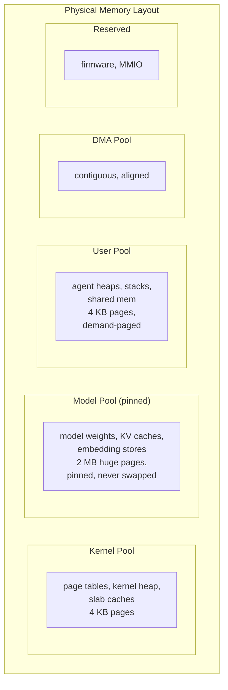
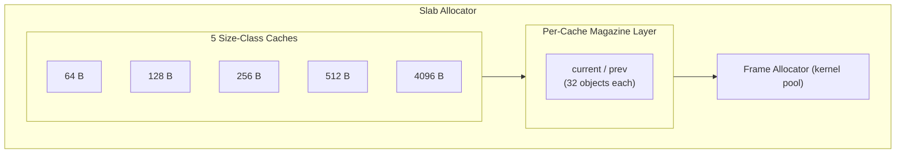

# AIOS Memory Management — Physical Memory & Kernel Heap

**Part of:** [memory.md](../memory.md) — Memory Management Hub
**Related:** [virtual.md](./virtual.md) — Virtual memory, [ai.md](./ai.md) — Model memory, [reclamation.md](./reclamation.md) — Reclamation and swap, [runtime-advisor/allocation.md](../../intelligence/runtime-advisor/allocation.md) — AIRS lifetime-aware allocation

-----

## 2. Physical Memory Manager

### 2.1 Bootstrap

At boot, UEFI hands the kernel a memory map — an array of `EFI_MEMORY_DESCRIPTOR` entries describing every region of physical memory. The kernel walks this array and classifies each region:

```text
UEFI Memory Map (example, 4 GB device):

0x0000_0000 - 0x0000_0FFF   Reserved (ARM exception vectors)
0x0000_1000 - 0x0007_FFFF   Conventional (usable)
0x0008_0000 - 0x001F_FFFF   Loader Code (kernel image, reclaimable after boot)
0x0020_0000 - 0x3FFF_FFFF   Conventional (usable — bulk of RAM)
0x4000_0000 - 0x4000_FFFF   ACPI Reclaim
0xFE00_0000 - 0xFEFF_FFFF   MMIO (device registers)
0xFF80_0000 - 0xFFFF_FFFF   Reserved (firmware)
```

The kernel builds its initial free list from `Conventional` regions. `Loader Code` and `Loader Data` regions are reclaimed after early boot completes. `MMIO` and `Reserved` regions are never touched by the allocator.

```rust
// ── Kernel-internal types used throughout this document ──────────────
//
// The following types are referenced in code blocks below but defined
// elsewhere in the kernel or are opaque kernel primitives:
//
//   PhysicalAddress    — newtype wrapper around usize (defined in [§3.2](./virtual.md))
//   PhysicalFrame      — single physical page frame, identified by PFN (§2.2)
//   VirtualAddress     — newtype wrapper around usize ([§3.2](./virtual.md))
//   PageTableEntry     — 64-bit aarch64 PTE with W^X helpers ([§3.2](./virtual.md))
//   PageTable          — 512-entry page table ([§3.2](./virtual.md))
//   AddressSpace       — per-process virtual address space ([§3.2](./virtual.md))
//   BuddyAllocator     — physical page allocator, orders 0–10 (§2.2)
//   MemoryRegion       — UEFI memory map entry (§2.1, below)
//   SlabCache          — fixed-size object cache with per-CPU magazines (§4.1)
//   FaultError         — (target) error enum for page fault outcomes ([§10.5](./reclamation.md))
//   FaultType          — (target) read / write / execute classification of a fault
//   PteState           — (target) decoded non-valid PTE state ([§10.5](./reclamation.md))
//   Vma                — alias for VmRegion ([§3.2](./virtual.md))
//   SharedMemoryId     — opaque handle for shared memory regions ([§7](./virtual.md))
//   MappedFile         — file-backed mapping descriptor
//   PageType           — page classification for MGLRU reclaim ([§10.2](./reclamation.md))
//   FrameRefCount      — (target) per-frame atomic reference counter for COW/shared mappings (§4.2)
//   Process            — kernel process descriptor (see scheduler.md)
//   Pool               — memory pool discriminant: Kernel/User/Model/Dma (§2.4)

/// Physical memory region from UEFI memory map
pub struct MemoryRegion {
    pub base: PhysicalAddress,
    pub size: usize,
    pub kind: MemoryType,
}

/// Classification of physical memory (canonical definition — see also boot/firmware.md §2).
/// Names match UEFI memory descriptor types.
pub enum MemoryType {
    /// Usable RAM — available for allocation
    Conventional,
    /// Boot loader code — reclaimable after boot
    LoaderCode,
    /// Boot loader data — reclaimable after boot
    LoaderData,
    /// UEFI boot services code — reclaimable after ExitBootServices
    BootServicesCode,
    /// UEFI boot services data — reclaimable after ExitBootServices
    BootServicesData,
    /// UEFI runtime services code — must preserve
    RuntimeServicesCode,
    /// UEFI runtime services data — must preserve
    RuntimeServicesData,
    /// Firmware reserved — never touch
    Reserved,
    /// ACPI tables — reclaimable after parsing
    AcpiReclaimable,
    /// ACPI NVS — must preserve
    AcpiNvs,
    /// MMIO — device registers, never allocatable
    MemoryMappedIO,
    /// Boot info struct — reclaimable after early boot
    BootInfo,
    /// Kernel image — text/data/bss loaded by bootloader
    KernelImage,
    /// Initial RAM filesystem
    Initramfs,
}
```

### 2.2 Buddy Allocator

Physical page allocation uses a classic buddy system. Simple, well-understood, O(log n) allocation and free, and it naturally coalesces free regions to provide large contiguous blocks when needed.

```text
Order   Page Count   Block Size   Use Case
─────   ──────────   ──────────   ────────
  0          1          4 KB      Single page (page tables, small allocs)
  1          2          8 KB      —
  2          4         16 KB      —
  3          8         32 KB      —
  4         16         64 KB      Medium THP (agent heaps, KV cache blocks)
  5         32        128 KB      —
  6         64        256 KB      —
  7        128        512 KB      —
  8        256          1 MB      —
  9        512          2 MB      Huge page (model weights)
 10       1024          4 MB      Maximum contiguous allocation
```

**Multi-size Transparent Huge Pages (THP):**

AIOS uses three page sizes on aarch64, matched to workload characteristics:

```text
Page Size   Order   TLB Entries for 4 GB   Primary Use
─────────   ─────   ────────────────────   ───────────
  4 KB        0       1,048,576             Page tables, small allocs, fine-grained mapping
 64 KB        4          65,536             Agent heaps, KV cache blocks, shared memory
  2 MB        9           2,048             Model weights (pinned, read-only)
```

The 64 KB medium page (order 4) is the key innovation from Linux 6.8+ multi-size THP. It fills the gap between 4 KB (too small for bulk data, high TLB pressure) and 2 MB (too large for dynamic allocations, causes internal fragmentation). On the Cortex-A76 TLB (~1280 entries), 64 KB pages cover 80 MB per TLB set — a 16x improvement over 4 KB pages without requiring the 2 MB contiguous regions that model memory needs.

**Where medium pages are used:**

| Allocation Type | Page Size | Rationale |
|---|---|---|
| Agent heap (> 64 KB) | 64 KB | Reduces TLB misses for heap-heavy agents. Transparent: agent sees contiguous virtual memory. |
| KV cache blocks | 64 KB | Each KV block is 1 MB (16 × 64 KB frames). Medium pages reduce TLB entries per block from 256 to 16. |
| Shared memory regions | 64 KB | IPC shared buffers are typically 64 KB–1 MB. Medium pages avoid TLB thrashing during zero-copy transfers. |
| Page tables, slab caches | 4 KB | Fine-grained allocation where 64 KB would waste memory. |
| Model weights | 2 MB | Huge contiguous regions (2-8 GB). 2 MB pages minimize TLB entries for multi-GB models. |

**Transparent promotion:** When an agent's heap grows beyond 64 KB of contiguous virtual address space, the kernel transparently promotes backing pages from 4 KB to 64 KB if a contiguous order-4 region is available from the buddy allocator. The agent's PTEs are updated atomically. If a 64 KB region is not available (fragmentation), the allocation falls back to 4 KB pages — correctness is never compromised, only performance.

**Splitting under pressure:** When memory pressure reaches Critical and the reclaimer needs individual 4 KB pages, 64 KB medium pages can be split back into 16 × 4 KB pages. Only cold medium pages (generation 3 in MGLRU) are split. This ensures that THP benefits persist during normal operation and degrade gracefully under pressure.

Each order maintains a free list. Allocation splits larger blocks when needed; freeing merges adjacent buddies back together.

> **Target API types:** `PhysicalFrame`, `PhysicalAddress`, `VirtualAddress`, `FreeList`, and `Bitmap` shown below are the target design newtypes. The current implementation (`mm/buddy.rs`) uses raw `usize` addresses throughout. These newtypes will be introduced as the memory subsystem matures.

```rust
/// A single physical page frame (target API — see note above)
#[derive(Copy, Clone, Debug, PartialEq, Eq)]
pub struct PhysicalFrame {
    /// Physical frame number (address >> 12)
    pub pfn: usize,
}

impl PhysicalFrame {
    pub fn address(&self) -> PhysicalAddress {
        PhysicalAddress(self.pfn << 12)
    }

    /// Convert to a typed pointer via the direct-map region.
    pub fn as_ptr<T>(&self) -> *const T {
        (DIRECT_MAP_BASE + self.pfn * PAGE_SIZE) as *const T
    }

    /// Convert to a mutable typed pointer via the direct-map region.
    pub fn as_mut_ptr<T>(&self) -> *mut T {
        (DIRECT_MAP_BASE + self.pfn * PAGE_SIZE) as *mut T
    }

    pub fn from_address(addr: PhysicalAddress) -> Self {
        Self { pfn: addr.0 >> 12 }
    }
}
```

> **Current implementation** (`mm/buddy.rs`):
>
> ```rust
> pub struct BuddyAllocator {
>     base: usize,
>     end: usize,
>     bitmap: usize,           // physical address of bitmap pages
>     bitmap_pages: usize,
>     free_heads: [usize; MAX_ORDER + 1],
>     free_count: [usize; MAX_ORDER + 1],
>     total_free: usize,
>     initialized: bool,
> }
> ```
>
> Methods use `alloc_pages(&mut self, order: usize) -> Option<usize>` and `free_pages(&mut self, addr: usize, order: usize)` with raw physical addresses. A `phys_to_ptr<T>()` helper switches between identity-map and direct-map pointer conversion depending on boot phase.

The target design below uses the `PhysicalFrame`/`FreeList` abstraction layer:

```rust
/// Buddy allocator for physical memory (target API)
pub struct BuddyAllocator {
    /// Free list per order (0..=MAX_ORDER)
    free_lists: [FreeList; MAX_ORDER + 1],
    /// Bitmap tracking allocated/free state per page
    bitmap: Bitmap,
    /// Base physical address of managed region
    base: PhysicalAddress,
    /// Total pages managed
    total_pages: usize,
    /// Free pages remaining
    free_pages: AtomicUsize,
}

const MAX_ORDER: usize = 10; // 4 MB max contiguous

impl BuddyAllocator {
    /// Allocate 2^order contiguous pages
    pub fn alloc(&mut self, order: usize) -> Option<PhysicalFrame> {
        // Try the requested order first
        if let Some(frame) = self.free_lists[order].pop() {
            self.free_pages.fetch_sub(1 << order, Ordering::Relaxed);
            return Some(frame);
        }
        // Split a larger block
        for higher in (order + 1)..=MAX_ORDER {
            if let Some(frame) = self.free_lists[higher].pop() {
                // Split down to requested order, putting buddies on free lists
                self.split(frame, higher, order);
                self.free_pages.fetch_sub(1 << order, Ordering::Relaxed);
                return Some(frame);
            }
        }
        None // out of memory
    }

    /// Free 2^order contiguous pages, merging buddies
    pub fn free(&mut self, frame: PhysicalFrame, order: usize) {
        let mut current = frame;
        let mut current_order = order;

        // Merge with buddy if buddy is also free
        while current_order < MAX_ORDER {
            let buddy = self.buddy_of(current, current_order);
            if !self.bitmap.is_free(buddy, current_order) {
                break;
            }
            self.free_lists[current_order].remove(buddy);
            current = PhysicalFrame {
                pfn: core::cmp::min(current.pfn, buddy.pfn),
            };
            current_order += 1;
        }

        self.free_lists[current_order].push(current);
        self.free_pages.fetch_add(1 << order, Ordering::Relaxed);
    }
}
```

### 2.3 Frame Allocator Interface

The `FrameAllocator` wraps the page pools and provides the primary API for the rest of the kernel:

> **Current implementation** (`mm/frame.rs`):
>
> ```rust
> pub struct FrameAllocator {
>     pools: PagePools,
>     total_pages: usize,
> }
> ```
>
> Global static: `pub static FRAME_ALLOC: Mutex<Option<FrameAllocator>>` — wrapped in `Mutex<Option<>>` because the allocator is initialized after boot memory discovery. Methods use `&mut self` and return raw `usize` physical addresses:
>
> ```rust
> pub unsafe fn alloc_page(&mut self, pool: Pool) -> Option<usize>
> pub unsafe fn alloc_pages(&mut self, pool: Pool, order: usize) -> Option<usize>
> pub unsafe fn free_pages(&mut self, phys_addr: usize, order: usize)
> pub fn pressure(&self) -> MemoryPressure
> ```

The target API introduces `AllocatorStats` and uses `PhysicalFrame` return types:

```rust
pub struct FrameAllocator {
    pools: PagePools,
    stats: AllocatorStats,
}

pub struct AllocatorStats {
    pub total_pages: usize,
    pub free_pages: usize,
    pub kernel_pages: usize,
    pub user_pages: usize,
    pub model_pages: usize,
    pub dma_pages: usize,
}

impl FrameAllocator {
    /// Allocate a single page from the specified pool
    pub fn alloc_page(&self, pool: Pool) -> Option<PhysicalFrame> {
        self.pools.alloc(pool, 0)
    }

    /// Allocate 2^order contiguous pages from the specified pool
    pub fn alloc_pages(&self, pool: Pool, order: usize) -> Option<PhysicalFrame> {
        self.pools.alloc(pool, order)
    }

    /// Free pages back to their pool
    pub fn free_pages(&self, frame: PhysicalFrame, order: usize) {
        self.pools.free(frame, order)
    }

    /// Current memory pressure level.
    /// Computed from the user pool only — the model pool is statically
    /// allocated and excluded from pressure calculations ([§8](./reclamation.md)).
    pub fn pressure(&self) -> MemoryPressure {
        let user_free = self.pools.user.free_pages.load(Ordering::Relaxed);
        let user_total = self.pools.user.total_pages;
        let free_pct = (user_free * 100) / user_total;
        match free_pct {
            21..=100 => MemoryPressure::Normal,
            11..=20  => MemoryPressure::Low,
            5..=10   => MemoryPressure::Critical,
            _        => MemoryPressure::Oom,
        }
    }
}
```

### 2.4 Page Pools

Physical memory is divided into pools at boot based on total RAM. Each pool reserves a region of physical memory for a specific purpose. This prevents one subsystem from starving another.



Pool sizing is determined at boot based on detected RAM:

```text
Total RAM   Kernel    Model     User      DMA       Reserved    Tier
─────────   ──────    ──────    ──────    ──────    ────────    ────
  2 GB      128 MB    0 MB*     1.75 GB   64 MB     64 MB      Degraded
  4 GB      256 MB    2 GB      1.5 GB    128 MB    128 MB     Constrained
  8 GB      256 MB    4 GB      3.5 GB    128 MB    128 MB     Recommended
 16 GB      256 MB    8 GB      7.5 GB    128 MB    128 MB     Comfortable

*2 GB devices: model pool is 0 — cloud inference only. The full 1.75 GB
 (after kernel/DMA/reserved) is available to the user pool, giving agents
 and the browser more breathing room than the previous 768 MB.
```

**AIRS resource orchestration scope:** AIRS resource directives can only adjust the boundary between the **Model Pool** and **User Pool**. The Kernel Pool, DMA Pool, and Reserved regions are fixed at boot and are not subject to AIRS directives:

| Pool | AIRS Can Resize? | Reason |
|---|---|---|
| Kernel | No | Kernel data structures only. Fixed at boot. |
| Model | Yes (boundary with User) | AIRS grows model pool when loading models, shrinks when evicting. Constrained by `security_floor` ([§12.2](./reclamation.md)). |
| User | Yes (boundary with Model) | Inverse of model pool adjustments. Per-agent limits still enforced by blast radius (Layer 8). |
| DMA | No | Fixed at boot. Device I/O buffers require physically contiguous, stable pages. Not addressable by AIRS directives. |
| Reserved | No | Firmware/MMIO regions. Hardware-defined, immutable. |

```rust
pub enum Pool {
    /// Kernel data structures, page tables, slab caches
    Kernel,
    /// Agent heaps, stacks, shared memory regions
    User,
    /// Model weights, KV caches, embedding stores (pinned, huge pages)
    Model,
    /// Physically contiguous for device I/O
    Dma,
}

pub struct PagePools {
    kernel: BuddyAllocator,
    user: BuddyAllocator,
    model: Option<BuddyAllocator>,  // None on <4 GiB systems (model_size=0)
    dma: BuddyAllocator,
}

/// Pool size configuration, computed at boot from detected RAM.
/// Reserved memory (firmware tables, MMIO) is tracked explicitly
/// to ensure the arithmetic in init() accounts for all RAM.
struct PoolConfig {
    kernel: usize,
    model: usize,
    user: usize,
    dma: usize,
    reserved: usize,
}

impl PagePools {
    /// Initialize pools based on total RAM
    pub fn init(total_ram: usize, regions: &[MemoryRegion]) -> Self {
        let config = match total_ram {
            // Degraded tier: no model pool, cloud inference only
            // All available RAM goes to user pool for agents/browser
            r if r <= 2 * GB => PoolConfig {
                kernel: 128 * MB,
                model: 0,
                user: (r - 128 * MB - 64 * MB - 64 * MB),
                dma: 64 * MB,
                reserved: 64 * MB,
            },
            // Constrained tier: small model pool (1-3B models)
            r if r <= 4 * GB => PoolConfig {
                kernel: 256 * MB,
                model: 2 * GB,
                user: (r - 256 * MB - 2 * GB - 128 * MB - 128 * MB),
                dma: 128 * MB,
                reserved: 128 * MB,
            },
            // Recommended tier: full model pool (8B Q4 models)
            r if r <= 8 * GB => PoolConfig {
                kernel: 256 * MB,
                model: 4 * GB,
                user: (r - 256 * MB - 4 * GB - 128 * MB - 128 * MB),
                dma: 128 * MB,
                reserved: 128 * MB,
            },
            // Comfortable tier: large model pool (8B Q5/Q6 + specialists)
            r => PoolConfig {
                kernel: 256 * MB,
                model: 8 * GB,
                user: (r - 256 * MB - 8 * GB - 128 * MB - 128 * MB),
                dma: 128 * MB,
                reserved: 128 * MB,
            },
        };
        Self::partition(regions, config)
    }
}
```

The model pool is the largest allocation on devices with 4 GB+ RAM. This is intentional — AIRS model weights dominate memory usage on target hardware. On a 4 GB device, the 2 GB model pool fits smaller models (1-3B at Q4) or heavily quantized variants of larger models. On 8 GB devices, the 4 GB model pool fits an 8B Q4_K_M model with room for KV caches.

**2 GB devices are the exception:** the model pool is zero. No local model fits alongside a running OS in 2 GB. Instead of allocating 1 GB for a model that would be too small to be useful, that memory goes to the user pool (1.75 GB total), giving agents and the browser substantially more headroom. AIRS falls back to cloud inference via the NTM.

-----

## 4. Kernel Heap

### 4.1 Slab Allocator

The kernel needs to allocate variable-sized objects frequently — page table pages, IPC message buffers, capability tokens, process descriptors. A raw buddy allocator wastes memory on small allocations (allocating 64 bytes wastes 4032 bytes of a 4 KB page). The slab allocator solves this.



> **Current implementation** (`mm/slab.rs`): 5 generic size classes `[64, 128, 256, 512, 4096]`. Each `SlabCache` uses an intrusive free list (not `LinkedList<Slab>`). Magazine is per-cache, not per-CPU. Red zone guard bytes (8 bytes, pattern `0xFEFE_FEFE_FEFE_FEFE`) surround each object in sub-page caches; checked on dealloc. Global: `pub static SLAB: spin::Mutex<SlabAllocator>`. Public API: `slab::alloc(Layout)` / `slab::dealloc(ptr, Layout)`.

```rust
/// A slab cache for fixed-size objects
pub struct SlabCache {
    /// User-visible object size
    object_size: usize,
    /// Internal allocation size (object_size + 2 * RED_ZONE_SIZE for sub-page caches)
    alloc_size: usize,
    /// Head of intrusive free list (pointer to next free slot, 0 = empty)
    free_head: usize,
    /// Number of pages allocated from buddy for this cache
    pages_used: usize,
    /// Per-cache magazine for fast-path alloc/free
    magazine: Magazine,
}

/// Per-cache magazine with current/prev swap for two-chance fast path
pub struct Magazine {
    current: MagazineRound,
    prev: MagazineRound,
}

pub struct MagazineRound {
    objects: [usize; MAGAZINE_SIZE],
    count: usize,
}

const MAGAZINE_SIZE: usize = 32;

/// Red zone size in bytes — guard bytes before and after each object
/// to detect buffer overflows (per fuzzing.md §3.3).
const RED_ZONE_SIZE: usize = 8;
const RED_ZONE_PATTERN: u64 = 0xFEFE_FEFE_FEFE_FEFE;

/// Standard cache sizes. Smaller allocations round up to 64;
/// 1024/2048 round up to 4096.
const CACHE_SIZES: [usize; 5] = [64, 128, 256, 512, 4096];

impl SlabCache {
    /// Create a cache for objects of `size` bytes.
    /// `const fn` — no heap allocation; pages allocated lazily via grow().
    const fn new(size: usize) -> Self {
        // Red zones added for sub-page objects only; 4096-byte objects
        // fill the entire page — no room for guard bytes.
        let red_zone = if size < PAGE_SIZE { RED_ZONE_SIZE } else { 0 };
        Self {
            object_size: size,
            alloc_size: size + 2 * red_zone,
            free_head: 0,
            pages_used: 0,
            magazine: Magazine::new(),
        }
    }

    /// Allocate one object from this cache.
    /// Fast path 1: pop from current magazine.
    /// Fast path 2: swap current ↔ prev, try again.
    /// Slow path: refill magazine from shared free list (or grow from buddy).
    pub unsafe fn alloc(&mut self) -> *mut u8 {
        if let Some(ptr) = self.magazine.current.pop() {
            return ptr;
        }
        core::mem::swap(&mut self.magazine.current, &mut self.magazine.prev);
        if let Some(ptr) = self.magazine.current.pop() {
            return ptr;
        }
        self.refill_magazine();
        self.magazine.current.pop().unwrap_or(core::ptr::null_mut())
    }

    /// Return an object to this cache.
    /// Verifies red zone integrity before returning (for sub-page caches).
    pub unsafe fn dealloc(&mut self, ptr: *mut u8) {
        if self.has_red_zones() {
            self.check_red_zones(ptr); // logs corruption if detected
        }
        if self.magazine.current.push(ptr) { return; }
        core::mem::swap(&mut self.magazine.current, &mut self.magazine.prev);
        if self.magazine.current.push(ptr) { return; }
        self.flush_magazine_to_freelist();
        self.magazine.current.push(ptr);
    }
}

/// Top-level slab allocator managing all size-class caches
pub struct SlabAllocator {
    caches: [SlabCache; 5],
}

/// Global slab allocator instance
pub static SLAB: spin::Mutex<SlabAllocator> = spin::Mutex::new(SlabAllocator::new());

impl SlabAllocator {
    const fn new() -> Self {
        Self {
            caches: [
                SlabCache::new(64),
                SlabCache::new(128),
                SlabCache::new(256),
                SlabCache::new(512),
                SlabCache::new(4096),
            ],
        }
    }
}

/// Public allocation API (wraps Layout-based routing)
pub unsafe fn alloc(layout: Layout) -> *mut u8;
pub unsafe fn dealloc(ptr: *mut u8, layout: Layout);
```

The per-cache magazine layer reduces lock contention on the allocation hot path. Each cache maintains a pair of magazine rounds (current/prev) holding up to 32 pre-allocated object pointers. All slab operations are serialized by a single global `spin::Mutex<SlabAllocator>` (`SLAB.lock()`), but the magazine avoids touching the shared intrusive free list on the fast path — a pop from the current magazine requires no free-list traversal, only the single lock acquisition. When the current magazine is empty, it swaps with the prev magazine (two-chance). Only when both magazines are empty does the cache refill from the shared intrusive free list or grow by requesting a new page from the frame allocator. This design also reduces the mutual exclusion Coffman condition for the common-case allocation path — see [deadlock-prevention.md §6](./deadlock-prevention.md).

### 4.2 Kernel Allocation API

The kernel provides a typed allocation interface built on top of the slab and buddy allocators:

```rust
// ── Kernel global singletons (initialized once during boot) ─────────
//
// These are module-level statics accessed throughout the kernel.
// Each is protected by a spin-lock or is inherently lock-free.

/// Physical page allocator — partitioned into Kernel/User/Model/DMA pools (§2.4).
/// Current implementation: `pub static FRAME_ALLOC: Mutex<Option<FrameAllocator>>`
/// (wrapped in Mutex<Option<>> because it is initialized after memory map discovery).
static FRAME_ALLOC: Mutex<Option<FrameAllocator>> = /* initialized at boot from PagePools::init() */;

/// (target) Per-frame reference counts for COW and shared mappings ([§5.4](./virtual.md)).
static FRAME_REFCOUNT: FrameRefCount = /* initialized at boot, one atomic counter per PFN */;

/// Slab allocator for small fixed-size kernel objects (§4.1).
/// Current implementation: `pub static SLAB: spin::Mutex<SlabAllocator>`
static SLAB: spin::Mutex<SlabAllocator> = /* initialized with 5 size-class caches */;

/// (target) Queue of frames awaiting asynchronous zeroing by the page-zero thread.
static ZERO_QUEUE: PageZeroQueue = /* initialized at boot */;

/// Typed kernel allocation — delegates to slab allocator via Layout.
/// Current API (mm/heap.rs): kalloc<T>() / kfree<T>()
/// Current API (mm/slab.rs): slab::alloc(Layout) / slab::dealloc(ptr, Layout)
pub fn kalloc<T>() -> *mut T {
    let layout = core::alloc::Layout::new::<T>();
    let ptr = slab::alloc(layout);
    if ptr.is_null() {
        panic!("kernel allocation failed: OOM for {} bytes", layout.size());
    }
    ptr as *mut T
}

pub fn kfree<T>(ptr: *mut T) {
    let layout = core::alloc::Layout::new::<T>();
    slab::dealloc(ptr as *mut u8, layout);
}

/// Page-granularity allocation (delegates to buddy allocator)
pub fn alloc_pages(order: u32) -> Option<PhysicalFrame> {
    FRAME_ALLOCATOR.alloc_pages(Pool::Kernel, order)
}

pub fn free_pages(frame: PhysicalFrame, order: u32) {
    FRAME_ALLOCATOR.free_pages(frame, order);
}

/// Contiguous physical memory for DMA
pub fn alloc_contiguous(size: usize) -> Option<PhysicalFrame> {
    let order = size.next_power_of_two().trailing_zeros();
    FRAME_ALLOCATOR.alloc_pages(Pool::Dma, order)
}

/// Zero a page asynchronously (page zeroing thread picks this up)
pub fn zero_page_async(frame: PhysicalFrame) {
    ZERO_QUEUE.push(frame);
}
```

Kernel allocation failure in core data paths (page table allocation during process creation, IPC buffer allocation) is a fatal condition. The kernel must always reserve enough memory in the kernel pool to service its own needs. This is why the kernel pool is sized generously (128–256 MB) and is separate from the user pool.

-----
