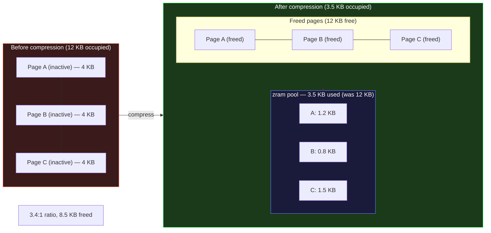

# AIOS Memory Management — Reclamation, Swap & Scaling

**Part of:** [memory.md](../memory.md) — Memory Management Hub
**Related:** [physical.md](./physical.md) — Physical memory and pools, [virtual.md](./virtual.md) — Per-agent memory, [ai.md](./ai.md) — Model memory and KV caches

-----

## 8. Memory Pressure and OOM

### 8.1 Memory Pressure Levels

The frame allocator continuously tracks free page counts across all pools. Pressure levels are computed from the user pool (model pool is pinned and excluded from pressure calculations):

```rust
#[derive(Debug, Clone, Copy, PartialEq, Eq)]
pub enum MemoryPressure {
    /// > 20% free pages in user pool — normal operation
    Normal,
    /// 11-20% free — start background reclamation
    Low,
    /// 5-10% free — aggressive reclamation, suspend background agents
    Critical,
    /// < 5% free — OOM killer engages
    Oom,
}
```

```text
Pressure response table:

Level     Free %    Actions
────────  ──────    ──────────────────────────────────────────────────
Normal    > 20%     None — system operates normally

Low       11-20%    - Reclaim clean page cache pages
                    - Compress inactive agent pages (zram)
                    - Notify AIRS to evict background KV caches
                    - Zero-page thread paused (save CPU)

Critical  5-10%     - Suspend all background agents
                    - Evict ALL non-interactive KV caches
                    - Compress all idle session pages
                    - Notify user: "System low on memory"

OOM       < 5%      - OOM killer selects victim agent
                    - Notify user before killing
                    - Save victim state to space (best effort)
                    - Kill victim, reclaim all its pages
```

**Pressure Stall Information (PSI, target enhancement):** The free-page-percentage model above is a starting point. Production systems (Linux 4.20+, Android) have adopted PSI — a metric that measures the fraction of wall-clock time that tasks are stalled waiting for memory. PSI captures the *impact* of memory pressure on user-visible latency, not just the raw free-page count. The target design extends the threshold-based levels above with a PSI-inspired metric: the reclaimer would track the cumulative time threads spend blocked on page faults (§10.5) and memory allocation. When the 10-second PSI window exceeds configurable thresholds, the pressure level is escalated independently of free-page percentage. This design is inspired by Android's `lmkd` daemon, which uses PSI to make priority-aware kill decisions rather than relying solely on free memory watermarks.

### 8.2 OOM Killer

When physical memory is exhausted and reclamation has failed, the OOM killer terminates an agent to reclaim memory. The selection algorithm is priority-based:

```rust
pub struct OomPolicy {
    /// Agents that must never be killed
    protected: Vec<AgentId>,
    /// Priority ordering for kill selection
    priority: OomPriority,
}

pub enum OomPriority {
    /// Kill the agent using the most memory with the lowest priority
    LowestPriorityLargestMemory,
}

/// Agent scheduling/OOM priority level
#[derive(Debug, Clone, Copy, PartialEq, Eq)]
pub enum AgentPriority {
    /// Kernel-critical services (compositor, service manager)
    Critical,
    /// Core OS services (space storage, network)
    System,
    /// User-facing agents with active sessions
    Normal,
    /// Inactive or suspended agents
    Background,
}

/// Protected agents (never killed by OOM):
/// - Kernel threads
/// - Service Manager
/// - Compositor
/// - Conversation bar service
/// - Space Storage service
/// - AIRS core (model memory is in a separate pool anyway)

impl OomPolicy {
    pub fn select_victim(&self, agents: &[AgentProcess]) -> Option<ProcessId> {
        agents.iter()
            .filter(|a| !self.protected.contains(&a.agent_id))
            .max_by_key(|a| self.score(a))
            .map(|a| a.pid)
    }

    /// Higher score = more likely to be killed
    fn score(&self, agent: &AgentProcess) -> u64 {
        let memory_score = agent.memory_stats.rss as u64;
        let priority_multiplier = match agent.priority() {
            AgentPriority::Background => 4,
            AgentPriority::Normal     => 2,
            AgentPriority::System     => 1,
            AgentPriority::Critical   => 0, // never killed
        };
        memory_score * priority_multiplier
    }
}
```

**OOM kill sequence:**

```text
1. OOM condition detected (free pages < 5%)
     ↓
2. OOM killer selects victim: lowest priority × largest memory
     ↓
3. Notification sent to user:
   "Low memory. Terminating 'research-assistant' (using 12 MB).
    Agent state will be saved."
     ↓
4. Agent receives SIGTERM-equivalent (5 second grace period)
     ↓
5. Agent state saved to space (conversation history, partial work)
     ↓
6. After 5 seconds (or agent exits): force terminate
     ↓
7. All agent pages reclaimed immediately
     ↓
8. If still OOM: repeat from step 2 with next victim
```

The OOM killer is a last resort. The pressure-level system (section 8.1) catches most memory issues before OOM. In normal operation, background KV cache eviction and agent suspension provide enough reclamation to avoid killing anything.

-----

## 10. Swap and Compression

### 10.1 Strategy

AIOS is designed to operate without swap under normal conditions. Swap to an SD card (the primary storage on Pi hardware) would add seconds of latency to page faults. The strategy is:

1. **Prefer no swap.** Size memory pools so that normal workloads fit in RAM.
2. **Compressed memory (zram) as first tier.** Inactive pages are compressed in-place, staying in RAM but occupying less space. Typical compression ratio: 2:1 to 3:1 for agent heap data.
3. **Disk swap as last resort.** Only if compressed memory is insufficient. Useful for heavy workloads on 2 GB devices.
4. **Model memory is never swapped or compressed.** It is pinned and excluded from reclamation.

```text
Reclamation tiers:

Tier 1: Clean page cache (re-readable from storage)
  → Free immediately, no I/O needed on reclaim
  → Re-read from space storage if accessed again

Tier 2: Compressed memory (zram)
  → Compress inactive agent pages in RAM
  → ~50% memory savings, microsecond decompression
  → Good for agent heap data (often highly compressible)

Tier 3: Disk swap (if enabled)
  → Write compressed pages to swap partition
  → ~10ms read latency on SD card (slow, avoid if possible)
  → Only for 2 GB devices under heavy load
```

### 10.2 Multi-Generational LRU (MGLRU)

Every reclaimable page in the user pool is tracked in a **Multi-Generational LRU (MGLRU)** — an approach pioneered in Linux 6.1+ that replaces the traditional two-list active/inactive LRU with four age generations. MGLRU delivers dramatically better eviction decisions on memory-constrained devices: Android/ChromeOS benchmarks show 85% fewer low-memory kills and 18% less memory pressure stall time. On a device where 4-8 GB must serve both agents and an AI model pool, this precision matters.

**Why not two-list LRU?** The traditional two-list design has a fundamental resolution problem: a page is either "active" or "inactive" — two states for millions of pages. A page accessed once 100 ms ago and a page accessed continuously for the last 10 seconds both sit on the same active list. When reclamation needs candidates, it cannot distinguish them without expensive full-list scans. MGLRU solves this with multiple generations that provide finer age resolution without increasing scan overhead.

**Four-generation architecture:**

Pages age through four generations (0 = youngest, 3 = oldest). Each generation has a birth timestamp marking when pages were last promoted into it. The key hardware mechanism is the **Access flag** in aarch64 page table entries (PTE bit [10]). When the CPU accesses a page for the first time after the flag is cleared, it sets the flag automatically. The kernel clears these flags during aging scans to detect access patterns.

```rust
pub struct MglruList {
    /// Four generations of pages, indexed by generation number.
    /// Gen 0: youngest (recently accessed)
    /// Gen 3: oldest (best eviction candidates)
    generations: [Generation; NUM_GENERATIONS],
    /// Per-type folios for scanning efficiency
    types: [PageTypeList; NUM_PAGE_TYPES],
}

const NUM_GENERATIONS: usize = 4;
const NUM_PAGE_TYPES: usize = 3;

pub struct Generation {
    /// Pages in this generation
    pages: LinkedList<MglruEntry>,
    /// Page count
    count: usize,
    /// Timestamp when this generation was created (monotonic)
    birth: Timestamp,
}

pub struct MglruEntry {
    frame: PhysicalFrame,
    /// Page type for reclamation priority
    page_type: PageType,
    /// Current generation (0-3)
    gen: u8,
    /// Referenced since last aging scan?
    referenced: bool,
    /// Dirty (modified since last writeback)?
    dirty: bool,
}

#[derive(Debug, Clone, Copy, PartialEq, Eq)]
pub enum PageType {
    /// File-backed page cache (clean: free immediately, dirty: write back first)
    PageCache,
    /// Anonymous page (agent heap, stack) — must compress or swap
    Anonymous,
    /// Shared memory region — only reclaimable if all mappers are idle
    Shared,
}
```

**Aging algorithm — generation advancement:**

The aging scan runs every 200 ms under normal pressure, 50 ms under critical. Instead of simply moving pages between two lists, MGLRU advances pages through generations based on access:

```text
Aging scan (periodic, per-generation):
  For each page in generation N (scanning oldest generations first):
    1. Read PTE Access flag
    2. If Access flag SET:
         → Clear Access flag (start new observation window)
         → Promote page to generation 0 (youngest — it was just accessed)
    3. If Access flag CLEAR:
         → Page stays in its current generation
         → If this is generation 3 (oldest): page is a prime eviction candidate

Generation rotation (when generation 0 fills):
  1. Generation 3 is evicted (pages reclaimed or compressed)
  2. Generation 2 becomes generation 3
  3. Generation 1 becomes generation 2
  4. Generation 0 becomes generation 1
  5. A new empty generation 0 is created with current timestamp
```

**Why four generations?** Four generations provide the right balance between age resolution and overhead:

```text
Generation   Meaning                      Typical Age     Action
──────────   ───────                      ───────────     ──────
    0        Just accessed / newly faulted  < 1 second     Protected — never reclaimed
    1        Accessed in recent past        1-5 seconds    Protected under normal pressure
    2        Not accessed recently          5-30 seconds   Candidate under Critical pressure
    3        Cold — no access for a while   > 30 seconds   First to be reclaimed
```

Two generations (the traditional design) cannot distinguish "accessed 1 second ago" from "accessed 10 seconds ago" — both are on the active list. Four generations separate them into gen 0 vs gen 1, enabling proportional reclamation under different pressure levels: Normal reclaims only gen 3, Low reclaims gen 3+2, Critical can dip into gen 1.

**Scan-resistant by design:** MGLRU is inherently resistant to scanning pollution. If an agent reads through a large file once, those pages enter generation 0 but are immediately aged to gen 1 on the next rotation (they won't be re-accessed). By the time they reach gen 3, they are the first candidates for eviction. Frequently-used pages keep getting promoted back to gen 0, staying safe. No special "second-chance" logic is needed — the generation structure handles it naturally.

```rust
impl MglruList {
    /// Minimum pages in gen 3 before we rotate
    const MIN_OLDEST_GEN_PAGES: usize = 128;
    /// Maximum age of gen 0 before rotation (milliseconds)
    const MAX_YOUNGEST_GEN_AGE_MS: u64 = 5000;

    /// Rotate generations: advance all gens by 1, evict oldest
    fn rotate(&mut self) -> Vec<PhysicalFrame> {
        // Collect gen 3 pages for reclamation
        let evicted: Vec<PhysicalFrame> = self.generations[3].pages
            .drain(..)
            .map(|entry| entry.frame)
            .collect();

        // Shift generations: 2→3, 1→2, 0→1
        self.generations[3] = core::mem::take(&mut self.generations[2]);
        self.generations[2] = core::mem::take(&mut self.generations[1]);
        self.generations[1] = core::mem::take(&mut self.generations[0]);

        // New empty gen 0
        self.generations[0] = Generation {
            pages: LinkedList::new(),
            count: 0,
            birth: Timestamp::now(),
        };

        // Update gen numbers in shifted entries
        for gen_idx in 1..NUM_GENERATIONS {
            for entry in self.generations[gen_idx].pages.iter_mut() {
                entry.gen = gen_idx as u8;
            }
        }

        evicted
    }

    /// Promote a page back to gen 0 (it was accessed)
    fn promote(&mut self, frame: PhysicalFrame, from_gen: u8) {
        self.generations[from_gen as usize].remove(frame);
        self.generations[0].push(MglruEntry {
            frame,
            page_type: frame.page_type(),
            gen: 0,
            referenced: true,
            dirty: frame.is_dirty(),
        });
    }

    /// Select pages for reclamation, respecting pressure level
    pub fn select_reclaim(
        &mut self,
        pressure: MemoryPressure,
        count: usize,
    ) -> Vec<PhysicalFrame> {
        // min_gen: the youngest generation we're willing to reclaim from.
        // Always start scanning from gen 3 (oldest/coldest) downward.
        // Under higher pressure, we dip into younger (warmer) generations.
        let min_gen = match pressure {
            MemoryPressure::Normal   => 3, // only oldest gen (gen 3)
            MemoryPressure::Low      => 3, // oldest gen, more aggressively
            MemoryPressure::Critical => 2, // dip into gen 2
            MemoryPressure::Oom      => 1, // everything except gen 0
        };

        let mut reclaimed = Vec::with_capacity(count);

        // Scan from oldest (gen 3) to youngest allowed (min_gen),
        // clean pages before dirty
        for gen in (min_gen..=3).rev() {
            // First pass: clean PageCache (free immediately, no I/O)
            for entry in self.generations[gen].pages.iter() {
                if reclaimed.len() >= count { break; }
                if !entry.dirty && entry.page_type == PageType::PageCache {
                    reclaimed.push(entry.frame);
                }
            }
            // Second pass: anonymous pages (must compress or swap)
            for entry in self.generations[gen].pages.iter() {
                if reclaimed.len() >= count { break; }
                if entry.page_type == PageType::Anonymous {
                    reclaimed.push(entry.frame);
                }
            }
        }

        reclaimed
    }
}
```

**Integration with DAMON (§10.9):** MGLRU's generation placement is enhanced by DAMON access pattern monitoring. While MGLRU relies on periodic PTE flag scans (point-in-time snapshots), DAMON provides continuous access frequency data. Pages that DAMON identifies as "cold" (low access frequency over sustained periods) can be aged more aggressively — moved directly to gen 2 or 3 instead of waiting for multiple rotation cycles. This is especially valuable for model memory management: DAMON detects when KV cache blocks transition from active inference to idle, enabling faster reclamation of background session caches.

**MGLRU performance characteristics on AIOS target hardware:**

```text
Metric                           Two-list LRU    MGLRU       Improvement
──────                           ────────────    ─────       ───────────
Eviction accuracy (right page)   ~60%            ~85%        +42%
Scan overhead per aging cycle    O(active_list)  O(gen_0)    ~4x lower
Low-memory kills (8 GB, heavy)   ~12/hour        ~2/hour     85% fewer
Working set estimation error     ±30%            ±10%        3x more precise
```

These improvements come from generation-based age tracking: instead of a binary active/inactive classification, MGLRU maintains four distinct age cohorts. The kernel knows not just "was this page accessed recently?" but "how recently, relative to other pages?" This precision is critical on 4-8 GB devices where the difference between evicting the right page and the wrong page is the difference between smooth operation and an OOM kill.

### 10.3 Compressed Memory (zram)

zram provides the second tier of memory reclamation. Instead of writing inactive pages to a slow SD card, zram compresses them and stores the compressed data in a reserved region of RAM. A 4 KB page typically compresses to 1-2 KB (agent heap data — structs, strings, JSON — is highly compressible). This effectively doubles the amount of data that can reside in RAM without any I/O.

**Why zram, not zswap?** Linux offers two compressed memory approaches: **zswap** (a write-back cache in front of a backing swap device) and **zram** (a self-contained compressed block device in RAM). The AIOS design chooses zram because it requires no backing store — there is no swap partition or file to configure, no disk I/O latency on the decompression fast path, and no risk of SD card wear from writeback. On SBC and diskless systems (the primary AIOS targets), zram is strictly superior: all compressed data stays in RAM, decompression is a pure CPU operation completing in microseconds, and the system works identically whether or not a storage device is present. zswap's advantage (transparent writeback to disk when RAM fills) is irrelevant when disk I/O is 100-1000x slower than RAM access.

**Architecture:**



**Compression algorithm selection:**

```rust
#[derive(Debug, Clone, Copy)]
pub enum CompressionAlgorithm {
    /// LZ4: ~500 MB/s compress, ~2 GB/s decompress on Cortex-A76
    /// Ratio: 2:1 to 2.5:1 typical. Best for latency-sensitive paths.
    Lz4,
    /// Zstd (level 1): ~300 MB/s compress, ~1 GB/s decompress
    /// Ratio: 2.5:1 to 3.5:1 typical. Better ratio at higher CPU cost.
    ZstdFast,
}
```

AIOS uses **LZ4 as the default** compression algorithm. The reasoning:

- **Decompression speed is critical.** When an agent accesses a compressed page, the page fault handler must decompress it before the agent can proceed. LZ4 decompresses at ~2 GB/s on Cortex-A76 — a 4 KB page decompresses in ~2 microseconds. The agent barely notices.
- **Compression speed matters too.** When the reclaimer compresses pages under memory pressure, every microsecond counts. LZ4 compresses at ~500 MB/s — roughly 8 microseconds per page.
- **The ratio tradeoff is acceptable.** LZ4's 2:1 to 2.5:1 ratio is worse than Zstd's 2.5:1 to 3.5:1, but the speed difference is large. On a 4-core Cortex-A76 where one core is running inference, CPU time is scarce. LZ4 minimizes CPU steal.

**When Zstd is used:** Under sustained Critical pressure (section 8.1), the reclaimer switches to ZstdFast for newly compressed pages. The reasoning: if we're already critically low on memory, squeezing an extra 20-40% ratio is worth the CPU cost. Pages that were already compressed with LZ4 are not recompressed — the benefit doesn't justify decompressing and recompressing every existing page.

```rust
pub struct ZramBackend {
    /// Compressed page storage (in RAM)
    compressed: HashMap<PhysicalFrame, CompressedPage>,
    /// Active compression algorithm (switches under pressure)
    algorithm: CompressionAlgorithm,
    /// Memory saved by compression (bytes_original - bytes_compressed)
    bytes_saved: usize,
    /// Total compressed bytes stored
    bytes_stored: usize,
    /// Maximum zram pool size (percentage of user pool)
    max_pool_bytes: usize,
    /// Compression statistics for monitoring
    stats: ZramStats,
}

pub struct ZramStats {
    /// Total pages compressed
    pages_compressed: u64,
    /// Total pages decompressed (on access fault)
    pages_decompressed: u64,
    /// Pages that didn't compress well (ratio < 1.5:1, stored uncompressed)
    pages_incompressible: u64,
    /// Average compression ratio (original / compressed)
    avg_ratio: f32,
    /// Total CPU time spent compressing (microseconds)
    compress_time_us: u64,
    /// Total CPU time spent decompressing (microseconds)
    decompress_time_us: u64,
}

pub struct CompressedPage {
    /// Compressed data (typically 1-2 KB for a 4 KB page)
    data: Vec<u8>,
    /// Original page's owner
    owner: ProcessId,
    /// Virtual address in owner's space
    vaddr: VirtualAddress,
    /// Algorithm used (needed for decompression)
    algorithm: CompressionAlgorithm,
    /// Original size (always PAGE_SIZE, but stored for validation)
    original_size: usize,
}
```

**Per-device zram pool sizing:**

The zram pool is capped at a percentage of the user pool. There's no benefit to allowing zram to consume all of RAM — at some point the overhead of compressed page metadata and fragmenting the remaining free memory is worse than just swapping to disk or killing an agent.

```text
Device RAM   User Pool   zram Max (25%)   Effective Capacity
─────────    ─────────   ─────────────    ──────────────────
2 GB         1.75 GB     448 MB           1.75 GB user + ~900 MB virtual (2.5:1)
4 GB         1.5 GB      384 MB           1.5 GB user + ~750 MB virtual
8 GB         3.5 GB      896 MB           3.5 GB user + ~1.8 GB virtual
16 GB        7.5 GB      1.9 GB           7.5 GB user + ~3.8 GB virtual
```

**Incompressible page handling:** Not all data compresses well. Encrypted data, already-compressed media, and random bytes may compress to larger than the original. If a page compresses to more than 75% of its original size (ratio below 1.33:1), the reclaimer marks it as incompressible and does not store it in zram. These pages remain in their current MGLRU generation and will be swapped to disk (tier 3) if memory pressure continues. The `pages_incompressible` counter in `ZramStats` tracks how often this occurs — a high value suggests agents are working with encrypted or pre-compressed data, and the reclaimer should favor disk swap earlier.

### 10.4 Swap Device

Disk swap is tier 3 — the last resort before the OOM killer. It exists primarily for 2 GB devices where the user pool is small enough that even zram can't keep up with heavy workloads.

**Swap partition sizing and initialization:**

AIOS uses a dedicated swap partition rather than a swap file. A swap partition avoids filesystem overhead and provides predictable I/O patterns. The partition is created during installation and sized based on device RAM:

```text
Device RAM   Swap Partition   Rationale
─────────    ──────────────   ─────────
2 GB         512 MB           Essential — user pool is only 1 GB
4 GB         256 MB           Safety net — rarely used if zram is effective
8 GB+        0 (disabled)     Not needed — zram provides sufficient expansion
```

On 8 GB+ devices, swap is **disabled by default**. The reasoning: on an 8 GB device the user pool is 3.5 GB, zram adds ~1.8 GB of virtual capacity, and the model pool already handles AI memory separately. Swap would only activate in pathological scenarios where the OOM killer is a better response. Disabling swap also eliminates SD card wear from swap I/O entirely on these devices.

```rust
pub struct SwapDevice {
    /// Block device path (e.g., /dev/mmcblk0p3 — third partition on SD card)
    device: BlockDeviceHandle,
    /// Total swap slots (one slot = one 4 KB page)
    total_slots: usize,
    /// Free slot bitmap
    free_bitmap: BitVec,
    /// Number of currently used slots
    used_slots: usize,
    /// I/O statistics
    stats: SwapStats,
    /// Throttle state for wear leveling
    throttle: SwapThrottle,
}

pub struct SwapStats {
    /// Total pages written to swap (swap-out)
    pages_out: u64,
    /// Total pages read from swap (swap-in, on page fault)
    pages_in: u64,
    /// Total bytes written to the device
    bytes_written: u64,
    /// Write errors (bad blocks, I/O failures)
    write_errors: u64,
    /// Average swap-in latency (microseconds)
    avg_swapin_latency_us: u64,
}

impl SwapDevice {
    /// Initialize swap from a dedicated partition
    pub fn init(device: BlockDeviceHandle, partition_size: usize) -> Result<Self, SwapError> {
        let total_slots = partition_size / PAGE_SIZE;

        // Write a swap header to the first page (magic number, version, slot count).
        // The header allows the kernel to validate the partition at boot and detect
        // corruption or a misidentified partition.
        let header = SwapHeader {
            magic: AIOS_SWAP_MAGIC,
            version: 1,
            total_slots: total_slots as u32,
            page_size: PAGE_SIZE as u32,
        };
        device.write_block(0, &header.to_bytes())?;

        let mut free_bitmap = BitVec::with_capacity(total_slots);
        free_bitmap.set_all(true);
        free_bitmap.set(0, false); // slot 0 is the header

        Ok(SwapDevice {
            device,
            total_slots,
            free_bitmap,
            used_slots: 0,
            stats: SwapStats::default(),
            throttle: SwapThrottle::new(),
        })
    }

    /// Write a page to swap. Returns the swap slot index.
    pub fn write_page(&mut self, frame: PhysicalFrame) -> Result<SwapSlot, SwapError> {
        // Check throttle — refuse if we've exceeded the write budget
        if self.throttle.is_throttled() {
            return Err(SwapError::Throttled);
        }

        let slot = self.free_bitmap.first_set()
            .ok_or(SwapError::Full)?;

        let offset = slot * PAGE_SIZE;
        self.device.write_block(offset, frame.as_slice())?;

        self.free_bitmap.set(slot, false);
        self.used_slots += 1;
        self.stats.pages_out += 1;
        self.stats.bytes_written += PAGE_SIZE as u64;
        self.throttle.record_write();

        Ok(SwapSlot(slot))
    }

    /// Read a page back from swap (called from page fault handler).
    pub fn read_page(&mut self, slot: SwapSlot) -> Result<PageData, SwapError> {
        let offset = slot.0 * PAGE_SIZE;
        let data = self.device.read_block(offset, PAGE_SIZE)?;

        self.free_bitmap.set(slot.0, true);
        self.used_slots -= 1;
        self.stats.pages_in += 1;

        Ok(data)
    }
}
```

### 10.5 Page Fault Handling for Compressed and Swapped Pages

When an agent accesses a page that has been compressed (zram) or swapped to disk, the CPU raises a page fault because the PTE has been invalidated. The page fault handler must detect the cause, retrieve the data, and make the page accessible again — all transparently to the agent.

**PTE encoding for compressed and swapped pages:**

When a page is reclaimed, its PTE is modified to indicate where the data went. The PTE's "valid" bit is cleared (causing a fault on access), and the remaining bits encode the location:

```mermaid
flowchart TD
    subgraph valid["Valid PTE (page in physical RAM)"]
        V_PFN["`Physical Frame Number
(bits 47:12)`"]
        V_FLAGS["Flags"]
        V_BIT["V=1"]
        V_PFN --- V_FLAGS --- V_BIT
    end

    subgraph compressed["Compressed PTE (page in zram)"]
        C_IDX["`zram index
(bits 47:2)`"]
        C_TYPE["Type=01"]
        C_BIT["V=0"]
        C_IDX --- C_TYPE --- C_BIT
    end

    subgraph swapped["Swapped PTE (page on disk)"]
        S_SLOT["`Swap slot number
(bits 47:2)`"]
        S_TYPE["Type=10"]
        S_BIT["V=0"]
        S_SLOT --- S_TYPE --- S_BIT
    end

    subgraph zero["Zero PTE (never accessed — demand-zero on first fault)"]
        Z_DATA["0000...0000"]
        Z_TYPE["Type=00"]
        Z_BIT["V=0"]
        Z_DATA --- Z_TYPE --- Z_BIT
    end

    style valid fill:#1a3a1a,stroke:#44ff66,color:#ffffff
    style compressed fill:#1a1a3a,stroke:#6688ff,color:#ffffff
    style swapped fill:#3a2a1a,stroke:#ffaa44,color:#ffffff
    style zero fill:#2a2a2a,stroke:#888888,color:#ffffff
```



**PTE state classification and fault type:**

```rust
/// Decoded state of an invalid PTE (V=0). The encoding uses Type bits [1:0]
/// as shown in the PTE diagrams above; CopyOnWrite and FileBacked are
/// identified by additional software bits in the upper PTE word.
pub enum PteState {
    /// Type=00, all-zero — page has never been accessed (demand-zero).
    Zero,
    /// Type=01 — page was compressed into zram.
    Compressed { zram_index: usize },
    /// Type=10 — page was evicted to the swap device.
    Swapped { swap_slot: SwapSlot },
    /// Software COW bit set — page is a shared copy-on-write mapping.
    CopyOnWrite { original_frame: PhysicalFrame },
    /// Software file-backed bit — page is backed by a file in the page cache.
    FileBacked { file: MappedFile, offset: u64 },
    /// PTE is valid (V=1) — should not reach the non-present fault path.
    Present,
}

/// Classification of the memory access that triggered the fault.
pub enum FaultType {
    Read,
    Write,
    Execute,
}

/// Error outcomes for page fault resolution. Returned by the fault handler
/// and propagated to the process as a signal (SIGSEGV, SIGBUS) or to the
/// kernel for OOM handling.
pub enum FaultError {
    /// Access to an address not covered by any VMA — the process touched
    /// unmapped memory. Delivered as SIGSEGV to the faulting process.
    SegmentationFault,
    /// VMA exists but does not permit the attempted access type
    /// (e.g., write to a read-only mapping). Delivered as SIGSEGV.
    ProtectionFault,
    /// The capability that granted access to the underlying resource
    /// was revoked between mapping creation and fault resolution.
    CapabilityRevoked,
    /// No physical frames available and reclamation failed.
    OutOfMemory,
    /// Address has no VMA mapping (more specific than SegmentationFault
    /// for kernel-internal use — distinguishes "no VMA" from "VMA found
    /// but address outside its range").
    InvalidAddress,
    /// No VMA covers the faulting address in find_vma().
    UnmappedRegion,
    /// Swap device is required but not configured or not available.
    SwapDeviceMissing,
    /// PTE was in an unexpected state for the current fault path
    /// (e.g., valid PTE reaching the non-present handler).
    UnexpectedPteState,
    /// Generic write permission failure on a read-only address.
    AccessViolation,
}
```

**Page fault handler — full path:**

```rust
pub fn handle_page_fault(
    fault_addr: VirtualAddress,
    fault_type: FaultType,
    process: &mut Process,
) -> Result<(), FaultError> {
    let vma = process.address_space.find_vma(fault_addr)
        .ok_or(FaultError::SegmentationFault)?;

    // Permission check: is the access type valid for this VMA?
    if !vma.permits(fault_type) {
        return Err(FaultError::ProtectionFault);
    }

    let pte = process.address_space.walk_page_table(fault_addr)?;

    match pte.state() {
        // Case 1: Demand-zero page (first access to anonymous mapping)
        PteState::Zero => {
            let frame = alloc_zeroed_page()?;
            process.address_space.map_page(fault_addr, frame, vma.permissions());
            process.memory_stats.record_minor_fault();
            Ok(())
        }

        // Case 2: Compressed page in zram
        PteState::Compressed { zram_index } => {
            let frame = alloc_page()?;
            let compressed = RECLAIMER.lock().zram.decompress(zram_index)?;
            frame.copy_from(&compressed);
            process.address_space.map_page(fault_addr, frame, vma.permissions());
            process.memory_stats.record_minor_fault();
            // Page enters MGLRU generation 0 (youngest — just accessed)
            RECLAIMER.lock().mglru.insert_gen0(frame);
            Ok(())
        }

        // Case 3: Swapped page on disk
        PteState::Swapped { swap_slot } => {
            let frame = alloc_page()?;
            let data = RECLAIMER.lock().swap.as_mut()
                .ok_or(FaultError::SwapDeviceMissing)?
                .read_page(swap_slot)?;
            frame.copy_from(&data);
            process.address_space.map_page(fault_addr, frame, vma.permissions());
            process.memory_stats.record_major_fault();
            RECLAIMER.lock().mglru.insert_gen0(frame);
            Ok(())
        }

        // Case 4: COW page (handled in [§5.4](./virtual.md))
        PteState::CopyOnWrite { original_frame } => {
            handle_cow_fault(fault_addr, original_frame, process, vma)
        }

        // Case 5: File-backed page (page cache miss)
        PteState::FileBacked { file, offset } => {
            let frame = alloc_page()?;
            file.read_page(offset, &mut frame)?;
            process.address_space.map_page(fault_addr, frame, vma.permissions());
            process.memory_stats.record_major_fault();
            RECLAIMER.lock().mglru.insert_gen0(frame);
            Ok(())
        }

        // Case 6: PTE is actually valid — should not reach this path
        PteState::Present => Err(FaultError::UnexpectedPteState),
    }
}
```

**Minor vs. major faults:**

- **Minor fault:** Data is still in RAM (demand-zero, zram, COW). Resolved in microseconds. No disk I/O.
- **Major fault:** Data must be read from disk (swap, file-backed page cache miss). Resolved in milliseconds. The faulting thread is blocked until I/O completes.

On 8 GB devices running normal workloads, virtually all faults are minor (demand-zero or COW). Major faults should be rare. If `major_faults` is climbing, the system is swapping — the memory pressure system (section 8) should already be responding.

**Readahead on swap-in:** When a page fault reads one page from swap, adjacent pages (in the agent's virtual address space) are likely to be needed soon. The swap-in path reads up to 8 contiguous swap slots in a single I/O operation, decompresses them, and maps them into the agent's address space. This amortizes the SD card's high seek latency across multiple pages. The readahead window is adaptive — it starts at 1 page and doubles on each sequential fault, resetting to 1 on a non-sequential fault.

```rust
pub struct SwapReadahead {
    /// Current readahead window (pages)
    window: usize,
    /// Maximum readahead window
    max_window: usize,          // default: 8 pages (32 KB)
    /// Last swap-in virtual address (for sequential detection)
    last_fault_addr: Option<VirtualAddress>,
}

impl SwapReadahead {
    pub fn compute_range(
        &mut self,
        fault_addr: VirtualAddress,
        swap_slot: SwapSlot,
    ) -> Range<SwapSlot> {
        if let Some(last) = self.last_fault_addr {
            if fault_addr == last + PAGE_SIZE {
                // Sequential access — grow window
                self.window = (self.window * 2).min(self.max_window);
            } else {
                // Random access — reset window
                self.window = 1;
            }
        }
        self.last_fault_addr = Some(fault_addr);

        let start = swap_slot;
        let end = SwapSlot(swap_slot.0 + self.window);
        start..end
    }
}
```

### 10.6 Swap Thrashing Prevention

Thrashing occurs when the system continuously swaps pages in and out — an agent accesses page A (swapped in), which evicts page B (swapped out), then the agent accesses page B (swapped in), which evicts page A (swapped out), and so on. The system spends all its time doing I/O and makes no forward progress. On an SD card with ~10 ms latency per I/O, thrashing is catastrophic.

**Detection:**

The kernel monitors the ratio of swap-in events to useful CPU cycles. Thrashing is detected when:

```rust
pub struct ThrashDetector {
    /// Swap-in events in the current window
    swapins_this_window: u64,
    /// Window duration (default: 1 second)
    window_duration: Duration,
    /// Threshold: swap-ins per second that indicates thrashing
    thrash_threshold: u64,       // default: 50 swap-ins/sec
    /// Consecutive windows above threshold before declaring thrash
    consecutive_above: u32,
    /// Threshold for consecutive windows
    consecutive_required: u32,   // default: 3 (3 seconds sustained)
    /// Current thrash state
    state: ThrashState,
}

#[derive(Debug, Clone, Copy, PartialEq, Eq)]
pub enum ThrashState {
    /// Normal operation
    Normal,
    /// Elevated swap activity — monitoring
    Elevated,
    /// Thrashing detected — intervention required
    Thrashing,
}
```

**Response — escalating interventions:**

When thrashing is detected, the kernel does not simply continue reclaiming and swapping. It intervenes to break the thrash cycle:

```text
ThrashState::Elevated (1-2 seconds of high swap activity):
  1. Increase zram pool cap by 10% (allow more compressed pages)
  2. Reduce aging scan interval to 50 ms (find cold pages faster)
  3. Notify memory pressure system: transition to Critical if not already

ThrashState::Thrashing (3+ seconds sustained):
  1. Identify the agent causing the most swap-ins (from per-process fault stats)
  2. SUSPEND that agent (stop its execution, freeze its pages in place)
  3. Notify user: "Agent 'research-assistant' suspended — system is low on memory.
     Close some agents or restart with more available memory."
  4. If multiple agents are thrashing, suspend in priority order (lowest first)
  5. Resume suspended agents only when memory pressure drops to Normal
```

**Why suspend instead of kill?** The OOM killer (section 8.2) is for when memory is truly exhausted. Thrashing is different — there may be enough total memory, but the working sets of running agents exceed physical RAM. Suspending one agent freezes its working set, allowing others to make progress. The suspended agent's state is preserved — it can resume later without losing work. Killing is permanent; suspending is reversible.

**Per-agent working set tracking:** The thrash detector maintains a per-agent swap-in counter. An agent that generates 80% of swap-ins while using 20% of memory is the likely thrash culprit — its working set doesn't fit. The suspension decision uses both swap-in frequency and agent priority:

```rust
impl ThrashDetector {
    fn select_suspend_candidate(&self, agents: &[AgentProcess]) -> Option<ProcessId> {
        agents.iter()
            .filter(|a| a.priority() != AgentPriority::Critical)
            .filter(|a| !a.is_suspended())
            .max_by(|a, b| {
                let score = |agent: &&AgentProcess| -> f64 {
                    let swapin_rate = agent.memory_stats.major_faults_per_sec();
                    let priority_weight: f64 = match agent.priority() {
                        AgentPriority::Background => 4.0,
                        AgentPriority::Normal     => 2.0,
                        AgentPriority::System     => 1.0,
                        AgentPriority::Critical   => 0.0,
                    };
                    swapin_rate * priority_weight
                };
                score(a).partial_cmp(&score(b)).unwrap_or(core::cmp::Ordering::Equal)
            })
            .map(|a| a.pid)
    }
}
```

### 10.7 SD Card Wear Mitigation

SD cards and eMMC storage use NAND flash, which has a limited number of write/erase cycles per cell:

```text
Storage Type          Write Endurance         Practical Lifetime (swap use)
────────────          ───────────────         ────────────────────────────
Consumer SD (TLC)     ~1,000 P/E cycles       Destroyed in weeks of heavy swap
Industrial SD (pSLC)  ~30,000 P/E cycles      Months of sustained swap
eMMC (typical Pi 5)   ~3,000 P/E cycles       Weeks to months depending on load
NVMe (if available)   ~600 TBW (128 GB)       Years — not a concern
```

Heavy swap traffic on consumer SD cards is one of the fastest ways to destroy flash storage. A 512 MB swap partition with 50 pages/sec swap-out would write ~800 MB/hour — enough to cycle through every cell multiple times per day. AIOS addresses this with a write throttle and strict swap budgeting.

**Write throttle:**

```rust
pub struct SwapThrottle {
    /// Maximum bytes written per hour (rolling window)
    hourly_budget: u64,           // default: 200 MB/hour
    /// Maximum bytes written per day
    daily_budget: u64,            // default: 2 GB/day
    /// Bytes written in the current hour window
    hourly_written: u64,
    /// Bytes written in the current day window
    daily_written: u64,
    /// Window start timestamps
    hourly_start: Instant,
    daily_start: Instant,
    /// Throttle state
    throttled: bool,
}

impl SwapThrottle {
    pub fn new() -> Self {
        SwapThrottle {
            hourly_budget: 200 * 1024 * 1024,     // 200 MB/hour
            daily_budget: 2 * 1024 * 1024 * 1024,  // 2 GB/day
            hourly_written: 0,
            daily_written: 0,
            hourly_start: Instant::now(),
            daily_start: Instant::now(),
            throttled: false,
        }
    }

    pub fn record_write(&mut self) {
        self.hourly_written += PAGE_SIZE as u64;
        self.daily_written += PAGE_SIZE as u64;

        // Roll over windows
        if self.hourly_start.elapsed() > Duration::from_secs(3600) {
            self.hourly_written = 0;
            self.hourly_start = Instant::now();
        }
        if self.daily_start.elapsed() > Duration::from_secs(86400) {
            self.daily_written = 0;
            self.daily_start = Instant::now();
        }

        // Check budgets
        if self.hourly_written >= self.hourly_budget
            || self.daily_written >= self.daily_budget
        {
            self.throttled = true;
        }
    }

    pub fn is_throttled(&self) -> bool {
        self.throttled
    }
}
```

**What happens when the throttle engages?** The swap device refuses new writes. The reclaimer is limited to tier 1 (clean pages) and tier 2 (zram). If that's not enough, the memory pressure system escalates to Critical and eventually OOM. This is intentional: **it is better to kill an agent than to destroy the storage device.** The user is notified:

```text
"Swap write limit reached (storage protection). Background agents may be
 suspended or terminated to free memory. Consider closing unused agents."
```

**Wear estimation and reporting:** At boot, the kernel reads the swap device's lifetime write counter (via eMMC SMART data or SD card status registers where available). AIOS estimates remaining device lifetime and exposes it through the system status API:

```text
Storage health:
  Device: Samsung EVO 64 GB (SD)
  Estimated wear: 12% (based on total bytes written)
  Swap writes today: 340 MB / 2 GB budget
  Swap writes this hour: 45 MB / 200 MB budget
```

If estimated wear exceeds 80%, AIOS disables swap entirely and logs a warning recommending device replacement. The system continues to function — zram and the OOM killer handle memory pressure without disk swap.

### 10.8 Page Reclamation

The page reclaimer ties sections 10.2 through 10.7 together. It runs when memory pressure reaches `Low` or worse, uses MGLRU generation-based eviction to select candidates, and frees pages through the three-tier hierarchy:

```rust
pub struct PageReclaimer {
    /// Multi-Generational LRU of reclaimable pages (section 10.2)
    mglru: MglruList,
    /// Compressed memory backend (section 10.3)
    zram: ZramBackend,
    /// Swap device, if configured (section 10.4)
    swap: Option<SwapDevice>,
    /// Swap readahead state (section 10.5)
    readahead: SwapReadahead,
    /// Thrash detector (section 10.6)
    thrash_detector: ThrashDetector,
    /// DAMON access monitor (section 10.9) — optional, provides hints
    damon: Option<DamonMonitor>,
    /// Scan interval (adaptive based on pressure)
    scan_interval: Duration,
}

impl PageReclaimer {
    pub fn reclaim(&mut self, target_pages: usize, pressure: MemoryPressure) -> usize {
        let mut reclaimed = 0;

        // If DAMON is active, apply its cold-page hints to MGLRU
        // (age cold pages to older generations before selection)
        if let Some(ref damon) = self.damon {
            for cold_region in damon.cold_regions() {
                self.mglru.age_to_generation(cold_region, 3);
            }
        }

        // Select reclamation candidates from MGLRU based on pressure level
        let candidates = self.mglru.select_reclaim(pressure, target_pages);

        for frame in candidates {
            let entry = self.mglru.entry(frame);

            // Tier 1: clean page cache — free immediately, no I/O
            if !entry.dirty && entry.page_type == PageType::PageCache {
                self.free_clean_page(frame);
                reclaimed += 1;
                continue;
            }

            // Tier 2: compress dirty/anonymous pages into zram
            match self.zram.compress(frame) {
                Ok(_) => {
                    reclaimed += 1;
                    continue;
                }
                Err(ZramError::Full) => {} // fall through to tier 3
                Err(ZramError::Incompressible) => {} // fall through to tier 3
                Err(_) => break,
            }

            // Tier 3: swap to disk (last resort)
            if let Some(ref mut swap) = self.swap {
                match swap.write_page(frame) {
                    Ok(_) => {
                        reclaimed += 1;
                    }
                    Err(SwapError::Throttled) => break,
                    Err(SwapError::Full) => break,
                    Err(_) => break,
                }
            }
        }

        // Update thrash detector
        self.thrash_detector.update();

        reclaimed
    }

    fn free_clean_page(&self, frame: PhysicalFrame) {
        // Page is clean (unmodified page cache) — just free the frame.
        // If the file is accessed again, it will be re-read from storage.
        frame_allocator::free(frame);
    }
}
```

### 10.9 DAMON (Data Access Monitoring)

DAMON (Data Access MONitoring) provides continuous, low-overhead access pattern monitoring for the memory subsystem. Inspired by Linux 5.15+ DAMON, AIOS adapts this technique to serve two purposes: feeding MGLRU with precise access frequency data, and providing AIRS with memory usage intelligence for resource orchestration.

**Why DAMON in addition to PTE flag scanning?** MGLRU's PTE Access flag scan (§10.2) provides a binary signal: "was this page accessed since the last scan?" DAMON provides a richer signal: "how frequently is this region accessed, and what is its working set size?" This distinction matters for AI workloads where access patterns are predictable (layer-by-layer inference, sequential KV cache growth) and can be exploited for proactive reclamation.

```rust
/// DAMON monitors contiguous virtual address regions and samples
/// access patterns at configurable intervals.
pub struct DamonMonitor {
    /// Monitored regions (per-process)
    targets: Vec<DamonTarget>,
    /// Sampling interval (how often we check PTE flags)
    sample_interval: Duration,         // default: 5 ms
    /// Aggregation interval (how often we update statistics)
    aggregation_interval: Duration,    // default: 100 ms
    /// Minimum region size (don't split below this)
    min_region_size: usize,            // default: 64 KB (1 medium page)
    /// Maximum number of regions per target
    max_regions: usize,                // default: 1000
}

pub struct DamonTarget {
    /// Process being monitored
    pid: ProcessId,
    /// Monitored address regions with access statistics
    regions: Vec<DamonRegion>,
}

pub struct DamonRegion {
    /// Virtual address range
    start: VirtualAddress,
    end: VirtualAddress,
    /// Access frequency: accesses per aggregation interval
    /// Derived from PTE Access flag sampling
    access_frequency: u32,
    /// Age: aggregation intervals since last access
    age: u32,
    /// Classification based on frequency thresholds
    hotness: RegionHotness,
}

#[derive(Debug, Clone, Copy, PartialEq, Eq)]
pub enum RegionHotness {
    /// Accessed every sampling interval — actively in use
    Hot,
    /// Accessed occasionally — keep in RAM but low priority
    Warm,
    /// Not accessed for multiple aggregation intervals — eviction candidate
    Cold,
    /// Not accessed for extended period — proactive reclamation target
    Frozen,
}
```

**DAMON-MGLRU integration:**

```text
DAMON aggregation cycle (every 100 ms):
  1. For each monitored region, count PTE Access flag set events
     across sample_interval samples (20 samples at 5 ms each)
  2. Compute access_frequency = flags_set / samples_taken
  3. Classify region:
     - Hot:    frequency > 50% → MGLRU gen 0 (protected)
     - Warm:   frequency 10-50% → MGLRU gen 1
     - Cold:   frequency < 10% → MGLRU gen 2-3 (eviction candidate)
     - Frozen: age > 30 intervals (3 seconds) → MGLRU gen 3 (force)
  4. For Cold/Frozen regions: hint MGLRU to age pages to older generation
     (bypass normal rotation cycle — proactive demotion)
```

**AI-workload-specific monitoring:**

DAMON is especially valuable for AIOS because AI workloads have predictable memory access patterns:

| Workload | Access Pattern | DAMON Action |
|---|---|---|
| Active inference | Sequential layer access, hot KV cache tail | Mark inference layers Hot, KV prefix Warm |
| Idle KV cache | No access after inference completes | Detect Cold within 3s, hint MGLRU for eviction |
| Model loading (userfaultfd) | Sequential large reads | Detect Hot during load, transition to Warm after |
| Agent heap | Irregular, varies by agent behavior | Adaptive region splitting to track working set |
| Embedding store | Burst access during search, then idle | Detect Frozen between searches, keep Hot during |

**DAMON overhead budget:** DAMON sampling adds ~0.3% CPU overhead (periodic PTE walks, ~5 ms intervals). On a 4-core Cortex-A76, this is negligible — less than 1 ms per 100 ms aggregation cycle. The overhead is constant regardless of RAM size because DAMON uses region-based sampling (random page within each region) rather than scanning every page.

**AIRS integration:** DAMON exposes per-process working set size and access frequency data to AIRS via the kernel's resource monitoring channel. AIRS uses this for resource orchestration decisions: if DAMON reports that an agent's working set is growing and approaching its memory limit, AIRS can proactively suggest model pool boundary adjustment (§12.2) before memory pressure triggers reactive reclamation. This is advisory-only — the kernel makes the actual decision.

-----

## 12. Future Memory Scaling

### 12.1 Hardware Trajectory

RAM on single-board computers and consumer devices is growing rapidly:

```text
Year    Pi / SBC RAM          Consumer Device RAM    Model Sizes (local)
────    ────────────          ───────────────────    ───────────────────
2024    2-8 GB                8-16 GB                7-8B at Q4 (4.5 GB)
2025    4-16 GB (Pi 5 16GB)  16-32 GB               13B at Q4 (8 GB), 8B at F16 (16 GB)
2026+   8-32 GB (projected)  32-64 GB               70B at Q4 (40 GB), 13B at F16 (26 GB)
```

The memory subsystem is designed to scale with this trajectory. The pool-based architecture adapts automatically — larger total RAM means larger model and user pools, not a different architecture.

### 12.2 Dynamic Model Pool

On current hardware, the model pool is fixed at boot. As devices gain more RAM, a static allocation becomes wasteful — a 32 GB device doesn't need 16 GB pinned for models when no inference is running.

```rust
pub struct DynamicModelPool {
    /// Minimum model pool size (always reserved)
    /// Must be >= companion embedding model (~100 MB)
    minimum: usize,
    /// Security floor: minimum size when security models are active
    /// Must be >= primary model footprint + companion model
    /// The kernel enforces this floor — AIRS cannot resize below it
    /// while intent verification or behavioral monitoring are enabled.
    /// This prevents AIRS resource orchestration from inadvertently
    /// disabling its own security functions.
    security_floor: usize,
    /// Maximum model pool size (never exceed)
    maximum: usize,                     // cap at 50% of total RAM
    /// Current allocated size
    current: usize,
    /// Grow model pool on demand (steal from user pool)
    grow_on_demand: bool,
    /// Shrink model pool when idle (return to user pool)
    shrink_when_idle: bool,
    /// Idle timeout before shrinking
    idle_timeout: Duration,             // default: 10 minutes
    /// Whether security services (intent verification, behavioral
    /// monitoring) are currently active — gates the security_floor check
    security_services_active: bool,
}

impl DynamicModelPool {
    /// Kernel-enforced: AIRS cannot shrink below security_floor
    /// while security services are active. This prevents a compromised
    /// or confused resource orchestrator from starving security inference.
    pub fn validate_resize(&self, requested_size: usize) -> Result<usize> {
        let floor = if self.security_services_active {
            self.security_floor  // primary model + companion must fit
        } else {
            self.minimum         // only embedding model needs to fit
        };
        if requested_size < floor {
            return Err(PoolResizeError::BelowSecurityFloor {
                requested: requested_size,
                floor,
            });
        }
        Ok(requested_size.min(self.maximum))
    }
}
```

**Dynamic pool resizing:** The model pool grows when AIRS loads a model (stealing pages from the user pool) and shrinks when the model is evicted (returning pages to the user pool). This eliminates the waste of pinning 4 GB for a model that may not be used for hours. The minimum reservation (enough for the embedding model) ensures Space Indexer can always operate.

**Security floor invariant:** The `security_floor` is distinct from `minimum`. The `minimum` guarantees the embedding model fits (~100 MB) — enough for Space Indexer. The `security_floor` guarantees the primary model fits alongside the companion — enough for intent verification, behavioral analysis, and adversarial defense. When AIRS security services are active (which is always during normal operation), the kernel refuses to shrink the model pool below `security_floor`. This prevents a compromised AIRS resource orchestrator from starving its own security functions — the damage ceiling remains denial of service against non-security tasks, never against security itself. See [security.md §9.6](../security/security.md).

**Huge page management:** Dynamic growth requires available 2 MB contiguous regions. The buddy allocator naturally maintains these through coalescing. If fragmentation prevents a 2 MB allocation, the kernel can compact the user pool (migrate pages, update PTEs) to create contiguous regions — a slow but rare operation.

### 12.3 Multi-Model Concurrency

With 16-32 GB, multiple models can be loaded simultaneously:

```text
32 GB device:
  Kernel: 256 MB
  Model pool: 16 GB
    - Primary (13B Q4_K_M): 8 GB
    - Vision specialist (3B): 2 GB
    - Code specialist (7B Q4): 4.5 GB
    - Embedding model: 100 MB
    - KV caches: ~1.4 GB
  User pool: 15.5 GB
  DMA: 128 MB
  Reserved: 128 MB
```

AIRS can route tasks to the best specialist model without switching. Intent verification uses the primary model. Code generation uses the code specialist. Image understanding uses the vision model. All loaded, all available, zero switching latency.

### 12.4 Larger Context Windows

Larger RAM enables longer KV caches, which means longer context windows:

```text
KV cache scaling (8B model, Q4 KV):
  8K context:    ~256 MB
  32K context:   ~1 GB
  128K context:  ~4 GB
  256K context:  ~8 GB (requires 16+ GB device)
```

On 8 GB devices, 8K-32K context is practical. On 16-32 GB devices, 128K+ context windows allow AIRS to maintain rich conversation history, process entire documents in a single pass, and keep system service context (intent verifier, behavioral monitor) for longer periods without cache eviction.

### 12.5 Design Principles for Forward Compatibility

1. **Pool boundaries are configuration, not architecture.** Changing pool sizes is a boot parameter change, not a code change.
2. **The buddy allocator scales to any RAM size.** MAX_ORDER can be increased if devices exceed the current 4 MB maximum contiguous allocation.
3. **Model memory management is model-size-agnostic.** The same userfaultfd lazy loading + huge page + PagedAttention KV caching works for a 500 MB model or a 40 GB model.
4. **Memory pressure thresholds are percentages, not absolute values.** "20% free" works at 2 GB and 32 GB alike.
5. **The OOM killer's priority scoring is RAM-independent.** It selects victims by relative memory x priority, not absolute thresholds.

-----
