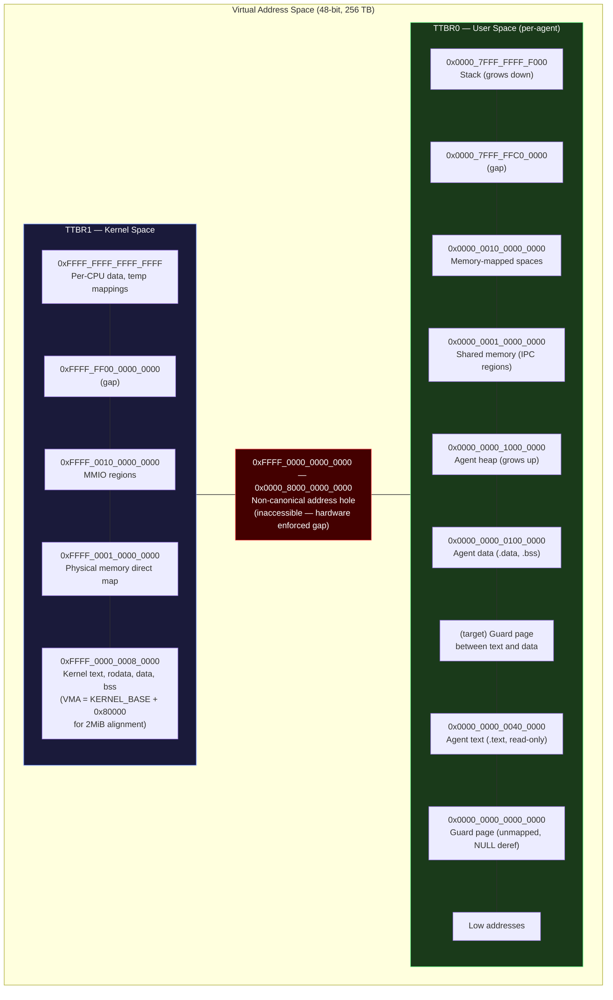
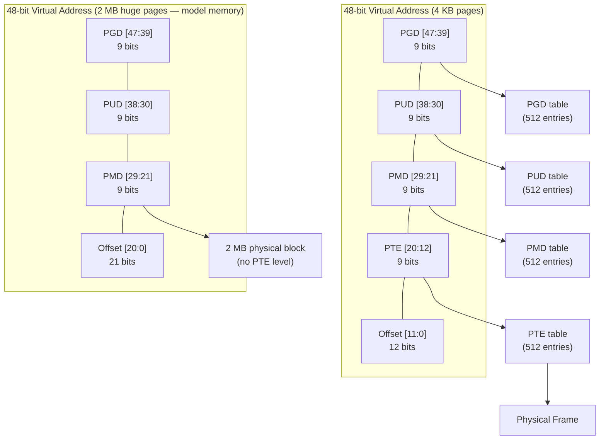
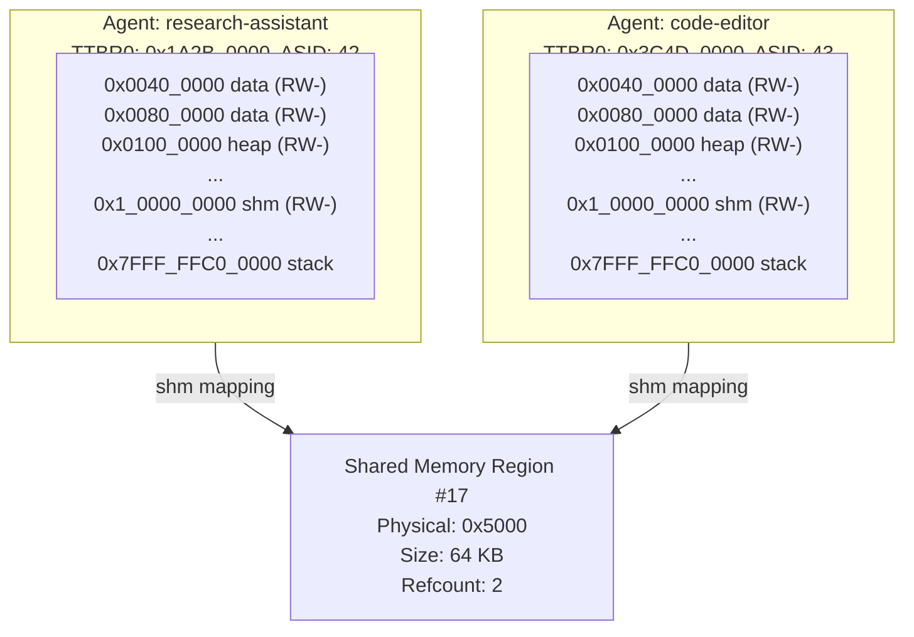

# AIOS Memory Management — Virtual Memory & Address Spaces

**Part of:** [memory.md](../memory.md) — Memory Management Hub
**Related:** [physical.md](./physical.md) — Physical memory, [ai.md](./ai.md) — Model memory, [ipc.md](./ipc.md) — IPC channels

-----

## 3. Virtual Memory Manager

### 3.1 Address Space Layout (aarch64)

ARM64 with 48-bit virtual addresses provides 256 TB of virtual address space, split between kernel (upper half, TTBR1) and user (lower half, TTBR0):



**Kernel space (TTBR1)** is identical across all processes. The same physical page tables back the upper-half mapping for every address space. Kernel code, data, heap, the physical memory direct map, and MMIO regions are always accessible when executing in EL1.

**User space (TTBR0)** is unique per agent. Each agent has its own page table tree rooted at TTBR0. When the scheduler switches from one agent to another, it writes the new agent's TTBR0 value. The kernel space stays mapped.

### 3.2 Page Tables

ARM64 with a 4 KB granule uses 4-level page tables. Each level indexes 9 bits of the virtual address:



```rust
/// Newtype wrappers for address types
#[derive(Copy, Clone, Debug, PartialEq, Eq, PartialOrd, Ord)]
pub struct VirtualAddress(pub usize);

#[derive(Copy, Clone, Debug, PartialEq, Eq, PartialOrd, Ord)]
pub struct PhysicalAddress(pub usize);

/// Page table entry (64 bits on aarch64)
#[repr(transparent)]
#[derive(Copy, Clone)]
pub struct PageTableEntry(u64);

impl PageTableEntry {
    // Bit positions in the aarch64 page table entry
    const VALID: u64       = 1 << 0;   // Entry is valid
    const TABLE: u64       = 1 << 1;   // Points to next-level table (not block)
    const ATTR_IDX: u64    = 0b111 << 2; // Memory attribute index (MAIR)
    const NS: u64          = 1 << 5;   // Non-secure
    const AP_RO: u64       = 1 << 7;   // Read-only
    const AP_USER: u64     = 1 << 6;   // User accessible (EL0)
    const SH_INNER: u64    = 0b11 << 8; // Inner shareable
    const AF: u64          = 1 << 10;  // Access flag
    const NG: u64          = 1 << 11;  // Not global (uses ASID)
    const PXN: u64         = 1 << 53;  // Privileged execute-never
    const UXN: u64         = 1 << 54;  // Unprivileged execute-never
    // Software-defined bits (target design — not yet in mm/pgtable.rs):
    const DIRTY: u64       = 1 << 55;  // Software: dirty
    const COW: u64         = 1 << 56;  // Software: copy-on-write

    pub fn is_valid(&self) -> bool { self.0 & Self::VALID != 0 }
    pub fn is_writable(&self) -> bool { self.0 & Self::AP_RO == 0 }
    pub fn is_user_executable(&self) -> bool { self.0 & Self::UXN == 0 }
    pub fn is_kernel_executable(&self) -> bool { self.0 & Self::PXN == 0 }
    pub fn is_user(&self) -> bool { self.0 & Self::AP_USER != 0 }
    pub fn is_dirty(&self) -> bool { self.0 & Self::DIRTY != 0 }
    pub fn is_cow(&self) -> bool { self.0 & Self::COW != 0 }

    pub fn frame(&self) -> PhysicalFrame {
        PhysicalFrame::from_address(PhysicalAddress(
            (self.0 & 0x0000_FFFF_FFFF_F000) as usize
        ))
    }

    /// W^X enforcement: setting writable clears executable, and vice versa
    pub fn set_writable(&mut self) {
        self.0 &= !Self::AP_RO;     // clear read-only → writable
        self.0 |= Self::UXN;        // set execute-never → not executable
        self.0 |= Self::PXN;
    }

    pub fn set_executable(&mut self) {
        self.0 |= Self::AP_RO;      // set read-only → not writable
        self.0 &= !Self::UXN;       // clear UXN → executable at EL0
        self.0 |= Self::PXN;        // set PXN → not executable at EL1 (user page)
    }

    /// Replace the physical frame address in this PTE.
    pub fn set_frame(&mut self, frame: PhysicalFrame) {
        self.0 = (self.0 & !0x0000_FFFF_FFFF_F000)
            | (frame.address().0 as u64 & 0x0000_FFFF_FFFF_F000);
    }

    /// Clear the COW software bit (page is now exclusively owned).
    pub fn clear_cow(&mut self) {
        self.0 &= !Self::COW;
    }
}

/// A page table (512 entries, 4 KB)
#[repr(C, align(4096))]
pub struct PageTable {
    entries: [PageTableEntry; 512],
}

/// Complete address space for a process (target design — see note below)
pub struct AddressSpace {
    /// Root page table (PGD) physical address — loaded into TTBR0
    pgd: PhysicalFrame,
    /// ASID for this address space
    asid: Asid,
    /// Virtual memory regions tracked for this space
    regions: BTreeMap<VirtualAddress, VmRegion>,
    /// Memory statistics
    stats: MemoryStats,
}
// Current implementation: UserAddressSpace in mm/uspace.rs
// { pgd_phys: usize, asid: Asid, stats: MemoryStats }
// VmRegion tracking and BTreeMap are part of the target design.

/// Describes a contiguous virtual memory region
pub struct VmRegion {
    pub start: VirtualAddress,
    pub size: usize,
    pub flags: VmFlags,
    pub kind: VmRegionKind,
}

bitflags::bitflags! {
    pub struct VmFlags: u32 {
        // Implemented in mm/pgtable.rs:
        const READ     = 0b0001;
        const WRITE    = 0b0010;
        const EXECUTE  = 0b0100;
        const USER     = 0b1000;
        // Target design (not yet implemented):
        const SHARED   = 0b0001_0000;
        const PINNED   = 0b0010_0000;
        const HUGE     = 0b0100_0000;  // 2 MB pages
        const NO_DUMP  = 0b1000_0000;  // Excluded from core dumps and zram compression (cryptographic keys)
    }
}

pub enum VmRegionKind {
    /// Agent code section
    Text,
    /// Agent data section
    Data,
    /// Agent heap (grows up via brk/mmap)
    Heap,
    /// Agent stack (grows down)
    Stack,
    /// Shared memory (IPC)
    SharedMemory { region_id: SharedMemoryId },
    /// Memory-mapped space object
    MappedObject { object_id: ObjectId },
    /// Guard page (unmapped, triggers fault)
    Guard,
}

/// Alias used in COW and fault-handling code (§5.4).
type Vma = VmRegion;

impl AddressSpace {
    /// Look up the PTE for a virtual address by walking the four-level page table.
    /// Returns a reference to the leaf PTE, or FaultError::InvalidAddress if
    /// any intermediate table is missing (no auto-population).
    pub fn lookup_pte(&self, addr: VirtualAddress) -> Result<&PageTableEntry, FaultError> {
        let l0_idx = (addr.0 >> 39) & 0x1FF;
        let l1_idx = (addr.0 >> 30) & 0x1FF;
        let l2_idx = (addr.0 >> 21) & 0x1FF;
        let l3_idx = (addr.0 >> 12) & 0x1FF;

        let l0 = &self.pgd;
        let l1 = l0.entry(l0_idx).table().ok_or(FaultError::InvalidAddress)?;
        let l2 = l1.entry(l1_idx).table().ok_or(FaultError::InvalidAddress)?;
        // L2 entry may be a 2 MB block (huge page) — return it directly
        if l2.entry(l2_idx).is_block() {
            return Ok(l2.entry_ref(l2_idx));
        }
        let l3 = l2.entry(l2_idx).table().ok_or(FaultError::InvalidAddress)?;
        Ok(l3.entry_ref(l3_idx))
    }

    /// Mutable variant of lookup_pte. Walks the four-level page table
    /// and returns a mutable reference to the leaf PTE. Used by update_pte()
    /// and COW fault handling (§5.4) to modify PTEs in place.
    pub fn lookup_pte_mut(&mut self, addr: VirtualAddress) -> Result<&mut PageTableEntry, FaultError> {
        let l0_idx = (addr.0 >> 39) & 0x1FF;
        let l1_idx = (addr.0 >> 30) & 0x1FF;
        let l2_idx = (addr.0 >> 21) & 0x1FF;
        let l3_idx = (addr.0 >> 12) & 0x1FF;

        let l0 = &mut self.pgd;
        let l1 = l0.entry_mut(l0_idx).table_mut().ok_or(FaultError::InvalidAddress)?;
        let l2 = l1.entry_mut(l1_idx).table_mut().ok_or(FaultError::InvalidAddress)?;
        if l2.entry(l2_idx).is_block() {
            return Ok(l2.entry_mut(l2_idx));
        }
        let l3 = l2.entry_mut(l2_idx).table_mut().ok_or(FaultError::InvalidAddress)?;
        Ok(l3.entry_mut(l3_idx))
    }

    /// Overwrite the PTE for a virtual address. Caller must ensure the
    /// intermediate tables already exist (see map_page for auto-population).
    /// Issues a TLB invalidation for the affected VA after the write.
    pub fn update_pte(&mut self, addr: VirtualAddress, pte: PageTableEntry) {
        // Walk to the leaf entry and overwrite it
        let leaf = self.lookup_pte_mut(addr).expect("PTE must exist for update");
        *leaf = pte;
        // Single-entry TLBI for this ASID + VA
        tlb_invalidate_page(self.asid, addr);
    }

    /// Find the VmRegion (VMA) containing `addr`, if any.
    /// VmRegions are stored in a BTreeMap sorted by base address;
    /// lookup finds the highest base ≤ addr and checks if addr < base + size.
    pub fn find_vma(&self, addr: VirtualAddress) -> Option<&VmRegion> {
        self.regions.range(..=addr).next_back()
            .filter(|(_, vma)| addr.0 < vma.base.0 + vma.size)
    }

    /// Walk the page table and return the PTE (may be invalid/encoded).
    /// Unlike lookup_pte, this does not require the PTE to be valid —
    /// it returns whatever bits are stored, including swap/compressed
    /// encodings (see [§10.5](./reclamation.md) for PteState decoding).
    pub fn walk_page_table(&self, addr: VirtualAddress) -> Result<PageTableEntry, FaultError> {
        self.lookup_pte(addr).copied()
    }

    /// Install a mapping: allocate intermediate page tables as needed, write the
    /// leaf PTE with the given frame and permissions. Enforces W^X — the perms
    /// argument must not set both WRITE and EXECUTE. Panics if W^X is violated.
    pub fn map_page(&mut self, addr: VirtualAddress, frame: PhysicalFrame, perms: VmFlags) {
        assert!(!perms.contains(VmFlags::WRITE | VmFlags::EXECUTE), "W^X violation");
        // Ensure L0→L1→L2→L3 tables exist, allocating from frame allocator as needed
        let l3_table = self.ensure_table_path(addr);
        let l3_idx = (addr.0 >> 12) & 0x1FF;
        l3_table.set_entry(l3_idx, PageTableEntry::page(frame, perms));
        tlb_invalidate_page(self.asid, addr);
    }
}
```

**W^X enforcement** is built into the page table entry constructors and mapping helpers. The `set_writable()` method automatically clears the executable bit. The `set_executable()` method automatically sets read-only. The `map_page()` method asserts that WRITE and EXECUTE are not both set. Raw PTE access via `from_raw()` remains an escape hatch for low-level code (e.g., trampoline pages), but all standard mapping paths enforce W^X.

### 3.3 KASLR

The kernel base address is randomized at boot to defeat return-oriented programming (ROP) attacks that rely on known kernel addresses.

```text
Boot sequence (two-phase TTBR1 approach):

Phase A — boot.S (before kernel_main):
1. UEFI loads kernel ELF at physical 0x40080000
2. boot.S builds minimal TTBR1 page tables (static L0/L1/L2 in BSS)
   - 2MB block descriptors covering kernel image at fixed KERNEL_BASE
   - MAIR Attr3 (WB cacheable), no KASLR yet
3. Set TCR T1SZ=16 for 48-bit kernel VA
4. Install TTBR1, branch to kernel_main at virtual address

Phase B — kernel_main (after pool init):
5. Read random seed:
   - Preferred: BootInfo.rng_seed from UEFI RNG protocol (EFI_RNG_PROTOCOL)
   - Fallback: ARM generic counter CNTPCT_EL0 (weak entropy)
6. Compute slide: (entropy % 64) * 2MB within 0..128 MB range
   - Currently: slide computed and logged but NOT applied (kernel runs at fixed base)
   - Future milestone: apply slide to TTBR1 mapping + branch to slid address
7. Build full TTBR1 with fine-grained W^X (4KB pages):
   - Kernel mapped at KERNEL_BASE (fixed base; +slide when KASLR fully applied)
   - Direct map at DIRECT_MAP_BASE (derived from UEFI memory map)
   - MMIO at MMIO_BASE
8. Switch TTBR1 to full tables (replacing boot.S minimal 2MB blocks)

Note: aarch64 Rust uses PC-relative ADRP+ADD addressing by default.
When the entire kernel image shifts uniformly, all PC-relative references
resolve correctly — no pointer fixups will be needed when KASLR slide is applied.
```

```rust
pub struct KaslrConfig {
    /// Minimum kernel base address
    pub base: VirtualAddress,
    /// Alignment of the slide (2 MB — must be huge page aligned)
    pub alignment: usize,
    /// Range of possible slides
    pub slide_range: usize,
    /// Actual slide chosen at boot
    pub slide: usize,
}

impl KaslrConfig {
    pub fn default() -> Self {
        Self {
            base: VirtualAddress(0xFFFF_0000_0000_0000),
            alignment: 2 * MB,
            slide_range: 128 * MB,
            slide: 0, // computed at boot
        }
    }

    pub fn compute_slide(&mut self, entropy: u64) {
        let steps = self.slide_range / self.alignment;
        let step = (entropy as usize) % steps;
        self.slide = step * self.alignment;
    }

    pub fn kernel_base(&self) -> VirtualAddress {
        VirtualAddress(self.base.0 + self.slide)
    }
}
```

The slide range provides 64 possible positions at 2 MB alignment within a 128 MB window (unidirectional, starting from the base address) — enough to thwart automated attacks while keeping kernel virtual memory layout predictable for debugging.

### 3.4 TLB Management

The TLB (Translation Lookaside Buffer) caches virtual-to-physical translations. Without care, switching between address spaces requires a full TLB flush, which destroys performance. AIOS avoids this by using ASIDs.

**ASID (Address Space Identifier):** Each process gets a unique 16-bit ASID. TLB entries are tagged with the ASID. On context switch, the kernel writes the new ASID into TTBR0 — TLB entries from other ASIDs are ignored automatically, without flushing.

```rust
pub struct AsidAllocator {
    /// Current generation (incremented when ASID space wraps)
    generation: u64,
    /// Next ASID to allocate
    next: u16,
    /// Maximum ASID value (hardware-dependent, typically 65535)
    max: u16,
}

#[derive(Copy, Clone, Debug, PartialEq, Eq)]
pub struct Asid {
    pub value: u16,
    pub generation: u64,
}

impl AsidAllocator {
    /// Allocate an ASID for a new process.
    /// Returns (Asid, needs_flush) — the bool indicates whether a full
    /// TLB flush is needed due to generation wraparound.
    pub fn alloc(&mut self) -> (Asid, bool) {
        let value = self.next;
        let mut needs_flush = false;

        self.next = self.next.wrapping_add(1);
        if self.next == 0 {
            // Wrapped past u16::MAX — skip 0 (kernel reserved), bump generation
            self.next = 1;
            self.generation = self.generation.wrapping_add(1);
            needs_flush = true; // caller must perform full TLB flush
        }
        (Asid { value, generation: self.generation }, needs_flush)
    }

    /// Check if an ASID is still valid (same generation)
    pub fn is_valid(&self, asid: &Asid) -> bool {
        asid.generation == self.generation
    }
}
```

**TLB invalidation operations used by AIOS:**

| Operation | aarch64 Instruction | When Used |
|---|---|---|
| Invalidate single page | `TLBI VAE1IS, <Xt>` | Page remapped or unmapped |
| Invalidate by ASID | `TLBI ASIDE1IS, <Xt>` | Process terminated |
| Invalidate all | `TLBI VMALLE1IS` | ASID generation wraparound |

Single-page and ASID invalidations include the `IS` (Inner Shareable) suffix to broadcast to all cores on multi-core devices like the Pi 4/5.

-----

## 5. Per-Agent Memory Management

### 5.1 Agent Address Spaces

Each agent gets its own address space — a unique TTBR0 page table tree. No two agents share virtual-to-physical mappings except through explicit shared memory regions.



When the kernel creates an agent process, it:

1. Allocates a PGD page from the kernel pool
2. Copies the kernel portion (TTBR1 entries are the same for all processes)
3. Creates the initial user-space mappings: text, data, heap, stack
4. Assigns an ASID
5. Records the memory limit from the agent manifest (or system default)

```rust
/// Agent process — memory-relevant fields shown here.
/// Full struct includes additional fields for capabilities, IPC channels,
/// CPU quota, space mounts, and manifest (see architecture.md §6.3).
pub struct AgentProcess {
    pub pid: ProcessId,
    pub agent_id: AgentId,
    pub capabilities: CapabilitySet,
    pub address_space: AddressSpace,
    pub memory_limit: usize,           // max RSS in bytes
    pub memory_stats: AgentMemoryStats,
    pub cpu_quota: CpuQuota,
    pub ipc_channels: Vec<ChannelId>,
    pub space_access: Vec<SpaceMount>,
    pub manifest: AgentManifest,
    /// Agent priority from manifest ([§8](./reclamation.md)).
    /// Used by OOM scorer ([§8](./reclamation.md)) and thrash detector ([§10.6](./reclamation.md)) for victim selection.
    pub priority: AgentPriority,
    /// Whether this agent is currently suspended (e.g., by thrash detector).
    pub suspended: bool,
}

impl AgentProcess {
    pub fn priority(&self) -> AgentPriority { self.priority }
    pub fn is_suspended(&self) -> bool { self.suspended }
}
```

### 5.2 Memory Accounting

Every page allocated to an agent is tracked. The kernel maintains per-agent statistics and enforces limits:

```rust
pub struct AgentMemoryStats {
    /// Resident Set Size — physical pages currently mapped
    pub rss: usize,
    /// Virtual size — total virtual address range mapped
    pub virtual_size: usize,
    /// Private pages — pages owned exclusively by this agent
    pub private_pages: usize,
    /// Shared pages — pages in shared memory regions
    pub shared_pages: usize,
    /// Peak RSS (high-water mark)
    pub peak_rss: usize,
    /// Page faults (total)
    pub page_faults: u64,
    /// Page faults (major — required disk I/O)
    pub major_faults: u64,
    /// Major faults in the current 1-second sampling window
    pub major_faults_in_window: u64,
    /// Timestamp of the last sampling window start
    pub last_sample_time: Timestamp,
    /// Memory limit for this agent
    pub limit: usize,
}

impl AgentMemoryStats {
    /// Check if the agent has exceeded its memory limit
    pub fn is_over_limit(&self) -> bool {
        self.rss > self.limit
    }

    /// Remaining budget before limit
    pub fn remaining(&self) -> usize {
        self.limit.saturating_sub(self.rss)
    }

    /// Major fault rate (faults requiring disk I/O) over the last sampling window.
    /// Used by ThrashDetector to identify agents causing excessive paging.
    /// The sampling window is 1 second, updated on each major fault.
    pub fn major_faults_per_sec(&self) -> f64 {
        let elapsed = Timestamp::now().as_millis() - self.last_sample_time.as_millis();
        if elapsed == 0 { return 0.0; }
        (self.major_faults_in_window as f64) / (elapsed as f64 / 1000.0)
    }
}
```

**Shared page accounting:** When a shared memory region is mapped into two agents, each agent is charged for half the pages. This prevents agents from evading memory limits by hiding allocations in shared regions. The formula: `charged = shared_region_size / participant_count`. If one agent unmaps, the remaining agent absorbs the full cost.

**Model memory is not charged to agents.** Model weights, KV caches, and embedding stores live in the model pool. They are system infrastructure managed by AIRS. Charging model memory to agents would be meaningless — no single agent "owns" the model, and the memory would instantly blow past any reasonable agent limit.

**Accounting is visible.** Per-agent memory stats are exposed through the Inspector and agent cards in the GUI. Users can see exactly how much memory each agent uses.

### 5.3 Memory Limit Enforcement

When an agent's RSS exceeds its memory limit, the kernel does not silently kill it. The enforcement sequence:

```text
1. Agent's RSS crosses memory limit
     |
2. Kernel sets agent state to Suspended (scheduler.md §3.3 ThreadState::Suspended)
   (agent threads stop executing, no data loss)
     |
3. Kernel sends notification to Attention Manager:
   "Agent 'research-assistant' exceeded its 4 MB memory limit (current: 5.2 MB)"
     |
4. Attention Manager notifies user with options:
   a) Increase limit (to suggested value based on agent behavior)
   b) Terminate agent (state saved to space best-effort)
   c) Terminate other agents to free memory
     |
5. User chooses — or if no response within 30 seconds,
   agent remains paused until user acts
```

The agent is never silently killed except in OOM conditions ([§8](./reclamation.md)). Pausing preserves the agent's state so it can resume if the user increases the limit.

### 5.4 Copy-on-Write

AIOS rarely forks processes (agents are typically spawned fresh from manifests), but COW is used in two cases:

1. **POSIX fork()** — BSD tools call fork(). The child gets a COW copy of the parent's address space. Pages are marked read-only with the COW software bit set. On write, the page fault handler allocates a new page, copies the content, and maps the new page as writable.

2. **Flow object transfer** — when an agent sends a large object through Flow, the kernel maps the object's pages into the receiver's address space with COW semantics. If the receiver only reads the data, no copy occurs. If the receiver writes, it gets a private copy.

```rust
/// Handle a page fault on a COW page.
/// Called from the page fault dispatcher ([§10.5](./reclamation.md)) with the faulting address,
/// the original frame from the PTE, the owning process, and the VMA.
fn handle_cow_fault(
    fault_addr: VirtualAddress,
    original_frame: PhysicalFrame,
    process: &mut Process,
    vma: &Vma,
) -> Result<(), FaultError> {
    let addr_space = &mut process.address_space;
    let pte = addr_space.lookup_pte(fault_addr)?;

    if !pte.is_cow() {
        return Err(FaultError::AccessViolation);
    }

    let old_frame = original_frame;
    let new_frame = FRAME_ALLOCATOR
        .alloc_page(Pool::User)
        .ok_or(FaultError::OutOfMemory)?;

    // Copy page content
    unsafe {
        core::ptr::copy_nonoverlapping(
            old_frame.as_ptr::<u8>(),
            new_frame.as_mut_ptr::<u8>(),
            PAGE_SIZE,
        );
    }

    // Update PTE: new frame, writable, no longer COW
    let mut new_pte = *pte;
    new_pte.set_frame(new_frame);
    new_pte.set_writable();
    new_pte.clear_cow();
    addr_space.update_pte(fault_addr, new_pte);

    // Decrement refcount on old frame; free if zero
    if FRAME_REFCOUNT.decrement(old_frame) == 0 {
        FRAME_ALLOCATOR.free_pages(old_frame, 0);
    }

    Ok(())
}
```

-----

## 7. Shared Memory and IPC

### 7.1 Shared Memory Regions

Shared memory enables zero-copy IPC. When an agent needs to transfer large data to a service (or to another agent), it writes the data into a shared memory region and sends the region ID over the IPC channel. The receiver maps the same physical pages into its own address space.

```rust
/// A shared memory region managed by the kernel.
/// Canonical definition — must match ipc.md §4.5.
pub struct SharedMemoryRegion {
    pub id: SharedMemoryId,
    /// Physical frames backing this region (contiguous page range)
    pub physical_pages: PageRange,
    /// Reference count: incremented on map, decremented on unmap or
    /// process death. Physical pages freed when count reaches 0.
    pub ref_count: AtomicU32,
    /// The process that created this region
    pub creator: ProcessId,
    /// Maximum permissions granted at creation time
    pub max_flags: MemoryFlags,
    /// Capability required to access
    pub capability: CapabilityTokenId,
    /// Per-mapping permissions (bounded; MAX_SHARED_MAPPINGS = 8)
    pub mappings: [Option<SharedMapping>; MAX_SHARED_MAPPINGS],
}

pub struct SharedMapping {
    pub process: ProcessId,
    pub vaddr: VirtualAddress,
    pub flags: VmFlags,  // may be more restrictive than max_flags
}
```

Creation flow:

```text
Agent A wants to share 1 MB with Agent B:

1. Agent A: syscall SharedMemoryCreate { size: 1 MB }
   -> Kernel allocates frames from user pool
   -> Kernel maps into Agent A at 0x1_0000_0000
   -> Returns SharedMemoryId and CapabilityTokenId

2. Agent A: writes data to shared region (direct memory access)

3. Agent A: syscall SharedMemoryShare { region, channel_to_B, flags: READ }
   -> Kernel verifies A holds the capability
   -> Kernel creates a read-only mapping capability for B
   -> Transfers capability to B over the IPC channel

4. Agent B: syscall SharedMemoryMap { region, flags: READ }
   -> Kernel verifies B holds the received capability
   -> Kernel maps the SAME physical frames into B at 0x1_0000_0000
   -> B can now read the data directly — no copy

5. When done: either agent calls SharedMemoryUnmap
   -> Kernel unmaps from that agent's address space
   -> When all mappings removed, frames freed
```

Both agents access the same physical memory. The kernel enforces that the receiver's mapping flags are at most as permissive as what the sender granted. If the sender shares as read-only, the receiver cannot write.

**Stability during pool boundary resizing:** Shared memory regions are allocated from the user pool. When AIRS resource orchestration resizes the model pool / user pool boundary (see [airs.md §10](../intelligence/airs.md), [model.md §9](../security/model.md)), shared memory physical frames are **never reclaimed or relocated**:

```rust
impl DynamicModelPool {
    /// When shrinking the user pool (growing model pool), the kernel
    /// can only reclaim FREE pages from the user pool. Pages that are:
    ///   - Mapped by any agent (including shared memory)
    ///   - Pinned for DMA
    ///   - Part of an active page cache entry
    /// are NOT eligible for reclamation. The kernel moves the pool
    /// boundary only as far as free pages allow.
    ///
    /// Shared memory frames have refcount >= 2 (multiple mappers).
    /// They are never on the free list. Pool resizing cannot touch them.
    pub fn shrink_user_pool(&self, target_delta: usize) -> usize {
        let mut reclaimed = 0;
        for frame in self.user_pool.free_list() {
            if reclaimed >= target_delta { break; }
            // Only FREE frames — never mapped, pinned, or shared
            self.transfer_to_model_pool(frame);
            reclaimed += frame.size;
        }
        reclaimed  // may be less than target_delta if not enough free frames
    }
}
```

Pool boundary resizing operates exclusively on the **free page list**. Shared memory regions are backed by physical frames that are mapped into at least one (usually two or more) agent address spaces. These frames have nonzero reference counts and are never on the free list. There is no mechanism by which pool resizing can fragment, relocate, or reclaim shared memory. The physical frames backing shared regions are stable for their entire lifetime, regardless of pool boundary movement.

If AIRS requests a pool resize larger than the available free pages, the resize is partially fulfilled — the boundary moves as far as free pages allow, and the remaining shortfall is logged as a resource pressure event. This prevents pool resizing from evicting active mappings to satisfy the request.

### 7.2 Memory-Mapped Space Objects

Space objects can be memory-mapped into an agent's address space, avoiding the overhead of IPC read calls for large objects (images, documents, model files):

```rust
/// Memory-map a space object into the calling agent's address space
pub fn map_space_object(
    space: SpaceId,
    object: ObjectId,
    flags: VmFlags,
) -> Result<VirtualAddress, MapError> {
    // 1. Verify agent holds ReadSpace(space) capability
    // 2. Resolve object to physical storage blocks
    // 3. Create VmRegion of kind MappedObject
    // 4. Map pages (demand-paged — not loaded until accessed)
    // 5. Return virtual address
}
```

Immutable objects (most space content) are mapped read-only and shared across any agents that map them — same physical pages, multiple virtual mappings. If an agent needs to modify the content, it gets a COW mapping: reads see the shared pages, writes trigger a page fault that allocates private copies.

#### 7.2.1 Page Fault Re-Verification

When an agent accesses a mapped space object page that is not currently resident (evicted during memory pressure, or not yet demand-paged), the page fault handler **re-verifies the agent's capability** before loading the page:

```rust
/// Page fault handler for MappedObject regions.
/// Called by the kernel when an agent accesses a non-resident page
/// in a VmRegion of kind MappedObject.
fn handle_mapped_object_fault(
    agent: AgentId,
    region: &VmRegion,
    fault_addr: VirtualAddress,
) -> Result<PhysicalFrame, FaultError> {
    let space = region.source_space();
    let object = region.source_object();

    // Step 1: Re-verify capability.
    // The agent may have had its ReadSpace token revoked since the
    // initial map_space_object() call. A revoked capability means
    // the agent no longer has the right to read this data.
    if !capability_table.check(agent, Capability::ReadSpace(space)) {
        // Capability revoked — unmap the entire region.
        // Agent receives SIGSEGV (or AIOS equivalent).
        unmap_region(agent, region);
        return Err(FaultError::CapabilityRevoked);
    }

    // Step 2: Load page through Space Storage read path.
    // This includes checksum verification and decryption.
    let frame = space_storage.read_page(space, object, fault_addr.page_offset())?;

    // Step 3: Map the frame into the agent's address space.
    map_page(agent, fault_addr, frame, region.flags());

    Ok(frame)
}
```

**Why re-verify on every fault:** The initial `map_space_object()` call establishes a virtual mapping, but pages are demand-loaded. Between the initial map and a page fault, the agent's capability may have been revoked (user removed the agent's access via Inspector, capability expired, cascade revocation from parent token). Without re-verification, a revoked agent could continue reading data from pages that happen to fault in — the mapping itself would be a stale privilege.

**When capability is revoked:** If the check fails, the kernel unmaps the entire `MappedObject` region from the agent's address space. The agent receives a fault signal. The provenance chain records the denied access. This is the same behavior as a denied `SpaceRead` syscall — just triggered by a page fault instead of an explicit read.

**Performance:** The capability re-check is O(1) in the kernel `CapabilityTable` — a hash lookup, not an IPC round-trip. It adds ~50 ns to a page fault that already costs ~100 us (SD card read) or ~5 us (NVMe). The security cost is negligible.

-----
