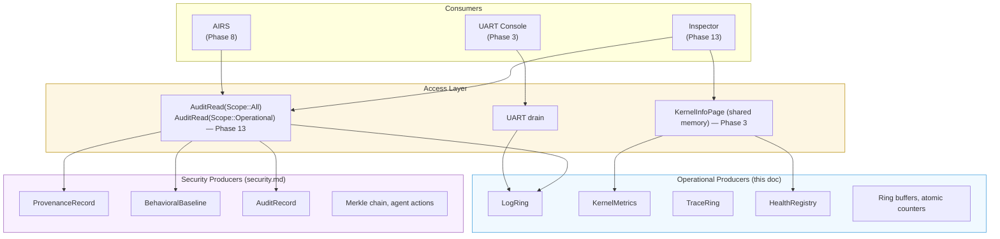

# AIOS Kernel Observability

## Deep Technical Architecture

**Parent document:** [architecture.md](../project/architecture.md)
**Related:** [security.md](../security/security.md) — Provenance recording (§2.7), behavioral baselines (§2.3 Layer 3), [inspector.md](../applications/inspector.md) — Security dashboard (consumer), [subsystem-framework.md](../platform/subsystem-framework.md) — Per-subsystem audit spaces (§7), [memory.md](./memory.md) — MemoryPressure (§8.1), [ipc.md](./ipc.md) — AuditLog syscall, [scheduler.md](./scheduler.md) — Scheduling classes

-----

## 1. Overview

The kernel needs to answer two fundamentally different questions about itself. The first is a security question: "What did agent X do, and was it authorized?" The second is an operational question: "Why is the scheduler stalling on core 2, and how many pages did the buddy allocator split in the last second?"

The security question is answered by the **provenance system** — a tamper-evident Merkle chain of agent actions, designed in [security.md](../security/security.md) §2.7 and consumed by the [Inspector](../applications/inspector.md). The operational question has no answer today. The kernel uses `println!()` to a PL011 UART with informal `[boot]` and `[mm]` prefixes. There are no log levels, no structured format, no metric counters, no trace points. Once the scheduler is running across four cores, interleaved `println!()` output is unreadable, and there is no way to measure IPC latency, context switch frequency, or memory pressure trends.

This document specifies the kernel's **operational observability** infrastructure — the producer side that generates structured telemetry for debugging, performance analysis, and health monitoring. It covers three pillars:

1. **Structured Logging** — Leveled, subsystem-tagged log entries in per-core ring buffers, replacing `println!()`
2. **Metric Counters** — Per-core sharded atomic counters, gauges, and histograms for quantitative measurement
3. **Trace Points** — Compile-time switchable binary event records for high-frequency scheduler/IPC/memory instrumentation

### 1.1 Relationship to Security Observability



### 1.2 Scope Exclusions

This document does **not** cover:

- **Agent-action provenance** — The `ProvenanceRecord` Merkle chain that records "agent X read space Y" is specified in [security.md](../security/security.md) §2.7. That is a security audit system with cryptographic integrity guarantees. Operational logs do not go into the Merkle chain.
- **Per-subsystem hardware audit events** — The `AuditRecord` trait and per-subsystem audit spaces (`system/audit/network/`, `system/audit/audio/`, etc.) are specified in [subsystem-framework.md](../platform/subsystem-framework.md) §7. Those record hardware access for user-facing transparency.
- **Behavioral baselines and anomaly detection** — The `BehavioralBaseline` and `AnomalyType` system is specified in [security.md](../security/security.md) §2.3 (Layer 3). That system uses statistical analysis of agent behavior patterns.
- **Inspector UI/UX** — The Inspector dashboard layout, views, and refresh rates are specified in [inspector.md](../applications/inspector.md).

This document specifies the **kernel-internal instrumentation primitives** that these higher-level systems may consume, but the two streams (security provenance and operational telemetry) remain architecturally separate.

-----

## 2. Structured Logging

### 2.1 Problem

The current `println!()` macro in [uart.rs](../../kernel/src/arch/aarch64/uart.rs) writes directly to the PL011 UART, byte by byte, without any locking (UART locking is deferred — spinlocks are unsafe on Phase 1 Non-Cacheable memory). This has three problems:

1. **No filtering** — Every message goes to the UART at UART speed (115200 baud = ~11.5 KB/s). A burst of debug output during memory init blocks the boot sequence for hundreds of milliseconds.
2. **No structure** — Messages are free-form strings. The `[boot]` and `[mm]` prefixes are conventions, not enforced tags. There is no way to filter by subsystem or severity programmatically.
3. **No SMP safety** — Under multi-core execution, unlocked byte-by-byte writes from different cores interleave at the character level, producing garbled output. The Phase 1 turn-based protocol (`PRINT_TURN` in [smp.rs](../../kernel/src/smp.rs)) solved this for boot, but it serializes all cores — unacceptable for a running system.

### 2.2 Log Levels

```rust
/// Log severity levels, ordered from most to least verbose.
/// Compile-time filtering: levels below the configured minimum are
/// eliminated entirely by the compiler (zero cost when disabled).
#[repr(u8)]
#[derive(Debug, Clone, Copy, PartialEq, Eq, PartialOrd, Ord)]
pub enum LogLevel {
    /// High-frequency instrumentation details. Compiled out in release.
    Trace = 0,
    /// Developer-facing diagnostic information.
    Debug = 1,
    /// Normal operational events: boot progress, subsystem initialization.
    Info  = 2,
    /// Unexpected but non-fatal conditions.
    Warn  = 3,
    /// Failures requiring attention.
    Error = 4,
    /// Unrecoverable conditions (precedes panic or halt).
    Fatal = 5,
}
```

The minimum log level is set at compile time via Cargo features. The default for debug builds is `Debug`; for release builds, `Info`. `Trace`-level logging is only available in debug builds and is intended for short-lived instrumentation during development.

### 2.3 Subsystem Tags

```rust
/// Subsystem tag identifying the origin of a log entry.
/// Fixed set — adding a new subsystem requires a kernel change.
/// Matches the informal [boot], [mm] prefixes already used in println!() calls.
#[repr(u8)]
#[derive(Debug, Clone, Copy, PartialEq, Eq)]
pub enum Subsystem {
    Boot    = 0,   // Boot sequence, phase transitions
    Mm      = 1,   // Memory management: buddy, slab, pools, pgtable
    Sched   = 2,   // Scheduler: context switch, runqueue, migration
    Ipc     = 3,   // IPC: channels, messages, capability checks
    Cap     = 4,   // Capability manager: grant, revoke, validate
    Irq     = 5,   // Interrupt handling: GIC, IRQ dispatch
    Timer   = 6,   // ARM Generic Timer: tick, deadline, sleep
    Uart    = 7,   // UART driver: init, drain, errors
    Gic     = 8,   // GICv3: distributor, redistributor, config
    Mmu     = 9,   // MMU: page table ops, TLB flush, ASID
    Smp     = 10,  // SMP: core bringup, PSCI, secondary init
    Storage = 11,  // Block engine: WAL, LSM, compaction (Phase 4+)
    Audit   = 12,  // Audit subsystem: provenance, export
}

impl Subsystem {
    pub const COUNT: usize = 13;
}
```

### 2.4 Log Entry Format

```rust
/// A single log entry in the kernel ring buffer.
/// Fixed 64 bytes — one per cache line on Cortex-A72.
/// No heap allocation: usable before and after heap init.
#[repr(C)]
pub struct LogEntry {
    /// Monotonic timestamp from CNTVCT_EL0 (timer ticks, not wall clock).
    /// Resolution depends on CNTFRQ_EL0 (e.g., ~16 ns at 62.5 MHz on QEMU).
    pub timestamp: u64,          // 8 bytes
    /// CPU core that produced this entry (0-based).
    pub core_id: u8,             // 1 byte
    /// Log severity level.
    pub level: LogLevel,         // 1 byte
    /// Originating subsystem.
    pub subsystem: Subsystem,    // 1 byte
    /// Flags: bit 0 = continuation (message truncated, next entry continues it).
    pub flags: u8,               // 1 byte
    /// Length of valid bytes in `message` (0..=48).
    pub msg_len: u8,             // 1 byte
    /// Reserved for future use.
    pub _reserved: [u8; 3],      // 3 bytes
    /// Inline message buffer. Messages longer than 48 bytes are truncated
    /// (with the continuation flag set if a second entry follows).
    /// UTF-8 encoded. Not null-terminated.
    pub message: [u8; 48],       // 48 bytes
}                                // Total: 64 bytes

const _: () = assert!(core::mem::size_of::<LogEntry>() == 64);
```

The 48-byte inline message covers the vast majority of kernel log messages. A typical line like `"Pool init: 32768 pages in Kernel"` is 35 bytes. For the rare longer message, the continuation flag allows chaining two entries (96 bytes of message), which is sufficient for any kernel diagnostic.

### 2.5 Per-Core Ring Buffer

```rust
/// Lock-free per-core log ring buffer.
///
/// One instance per CPU core, indexed by core ID. The owning core is the
/// sole producer (writes to `head`). The UART drain function is the sole
/// consumer (reads from `tail`). This single-producer/single-consumer
/// design requires no locks or atomic RMW — only Release/Acquire ordering.
pub struct LogRing {
    /// Fixed-size entry array. Power-of-2 count for efficient masking.
    entries: [LogEntry; 256],       // 256 * 64 = 16 KiB per core
    /// Next write position (producer, owning core only).
    head: AtomicU32,
    /// Next read position (consumer, drain task only).
    tail: AtomicU32,
}

/// Global log rings, one per core. BSS-allocated (zero-initialized at boot).
/// MAX_CORES (8) * 16 KiB = 128 KiB total — fits comfortably in the kernel BSS.
static LOG_RINGS: [LogRing; MAX_CORES] = LogRing::INIT_ARRAY;
```

When the ring is full (head catches tail), new entries **overwrite** the oldest entries. This is intentional — log loss under pressure is preferable to blocking the producer (which could be in an interrupt handler or holding a lock).

### 2.6 Logging Macros

```rust
/// Primary structured logging macro. Replaces println!() throughout the kernel.
///
/// Usage: klog!(Info, Mm, "Pool init: {} pages in {:?}", count, pool);
///
/// Entries below the compile-time minimum level are eliminated entirely.
/// At runtime, the entry is written to the current core's LogRing.
macro_rules! klog {
    ($level:ident, $subsys:ident, $($arg:tt)*) => {{
        const _LEVEL: $crate::observability::LogLevel = $crate::observability::LogLevel::$level;
        if _LEVEL >= $crate::observability::MIN_LOG_LEVEL {
            $crate::observability::log_impl(
                _LEVEL,
                $crate::observability::Subsystem::$subsys,
                format_args!($($arg)*),
            );
        }
    }};
}

/// Convenience macros:
macro_rules! kinfo  { ($subsys:ident, $($arg:tt)*) => { klog!(Info,  $subsys, $($arg)*) }; }
macro_rules! kwarn  { ($subsys:ident, $($arg:tt)*) => { klog!(Warn,  $subsys, $($arg)*) }; }
macro_rules! kerror { ($subsys:ident, $($arg:tt)*) => { klog!(Error, $subsys, $($arg)*) }; }
macro_rules! kdebug { ($subsys:ident, $($arg:tt)*) => { klog!(Debug, $subsys, $($arg)*) }; }
macro_rules! ktrace { ($subsys:ident, $($arg:tt)*) => { klog!(Trace, $subsys, $($arg)*) }; }
```

### 2.7 UART Drain

A drain function, called periodically from the timer tick handler or idle loop, reads all per-core rings and writes formatted entries to the UART:

```
[   0.003142] [0] INFO  Mm   Pool init: 32768 pages in Kernel
[   0.003287] [0] INFO  Mm   Pool init: 458752 pages in User
[   0.004501] [1] INFO  Smp  Core 1 online
[   0.004512] [2] INFO  Smp  Core 2 online
[   0.005001] [0] WARN  Mm   Slab OOM for size class 2048
```

The format is: `[seconds.micros] [core] LEVEL Subsys Message`. The timestamp is converted from CNTVCT_EL0 ticks to seconds using the timer frequency (62.5 MHz on QEMU).

The drain function holds the UART lock for the duration of one batch (up to 16 entries per drain call). This bounds the maximum time the UART is held, preventing log storms from blocking other cores.

### 2.8 Early Boot Fallback

During early boot — before per-core rings are initialized, before the timer is running — `klog!()` falls back to direct synchronous UART write, identical to today's `println!()` behavior. The `boot_phase` check (before `HeapReady` or a dedicated `LogRingsReady` phase) gates this. Once rings are initialized (after BSS is zeroed and core ID is known), all logging goes through the ring buffer path.

This ensures the logging infrastructure is available from the very first line of `kernel_main`, with zero behavior change for early boot diagnostics.

-----

## 3. Metric Counters

### 3.1 Problem

The kernel currently has on-demand queries — `pool_free_pages()`, `total_free_pages()` in [frame.rs](../../kernel/src/mm/frame.rs) — but no persistent counters. These functions return a point-in-time snapshot. There is no way to answer "how many pages were allocated in the last 10 seconds" or "what is the syscall rate" without adding instrumentation to every call site.

### 3.2 Counter (Monotonic)

```rust
/// A monotonically increasing counter, sharded per core for zero-contention writes.
///
/// Write path (~3 instructions): read MPIDR for core ID, atomic fetch_add on local shard.
/// Read path: sum all shards (relaxed ordering — approximate but non-blocking).
///
/// Per-core sharding eliminates cache-line bouncing. On a 4-core system, each core's
/// shard lives on its own cache line (64-byte aligned), so concurrent increments
/// from different cores never contend.
pub struct Counter {
    shards: [CacheAligned<AtomicU64>; MAX_CORES],
}

/// Cache-line-aligned wrapper to prevent false sharing between cores.
#[repr(align(64))]
pub struct CacheAligned<T>(pub T);

impl Counter {
    /// Increment by 1 on the current core.
    #[inline(always)]
    pub fn inc(&self) {
        let core = current_core_id();
        self.shards[core].0.fetch_add(1, Ordering::Relaxed);
    }

    /// Increment by `n` on the current core.
    #[inline(always)]
    pub fn add(&self, n: u64) {
        let core = current_core_id();
        self.shards[core].0.fetch_add(n, Ordering::Relaxed);
    }

    /// Read the total across all cores. Relaxed ordering: may lag slightly
    /// behind concurrent writes, but is non-blocking and eventually consistent.
    pub fn read(&self) -> u64 {
        self.shards.iter().map(|s| s.0.load(Ordering::Relaxed)).sum()
    }
}
```

### 3.3 Gauge (Point-in-Time)

```rust
/// A point-in-time value that can go up or down.
/// Not sharded — gauges represent a single system-wide value
/// (e.g., "current free pages in kernel pool").
///
/// Writes are infrequent relative to counters (updated on state change,
/// not on every operation), so contention is not a concern.
pub struct Gauge {
    value: AtomicI64,
}

impl Gauge {
    pub fn set(&self, val: i64) { self.value.store(val, Ordering::Relaxed); }
    pub fn get(&self) -> i64 { self.value.load(Ordering::Relaxed) }
    pub fn inc(&self) { self.value.fetch_add(1, Ordering::Relaxed); }
    pub fn dec(&self) { self.value.fetch_sub(1, Ordering::Relaxed); }
}
```

### 3.4 Histogram (Latency Distribution)

```rust
/// Fixed-bucket histogram for latency distributions.
/// Bucket boundaries are defined at compile time. Each bucket is a sharded Counter.
///
/// Used for IPC round-trip time, context switch latency, slab allocation time.
pub struct Histogram<const N: usize> {
    /// Upper bound (inclusive) for each bucket, in nanoseconds.
    /// The final bucket captures everything above buckets[N-2].
    /// Example for IPC: [1_000, 5_000, 10_000, 50_000, 100_000, 500_000, 1_000_000]
    ///                   <1us   <5us   <10us   <50us   <100us   <500us   <1ms    >1ms
    pub buckets: [u64; N],
    /// Per-bucket counters.
    pub counts: [Counter; N],
    /// Sum of all observed values, for computing mean.
    pub sum: Counter,
    /// Total observation count.
    pub total: Counter,
}

impl<const N: usize> Histogram<N> {
    /// Record an observation in nanoseconds.
    pub fn observe(&self, value_ns: u64) {
        let idx = self.buckets.iter().position(|&b| value_ns <= b).unwrap_or(N - 1);
        self.counts[idx].inc();
        self.sum.add(value_ns);
        self.total.inc();
    }

    /// Compute the mean observation value.
    pub fn mean_ns(&self) -> u64 {
        let total = self.total.read();
        if total == 0 { 0 } else { self.sum.read() / total }
    }
}
```

### 3.5 Kernel Metrics Registry

All kernel metrics are statically allocated in BSS. No heap, no registration, no dynamic dispatch. The compiler eliminates unused metrics entirely when the feature is disabled.

```rust
/// Central metrics registry. BSS-allocated, zero-initialized, always available.
/// Feature-gated: cfg(feature = "kernel-metrics"). When disabled, all types
/// become zero-sized and all methods are no-ops (zero runtime cost).
pub struct KernelMetrics {
    // ── Memory ──────────────────────────────────────────────────────────
    pub mm_page_alloc:       Counter,  // Pages allocated (any pool)
    pub mm_page_free:        Counter,  // Pages freed (any pool)
    pub mm_slab_alloc:       Counter,  // Slab allocations
    pub mm_slab_free:        Counter,  // Slab frees
    pub mm_slab_oom:         Counter,  // Slab allocation failures (OOM)
    pub mm_buddy_split:      Counter,  // Buddy block splits (order reduction)
    pub mm_buddy_coalesce:   Counter,  // Buddy block coalesces (order increase)
    pub mm_free_pages:       Gauge,    // Current free pages (all pools)
    pub mm_kernel_free:      Gauge,    // Current free pages (kernel pool)
    pub mm_user_free:        Gauge,    // Current free pages (user pool)

    // ── Scheduler (Phase 3) ─────────────────────────────────────────────
    pub sched_context_switch:    Counter,
    pub sched_switch_latency_ns: Histogram<8>,  // Context switch time
    pub sched_runqueue_depth:    [Gauge; MAX_CORES],  // Per-core runqueue length
    pub sched_idle_ticks:        Counter,  // Timer ticks spent in idle

    // ── IPC (Phase 3) ───────────────────────────────────────────────────
    pub ipc_send:            Counter,  // Messages sent
    pub ipc_recv:            Counter,  // Messages received
    pub ipc_call:            Counter,  // Synchronous call+reply pairs
    pub ipc_roundtrip_ns:    Histogram<8>,  // Call round-trip latency
    pub ipc_timeout:         Counter,  // IPC operations that timed out
    pub ipc_cap_denied:      Counter,  // IPC denied by capability check

    // ── Interrupts ──────────────────────────────────────────────────────
    pub irq_total:           Counter,  // Total IRQs handled
    pub irq_timer:           Counter,  // Timer interrupts (PPI 30)
    pub irq_uart:            Counter,  // UART interrupts (SPI 33)
    pub irq_spurious:        Counter,  // Spurious interrupts (no pending IRQ)

    // ── Syscalls (Phase 3) ──────────────────────────────────────────────
    pub syscall_total:       Counter,  // Total syscall entries
    pub syscall_by_nr:       [Counter; MAX_SYSCALLS],  // Per-syscall-number count

    // ── TLB ─────────────────────────────────────────────────────────────
    pub tlb_flush_all:       Counter,  // TLBI VMALLE1IS
    pub tlb_flush_page:      Counter,  // TLBI VAE1IS (single page)
    pub tlb_flush_asid:      Counter,  // TLBI ASIDE1IS (entire ASID)
}

/// Global metrics instance. BSS-allocated.
pub static METRICS: KernelMetrics = KernelMetrics::new();
```

### 3.6 Feature Gating

When `cfg(feature = "kernel-metrics")` is disabled, the `Counter`, `Gauge`, and `Histogram` types become zero-sized structs with no-op methods:

```rust
#[cfg(not(feature = "kernel-metrics"))]
pub struct Counter;

#[cfg(not(feature = "kernel-metrics"))]
impl Counter {
    #[inline(always)]
    pub fn inc(&self) {}
    #[inline(always)]
    pub fn add(&self, _n: u64) {}
    pub fn read(&self) -> u64 { 0 }
}
```

This means every call site — `METRICS.mm_page_alloc.inc()` — compiles to zero instructions when metrics are disabled. The feature is **enabled by default** in all builds. It can be disabled for size-constrained deployments where the ~4 KB BSS overhead matters.

-----

## 4. Trace Points

### 4.1 Problem

Metrics tell you *how much* happened (e.g., 1,000 context switches per second). Trace points tell you *what* happened and *when* (e.g., "core 0 switched from thread 42 to thread 7 at tick 0x1A3F"). This level of detail is essential for debugging scheduler fairness, IPC deadlocks, and memory allocation patterns — but too expensive to leave enabled in production.

Trace points are modeled after Linux ftrace: binary, compact, per-core ring buffers, compile-time switchable. The key difference is simplicity — AIOS has dozens of trace events, not thousands.

### 4.2 Trace Events

```rust
/// Trace event variants. Each carries the minimum data needed to reconstruct
/// the event. Binary format — no string formatting on the hot path.
///
/// All fields use fixed-width integers for deterministic layout.
/// The enum discriminant is u8 (max 256 event types, currently ~20).
#[repr(u8)]
pub enum TraceEvent {
    // ── Scheduler ───────────────────────────────────────────────────────
    /// Context switch: prev_tid was running, next_tid is now running.
    SchedSwitch   { prev_tid: u32, next_tid: u32, prev_state: u8 },
    /// Thread wakeup: tid is now runnable, placed on target_core's runqueue.
    SchedWakeup   { tid: u32, target_core: u8 },
    /// Thread migration: tid moved from one core's runqueue to another.
    SchedMigrate  { tid: u32, from_core: u8, to_core: u8 },
    /// Voluntary yield: tid gave up its timeslice.
    SchedYield    { tid: u32 },
    /// Thread blocked: tid is waiting for reason (IPC, mutex, sleep, etc.).
    SchedBlock    { tid: u32, reason: u8 },

    // ── IPC ─────────────────────────────────────────────────────────────
    /// IPC send initiated: message of len bytes to channel.
    IpcSendBegin  { channel: u32, len: u32 },
    /// IPC send completed.
    IpcSendEnd    { channel: u32 },
    /// IPC receive initiated: waiting on channel.
    IpcRecvBegin  { channel: u32 },
    /// IPC receive completed: got len bytes from channel.
    IpcRecvEnd    { channel: u32, len: u32 },
    /// Direct switch: IPC caused immediate context switch from sender to receiver.
    IpcDirectSwitch { from_tid: u32, to_tid: u32 },

    // ── Memory ──────────────────────────────────────────────────────────
    /// Physical page allocated: pool, order, physical address.
    PageAlloc     { pool: u8, order: u8, phys: u64 },
    /// Physical page freed: pool, order, physical address.
    PageFree      { pool: u8, order: u8, phys: u64 },
    /// Slab allocation: size class index, returned pointer (virtual).
    SlabAlloc     { size_class: u8, ptr: u64 },
    /// Slab free: size class index, freed pointer (virtual).
    SlabFree      { size_class: u8, ptr: u64 },
    /// TLB flush: scope (0=page, 1=asid, 2=all).
    TlbFlush      { scope: u8 },

    // ── Interrupts ──────────────────────────────────────────────────────
    /// IRQ handler entered: hardware IRQ number.
    IrqEnter      { irq_num: u16 },
    /// IRQ handler exited: hardware IRQ number.
    IrqExit       { irq_num: u16 },
}
```

### 4.3 Trace Record

```rust
/// Compact trace record: 32 bytes (two per cache line).
///
/// Uses an explicit tag + payload union rather than a Rust enum to guarantee
/// a stable binary layout regardless of compiler enum layout decisions.
#[repr(C)]
pub struct TraceRecord {
    /// Monotonic timestamp from CNTVCT_EL0 (same timebase as LogEntry).
    pub timestamp: u64,          // 8 bytes
    /// Core that produced this record.
    pub core_id: u8,             // 1 byte
    /// Event type discriminant (TraceEvent variant as u8).
    pub event_tag: u8,           // 1 byte
    /// Event payload (largest variant: 2×u32 + u8 = 9 bytes; padded to 14).
    pub event_data: [u8; 14],    // 14 bytes
    /// Reserved.
    pub _pad: [u8; 8],           // 8 bytes
}                                // Total: 32 bytes

const _: () = assert!(core::mem::size_of::<TraceRecord>() == 32);
```

### 4.4 Per-Core Trace Ring

```rust
/// Per-core trace ring buffer. Larger than the log ring because trace events
/// fire at much higher frequency (every context switch, every page alloc).
///
/// 4096 entries * 32 bytes = 128 KiB per core.
/// MAX_CORES (8) * 128 KiB = 1 MiB total.
///
/// At 1,000 context switches/sec + 500 page allocs/sec, this holds ~2.7 seconds
/// of trace history per core — sufficient for post-mortem debugging.
pub struct TraceRing {
    entries: [TraceRecord; 4096],
    head: AtomicU32,
    tail: AtomicU32,
}

static TRACE_RINGS: [TraceRing; MAX_CORES] = TraceRing::INIT_ARRAY;
```

### 4.5 Trace Point Macro

```rust
/// Emit a trace event. Compiles to nothing when the `kernel-tracing` feature
/// is disabled (off by default in release builds).
///
/// Usage:
///   trace_point!(TraceEvent::SchedSwitch {
///       prev_tid: prev.tid(),
///       next_tid: next.tid(),
///       prev_state: prev.state() as u8,
///   });
macro_rules! trace_point {
    ($event:expr) => {
        #[cfg(feature = "kernel-tracing")]
        {
            $crate::observability::trace::record($event);
        }
    };
}
```

The `record()` function reads `CNTVCT_EL0` for the timestamp, gets the current core ID from `MPIDR_EL1`, constructs a `TraceRecord`, and writes it to the core's `TraceRing`. Total overhead when enabled: ~20 ns per trace point (one timer read, one ring buffer write).

### 4.6 Trace Export

Trace data is consumed through two paths:

1. **GDB scripting** — A GDB Python script reads the `TRACE_RINGS` symbol from a connected QEMU instance and renders the trace as a timeline. This is the primary debugging workflow during development.
2. **KernelInfoPage extension (Phase 13)** — A snapshot of recent trace events can be exported through the shared memory page for Inspector visualization.

Trace data is **not** exported to UART — the volume would overwhelm the serial link. The ring buffer is designed for post-mortem analysis: when something goes wrong, attach GDB and read the last N events.

-----

## 5. Health Signals

### 5.1 Problem

The kernel has one health signal today: `MemoryPressure` in [shared/src/lib.rs](../../shared/src/lib.rs), a 4-level enum (`Normal`/`Low`/`Critical`/`Oom`) computed from the user pool's free page ratio. This works well for memory, but every subsystem needs its own health indicator — the scheduler needs to report runqueue depth pressure, the IPC system needs to report channel exhaustion, the storage engine needs to report WAL fullness.

There is no unified pattern for expressing "this subsystem is degraded" or "this subsystem has failed." Each subsystem would need to invent its own ad-hoc signaling, leading to inconsistent APIs and missed health events.

### 5.2 Health Level

```rust
/// Generalized health level for any kernel subsystem.
/// Semantically identical to MemoryPressure but subsystem-agnostic.
///
/// Ordered: Normal < Degraded < Critical < Failed.
/// System-wide health = max(all subsystem health levels).
#[repr(u8)]
#[derive(Debug, Clone, Copy, PartialEq, Eq, PartialOrd, Ord)]
pub enum HealthLevel {
    /// Operating normally within expected parameters.
    Normal   = 0,
    /// Degraded: still functional but approaching limits.
    Degraded = 1,
    /// Critical: at risk of failure, corrective action needed.
    Critical = 2,
    /// Failed: subsystem is non-functional or in an unrecoverable state.
    Failed   = 3,
}
```

### 5.3 Health Registry

```rust
/// Per-subsystem health registry. One atomic HealthLevel per subsystem,
/// BSS-allocated. Updated by subsystem code, read by the export interface.
pub struct HealthRegistry {
    /// One HealthLevel (as u8) per subsystem.
    levels: [AtomicU8; Subsystem::COUNT],
    /// Timestamp of last health change per subsystem.
    last_changed: [AtomicU64; Subsystem::COUNT],
}

impl HealthRegistry {
    /// Update a subsystem's health level.
    /// Called by the subsystem itself (e.g., memory manager after alloc/free).
    pub fn update(&self, subsystem: Subsystem, level: HealthLevel) {
        self.levels[subsystem as usize].store(level as u8, Ordering::Release);
        self.last_changed[subsystem as usize]
            .store(current_ticks(), Ordering::Release);
    }

    /// Read a subsystem's current health level.
    pub fn get(&self, subsystem: Subsystem) -> HealthLevel {
        match self.levels[subsystem as usize].load(Ordering::Acquire) {
            0 => HealthLevel::Normal,
            1 => HealthLevel::Degraded,
            2 => HealthLevel::Critical,
            _ => HealthLevel::Failed,
        }
    }

    /// System-wide health: the worst (highest) level across all subsystems.
    pub fn system_health(&self) -> HealthLevel {
        let max = self.levels.iter()
            .map(|l| l.load(Ordering::Acquire))
            .max()
            .unwrap_or(0);
        match max {
            0 => HealthLevel::Normal,
            1 => HealthLevel::Degraded,
            2 => HealthLevel::Critical,
            _ => HealthLevel::Failed,
        }
    }
}

pub static HEALTH: HealthRegistry = HealthRegistry::new();
```

### 5.4 Per-Subsystem Thresholds

Each subsystem defines its own threshold mapping from quantitative metrics to `HealthLevel`:

| Subsystem | Normal | Degraded | Critical | Failed |
|---|---|---|---|---|
| **Mm** | >20% free pages | 11–20% free | 5–10% free | <5% free (OOM) |
| **Sched** | runqueue < 4× cores | < 8× cores | < 16× cores | deadlock detected |
| **Ipc** | latency < 10 us | < 100 us | < 1 ms | channels exhausted |
| **Storage** | WAL < 50% full | < 80% full | > 80% full | WAL full, writes stalled |
| **Irq** | spurious < 1% | < 5% | < 10% | > 10% spurious |

### 5.5 Relationship to MemoryPressure

The existing `MemoryPressure` enum in `shared/src/lib.rs` remains unchanged — it is part of the shared crate's ABI and crosses the kernel/stub boundary. Inside the kernel, the memory manager updates both `MemoryPressure` (for the frame allocator API) and `HEALTH.update(Subsystem::Mm, ...)` (for the unified health registry). The two use the same thresholds and are always consistent. `MemoryPressure` is the public API; `HealthLevel` is the kernel-internal generalization.

-----

## 6. Export Interface

### 6.1 Design Principle

Operational observability data follows a different path than security audit data:

- **Security provenance** (ProvenanceRecord) goes into a Merkle chain, is cryptographically signed, and is append-only. It records agent-visible actions. High integrity, moderate volume.
- **Operational telemetry** (LogEntry, Counter, Gauge, TraceRecord) goes into per-core ring buffers and a metrics struct. It records kernel-internal events. High volume, no cryptographic requirements.

These two streams share the same **access interface** (`AuditRead` syscall, capability-gated) starting in Phase 13, but they are stored separately. Merging operational logs into the Merkle chain would bloat it by 100× and add no security value — kernel log entries are not agent actions.

### 6.2 UART Drain (Phase 3)

The primary export path during development. The drain function is called from the timer tick handler (every 1 ms) or the idle loop:

```rust
/// Drain log entries from all per-core rings to the UART.
/// Reads up to `max_entries` per call to bound UART hold time.
pub fn drain_logs_to_uart(max_entries: usize) {
    for core in 0..core_count() {
        let ring = &LOG_RINGS[core];
        let mut drained = 0;
        while let Some(entry) = ring.try_read() {
            uart_format_entry(&entry);
            drained += 1;
            if drained >= max_entries {
                break;
            }
        }
    }
}
```

The drain function formats each entry as a human-readable line (see §2.7) and writes it to the UART. Under normal load, the drain keeps up with log production. Under burst load, the ring buffer absorbs the burst and the drain catches up over subsequent ticks.

### 6.3 Kernel Info Page (Phase 3)

A read-only page mapped into the Inspector's address space, containing a snapshot of metrics and health:

```rust
/// Read-only page exported to userspace via shared memory mapping.
/// Inspector maps this page and reads it without syscalls.
///
/// Updated by the kernel on each timer tick (1 ms). Inspector polls
/// at its UI refresh rate (typically 1 Hz).
///
/// Uses a seqlock pattern for lock-free consistent reads:
/// Reader checks seq is even → reads data → checks seq unchanged.
/// If seq changed, retry. Writer increments seq (odd) → writes → increments seq (even).
#[repr(C)]
pub struct KernelInfoPage {
    /// Validation magic: 0x41494F53_494E464F ("AIOSINFO").
    pub magic: u64,
    /// Sequence counter for seqlock. Odd = update in progress, even = consistent.
    pub seq: AtomicU64,
    /// System uptime in milliseconds.
    pub uptime_ms: u64,
    /// Number of active CPU cores.
    pub core_count: u8,
    /// Per-subsystem health levels (indexed by Subsystem enum).
    /// Sized to 16 for ABI stability — reserves room for future subsystems
    /// beyond the current Subsystem::COUNT (13). Unused slots read as 0 (Normal).
    pub health: [u8; 16],
    /// System-wide health (worst of all subsystems).
    pub system_health: u8,
    /// Reserved alignment padding.
    pub _pad: [u8; 6],

    // ── Metric Snapshots ────────────────────────────────────────────────
    /// Total pages allocated since boot.
    pub mm_page_alloc_total: u64,
    /// Total pages freed since boot.
    pub mm_page_free_total: u64,
    /// Current free pages (all pools).
    pub mm_free_pages: i64,
    /// Current free pages (kernel pool).
    pub mm_kernel_free: i64,
    /// Current free pages (user pool).
    pub mm_user_free: i64,
    /// Total slab allocations since boot.
    pub mm_slab_alloc_total: u64,
    /// Total slab OOMs since boot.
    pub mm_slab_oom_total: u64,
    /// Total context switches since boot.
    pub sched_context_switch_total: u64,
    /// Total IRQs since boot.
    pub irq_total: u64,
    /// Total syscalls since boot.
    pub syscall_total: u64,
    /// Total TLB flushes since boot.
    pub tlb_flush_total: u64,
}
```

The seqlock pattern requires no atomic RMW on the reader side — just two `load(Acquire)` calls bracketing the data read. The writer (kernel timer tick) increments the sequence counter before and after the update. This is the same pattern used in the Linux `vDSO` for `clock_gettime()`.

### 6.4 AuditRead Extension (Phase 13)

When the Inspector and AIRS security infrastructure is implemented in Phase 13, the existing `AuditRead` syscall is extended with a `Scope::Operational` variant:

The existing `Scope` enum used by `AuditRead` is extended with an `Operational` variant:

```rust
/// Extended from the existing Scope enum in ipc.md.
pub enum Scope {
    /// Read the agent's own provenance records (existing).
    Own,
    /// Read all provenance records (existing, requires AuditRead capability).
    All,
    /// Read operational telemetry: log entries, metric snapshots, health.
    /// New variant. Requires AuditRead capability. Returns data from the
    /// operational ring buffers, not from the provenance Merkle chain.
    Operational,
}
```

This allows Inspector to query both security provenance and operational metrics through the same capability-gated API, while keeping the underlying storage separate.

-----

## 7. I/O Observability

### 7.1 Problem

The Block Engine specified in [spaces.md](../storage/spaces.md) §4 uses a Write-Ahead Log (WAL), LSM-tree with multi-level compaction, and in-memory MemTables. Write amplification — the ratio of bytes written to disk versus bytes written by the application — is a critical tuning metric (§4.8). But spaces.md does not specify any instrumentation for measuring these values.

Without metrics, it is impossible to answer: "Is the compaction strategy working?", "How full is the WAL?", "What is the cache hit rate?"

### 7.2 Storage Metrics

```rust
/// Storage subsystem metrics. Instantiated when the Block Engine initializes (Phase 4).
/// Extends the KernelMetrics pattern but is separately allocated because the
/// storage subsystem does not exist until Phase 4.
pub struct StorageMetrics {
    // ── WAL ─────────────────────────────────────────────────────────────
    /// WAL entries written.
    pub wal_write_count:     Counter,
    /// Total bytes written to WAL.
    pub wal_write_bytes:     Counter,
    /// WAL sync (flush to disk) count.
    pub wal_sync_count:      Counter,
    /// WAL sync latency distribution.
    pub wal_sync_latency_ns: Histogram<8>,
    /// WAL utilization: percentage of the 64 MB circular buffer in use.
    pub wal_utilization:     Gauge,

    // ── LSM ─────────────────────────────────────────────────────────────
    /// Compaction runs completed.
    pub lsm_compaction_count:      Counter,
    /// Total bytes read + written during compaction.
    pub lsm_compaction_bytes:      Counter,
    /// Compaction latency distribution.
    pub lsm_compaction_latency_ns: Histogram<8>,
    /// Number of SSTables per LSM level (L0–L3).
    pub lsm_level_sstable_count:   [Gauge; 4],
    /// Write amplification: total disk writes / application writes.
    /// Updated after each compaction. Integer percentage (e.g., 300 = 3.0×).
    pub lsm_write_amplification:   Gauge,

    // ── MemTable ────────────────────────────────────────────────────────
    /// Current MemTable size in bytes.
    pub memtable_size:           Gauge,
    /// MemTable flush count (MemTable → immutable → SSTable).
    pub memtable_flush_count:    Counter,
    /// MemTable flush latency distribution.
    pub memtable_flush_latency_ns: Histogram<8>,

    // ── Block Cache ─────────────────────────────────────────────────────
    /// Block cache hits (SSTable block found in cache).
    pub cache_hit:       Counter,
    /// Block cache misses (SSTable block read from disk).
    pub cache_miss:      Counter,
    /// Block cache evictions.
    pub cache_eviction:  Counter,
}
```

### 7.3 Integration Points

Storage metrics are emitted at these points in the Block Engine pipeline (referencing [spaces.md](../storage/spaces.md)):

| Operation | Metrics Updated | spaces.md Reference |
|---|---|---|
| Application write → WAL | `wal_write_count`, `wal_write_bytes`, `wal_utilization` | §4.2 Write Path |
| WAL sync to disk | `wal_sync_count`, `wal_sync_latency_ns` | §4.4 Crash Recovery |
| MemTable insert | `memtable_size` | §4.2 Write Path |
| MemTable flush → SSTable | `memtable_flush_count`, `memtable_flush_latency_ns`, `memtable_size` (reset) | §4.2 Write Path |
| Background compaction | `lsm_compaction_count`, `lsm_compaction_bytes`, `lsm_compaction_latency_ns`, `lsm_level_sstable_count`, `lsm_write_amplification` | §4.8 Write Amplification Tracking |
| SSTable block read | `cache_hit` or `cache_miss` | §4.3 Read Path |
| Block cache eviction | `cache_eviction` | §4.3 Read Path |

### 7.4 Health Signal Integration

The storage subsystem updates `HEALTH.update(Subsystem::Storage, ...)` based on WAL utilization:

```rust
fn update_storage_health(metrics: &StorageMetrics) {
    let wal_pct = metrics.wal_utilization.get();
    let level = match wal_pct {
        0..=50  => HealthLevel::Normal,
        51..=80 => HealthLevel::Degraded,
        81..=99 => HealthLevel::Critical,
        _       => HealthLevel::Failed,
    };
    HEALTH.update(Subsystem::Storage, level);
}
```

-----

## 8. Implementation Phases

| Phase | Components | Notes |
|---|---|---|
| **Phase 3** (IPC & Scheduler) | `LogLevel`, `Subsystem`, `LogEntry`, `LogRing`, `klog!()` macros | Core logging infrastructure. Replace all `println!()` with `klog!()`. |
| **Phase 3** | `Counter`, `Gauge`, `KernelMetrics` (mm + irq + boot counters) | Add `METRICS.mm_page_alloc.inc()` at alloc/free sites. |
| **Phase 3** | `HealthLevel`, `HealthRegistry`, `HEALTH` static | Generalize `MemoryPressure`. Wire mm health updates. |
| **Phase 3** | UART drain, `KernelInfoPage` | Primary export paths for development. |
| **Phase 3** | Scheduler + IPC metrics | Added alongside scheduler and IPC implementation. |
| **Phase 4** (Storage) | `StorageMetrics` | WAL, LSM, MemTable, cache instrumentation. |
| **Phase 4** | `Histogram`, `TraceEvent`, `TraceRecord`, `TraceRing`, `trace_point!()` | Tracing infrastructure. Backfill scheduler/IPC/mm trace points. |
| **Phase 13** (Security) | `AuditScope::Operational`, log-to-provenance bridge | Operational data accessible through `AuditRead` capability system. |

Phase 3 is the natural landing point for most infrastructure because the scheduler and IPC are the first subsystems that **require** observability to debug effectively. Tracing is deferred to Phase 4 because the scheduler will be functional (if hard to debug) without it, and the storage engine's compaction adds the most trace-worthy complexity.

-----

## 9. Design Decisions

| Decision | Options Considered | Chosen | Rationale |
|---|---|---|---|
| **Log ring topology** | (a) Global ring with spinlock; (b) Per-core lock-free rings | Per-core lock-free | No contention on hot path. UART drain reads all cores sequentially — latency is bounded by drain batch size, not ring contention. |
| **Log message format** | (a) Binary structured fields; (b) Inline string in fixed-size entry | Inline string (48 bytes) in 64-byte entry | Strings are human-readable on UART without a decoder. Fixed-size entries avoid heap allocation and allow simple ring buffer indexing. 48 bytes covers 95%+ of kernel messages. |
| **Metric sharding** | (a) Single atomic per counter (contention under SMP); (b) Per-core sharded atomics | Per-core sharded for Counters; single atomic for Gauges | Counters are write-heavy (every alloc increments). Per-core sharding eliminates cache-line bouncing. Gauges are write-infrequent and represent a single system-wide value, so sharding adds complexity without benefit. |
| **Trace record size** | (a) 16 bytes (minimal); (b) 32 bytes (comfortable); (c) 64 bytes (rich) | 32 bytes | Two per cache line. Enough for 8-byte timestamp + 1-byte core ID + 17-byte event payload + 6 bytes padding. 4096 entries per core = 128 KiB, fits comfortably alongside the 16 KiB log ring. |
| **Userspace export** | (a) Syscall per metric read; (b) Shared memory page with seqlock | Shared memory page | Zero-syscall reads for Inspector. Kernel updates on timer tick (1 ms). Inspector polls at UI rate (1 Hz). The seqlock pattern is proven (Linux vDSO) and requires no kernel entry on the read path. |
| **Provenance separation** | (a) Merge operational logs into Merkle chain; (b) Separate streams, shared access API | Separate streams | Merkle chain is for agent actions with cryptographic integrity guarantees. Kernel operational logs are high-volume (~1,000/sec) and low-security-relevance. Merging would bloat the chain 100× and slow provenance verification. Access is unified through `AuditRead` scope variants. |
| **Trace compile-time control** | (a) Runtime flag; (b) Cargo feature (compile-time) | Cargo feature (`kernel-tracing`, off by default in release) | Zero cost when disabled — the compiler eliminates all trace point call sites. Runtime flags would leave the function call overhead even when tracing is "off." |
| **Health signal model** | (a) Per-subsystem custom enums; (b) Unified `HealthLevel` with per-subsystem thresholds | Unified `HealthLevel` | Consistent API across all subsystems. Inspector can display system health as a single aggregate value or drill into per-subsystem health. The threshold table (§5.4) preserves subsystem-specific semantics. |

-----

## 10. AI-Enhanced Observability

Sections 1–9 describe the kernel's observability infrastructure — structured logging, metric counters, trace points, health signals, and export interfaces. This infrastructure *emits* data but does not *analyze* it. AIOS's intelligence layer (AIRS) closes the loop: consuming kernel telemetry, applying machine learning to detect anomalies and optimize behavior, and feeding adjustments back into the kernel.

### 10.1 The Feedback Loop

The core architectural principle of AI-enhanced observability is the **closed-loop feedback cycle**:

```
Kernel emits metrics/traces
    → AIRS consumes via IPC (§6 export interface)
    → AIRS analyzes (ML models at Idle scheduler class)
    → AIRS adjusts kernel params via syscall
    → Kernel observes impact of adjustments
    → Loop
```

**Key invariants:**

1. **One-directional data flow.** The kernel emits telemetry through its existing export interface (§6). AIRS reads this data. The kernel never reads AIRS's internal state — the kernel has no dependency on AI availability.
2. **AI optimizes, kernel guarantees.** AIRS suggests parameter adjustments (timeouts, sampling rates, buffer sizes). The kernel validates all adjustments against safety bounds before applying them. An invalid suggestion is silently dropped.
3. **Graceful degradation.** If AIRS is unavailable, all observability subsystems operate with their static defaults (§1–9). No telemetry is lost; it simply isn't analyzed.

This feedback loop is the foundation for all mechanisms in §10.2–10.8 and powers the AI-driven improvements in scheduling (scheduler.md §16) and deadlock prevention (deadlock-prevention.md §13).

**Research.** KernelAGI [R6] formalizes this pattern as the "Kernel ML Subsystem" feedback architecture. The AI+OS survey [R7] identifies the closed-loop telemetry→action cycle as the defining feature of Stage 3 ("AI-driven") operating system design.

### 10.2 Adaptive Trace Sampling

**Problem.** Trace points (§4) are controlled by a compile-time feature gate (`kernel-tracing`): either all trace events are recorded, or none are. In production, enabling all traces overwhelms the per-core trace rings (4096 entries at 32 bytes each = 128 KiB per core), while disabling them loses diagnostic visibility.

**AI solution.** AIRS learns which trace events are diagnostically valuable based on historical correlation with anomalies. Rare events that frequently precede problems (scheduler anomalies during IPC, unexpected lock contention spikes) are always traced at 100%. Routine events (timer ticks, periodic metric updates) are sampled at 1–10%. The sampling rates adapt continuously based on system state.

**Effect.** Reduces trace buffer pressure by 10–100× without losing the events that matter for diagnosis. Enables production tracing that was previously infeasible due to buffer overflow.

**Safety and fallback.** The kernel enforces a minimum sampling rate (0.1%) for all event types — no event can be completely silenced by AIRS. If AIRS is unavailable, the compile-time feature gate (§4) determines tracing behavior (all-or-nothing).

**Research.** The eBPF ecosystem [R10] enables low-overhead dynamic tracing in production Linux systems. Industry AIOps platforms (Datadog, Grafana) achieve adaptive sampling via ML classifiers on event streams, reducing trace volume while preserving diagnostic value.

**Target.** Phase 11+.

### 10.3 Anomaly-Triggered Trace Escalation

**Problem.** When a production issue occurs (IPC latency spike, scheduler queue depth anomaly), the relevant trace data has often already been overwritten in the fixed-size trace rings. Increasing trace verbosity *after* detecting a problem misses the events that caused it.

**AI solution.** AIRS monitors kernel metrics (§3) in real time. When its anomaly detector spots an unusual metric (e.g., IPC latency exceeding 3σ from the learned baseline), it automatically escalates trace verbosity for the affected subsystem — increasing sampling rates and enabling additional trace points. This "focuses the microscope where the problem is."

When the anomaly resolves (metrics return to baseline), trace verbosity automatically de-escalates to avoid unnecessary overhead.

**Effect.** Captures detailed trace data during anomalies without the overhead of always-on verbose tracing. Transforms trace rings from "hope we caught it" to "always catch it when it matters."

**Safety and fallback.** Escalation is bounded: the total trace event rate is capped at a configurable maximum (default: 10,000 events/sec system-wide) to prevent trace storms from impacting system performance. If AIRS is unavailable, trace verbosity remains static (current behavior).

**Research.** Industry AIOps platforms [R10] — Datadog and Grafana implement anomaly-triggered deep dives that auto-escalate collection granularity. The AI+OS survey [R7] identifies adaptive instrumentation as a key capability of AI-powered operating systems.

**Target.** Phase 11+.

### 10.4 Automatic Causal Correlation

**Problem.** The kernel emits metrics from independent subsystems — scheduler queue depth, IPC latency, memory pressure, lock contention. These metrics are currently independent counters (§3) with no cross-analysis capability. When multiple metrics spike simultaneously, there is no automated way to determine which is the cause and which is the effect.

**AI solution.** AIRS cross-correlates metrics across subsystems using time-series analysis and learned causal models. When correlated anomalies are detected, it reports root cause chains: "IPC latency rose to 50 ms (normal: 2 ms) because scheduler queue depth reached 15 (normal: 3), root cause: inference thread consuming 80% of CPU 2."

**Effect.** Transforms raw counters into actionable diagnostic reports. Reduces mean time to resolution (MTTR) by eliminating manual cross-correlation of independent metric streams.

**Safety and fallback.** Causal reports are advisory — they do not trigger automatic remediation. The underlying metrics (§3) remain available for manual analysis regardless of AIRS availability.

**Research.** Industry AIOps platforms [R10] demonstrate 50% MTTR reduction through ML-based causal correlation across metrics in production systems. KernelAGI [R6] proposes neurosymbolic reasoning over kernel telemetry for automated root cause analysis.

**Target.** Phase 14+.

### 10.5 Predictive Metric Alerting

**Problem.** The kernel's metric counters (§3) emit raw values with no alerting mechanism. Fixed-threshold alerts (e.g., "alert if queue depth > 10") generate false positives during legitimate high-load periods and miss anomalies during low-load periods where a queue depth of 5 is abnormal.

**AI solution.** AIRS learns normal distributions per metric, per time-of-day, per workload context. It alerts on statistical anomalies (3σ deviation from the learned baseline) rather than fixed thresholds. Baselines adapt as workload patterns evolve — a metric that gradually increases over weeks causes a baseline shift, not a sustained alert.

**Effect.** Achieves meaningful alerting with 30% fewer false positives compared to fixed-threshold approaches, while catching subtle anomalies that fixed thresholds miss entirely.

**Safety and fallback.** Alert thresholds have a configurable floor — even if the learned baseline is very low, critical metrics always trigger at absolute safety limits (e.g., memory pressure always alerts at `HealthLevel::Critical` regardless of learned baseline). If AIRS is unavailable, no alerting occurs (current behavior — raw counters only).

**Research.** Industry AIOps platforms [R10] demonstrate that ML-based anomaly detection achieves 30% fewer false positives vs. fixed thresholds in production monitoring. The AI+OS survey [R7] identifies learned baselines as a defining feature of AI-powered observability.

**Target.** Phase 14+.

### 10.6 Semantic Log Compression

**Problem.** Per-core log rings (§2) hold 256 entries each (64 bytes per entry = 16 KiB per core). Under high event rates, important log entries are overwritten within seconds. The log ring treats all entries as equally important — a routine "timer tick" entry displaces a diagnostic "IPC timeout on channel 7" entry.

**AI solution.** AIRS learns normal log patterns from historical data. Common sequences — such as "IPC blocked on channel X" followed by "IPC unblocked on channel X" — are compressed to a single summary entry. Deviations from learned patterns are flagged and preserved at higher priority: "IPC blocked on channel 7 but unblocked by TIMEOUT instead of reply" is more informative than the two routine entries it replaces.

**Effect.** 10× more effective use of fixed-size log rings. The ring holds 10× as many semantically distinct events because routine patterns are compressed. Anomalous entries are never displaced by routine entries.

**Safety and fallback.** Compression is lossy for routine events but lossless for anomalies. A configurable fraction of ring entries (default: 25%) is always reserved for uncompressed entries, ensuring raw data remains available. If AIRS is unavailable, log rings operate in their current mode (§2) — fixed 256 entries/core, overwrite-on-full, no pattern awareness.

**Research.** KernelAGI [R6] proposes pattern-aware kernel logging as part of its ML subsystem. eBPF [R10] enables in-kernel log filtering and aggregation, which AIOS extends with learned pattern recognition.

**Target.** Phase 14+.

### 10.7 Intelligent Ring Management

**Problem.** Per-core trace rings are fixed at 4096 entries (128 KiB) per core regardless of activity level (§4). Busy cores (running the compositor, handling IPC) overflow their rings quickly, while idle cores waste allocated capacity.

**AI solution.** AIRS dynamically redistributes trace ring capacity based on per-core event rates. Busy cores receive larger rings (up to 2× default); quiet cores donate capacity. The total system-wide trace memory budget remains constant — this is a reallocation, not an increase.

**Effect.** Busy cores retain trace history for longer periods without increasing total memory usage. Idle cores contribute their unused capacity where it's needed.

**Safety and fallback.** Each core always retains a minimum ring size (1024 entries = 32 KiB) — no core can be starved. Ring resizing is performed atomically during timer tick processing when no trace write is in progress. If AIRS is unavailable, fixed 4096 entries/core (§4) applies.

**Research.** Alps [R3] demonstrates adaptive resource allocation based on learned workload characteristics. The AI+OS survey [R7] identifies dynamic telemetry buffer management as a low-hanging-fruit improvement for AI-powered kernels.

**Target.** Phase 11+.

### 10.8 Concurrency Anomaly Detection

**Problem.** Race conditions — TOCTOU (time-of-check-to-time-of-use), use-after-free, double-wake, and data races — are fundamentally different from deadlocks. Deadlock prevention (deadlock-prevention.md §1–13) addresses circular waits through structural invariants. Race conditions occur when concurrent operations interleave in unexpected ways, and they are notoriously difficult to detect because they are timing-dependent and may not manifest under normal load.

**AI solution.** AIRS analyzes kernel trace sequences (§4) and IPC event logs (§2) to detect race condition signatures:

- **TOCTOU detection.** AIRS learns the expected timing between "check" and "use" operations on shared state (e.g., channel existence check → channel access). When the gap between check and use exceeds learned thresholds, or when a "destroy" event appears between check and use for the same resource, AIRS flags a potential TOCTOU race.
- **Double-wake detection.** By correlating scheduler traces (scheduler.md §12) with IPC traces, AIRS detects when a thread is woken twice for the same event — a pattern indicating that a timeout and a reply raced on the same blocked thread.
- **Use-after-free detection.** AIRS monitors memory allocator traces (§7) correlated with access traces. When a free event for a resource is followed by an access to the same address from a different thread, it flags a potential use-after-free.
- **Lock ordering violation detection.** Beyond static lock ordering (deadlock-prevention.md §3), AIRS detects *runtime* lock ordering violations — cases where the dynamic acquisition order diverges from the declared static hierarchy, indicating a potential deadlock or race not covered by the static analysis.

**Effect.** Shifts race condition detection from "hope we find it in code review" to "the system detects it from runtime behavior." Particularly valuable for timing-dependent bugs that only manifest under specific scheduling interleavings.

**Safety and fallback.** Detection is advisory — AIRS reports suspected races to the Inspector dashboard (inspector.md) but does not intervene. False positives are expected and acceptable; the goal is to surface candidates for developer investigation. If AIRS is unavailable, no race detection occurs (current behavior).

**Research.** Linux Lockdep [R11] performs runtime lock dependency analysis to detect potential deadlocks at lock acquisition time — AIOS extends this to runtime race detection via trace analysis. KernelAGI [R6] proposes neurosymbolic reasoning over kernel telemetry for automated anomaly classification. ThreadSanitizer (TSan) and similar tools detect data races at compile/run time; AIOS applies similar principles using production trace data rather than instrumented builds.

**Target.** Phase 14+ (requires stable trace infrastructure and sufficient historical data for pattern learning).

### 10.9 Cross-References

The AI-enhanced observability system is the foundation for AI-driven improvements across the kernel:

- **Scheduling** (scheduler.md §16): The feedback loop (§10.1) provides the telemetry that drives self-tuning kernel parameters (§16.1), workload phase detection (§16.3), predictive thread wakeup (§16.4), and thread affinity learning (§16.5).
- **Deadlock prevention** (deadlock-prevention.md §13): Predictive deadlock detection (§13.1) consumes IPC call graph data from trace points (§4). Learned timeout calibration (§13.3) uses per-service latency metrics (§3). Adaptive lock management (§13.2) relies on lock contention metrics.
- **The feedback triangle.** Observability emits data → AIRS analyzes → AIRS adjusts scheduler and deadlock-prevention parameters → kernel observes impact → loop. All three subsystems are connected through the AIRS intelligence layer, but the kernel treats each independently — no circular dependencies.

### 10.10 References

| Ref | Paper/Project | Venue | URL |
|-----|--------------|-------|-----|
| R3 | Fu et al., "Alps: Adaptive Learning Priority Scheduler" | USENIX ATC'24 | https://www.usenix.org/system/files/atc24-fu.pdf |
| R6 | "KernelAGI: Composable OS Kernel with Embedded ML Subsystem" | arXiv 2025 | https://arxiv.org/abs/2508.00604 |
| R7 | "AI for Operating Systems: Survey and Roadmap" | arXiv 2024 | https://arxiv.org/abs/2407.14567 |
| R10 | eBPF + AIOps — Industry ML-driven observability platforms | Datadog, Grafana | Industry reports |
| R11 | Linux Lockdep — Runtime Lock Dependency Validator | kernel.org | https://docs.kernel.org/locking/lockdep-design.html |
