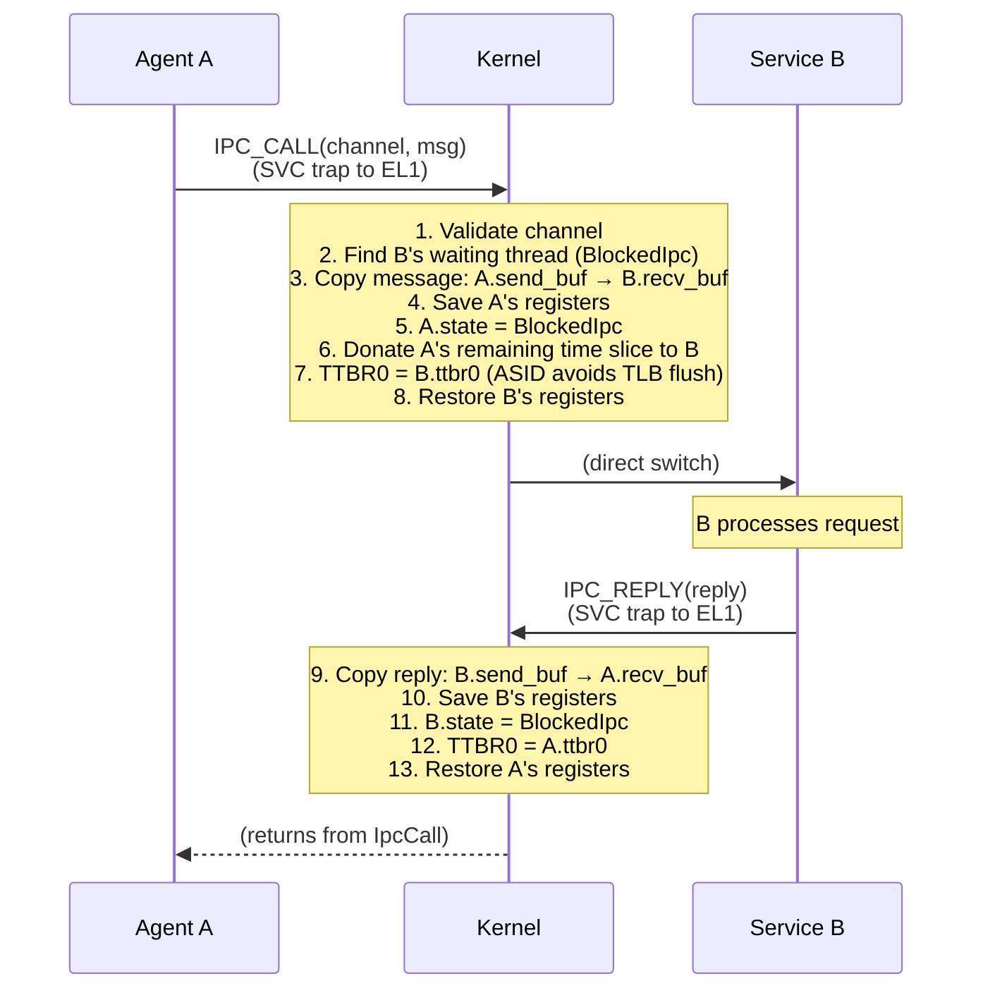
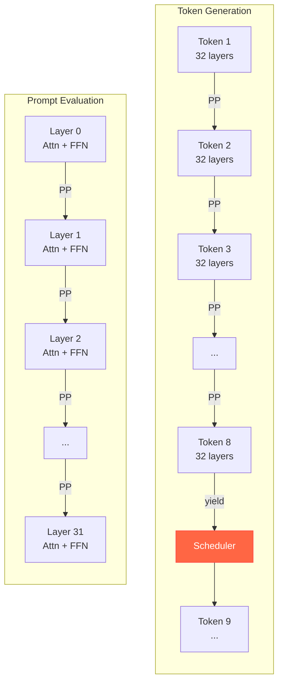
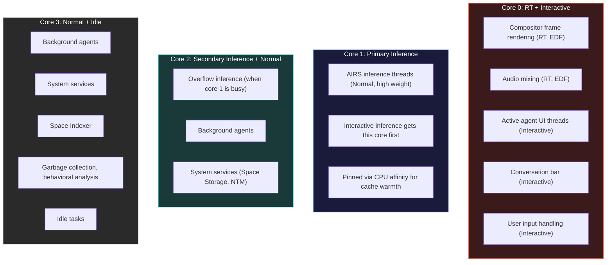
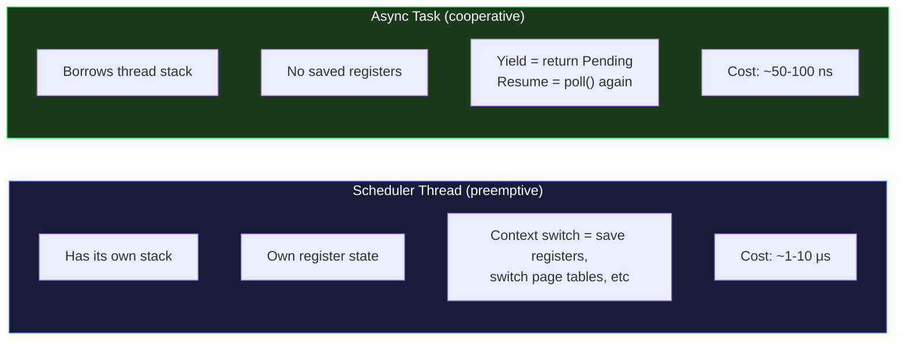

# AIOS Scheduler

## Deep Technical Architecture

**Parent document:** [architecture.md](../project/architecture.md)
**Related:** [ipc.md](./ipc.md) — IPC fast path and direct switch, [compositor.md](../platform/compositor.md) — Compositor frame deadlines, [airs.md](../intelligence/airs.md) — Inference scheduling, [memory.md](./memory.md) — Per-agent memory, [agents.md](../applications/agents.md) — Agent CPU quotas, [deadlock-prevention.md](./deadlock-prevention.md) — Deadlock prevention architecture (lock ordering §3, preemptive kernel §9, priority inheritance §5)

-----

## 1. Overview

The AIOS scheduler decides which thread runs on which CPU at every moment. In a microkernel, every system call is an IPC round-trip to a userspace service, so the scheduler is on the critical path of nearly every operation. A slow scheduler makes a slow OS.

AIOS's scheduler has a harder job than any existing OS scheduler. It must handle five concerns simultaneously:

1. **Traditional process scheduling** — threads from system services, agents, and BSD compatibility processes need CPU time.
2. **Real-time compositor frames** — the compositor must render a frame every 16.6ms (60fps). Miss the deadline and the user sees jank.
3. **AI inference** — LLM token generation is a long-running, compute-heavy workload that can occupy a CPU for seconds. It must not starve interactive work.
4. **Fair-share between agents** — no single agent can monopolize the CPU, even if it tries. Agents have CPU quotas declared in their manifests.
5. **Context-aware priority adjustment** — the Context Engine signals whether the user is working, relaxing, or in focus mode. The scheduler adjusts weights accordingly.

No existing scheduler does all of these well. Linux CFS handles fair-share but has no concept of inference scheduling. RT-Linux handles deadlines but not AI workloads. AIOS needs a scheduler that understands all five workload types and makes the right tradeoffs between them on a 4-core Cortex-A72/A76.

-----

## 2. Design Goals

| Goal | Target | Why |
|---|---|---|
| Context switch latency | < 10 us | Microkernel viability — every IPC is a context switch |
| IPC round-trip | < 5 us | Requires direct switch (no scheduler queue traversal) |
| Compositor frame budget | 16.6ms (60fps) | Dropped frames are visible jank |
| LLM first token latency | < 500ms | User perceives responsiveness |
| Agent spawn time | < 50ms | Tasks feel instant |
| No CPU monopolization | Per-agent quotas | No agent starves the system |
| Context-aware | Weight adjustment | Work context boosts productivity agents |
| Energy-efficient | Minimize wakeups | Battery life on portable hardware |

The scheduler is not optimized for throughput. It is optimized for latency and responsiveness. A user interacting with the conversation bar while the Space Indexer runs inference in the background must never perceive sluggishness. Getting this right on 4 cores with 2-8 GB RAM is the central challenge.

-----

## 3. Architecture

### 3.1 Scheduling Classes

Four scheduling classes, in strict priority order. A runnable thread in a higher class always preempts a running thread in a lower class.

```text
Priority    Class          Algorithm              Use Cases
────────    ─────          ─────────              ─────────
Highest     Real-Time      Earliest Deadline      Compositor frame rendering,
                           First (EDF)            audio mixing, timer callbacks

            Interactive    Priority Round-Robin   Active agent (foreground),
                           with input boost       conversation bar, user input

            Normal         Weighted Fair          Background agents, system
                           Queuing (WFQ)          services, inference threads

Lowest      Idle           Simple FIFO            Indexing, garbage collection,
                                                  behavioral analysis
```

**Real-Time (RT):** Hard deadlines. The compositor must finish its frame within 16.6ms. Audio mixing must finish within its buffer period. RT threads declare their period and worst-case execution time at creation. The scheduler runs them with EDF — the thread whose deadline is nearest runs first. RT threads have no time slice; they run until they complete their work, block, or hit their declared budget.

**Interactive:** Soft deadlines. The foreground agent, conversation bar, and anything the user is directly interacting with. Priority round-robin with a 10ms time slice. When the user presses a key or clicks, the receiving thread gets an immediate priority boost — it moves to the front of the interactive queue for one slice. This makes input feel instantaneous.

**Normal:** No deadlines. Background agents, system services (Space Storage, Network Translation Module), and inference threads. Weighted Fair Queuing ensures proportional CPU sharing. Weights are derived from agent priority, CPU quota, and context multiplier.

**Idle:** Only runs when no other class has runnable threads. Indexing, garbage collection, behavioral analysis baselines. Simple FIFO — threads run in order, preempted immediately when any higher-class thread becomes runnable. Default time slice is 50ms, but preemption is instant.

```rust
/// Scheduling class determines which queue a thread enters
/// and which algorithm governs its execution.
#[derive(Debug, Clone, Copy, PartialEq, Eq, PartialOrd, Ord)]
pub enum SchedulerClass {
    /// Earliest Deadline First. Hard deadlines. Highest priority.
    RealTime = 3,
    /// Priority round-robin with input boost. Soft deadlines.
    Interactive = 2,
    /// Weighted Fair Queuing. Proportional sharing.
    Normal = 1,
    /// Simple FIFO. Runs only when nothing else needs CPU.
    Idle = 0,
}
```

### 3.2 Scheduler Architecture

```mermaid
flowchart TD
    subgraph RQ["Per-CPU Run Queues"]
        subgraph CPU0["CPU 0"]
            RT0["RT Queue (EDF heap)"]
            INT0["Interactive (prio queue)"]
            NRM0["Normal (WFQ tree)"]
            IDL0["Idle (FIFO list)"]
            RT0 --- INT0 --- NRM0 --- IDL0
        end
        subgraph CPU1["CPU 1"]
            RT1["RT Queue (EDF heap)"]
            INT1["Interactive (prio queue)"]
            NRM1["Normal (WFQ tree)"]
            IDL1["Idle (FIFO list)"]
            RT1 --- INT1 --- NRM1 --- IDL1
        end
        subgraph CPU2["CPU 2"]
            RT2["RT Queue"]
            INT2["Interactive"]
            NRM2["Normal"]
            IDL2["Idle"]
            RT2 --- INT2 --- NRM2 --- IDL2
        end
        subgraph CPU3["CPU 3"]
            RT3["RT Queue"]
            INT3["Interactive"]
            NRM3["Normal"]
            IDL3["Idle"]
            RT3 --- INT3 --- NRM3 --- IDL3
        end
    end

    CPU0 --- LB["`Load Balancer
(periodic + push/pull migration)`"]
    CPU1 --- LB
    CPU2 --- LB
    CPU3 --- LB
```



Each CPU has its own set of run queues — one per scheduling class. No global run queue lock. The only cross-CPU coordination is the load balancer, which runs periodically (every 4ms) and on push/pull events (CPU going idle or overloaded).

```rust
/// CPU identifier. Inner value is used as an array index into run_queues.
pub struct CpuId(pub usize);

/// Per-CPU scheduler state. Each CPU owns its run queues.
/// Accessed only by the local CPU except during load balancing
/// (which takes a per-CPU spinlock).
pub struct RunQueue {
    /// Which CPU this run queue belongs to
    cpu_id: CpuId,

    /// Real-time queue: min-heap ordered by absolute deadline
    // Custom kernel BinaryHeap supporting explicit comparator types (not std::collections::BinaryHeap).
    rt_queue: BinaryHeap<SchedEntity, DeadlineOrder>,

    /// Interactive queue: priority queue with round-robin within
    /// same priority level
    interactive_queue: PriorityList<SchedEntity>,

    /// Normal queue: red-black tree ordered by virtual runtime
    /// (weighted fair queuing)
    normal_queue: RbTree<SchedEntity, VruntimeOrder>,

    /// Idle queue: simple linked list, FIFO order
    idle_queue: LinkedList<SchedEntity>,

    /// Currently running thread on this CPU
    current: Option<SchedEntity>,

    /// Number of runnable threads (all classes)
    nr_running: u32,

    /// Per-CPU lock (only held during load balancing)
    lock: SpinLock,

    /// Timestamp of last scheduler tick
    last_tick: Timestamp,

    /// Idle state (for power management)
    idle_state: CpuIdleState,
}

/// CPU idle state: 0=running, 1=WFI, 2=power-gated
type CpuIdleState = u8;

impl RunQueue {
    /// Remove all threads belonging to the given agent from this run queue.
    fn remove_threads_for_agent(&mut self, agent_id: AgentId) { /* ... */ }

    /// Remove threads matching the predicate from this run queue.
    fn remove_threads_matching(&mut self, pred: impl Fn(&SchedEntity) -> bool) { /* ... */ }

    /// Suspend (set state to Suspended) threads matching the predicate.
    fn suspend_threads_matching(&mut self, pred: impl Fn(&SchedEntity) -> bool) { /* ... */ }
}

// Note: AtomicF32 is a kernel-internal wrapper around AtomicU32 using f32::to_bits()/from_bits().
// AtomicCell<T> is a kernel-internal generic atomic wrapper (see kernel/sync/atomic_cell.rs).
/// Top-level scheduler managing all CPUs
pub struct Scheduler {
    /// Per-CPU run queues (indexed by CPU ID)
    run_queues: [RunQueue; MAX_CPUS],

    /// Number of online CPUs
    nr_cpus: u32,

    /// Global scheduler configuration
    config: SchedulerConfig,

    /// RT admission controller
    rt_admission: RtAdmissionController,

    /// Load balancer state
    load_balancer: LoadBalancer,

    /// Context hint from Context Engine (updated via IPC)
    context_hint: AtomicCell<ContextHint>,

    /// Inference weight modifier (set by memory pressure §8.3 and thermal §8.4).
    /// Applied as a multiplier to inference thread weights in calculate_weight().
    /// When multiple subsystems set this, the minimum value wins (most restrictive).
    inference_weight_modifier: AtomicF32,    // default: 1.0

    /// Inference chunk size override (tokens per yield). Set by thermal (§8.4).
    inference_chunk_modifier: AtomicU32,     // default: 8 (normal), reduced under thermal pressure

    /// Whether idle-class threads are enabled (disabled during thermal warm state)
    idle_enabled: AtomicBool,                // default: true

    /// RT WCET scaling factor for thermal throttling (§8.4).
    /// 1.0 at full frequency; increases proportionally when frequency drops.
    rt_wcet_scale: AtomicF32,                // default: 1.0

    /// Per-source weight modifiers for reconciliation (§8.3/§8.4).
    /// Each subsystem writes its own desired modifier independently.
    /// reconcile_inference_weight() takes min(memory, thermal) → inference_weight_modifier.
    memory_pressure_weight: AtomicF32,       // default: 1.0
    thermal_pressure_weight: AtomicF32,      // default: 1.0
}

/// Global scheduler tuning parameters
pub struct SchedulerConfig {
    /// Timer tick frequency (default: 1000 Hz = 1ms tick)
    tick_hz: u32,

    /// Interactive class time slice (default: 10ms)
    interactive_slice: Duration,

    /// Normal class time slice (default: 50ms)
    normal_slice: Duration,

    /// Idle class time slice (default: 50ms)
    idle_slice: Duration,

    /// Load balancer interval (default: 4ms)
    balance_interval: Duration,

    /// RT utilization ceiling (default: 70%)
    rt_utilization_max: f32,

    /// Input boost duration (default: 20ms — two interactive slices)
    input_boost_duration: Duration,

    /// Maximum CPU frequency in MHz (from device tree / firmware).
    /// Used by thermal throttling (§8.4) to compute WCET scaling.
    max_freq_mhz: u32,
}
```

### 3.3 The SchedEntity

Every thread in the system has a `SchedEntity` — the scheduling metadata that the scheduler uses to make decisions. This is the core data structure of the entire scheduler.

```rust
/// The schedulable unit. Every kernel thread and every user thread
/// has exactly one SchedEntity.
pub struct SchedEntity {
    /// Unique thread identifier
    thread_id: ThreadId,

    /// Owning agent (None for kernel threads)
    agent_id: Option<AgentId>,

    /// Scheduling class (RT, Interactive, Normal, Idle)
    class: SchedulerClass,

    /// Priority within class (0 = lowest, 255 = highest)
    priority: u8,

    /// Absolute deadline (for RT and Interactive classes)
    /// RT: hard deadline — must complete by this time
    /// Interactive: soft deadline — used for priority ordering
    deadline: Option<Timestamp>,

    /// CPU quota from agent manifest (for Normal class fair-share)
    cpu_quota: CpuQuota,

    /// CPU time consumed in the current accounting period
    cpu_used: Duration,

    /// Remaining time in current time slice
    time_slice_remaining: Duration,

    /// Virtual runtime (for WFQ in Normal class)
    /// Lower vruntime = less CPU used relative to weight = runs next
    vruntime: u64,

    /// PELT-tracked utilization for this entity (0.0 - 1.0, decayed).
    /// Used by the load balancer for migration decisions instead of
    /// instantaneous runnable state. See §9.1.
    pelt_util: f32,

    /// CPU affinity mask — which CPUs this thread may run on
    affinity: CpuSet,

    /// Last CPU this thread ran on (for cache affinity)
    last_cpu: CpuId,

    /// Core type preference for big.LITTLE (future)
    /// Homogeneous on Pi 4/5; used for scheduling on asymmetric SoCs
    core_preference: CoreType,

    /// Compute device affinity — when set, the compute subsystem
    /// preferentially routes this thread's compute workloads to
    /// the specified accelerator (GPU, NPU, DSP). None means AIRS
    /// chooses the optimal device automatically.
    /// See [compute/registry.md](./compute/registry.md) §6.
    compute_affinity: Option<ComputeDeviceId>,

    /// Priority inheritance state (set during IPC direct switch when a
    /// high-priority thread blocks on a low-priority server — see ipc.md §9.2).
    /// These fields temporarily elevate the receiver's effective priority.
    inherited_priority: Option<u8>,
    inherited_class: Option<SchedulerClass>,
    inherited_deadline: Option<Timestamp>,

    /// Effective scheduling parameters (base values overridden by inheritance).
    /// The scheduler uses effective_* for all decisions. When no inheritance
    /// is active, effective_* equals the base class/priority.
    effective_class: SchedulerClass,
    effective_priority: u8,

    /// Latency-nice: controls scheduling latency independent of weight.
    /// -20 (fast wakeup, latency-sensitive) to +19 (tolerant, throughput)
    /// Default: 0. See §7.2 for details.
    latency_nice: i8,

    /// Preemption flag: set by the timer tick handler when a higher-priority
    /// thread becomes runnable. Inference threads check this at preemption
    /// points (layer/token boundaries) for cooperative preemption (§6.4).
    preemption_flag: AtomicBool,

    /// Thread role hint — set at creation, determines context-aware
    /// weight adjustments (§7.2) and default core affinity (§9.2).
    role: ThreadRole,

    /// For inference threads (role == ThreadRole::Inference): the inference
    /// priority level from the owning InferenceTask. None for non-inference threads.
    /// Used by pause_background_inference() (§8.3) to selectively pause.
    inference_priority: Option<InferencePriority>,

    /// Whether this thread belongs to the foreground agent.
    /// Set by the window manager when agent focus changes.
    /// Used by calculate_weight() for Focus context boost (§7.2).
    is_foreground: bool,

    /// Thread execution state
    state: ThreadState,

    /// Timestamp when this thread last started running
    last_run_start: Timestamp,

    /// Total CPU time consumed (lifetime)
    total_cpu_time: Duration,

    /// Number of voluntary context switches (thread yielded or blocked)
    voluntary_switches: u64,

    /// Number of involuntary context switches (preempted)
    involuntary_switches: u64,
}

/// Thread execution states
#[derive(Debug, Clone, Copy, PartialEq, Eq)]
pub enum ThreadState {
    /// On a run queue, ready to execute
    Runnable,
    /// Currently executing on a CPU
    Running,
    /// Blocked waiting for IPC message
    BlockedIpc { channel: u64 },
    /// Blocked waiting for timer
    BlockedTimer { wake_at: u64 },
    /// Blocked waiting for I/O
    BlockedIo,
    /// Blocked waiting for a notification signal
    BlockedNotification { notification: u32 },
    /// Blocked in IpcSelect (multi-wait on channels + notifications)
    BlockedSelect,
    /// Blocked waiting for a child process to exit
    BlockedProcessWait { child_pid: u32 },
    /// Suspended by the kernel (memory limit, debugging)
    Suspended,
    // --- Target design (not yet implemented) ---
    // BlockedAccelerator { device: AcceleratorId, job: JobId },
    /// Thread has exited
    Dead,
}

type AcceleratorId = u32;
type JobId = u64;

/// CPU affinity: a bitmask of allowed CPUs
#[derive(Debug, Clone, Copy, PartialEq, Eq)]
pub struct CpuSet {
    pub bits: u64, // bits 0..MAX_CPUS
}

impl CpuSet {
    pub const fn all() -> Self { Self { bits: !0 } }
    pub const fn single(cpu: usize) -> Self { Self { bits: 1 << cpu } }
    pub const fn from_mask(mask: u64) -> Self { Self { bits: mask } }
    pub const fn contains(&self, cpu: usize) -> bool { self.bits & (1 << cpu) != 0 }
    pub const fn count(&self) -> u32 { self.bits.count_ones() }
}

/// Context hints from the Context Engine affect scheduling weights
#[derive(Debug, Clone, Copy, PartialEq, Eq)]
pub enum ContextHint {
    /// No hint available (default behavior)
    None,
    /// User is in a work context — productivity agents get priority
    Work,
    /// User is in a leisure context — media/game agents get priority
    Leisure,
    /// User has engaged focus mode — active agent gets larger slices
    Focus,
    /// Device is on battery — reduce aggressiveness, save power
    LowBattery,
}
```

-----

## 4. Context Switch Implementation

The context switch is the most performance-critical code path in the kernel. Every IPC round-trip involves at least one context switch (direct switch) and often two. The target is < 10 us for a full context switch, but the common case (IPC direct switch) should be under 2 us.

### 4.1 What Gets Saved and Restored

An aarch64 context switch saves and restores the following state:

```mermaid
flowchart TD
    subgraph ctx["Thread Hardware Context"]
        subgraph gp["General-purpose registers (~256 bytes)"]
            GP1["x0-x30 (31 registers, 8 bytes each = 248 bytes)"]
            GP2["SP_EL0 (user stack pointer)"]
            GP3["PC (saved in ELR_EL1 on trap)"]
            GP4["PSTATE (saved in SPSR_EL1 on trap)"]
        end
        subgraph fp["Floating-point / NEON registers — LAZY SAVE (~520 bytes)"]
            FP1["v0-v31 (32 registers, 16 bytes each = 512 bytes)"]
            FP2["FPCR (floating-point control register)"]
            FP3["FPSR (floating-point status register)"]
        end
        subgraph as["Address space state (16 bytes)"]
            AS1["TTBR0_EL1 (user page table base)"]
            AS2["ASID (encoded in TTBR0 upper bits)"]
        end
        subgraph tmr["Per-thread timer (16 bytes)"]
            TM1["CNTP_CVAL_EL0 (physical timer compare value)"]
            TM2["CNTP_CTL_EL0 (physical timer control)"]
        end
        totals["Total without FP: ~296 bytes | Total with FP: ~808 bytes"]
        gp --- fp --- as --- tmr --- totals
    end
```



**Lazy FP save:** Floating-point and NEON registers are not saved on every context switch. Instead, the kernel sets the CPACR_EL1 trap bit when switching away from a thread that used FP. If the next thread touches an FP register, the trap fires, the kernel saves the old FP state and restores the new, and clears the trap bit. Most IPC handler threads never touch FP registers, so this optimization avoids 520 bytes of save/restore on the common path.

```rust
/// Saved hardware context for a thread
#[repr(C)]
pub struct ThreadContext {
    /// General-purpose registers x0-x30
    gp_regs: [u64; 31],
    /// User stack pointer (SP_EL0)
    sp: u64,
    /// Saved program counter (ELR_EL1)
    pc: u64,
    /// Saved processor state (SPSR_EL1)
    pstate: u64,
    /// User page table base register
    ttbr0: u64,
    /// Physical timer compare value (CNTP_CVAL_EL0)
    timer_cval: u64,
    /// Physical timer control (CNTP_CTL_EL0)
    timer_ctl: u64,
}

/// FP/NEON state, saved lazily
#[repr(C, align(16))]
pub struct FpContext {
    /// NEON registers v0-v31 (128-bit each)
    vregs: [u128; 32],
    /// Floating-point control register
    fpcr: u32,
    /// Floating-point status register
    fpsr: u32,
}

/// Full thread state managed by the scheduler
pub struct Thread {
    /// Scheduling metadata (includes thread_id)
    pub sched: SchedEntity,
    /// Saved hardware context (on kernel stack when not running)
    pub context: ThreadContext,
    /// FP/NEON context (lazily allocated and saved)
    pub fp_context: Option<FpContext>,
    /// Priority inheritance depth counter (bounded by MAX_INHERITANCE_DEPTH=8)
    pub inheritance_depth: u8,
    /// Owning process (None for kernel threads)
    pub owner_pid: Option<ProcessId>,
    /// Physical address of kernel stack allocation
    pub stack_phys: usize,
    /// Thread name (null-padded, 16 bytes)
    pub name: [u8; 16],
}
```

### 4.2 Fast Path: IPC Direct Switch

The critical optimization for microkernel performance. When agent A makes a synchronous IPC call to service B, the kernel can switch directly from A to B without touching the scheduler queues:



**Key properties of the direct switch:**

- **No scheduler decision.** The kernel does not consult run queues. It knows exactly where to go: A called B, B was waiting, switch to B. When B replies, switch back to A. Two context switches, zero queue operations.
- **Time slice donation.** A donates its remaining time slice to B. B runs with A's budget. This prevents the scheduler tick from preempting B in the middle of handling A's request, which would add latency.
- **ASID avoids TLB flush.** Each process has a unique Address Space Identifier. When the kernel writes B's TTBR0 (with B's ASID), TLB entries from A's ASID remain valid. No TLB invalidation needed. If A runs again on the same CPU soon, its TLB entries may still be warm.
- **Small message in registers.** Messages up to 64 bytes are passed in registers (x0-x7). No memory copy needed for small IPC.

This is how AIOS achieves < 5 us IPC round-trip. The entire path — trap, validate, copy, switch, process, reply, switch back — executes in roughly 420 kernel cycles at 2 GHz, plus whatever time B spends processing the request.

```rust
/// IPC direct switch: called when the kernel determines that
/// the destination thread is waiting for a message on this channel.
/// This bypasses the scheduler entirely.
unsafe fn ipc_direct_switch(
    sender: &mut Thread,
    receiver: &mut Thread,
    message: &RawMessage,
) {
    // Copy message from sender's buffer to receiver's buffer
    copy_ipc_message(sender, receiver, message);

    // Sender blocks, donates time slice
    sender.sched.state = ThreadState::BlockedIpc {
        channel: message.channel,
    };
    let donated_slice = sender.sched.time_slice_remaining;
    receiver.sched.time_slice_remaining = donated_slice;

    // Save sender's GP registers (already on kernel stack from SVC trap)
    save_context(&mut sender.context);

    // Switch address space (TTBR0 + ASID)
    if sender.context.ttbr0 != receiver.context.ttbr0 {
        write_ttbr0(receiver.context.ttbr0);
        // ASID change — no TLB flush needed
    }

    // Lazy FP: trap FP access for receiver if sender used FP
    if sender.fp_dirty {
        disable_fp_access(); // set CPACR_EL1 trap bit
    }

    // Restore receiver's GP registers and return to userspace
    restore_context(&receiver.context);
    // (execution continues in receiver's userspace)
}
```

### 4.3 Context Switch Latency Budget

Breaking down the < 10 us target for a full context switch (the scheduler-mediated path, not the IPC direct switch):

```text
Operation                              Cycles (est.)    Time @ 2 GHz
──────────────────────────────────     ─────────────    ────────────
Save GP registers (x0-x30, SP, PC)         80            40 ns
Save per-thread timer registers            10             5 ns
Scheduler decision (pick next thread)    ~500           250 ns
  - Check RT queue (heap peek)              20
  - Check Interactive queue (head)          10
  - Check Normal queue (RB-tree min)        30
  - Load balancing check (periodic)        ~200
  - Update vruntime / accounting           ~240
TTBR0 write + ASID update                  40            20 ns
Pipeline flush (branch predictor,         ~600           300 ns
  prefetch, speculative state)
Restore GP registers                       80            40 ns
Restore per-thread timer                   10             5 ns
──────────────────────────────────     ─────────────    ────────────
Total (without FP, no cache miss):       ~1320           660 ns
Total (with FP save/restore):            ~2500          1250 ns
Total (worst case, cache pressure):      ~8000          4000 ns
```

The typical case (IPC between agents with warm caches) is under 1 us. The worst case (cold caches, FP state, load balancing on the same tick) is under 5 us. The 10 us budget gives margin for unexpected cache misses and memory latency on the Pi 4's Cortex-A72.

-----

## 5. Real-Time Scheduling

### 5.1 Compositor Deadline

The compositor is the primary RT consumer. It must produce a frame every 16.6ms for 60fps output:

```mermaid
gantt
    title Compositor Frame Timeline (16.6ms period)
    dateFormat X
    axisFormat %s ms

    section Compositor (budget: 4ms)
    Collect damage       :a1, 0, 1
    Occlusion cull       :a2, after a1, 1
    Composite surfaces   :a3, after a2, 1
    Present (VSync)      :a4, after a3, 1

    section Available
    Other work (interactive, normal, idle ~12.6ms) :b1, after a4, 12
```



The compositor declares itself as an RT task with:

- **Period:** 16.6ms (60 Hz)
- **Worst-case execution time (WCET):** 4ms
- **Deadline:** 16.6ms from start of each period

If the compositor finishes in 2ms (common — most frames have minimal damage), the remaining 14.6ms is available for other threads. The scheduler does not reserve the compositor's full budget; it runs EDF and the compositor naturally gets priority because its deadline is nearest.

### 5.2 Audio Deadline

Audio mixing has tighter timing requirements than the compositor. An audio glitch (buffer underrun) is more noticeable than a single dropped frame:

```mermaid
gantt
    title Audio Mixing Timeline (5ms buffer, 200 Hz callback)
    dateFormat X
    axisFormat %s ms

    section Period 1
    Mix buffer (0.5ms budget) :a1, 0, 1
    Idle                      :a2, after a1, 9

    section Period 2
    Mix buffer (0.5ms budget) :b1, 10, 1
    Idle                      :b2, after b1, 9

    section Period 3
    Mix buffer (0.5ms budget) :c1, 20, 1
    Idle                      :c2, after c1, 9
```



The audio service declares:

- **Period:** 5ms (200 Hz)
- **WCET:** 0.5ms
- **Deadline:** 5ms from start of each period

Audio runs at higher EDF priority than the compositor when their deadlines are close, because its period is shorter. In practice, audio's 0.5ms budget is so small that it almost never conflicts with anything.

### 5.3 RT Admission Control

The scheduler does not blindly accept RT tasks. Before admitting a new RT task, it verifies that total RT utilization stays below the ceiling (default: 70%). This guarantees that interactive and normal threads always get at least 30% of CPU time.

```rust
/// Real-time task descriptor, provided when creating an RT thread
pub struct RtTask {
    /// How often this task must run (e.g., 16.6ms for 60fps)
    period: Duration,
    /// Maximum CPU time per period (e.g., 4ms for compositor)
    wcet: Duration,
    /// Deadline relative to period start (usually == period)
    relative_deadline: Duration,
    /// CPU affinity — must be core 0 only (admission test is single-core)
    affinity: CpuSet,
    /// Overrun tracking for this RT task (budget enforcement)
    overrun: RtOverrunState,
    /// Set to true by reevaluate_with_scale() when thermal throttling
    /// causes scaled utilization to exceed the ceiling. The scheduler
    /// skips deferred tasks until frequency recovers.
    deferred: bool,
}

/// Admission controller for RT tasks
pub struct RtAdmissionController {
    /// Currently admitted RT tasks
    // Backed by kernel heap (available after Phase 1 boot). Max capacity bounded by admission control.
    tasks: Vec<RtTask>,
    /// Maximum total utilization (default: 0.70)
    utilization_ceiling: f32,
}

pub enum SchedError {
    RtMustPinToCore0,
    RtUtilizationExceeded { current: f32, requested: f32, ceiling: f32 },
}

impl RtAdmissionController {
    /// Test whether a new RT task can be admitted without
    /// exceeding the utilization ceiling.
    ///
    /// Uses the utilization bound test:
    ///   sum(wcet_i / period_i) <= ceiling
    ///
    /// This is a sufficient (not necessary) condition for
    /// EDF schedulability. If the test passes, all RT deadlines
    /// are guaranteed to be met.
    pub fn can_admit(&self, new_task: &RtTask) -> bool {
        let current_util: f32 = self.tasks.iter()
            .map(|t| t.wcet.as_secs_f32() / t.period.as_secs_f32())
            .sum();

        let new_util = new_task.wcet.as_secs_f32()
            / new_task.period.as_secs_f32();

        (current_util + new_util) <= self.utilization_ceiling
    }

    /// Admit a new RT task. Returns error if affinity is not core 0
    /// or if utilization would exceed ceiling.
    pub fn admit(&mut self, task: RtTask) -> Result<(), SchedError> {
        // Enforce single-core RT constraint — admission test is single-processor
        if task.affinity != CpuSet::single(CpuId(0)) {
            return Err(SchedError::RtMustPinToCore0);
        }
        if !self.can_admit(&task) {
            return Err(SchedError::RtUtilizationExceeded {
                current: self.current_utilization(),
                requested: task.wcet.as_secs_f32() / task.period.as_secs_f32(),
                ceiling: self.utilization_ceiling,
            });
        }
        self.tasks.push(task);
        Ok(())
    }

    /// Current total RT utilization (0.0 to 1.0)
    pub fn current_utilization(&self) -> f32 {
        self.tasks.iter()
            .map(|t| t.wcet.as_secs_f32() / t.period.as_secs_f32())
            .sum()
    }

    /// Re-evaluate RT admission with scaled WCETs (thermal throttling §8.4).
    /// When CPU frequency drops, effective WCET increases proportionally.
    /// If scaled utilization exceeds ceiling, the lowest-priority RT task
    /// (typically timer service) is deferred until frequency recovers.
    pub fn reevaluate_with_scale(&mut self, scale: f32) {
        let scaled_util: f32 = self.tasks.iter()
            .map(|t| (t.wcet.as_secs_f32() * scale) / t.period.as_secs_f32())
            .sum();
        if scaled_util > self.utilization_ceiling {
            // Defer lowest-priority RT task to reduce load
            if let Some(idx) = self.lowest_priority_task_index() {
                self.tasks[idx].deferred = true;
            }
        }
    }

    /// Find the RT task with the longest period (least time-critical).
    /// This is the best candidate for deferral under thermal throttling.
    fn lowest_priority_task_index(&self) -> Option<usize> {
        self.tasks.iter()
            .enumerate()
            .max_by_key(|(_, t)| t.period)
            .map(|(i, _)| i)
    }
}
```

**Example admission calculation on a single core:**

```text
Compositor:  WCET = 4ms,   Period = 16.6ms  → U = 0.241
Audio:       WCET = 0.5ms, Period = 5ms     → U = 0.100
Timer svc:   WCET = 0.1ms, Period = 1ms     → U = 0.100
                                         ─────────────
Total RT utilization:                        U = 0.441

Ceiling: 0.70. Remaining headroom: 0.259 (25.9%)
```

This leaves 55.9% of CPU time for interactive, normal, and idle threads on the core that runs RT tasks. In the multi-core assignment (section 9.2), RT tasks are concentrated on core 0, leaving cores 1-3 fully available for inference and agents.

**RT admission enforcement:** All RT tasks are pinned to core 0 via their CPU affinity mask (`CpuSet::single(CpuId(0))`). The admission controller's utilization bound test is a single-processor test — it is only valid when all RT tasks share one core. The `admit()` method above enforces this by rejecting any RT task with a non-core-0 affinity.

### 5.4 RT Deadline Miss Handling

Admission control guarantees schedulability under declared WCETs, but runtime conditions (cache storms, memory contention, unexpectedly complex compositor scenes) can cause an RT task to overrun its budget. The scheduler must handle this gracefully:

```rust
/// RT overrun policy: what happens when an RT task exceeds its declared WCET
pub enum RtOverrunPolicy {
    /// Allow the task to finish, but log the overrun and charge it against
    /// the next period's budget. If overruns are sustained (3+ consecutive),
    /// reduce the task's priority within RT or escalate to the attention manager.
    AllowWithPenalty,
    /// Force-preempt the task at WCET + grace margin (default: 1ms).
    /// The task receives a signal indicating it was preempted for overrun.
    /// Used when other RT tasks' deadlines are at risk.
    ForcePreempt { grace: Duration },
}

/// Stored per-RT-task inside the RT admission controller (`RtAdmissionController`).
pub struct RtOverrunState {
    /// Number of consecutive overruns for this task
    consecutive_overruns: u32,
    /// Total overrun time in the last accounting window
    total_overrun: Duration,
    /// Overrun policy (default: AllowWithPenalty for compositor,
    /// ForcePreempt for less critical RT tasks)
    policy: RtOverrunPolicy,
}
```

**Overrun handling sequence:**

```text
1. RT task's WCET budget expires (timer interrupt fires)
2. Scheduler checks: has the task completed its work?
   YES → normal completion, no action
   NO  → overrun detected

3. Apply overrun policy:
   AllowWithPenalty:
     a. Log overrun to diagnostics (§12)
     b. Allow task to continue for up to 2x WCET
     c. Deduct overrun from next period's budget
     d. If 3+ consecutive overruns: alert Attention Manager
        ("Compositor consistently exceeding frame budget —
         reduce scene complexity or increase WCET")

   ForcePreempt { grace }:
     a. Start grace timer (default: 1ms)
     b. Set preemption flag on the task
     c. If task completes within grace: log warning, continue
     d. If grace expires: force context switch, signal the task
     e. Task is re-queued for its next period

4. If total RT utilization including overruns exceeds 90% for > 1 second:
   → Temporarily reduce RT utilization ceiling to 60%
   → Defer lowest-priority RT task to next period
   → Ensure interactive threads are not starved
```

**Compositor-specific:** The compositor uses `AllowWithPenalty` because a partially-rendered frame is worse than a late frame. If the compositor consistently overruns (complex scene, many surfaces), the Attention Manager notifies the user and suggests closing windows or reducing visual effects. The compositor is never force-preempted — it always completes its frame.

-----

## 6. Inference Scheduling

### 6.1 The Problem

LLM inference is unlike any traditional OS workload:

```text
Traditional workload       LLM inference
────────────────────       ──────────────
Short CPU bursts           Long CPU bursts (100ms+ per prompt eval)
Blocks on I/O frequently   Rarely blocks — compute-bound
Runs for milliseconds      Runs for seconds to minutes
Memory footprint: KB-MB    Memory footprint: GB (model weights)
Easy to preempt            Expensive to preempt (cache warming)
```

A naive approach — running inference as a normal thread — causes two problems:

1. **Starvation.** During prompt evaluation (the first phase of inference, where the model processes the full prompt), the inference thread can consume 200-500ms of continuous CPU time. If this runs on the same core as the conversation bar, the UI freezes.

2. **Thrashing.** If the scheduler constantly preempts inference to run other threads, the inference thread loses its CPU cache state. On a Cortex-A72 with 1 MB L2, the model's hot working set is much larger than the cache. Every preemption forces hundreds of microseconds of cache warming before inference can make progress.

The scheduler must balance these tensions: inference needs long uninterrupted runs for throughput, but everything else needs responsive CPU access.

### 6.2 Inference Scheduling Strategy

Inference threads run in the Normal class, not RT. Inference is important but not deadline-critical — the user can tolerate 500ms to first token, but cannot tolerate a dropped compositor frame.

The strategy is chunked execution with core pinning:

```mermaid
gantt
    title Inference Thread Execution Pattern — Core 1 (pinned)
    dateFormat X
    axisFormat %s ms

    section Inference
    Generate 8 tokens (~40ms) :a1, 0, 40
    Generate 8 tokens (~40ms) :a2, 42, 40
    Generate 8 tokens (~40ms) :a3, 84, 40

    section Yield
    Other work (~2ms) :crit, y1, 40, 2
    Other work (~2ms) :crit, y2, 82, 2
```



**Chunked token generation.** The inference engine generates tokens in chunks of N (default: 8). After each chunk, the inference thread yields to the scheduler. This creates natural preemption points without the overhead of involuntary preemption. The chunk size is tunable — larger chunks increase throughput but reduce responsiveness.

**Core pinning.** Inference threads are pinned to specific CPUs (cores 1-2 on a 4-core system). This avoids cache thrashing — the inference thread's working set stays warm in that core's L1/L2 cache. Other threads avoid these cores unless all other cores are busy.

**Weight differentiation.** Interactive inference (conversation bar) gets higher WFQ weight than background inference (space indexing). When both compete for the inference cores, the interactive session gets proportionally more CPU time.

```rust
/// Inference task descriptor, created by AIRS when starting
/// an inference session.
pub struct InferenceTask<'a> {
    /// Session identifier (from AIRS)
    session_id: SessionId,

    /// Priority level for this inference
    priority: InferencePriority,

    /// Tokens to generate per chunk before yielding
    chunk_size: u32,

    /// Preferred CPU cores (for cache affinity)
    preferred_cpus: CpuSet,

    /// Current state of inference
    state: InferenceState,

    /// Tokens generated in the current chunk (reset on yield)
    tokens_in_chunk: u32,

    /// Back-reference to this thread's SchedEntity for preemption checks
    sched: &'a SchedEntity, // borrows from Thread.sched, NOT a copy

    /// Tokens generated so far (total across all chunks)
    tokens_generated: u32,

    /// Maximum tokens to generate
    max_tokens: u32,

    /// Time spent in prompt evaluation
    prompt_eval_time: Duration,

    /// Time spent in token generation
    token_gen_time: Duration,
}

/// Inference priority determines WFQ weight and preemption behavior
#[derive(Debug, Clone, Copy, PartialEq, Eq, PartialOrd, Ord)]
pub enum InferencePriority {
    /// User is watching the output stream (conversation bar)
    /// Weight multiplier: 4x
    Interactive = 3,

    /// System service needs a result (intent verifier, context engine)
    /// Weight multiplier: 2x
    System = 2,

    /// Background work (space indexing, metadata generation)
    /// Weight multiplier: 1x
    Background = 1,

    /// Batch processing (re-indexing, bulk summarization)
    /// Weight multiplier: 0.5x, only runs when nothing else needs compute
    Batch = 0,
}

/// Inference execution state
#[derive(Debug, Clone, Copy, PartialEq, Eq)]
pub enum InferenceState {
    /// Processing the input prompt (long CPU burst)
    PromptEval,
    /// Generating output tokens (repeated short bursts)
    TokenGeneration { tokens_so_far: u32 },
    /// Yielded between chunks (waiting for next scheduling)
    Yielded,
    /// Paused by scheduler (higher priority work needed).
    /// NOTE: This is the inference task's internal state, distinct from
    /// ThreadState::Suspended (§3.3) which halts the entire thread.
    /// A Paused inference task's thread may still be Runnable — it just
    /// won't resume inference until the scheduler allows it.
    Paused,
    /// Completed
    Done,
}
```

### 6.3 Inference Preemption

Inference can be preempted, but only at well-defined preemption points to avoid expensive state reconstruction:



> **PP** = Preemption Point. In prompt evaluation, PP occurs between transformer layers. In token generation, PP occurs after each token, with a yield to the scheduler after each chunk (default: 8 tokens).

**Preemption point locations:**

1. **Between transformer layers** during prompt evaluation. After each layer completes, the inference thread checks a preemption flag. If set, it saves the layer index and KV cache position, then yields.
2. **After each token** during generation. The natural chunk boundary. After generating a token, the thread checks whether to yield (chunk complete) or continue.

**What gets saved on preemption:**

- KV cache is already in memory (managed by AIRS, not affected by preemption)
- Current layer index (for resumption during prompt eval)
- Token buffer position
- Generation configuration (temperature, top-p, etc.)
- RNG state (for reproducible generation)

Resumption is cheap — no recomputation needed. The inference thread picks up exactly where it left off.

### 6.4 Inference and CPU Quota Interaction

Inference threads are subject to their agent's CPU quota (§7.1), but quota exhaustion during inference requires special handling. A generic timer-tick preemption in the middle of a matrix multiply wastes the partial computation and forces expensive cache re-warming.

**Inference quota is checked at preemption points, not at arbitrary timer ticks:**

```rust
/// Preemption action returned by check_preemption_point()
#[derive(Debug, PartialEq)]
pub enum PreemptAction {
    Continue,
    YieldForQuota,
    YieldChunkComplete,
    YieldPreempted,
}

impl InferenceTask {
    /// Called at each preemption point (between layers, between tokens).
    /// This is where quota is checked — NOT at the generic timer interrupt.
    fn check_preemption_point(&self) -> PreemptAction {
        // 1. Check quota first
        if self.sched.cpu_quota.is_exhausted() {
            return PreemptAction::YieldForQuota;
        }
        // 2. Check chunk boundary (voluntary yield for fairness)
        if self.tokens_in_chunk >= self.chunk_size {
            return PreemptAction::YieldChunkComplete;
        }
        // 3. Check preemption flag (higher-priority thread became runnable)
        if self.sched.preemption_flag.load(Ordering::Relaxed) {
            return PreemptAction::YieldPreempted;
        }
        PreemptAction::Continue
    }
}
```

**Why this matters:** The inference thread sets `CPACR_EL1` to disable preemption during inter-layer computation? No — it runs as a Normal-class thread and can be preempted involuntarily. But the scheduler's timer tick handler treats inference threads specially: instead of immediately preempting, it sets the `preemption_flag` and lets the inference thread reach its next preemption point (which it checks every ~5ms during prompt eval, or every ~5ms per token during generation). This cooperative approach limits preemption delay to at most one transformer layer (~5ms), which is acceptable for the Normal class.

**Quota exhaustion during prompt evaluation:** If the agent's quota runs out during the long prompt evaluation phase (100-500ms), the inference thread yields at the next layer boundary. It resumes in the next quota period (100ms later) from exactly where it left off — no recomputation needed. The user sees slightly slower first-token latency, but no wasted work.

### 6.5 Accelerator-Aware Scheduling (Future)

On future hardware with GPU or NPU accelerators, inference may be partially or fully offloaded. The CPU scheduler must understand accelerator-bound thread states to avoid wasting CPU time on threads that are waiting for accelerator completion.

The `ThreadState::BlockedAccelerator` variant (defined in §3.3) handles this. Without accelerator awareness, a CPU thread that dispatches work to an NPU and then polls for completion wastes an entire CPU core spinning. With `BlockedAccelerator`, the thread is removed from the run queue (like `BlockedIpc`), freeing the core for other work. The NPU completion interrupt wakes the thread, which re-enters the run queue with its inference state intact.

**Cooperative CPU/accelerator scheduling:** When both CPU and NPU are available, AIRS decides which device runs each inference layer based on the current load. The scheduler exposes CPU utilization (via PELT) to AIRS, enabling the decision: "CPU cores 1-2 are 90% utilized by interactive inference — offload background inference to NPU." This creates a closed-loop: scheduler reports load → AIRS decides placement → accelerator runs work → interrupt wakes thread → scheduler re-queues.

-----

## 7. Fair-Share and CPU Quotas

### 7.1 Per-Agent CPU Quotas

Every agent has a CPU quota declared in its manifest (or assigned by the system default). The quota limits how much CPU time an agent can consume, preventing any single agent from starving the system.

```rust
/// CPU quota for an agent. Expressed as a fraction of one core's
/// capacity over a fixed accounting period.
pub struct CpuQuota {
    /// Maximum CPU time per period on a single core.
    /// Example: 50ms means the agent can use up to 50% of one core.
    max_per_period: Duration,

    /// Accounting period length (default: 100ms).
    period: Duration,

    /// CPU time consumed in the current period.
    used_this_period: Duration,

    /// Timestamp when the current period started.
    period_start: Timestamp,
}

impl CpuQuota {
    /// Default quota for third-party agents: 50% of one core
    pub fn default_agent() -> Self {
        Self {
            max_per_period: Duration::from_millis(50),
            period: Duration::from_millis(100),
            used_this_period: Duration::ZERO,
            period_start: Timestamp::ZERO,
        }
    }

    /// System agents: no effective limit (200% = 2 full cores)
    pub fn system_agent() -> Self {
        Self {
            max_per_period: Duration::from_millis(200),
            period: Duration::from_millis(100),
            used_this_period: Duration::ZERO,
            period_start: Timestamp::ZERO,
        }
    }

    /// Check whether this agent has exhausted its quota
    pub fn is_exhausted(&self) -> bool {
        self.used_this_period >= self.max_per_period
    }

    /// Remaining budget in the current period
    pub fn remaining(&self) -> Duration {
        self.max_per_period.saturating_sub(self.used_this_period)
    }

    /// Reset at the start of a new period
    pub fn reset_period(&mut self, now: Timestamp) {
        self.used_this_period = Duration::ZERO;
        self.period_start = now;
    }

    /// Charge CPU time to this quota
    pub fn charge(&mut self, time: Duration) {
        self.used_this_period += time;
    }
}
```

**Quota enforcement:** When an agent's threads collectively exhaust their CPU quota for the current period, those threads are not killed. They are deprioritized — moved to the bottom of their scheduling class's queue. They will run again when the period resets (every 100ms) or when no other runnable threads exist at their priority level.

**Quota examples:**

```text
Agent Category          Default Quota    Meaning
──────────────          ─────────────    ───────
System agent            200ms / 100ms    Can use up to 2 full cores
Foreground agent        80ms / 100ms     Can use up to 80% of one core
Background agent        30ms / 100ms     Can use up to 30% of one core
Tab agent (browser)     50ms / 100ms     Can use up to 50% of one core
Task agent (ephemeral)  50ms / 100ms     Can use up to 50% of one core
```

### 7.2 Weighted Fair Queuing

The Normal scheduling class uses WFQ to distribute CPU time proportionally. Each thread has a weight, and the scheduler ensures that threads receive CPU time in proportion to their weights.

The implementation uses a virtual runtime (vruntime) approach, similar to Linux CFS but with context-aware weight calculation:

```rust
/// Calculate the scheduling weight for a Normal-class thread.
/// Higher weight = more CPU time = lower vruntime growth rate.
/// `global_hint`: context from Context Engine (set via IPC, applies system-wide).
/// `inference_modifier`: weight scaling for inference threads, supplied by the
/// Scheduler from its `inference_weight_modifier` field (min of memory/thermal).
/// Non-inference callers pass 1.0.
fn calculate_weight(
    entity: &SchedEntity,
    global_hint: ContextHint,
    inference_modifier: f32,
) -> u32 {
    // Base weight from priority (1-255 mapped to weight table)
    let base_weight = WEIGHT_TABLE[entity.priority as usize];

    // Context multiplier from Context Engine (global, not per-thread).
    // ThreadRole (§9.2) determines which context boosts apply.
    let context_multiplier = match global_hint {
        ContextHint::None       => 1.0,
        ContextHint::Work       => {
            match entity.role {
                ThreadRole::Productivity => 2.0,
                _ => 0.5,
            }
        }
        ContextHint::Leisure    => {
            match entity.role {
                ThreadRole::Media => 2.0,
                _ => 0.5,
            }
        }
        ContextHint::Focus      => {
            if entity.is_foreground { 3.0 } else { 0.5 }
        }
        ContextHint::LowBattery => 0.75, // slight reduction for all
    };

    // Quota factor: threads with more quota remaining get slight boost
    let quota_factor = if entity.cpu_quota.is_exhausted() {
        0.1 // severely deprioritized, but not starved
    } else {
        1.0
    };

    // Inference weight modifier: applied by memory pressure (§8.3) and
    // thermal throttling (§8.4) to reduce inference scheduling weight.
    // Non-inference threads always receive 1.0 from the caller.
    let effective_inference_mod = if entity.role == ThreadRole::Inference {
        inference_modifier
    } else {
        1.0
    };

    let w = (base_weight as f32 * context_multiplier * quota_factor * effective_inference_mod) as u32;
    w.max(1) // minimum weight of 1 — no thread gets zero CPU time
}

/// Update virtual runtime after a thread runs for `delta` time.
/// Threads with higher weight accumulate vruntime more slowly,
/// so they get more real CPU time before being preempted.
fn update_vruntime(
    entity: &mut SchedEntity,
    delta: Duration,
    hint: ContextHint,
    inference_modifier: f32,
) {
    let weight = calculate_weight(entity, hint, inference_modifier);
    // vruntime increases inversely proportional to weight
    // Reference weight is WEIGHT_TABLE[120] (normal priority)
    let reference_weight = WEIGHT_TABLE[120] as u64;
    let vruntime_delta = (delta.as_nanos() as u64 * reference_weight)
        / weight as u64;
    entity.vruntime += vruntime_delta;

    // Update per-entity PELT utilization (exponential decay, 32ms time constant (~22ms half-life)).
    // Tracks the fraction of time this entity has been running recently.
    let decay = (-delta.as_secs_f32() / 0.032_f32).exp(); // e^(-dt/tau), tau=32ms
    entity.pelt_util = entity.pelt_util * decay
        + (1.0 - decay) * 1.0; // 1.0 because the entity was running
}

/// Compute the virtual deadline for a waking thread.
/// latency_nice controls how soon the thread is eligible to run
/// after wakeup, independent of its weight (which controls total CPU share).
fn compute_wakeup_vdeadline(entity: &SchedEntity, min_vruntime: u64) -> u64 {
    // Clamp to valid range (field is i8 but only -20..+19 is meaningful)
    let latency_nice = entity.latency_nice.clamp(-20, 19);
    // Base slice in vruntime units
    let base_slice_ns = 50_000_000u64; // 50ms default slice
    // Latency factor: latency_nice maps to a multiplier on virtual deadline.
    // -20 → 0.1x (very short deadline, scheduled almost immediately)
    //   0 → 1.0x (default)
    // +19 → ~4.0x (long deadline, tolerates waiting)
    let latency_factor = match latency_nice {
        n if n < 0  => 0.1 + (n + 20) as f32 * 0.045,    // -20..=-1 → 0.1..~1.0
        0           => 1.0,                                 // 0        → 1.0
        n           => 1.0 + n as f32 * 0.16,              // 1..=19   → 1.16..4.0
    };
    let vdeadline = (base_slice_ns as f32 * latency_factor) as u64;
    min_vruntime + vdeadline
}

/// Weight table: maps priority (0-255) to a scheduling weight.
/// Higher index = higher priority = higher weight.
/// Based on a geometric progression (each step ~1.25x).
static WEIGHT_TABLE: [u32; 256] = {
    let mut table = [0u32; 256];
    // Geometric progression: weight(i) = 2^(10 + (i-120)/12.8)
    // Priority 0   = weight 1     (minimum)
    // Priority 120 = weight 1024  (reference / "nice 0")
    // Priority 255 = weight 65536 (maximum)
    let mut i = 0usize;
    while i < 256 {
        // Geometric progression: weight = 1024 * 2^((i-120)/12.8)
        // ratio ≈ 1.0557 per step (2^(1/12.8))
        // Note: this table is pre-computed at build time by a build script;
        // the const-eval form shown here is illustrative.
        let shift = (i as i32 - 120) as f64 / 12.8;
        let w = (1024.0 * libm::exp2(shift)) as u32;
        table[i] = if w < 1 { 1 } else { w };
        i += 1;
    }
    table
};
```

**How WFQ works in practice:**

```text
Three threads competing on one core, all Normal class:

Thread A: weight 2048 (foreground agent, work context boost)
Thread B: weight 1024 (background agent, normal)
Thread C: weight 512  (idle indexer, low priority)

Total weight: 3584

Expected CPU share:
  A: 2048 / 3584 = 57.1%
  B: 1024 / 3584 = 28.6%
  C:  512 / 3584 = 14.3%

Over 100ms:
  A runs for ~57ms
  B runs for ~29ms
  C runs for ~14ms
```

The scheduler picks the thread with the lowest vruntime from the Normal queue's red-black tree. After running for a time slice (50ms default), the thread's vruntime is updated and it is reinserted into the tree. Because thread A's weight is higher, its vruntime grows slower, so it stays at the front of the tree more often.

**Latency-nice:** Weight controls how much CPU a thread gets, but not how quickly it gets it. Two threads with the same weight get equal CPU share, but one might need fast wake-up response (a system service handling IPC) while the other tolerates jitter (batch inference). The `latency_nice` field provides this orthogonal control — inspired by Linux 6.x's EEVDF (Earliest Eligible Virtual Deadline First):

The `latency_nice` field lives directly on `SchedEntity` (§3.3). When a thread wakes up, `compute_wakeup_vdeadline()` (§7.2) computes its virtual deadline as `min_vruntime + (base_slice * latency_factor)`. A thread with `latency_nice = -20` gets a tiny virtual deadline (scheduled almost immediately), while `latency_nice = +19` gets a large one (waits for current threads to finish their slices). The CPU share over time is unchanged — only the scheduling latency differs.

```text
Latency-nice assignments:
  System services (IPC handlers):   latency_nice = -10  (fast wakeup)
  Interactive inference:             latency_nice = -5   (responsive tokens)
  Background agents:                 latency_nice = 0    (default)
  Background inference:              latency_nice = +5   (throughput-oriented)
  Batch inference / re-indexing:     latency_nice = +15  (maximum tolerance)
```

-----

## 8. Context-Aware Scheduling

### 8.1 Context Hints

The Context Engine (part of AIRS) continuously infers the user's current activity context from signals: which agent is in the foreground, what spaces are open, time of day, input patterns, media state. It publishes a `ContextHint` to the scheduler via IPC.

```text
Context Engine signals:

Signal                    Context Inferred       Scheduler Effect
──────────────────────    ─────────────────      ────────────────
IDE agent foreground      Work                   IDE threads: 2x weight
+ code spaces open                               Indexer: 0.5x weight

Media player foreground   Leisure                Media threads: 2x weight
+ no typing activity                             Background agents: 0.5x

User activates Focus      Focus                  Foreground agent: 3x weight
mode explicitly                                  All other agents: 0.5x
                                                 Larger time slices (20ms)
                                                 Fewer preemptions

Battery < 20%             LowBattery             All weights: 0.75x
                                                 Smaller time slices
                                                 Longer idle periods
                                                 Background inference paused
```

### 8.2 Priority Adjustment Rules

Context hints adjust WFQ weights within the Normal and Idle classes. They never change a thread's scheduling class:

```rust
/// Apply context hint to scheduling. This is called when the
/// Context Engine publishes a new hint via IPC.
impl Scheduler {
    pub fn apply_context_hint(&mut self, hint: ContextHint) {
        // Store the new hint (atomic write, read by schedule())
        self.context_hint.store(hint, Ordering::Relaxed);

        // Adjust time slices if entering/leaving Focus mode
        match hint {
            ContextHint::Focus => {
                // Larger slices reduce preemption overhead for the
                // focused agent, at the cost of slightly slower response
                // for background tasks.
                self.config.interactive_slice = Duration::from_millis(8);
                self.config.normal_slice = Duration::from_millis(20);
            }
            ContextHint::LowBattery => {
                // Shorter slices let threads finish and the CPU idle sooner
                self.config.interactive_slice = Duration::from_millis(2);
                self.config.normal_slice = Duration::from_millis(5);
            }
            _ => {
                // Default slices
                self.config.interactive_slice = Duration::from_millis(10);
                self.config.normal_slice = Duration::from_millis(50);
            }
        }
    }
}
```

**Safety invariants:**

1. **No class promotion.** A Normal thread never becomes an RT thread due to context hints. RT admission is explicit and controlled. Promoting a buggy agent to RT could crash the compositor's frame deadline.
2. **No starvation.** Even with 0.5x weight, a thread still receives CPU time proportional to its weight. The minimum weight is 1 (not 0). A deprioritized thread might get 5% of a core instead of 15%, but it never gets zero.
3. **Hints are advisory.** Under extreme load, the scheduler ignores context hints and falls back to pure weight-based scheduling. Hints are a refinement, not a mandate.

### 8.3 Memory Pressure Integration

The memory subsystem (memory/reclamation.md §8) defines four pressure levels: Normal, Low, Critical, and OOM. The scheduler must coordinate with the memory subsystem because memory pressure actions (agent suspension, OOM kill) directly affect run queue state:

```rust
/// Memory pressure callback — invoked by the memory subsystem
/// when pressure level changes. The scheduler adjusts its behavior
/// to help alleviate pressure and stay consistent with memory actions.
impl Scheduler {
    pub fn on_memory_pressure(&mut self, level: MemoryPressure) {
        match level {
            MemoryPressure::Normal => {
                self.memory_pressure_weight.store(1.0, Ordering::Relaxed);
                self.reconcile_inference_weight(); // take min with thermal
            }
            MemoryPressure::Low => {
                // Reduce inference scheduling weight — inference is the
                // largest memory consumer via KV caches. Reducing its
                // weight slows KV cache growth rate.
                self.memory_pressure_weight.store(0.5, Ordering::Relaxed);
                self.reconcile_inference_weight();
            }
            MemoryPressure::Critical => {
                // Pause background inference entirely.
                // Interactive inference continues at reduced weight.
                self.pause_background_inference();
                self.memory_pressure_weight.store(0.25, Ordering::Relaxed);
                self.reconcile_inference_weight();
            }
            MemoryPressure::Oom => {
                // The OOM killer selects a victim agent. The scheduler
                // provides CPU usage data to help select the best victim
                // (high memory + low priority = best candidate).
                // After the kill, remove dead threads from all run queues.
            }
        }
    }

    /// Remove a killed/suspended agent's threads from all run queues.
    /// Called by the memory subsystem after suspending or killing an agent.
    pub fn remove_agent_threads(&mut self, agent_id: AgentId) {
        for cpu in 0..self.nr_cpus {
            let rq = &mut self.run_queues[cpu as usize];
            rq.lock.lock();
            rq.remove_threads_for_agent(agent_id);
            rq.lock.unlock();
        }
    }

    /// Pause all background inference threads (InferencePriority::Background).
    /// Foreground/interactive inference continues at reduced weight.
    /// Called under Critical memory pressure (§8.3).
    pub fn pause_background_inference(&mut self) {
        for rq in &mut self.run_queues {
            rq.remove_threads_matching(|e| {
                e.role == ThreadRole::Inference
                    && e.inference_priority == Some(InferencePriority::Background)
            });
        }
    }

    /// Suspend all threads in a given scheduling class.
    /// Used by thermal Critical state to halt Idle-class work entirely.
    pub fn suspend_class(&mut self, class: SchedulerClass) {
        for rq in &mut self.run_queues {
            rq.suspend_threads_matching(|e| e.class == class);
        }
    }

    /// Resume a previously suspended agent's threads.
    /// Called when memory pressure drops and suspended agents can resume.
    pub fn resume_agent_threads(&mut self, agent_id: AgentId) {
        // Threads transition from Suspended → Runnable
        // and are reinserted into appropriate run queues.
    }
}
```

**Inference weight reconciliation:** Both memory pressure and thermal throttling affect inference weight. To avoid race conditions where one subsystem's recovery undoes the other's throttling, each subsystem writes its own desired modifier. The scheduler takes the minimum (most restrictive):

```rust
impl Scheduler {
    /// Reconcile inference weight from multiple pressure sources.
    /// Each source stores its desired modifier independently.
    /// The effective modifier is the minimum (most restrictive).
    fn reconcile_inference_weight(&self) {
        let mem_weight = self.memory_pressure_weight.load(Ordering::Relaxed);
        let thermal_weight = self.thermal_pressure_weight.load(Ordering::Relaxed);
        self.inference_weight_modifier.store(mem_weight.min(thermal_weight), Ordering::Relaxed);
    }
}
```

**OOM victim selection coordination:** The OOM killer (memory/reclamation.md §8) uses a score combining memory usage, priority, and age. The scheduler contributes the agent's current CPU quota usage and scheduling class — an agent in the Idle class with exhausted quota is a better OOM victim than an Interactive agent the user is actively using.

### 8.4 Thermal Throttling

The Pi 4 (Cortex-A72) throttles at 80C and the Pi 5 (Cortex-A76) at 85C with passive cooling. Under sustained inference + compositor load, thermal throttling is common and the scheduler must adapt:

```rust
/// Thermal state, reported by the kernel's thermal zone driver
pub enum ThermalState {
    /// Normal operating temperature (< 70C)
    Normal,
    /// Warm — approaching throttle point (70-78C)
    /// Reduce background work proactively
    Warm,
    /// Throttling active — frequency reduced by firmware/hardware
    /// Scheduler must adjust WCET budgets and inference chunks
    Throttled { max_freq_mhz: u32 },
    /// Critical — approaching shutdown temperature (> 90C)
    /// Suspend all non-essential work immediately
    Critical,
}

impl Scheduler {
    pub fn on_thermal_change(&mut self, state: ThermalState) {
        match state {
            ThermalState::Normal => {
                self.idle_enabled.store(true, Ordering::Relaxed);
                self.inference_chunk_modifier.store(8, Ordering::Relaxed); // restore default
                self.rt_wcet_scale.store(1.0, Ordering::Relaxed);
                self.thermal_pressure_weight.store(1.0, Ordering::Relaxed);
                self.reconcile_inference_weight();
            }
            ThermalState::Warm => {
                // Proactive: pause idle-class tasks, reduce inference chunk
                // size (fewer tokens per burst = more cooling gaps)
                self.idle_enabled.store(false, Ordering::Relaxed);
                self.inference_chunk_modifier.store(4, Ordering::Relaxed); // 4 tokens instead of 8
                self.thermal_pressure_weight.store(0.5, Ordering::Relaxed);
                self.reconcile_inference_weight();
            }
            ThermalState::Throttled { max_freq_mhz } => {
                // Frequency dropped — WCET budgets must scale.
                // A 4ms WCET at 2.4 GHz becomes ~6.4ms at 1.5 GHz.
                let scale = self.config.max_freq_mhz as f32 / max_freq_mhz as f32;
                self.rt_wcet_scale.store(scale, Ordering::Relaxed);

                // Re-evaluate RT admission with scaled WCETs.
                // Also scales per-task overrun thresholds (§5.4) to avoid
                // false overrun penalties at reduced frequency.
                self.rt_admission.reevaluate_with_scale(scale);

                // Reduce inference to minimum: 2 tokens per chunk, lowest weight
                self.inference_chunk_modifier.store(2, Ordering::Relaxed);
                self.thermal_pressure_weight.store(0.25, Ordering::Relaxed);
                self.reconcile_inference_weight();
            }
            ThermalState::Critical => {
                // Emergency: only RT (compositor) and interactive threads run.
                // All normal and idle threads suspended until temperature drops.
                self.suspend_class(SchedulerClass::Normal);
                self.suspend_class(SchedulerClass::Idle);
            }
        }
    }
}
```

**WCET scaling under throttling:** When hardware or firmware reduces the CPU frequency, the effective WCET of all RT tasks increases proportionally. The compositor's 4ms budget at 2.4 GHz becomes ~6.4ms at 1.5 GHz. The scheduler scales all RT budgets by the frequency ratio and re-runs the admission test. If the scaled utilization exceeds the 70% ceiling, the lowest-priority RT task is temporarily deferred, ensuring the compositor's frame deadline is still met.

-----

## 9. Multi-Core Load Balancing

### 9.1 Strategy

AIOS uses per-CPU run queues with no global lock. This eliminates contention on the scheduling hot path — each CPU can make scheduling decisions independently. The trade-off is that work distribution across CPUs must be managed explicitly by the load balancer.

```rust
/// Load balancer state
pub struct LoadBalancer {
    /// Per-CPU load metrics
    cpu_load: [CpuLoad; MAX_CPUS],

    /// Load balancing interval (default: 4ms)
    interval: Duration,

    /// Timestamp of last rebalance
    last_balance: Timestamp,

    /// Imbalance threshold: migrate if load difference > 25%
    imbalance_threshold: f32,
}

/// Per-Entity Load Tracking (PELT): exponentially-weighted moving average
/// of utilization, updated per-entity and aggregated per-CPU. Provides
/// stable load signals for balancing decisions — instantaneous runnable
/// counts oscillate rapidly with bursty workloads (inference chunks,
/// IPC bursts) and cause unnecessary migrations. PELT smooths this:
/// a thread that ran for 10ms then slept contributes a decaying load
/// that halves every 32ms, reflecting recent history, not just this instant.
pub struct CpuLoad {
    /// PELT-tracked load: sum of per-entity weighted utilization,
    /// decayed with 32ms time constant (~22ms half-life). Used for migration decisions.
    pelt_load: u64,
    /// PELT-tracked utilization (0.0 - 1.0, smoothed)
    pelt_util: f32,
    /// Number of runnable threads (instantaneous, for idle detection only)
    nr_runnable: u32,
    /// Average vruntime (for fairness check)
    avg_vruntime: u64,
}
```

**Three migration triggers:**

1. **Periodic rebalance (every 4ms).** The load balancer compares PELT-smoothed CPU loads. If any CPU's `pelt_load` exceeds the average by more than 25%, threads are migrated from the busiest CPU to the least busy. PELT smoothing prevents a single inference chunk (40ms burst followed by 2ms yield) from triggering a migration — the balancer sees the averaged load, not the instantaneous spike.

2. **Push migration (CPU overloaded).** When a new thread becomes runnable and the local CPU's queue is long, the scheduler immediately checks whether another CPU is idle and pushes the thread there.

3. **Pull migration (CPU idle).** When a CPU's run queue empties and it is about to enter the idle loop, it first attempts to pull a thread from the busiest CPU. This keeps all CPUs busy when there is work available.

```text
Load balancing example (4-core system):

Before balance:
  CPU 0: load=3  (compositor + 2 interactive threads)
  CPU 1: load=5  (inference + 4 background agents)    ← busiest
  CPU 2: load=1  (1 system service)                   ← lightest
  CPU 3: load=2  (2 normal agents)

Imbalance: CPU 1 (load=5) vs average (2.75) = 81% over → rebalance

After balance:
  CPU 0: load=3  (unchanged — RT/interactive affinity)
  CPU 1: load=3  (inference + 2 agents, 2 migrated away)
  CPU 2: load=2  (1 service + 1 migrated agent)
  CPU 3: load=3  (2 agents + 1 migrated agent)
```

**Lock ordering for deadlock prevention.** When the load balancer migrates a thread, it must lock both the source and destination CPU's run queues. To prevent ABBA deadlock (CPU 0 pulls from CPU 1 while CPU 1 pulls from CPU 0), locks are always acquired in ascending CPU ID order (see [deadlock-prevention.md §3](./deadlock-prevention.md) for the full analysis of how this breaks the circular wait condition):

```rust
impl Scheduler {
    /// Migrate a thread from src_cpu to dst_cpu.
    /// Locks are acquired in CPU ID order to prevent deadlock.
    fn migrate(&mut self, thread: &SchedEntity, src: CpuId, dst: CpuId) {
        let (first, second) = if src.0 < dst.0 {
            (&self.run_queues[src.0], &self.run_queues[dst.0])
        } else {
            (&self.run_queues[dst.0], &self.run_queues[src.0])
        };
        first.lock.lock();
        second.lock.lock();
        // ... perform migration ...
        second.lock.unlock();
        first.lock.unlock();
    }
}
```

**Cache affinity.** Before migrating a thread, the balancer checks `last_cpu`. If the thread ran on its current CPU recently (within the last 10ms), migration is penalized — the thread's warm cache on the current CPU is worth more than perfect load balance. Migration only happens if the imbalance is significant enough to overcome the cache penalty.

### 9.2 Core Assignment Strategy (4-Core RPi 4/5)

On the target hardware (Raspberry Pi 4 with Cortex-A72, Pi 5 with Cortex-A76), the default core assignment is:



This assignment is the default, enforced through CPU affinity masks on thread creation. The load balancer can override it under pressure — if core 0 is idle and cores 2-3 are overloaded, normal threads can migrate to core 0. But inference threads strongly prefer cores 1-2 (affinity mask `{1, 2}`), and RT threads strongly prefer core 0 (affinity mask `{0}`).

```rust
/// Default CPU affinity masks for thread categories
impl Scheduler {
    fn default_affinity(&self, class: SchedulerClass, role: ThreadRole) -> CpuSet {
        match (class, role) {
            // RT: prefer core 0
            (SchedulerClass::RealTime, _) => CpuSet::single(CpuId(0)),

            // Interactive: prefer core 0, allow all
            (SchedulerClass::Interactive, _) => CpuSet::all(),

            // Inference: prefer cores 1-2 for cache affinity
            (SchedulerClass::Normal, ThreadRole::Inference) => {
                CpuSet::from_mask(0b0110) // cores 1, 2
            }

            // Normal agents: prefer cores 2-3
            (SchedulerClass::Normal, _) => {
                CpuSet::from_mask(0b1100) // cores 2, 3
            }

            // Idle: any core
            (SchedulerClass::Idle, _) => CpuSet::all(),
        }
    }
}

/// Thread role hint (provided at creation time).
/// Used by calculate_weight() (§7.2) for context-aware weight adjustments
/// and by default_affinity() (§9.2) for core assignment.
#[derive(Debug, Clone, Copy, PartialEq, Eq)]
pub enum ThreadRole {
    /// Compositor, audio mixing
    Compositor,
    /// User-facing UI thread
    UiThread,
    /// LLM inference (prompt eval or token gen)
    Inference,
    /// System service (space storage, network, etc.)
    SystemService,
    /// Productivity agent (document editing, coding, etc.)
    /// Boosted under ContextHint::Work
    Productivity,
    /// Media agent (video, music, streaming, etc.)
    /// Boosted under ContextHint::Leisure
    Media,
    /// Background agent work
    BackgroundAgent,
    /// Idle/maintenance work
    Maintenance,
}
```

### 9.3 Big.LITTLE Awareness (Future)

If AIOS runs on big.LITTLE or DynamIQ SoCs in the future (e.g., Cortex-A76 + Cortex-A55), the scheduler will be aware of core asymmetry:

```text
Big cores (A76):           LITTLE cores (A55):
  - RT threads               - Idle threads
  - Interactive threads       - Low-priority background agents
  - Inference (prompt eval)   - Inference (low-priority batch)
  - Foreground agents         - System housekeeping
```

The `SchedEntity` carries a `core_preference` field that the load balancer uses:

```rust
/// Core type for heterogeneous multi-processing
#[derive(Debug, Clone, Copy, PartialEq, Eq)]
pub enum CoreType {
    /// High-performance core (big)
    Performance,
    /// Energy-efficient core (LITTLE)
    Efficiency,
    /// Homogeneous — all cores are the same (Pi 4/5)
    Homogeneous,
}
```

This is not implemented in the initial target (Pi 4/5 has homogeneous cores) but the data structures are designed to support it.

### 9.4 Energy-Aware Scheduling (EAS)

On heterogeneous SoCs, the load balancer integrates an energy model per core type. Instead of simply balancing load across CPUs, EAS asks: "which core placement minimizes total energy for this workload?"

```rust
/// Per-core-type energy model (from device tree or firmware tables)
pub struct EnergyModel {
    /// Energy cost per unit of compute at each operating point
    /// Lower index = lower frequency = less energy per unit
    opp_table: Vec<OperatingPoint>,
}

pub struct OperatingPoint {
    freq_khz: u32,
    /// Dynamic power (milliwatts) at this frequency under full load
    dynamic_power_mw: u32,
    /// Static/leakage power (milliwatts) at this frequency
    static_power_mw: u32,
}
```

**Placement decision:** When a thread wakes up, the load balancer evaluates the energy cost of placing it on each candidate core:

```text
Energy cost = (dynamic_power at required OPP) × (estimated runtime at that OPP)
            + (static_power × idle time lost on that core)
```

On a big.LITTLE SoC, a batch inference thread running on a LITTLE core at 1 GHz might use less total energy than running on a big core at 2.4 GHz — even though it takes 2.4x longer — because dynamic power scales as V^2 * f and voltage is lower on LITTLE cores. EAS makes this tradeoff quantitative rather than heuristic.

On the initial Pi 4/5 target (homogeneous cores), EAS reduces to: "place the thread on the least-loaded core" — equivalent to the current load balancer. The energy model infrastructure is ready for heterogeneous targets without changing the balancer algorithm.

-----

## 10. Timer and Preemption

### 10.1 ARM Generic Timer

The aarch64 Generic Timer provides per-CPU timer hardware with nanosecond precision. AIOS uses the EL1 physical timer for the scheduler tick and per-thread timers:

```text
Timer registers used:

CNTFRQ_EL0          Counter frequency (62.5 MHz on QEMU, 54 MHz on Pi 4)
CNTPCT_EL0          Physical counter value (monotonic, read-only)
CNTP_CVAL_EL0       Physical timer compare value (per-thread, saved in ThreadContext)
CNTP_CTL_EL0        Physical timer control (enable, mask, status)
```

**Kernel tick:** The EL1 physical timer fires every 1ms (1000 Hz). This is the scheduler tick — the point where the scheduler checks whether to preempt the current thread, update accounting, and run the load balancer. 1000 Hz balances two concerns:

- Higher frequency (e.g., 10 kHz) gives finer-grained preemption but wastes CPU on timer interrupts.
- Lower frequency (e.g., 100 Hz) reduces overhead but increases worst-case scheduling latency to 10ms — too high for the compositor's 16.6ms deadline.

At 1000 Hz, the worst-case scheduling latency from the timer alone is 1ms. Combined with immediate preemption on IPC wake-up, this is sufficient for all workloads.

**Tickless idle:** When a CPU has no runnable threads, the kernel disables the periodic timer and programs the next timer interrupt for the earliest wake-up event (thread timer, load balancer interval, or the maximum idle duration). This saves power on idle cores — no unnecessary wakeups.

```rust
/// Configure the kernel tick timer on this CPU
fn setup_tick_timer(hz: u32) {
    let freq = read_cntfrq(); // 62_500_000 on QEMU, 54_000_000 on Pi 4
    let interval = freq / hz as u64; // ticks per period

    // Program the physical timer
    write_cntp_cval(read_cntpct() + interval);
    write_cntp_ctl(TIMER_ENABLE);
}

/// Enter tickless idle: reprogram timer to next event
fn enter_tickless_idle(next_event: Timestamp) {
    let freq = read_cntfrq();
    let now = Timestamp::now();
    let delta = next_event.saturating_sub(now);

    // Program timer to fire at next event (or max 100ms)
    let max_idle = Duration::from_millis(100);
    let sleep_duration = delta.min(max_idle);
    let ticks = (sleep_duration.as_nanos() as u64 * freq) / 1_000_000_000;

    write_cntp_cval(read_cntpct() + ticks);
    write_cntp_ctl(TIMER_ENABLE);

    // Execute WFI (Wait For Interrupt) — CPU halts until interrupt
    unsafe { asm!("wfi"); }
}
```

### 10.2 Time Slices

Each scheduling class has a default time slice. The time slice is the maximum continuous CPU time a thread receives before the scheduler considers preempting it:

```text
Class          Default Slice    Notes
─────          ─────────────    ─────
Real-Time      No fixed slice   Runs to completion or budget exhaustion.
                                Budget = WCET declared at admission.

Interactive    10ms             Short slices for low-latency UI response.
                                Input boost: thread gets immediate re-run
                                (no queue wait) after processing user input.

Normal         50ms             Longer slice for throughput. Inference
                                threads effectively get longer runs via
                                chunked yielding (8 tokens ≈ 40ms).

Idle           50ms             Long slices reduce context switch overhead
                                for batch work. Preempted instantly by
                                any higher class.
```

**Time slice exhaustion:** When a thread's time slice reaches zero, the scheduler tick handler sets a `need_reschedule` flag. At the next safe preemption point (return to userspace from interrupt handler), the scheduler runs and picks the next thread. The preempted thread is reinserted into its run queue with a fresh time slice.

### 10.3 Preemption Model

AIOS uses a fully preemptive kernel. User-space threads can be preempted at any instruction boundary (via timer interrupt). Kernel-mode code can be preempted at most points, with specific critical sections protected. This preempts CPU time (not locks or other resources in the Coffman sense), keeping non-preemptible regions short and reducing starvation and priority inversion — see [deadlock-prevention.md §9](./deadlock-prevention.md) for the full analysis:

```text
Preemption-disabled regions (kernel code only):

1. Interrupt handler top half
   - IRQ enters kernel at EL1
   - Preemption disabled for duration of handler
   - Handler should be < 10μs
   - Bottom half deferred to thread context (preemptible)

2. Spinlock critical sections
   - local_irq_disable() + spin_lock()
   - Duration: as short as possible (< 1μs target)
   - Used for: run queue manipulation, page table updates

3. Page table manipulation
   - Modifying PTEs + TLB invalidation must be atomic
   - Preemption disabled for the single-page update

4. Context switch path
   - Between saving old context and restoring new context
   - Inherently non-preemptible (partial state)
```

Everything else in the kernel is preemptible. If a timer interrupt fires while the kernel is executing preemptible code (e.g., copying an IPC message), the scheduler can switch to a higher-priority thread immediately.

-----

## 11. Power-Aware Scheduling

On battery-powered devices, the scheduler works with the power management subsystem to minimize energy consumption without sacrificing responsiveness.

### 11.1 DVFS (Dynamic Voltage and Frequency Scaling)

The Cortex-A72/A76 supports multiple operating points (frequency/voltage pairs). The scheduler influences frequency selection:

```text
Operating points (Pi 5, Cortex-A76):

OPP         Frequency    Voltage    Relative Power
────        ─────────    ───────    ──────────────
Minimum     600 MHz      0.72V     1x (reference)
Low         1000 MHz     0.80V     2.5x
Medium      1500 MHz     0.88V     5x
High        2000 MHz     0.95V     8x
Turbo       2400 MHz     1.00V     12x
```

**Strategy: Race-to-idle for latency-sensitive work, sustained-low for batch work.** The optimal DVFS strategy depends on the workload type:

```text
Race-to-idle vs. sustained (including idle leakage power):

Assume: WFI idle leakage = 0.3x (ARM cores still draw ~30% of
        minimum active power during WFI due to SRAM retention,
        PLLs, and interconnect leakage)

Approach A (race-to-idle, latency-sensitive):
  [2.4 GHz for 5ms] [WFI idle for 95ms]
  Energy: 12x × 5ms + 0.3x × 95ms = 60 + 28.5 = 88.5 energy-units
  Latency: 5ms ← best

Approach B (sustained medium):
  [1.0 GHz for 12ms] [WFI idle for 88ms]
  Energy: 2.5x × 12ms + 0.3x × 88ms = 30 + 26.4 = 56.4 energy-units
  Latency: 12ms

Approach C (sustained low, throughput-oriented):
  [600 MHz for 20ms] [WFI idle for 80ms]
  Energy: 1x × 20ms + 0.3x × 80ms = 20 + 24 = 44 energy-units
  Latency: 20ms ← worst

Approach D (deep idle state, if available):
  [2.4 GHz for 5ms] [power-collapse for 95ms]
  Energy: 12x × 5ms + 0.01x × 95ms = 60 + 0.95 = 60.95 energy-units
  + wake-up penalty: ~200μs
  Latency: 5ms + wake-up ← best energy when deep idle is available
```

**Race-to-idle wins when:** (a) the work is latency-sensitive (user-facing), AND (b) deep idle states are available that reduce leakage below WFI levels. On ARM with power-collapse (cluster power-off), approach D achieves the best latency with competitive energy. **Sustained-low wins when:** the work is throughput-oriented (batch inference, indexing) and latency doesn't matter.

AIOS applies each strategy based on scheduling class:

- **RT and Interactive:** race-to-idle at max frequency (latency is paramount)
- **Normal (inference):** on-demand frequency scaling (balance throughput and power)
- **Idle (batch):** sustained-low frequency (energy matters, latency doesn't)

The scheduler signals the DVFS governor based on load:

```rust
/// DVFS governor policy, communicated to the power subsystem
#[derive(Debug, Clone, Copy)]
pub enum DvfsPolicy {
    /// Maximum frequency — RT or interactive work is runnable
    Performance,
    /// Scale frequency to match load
    OnDemand,
    /// Minimum frequency — only idle work, or battery critical
    PowerSave,
}

impl Scheduler {
    /// Determine DVFS policy for a CPU based on its run queue
    fn dvfs_policy_for(&self, cpu: CpuId) -> DvfsPolicy {
        let rq = &self.run_queues[cpu.0 as usize];

        if rq.rt_queue.len() > 0 || rq.interactive_queue.len() > 0 {
            // RT or interactive work: max frequency for minimum latency
            DvfsPolicy::Performance
        } else if rq.normal_queue.len() > 0 {
            // Normal work: scale to match load
            DvfsPolicy::OnDemand
        } else {
            // Only idle work or empty: save power
            DvfsPolicy::PowerSave
        }
    }
}
```

### 11.2 Idle Power Management

When a CPU has no runnable threads:

1. The scheduler enters tickless idle (section 10.1).
2. The CPU executes WFI (Wait For Interrupt), halting the pipeline.
3. If all CPUs are idle, the power subsystem can enter a deeper sleep state (platform-dependent).
4. An interrupt (timer, IPC, device) wakes the CPU instantly.

**Batch coalescing.** Background tasks (indexing, behavioral analysis) are coalesced into batches. Instead of waking a core every 100ms for a 1ms task, the scheduler accumulates deferred work and processes it in a single burst every 1-5 seconds. This keeps cores in deep idle longer.

### 11.3 Low Battery Behavior

When the Context Engine signals `LowBattery`:

```text
Normal mode:                    Low battery mode:
  Interactive slice: 10ms         Interactive slice: 5ms
  Normal slice: 50ms              Normal slice: 25ms
  Idle slice: 50ms                Idle slice: 20ms
  Balance interval: 4ms           Balance interval: 8ms
  Background inference: active    Background inference: paused
  DVFS: OnDemand                  DVFS: PowerSave for idle cores
  All cores active                Cores 2-3: deep idle if no work
```

The scheduler reduces aggressiveness across the board: shorter slices (finish sooner, idle sooner), longer balance intervals (fewer cross-core interrupts), and paused background inference (the single largest CPU consumer).

-----

## 12. Diagnostics and Observability

The scheduler exposes detailed metrics through the system's stats space and the Inspector UI. Every metric is available without special tools — it is part of the normal system interface.

### 12.1 Exposed Metrics

```rust
/// Per-thread scheduling statistics, exposed via system/stats/
pub struct ThreadSchedStats {
    pub thread_id: ThreadId,
    pub agent_id: Option<AgentId>,
    pub class: SchedulerClass,
    pub priority: u8,
    pub cpu_time_total: Duration,
    pub cpu_time_user: Duration,
    pub cpu_time_kernel: Duration,
    pub voluntary_switches: u64,
    pub involuntary_switches: u64,
    pub run_queue_wait_time: Duration,
    pub last_run_cpu: CpuId,
    pub migrations: u64,
    pub quota_used_pct: f32,
}

/// Per-CPU scheduling statistics
pub struct CpuSchedStats {
    pub cpu_id: CpuId,
    pub nr_running: u32,
    pub nr_switches: u64,
    pub idle_time: Duration,
    pub busy_time: Duration,
    pub rt_utilization: f32,
    pub avg_switch_latency: Duration,
    pub max_switch_latency: Duration,
}

/// System-wide scheduling statistics
pub struct SystemSchedStats {
    pub total_threads: u32,
    pub total_runnable: u32,
    pub total_switches: u64,
    pub avg_run_queue_depth: f32,
    pub rt_admission_utilization: f32,
    pub context_hint: ContextHint,
    pub load_balance_migrations: u64,
}
```

### 12.2 Scheduling Latency Histogram

The scheduler maintains a histogram of scheduling latency (time from a thread becoming runnable to actually running) per class:

```text
Scheduling latency histogram (Interactive class, typical):

  < 10μs  ████████████████████████████████████  72%
  < 50μs  ████████████████                      21%
  < 100μs ███                                    5%
  < 500μs █                                      1.5%
  < 1ms   ▏                                      0.4%
  > 1ms   ▏                                      0.1%
```

These histograms are stored as exponential buckets and exposed through the stats space. The Inspector UI displays them as real-time charts. A scheduling latency spike (> 1ms for interactive threads) triggers a diagnostic alert in the Attention Manager.

### 12.3 Inspector Integration

The Inspector (system diagnostic tool) displays:

- **Per-agent CPU usage:** bar chart showing which agents are consuming CPU, their scheduling class, and quota usage percentage.
- **Per-core timeline:** a Gantt-chart-style view showing which thread ran on each core over the last second. Color-coded by scheduling class (red = RT, blue = interactive, green = normal, gray = idle).
- **Scheduling class distribution:** pie chart of CPU time by class.
- **Load balance events:** timeline of thread migrations between cores.
- **Context hint history:** when the Context Engine changed hints and how scheduling weights shifted.

-----

## 13. Async Executor

The AIOS kernel uses async/await for non-blocking operations: IPC message delivery, timer waits, device I/O completion, and service startup orchestration. This section specifies how the kernel's async executor interacts with the scheduler.

### 13.1 Kernel Async Tasks vs Scheduler Tasks

The kernel has two concurrent execution models:

1. **Scheduler tasks (threads).** Preemptive, priority-based, run on the per-CPU run queues described in §3. Each thread has its own stack, register state, and address space. Context switches happen at timer ticks or voluntary yields.

2. **Async tasks (futures).** Cooperative, poll-based, run within a kernel thread's context. An async task borrows the current thread's stack during `.poll()` and yields when it returns `Poll::Pending`. No context switch — just a function return.



**Why both?** Scheduler tasks provide isolation and preemption — essential for untrusted code and fairness. Async tasks provide lightweight concurrency within trusted kernel code — essential for orchestrating boot services, IPC multiplexing, and interrupt-driven I/O without thread-per-operation overhead.

### 13.2 Executor Architecture

The kernel runs one async executor per CPU core. Each executor is embedded in the core's idle loop — when no scheduler tasks are runnable, the CPU polls async tasks before entering low-power idle.

```rust
/// Unique identifier for an async task within the kernel executor.
pub struct AsyncTaskId(u64);

/// Task priority level (0 = highest, 255 = lowest). Newtype wrapper
/// over u8, matching ThreadControlBlock.priority representation.
pub struct Priority(pub u8);

pub struct KernelExecutor {
    /// Ready queue of async tasks that have been woken
    ready_queue: VecDeque<AsyncTaskId>,
    /// All registered async tasks (indexed by ID)
    tasks: BTreeMap<AsyncTaskId, AsyncTask>,
    /// Waker storage — maps task IDs to waker registrations
    wakers: BTreeMap<AsyncTaskId, Waker>,
}

pub struct AsyncTask {
    id: AsyncTaskId,
    /// The future being polled
    future: Pin<Box<dyn Future<Output = ()> + Send>>,
    /// Priority inherited from the thread that spawned this task
    priority: Priority,
    /// CPU affinity (which executor should run this task)
    affinity: Option<CpuId>,
}
```

### 13.3 Waker Registration

When an async task returns `Poll::Pending`, it must register a waker so the executor knows when to poll it again. Waker sources include:

- **IPC channel:** "Wake me when a message arrives on this channel"
- **Timer:** "Wake me after 500ms"
- **DMA completion:** "Wake me when this DMA transfer finishes"
- **Device interrupt:** "Wake me when this interrupt fires"
- **Service readiness:** "Wake me when this service reaches Ready state"

```rust
pub enum WakeSource {
    IpcMessage { channel_id: ChannelId },
    Timer { deadline: Timestamp },
    DmaCompletion { dma_handle: DmaHandle },
    Interrupt { irq: u32 },
    ServiceReady { service_id: ServiceId },
}

impl KernelExecutor {
    /// Register a waker for an async task.
    /// When the wake source fires, the task is moved to the ready queue.
    /// Note: The KernelExecutor is wrapped in Arc<SpinLock<KernelExecutor>>
    /// at the global level. Callbacks capture a clone of the Arc, not &mut self.
    pub fn register_waker(self_ref: Arc<SpinLock<KernelExecutor>>, task_id: AsyncTaskId, source: WakeSource) {
        match source {
            WakeSource::Timer { deadline } => {
                let executor = self_ref.clone();
                timer::register_callback(deadline, move || {
                    executor.lock().wake(task_id);
                });
            }
            WakeSource::IpcMessage { channel_id } => {
                let executor = self_ref.clone();
                ipc::register_notify(channel_id, move || {
                    executor.lock().wake(task_id);
                });
            }
            // ... other sources
        }
    }

    fn wake(&mut self, task_id: AsyncTaskId) {
        if !self.ready_queue.contains(&task_id) {
            self.ready_queue.push_back(task_id);
        }
    }
}
```

### 13.4 Priority Inheritance for Async Tasks

Async tasks inherit priority from their spawning context. When the Service Manager spawns an async boot task for a system service, that task inherits the Service Manager's priority (high). When a background indexer spawns an async I/O task, it inherits idle priority.

If a high-priority scheduler task blocks waiting for an async task's result, the async task's priority is temporarily boosted to the waiter's priority. This prevents priority inversion where a high-priority thread waits indefinitely for a low-priority async task. See [deadlock-prevention.md §5.3](./deadlock-prevention.md) for how this composes with IPC priority inheritance.

```rust
impl KernelExecutor {
    /// Boost an async task's priority because a high-priority thread is waiting for it.
    pub fn boost_priority(&mut self, task_id: AsyncTaskId, waiter_priority: Priority) {
        if let Some(task) = self.tasks.get_mut(&task_id) {
            // Lower numerical value = higher priority (Priority(0) is highest)
            task.priority = task.priority.min(waiter_priority);
            // Re-sort ready queue if the task is ready
        }
    }
}
```

### 13.5 Service Manager Async Boot Loop

The Service Manager (boot Phase 4-5) uses the async executor to start services concurrently. Each service starts as an async task that:

1. Waits for its dependencies to become ready (`WakeSource::ServiceReady`)
2. Spawns the service process
3. Waits for the service's health check to pass
4. Signals the service as ready (waking dependent tasks)

```rust
/// Service Manager boot loop — starts all services concurrently,
/// respecting the dependency graph.
async fn boot_services(services: &[ServiceManifest]) {
    let mut handles = Vec::new();

    for service in services {
        let handle = kernel_spawn(async move {
            // Wait for all dependencies
            for dep in &service.dependencies {
                wait_for_service_ready(dep).await;
            }

            // Start the service
            let process = spawn_service(service).await?;

            // Wait for health check
            let healthy = wait_for_health_check(process, service.health_timeout).await;
            if !healthy {
                log!("Service {} failed health check", service.name);
                return Err(BootError::ServiceFailed(service.name));
            }

            // Signal ready — this wakes all tasks waiting on this service
            signal_service_ready(service.id);
            Ok(())
        });
        handles.push(handle);
    }

    // All services start concurrently; the dependency waits
    // serialize them into the correct order automatically.
    for handle in handles {
        handle.await;
    }
}
```

### 13.6 Async Yield vs Context Switch Cost

| Operation | Cost | What happens |
|---|---|---|
| Async yield (return Pending) | ~50-100ns | Future returns, executor moves to next task |
| Async resume (poll Ready) | ~50-100ns | Executor calls future.poll(), task continues |
| Context switch (scheduler) | ~1-10μs | Save registers, switch page tables, restore |
| IPC direct switch | ~3-5μs | Save registers, switch to receiver, skip scheduler |

The async executor is 10-100x cheaper than a context switch because it never saves/restores register state or switches page tables. This makes it ideal for high-frequency kernel operations like IPC multiplexing and timer management.

### 13.7 Interaction with Scheduler Run Queues

The async executor and the scheduler run on the same CPU cores but at different levels:

```text
Per-CPU execution loop:

loop {
    // 1. Check for pending interrupts
    if pending_irq() { handle_irq(); }

    // 2. Pick the highest-priority scheduler task
    if let Some(thread) = run_queue.pick_next() {
        // Run the scheduler task until it blocks or is preempted
        context_switch_to(thread);
        // ... thread runs ...
        // Returns here when thread yields, blocks, or is preempted
    }

    // 3. No scheduler tasks runnable — poll async tasks
    while let Some(task_id) = executor.ready_queue.pop_front() {
        executor.poll(task_id);
        // Check if a scheduler task became runnable (e.g., from IPC)
        if run_queue.has_runnable() { break; }
    }

    // 4. Nothing to do — enter low-power idle
    if run_queue.is_empty() && executor.ready_queue.is_empty() {
        wfi(); // ARM Wait For Interrupt
    }
}
```

Scheduler tasks always preempt async tasks. If a thread becomes runnable (e.g., from IPC wakeup), the executor immediately stops polling async tasks and switches to the scheduler task. Async tasks only run when no scheduler tasks need the CPU.

-----

## 14. Implementation Order

Scheduler development spans multiple phases, building from simple to sophisticated:

```text
Phase 1 — Boot and First Pixels:
  ├── Minimal cooperative scheduler (single run queue, round-robin)
  ├── Timer interrupt handler (ARM Generic Timer, EL1)
  └── Single-core only, no preemption
       Deliverable: kernel threads can take turns running

Phase 2 — Memory Management:
  ├── Per-thread kernel stacks
  ├── Context save/restore (GP registers only)
  └── Basic preemptive scheduling (timer-driven)
       Deliverable: threads preempt each other on timer tick

Phase 3 — IPC and Capability System:
  ├── IPC direct switch (the critical fast path)
  ├── Time slice donation on IPC_CALL
  ├── Thread blocking/waking on IPC channels
  └── Lazy FP save/restore
       Deliverable: <5μs IPC round-trip, <10μs context switch

Phase 6 — Window Compositor and Shell:
  ├── RT scheduling class with EDF
  ├── RT admission control
  ├── Compositor registered as RT task (16.6ms period)
  ├── Priority classes (RT > Interactive > Normal > Idle)
  └── Input boost for interactive threads
       Deliverable: 60fps compositor with guaranteed frame budget

Phase 9 — AIRS Inference Engine:
  ├── Inference thread pinning (CPU affinity)
  ├── Chunked token generation with voluntary yields
  ├── InferenceTask and InferencePriority integration
  └── Preemption points in inference engine
       Deliverable: inference runs without starving UI

Phase 13 — Agent Framework:
  ├── Per-agent CPU quotas (from agent manifest)
  ├── Quota enforcement and deprioritization
  └── Agent scheduling class assignment
       Deliverable: agents cannot monopolize CPU

Phase 21 — Performance and Optimization:
  ├── Weighted Fair Queuing (replace basic round-robin in Normal)
  ├── Context-aware weight adjustment (Context Engine integration)
  ├── Multi-core load balancer (push/pull migration)
  ├── Per-CPU run queues (eliminate global lock)
  ├── Scheduling latency histograms
  └── Inspector integration (per-agent CPU view)
       Deliverable: full scheduler with all four classes,
       WFQ, context hints, multi-core balancing

Phase 27 — Power Management and Thermal:
  ├── DVFS governor integration
  ├── Tickless idle (dynamic timer)
  ├── Race-to-idle policy
  ├── Low battery scheduling mode
  ├── Batch coalescing for background tasks
  ├── Thermal throttling (reduce RT budgets if overheating)
  └── Big.LITTLE awareness (data structures, not used on Pi 4/5)
       Deliverable: energy-efficient scheduling on battery
```

Each phase builds on the previous. The Phase 1 scheduler is trivial — just enough to boot. By Phase 21, the scheduler handles all four classes, fair-share, context awareness, and multi-core balancing. Phase 27 adds power management, the last piece needed for a production-quality scheduler on real hardware.

-----

## 15. Design Principles

### Core Principles

1. **Latency over throughput.** The scheduler optimizes for how fast things respond, not how much total work gets done. A user waiting for a conversation bar reply must never notice scheduler latency.

2. **No global locks.** Per-CPU run queues with per-CPU locks. The scheduling hot path (pick next thread, context switch) never contends with another CPU.

3. **Direct switch for IPC.** The most important optimization. Synchronous IPC must not touch the scheduler. Sender switches directly to receiver and back. This is what makes < 5 us IPC possible.

4. **RT is bounded.** Admission control prevents RT tasks from consuming more than 70% of any core. Interactive and normal threads always get CPU time, even when the compositor and audio mixer are running.

5. **Quotas prevent abuse.** No agent can monopolize CPU. Quotas are enforced, not advisory. An agent that exceeds its quota is deprioritized, not killed — the user's work is never lost.

6. **Power is a scheduling concern.** The scheduler does not just decide what runs; it decides how fast the CPU should be clocked and when cores should sleep. Power management is integrated, not an afterthought.

### What Makes This Scheduler Novel

No existing OS scheduler combines these capabilities. Linux CFS/EEVDF handles fair-share but has no concept of inference workloads. RT-Linux handles deadlines but not AI model characteristics. macOS Grand Central Dispatch manages async work but not model-aware preemption points. AIOS's scheduler is purpose-built for an AI-native OS:

7. **Inference as a first-class workload type.** The scheduler understands that LLM inference is compute-bound, cache-sensitive, and long-running. It pins inference threads to specific cores for cache warmth, chunks token generation into cooperative yield intervals, and places preemption points between transformer layers — not at arbitrary timer ticks. The scheduler knows about model architecture (layers, tokens, prompt eval vs. generation) and adapts its behavior accordingly. No production OS scheduler has this awareness.

8. **Inference priority integrated into fair-share.** The `InferencePriority` hierarchy (Interactive 4x, System 2x, Background 1x, Batch 0.5x) directly modifies WFQ weights. The scheduler distinguishes "user watching tokens stream in the conversation bar" from "background indexer generating embeddings for the space index" and gives proportionally different CPU time. Traditional schedulers see both as identical CPU-bound threads.

9. **Context-aware weight adjustment.** The Context Engine tells the scheduler what the user is doing — working, relaxing, focused, or on battery. This is novel: traditional schedulers are context-blind. When the user enters focus mode, the foreground agent gets 3x weight while everything else drops to 0.5x. When the user opens a media player, media threads are boosted. The scheduler adapts to the user's intent, not just to CPU demand.

10. **Cooperative preemption at model boundaries.** Traditional preemptive scheduling interrupts threads at arbitrary points. For inference, this destroys cache locality and wastes partial computation. AIOS's inference threads voluntarily yield at transformer layer boundaries (during prompt eval) and after each token (during generation). The scheduler sets a preemption flag; the inference engine checks it at the next safe point. This cooperative model limits worst-case preemption delay to ~5ms while avoiding the cache re-warming cost of involuntary preemption.

11. **Cross-subsystem scheduling integration.** The scheduler is not isolated — it responds to memory pressure (reducing inference weight when RAM is scarce, §8.3), thermal state (scaling WCET budgets when frequency drops, §8.4), and user context (via the Context Engine, §8.1). Multiple pressure sources are reconciled via min-wins policy (§8.3) to prevent race conditions. Traditional OS schedulers are CPU-only; AIOS's scheduler participates in system-wide resource orchestration.

12. **Latency-nice orthogonal to weight.** Borrowed from Linux 6.x EEVDF and adapted for AI workloads: system services that handle IPC get fast wakeup (`latency_nice = -10`) without getting more total CPU time, while batch inference tolerates scheduling jitter (`latency_nice = +15`) in exchange for fewer preemptions. This separates "how quickly should I be scheduled?" from "how much CPU should I get?" — essential when both low-latency IPC handlers and high-throughput inference share the Normal class.

-----

## 16. AI-Driven Scheduling

Sections 1–15 describe the scheduler's traditional mechanisms — per-CPU run queues, class-based FIFO, context-aware weight adjustment, inference scheduling, and power management. These are reactive: they respond to events (timer ticks, context changes, IPC wakeups) after they occur. AIOS's intelligence layer (AIRS) extends the scheduler with machine learning, enabling **predictive and self-tuning** behavior that no traditional scheduler can achieve.

All AI-driven scheduling mechanisms run as AIRS services in user space. They consume kernel telemetry via the observability feedback loop (observability.md §10) and issue adjustments via syscalls. The kernel scheduler never depends on AI availability — every mechanism has a traditional fallback.

### 16.1 Self-Tuning Kernel Parameters

**Problem.** Scheduler parameters (timeslice lengths, RT deadline budgets, IPC timeout defaults, load balancer periods) are hardcoded constants chosen for "reasonable defaults." No single set of constants is optimal across all workloads — compiling, browsing, inference, media playback all have different optimal scheduling configurations.

**AI solution.** A Bayesian optimizer running at `Idle` scheduler class conducts 10-minute A/B trials. It adjusts five parameters — spinlock budget, RT deadline, IPC timeout default, load balancer period, and interactive timeslice — while measuring a multi-objective score: IPC p99 latency, timeout rate, frame drops, and throughput.

**Safety and fallback.** Exploration is bounded: no parameter moves more than ±50% from its default in a single trial. If any metric regresses by >5% compared to the control period, the optimizer automatically rolls back to the previous configuration. If AIRS is unavailable, hardcoded defaults remain in effect.

**Research.** STUN [R2] directly validates this approach — Q-learning optimizes 5 Linux scheduler parameters (timeslice, migration cost, cache hot time, etc.) and achieves measurable throughput gains on a running system. Alps [R3] (USENIX ATC'24) uses online learning for priority and timeslice adaptation with bounded exploration, demonstrating convergence within minutes.

**Target.** Phase 21+ (requires stable observability metrics as optimization objective — see observability.md §10).

### 16.2 Lock-Aware Scheduler Priority

**Problem.** Priority inheritance in AIOS currently applies only to IPC calls (ipc.md §9.2): when a high-priority thread calls a low-priority service, the service inherits the caller's priority. But in-kernel locks have no such mechanism — if a high-priority thread attempts to acquire a lock held by a low-priority thread, it must spin or wait without any priority boost for the holder.

**AI solution.** AIRS monitors lock contention data (requires future lock instrumentation in the tracepoint and metrics infrastructure; see observability.md §3–4) to identify cases where high-priority threads are frequently delayed by low-priority lock holders. When a persistent pattern is detected, AIRS recommends extending priority inheritance to specific sleepable kernel mutexes involved in that contention. For very short (<1 μs) spinlock critical sections, the design continues to rely on bounded hold times (deadlock-prevention.md §12) rather than inheritance. The kernel applies the inheritance: when a high-priority thread would block on a flagged sleepable lock, the current holder receives a temporary priority boost for the duration of the critical section.

**Safety and fallback.** The priority boost is bounded (same depth limit as IPC priority inheritance: `MAX_INHERITANCE_DEPTH = 8`). Lock ordering invariants (deadlock-prevention.md §3) are unaffected — priority inheritance changes *when* a thread runs, not *which* locks it acquires. AIRS selects which locks receive inheritance based on observed contention data; the kernel mechanism itself is deterministic once activated. If AIRS is unavailable, standard IPC priority inheritance remains the only inheritance mechanism.

**Research.** KernelAGI [R6] proposes kernel-embedded ML for resource arbitration including lock-aware scheduling. The AI+OS survey [R7] identifies lock-scheduler co-optimization as an open research area in AI-driven OS design.

**Target.** Phase 14+.

### 16.3 Workload Phase Detection

**Problem.** Context-aware scheduling (§8) reacts to Context Engine signals *after* the user's activity changes — there is an inherent delay between the user switching tasks and the scheduler adapting. For fast transitions (e.g., switching from writing code to running a build), this delay causes suboptimal scheduling for the first few hundred milliseconds.

**AI solution.** AIRS trains a workload phase detector that recognizes activity patterns ("compiling" vs. "debugging" vs. "writing" vs. "reviewing") from system call traces and IPC patterns. Unlike the Context Engine (§8), which reacts to explicit signals (app focus changes, user-mode hints), phase detection *predicts* transitions — adjusting scheduling policy *before* the user context changes.

**Safety and fallback.** Phase detection is advisory: it adjusts WFQ weights and timeslice lengths within the same bounds as context-aware scheduling (§8). False predictions cause at most a few hundred milliseconds of suboptimal scheduling before the Context Engine corrects. If AIRS is unavailable, reactive context-aware scheduling (§8) remains fully functional.

**Research.** ASA [R5] (Mixture-of-Schedulers) detects workload patterns and dynamically switches between scheduling policies via Linux's sched_ext framework — directly validating this concept. ghOSt [R4] enables policy hot-swapping at Google scale. KernelOracle [R1] demonstrates that ML can predict scheduler decisions from trace features with high accuracy.

**Target.** Phase 21+.

### 16.4 Predictive Thread Wakeup

**Problem.** When a thread blocks on IPC, the scheduler places it in a wait queue. When the reply arrives, the thread is woken and must re-warm its cache (L1/L2/TLB) before executing efficiently. For IPC-heavy workloads with predictable reply times, this cache-cold penalty is avoidable.

**AI solution.** AIRS learns IPC service response time patterns from historical trace data (observability.md §4). When a reply is predicted to arrive within N microseconds, the scheduler pre-positions the waiting thread: migrating it to the core where it will run and touching its stack pages to warm the TLB. This reduces the cache-cold penalty on wakeup.

**Safety and fallback.** Pre-positioning is speculative — if the prediction is wrong, the thread simply waits in its pre-positioned location (no worse than the current behavior). The cost of a false prediction is one unnecessary thread migration. If AIRS is unavailable, standard reactive wakeup applies.

**Research.** Alps [R3] uses learning to predict thread behavior and pre-adapt scheduling decisions. The AI+OS survey [R7] identifies predictive resource pre-allocation as a defining capability of Stage 3 ("AI-driven") operating systems.

**Target.** Phase 21+.

### 16.5 Thread Affinity Learning

**Problem.** AIOS uses load-balanced thread placement across cores (§9), but this does not account for data sharing between threads. Two threads that frequently access the same memory regions benefit from co-location on the same core (shared L2 cache) or same cluster (shared L3). Current placement is workload-unaware.

**AI solution.** AIRS observes cache miss rates per-thread-per-core via Performance Monitoring Unit (PMU) counters exposed through the observability subsystem (observability.md §3). Over time, it learns optimal core assignments: threads that share data are co-located, while threads that contend for cache are separated. This differs from the existing core assignment strategy (§9.2): core assignment operates at the agent-group level; affinity learning operates at the individual thread level.

**Safety and fallback.** Learned affinities are soft hints — the scheduler may override them for load balancing or thermal management. Affinity suggestions are bounded to the same core mask constraints as the existing `CpuSet` mechanism. If AIRS is unavailable, round-robin or static affinity applies (existing behavior).

**Research.** STUN [R2] includes CPU affinity as one of its tunable parameters, validating that affinity can be optimized online. ghOSt [R4] demonstrates per-thread placement decisions at production scale at Google. KernelOracle [R1] shows that trace-based features (including cache metrics) can predict optimal scheduling outcomes.

**Target.** Phase 21+.

### 16.6 Jitter-Aware Real-Time Scheduling

**Problem.** The RT scheduler class (§5) uses EDF with admission control (70% CPU cap per core). However, RT tasks can still miss deadlines due to jitter sources — kernel housekeeping events (slab refill, buddy coalescing), timer ISR processing, or background agent garbage collection that briefly consumes CPU. These jitter events are individually small but can cause frame drops when they coincide with an RT deadline.

**AI solution.** AIRS predicts when jitter events will fire based on historical patterns (e.g., slab refill typically occurs every ~100 ms when allocation rate exceeds threshold X). It proactively adjusts RT frame timing to avoid collision with predicted jitter windows — shifting the compositor's render deadline by a few hundred microseconds to dodge the predicted jitter.

**Safety and fallback.** Jitter avoidance is advisory — it adjusts timing within the existing EDF framework (§5). The worst case for a wrong prediction is no improvement (not degradation). If AIRS is unavailable, standard EDF scheduling applies (§5).

**Research.** ADIOS [R8] applies learning-based deadline adaptation to I/O scheduling, demonstrating that learned timing adjustments improve deadline adherence. ASA [R5] demonstrates real-time workload classification for scheduling policy selection.

**Target.** Phase 27+ (after power management stabilizes and compositor deadlines are established).

### 16.7 Cross-References

The AI-driven scheduling mechanisms form a feedback triangle with the other AI-enhanced subsystems:

- **Observability** (observability.md §10): The feedback loop provides the telemetry (metrics, traces) that drives all learning in §16.1–16.6. Self-tuning parameters (§16.1) uses observability metrics as its optimization objective.
- **Deadlock prevention** (deadlock-prevention.md §13): Learned timeout calibration (§13.3) and scheduler self-tuning (§16.1) share the same AIRS infrastructure for parameter optimization. Lock-aware priority (§16.2) complements adaptive lock management (§13.2).

### 16.8 References

| Ref | Paper/Project | Venue | URL |
|-----|--------------|-------|-----|
| R1 | Gupta et al., "KernelOracle: Deep Learning for Linux CFS Scheduling" | arXiv 2025 | https://arxiv.org/abs/2505.15213 |
| R2 | Nair et al., "STUN: Q-Learning Optimization of Scheduler Parameters" | Applied Sciences 2022 | https://www.mdpi.com/2076-3417/12/14/7072 |
| R3 | Fu et al., "Alps: Adaptive Learning Priority Scheduler" | USENIX ATC'24 | https://www.usenix.org/system/files/atc24-fu.pdf |
| R4 | Humphries et al., "ghOSt: Fast & Flexible User-Space Delegation of Linux Scheduling" | SOSP'21 | https://dl.acm.org/doi/10.1145/3477132.3483542 |
| R5 | "ASA: Adaptive Scheduling Agent via Mixture-of-Schedulers" | arXiv 2025 | https://arxiv.org/abs/2511.11628 |
| R6 | "KernelAGI: Composable OS Kernel with Embedded ML Subsystem" | arXiv 2025 | https://arxiv.org/abs/2508.00604 |
| R7 | "AI for Operating Systems: Survey and Roadmap" | arXiv 2024 | https://arxiv.org/abs/2407.14567 |
| R8 | "ADIOS: Adaptive Deadline I/O Scheduler" | GitHub | https://github.com/firelzrd/adios |
