# AIOS Kit Architecture

## Core Insight

Every AIOS subsystem exposes a **Kit** — a well-defined SDK with Rust traits as the API surface. The naming is an intentional nod to BeOS (1996), which pioneered coherent, per-domain SDK naming. Apple later adopted the pattern extensively (UIKit, AVKit, CloudKit, etc.).

Kits are organized in a strict 4-layer hierarchy. Lower layers never depend on higher ones. Application Kits are compositions — they orchestrate lower Kits for specific use cases, they don't own hardware or intelligence.

```mermaid
%%{ init: { 'theme': 'base', 'themeVariables': { 'fontSize': '14px' } } }%%
graph TB
    %% ───────────────────────────────────────────
    %% Layer 4: Application Kits
    %% ───────────────────────────────────────────
    subgraph APP["Application Kits — compositions that orchestrate lower Kits"]
        direction LR
        App[App Kit]
        Interface[Interface Kit]
        Browser[Browser Kit]
        Conversation[Conversation Kit]
        Identity[Identity Kit]
        Notification[Notification Kit]
        Security[Security Kit]
    end

    %% ───────────────────────────────────────────
    %% Layer 3: Intelligence Kits
    %% ───────────────────────────────────────────
    subgraph INT["Intelligence Kits — AI-native services"]
        direction LR
        AIRS[AIRS Kit]
        Context[Context Kit]
        Attention[Attention Kit]
        Search[Search Kit]
        Flow[Flow Kit]
        Intent[Intent Kit]
        Preference[Preference Kit]
    end

    %% ───────────────────────────────────────────
    %% Layer 2: Platform Kits
    %% ───────────────────────────────────────────
    subgraph PLAT["Platform Kits — hardware abstraction"]
        direction LR
        Network[Network Kit]
        Storage[Storage Kit]
        Audio[Audio Kit]
        Media[Media Kit]
        Input[Input Kit]
        USB[USB Kit]
        Camera[Camera Kit]
        Wireless[Wireless Kit]
        Power[Power Kit]
        Thermal[Thermal Kit]
        Translation[Translation Kit]
    end

    %% ───────────────────────────────────────────
    %% Layer 1: Kernel Kits
    %% ───────────────────────────────────────────
    subgraph KERN["Kernel Kits — lowest level, tightest integration"]
        direction LR
        Memory[Memory Kit]
        IPC[IPC Kit]
        Capability[Capability Kit]
        Compute[Compute Kit]
    end

    %% ───────────────────────────────────────────
    %% System Services (NOT Kits)
    %% ───────────────────────────────────────────
    subgraph SVC["System Services — NOT Kits, internal consumers"]
        direction LR
        Compositor[Compositor]
        ServiceMgr[Service Manager]
        Scheduler[Scheduler]
    end

    %% ═══════════════════════════════════════════
    %% APPLICATION → lower-layer dependencies
    %% ═══════════════════════════════════════════
    App --> IPC
    App --> Capability
    App --> Memory
    Interface --> Compute
    Interface --> Input
    Interface --> Flow
    Interface --> Attention
    Browser --> Compute
    Browser --> Network
    Browser --> Media
    Browser --> Input
    Conversation --> AIRS
    Conversation --> Context
    Conversation --> Search
    Conversation --> Flow
    Identity --> Capability
    Identity --> Storage
    Identity --> Network
    Notification --> Attention
    Notification --> Interface
    Notification --> Audio
    Security --> Capability
    Security --> Intent
    Security --> Identity
    Security --> Interface

    %% ═══════════════════════════════════════════
    %% INTELLIGENCE → lower-layer dependencies
    %% ═══════════════════════════════════════════
    AIRS --> Memory
    AIRS --> Capability
    AIRS --> Compute
    AIRS --> Storage
    Context --> AIRS
    Context --> Capability
    Attention --> Context
    Attention --> Capability
    Search --> AIRS
    Search --> Storage
    Search --> Compute
    Flow --> Storage
    Flow --> Translation
    Flow --> Capability
    Intent --> Capability
    Intent --> AIRS
    Preference --> Context
    Preference --> AIRS
    Preference --> Storage
    Preference --> Capability

    %% ═══════════════════════════════════════════
    %% PLATFORM → Kernel dependencies
    %% ═══════════════════════════════════════════
    Network --> IPC
    Network --> Capability
    Network --> Memory
    Storage --> Memory
    Storage --> Capability
    Storage --> Compute
    Audio --> Memory
    Audio --> Capability
    Audio --> IPC
    Media --> Memory
    Media --> Capability
    Media --> Audio
    Media --> Compute
    Media --> Network
    Input --> Memory
    Input --> Capability
    USB --> Memory
    USB --> Capability
    Camera --> Memory
    Camera --> Capability
    Camera --> Compute
    Wireless --> Memory
    Wireless --> Capability
    Wireless --> Network
    Power --> Memory
    Power --> Capability
    Thermal --> Memory
    Thermal --> Capability
    Translation --> Memory

    %% ═══════════════════════════════════════════
    %% KERNEL internal dependencies
    %% ═══════════════════════════════════════════
    IPC --> Memory
    IPC --> Capability
    Compute --> Memory
    Compute --> Capability

    %% ═══════════════════════════════════════════
    %% System Services → Kit dependencies
    %% ═══════════════════════════════════════════
    Compositor -.-> Compute
    Compositor -.-> Input
    Compositor -.-> Flow
    Compositor -.-> Context
    Compositor -.-> Attention
    ServiceMgr -.-> IPC
    ServiceMgr -.-> Capability
    Scheduler -.-> Thermal
    Scheduler -.-> Power

    %% ═══════════════════════════════════════════
    %% Styles
    %% ═══════════════════════════════════════════
    classDef kernelKit fill:#1a1a2e,stroke:#e94560,color:#fff,stroke-width:2px
    classDef platformKit fill:#16213e,stroke:#0f3460,color:#fff,stroke-width:2px
    classDef intelligenceKit fill:#1a1a2e,stroke:#533483,color:#fff,stroke-width:2px
    classDef applicationKit fill:#0f3460,stroke:#e94560,color:#fff,stroke-width:2px
    classDef svcNode fill:#2d2d2d,stroke:#666,color:#aaa,stroke-width:1px,stroke-dasharray: 5 5

    class Memory,IPC,Capability,Compute kernelKit
    class Network,Storage,Audio,Media,Input,USB,Camera,Wireless,Power,Thermal,Translation platformKit
    class AIRS,Context,Attention,Search,Flow,Intent,Preference intelligenceKit
    class App,Interface,Browser,Conversation,Identity,Notification,Security applicationKit
    class Compositor,ServiceMgr,Scheduler svcNode

    style APP fill:#0f3460,stroke:#e94560,color:#fff,stroke-width:2px
    style INT fill:#1a1a2e,stroke:#533483,color:#fff,stroke-width:2px
    style PLAT fill:#16213e,stroke:#0f3460,color:#fff,stroke-width:2px
    style KERN fill:#1a1a2e,stroke:#e94560,color:#fff,stroke-width:2px
    style SVC fill:#2d2d2d,stroke:#666,color:#aaa,stroke-width:1px,stroke-dasharray: 5 5
```

## Design Principles

1. **Rust traits as source of truth** — C bindings auto-generated via cbindgen for ported apps (deferred until Linux compat phase)
2. **No backwards compatibility until 1.0** — break freely during development; post-1.0 Apple-style deprecation (announce, warn, remove over releases)
3. **Kit extraction is organic** — define each Kit's interface as that subsystem is implemented, not upfront
4. **Lower layers never depend on higher ones** — enforced by build system
5. **Application Kits are compositions** — they orchestrate lower Kits for specific use cases
6. **Custom Core, Open-Source Bridges** — every Kit is AIOS-native; open-source projects (Wayland, Vulkan, wgpu, Flutter, Qt) are optional bridges on top

## Kit Discovery and Registration

| Layer | Strategy | Rationale |
|---|---|---|
| Kernel Kits | Static linking | Always present, no discovery needed, performance critical |
| Platform Kits | Static linking + capability-gated access | Loaded at boot, but access requires capabilities |
| Intelligence Kits | Service registration | May not all be running (AIRS depends on model availability) |
| Application Kits | Service registration | Optional, loaded on demand |

## System Services

These are **not Kits**. They are internal system services that consume Kits but don't expose SDK APIs to applications:

| Service | Consumes | Role |
|---|---|---|
| **Compositor** | Compute, Input, Flow, Context, Attention | Reads surfaces, composites frames, dispatches input, manages focus |
| **Service Manager** | IPC, Capability | Process lifecycle, service registry |
| **Scheduler** | Thermal, Power | Thread scheduling, load balancing |

Apps interact with the compositor indirectly — they allocate surfaces through Compute Kit and receive input through Input Kit.

## BeOS Heritage

| BeOS Kit | AIOS Equivalent | Evolution |
|---|---|---|
| Kernel Kit | IPC + Memory + Capability Kit | Split into 3; capabilities are first-class |
| Support Kit | *(Rust stdlib)* | Language covers this |
| Application Kit | App Kit | High-level app lifecycle |
| Interface Kit | Interface Kit | Same name; adds capabilities, attention, Flow |
| Storage Kit | Storage Kit | BFS attributes → Spaces + Query Engine |
| Media Kit | Media Kit + Audio Kit | Split for finer granularity |
| Network Kit | Network Kit | Adds capability-gated isolation |
| Device Kit | USB Kit + Input Kit | Richer — hotplug, wireless, cameras |
| Game Kit | Compute Kit Tier 2 | Direct scanout via Compute Kit |
| Translation Kit | Translation Kit | Format conversion, used by Flow Kit |

## Related Documents

- **ADRs:** `docs/knowledge/decisions/2026-03-22-jl-kit-architecture.md` and related ADRs
- **Discussion:** `docs/knowledge/discussions/2026-03-16-jl-platform-vision-custom-core.md`
- **Design principle:** `docs/knowledge/decisions/2026-03-16-jl-custom-core-principle.md`

## Document Map

Each Kit links to its architecture doc (detailed internal design) and its Kit doc (SDK API surface — created as each Kit is implemented):

### Kernel Kits

| Kit | Architecture Doc | Kit Doc | Status |
|---|---|---|---|
| [Memory Kit](kernel/memory.md) | `docs/kernel/memory.md` + 5 sub-docs | [memory.md](kernel/memory.md) | Overview |
| [IPC Kit](kernel/ipc.md) | `docs/kernel/ipc.md` | [ipc.md](kernel/ipc.md) | Overview |
| [Capability Kit](kernel/capability.md) | `docs/security/model.md` + `docs/security/model/capabilities.md` | [capability.md](kernel/capability.md) | Overview |
| [Compute Kit](kernel/compute.md) | `docs/kernel/compute.md` + 6 sub-docs, `docs/platform/gpu.md` + 5 sub-docs | [compute.md](kernel/compute.md) | Overview |

### Platform Kits

| Kit | Architecture Doc | Kit Doc | Status |
|---|---|---|---|
| [Network Kit](platform/network.md) | `docs/platform/networking.md` + 6 sub-docs | [network.md](platform/network.md) | Overview |
| [Storage Kit](platform/storage.md) | `docs/storage/spaces.md` + 8 sub-docs | [storage.md](platform/storage.md) | Overview |
| [Audio Kit](platform/audio.md) | `docs/platform/audio.md` + 5 sub-docs | [audio.md](platform/audio.md) | Overview |
| [Media Kit](platform/media.md) | `docs/platform/media-pipeline.md` + 6 sub-docs | [media.md](platform/media.md) | Overview |
| [Input Kit](platform/input.md) | `docs/platform/input.md` + 6 sub-docs | [input.md](platform/input.md) | Overview |
| [USB Kit](platform/usb.md) | `docs/platform/usb.md` + 4 sub-docs | [usb.md](platform/usb.md) | Overview |
| [Camera Kit](platform/camera.md) | `docs/platform/camera.md` + 7 sub-docs | [camera.md](platform/camera.md) | Overview |
| [Wireless Kit](platform/wireless.md) | `docs/platform/wireless.md` + 6 sub-docs | [wireless.md](platform/wireless.md) | Overview |
| [Power Kit](platform/power.md) | `docs/platform/power-management.md` | [power.md](platform/power.md) | Overview |
| [Thermal Kit](platform/thermal.md) | `docs/platform/thermal.md` + 7 sub-docs | [thermal.md](platform/thermal.md) | Overview |
| [Translation Kit](platform/translation.md) | `docs/storage/flow/transforms.md` *(standalone doc needs creation)* | [translation.md](platform/translation.md) | Overview |

### Intelligence Kits

| Kit | Architecture Doc | Kit Doc | Status |
|---|---|---|---|
| [AIRS Kit](intelligence/airs.md) | `docs/intelligence/airs.md` + 7 sub-docs | [airs.md](intelligence/airs.md) | Overview |
| [Context Kit](intelligence/context.md) | `docs/intelligence/context-engine.md` + 6 sub-docs | [context.md](intelligence/context.md) | Overview |
| [Attention Kit](intelligence/attention.md) | `docs/intelligence/attention.md` | [attention.md](intelligence/attention.md) | Overview |
| [Search Kit](intelligence/search.md) | `docs/intelligence/space-indexer.md` + 8 sub-docs | [search.md](intelligence/search.md) | Overview |
| [Flow Kit](intelligence/flow.md) | `docs/storage/flow.md` + 7 sub-docs | [flow.md](intelligence/flow.md) | Overview |
| [Intent Kit](intelligence/intent.md) | `docs/intelligence/intent-verifier.md` + 6 sub-docs | [intent.md](intelligence/intent.md) | Overview |
| [Preference Kit](intelligence/preference.md) | `docs/intelligence/preferences.md` + 8 sub-docs | [preference.md](intelligence/preference.md) | Overview |

### Application Kits

| Kit | Architecture Doc | Kit Doc | Status |
|---|---|---|---|
| [App Kit](application/app.md) | *(needs creation)* | [app.md](application/app.md) | Overview |
| [Interface Kit](application/interface.md) | `docs/applications/ui-toolkit.md` *(needs rewrite)* | [interface.md](application/interface.md) | Overview |
| [Browser Kit](application/browser.md) | `docs/applications/browser.md` *(needs rewrite)* | [browser.md](application/browser.md) | Overview |
| [Conversation Kit](application/conversation.md) | `docs/intelligence/conversation-manager.md` + 6 sub-docs | [conversation.md](application/conversation.md) | Overview |
| [Identity Kit](application/identity.md) | `docs/experience/identity.md` | [identity.md](application/identity.md) | Overview |
| [Notification Kit](application/notification.md) | *(partially in attention.md)* | [notification.md](application/notification.md) | Overview |
| [Security Kit](application/security.md) | `docs/security/model.md` + 4 sub-docs | [security.md](application/security.md) | Overview |
