# AIOS Kit Architecture

## Core Insight

Every AIOS subsystem exposes a **Kit** — a well-defined SDK with Rust traits as the API surface. The naming is an intentional nod to BeOS (1996), which pioneered coherent, per-domain SDK naming. Apple later adopted the pattern extensively (UIKit, AVKit, CloudKit, etc.).

Kits are organized in a strict 4-layer hierarchy. Lower layers never depend on higher ones. Application Kits are compositions — they orchestrate lower Kits for specific use cases, they don't own hardware or intelligence.

```mermaid
%%{ init: { 'theme': 'base', 'themeVariables': { 'fontSize': '14px' } } }%%
graph TB
    %% ───────────────────────────────────────────
    %% Layer 4: Application Kits
    %% ───────────────────────────────────────────
    subgraph APP["Application Kits — compositions that orchestrate lower Kits"]
        direction LR
        App[App Kit]
        Interface[Interface Kit]
        Browser[Browser Kit]
        Conversation[Conversation Kit]
        Identity[Identity Kit]
        Notification[Notification Kit]
        Security[Security Kit]
    end

    %% ───────────────────────────────────────────
    %% Layer 3: Intelligence Kits
    %% ───────────────────────────────────────────
    subgraph INT["Intelligence Kits — AI-native services"]
        direction LR
        AIRS[AIRS Kit]
        Context[Context Kit]
        Attention[Attention Kit]
        Search[Search Kit]
        Flow[Flow Kit]
        Intent[Intent Kit]
        Preference[Preference Kit]
    end

    %% ───────────────────────────────────────────
    %% Layer 2: Platform Kits
    %% ───────────────────────────────────────────
    subgraph PLAT["Platform Kits — hardware abstraction"]
        direction LR
        Network[Network Kit]
        Storage[Storage Kit]
        Audio[Audio Kit]
        Media[Media Kit]
        Input[Input Kit]
        USB[USB Kit]
        Camera[Camera Kit]
        Wireless[Wireless Kit]
        Power[Power Kit]
        Thermal[Thermal Kit]
        Translation[Translation Kit]
    end

    %% ───────────────────────────────────────────
    %% Layer 1: Kernel Kits
    %% ───────────────────────────────────────────
    subgraph KERN["Kernel Kits — lowest level, tightest integration"]
        direction LR
        Memory[Memory Kit]
        IPC[IPC Kit]
        Capability[Capability Kit]
        Compute[Compute Kit]
    end

    %% ───────────────────────────────────────────
    %% System Services (NOT Kits)
    %% ───────────────────────────────────────────
    subgraph SVC["System Services — NOT Kits, internal consumers"]
        direction LR
        Compositor[Compositor]
        ServiceMgr[Service Manager]
        Scheduler[Scheduler]
    end

    %% ═══════════════════════════════════════════
    %% APPLICATION → lower-layer dependencies
    %% ═══════════════════════════════════════════
    App --> IPC
    App --> Capability
    App --> Memory
    Interface --> Compute
    Interface --> Input
    Interface --> Flow
    Interface --> Attention
    Browser --> Compute
    Browser --> Network
    Browser --> Media
    Browser --> Input
    Conversation --> AIRS
    Conversation --> Context
    Conversation --> Search
    Conversation --> Flow
    Identity --> Capability
    Identity --> Storage
    Identity --> Network
    Notification --> Attention
    Notification --> Interface
    Notification --> Audio
    Security --> Capability
    Security --> Intent
    Security --> Identity
    Security --> Interface

    %% ═══════════════════════════════════════════
    %% INTELLIGENCE → lower-layer dependencies
    %% ═══════════════════════════════════════════
    AIRS --> Memory
    AIRS --> Capability
    AIRS --> Compute
    AIRS --> Storage
    Context --> AIRS
    Context --> Capability
    Attention --> Context
    Attention --> Capability
    Search --> AIRS
    Search --> Storage
    Search --> Compute
    Flow --> Storage
    Flow --> Translation
    Flow --> Capability
    Intent --> Capability
    Intent --> AIRS
    Preference --> Context
    Preference --> AIRS
    Preference --> Storage
    Preference --> Capability

    %% ═══════════════════════════════════════════
    %% PLATFORM → Kernel dependencies
    %% ═══════════════════════════════════════════
    Network --> IPC
    Network --> Capability
    Network --> Memory
    Storage --> Memory
    Storage --> Capability
    Storage --> Compute
    Audio --> Memory
    Audio --> Capability
    Audio --> IPC
    Media --> Memory
    Media --> Capability
    Media --> Audio
    Media --> Compute
    Media --> Network
    Input --> Memory
    Input --> Capability
    USB --> Memory
    USB --> Capability
    Camera --> Memory
    Camera --> Capability
    Camera --> Compute
    Wireless --> Memory
    Wireless --> Capability
    Wireless --> Network
    Power --> Memory
    Power --> Capability
    Thermal --> Memory
    Thermal --> Capability
    Translation --> Memory

    %% ═══════════════════════════════════════════
    %% KERNEL internal dependencies
    %% ═══════════════════════════════════════════
    IPC --> Memory
    IPC --> Capability
    Compute --> Memory
    Compute --> Capability

    %% ═══════════════════════════════════════════
    %% System Services → Kit dependencies
    %% ═══════════════════════════════════════════
    Compositor -.-> Compute
    Compositor -.-> Input
    Compositor -.-> Flow
    Compositor -.-> Context
    Compositor -.-> Attention
    ServiceMgr -.-> IPC
    ServiceMgr -.-> Capability
    Scheduler -.-> Thermal
    Scheduler -.-> Power

    %% ═══════════════════════════════════════════
    %% Styles
    %% ═══════════════════════════════════════════
    classDef kernelKit fill:#1a1a2e,stroke:#e94560,color:#fff,stroke-width:2px
    classDef platformKit fill:#16213e,stroke:#0f3460,color:#fff,stroke-width:2px
    classDef intelligenceKit fill:#1a1a2e,stroke:#533483,color:#fff,stroke-width:2px
    classDef applicationKit fill:#0f3460,stroke:#e94560,color:#fff,stroke-width:2px
    classDef svcNode fill:#2d2d2d,stroke:#666,color:#aaa,stroke-width:1px,stroke-dasharray: 5 5

    class Memory,IPC,Capability,Compute kernelKit
    class Network,Storage,Audio,Media,Input,USB,Camera,Wireless,Power,Thermal,Translation platformKit
    class AIRS,Context,Attention,Search,Flow,Intent,Preference intelligenceKit
    class App,Interface,Browser,Conversation,Identity,Notification,Security applicationKit
    class Compositor,ServiceMgr,Scheduler svcNode

    style APP fill:#0f3460,stroke:#e94560,color:#fff,stroke-width:2px
    style INT fill:#1a1a2e,stroke:#533483,color:#fff,stroke-width:2px
    style PLAT fill:#16213e,stroke:#0f3460,color:#fff,stroke-width:2px
    style KERN fill:#1a1a2e,stroke:#e94560,color:#fff,stroke-width:2px
    style SVC fill:#2d2d2d,stroke:#666,color:#aaa,stroke-width:1px,stroke-dasharray: 5 5
```



## Design Principles

1. **Rust traits as source of truth** — C bindings auto-generated via cbindgen for ported apps (deferred until Linux compat phase)
2. **No backwards compatibility until 1.0** — break freely during development; post-1.0 Apple-style deprecation (announce, warn, remove over releases)
3. **Kit extraction is organic** — define each Kit's interface as that subsystem is implemented, not upfront
4. **Lower layers never depend on higher ones** — enforced by build system
5. **Application Kits are compositions** — they orchestrate lower Kits for specific use cases
6. **Custom Core, Open-Source Bridges** — every Kit is AIOS-native; open-source projects (Wayland, Vulkan, wgpu, Flutter, Qt) are optional bridges on top

## Kit Discovery and Registration

| Layer | Strategy | Rationale |
|---|---|---|
| Kernel Kits | Static linking | Always present, no discovery needed, performance critical |
| Platform Kits | Static linking + capability-gated access | Loaded at boot, but access requires capabilities |
| Intelligence Kits | Service registration | May not all be running (AIRS depends on model availability) |
| Application Kits | Service registration | Optional, loaded on demand |

## System Services

These are **not Kits**. They are internal system services that consume Kits but don't expose SDK APIs to applications:

| Service | Consumes | Role |
|---|---|---|
| **Compositor** | Compute, Input, Flow, Context, Attention | Reads surfaces, composites frames, dispatches input, manages focus |
| **Service Manager** | IPC, Capability | Process lifecycle, service registry |
| **Scheduler** | Thermal, Power | Thread scheduling, load balancing |

Apps interact with the compositor indirectly — they allocate surfaces through Compute Kit and receive input through Input Kit.

## BeOS Heritage

| BeOS Kit | AIOS Equivalent | Evolution |
|---|---|---|
| Kernel Kit | IPC + Memory + Capability Kit | Split into 3; capabilities are first-class |
| Support Kit | *(Rust stdlib)* | Language covers this |
| Application Kit | App Kit | High-level app lifecycle |
| Interface Kit | Interface Kit | Same name; adds capabilities, attention, Flow |
| Storage Kit | Storage Kit | BFS attributes → Spaces + Query Engine |
| Media Kit | Media Kit + Audio Kit | Split for finer granularity |
| Network Kit | Network Kit | Adds capability-gated isolation |
| Device Kit | USB Kit + Input Kit | Richer — hotplug, wireless, cameras |
| Game Kit | Compute Kit Tier 2 | Direct scanout via Compute Kit |
| Translation Kit | Translation Kit | Format conversion, used by Flow Kit |

## Related Documents

- **ADRs:** `docs/knowledge/decisions/2026-03-22-jl-kit-architecture.md` and related ADRs
- **Discussion:** `docs/knowledge/discussions/2026-03-16-jl-platform-vision-custom-core.md`
- **Design principle:** `docs/knowledge/decisions/2026-03-16-jl-custom-core-principle.md`

## Getting Started

A minimal AIOS application: a counter with a button, a label, and persistent state saved to a Space.

### 1. Cargo.toml

```toml
[package]
name = "counter-agent"
version = "0.1.0"
edition = "2021"

[dependencies]
aios_app = "0.1"
aios_interface = "0.1"
aios_storage = "0.1"
```

### 2. Agent Manifest

Every AIOS agent ships a `manifest.toml` declaring its identity, required capabilities, and UI surface. The kernel reads this at install time to pre-validate permissions. See [Security Kit](application/security.md) for capability profiles.

```toml
[agent]
name = "counter-agent"
version = "0.1.0"
author = "you@example.com"

[capabilities.required]
storage_read = { spaces = ["user/counter/"] }
storage_write = { spaces = ["user/counter/"] }

[capabilities.optional]
flow_clipboard = true

[ui]
requires_compositor = true
min_surface_size = { width = 300, height = 200 }
```

### 3. App Kit Lifecycle

The [App Kit](application/app.md) manages your agent's process lifecycle (`Application`, `AppDelegate`). The [Interface Kit](application/interface.md) provides the Elm Architecture UI model — `Widget<M>` with `update()` and `view()`. Together they form the standard AIOS application pattern:

```rust
use aios_app::{Application, AppDelegate, LaunchContext, AppError};
use aios_interface::prelude::*;
use aios_storage::{Space, Object};

// App Kit: process lifecycle
struct CounterApp {
    delegate: CounterDelegate,
}

impl Application for CounterApp {
    fn run(&mut self) -> Result<(), AppError> {
        // App Kit launches the message loop; Interface Kit renders the UI
        aios_interface::run_widget::<CounterWidget>()
    }
    fn quit(&mut self) -> Result<(), AppError> { Ok(()) }
}

struct CounterDelegate;
impl AppDelegate for CounterDelegate {
    fn launched(&mut self, _ctx: &LaunchContext) -> Result<(), AppError> { Ok(()) }
    fn will_quit(&mut self) -> Result<bool, AppError> { Ok(true) }
    fn suspend(&mut self, _reason: aios_app::SuspendReason) -> Result<(), AppError> { Ok(()) }
    fn resume(&mut self, _ctx: &aios_app::ResumeContext) -> Result<(), AppError> { Ok(()) }
}

// Interface Kit: Elm Architecture (Model / Message / update / view)
struct CounterWidget;

impl Widget<CounterMsg> for CounterWidget {
    type Model = CounterModel;

    fn init() -> (CounterModel, Vec<Command<CounterMsg>>) {
        (CounterModel { count: 0 }, vec![])
    }

    fn update(model: &mut CounterModel, msg: CounterMsg) -> Vec<Command<CounterMsg>> {
        match msg {
            CounterMsg::Increment => model.count += 1,
            CounterMsg::Decrement => model.count -= 1,
        }
        vec![]
    }

    fn view(model: &CounterModel) -> impl View<CounterMsg> {
        Column::new()
            .push(Label::new(format!("Count: {}", model.count)))
            .push(Button::new("+1").on_press(CounterMsg::Increment))
            .push(Button::new("-1").on_press(CounterMsg::Decrement))
    }
}
```

### 4. Model and Messages

The Elm Architecture keeps state management predictable: `Model` is your single source of truth, `Message` is an enum of every possible state transition. No mutable shared state, no callbacks mutating the world — just `update(model, msg) -> model`.

```rust
#[derive(Clone)]
struct CounterModel {
    count: i64,
}

#[derive(Clone)]
enum CounterMsg {
    Increment,
    Decrement,
}
```

### 5. Storage Kit — Persisting to a Space

[Storage Kit](platform/storage.md) provides typed access to Spaces. Objects in a Space carry attributes (inspired by BeOS/BFS extended attributes) and are automatically indexed by the [Search Kit](intelligence/search.md). The `Object::put_attr` / `get_attr` API replaces traditional file I/O with structured, queryable storage.

```rust
impl CounterModel {
    fn load_or_default() -> Self {
        let space = Space::open("user/home").expect("home space");
        match space.get_object("counter-state") {
            Ok(obj) => {
                let count = obj.get_attr::<i64>("count").unwrap_or(0);
                CounterModel { count }
            }
            Err(_) => CounterModel { count: 0 },
        }
    }

    fn save(&self) {
        let space = Space::open("user/home").expect("home space");
        let obj = space.create_or_update("counter-state").expect("object");
        obj.put_attr("count", &self.count).expect("write attr");
    }
}
```

This is the complete application. Run `aios-build` to package the agent, or `aios-run counter-agent` to launch it in the AIOS simulator.

## Developer Journeys

Cross-cutting trails showing how Kits compose for common use cases. Each journey starts at the leftmost Kit and flows right, adding capabilities as needed.

### 1. Build a GUI App

**Path:** [App Kit](application/app.md) -> [Interface Kit](application/interface.md) -> [Storage Kit](platform/storage.md) -> [Flow Kit](intelligence/flow.md)

App Kit provides lifecycle and the message loop. Interface Kit supplies the view tree (buttons, labels, lists, layout containers). Storage Kit persists state to Spaces. Flow Kit enables clipboard, drag-and-drop, and inter-agent data exchange via typed content channels.

```rust
use aios_app::Application;
use aios_interface::{View, TextInput, Column};

// Start here: implement Application, define your Model and Message,
// then build your view tree in view().
impl Application for MyApp {
    type Model = MyModel;
    type Message = MyMsg;
    // ...
}
```

### 2. Add AI Features

**Path:** [Conversation Kit](application/conversation.md) -> [AIRS Kit](intelligence/airs.md) -> [Context Kit](intelligence/context.md) -> [Search Kit](intelligence/search.md)

Conversation Kit manages chat sessions with streaming token delivery. AIRS Kit provides inference (model selection, KV cache, compute scheduling). Context Kit feeds environmental signals (time of day, active Space, user activity) into prompts. Search Kit enables RAG by querying Space indexes for relevant objects.

```rust
use aios_conversation::{Session, SessionConfig};

let session = Session::create(SessionConfig {
    model: "default",
    context_aware: true,   // auto-inject Context Kit signals
    search_spaces: vec!["user/home", "user/notes"],
})?;
let response = session.send("Summarize my recent notes").await?;
```

### 3. Store and Sync Data

**Path:** [Storage Kit](platform/storage.md) -> [Flow Kit](intelligence/flow.md) -> [Network Kit](platform/network.md)

Storage Kit writes objects to Spaces with typed attributes. Flow Kit publishes change events that other agents can subscribe to. Network Kit handles multi-device sync via Merkle exchange over the Space Mesh protocol.

```rust
use aios_storage::Space;

let space = Space::open("user/notes")?;
let note = space.create_object("meeting-2026-03-23")?;
note.put_attr("title", &"Weekly sync")?;
note.put_attr("body", &"Discussed Kit architecture...")?;
// Flow Kit automatically publishes a FlowEntry for this write.
// Network Kit syncs to paired devices via Space Mesh.
```

### 4. Handle Media

**Path:** [Camera Kit](platform/camera.md) -> [Media Kit](platform/media.md) -> [Audio Kit](platform/audio.md) -> [Compute Kit](kernel/compute.md)

Camera Kit opens capture sessions with privacy-enforced LED indicators. Media Kit decodes/encodes via the codec registry. Audio Kit manages mixing, routing, and real-time scheduling. Compute Kit allocates GPU/NPU resources for hardware-accelerated encode/decode.

```rust
use aios_camera::{CameraSession, SessionIntent};

let session = CameraSession::open(SessionIntent::VideoCall)?;
let frame_stream = session.start_capture()?;
// Feed frames to Media Kit encoder, route audio via Audio Kit.
```

### 5. Secure Your Agent

**Path:** [Capability Kit](kernel/capability.md) -> [Intent Kit](intelligence/intent.md) -> [Security Kit](application/security.md) -> [Identity Kit](application/identity.md)

Capability Kit gates every syscall — your agent only accesses what its manifest declares. Intent Kit verifies that runtime behavior matches declared intent (no exfiltration via side channels). Security Kit provides the high-level API for permission prompts and trust levels. Identity Kit manages cryptographic identity and credential isolation.

```rust
use aios_capability::CapabilityRequest;

let cap = CapabilityRequest::new("network:connect")
    .target("api.example.com:443")
    .request()?;
// If the manifest didn't declare network access, this fails at install time.
// If it did, the kernel grants a scoped, attenuated capability token.
```

## Common Patterns

Recurring patterns across Kit boundaries. These are the idioms that well-written AIOS agents share.

### 1. Capability Negotiation

Every resource access goes through capability tokens. Request what you need, check what you got, degrade gracefully when denied. Never assume a capability is present — the user or enterprise policy may have revoked it. See [Capability Kit](kernel/capability.md) for the full token lifecycle.

```rust
use aios_capability::{CapabilityRequest, CapabilityError};

fn connect_with_fallback() -> Result<Connection, AppError> {
    match CapabilityRequest::new("network:connect").request() {
        Ok(cap) => {
            let conn = NetworkClient::connect_with(cap, "api.example.com")?;
            Ok(conn)
        }
        Err(CapabilityError::Denied) => {
            // Graceful degradation: work offline with cached data
            Ok(Connection::offline_cache())
        }
        Err(e) => Err(e.into()),
    }
}
```

### 2. Space-Backed State

Spaces replace traditional config files and databases. Objects carry typed attributes that are automatically indexed. Use `Space::watch` to receive live updates when objects change — this is the AIOS equivalent of BeOS live queries, applied to Spaces. See [Storage Kit](platform/storage.md) for the full query API.

```rust
use aios_storage::{Space, Query, WatchEvent};

let space = Space::open("user/home")?;

// Reactive query: watch for all objects with content_type = "note"
let watcher = space.watch(
    Query::attr_eq("content_type", "note")
)?;

for event in watcher {
    match event {
        WatchEvent::Created(obj) => render_note_card(&obj),
        WatchEvent::Modified(obj) => update_note_card(&obj),
        WatchEvent::Deleted(id) => remove_note_card(id),
    }
}
```

### 3. Flow Integration

Flow is the universal data exchange channel. Every inter-agent transfer — clipboard, drag-and-drop, share sheets — goes through Flow with typed content negotiation. Publishers declare what types they produce; subscribers declare what they accept. The Translation Kit converts between compatible types automatically. See [Flow Kit](intelligence/flow.md) for the full pipeline.

```rust
use aios_flow::{FlowPublisher, FlowSubscriber, ContentType};

// Publishing: declare your output types
let publisher = FlowPublisher::new("my-agent/export")
    .content_type(ContentType::PlainText)
    .content_type(ContentType::Markdown)
    .register()?;

publisher.publish("# Meeting Notes\n\nKey decisions...")?;

// Subscribing: declare what you accept
let subscriber = FlowSubscriber::new()
    .accept(ContentType::PlainText)
    .accept(ContentType::Markdown)
    .channel("clipboard")?;

if let Some(entry) = subscriber.recv()? {
    let text = entry.as_text()?;
    insert_at_cursor(text);
}
```

### 4. Context-Aware Adaptation

The Context Kit infers user activity (working, reading, presenting, sleeping) from environmental signals. Agents subscribe to context transitions and adapt their behavior — reducing notification volume during focus, switching to dark mode at night, or pre-loading resources before a recurring meeting. See [Context Kit](intelligence/context.md) for signal sources and the inference pipeline.

```rust
use aios_context::{ContextSubscriber, ActivityState};

let ctx = ContextSubscriber::new()?;

ctx.on_transition(|prev, current| {
    match current.activity {
        ActivityState::Focused => {
            // Suppress non-urgent notifications
            notification_filter.set_level(Level::Urgent);
        }
        ActivityState::Presenting => {
            // Hide sensitive content, maximize contrast
            ui.set_privacy_mode(true);
            ui.set_high_contrast(true);
        }
        _ => {
            notification_filter.set_level(Level::Normal);
            ui.set_privacy_mode(false);
        }
    }
});
```

### 5. Scriptable Agent Protocol

AIOS agents expose actions to the AIRS runtime and other agents via the `Scriptable` trait — the modern descendant of BeOS `BMessage` scripting. AIRS agents can discover your agent's capabilities, invoke actions with structured parameters, and compose multi-agent workflows. See [App Kit](application/app.md) for the full scripting protocol and [AIRS Kit](intelligence/airs.md) for agent-to-agent orchestration.

```rust
use aios_app::{Scriptable, ScriptAction, ScriptResult, ScriptValue};

impl Scriptable for CounterApp {
    fn actions(&self) -> Vec<ScriptAction> {
        vec![
            ScriptAction::new("get_count")
                .description("Returns the current counter value"),
            ScriptAction::new("set_count")
                .param("value", ScriptValue::Int)
                .description("Sets the counter to a specific value"),
        ]
    }

    fn invoke(&mut self, action: &str, params: &ScriptValue) -> ScriptResult {
        match action {
            "get_count" => ScriptResult::ok(self.model.count),
            "set_count" => {
                self.model.count = params.as_int()?;
                self.model.save();
                ScriptResult::ok(())
            }
            _ => ScriptResult::not_found(action),
        }
    }
}
```

## Document Map

Each Kit links to its architecture doc (detailed internal design) and its Kit doc (SDK API surface — created as each Kit is implemented):

### Kernel Kits

| Kit | Architecture Doc | Kit Doc | Status |
|---|---|---|---|
| [Memory Kit](kernel/memory.md) | `docs/kernel/memory.md` + 5 sub-docs | [memory.md](kernel/memory.md) | Traits Defined |
| [IPC Kit](kernel/ipc.md) | `docs/kernel/ipc.md` | [ipc.md](kernel/ipc.md) | Traits Defined |
| [Capability Kit](kernel/capability.md) | `docs/security/model.md` + `docs/security/model/capabilities.md` | [capability.md](kernel/capability.md) | Traits Defined |
| [Compute Kit](kernel/compute.md) | `docs/kernel/compute.md` + 6 sub-docs, `docs/platform/gpu.md` + 5 sub-docs | [compute.md](kernel/compute.md) | Overview |

### Platform Kits

| Kit | Architecture Doc | Kit Doc | Status |
|---|---|---|---|
| [Network Kit](platform/network.md) | `docs/platform/networking.md` + 6 sub-docs | [network.md](platform/network.md) | Overview |
| [Storage Kit](platform/storage.md) | `docs/storage/spaces.md` + 8 sub-docs | [storage.md](platform/storage.md) | Traits Defined |
| [Audio Kit](platform/audio.md) | `docs/platform/audio.md` + 5 sub-docs | [audio.md](platform/audio.md) | Overview |
| [Media Kit](platform/media.md) | `docs/platform/media-pipeline.md` + 6 sub-docs | [media.md](platform/media.md) | Overview |
| [Input Kit](platform/input.md) | `docs/platform/input.md` + 6 sub-docs | [input.md](platform/input.md) | Overview |
| [USB Kit](platform/usb.md) | `docs/platform/usb.md` + 4 sub-docs | [usb.md](platform/usb.md) | Overview |
| [Camera Kit](platform/camera.md) | `docs/platform/camera.md` + 7 sub-docs | [camera.md](platform/camera.md) | Overview |
| [Wireless Kit](platform/wireless.md) | `docs/platform/wireless.md` + 6 sub-docs | [wireless.md](platform/wireless.md) | Overview |
| [Power Kit](platform/power.md) | `docs/platform/power-management.md` | [power.md](platform/power.md) | Overview |
| [Thermal Kit](platform/thermal.md) | `docs/platform/thermal.md` + 7 sub-docs | [thermal.md](platform/thermal.md) | Overview |
| [Translation Kit](platform/translation.md) | `docs/storage/flow/transforms.md` *(standalone doc needs creation)* | [translation.md](platform/translation.md) | Overview |

### Intelligence Kits

| Kit | Architecture Doc | Kit Doc | Status |
|---|---|---|---|
| [AIRS Kit](intelligence/airs.md) | `docs/intelligence/airs.md` + 7 sub-docs | [airs.md](intelligence/airs.md) | Overview |
| [Context Kit](intelligence/context.md) | `docs/intelligence/context-engine.md` + 6 sub-docs | [context.md](intelligence/context.md) | Overview |
| [Attention Kit](intelligence/attention.md) | `docs/intelligence/attention.md` | [attention.md](intelligence/attention.md) | Overview |
| [Search Kit](intelligence/search.md) | `docs/intelligence/space-indexer.md` + 8 sub-docs | [search.md](intelligence/search.md) | Overview |
| [Flow Kit](intelligence/flow.md) | `docs/storage/flow.md` + 7 sub-docs | [flow.md](intelligence/flow.md) | Overview |
| [Intent Kit](intelligence/intent.md) | `docs/intelligence/intent-verifier.md` + 6 sub-docs | [intent.md](intelligence/intent.md) | Overview |
| [Preference Kit](intelligence/preference.md) | `docs/intelligence/preferences.md` + 8 sub-docs | [preference.md](intelligence/preference.md) | Overview |

### Application Kits

| Kit | Architecture Doc | Kit Doc | Status |
|---|---|---|---|
| [App Kit](application/app.md) | *(needs creation)* | [app.md](application/app.md) | Overview |
| [Interface Kit](application/interface.md) | `docs/applications/ui-toolkit.md` *(needs rewrite)* | [interface.md](application/interface.md) | Overview |
| [Browser Kit](application/browser.md) | `docs/applications/browser.md` + 6 sub-docs | [browser.md](application/browser.md) | Overview |
| [Conversation Kit](application/conversation.md) | `docs/intelligence/conversation-manager.md` + 6 sub-docs | [conversation.md](application/conversation.md) | Overview |
| [Identity Kit](application/identity.md) | `docs/experience/identity.md` | [identity.md](application/identity.md) | Overview |
| [Notification Kit](application/notification.md) | *(partially in attention.md)* | [notification.md](application/notification.md) | Overview |
| [Security Kit](application/security.md) | `docs/security/model.md` + 4 sub-docs | [security.md](application/security.md) | Overview |
