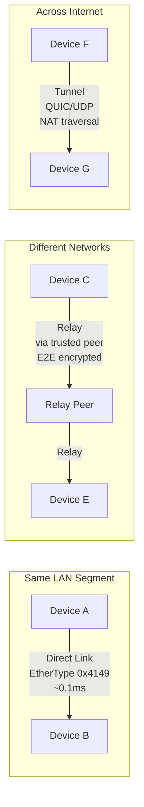
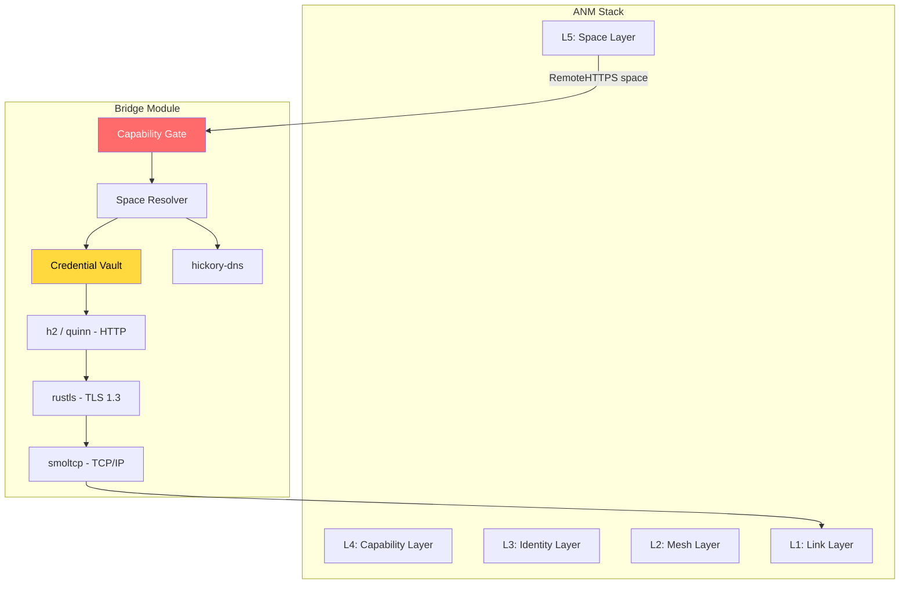
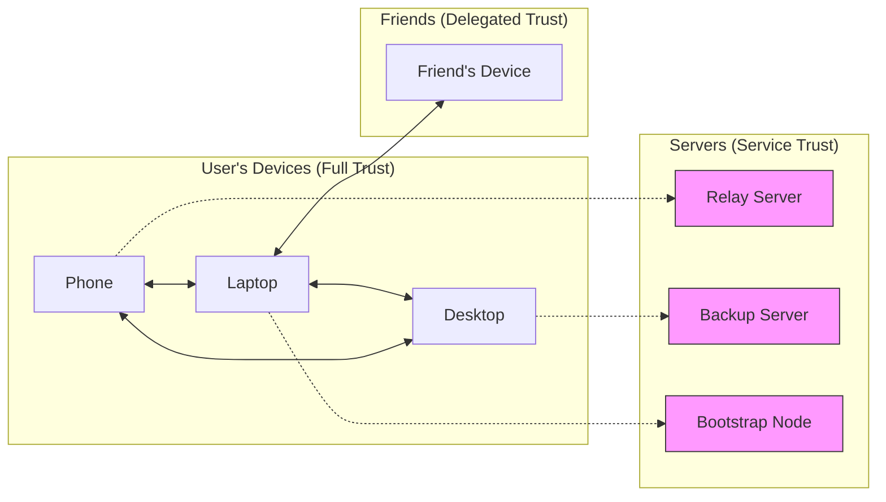

# Discussion: AI Network Model (ANM)

## Context

The OSI model was designed in the 1970s for a world of heterogeneous, untrusted, location-addressed networks. It assumes that identity is separate from addressing, that encryption is optional, that servers are privileged, and that applications handle their own authentication. Every modern security layer (TLS, OAuth, firewalls, VPNs, CAs) is a patch bolted onto a model that never anticipated autonomous software agents, content-addressed storage, or capability-gated access.

AIOS needs a networking model designed from first principles for a world where:

- Software agents act autonomously on behalf of users
- Security is structural, not policy
- Content is addressed by hash, not by location
- Identity is cryptographic, not administrative
- Peer mesh topology replaces client-server hierarchy
- Authorization determines reachability

The **AI Network Model (ANM)** is a 5-layer networking architecture that replaces OSI for AI-native systems. It is not a protocol — it is a model that determines how AIOS thinks about networking at every level, from raw Ethernet frames to space operations.

---

## 1. The ANM Layer Model

ANM has five layers plus a Bridge Module. Each layer has a single responsibility, a defined data unit, and clear failure semantics.

```
+----------------------------------------------------------+
|  L5: Space Layer                                         |
|  Unit: SpaceOperation   Address: SpaceId + ContentHash   |
+----------------------------------------------------------+
|  L4: Capability Layer                                    |
|  Unit: CapabilityToken  Rule: no token = no routing      |
+----------------------------------------------------------+
|  L3: Identity Layer                                      |
|  Unit: DeviceId         Auth: Noise IK (0-RTT)           |
+----------------------------------------------------------+
|  L2: Mesh Layer                                          |
|  Unit: MeshPacket       Modes: Direct/Relay/Tunnel       |
+----------------------------------------------------------+
|  L1: Link Layer                                          |
|  Unit: LinkFrame        Media: Ethernet/WiFi/BT/USB      |
+----------------------------------------------------------+
         ||
   +-----++-----+
   | Bridge      |   Translation membrane for legacy IP
   | Module      |   smoltcp, rustls, h2, quinn, hickory-dns
   +-------------+
```

### Layer Descriptions

**L5: Space Layer** (replaces OSI L5-L7)
Content-addressed space operations. Agents interact with spaces, not networks. The unit of exchange is a `SpaceOperation` (READ, WRITE, SYNC, SUBSCRIBE). Addressing uses `SpaceId` + `ContentHash` — never URLs, never hostnames. An agent calling `space::read()` or `space::write()` has no awareness of whether the data is local, on a peer device, or fetched via Bridge from an HTTP API. The network is invisible.

**L4: Capability Layer** (no OSI equivalent)
Authorization as a network primitive. Every operation requires a `CapabilityToken` — signed, attenuatable, temporally bounded. The rule is absolute: no token, no routing. A packet without a valid capability is not rejected — it is never created. Authorization equals reachability. Every operation is audited to a tamper-evident log. This layer never degrades gracefully — if capabilities are unavailable, operations fail closed.

**L3: Identity Layer** (replaces TLS + session authentication)
Cryptographic identity as addressing. Every device has a `DeviceId` computed as `sha256(Ed25519_public_key)`. Authentication uses the Noise IK handshake pattern, providing 0-RTT for known peers. Trust is graduated across four levels: Full (user's own devices), Delegated (explicitly trusted peers), Service (servers acting as mesh peers), and Unknown (unauthenticated). There are no certificate authorities.

**L2: Mesh Layer** (replaces OSI L3-L4)
Peer discovery, routing, and encryption. The data unit is a `MeshPacket`. Three transport modes handle different network topologies: Direct Link (raw Ethernet on the same segment), Relay (forwarded through a trusted peer with end-to-end encryption), and Tunnel (QUIC/UDP encapsulation for WAN). Noise framework encryption is mandatory — there is no plaintext mode.

**L1: Link Layer** (same as OSI L1-L2)
Hardware is hardware. Ethernet, WiFi, Bluetooth, USB. ANM does not reinvent the physical and data link layers.

**Bridge Module** (not a layer)
A translation membrane between the ANM mesh world and the legacy IP internet. Contains: smoltcp (TCP/IP stack), rustls (TLS 1.3), h2 (HTTP/2), quinn (QUIC/HTTP/3), hickory-dns (DNS resolution), and a Credential Vault. Everything entering AIOS through the Bridge is structurally labeled as DATA (untrusted). The Bridge is optional — two AIOS devices on the same Ethernet segment need no Bridge, no IP, no DNS, no TLS.

### ANM vs OSI Comparison

| Aspect | OSI Model | ANM Model |
|---|---|---|
| Layers | 7 | 5 + Bridge |
| Identity | IP address (assigned, mutable) | DeviceId = sha256(pubkey) (derived, permanent) |
| Authorization | Application-level (bolted on) | L4 network primitive (structural) |
| Encryption | Optional (TLS at L6) | Mandatory (Noise at L2) |
| Addressing | Location-based (IP + port) | Content-based (SpaceId + ContentHash) |
| Trust model | CA hierarchy (~150 roots) | Peer-to-peer (raw public keys) |
| Server role | Privileged endpoint | Peer with role capabilities |
| Firewall | External policy | Unnecessary (L4 is the filter) |
| NAT | Fundamental problem | Irrelevant (identity != location) |
| Session auth | Per-application | Per-identity (L3) |
| Audit | Per-application (if any) | Structural (every L4 operation) |

### Data Unit Encapsulation

```
Agent calls space::write(data)
         |
         v
+----------------------------+
| SpaceOperation             |  L5: READ/WRITE/SYNC/SUBSCRIBE
|   space_id + content_hash  |      + payload
+----------------------------+
         |
         v
+----------------------------+
| AuthorizedOp               |  L4: SpaceOperation + CapabilityToken
|   capability_token         |      (signed, attenuated, temporal)
|   + space_operation        |
+----------------------------+
         |
         v
+----------------------------+
| IdentityFrame              |  L3: AuthorizedOp + DeviceId + Noise session
|   src_device_id            |
|   dst_device_id            |
|   noise_session_id         |
|   + authorized_op          |
+----------------------------+
         |
         v
+----------------------------+
| MeshPacket                 |  L2: IdentityFrame + routing + encryption
|   mesh_header              |      (Noise encrypted, always)
|   + encrypted_payload      |
+----------------------------+
         |
         v
+----------------------------+
| LinkFrame                  |  L1: MeshPacket + link framing
|   ethernet/wifi/bt header  |      (EtherType 0x4149 for Direct Link)
|   + mesh_packet            |
+----------------------------+
```

### Failure Mode Table

| Layer | Failure Mode | Behavior | Rationale |
|---|---|---|---|
| L5 Space | Remote space unreachable | Return cached version or error | Content-addressed = cacheable |
| L4 Capability | Token invalid/expired | **HARD FAIL** — operation denied | Security never degrades |
| L3 Identity | Peer identity unknown | Fall back to Unknown trust level | Graduated trust handles this |
| L2 Mesh | No direct path | Try Relay, then Tunnel, then queue | Multi-mode transport |
| L1 Link | Link down | L2 selects alternate link | Standard link redundancy |
| Bridge | External service unreachable | Return error to space layer | Bridge is optional |

The critical invariant: **L4 Capability Layer never degrades.** Every other layer has graceful fallback behavior. Capability enforcement is absolute.

---

## 2. Seven Design Principles

### Principle 1: Identity IS the Address

```
DeviceId = sha256(Ed25519_public_key)
```

One identity, derived from one key pair. Never changes. Never assigned by a server. Never depends on network topology. NAT is irrelevant because identity is not tied to location. Two devices with the same DeviceId are the same device — the math guarantees it.

This eliminates: DHCP, DNS (for peer addressing), NAT traversal (as an identity problem), IP address management, dynamic DNS, mDNS/Bonjour (for identity — discovery is separate).

### Principle 2: Authorization IS Reachability

No capability token, no packet. This is not a firewall rule — it is a structural property of the network. A packet without a valid capability cannot be constructed, cannot be routed, cannot be received. Port scanning returns nothing because there are no ports. Network scanning returns nothing because unauthenticated peers cannot generate mesh traffic.

Capabilities ARE the filter. Firewalls are unnecessary. Access control lists are unnecessary. The capability system is the only access control mechanism, and it operates at L4 — below the application, above the identity layer.

### Principle 3: Content IS the Name

`ContentHash`, not URL. Data is addressed by its SHA-256 hash, not by its location. This provides:

- **Location independence**: data can move between devices without changing its address
- **Integrity built-in**: if the hash matches, the content is correct — no additional verification needed
- **Automatic deduplication**: identical content has identical addresses, across all devices, across all time
- **Cacheability**: any node holding a copy can serve it — no origin server required

### Principle 4: Encryption IS the Layer

Noise framework encryption is built into L2 (Mesh Layer). It is mandatory. There is no plaintext mode. There is no configuration option to disable it. There is no "development mode" without encryption.

Identity equals encryption key: the same Ed25519 key pair used for DeviceId is converted to X25519 for Noise key agreement. One key pair, one identity, one encryption context. No certificate authorities. No certificate chains. No certificate revocation lists. No OCSP. No certificate transparency logs (for mesh traffic — Bridge uses CT for legacy TLS).

### Principle 5: Servers ARE Peers

All nodes speak the same protocol. A "server" is a peer with additional role capabilities:

| Role | Capability | Description |
|---|---|---|
| Relay | `mesh.relay` | Forward encrypted packets between peers |
| Backup | `space.backup` | Store encrypted space snapshots |
| Discovery | `mesh.discovery` | Maintain DeviceId-to-address mappings |
| Compute | `inference.remote` | Run AIRS inference on behalf of agents |

Same authentication. Same audit trail. Same protocol. A server is replaceable — switch providers by changing a capability delegation, not by migrating accounts. Self-hostable — anyone can run any role.

### Principle 6: Zero Trust IS Structural

Zero trust in ANM is not a policy decision. It is not a configuration. It is an emergent property of the L4 Capability Layer. Every operation, on every peer, every time, requires a valid capability token. This cannot be disabled. There is no "trusted network" mode. There is no "internal" vs "external" distinction.

Traditional zero trust: "verify explicitly, use least-privilege access, assume breach" — implemented via policy engines, identity providers, and continuous verification services. ANM zero trust: the capability system makes any other model structurally impossible.

### Principle 7: Decentralized by Default, Centralized by Choice

The easiest development path MUST be decentralized. Adding a server requires explicit opt-in. Agent manifests declare spaces they need access to — not server URLs, not API endpoints, not cloud regions.

The "hello world" of AIOS networking is two devices syncing a space object over raw Ethernet — no HTTP, no DNS, no TLS, no server, no account. If a developer's first networking experience requires a server, the model has failed.

Centralized services (cloud backup, remote inference, app stores) are available but never required. They are mesh peers with role capabilities, not privileged infrastructure.

---

## 3. Mesh Layer Deep Dive

### 3.1 Three Transport Modes



**Direct Link**

Raw Ethernet frames with AIOS EtherType `0x4149`. No IP stack. No TCP. No TLS. Noise IK encryption provides confidentiality and authentication directly over the link layer. Latency is approximately 0.1ms — limited only by hardware and Noise encryption overhead.

Use case: devices on the same LAN segment. A laptop and a phone on the same WiFi network. Two QEMU instances connected by a virtual bridge.

```
Ethernet Frame (Direct Link):
+------------------+------------------+-----------+------------------+
| Dst MAC (6B)     | Src MAC (6B)     | 0x4149    | MeshPacket       |
|                  |                  | (2B)      | (Noise encrypted)|
+------------------+------------------+-----------+------------------+
```

**Relay**

Encrypted mesh packets forwarded through a mutually trusted peer. The relay peer cannot read the content — Noise provides end-to-end encryption between the source and destination. The relay sees only DeviceId headers (which are themselves derived from public keys, not personal information).

Relay peers are auto-discovered from the peer table. Any peer with the `mesh.relay` capability can act as a relay. Multiple relays can be chained for redundancy.

**Tunnel**

AIOS mesh packets encapsulated in QUIC/UDP for transit across the internet. QUIC provides NAT traversal, multiplexing, and congestion control. The IP layer is the carrier, not the identity layer — DeviceId remains the address.

```
UDP Datagram (Tunnel mode):
+----------+----------+------+---------------------------+
| IP Hdr   | UDP Hdr  | QUIC | MeshPacket                |
|          |          | Hdr  | (Noise encrypted payload) |
+----------+----------+------+---------------------------+
```

### 3.2 Noise IK Protocol

**Why Noise over TLS:**

| Property | Noise IK | TLS 1.3 |
|---|---|---|
| Topology | Peer-to-peer (symmetric) | Client-server (asymmetric) |
| Identity | Raw public keys | X.509 certificates |
| First contact | 1-RTT (IK pattern) | 1-RTT (+ certificate chain) |
| Returning peer | 0-RTT | 0-RTT (with session tickets) |
| Forward secrecy | Full (after Message 2) | Full |
| Identity hiding | Initiator hidden from observer | Server identity visible |
| Code size | ~5 KB | ~300 KB |
| CAs required | No | Yes (~150 root CAs) |
| Cipher suite | Fixed (proven secure) | Negotiated (attack surface) |
| Auth model | Mutual always | Server default, client optional |

**Key Conversion:**

The same Ed25519 key pair used for DeviceId serves double duty for Noise encryption. Ed25519 signing keys are converted to X25519 Diffie-Hellman keys using the birational map between the Edwards and Montgomery curves. One key pair, one identity, one encryption context.

```
Ed25519 key pair
    |
    +---> DeviceId = sha256(public_key)     [Identity]
    |
    +---> X25519 via birational map          [Encryption]
              |
              +---> Noise IK handshake
```

**Handshake Flow:**

```
Initiator (knows responder's static key)        Responder
    |                                                |
    |  Message 1: e, es, s, ss (48B + 0-RTT payload)|
    |----------------------------------------------->|
    |                                                |
    |  Message 2: e, ee, se (48B + response)         |
    |<-----------------------------------------------|
    |                                                |
    [Full forward secrecy established]               |
    |         Transport messages (encrypted)         |
    |<---------------------------------------------->|
```

- **Message 1** (48 bytes + optional 0-RTT payload): initiator sends ephemeral key, performs ES and SS key agreements, can include encrypted payload for 0-RTT data delivery to known peers.
- **Message 2** (48 bytes + response): responder sends ephemeral key, performs EE and SE key agreements. After Message 2, both sides have full forward secrecy.

### 3.3 Peer Discovery Protocol

**Link-Local Discovery (EtherType 0x4149)**

Custom Ethernet broadcast frame sent every 30 seconds or on link state change.

```
ANNOUNCE Frame Format:
+----------+------+-------------------+----------+---------------------+------------+-----------+
| Version  | Type | DeviceId[0..16]   | Nonce    | Capabilities Bitmap | Noise_e    | Signature |
| (1B)     | (1B) | (16B)             | (8B)     | (8B)                | (32B)      | (64B)     |
+----------+------+-------------------+----------+---------------------+------------+-----------+
Total: 130 bytes payload + 14 bytes Ethernet header = 144 bytes
```

- `Version`: Protocol version (currently 1)
- `Type`: Frame type (0x01 = ANNOUNCE)
- `DeviceId[0..16]`: First 16 bytes of the 32-byte DeviceId (sufficient for discovery; full ID exchanged during Noise handshake)
- `Nonce`: 8-byte random nonce (prevents replay)
- `Capabilities Bitmap`: 64 bits indicating peer roles (relay, backup, discovery, compute, etc.)
- `Noise_e`: Ephemeral public key for immediate handshake initiation
- `Signature`: Ed25519 signature over the preceding fields (prevents spoofing)

**BLE Discovery**

Service UUID `0xAIOS`, payload contains `DeviceId[0..8]` (8 bytes). BLE is for discovery only — actual data transfer occurs over WiFi or Ethernet after discovery.

**WAN Discovery (Stored Peers)**

`PeerStore` maps `DeviceId` to last-known connection information:

```
PeerStore entry:
  DeviceId      -> last_ip: SocketAddr
                   relay_peers: Vec<DeviceId>
                   last_seen: Timestamp
```

Discovery sequence for a known peer:
1. Try `last_ip` directly (QUIC connect)
2. Ask `relay_peers` if they have a current path
3. STUN hole-punch through NAT
4. Query bootstrap nodes for current IP
5. Queue for later (peer offline)

**Bootstrap Nodes**

Bootstrap nodes are NOT servers. They maintain only a mapping of `DeviceId -> last_known_ip`. They:

- Cannot read data (all mesh traffic is Noise E2E encrypted)
- Cannot forge identity (DeviceId is derived from the key pair they don't possess)
- Are operated by anyone (open source, self-hostable)
- Are replaceable (switch bootstrap by updating a config, not migrating an account)

A compromised bootstrap node can only cause denial of service (return wrong IPs or nothing). It cannot impersonate peers, read traffic, or forge capabilities.

### 3.4 Peer Table

The peer table is the mesh layer's routing table. It maps each known DeviceId to one or more paths, ordered by preference:

```rust
struct PeerTable {
    peers: BTreeMap<DeviceId, PeerEntry>,
}

struct PeerEntry {
    paths: Vec<Path>,
    trust_level: TrustLevel,
    last_seen: Timestamp,
    noise_session: Option<NoiseSession>,
}

enum Path {
    DirectLink { mac: [u8; 6], interface: InterfaceId },
    Relay { via: DeviceId, latency_ms: u32 },
    Tunnel { endpoint: SocketAddr, quic_conn: QuicConnectionId },
}
```

Path selection priority: DirectLink > Relay (lowest latency) > Tunnel. Failover is automatic — if a Direct Link goes down, the mesh layer transparently switches to Relay or Tunnel without the space layer knowing.

---

## 4. Bridge Layer Deep Dive

### 4.1 Architecture

The Bridge Module is a translation membrane between the ANM mesh world and the legacy IP internet. It is not a layer — it sits beside the stack, translating between ANM concepts and IP protocols.



**Outbound flow** (agent reads from an external API):

1. Agent calls `space::read(api_space, key)`
2. L4 Capability Gate checks the agent has `bridge.outbound` + space-specific capability
3. Space Resolver determines the space type is `RemoteHTTPS`
4. Bridge translates to HTTP request, injects credentials from Vault
5. Response passes through content screening
6. Response is labeled as DATA (untrusted) at the kernel level
7. Space objects returned to agent

**Inbound flow** (external client connects to AIOS):

Agent-initiated only by default (safest configuration). Optional Bridge listener for hosting scenarios, gated by `bridge.inbound` capability.

**AIOS-to-AIOS via internet:**

The Bridge acts as a tunnel (encapsulating mesh packets in QUIC/UDP), not as a translator. The mesh encryption layer (Noise) is preserved end-to-end. The Bridge provides only the UDP transport.

### 4.2 Bridge Security -- Attack Surface Analysis

| # | Attack Vector | ANM Mitigation | Residual Risk |
|---|---|---|---|
| 1 | Rogue AIOS peer | Noise rejects unknown keys | None |
| 2 | Replay attack | Nonce in every Noise handshake | None |
| 3 | Traffic analysis | Encrypted, but timing leaks possible | Medium |
| 4 | Compromised relay | Cannot read content (Noise E2E) | None |
| 5 | DNS poisoning | DNSSEC + DoH/DoT + cert pinning | Low |
| 6 | TLS interception | CT logs + cert pinning + dynamic pinning | Low |
| 7 | API credential theft | Vault isolates + rotation + scoping | Medium |
| 8 | Response tampering | Schema validation + screening + DATA label | Medium |
| 9 | Prompt injection via response | DATA label + capability check + behavioral monitor | None (structural) |

### 4.3 Seven Bridge Security Layers

The Bridge enforces defense in depth with seven distinct security layers:

```
L7: DATA Labeling        kernel-enforced trust boundary (THE boundary)
L6: Content Screening    InputScreener: pattern + ML analysis
L5: Response Validation  schema checking, size limits, rate monitoring
L4: Packet Filter        capability-derived rules, default deny
L3: TLS Enforcement      TLS 1.3 only, cert pinning, CT verification
L2: Credential Vault     inject auth credentials, never expose to agents
L1: Capability Gate      kernel-level, checked before Bridge is invoked
```

**L1 Capability Gate** (kernel, before Bridge): The operation must have a valid capability token before the Bridge is even invoked. No token, no Bridge access.

**L2 Credential Vault**: API keys, OAuth tokens, and other credentials are stored in an isolated vault. The Bridge injects credentials into outbound requests. Agents never see raw credentials — they see space operations.

**L3 TLS Enforcement**: TLS 1.3 only (no fallback to 1.2). Certificate pinning for known services. Certificate Transparency log verification. Rejection of certificates from distrusted CAs.

**L4 Packet Filter**: Capability-derived packet filtering. Default deny. Only protocols and endpoints explicitly permitted by the agent's capability set are reachable.

**L5 Response Validation**: Schema validation against expected response formats. Size limits to prevent memory exhaustion. Rate monitoring to detect anomalous response patterns.

**L6 Content Screening**: InputScreener applies pattern matching and ML-based analysis to detect prompt injection, malicious payloads, and content policy violations in responses from external services.

**L7 DATA Labeling**: The structural trust boundary. Everything entering AIOS through the Bridge is labeled as DATA at the kernel level. DATA-labeled content cannot be interpreted as CONTROL (instructions). This is enforced structurally — the label is part of the data's type, not a policy check.

### 4.4 Honest Limitations

What the Bridge CANNOT protect against:

- **Malicious API servers returning wrong-but-valid data**: If a weather API returns fabricated temperatures that pass schema validation, the Bridge cannot detect the lie. The data is well-formed but false.
- **Server-side credential breaches**: If the API provider's database is compromised, Bridge security is irrelevant — the breach is upstream.
- **Targeted government surveillance via CA compromise**: For unpinned spaces (services where we don't control certificate pinning), a state-level adversary with CA access can intercept TLS. Pinned spaces are immune.
- **Metadata leakage**: DNS queries, IP addresses, and timing patterns reveal that AIOS is communicating with a particular service, even though content is encrypted.
- **Correlation attacks**: An adversary observing both mesh traffic and Bridge traffic patterns may correlate them to deanonymize mesh participants.

**Critical invariant**: Bridge weaknesses NEVER compromise mesh guarantees. The mesh is independently secure. A total Bridge compromise (all seven layers breached) affects only Bridge-mediated traffic — mesh peers communicating via Direct Link, Relay, or Tunnel are unaffected.

---

## 5. Bridge Protocol Integration Guide

### 5.1 WireGuard as Reference Pattern

WireGuard shares approximately 80% of ANM's cryptographic primitives (Noise IK, ChaCha20-Poly1305, X25519). This makes it an ideal reference for how Bridge integrates external protocols.

Three scenarios for WireGuard:

| Scenario | Description | Implementation |
|---|---|---|
| Outbound VPN | AIOS agent needs to access resources behind a WireGuard VPN | Bridge Module encapsulates mesh traffic in WireGuard tunnel |
| Ingress | Non-AIOS device connects to AIOS via WireGuard | Bridge listener, capability-gated, DATA-labeled |
| AIOS-to-AIOS | Two AIOS devices communicating | Use mesh directly — WireGuard is unnecessary |

Implementation: Bridge Module, reusing mesh crypto primitives. Unique code is approximately 1K lines (IP-in-UDP framing + AllowedIPs routing table).

### 5.2 Eight-Question Integration Template

For ANY protocol added to the Bridge Module, answer these eight questions:

1. **Does ANM Mesh already cover this?** If yes, do not add it. Use the mesh.
2. **What crypto is shared with Mesh Layer?** Maximize reuse of Noise IK, X25519, ChaCha20-Poly1305.
3. **What is the unique protocol framing?** Only implement the parts that differ from mesh.
4. **Where do credentials live?** Always in the Credential Vault. Never in agent memory.
5. **What trust level?** Always Bridge-level. Always DATA-labeled.
6. **What capability gates it?** Define a protocol-specific capability type.
7. **Can agents see the protocol?** No. Agents see spaces. Protocol details are invisible.
8. **Fallback if unavailable?** Define degradation behavior.

### 5.3 Protocol Integration Table

| Protocol | Bridge Role | Crypto Reuse from Mesh | Unique Code (est.) |
|---|---|---|---|
| WireGuard | VPN tunnel | Noise IK, ChaCha20, X25519 (80%) | IP-in-UDP, AllowedIPs (~1K lines) |
| SSH | Remote shell access | X25519 key agreement | SSH framing, channel mux (~3K lines) |
| MQTT | IoT device communication | TLS (Bridge standard) | Topic-to-space mapping (~2K lines) |
| gRPC | Microservice integration | TLS (Bridge standard) | Protobuf-to-space mapping (~2K lines) |
| WebRTC | Real-time media | DTLS-SRTP | ICE/STUN/TURN, RTP framing (~5K lines) |
| Tor | Anonymous routing | Tor circuit crypto (separate) | Onion routing (~10K lines) |
| Matrix | Federated messaging | Olm/Megolm (separate) | Event-to-space mapping (~3K lines) |
| ActivityPub | Fediverse integration | TLS (Bridge standard) | AP-to-space, WebFinger (~2K lines) |

---

## 6. Decentralization Model

### 6.1 The Spectrum

Decentralization is not binary. It is a spectrum:

```
Fully Centralized ----+---- Federated ----+---- Hybrid ----+---- Fully P2P
(Google, Apple)        (Matrix, Email)      (AIOS)          (IPFS, BitTorrent)
```

AIOS sits at **Hybrid**: user controls the core (identity, data, local compute), servers are optional services. This is sovereignty, not isolation. Users can choose centralized services for convenience without surrendering control.

### 6.2 Seven Decentralization Primitives

| # | Primitive | Status | Implementation |
|---|---|---|---|
| 1 | Self-Sovereign Identity | Complete | Ed25519 key pair, no server needed |
| 2 | Content-Addressed Storage | Complete | SHA-256 hashing, Merkle DAG |
| 3 | Peer-to-Peer Sync | Complete | Three-round Merkle exchange protocol |
| 4 | Peer Mesh | Complete | ANM (this document) |
| 5 | Capability Delegation | Complete | Unforgeable tokens, attenuatable, temporal |
| 6 | Distributed Discovery | Research needed | DHT + social graph + federation |
| 7 | Decentralized Compute | Transitional | On-device AIRS + Bridge for heavy AI |

Primitives 1-5 are fully designed and require no centralized infrastructure. Primitive 6 (distributed discovery) needs further research — current design uses bootstrap nodes as a pragmatic bridge. Primitive 7 (decentralized compute) is transitional — on-device inference handles most workloads, with Bridge-mediated cloud compute for models too large for local hardware.

### 6.3 Servers as Mesh Peers

In ANM, servers are not privileged. They are mesh peers with role capabilities:



Properties of servers-as-peers:

- **Same protocol**: speak ANM mesh, not a special server protocol
- **Same authentication**: Noise IK, same as any peer
- **Same audit trail**: all operations logged identically
- **Replaceable**: switch providers by updating capability delegation, not migrating accounts
- **Self-hostable**: anyone can run any server role (open source)
- **Trust level**: Service (below user's own devices, below trusted friends, above Bridge data)

### 6.4 Adoption Flywheel

Decentralization must be adopted through convenience, not ideology:

```
Phase 1: "No accounts needed"
    Users notice: no email signup, no password, device just works
         |
         v
Phase 2: "My stuff syncs automatically"
    Users notice: photos/notes appear on all devices without cloud setup
         |
         v
Phase 3: "Sharing is instant"
    Users notice: AirDrop-like sharing with any AIOS device, no app needed
         |
         v
Phase 4: "Apps respect my boundaries"
    Users notice: apps can't access data without explicit capability grant
         |
         v
Phase 5: "I don't need servers"
    Users realize: everything works without an internet connection
```

The key insight: users adopt convenience, not principles. Decentralization must be SIMPLER than the centralized alternative, not just more principled.

### 6.5 Economic Model

The economic model differs fundamentally from cloud-centric systems:

- **Most cost already paid**: users own devices (compute, storage, networking). AIOS uses resources the user has already purchased.
- **Heavy AI compute**: Bridge to cloud inference services (transitional). As on-device models improve, this dependency shrinks.
- **Relay and bootstrap**: community-operated (like Tor relays) or self-hosted. Low resource requirements — a Raspberry Pi can run a relay.
- **No subscription tax**: core functionality requires no ongoing payment to any service provider.

---

## 7. Security Model

### 7.1 Five ANM Security Layers

```
L5: Behavioral Monitor     anomalous mesh traffic patterns
L4: Content Verification   SHA-256, Merkle DAG, tamper-evident
L3: Capability Gate         kernel, mandatory, unforgeable, audited
L2: Mesh Encryption         Noise, always-on, no plaintext mode
L1: Peer Authentication     Ed25519, no CAs, graduated trust
```

Each layer is independent. Compromising one does not compromise others. The security model is defense in depth — an attacker must breach all five layers to compromise a mesh communication.

### 7.2 ANM vs OSI Security Comparison

| OSI Problem | ANM Solution |
|---|---|
| TLS trusts ~150 CAs, any can issue for any domain | No CAs. Identity = public key. Trust is peer-to-peer. |
| Application must implement its own authentication | Identity = encryption key. Auth is at L3, below applications. |
| Static firewall rules, manually maintained | Capability-derived, live, kernel-enforced. |
| VPN = trusted network boundary | No boundaries. Every operation requires a capability, everywhere. |
| IPsec is complex and rarely deployed | Noise is mandatory, zero-configuration, always-on. |
| API keys and tokens leak to applications | Credential Vault. Agents see spaces, not credentials. |
| No unified audit trail across the stack | Single audit space. Every L4 operation logged. |

### 7.3 Threat Model

**Attacks that the ANM mesh defeats:**

| Attack | Why it fails against ANM |
|---|---|
| DNS spoofing | Mesh does not use DNS for peer addressing |
| CA compromise | No CAs in the mesh — raw public keys only |
| TCP session hijacking | No TCP in the mesh — Noise sessions are cryptographically bound |
| Port scanning | No ports — capability-gated, no listening sockets |
| ARP spoofing | Noise rejects handshakes from unknown keys |
| BGP hijacking | Mesh routes by DeviceId, not by IP prefix |
| Rogue WiFi AP | Noise encryption prevents content interception; identity prevents MITM |
| IP spoofing | Identity is DeviceId (crypto), not IP (assignable) |
| Connection tracking / deep packet inspection | Encrypted at L2 — all mesh traffic is opaque |

**Attacks affecting both OSI and ANM:**

| Attack | Impact on ANM |
|---|---|
| Traffic analysis | Encrypted but timing/size patterns leak metadata |
| Denial of service | Mesh peers can be flooded; mitigated by rate limiting |
| Physical access | Device compromise = identity compromise |
| Compromised device | Revoke DeviceId from trust set; damage limited to that device |
| Correlation attacks | Cross-referencing mesh and Bridge traffic may deanonymize |

**Attacks unique to ANM:**

| Attack | Mitigation |
|---|---|
| Rogue bootstrap node | Returns wrong IPs (DoS only); cannot impersonate or intercept |
| Relay traffic analysis | Relay sees only encrypted packets + DeviceId headers; metadata leakage |
| EtherType filtering | Network equipment could block 0x4149; fall back to Tunnel mode |
| Capability token replay | Tokens are temporally bounded + nonce-protected |
| Mesh partition attack | Isolate a device from all peers; device continues with local data |

---

## 8. Technology Stack

| Component | Crate | License | ANM Layer | Purpose |
|---|---|---|---|---|
| X25519 key agreement | `x25519-dalek` | MIT | L2 + L3 | Noise DH, peer key exchange |
| ChaCha20-Poly1305 | `chacha20poly1305` | Apache-2.0/MIT | L2 | Noise AEAD encryption |
| Ed25519 signatures | `ed25519-dalek` | MIT | L3 | DeviceId, ANNOUNCE signing |
| SHA-256 | `sha2` | Apache-2.0/MIT | L3 + L4 | DeviceId, ContentHash |
| QUIC transport | `quinn` | Apache-2.0/MIT | L2 (Tunnel) | WAN mesh encapsulation |
| TCP/IP stack | `smoltcp` | BSD-2-Clause | Bridge | Legacy IP connectivity |
| TLS 1.3 | `rustls` | Apache-2.0/MIT | Bridge | External service encryption |
| HTTP/2 | `h2` | MIT | Bridge | External API communication |
| DNS | `hickory-dns` | Apache-2.0/MIT | Bridge | Legacy name resolution |
| Root certificates | `webpki-roots` | MPL-2.0 | Bridge | CA trust for Bridge TLS |

All crates are `no_std` compatible or have `no_std` feature flags. No GPL dependencies.

---

## 9. Phase 8 Replanning

The ANM design necessitates replanning Phase 8 (Networking) into three sub-phases:

**Phase 8a: Mesh Layer + VirtIO-Net**

- VirtIO-Net driver (raw Ethernet frame send/receive)
- AIOS EtherType `0x4149` framing
- Noise IK handshake (using `x25519-dalek` + `chacha20poly1305`)
- Peer discovery (link-local ANNOUNCE broadcast)
- Peer table (DirectLink paths)
- Space sync over mesh (three-round Merkle exchange)
- Acceptance: two QEMU instances exchange space objects over raw Ethernet with Noise encryption

**Phase 8b: Bridge Layer**

- smoltcp TCP/IP stack integration
- rustls TLS 1.3
- DHCP client + DNS resolution (hickory-dns)
- HTTP/2 client (h2)
- Credential Vault
- DATA labeling (kernel-enforced)
- Bridge security layers (capability gate, packet filter, content screening)
- Acceptance: agent reads from an HTTPS API via Bridge, response is DATA-labeled

**Phase 8c: POSIX Socket Compatibility + WAN Mesh**

- POSIX socket bridge (AF_INET, AF_INET6 translation)
- QUIC tunnel mode (quinn)
- WAN peer discovery (stored peers, bootstrap nodes)
- Relay forwarding
- NAT traversal (STUN hole-punch)
- Acceptance: two QEMU instances exchange space objects over simulated WAN (Tunnel mode)

---

## 10. Future Shared Crate Types

When Phase 8 is implemented, the following types will be added to `shared/src/`:

```rust
// shared/src/network.rs (new file)

/// Device identity: sha256(Ed25519 public key)
pub struct DeviceId([u8; 32]);

/// Mesh packet header
pub struct MeshPacketHeader {
    pub version: u8,
    pub packet_type: MeshPacketType,
    pub src: DeviceId,
    pub dst: DeviceId,
    pub sequence: u64,
}

/// Peer role capabilities
pub enum PeerRole {
    Relay,
    Backup,
    Discovery,
    Compute,
}

/// Peer table entry
pub struct PeerEntry {
    pub device_id: DeviceId,
    pub paths: [Option<Path>; 4],
    pub trust_level: TrustLevel,
    pub last_seen: u64,
}

/// Space operation (L5 data unit)
pub enum SpaceOperation {
    Read { space_id: SpaceId, content_hash: ContentHash },
    Write { space_id: SpaceId, data: BlockId },
    Sync { space_id: SpaceId, merkle_root: ContentHash },
    Subscribe { space_id: SpaceId, filter: u64 },
}

/// Noise session state
pub struct NoiseSession {
    pub peer: DeviceId,
    pub send_key: [u8; 32],
    pub recv_key: [u8; 32],
    pub send_nonce: u64,
    pub recv_nonce: u64,
}

/// Bridge endpoint descriptor
pub struct BridgeEndpoint {
    pub protocol: BridgeProtocol,
    pub host: [u8; 256],
    pub port: u16,
    pub credential_id: u32,
}
```

---

## 11. QEMU Multi-Instance Testing

A `just run-mesh` command will launch two QEMU VM instances connected by a virtual Ethernet bridge:

```bash
# Create virtual bridge
ip link add br-aios type bridge
ip link set br-aios up

# Launch VM 1
qemu-system-aarch64 \
    -machine virt -cpu cortex-a72 -smp 4 -m 2G \
    -netdev tap,id=net0,br=br-aios \
    -device virtio-net-device,netdev=net0,mac=52:54:00:00:00:01 \
    # ... kernel and disk flags ...

# Launch VM 2
qemu-system-aarch64 \
    -machine virt -cpu cortex-a72 -smp 4 -m 2G \
    -netdev tap,id=net0,br=br-aios \
    -device virtio-net-device,netdev=net0,mac=52:54:00:00:00:02 \
    # ... kernel and disk flags ...
```

**Acceptance criteria**: VM1 creates a space object, VM2 discovers VM1 via link-local ANNOUNCE, Noise IK handshake completes, VM2 requests the object via space sync, VM1 sends it, VM2 verifies the ContentHash. All traffic is Noise-encrypted. No IP stack involved.

---

## 12. Architecture Doc Impact

The ANM design requires updates across the documentation tree:

**Tier 1 -- Major rewrites (5 documents):**

| Document | Change |
|---|---|
| `docs/platform/networking.md` | Rewrite around ANM model |
| `docs/platform/networking/components.md` | Replace NTM components with ANM layers |
| `docs/platform/networking/stack.md` | Move smoltcp to Bridge Module |
| `docs/platform/networking/security.md` | Rewrite around ANM security model |
| `docs/security/decentralisation.md` | Integrate ANM decentralization primitives |

**Tier 2 -- Significant updates (6 documents):**

| Document | Change |
|---|---|
| `docs/platform/networking/protocols.md` | Restructure around Bridge Module |
| `docs/platform/networking/examples.md` | Rewrite with ANM examples |
| `docs/platform/networking/future.md` | Update AI-native networking for mesh |
| `docs/security/model.md` | Add ANM as a security layer |
| `docs/security/model/layers.md` | Integrate L4 Capability as network layer |
| `docs/project/architecture.md` | Update networking architecture section |

**Tier 3 -- Meaningful section updates (39 documents):**

Cross-subsystem documents referencing "network" or "TCP/IP" need terminology updates: compositor (remote display), audio (network streaming), storage (space sync), USB (network class), wireless (mesh integration), camera (remote viewfinder), media (streaming), agents (network access), browser (Bridge integration), and others.

**Tier 4 -- Terminology updates (~120 occurrences):**

Replace "TCP connection" with "mesh session", "IP address" with "DeviceId", "server" with "peer" (where appropriate), "firewall" with "capability gate", "TLS" with "Noise" (for mesh), etc.

**New documents (3):**

| Document | Content |
|---|---|
| `docs/platform/networking/anm.md` | ANM layer model specification |
| `docs/platform/networking/mesh.md` | Mesh layer protocol specification |
| `docs/platform/networking/bridge.md` | Bridge module specification |

**ADRs to extract (9):**

1. ANM over OSI (rationale for new model)
2. Noise over TLS (for mesh encryption)
3. Content addressing over location addressing
4. EtherType 0x4149 (raw Ethernet for Direct Link)
5. Ed25519 for identity + encryption (key reuse via birational map)
6. Bridge as membrane, not layer
7. Bootstrap nodes as non-privileged peers
8. Graduated trust levels (Full/Delegated/Service/Unknown)
9. Phase 8 split into 8a/8b/8c

---

## 13. References

- [Noise Protocol Framework](https://noiseprotocol.org/) -- Trevor Perrin, 2018. Foundation for L2/L3 encryption.
- [IPFS](https://ipfs.io/) -- Content-addressed, peer-to-peer storage. Inspiration for content addressing (Principle 3).
- [Named Data Networking (NDN)](https://named-data.net/) / [Content-Centric Networking (CCN)](https://www.ccnx.org/) -- Data-centric networking research. Influenced content-as-name design.
- [Yggdrasil Network](https://yggdrasil-network.github.io/) -- Encrypted end-to-end IPv6 mesh. Influenced mesh layer design.
- [CJDNS](https://github.com/cjdelisle/cjdns) -- Encrypted mesh networking with self-assigned IPv6. Similar identity-as-address concept.
- [libp2p](https://libp2p.io/) -- Modular peer-to-peer networking stack. Influenced peer discovery and transport abstraction.
- [WireGuard](https://www.wireguard.com/) -- Jason Donenfeld. Noise-based VPN protocol. Reference for Bridge protocol integration.
- [Signal Protocol](https://signal.org/docs/) -- Double Ratchet Algorithm. Influenced forward secrecy design.
- [seL4](https://sel4.systems/) / [EROS](https://en.wikipedia.org/wiki/EROS_(microkernel)) -- Capability-based microkernels. Foundation for L4 Capability Layer design.
- [Plan 9 from Bell Labs](https://9p.io/plan9/) -- Network-transparent computing. Influenced "everything is a space" philosophy.
- [Fuchsia](https://fuchsia.dev/) -- Capability-based OS. Reference for capability-gated networking.

---

## Open Questions

- **Distributed discovery (Primitive 6)**: DHT vs social graph vs federation? What is the right balance between discoverability and privacy?
- **EtherType registration**: 0x4149 is a placeholder. Should AIOS register an official EtherType with IEEE?
- **Mesh scalability**: What happens with 1000+ peers? Need to research gossip protocols and routing table compaction.
- **Offline-first conflict resolution**: When two devices modify the same space object offline, the Merkle DAG handles structural merging -- but what about semantic conflicts?
- **QoS in mesh**: How to prioritize latency-sensitive traffic (voice, video) over bulk sync without reintroducing TCP-like complexity?

---

## Outcome

_Fill in when graduated or archived:_
- Graduates to: `docs/platform/networking/anm.md`, `docs/platform/networking/mesh.md`, `docs/platform/networking/bridge.md`
- ADRs extracted to: 9 decision records (see Section 12)
- Phase 8 replanned into 8a/8b/8c
