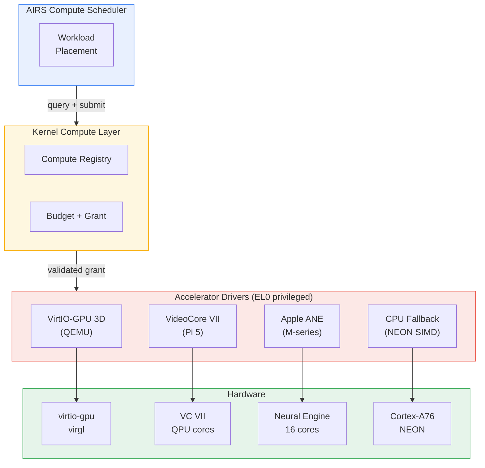

# AIOS Platform Accelerator Drivers

**Parent document:** [architecture.md](../project/architecture.md)
**Related:** [compute.md](../kernel/compute.md) — Kernel compute abstraction (device classification, budgets, security), [gpu.md](./gpu.md) — GPU display and rendering, [subsystem-framework.md](./subsystem-framework.md) — Subsystem sessions and capability gates, [thermal.md](./thermal.md) — Thermal management

-----

## 1. Core Insight

The kernel compute abstraction ([compute.md](../kernel/compute.md)) defines *what* compute devices are and how access is controlled. This document defines *how* platform-specific accelerator drivers implement the `ComputeDevice` trait for actual hardware.

Each platform has radically different accelerator programming models. VideoCore VII on the Raspberry Pi 5 uses a mailbox interface with QPU (Quad Processing Unit) shader programs. Apple's Neural Engine uses a proprietary compiled model format and DMA-based buffer exchange. VirtIO-GPU 3D on QEMU provides a paravirtualized compute surface through virgl. Despite these differences, all drivers implement the same three traits: `Driver` (device lifecycle), `ComputeDevice` (compute classification and submission), and `AcceleratorDriver` (platform-specific operations).

**The key constraint:** the `AcceleratorDriver` trait is a *refinement*, not a replacement. An accelerator driver is still a device driver — it goes through the same probe/bind/lifecycle as any other driver ([device-model/discovery.md](../kernel/device-model/discovery.md) §6). The accelerator-specific operations are layered on top.

**Development strategy:** QEMU first. VirtIO-GPU 3D compute (or a VirtIO-Compute device) is the primary development target. Real hardware drivers (VideoCore VII, Apple ANE) follow in Phase 39 when the platform BSP ([bsp.md](./bsp.md)) provides the necessary MMIO access and interrupt routing.

-----

## 2. Architecture Overview



**Driver responsibilities:**

| Responsibility | AcceleratorDriver | Driver (inherited) | ComputeDevice (inherited) |
| --- | --- | --- | --- |
| Hardware init | `init_compute_engine()` | `probe()`, `attach()` | — |
| Command submission | `compile_program()` | — | `submit()` |
| Capability reporting | — | — | `capabilities()`, `compute_class()` |
| Memory mapping | `map_compute_buffer()` | — | `alloc_device_memory()` |
| Power management | `set_compute_power_state()` | `suspend()`, `resume()` | `power_draw_mw()` |
| Performance counters | `performance_counters()` | — | `utilization()` |

-----

## Document Map

| Document | Sections | Content |
| --- | --- | --- |
| **This file** | §1, §2, §13, §14 | Core insight, architecture, implementation order, design principles |
| [drivers.md](./accelerators/drivers.md) | §3, §4, §5 | AcceleratorDriver trait, VirtIO-GPU 3D compute (QEMU), VideoCore VII (Pi 5) |
| [ane.md](./accelerators/ane.md) | §6, §7 | Apple Neural Engine architecture, ANE driver model and memory model |
| [memory.md](./accelerators/memory.md) | §8, §9 | Accelerator memory management, zero-copy CPU-accelerator data paths |
| [subsystem.md](./accelerators/subsystem.md) | §10, §11 | Compute subsystem (Subsystem trait), sessions, POSIX bridge |
| [intelligence.md](./accelerators/intelligence.md) | §12, §15 | AI-native accelerator management, AIRS integration, future directions |

-----

## 13. Implementation Order

```text
Phase 5:   VirtIO-GPU 2D display driver (no compute path)
             └── establishes VirtIO transport, buffer management, driver isolation

Phase 19:  ComputeDevice trait + CPU-as-compute baseline
             └── kernel compute abstraction ready; no accelerator drivers yet

Phase 20:  VirtIO-GPU 3D compute (QEMU development target)
             ├── virgl compute shaders on QEMU
             ├── AcceleratorDriver trait implementation
             ├── ComputeSubsystem registration
             └── MediaCodec hardware acceleration via compute shaders

Phase 39:  VideoCore VII compute driver (Raspberry Pi 5)
             ├── Mailbox interface for QPU program submission
             ├── Shared memory buffer management (unified memory)
             └── Thermal zone registration with SoC coupling coefficients

Phase 39:  Apple Neural Engine driver
             ├── ANE command queue interface
             ├── Compiled model loading (CoreML/ONNX → ANE format)
             ├── DMA-based buffer exchange
             └── Fixed-function inference (no general-purpose compute)

Phase 41:  AIRS intelligent placement across all accelerators
             ├── Learned cost models per device
             ├── Cross-device model partitioning
             └── Predictive accelerator power management
```

**Dependency chain:**

```text
Phase 3 (IPC + Caps)       → Capability tokens for compute access
Phase 4 (VirtIO-blk)       → VirtIO transport reuse
Phase 5 (GPU display)      → VirtIO-GPU driver infrastructure
Phase 19 (Compute trait)   → ComputeDevice + ComputeRegistry
Phase 20 (Accelerators)    → First accelerator driver (VirtIO-GPU 3D)
Phase 39 (Real Hardware)   → Platform-specific drivers
```

-----

## 14. Design Principles

1. **Same driver, extended interface.** An accelerator driver implements `Driver` + `ComputeDevice` + `AcceleratorDriver`. One struct, one lifecycle, three trait interfaces. This avoids driver proliferation and ensures device lifecycle is managed in one place.

2. **Subsystem framework compliance.** The compute subsystem follows the same session/capability/audit/POSIX pattern as audio, networking, and display ([subsystem-framework.md](./subsystem-framework.md)). Adding compute to a platform is formulaic, not architectural.

3. **QEMU-first development.** VirtIO-GPU 3D compute is the primary development target through Phase 20. Real hardware drivers are added in Phase 39 when BSP support is ready. The VirtIO driver validates the entire stack (capability grants, budget enforcement, memory management) before real hardware introduces platform-specific complexity.

4. **Unified memory is the fast path.** ARM SoCs share system RAM between CPU and accelerators. The driver stack optimizes for cache operations (flush/invalidate), not DMA transfers. Discrete memory support (DMA copies) is layered on top for hypothetical future hardware.

5. **NPU is not a GPU.** NPUs run compiled graphs to completion — they are not general-purpose. The `AcceleratorDriver` trait accommodates this: `compile_program()` accepts pre-compiled model formats (not shader source), and `submit()` runs the entire graph as one unit. The abstraction does not force GPU-style command buffer semantics onto fixed-function hardware.

6. **Driver isolation.** Accelerator drivers run as privileged userspace processes (Phase 5+) with capability-gated MMIO access. A crashing GPU driver does not crash the kernel. The kernel provides MMIO grants, IRQ forwarding, and SMMU configuration — the driver does everything else in userspace.

7. **Progressive hardware support.** Start with the simplest platform (QEMU VirtIO), then add real hardware one platform at a time. Each new platform validates the abstraction — if the `AcceleratorDriver` trait doesn't fit a platform, the trait is wrong, not the platform.

-----

## Cross-Reference Index

| Section | Sub-document | Related Docs |
| --- | --- | --- |
| §1 Core Insight | This file | [compute.md](../kernel/compute.md) §1, [gpu.md](./gpu.md) §1, [device-model.md](../kernel/device-model.md) §1 |
| §2 Architecture Overview | This file | [compute.md](../kernel/compute.md) §2, [subsystem-framework.md](./subsystem-framework.md) §3 |
| §3 AcceleratorDriver Trait | [drivers.md](./accelerators/drivers.md) | [device-model/discovery.md](../kernel/device-model/discovery.md) §6, [compute/classification.md](../kernel/compute/classification.md) §3 |
| §4 VirtIO-GPU 3D Compute | [drivers.md](./accelerators/drivers.md) | [gpu/drivers.md](./gpu/drivers.md) §3, [device-model/virtio.md](../kernel/device-model/virtio.md) §10 |
| §5 VideoCore VII | [drivers.md](./accelerators/drivers.md) | [gpu/drivers.md](./gpu/drivers.md) §4, [bsp/platforms.md](./bsp/platforms.md) §6 |
| §6 Apple Neural Engine | [ane.md](./accelerators/ane.md) | [bsp/platforms.md](./bsp/platforms.md) §7, [airs/scaling.md](../intelligence/airs/scaling.md) §11.4 |
| §7 ANE Memory Model | [ane.md](./accelerators/ane.md) | [compute/memory.md](../kernel/compute/memory.md) §9 |
| §8 Accelerator Memory | [memory.md](./accelerators/memory.md) | [compute/memory.md](../kernel/compute/memory.md) §9, §10, [device-model/dma.md](../kernel/device-model/dma.md) §11 |
| §9 Zero-Copy Paths | [memory.md](./accelerators/memory.md) | [compute/memory.md](../kernel/compute/memory.md) §10, [gpu/rendering.md](./gpu/rendering.md) §12 |
| §10 Compute Subsystem | [subsystem.md](./accelerators/subsystem.md) | [subsystem-framework.md](./subsystem-framework.md) §4, §14 |
| §11 POSIX Bridge | [subsystem.md](./accelerators/subsystem.md) | [posix.md](./posix.md) §9 |
| §12 AI-Native Management | [intelligence.md](./accelerators/intelligence.md) | [airs/ai-native.md](../intelligence/airs/ai-native.md) §14, [compute/intelligence.md](../kernel/compute/intelligence.md) §14 |
| §13 Implementation Order | This file | [development-plan.md](../project/development-plan.md) §8, [compute.md](../kernel/compute.md) §15 |
| §14 Design Principles | This file | — |
| §15 Future Directions | [intelligence.md](./accelerators/intelligence.md) | [airs/scaling.md](../intelligence/airs/scaling.md) §11 |
