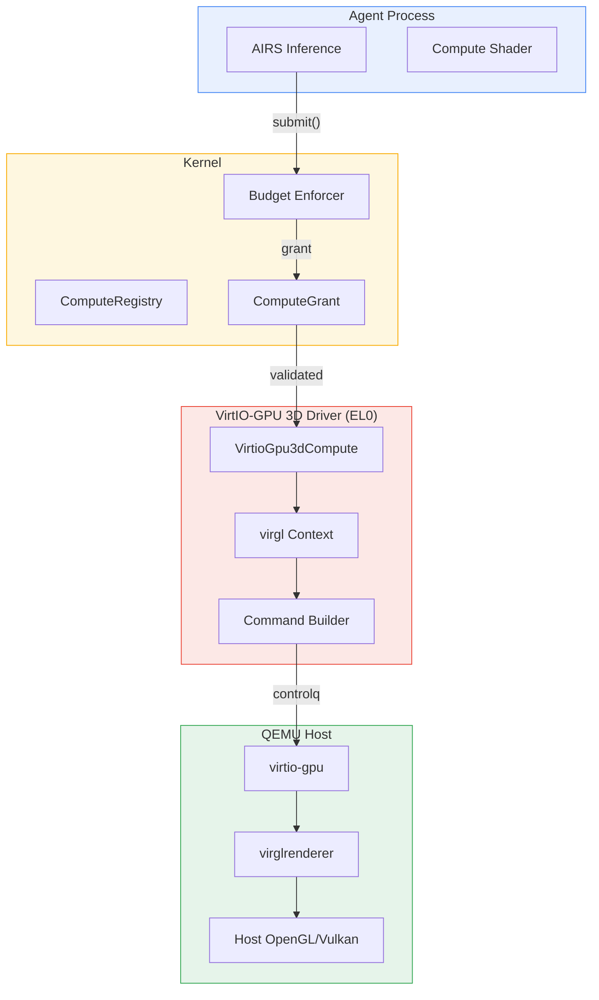

# AIOS Accelerator Drivers

Part of: [accelerators.md](../accelerators.md) — Platform Accelerator Drivers
**Related:** [ane.md](./ane.md) — Apple Neural Engine, [memory.md](./memory.md) — Accelerator memory management, [../gpu/drivers.md](../gpu/drivers.md) — GPU display drivers

-----

## 3. AcceleratorDriver Trait

The `AcceleratorDriver` trait defines platform-specific accelerator operations that sit on top of the kernel's `Driver` and `ComputeDevice` traits. A single driver struct implements all three: `Driver` for device lifecycle, `ComputeDevice` for compute classification and submission, and `AcceleratorDriver` for hardware-specific programming.

### 3.1 Trait Definition

```rust
/// Platform-specific accelerator operations.
///
/// This trait is a refinement of Driver + ComputeDevice. It provides
/// operations that are meaningless for generic compute devices but
/// essential for programming a specific accelerator.
///
/// The trait is implemented alongside Driver and ComputeDevice on the
/// same struct. The kernel sees ComputeDevice; the accelerator subsystem
/// sees AcceleratorDriver; the device model sees Driver.
pub trait AcceleratorDriver: ComputeDevice + Driver {
    /// Initialize the compute engine after the device is probed and
    /// attached. Called once during driver startup.
    ///
    /// For VirtIO-GPU 3D: negotiate VIRGL feature, create initial
    /// rendering context.
    /// For VideoCore VII: initialize QPU scheduler, load firmware.
    /// For Apple ANE: verify ANE firmware version, initialize DMA rings.
    fn init_compute_engine(&mut self) -> Result<(), ComputeError>;

    /// Compile a program for this accelerator.
    ///
    /// For GPUs: compile GLSL/SPIR-V shader source to device ISA.
    /// For NPUs: validate pre-compiled model format (no compilation —
    /// NPU programs are compiled offline).
    /// For CPU fallback: no-op (NEON code is already compiled).
    ///
    /// Returns a handle to the compiled program, valid until
    /// the program is explicitly released.
    fn compile_program(
        &self,
        source: &ComputeProgram,
    ) -> Result<ProgramHandle, ComputeError>;

    /// Release a previously compiled program.
    fn release_program(&self, handle: ProgramHandle) -> Result<(), ComputeError>;

    /// Map a compute buffer into the accelerator's address space.
    ///
    /// On unified memory: configure SMMU mappings and cache attributes.
    /// On discrete memory: initiate DMA transfer to device memory.
    /// On scratchpad: tile data into on-chip buffers.
    fn map_compute_buffer(
        &self,
        buffer: &ComputeBuffer,
        access: BufferAccess,
    ) -> Result<DeviceAddress, ComputeError>;

    /// Unmap a compute buffer from the accelerator.
    fn unmap_compute_buffer(
        &self,
        buffer: &ComputeBuffer,
    ) -> Result<(), ComputeError>;

    /// Set the compute engine's power state.
    ///
    /// Accelerators have power states independent of the overall device.
    /// A GPU may keep its display engine active while powering down its
    /// shader cores. An NPU may enter a low-power standby that preserves
    /// loaded model weights.
    fn set_compute_power_state(
        &self,
        state: ComputePowerState,
    ) -> Result<(), ComputeError>;

    /// Read hardware performance counters.
    ///
    /// Returns accelerator-specific metrics: shader occupancy, memory
    /// bandwidth utilization, compute unit activity, cache hit rates.
    /// The kernel uses these for utilization tracking and thermal
    /// coupling calculations.
    fn performance_counters(&self) -> AcceleratorCounters;

    /// Query the accelerator's current clock frequencies.
    fn clock_frequencies(&self) -> ClockInfo;
}
```

### 3.2 Supporting Types

```rust
/// Input to compile_program(). Variant determines the compilation path.
pub enum ComputeProgram {
    /// GLSL compute shader source (VirtIO-GPU 3D / virgl).
    GlslCompute(Vec<u8>),
    /// SPIR-V binary (future Vulkan compute path).
    SpirV(Vec<u8>),
    /// Pre-compiled model for NPU execution (no compilation needed).
    /// The driver validates format and version compatibility.
    PreCompiled {
        format: ModelFormat,
        data: Vec<u8>,
    },
    /// CPU NEON — program is already compiled Rust/C code.
    /// compile_program() is a no-op; the handle references the
    /// function pointer directly.
    Native {
        entry_point: usize,
    },
}

/// Model formats accepted by NPU drivers.
pub enum ModelFormat {
    /// Apple Neural Engine compiled model (.mlmodelc).
    AneMlModel,
    /// ONNX Runtime optimized graph.
    OnnxOptimized,
    /// GGML quantized model (for CPU/GPU inference via AIRS).
    Ggml,
    /// TensorFlow Lite flatbuffer.
    TfLite,
}

/// Accelerator power states, independent of device power state.
pub enum ComputePowerState {
    /// Full performance — all compute units active, max clock.
    Active,
    /// Reduced performance — some compute units gated, lower clock.
    /// Preserves loaded programs and mapped buffers.
    LowPower,
    /// Minimal power — compute engine clock gated, state preserved
    /// in SRAM. Fast wake (~1ms). Loaded models stay resident.
    Standby,
    /// Off — compute engine fully powered down. All state lost.
    /// Programs and buffers must be reloaded on next use.
    Off,
}

/// Hardware performance counters, accelerator-specific.
pub struct AcceleratorCounters {
    /// Compute unit utilization (0.0 to 1.0).
    pub compute_utilization: f32,
    /// Memory bandwidth utilization (0.0 to 1.0).
    pub memory_bandwidth_utilization: f32,
    /// Total operations completed since last reset.
    pub operations_completed: u64,
    /// Total errors since last reset.
    pub errors: u64,
    /// Current temperature in millidegrees Celsius.
    pub temperature_mc: i32,
    /// Current power draw in milliwatts.
    pub power_draw_mw: u32,
}

/// Clock frequency information.
pub struct ClockInfo {
    /// Core/shader clock in MHz.
    pub core_mhz: u32,
    /// Memory clock in MHz (0 for unified memory).
    pub memory_mhz: u32,
    /// Whether dynamic frequency scaling is active.
    pub dvfs_active: bool,
}
```

### 3.3 Driver Registration

An accelerator driver registers itself with both the device registry (as a `Driver`) and the compute registry (as a `ComputeDevice`). The accelerator-specific operations are accessed through the `AcceleratorDriver` trait when the compute subsystem needs hardware-specific behavior.

```text
Driver Registration Flow:

1. Bus probe discovers device (VirtIO magic, DTB compatible string)
2. Driver::probe() validates device identity → Ok
3. DeviceRegistry registers Driver
4. Driver::attach() initializes device
5. AcceleratorDriver::init_compute_engine() initializes compute path
6. ComputeDevice::capabilities() reports compute class + capabilities
7. ComputeRegistry registers ComputeDevice
8. ComputeSubsystem receives "device available" notification
9. AIRS queries ComputeRegistry → discovers new accelerator
```

-----

## 4. VirtIO-GPU 3D Compute Driver (QEMU)

VirtIO-GPU with the VIRGL feature bit provides a paravirtualized 3D rendering and compute surface on QEMU. This is AIOS's primary accelerator development target through Phase 23. The driver reuses the existing VirtIO-GPU display infrastructure ([gpu/drivers.md](../gpu/drivers.md) §3) and adds compute shader support.

### 4.1 Architecture



The driver runs as a privileged userspace process, like all AIOS device drivers. It communicates with the kernel via IPC for capability validation and budget enforcement, and with the QEMU VirtIO-GPU device via MMIO virtqueues.

### 4.2 VirtIO-GPU 3D Feature Negotiation

The 3D compute path requires feature negotiation beyond basic 2D display:

```rust
/// VirtIO-GPU features required for compute.
pub struct VirtioGpu3dFeatures {
    /// VIRTIO_GPU_F_VIRGL (bit 0) — 3D rendering via virglrenderer.
    /// Required for compute shaders.
    pub virgl: bool,
    /// VIRTIO_GPU_F_RESOURCE_BLOB (bit 3) — zero-copy buffer sharing.
    /// Enables efficient compute buffer exchange without copies.
    pub resource_blob: bool,
    /// VIRTIO_GPU_F_CONTEXT_INIT (bit 4) — context type negotiation.
    /// Enables separate compute vs. rendering contexts.
    pub context_init: bool,
}

impl VirtioGpu3dCompute {
    /// Negotiate 3D compute features during driver initialization.
    /// Falls back gracefully: without VIRGL, no compute; without
    /// RESOURCE_BLOB, buffers require copies; without CONTEXT_INIT,
    /// compute shares the rendering context.
    pub fn negotiate_features(
        &mut self,
    ) -> Result<VirtioGpu3dFeatures, ComputeError> {
        let host_features = self.read_host_features();

        let virgl = host_features & (1 << 0) != 0;
        if !virgl {
            return Err(ComputeError::DeviceUnavailable);
        }

        let resource_blob = host_features & (1 << 3) != 0;
        let context_init = host_features & (1 << 4) != 0;

        // Write back accepted features
        let accepted = (1u32 << 0)
            | if resource_blob { 1 << 3 } else { 0 }
            | if context_init { 1 << 4 } else { 0 };
        self.write_guest_features(accepted);

        Ok(VirtioGpu3dFeatures {
            virgl,
            resource_blob,
            context_init,
        })
    }
}
```

### 4.3 Compute Context Management

Each agent that submits compute work gets a separate virgl rendering context. This provides isolation — one agent's shaders cannot access another agent's resources.

```rust
/// A virgl 3D context for compute operations.
pub struct VirglComputeContext {
    /// Context ID assigned by the host virglrenderer.
    pub ctx_id: u32,
    /// The agent this context belongs to.
    pub agent_id: AgentId,
    /// Compiled shader handles within this context.
    pub shaders: Vec<VirglShaderHandle>,
    /// Resource handles for compute buffers in this context.
    pub resources: Vec<VirglResourceHandle>,
}

impl VirtioGpu3dCompute {
    /// Create a compute context for an agent.
    /// Sends VIRTIO_GPU_CMD_CTX_CREATE via controlq.
    pub fn create_compute_context(
        &mut self,
        agent_id: AgentId,
    ) -> Result<VirglComputeContext, ComputeError> {
        let ctx_id = self.next_context_id();

        // Build and submit CTX_CREATE command
        let cmd = VirtioGpuCtxCreate {
            hdr: VirtioGpuCtrlHdr {
                type_: VIRTIO_GPU_CMD_CTX_CREATE,
                ctx_id,
                ..Default::default()
            },
            nlen: 0,
            context_init: VIRGL_RENDERER_CONTEXT_COMPUTE,
        };
        self.submit_command(&cmd)?;

        Ok(VirglComputeContext {
            ctx_id,
            agent_id,
            shaders: Vec::new(),
            resources: Vec::new(),
        })
    }
}
```

### 4.4 Compute Shader Submission

Compute shaders are submitted through the virgl command stream as TGSI or GLSL programs. The host virglrenderer compiles them to host GPU ISA via the host's OpenGL or Vulkan driver.

```text
Compute Shader Submission Flow:

1. Agent provides GLSL compute shader source
2. Driver wraps in VIRGL_CCMD_CREATE_SHADER command
3. Driver submits via controlq (descriptor chain: cmd → response)
4. Host virglrenderer compiles shader
5. On success: driver receives shader handle
6. Agent provides input buffers + dispatch parameters
7. Driver builds VIRGL_CCMD_LAUNCH_GRID command:
   - Binds shader program
   - Binds input/output SSBOs (shader storage buffer objects)
   - Sets dispatch dimensions (workgroup_x, workgroup_y, workgroup_z)
8. Driver submits via controlq with FENCE flag
9. Host executes compute dispatch on host GPU
10. Host signals fence completion
11. Driver notifies agent: compute complete, output buffers ready
```

### 4.5 ComputeDevice Implementation for VirtIO-GPU 3D

```rust
impl ComputeDevice for VirtioGpu3dCompute {
    fn compute_id(&self) -> ComputeDeviceId {
        ComputeDeviceId {
            device_id: self.device_id,
            generation: self.generation,
            class: ComputeClass::Gpu,
        }
    }

    fn compute_class(&self) -> ComputeClass {
        ComputeClass::Gpu
    }

    fn capabilities(&self) -> &ComputeCapabilityDescriptor {
        // Returns reference to descriptor stored in self.caps
        // (populated at probe time with these values):
        //   peak_ops: 0 (unknown — host GPU dependent)
        //   supported_types: FP32 | FP16 | INT8
        //   quant_formats: empty()
        //   max_concurrent_streams: 4
        //   device_memory_bytes: 0 (unified via host)
        //   unified_memory: true
        //   memory_bandwidth_bytes_per_sec: 0 (unknown)
        //   min_latency_us: 100 (VirtIO overhead)
        //   preemptible: false
        //   tdp_mw: 0, idle_power_mw: 0 (virtual — no power)
        //   name: "VirtIO-GPU 3D (QEMU)"
        //   version: Some("1.0")
        &self.caps
    }

    fn submit(
        &mut self,
        commands: &ComputeCommandBuffer,
        grant: &ComputeGrant,
    ) -> Result<CompletionToken, ComputeError> {
        // Validate grant
        if grant.device_id != self.compute_id() {
            return Err(ComputeError::InvalidGrant);
        }

        // Build virgl command buffer from commands
        let token = self.next_completion_token();
        self.build_and_submit_virgl_commands(
            commands,
            grant,
            token,
        )?;

        Ok(token)
    }

    fn utilization(&self) -> f32 {
        self.counters.compute_utilization
    }

    fn power_draw_mw(&self) -> u32 {
        0 // Virtual device — no physical power
    }
}
```

### 4.6 Limitations and Development Notes

VirtIO-GPU 3D compute on QEMU has inherent limitations that make it suitable for development but not production:

| Aspect | VirtIO-GPU 3D | Real Hardware |
| --- | --- | --- |
| Latency | ~100us+ (virtqueue round-trip) | ~1-10us (direct MMIO) |
| Throughput | Host GPU dependent | Device spec |
| Isolation | Per-context (software) | SMMU (hardware) |
| Power tracking | Not available | Hardware counters |
| Thermal coupling | None (coefficient = 0.0) | Platform-specific |
| Compute types | Host GL/VK subset | Full device ISA |

The VirtIO driver validates the entire software stack (capability grants, budget enforcement, memory management, subsystem sessions) before real hardware introduces platform-specific complexity. Any bug in the compute stack surfaces on QEMU first.

-----

## 5. VideoCore VII Compute Driver (Raspberry Pi 5)

The Raspberry Pi 5's VideoCore VII (V3D 7.1) includes 16 QPU (Quad Processing Unit) cores capable of general-purpose SIMD computation beyond their primary 3D rendering role. The compute driver provides access to these QPUs for AI inference workloads that benefit from parallel floating-point processing.

### 5.1 VideoCore VII Hardware Architecture

```text
VideoCore VII (BCM2712)
├── V3D 7.1 GPU
│   ├── 16 QPU cores (4-way SIMD each)
│   │   ├── FP32 add + multiply per lane per cycle
│   │   ├── FP16 dual-issue (2x throughput)
│   │   ├── INT32 full support
│   │   └── INT8 pack/unpack for quantized inference
│   ├── Tile Buffer (per-tile rendering memory)
│   ├── Texture/Memory Unit (TMU) — also used for compute loads
│   ├── L2 cache (256 KiB, shared across QPUs)
│   └── DMA engine for buffer transfers
├── Unified memory (shares LPDDR4X with CPU)
│   └── CMA (Contiguous Memory Allocator) regions for V3D
├── MMIO registers at platform-specific base address
│   └── Discovered via DTB compatible = "brcm,2712-v3d"
└── IRQ: V3D hub interrupt (job completion, error, OOM)
```

### 5.2 Mailbox Interface

The VideoCore VII is programmed through a mailbox interface — a set of MMIO registers that accept command lists (CL) describing compute or rendering work. For compute, the relevant command list types are:

```rust
/// V3D compute dispatch via CSD (Compute Shader Dispatch).
///
/// The CSD registers accept a compute shader descriptor and
/// dispatch parameters. Unlike rendering, compute bypasses
/// the tile buffer and binning pipeline.
pub struct V3dComputeDispatch {
    /// Physical address of the compute shader descriptor.
    pub shader_descriptor: PhysAddr,
    /// Workgroup dimensions.
    pub num_workgroups: [u32; 3],
    /// Workgroup size (threads per workgroup).
    pub workgroup_size: [u16; 3],
    /// Shared memory size per workgroup in bytes.
    pub shared_memory_size: u32,
    /// Uniforms (shader parameters) physical address.
    pub uniforms_addr: PhysAddr,
}

/// V3D mailbox registers for compute shader dispatch.
/// Base address from DTB + V3D register offsets.
pub struct V3dCsdRegisters {
    /// CSD_CURRENT_CFG: current compute job configuration
    /// (read-only while job is running).
    pub current_cfg: [u32; 7],
    /// CSD_QUEUED_CFG: queue next compute job while current runs.
    pub queued_cfg: [u32; 7],
    /// CSD_STATUS: current job status (idle, running, error).
    pub status: u32,
}
```

### 5.3 QPU Shader Programs

VideoCore QPU programs are compiled offline (not by the driver). The driver loads pre-compiled QPU binary from storage, validates it, and submits it via the CSD interface.

```text
QPU Shader Compilation Pipeline:

1. Shader source (GLSL compute or custom QPU assembly)
2. Compiled offline by vc4-qpu-compiler or Mesa's V3D backend
3. Binary format: QPU instructions + uniform table + relocation info
4. Driver loads binary → validates header and instruction count
5. Driver allocates CMA buffer → copies QPU binary
6. Driver writes buffer physical address to CSD_QUEUED_CFG
7. V3D hardware fetches and executes QPU instructions
8. Completion signaled via V3D hub interrupt
```

QPU instruction format (64-bit per instruction):

```text
Bits     Field              Description
───────  ─────              ───────────
[63:60]  Instruction type   add, mul, branch, load, special
[59:57]  Condition code     Always, if_z, if_nz, if_c, ...
[56:50]  Write address      QPU register file destination
[49:44]  Add operand A      Register or small immediate
[43:38]  Add operand B      Register or small immediate
[37:32]  Mul operand A      Register or small immediate
[31:26]  Mul operand B      Register or small immediate
[25:24]  Signal bits        Thread switch, scoreboard, TMU
[23:0]   Immediate / flags  Instruction-specific
```

### 5.4 ComputeDevice Implementation

```rust
impl ComputeDevice for VideoCore7Compute {
    fn compute_id(&self) -> ComputeDeviceId {
        ComputeDeviceId {
            device_id: self.device_id,
            generation: self.generation,
            class: ComputeClass::Gpu,
        }
    }

    fn compute_class(&self) -> ComputeClass {
        ComputeClass::Gpu
    }

    fn capabilities(&self) -> &ComputeCapabilityDescriptor {
        // Returns reference to descriptor stored in self.caps
        // (populated at probe time with these values):
        //   peak_ops: 64_000_000_000 (16 QPUs x 4 lanes x 2 ops x 500 MHz)
        //   supported_types: FP32 | FP16 | INT8 | NEON
        //   quant_formats: Q8_0 | Q4_0
        //   max_concurrent_streams: 1 (CSD is single-job)
        //   device_memory_bytes: 0 (unified memory)
        //   unified_memory: true
        //   memory_bandwidth_bytes_per_sec: 8_500_000_000 (~8.5 GB/s LPDDR4X)
        //   min_latency_us: 5
        //   preemptible: false (V3D compute jobs run to completion)
        //   tdp_mw: 4000, idle_power_mw: 200
        //   name: "VideoCore VII QPU"
        //   version: Some("7.1")
        &self.caps
    }

    fn submit(
        &mut self,
        commands: &ComputeCommandBuffer,
        grant: &ComputeGrant,
    ) -> Result<CompletionToken, ComputeError> {
        // Validate grant and extract dispatch parameters
        let dispatch = self.parse_compute_dispatch(commands)?;
        self.validate_buffer_references(&dispatch, grant)?;

        // Write to CSD_QUEUED_CFG registers
        let token = self.next_completion_token();
        self.write_csd_queued(&dispatch, token)?;

        Ok(token)
    }

    fn utilization(&self) -> f32 {
        // Read V3D performance counters
        let active = self.read_perf_counter(V3D_PCTR_CSD_ACTIVE);
        let total = self.read_perf_counter(V3D_PCTR_CYCLE_COUNT);
        if total == 0 { 0.0 } else { active as f32 / total as f32 }
    }

    fn power_draw_mw(&self) -> u32 {
        // Estimated from utilization × TDP
        // Real measurement requires SCMI power domain queries
        let util = self.utilization();
        200 + (util * 3800.0) as u32 // idle + (util × dynamic)
    }
}
```

### 5.5 Thermal Integration

VideoCore VII shares the BCM2712 die with the Cortex-A76 CPU cluster. Thermal coupling is significant:

```text
BCM2712 Thermal Zones:

Zone          Sensor            Coupling to CPU    Trip Points
────          ──────            ──────────────     ──────────────
CPU cluster   On-die diode      1.0 (same zone)    65/80/95°C
V3D GPU       V3D temp sensor   0.7                70/85/95°C
LPDDR4X       External sensor   0.3                80/90/100°C

At GPU 100% utilization:
  CPU effective temp += 0.7 × GPU_temp_delta
  → If GPU raises die temp by 10°C, CPU budget loses ~7°C headroom
```

The driver registers a `ComputeThermalZone` ([compute/intelligence.md](../../kernel/compute/intelligence.md) §13) with the V3D temperature sensor and coupling coefficient 0.7 to the CPU zone. The thermal framework uses this to proactively reduce compute quota before hardware throttling engages.

### 5.6 CMA Buffer Management

VideoCore VII uses Contiguous Memory Allocator (CMA) regions for DMA buffers. On the Pi 5 with unified memory, CMA buffers are carved from system RAM at boot:

```rust
/// CMA buffer allocation for V3D compute.
///
/// CMA regions are pre-allocated at boot from the DMA pool
/// (memory/physical.md §2.4). V3D requires physically contiguous
/// buffers because its DMA engine does not support scatter-gather
/// for compute workloads.
pub struct V3dBufferAllocator {
    /// CMA region for V3D use.
    pub cma_region: PhysRegion,
    /// Free list within the CMA region (simple bump or buddy).
    pub allocator: BuddyAllocator,
    /// Total allocated bytes (for budget tracking).
    pub allocated_bytes: usize,
    /// Maximum allocation (from ComputeMemoryAlloc capability).
    pub max_bytes: usize,
}

impl V3dBufferAllocator {
    /// Allocate a CMA buffer for V3D compute.
    /// Returns physical address (for CSD register programming)
    /// and virtual address (for CPU access via direct map).
    pub fn alloc(
        &mut self,
        size: usize,
        alignment: usize,
    ) -> Result<(PhysAddr, VirtAddr), ComputeError> {
        if self.allocated_bytes + size > self.max_bytes {
            return Err(ComputeError::OutOfDeviceMemory);
        }
        let phys = self.allocator.alloc(size, alignment)?;
        let virt = phys_to_direct_map(phys);
        self.allocated_bytes += size;
        Ok((phys, virt))
    }
}
```
