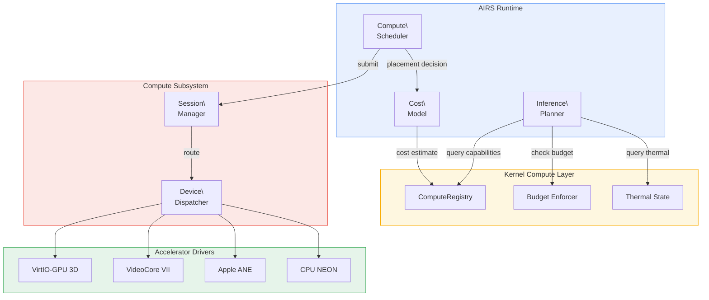

# AIOS AI-Native Accelerator Management

Part of: [accelerators.md](../accelerators.md) — Platform Accelerator Drivers
**Related:** [drivers.md](./drivers.md) — AcceleratorDriver trait, [../../kernel/compute/intelligence.md](../../kernel/compute/intelligence.md) — Kernel compute intelligence, [../../intelligence/airs/inference.md](../../intelligence/airs/inference.md) — AIRS inference engine

-----

## 12. AIRS Integration

The accelerator layer provides the hardware interface that AIRS uses for intelligent compute placement. AIRS queries the compute registry for device capabilities and thermal state, makes placement decisions, and submits work through the compute subsystem. The accelerator drivers execute that work on specific hardware.

### 12.1 AIRS-Accelerator Interface



### 12.2 Placement Decision Flow

AIRS makes compute placement decisions using information from the kernel's ComputeRegistry and the accelerator drivers' performance counters:

```text
Placement Decision for Inference Request:

Input: model M, input tensor T, latency requirement L

Step 1: Query ComputeRegistry
  → Available devices: [GPU(util=30%), NPU(util=0%), CPU(util=45%)]
  → Thermal state: [GPU=Nominal, NPU=Nominal, CPU=Warm]
  → Budget remaining: [GPU=28min, NPU=30min, CPU=unlimited]

Step 2: Filter by Capability
  → Model M uses INT8 quantization
  → GPU: supports INT8 ✓ (via shader)
  → NPU: supports INT8 ✓ (native, 10x faster)
  → CPU: supports INT8 ✓ (via NEON, slowest)

Step 3: Estimate Cost
  → NPU: 15ms latency, 0.3 mWh energy, 2W peak power
  → GPU: 120ms latency, 2.4 mWh energy, 4W peak power
  → CPU: 800ms latency, 8.0 mWh energy, 5W peak power

Step 4: Apply Constraints
  → Latency requirement: L = 100ms
  → NPU: 15ms < 100ms ✓
  → GPU: 120ms > 100ms ✗ (exceeds latency budget)
  → CPU: 800ms > 100ms ✗

Step 5: Select
  → Route to NPU
  → If NPU unavailable (thermal/budget): fall back to GPU + accept latency miss
  → If GPU unavailable: fall back to CPU + report degraded performance
```

### 12.3 Cost Model Calibration

AIRS maintains per-device cost models that are calibrated from actual execution measurements reported by accelerator drivers:

```rust
/// Per-device cost model maintained by AIRS.
///
/// Initial values come from ComputeCapabilityDescriptor (static).
/// Calibrated at runtime from actual measurements reported by
/// the accelerator driver's performance_counters().
pub struct DeviceCostModel {
    /// Device this model describes.
    pub device_id: ComputeDeviceId,

    /// Latency model: base_us + (ops / throughput_ops_per_us).
    pub base_latency_us: f32,
    pub throughput_ops_per_us: f32,

    /// Power model: idle_mw + (utilization * dynamic_mw).
    pub idle_power_mw: f32,
    pub dynamic_power_mw: f32,

    /// Memory bandwidth model: available_bandwidth * (1 - utilization).
    pub peak_bandwidth_gbps: f32,

    /// Confidence score (0.0 = uncalibrated, 1.0 = well-calibrated).
    /// Increases with each measurement; decays over time.
    pub confidence: f32,

    /// Number of calibration measurements.
    pub measurement_count: u32,
}

impl DeviceCostModel {
    /// Estimate latency for a workload.
    pub fn estimate_latency(&self, ops: u64) -> Duration {
        let us = self.base_latency_us
            + (ops as f32 / self.throughput_ops_per_us);
        Duration::from_micros(us as u64)
    }

    /// Estimate energy consumption for a workload.
    pub fn estimate_energy(&self, duration: Duration) -> f32 {
        let hours = duration.as_secs_f32() / 3600.0;
        let avg_power = self.idle_power_mw
            + 0.5 * self.dynamic_power_mw; // Assume 50% util
        avg_power * hours // milliwatt-hours
    }

    /// Update model from actual measurement.
    pub fn calibrate(
        &mut self,
        actual_latency: Duration,
        actual_ops: u64,
        actual_power: u32,
    ) {
        let alpha = 0.1; // EWMA smoothing factor
        let actual_throughput = actual_ops as f32
            / actual_latency.as_micros() as f32;

        self.throughput_ops_per_us = self.throughput_ops_per_us
            * (1.0 - alpha) + actual_throughput * alpha;

        self.confidence = (self.confidence + 0.01).min(1.0);
        self.measurement_count += 1;
    }
}
```

### 12.4 Model-Device Routing Table

AIRS builds a routing table that maps quantization formats to optimal devices:

```text
Model-Device Routing (Pi 5 with VideoCore VII):

Quantization    Primary     Fallback 1    Fallback 2    Rationale
────────────    ───────     ──────────    ──────────    ─────────
FP32            CPU NEON    GPU (slow)    —             No native FP32 accel
FP16            GPU         CPU NEON      —             V3D FP16 dual-issue
INT8            GPU         CPU NEON      —             QPU INT8 pack/unpack
INT4            CPU NEON    GPU           —             CPU bitwise ops faster
GGML Q4_K_M     CPU NEON    —             —             Custom quant format

Model-Device Routing (Apple Silicon with ANE):

Quantization    Primary     Fallback 1    Fallback 2    Rationale
────────────    ───────     ──────────    ──────────    ─────────
FP32            GPU         CPU NEON      —             ANE doesn't do FP32
FP16            ANE         GPU           CPU NEON      ANE native, 10x faster
INT8            ANE         GPU           CPU NEON      ANE native, highest TOPS
INT4            ANE (M3+)   GPU           CPU NEON      ANE M3+ has INT4 support
GGML Q4_K_M     CPU NEON    GPU           —             Custom quant; no ANE path
```

### 12.5 Workload Partitioning

For large models that don't fit entirely on one accelerator, AIRS partitions the model graph across multiple devices. The accelerator subsystem coordinates execution:

```text
Cross-Device Model Partitioning:

Model: 7B parameter LLM on Apple Silicon (M1, 16GB unified RAM)

Partition Strategy:
  Embedding layers:    → ANE (INT8, high throughput, small memory)
  Attention layers:    → ANE (fused ScaledDotProduct on M3+)
                       → GPU (M1/M2 — attention requires custom ops)
  Feed-forward layers: → ANE (MatMul + GELU, native pipeline)
  Output head:         → CPU NEON (small, low latency, no device switch)

Inter-Device Transfer:
  ANE output → CPU buffer (zero-copy, hardware coherent)
  CPU buffer → GPU input (zero-copy, same physical memory)

  Transfer overhead: ~0 on Apple Silicon (cache-coherent unified memory)
  Transfer overhead: ~10us on Pi 5 (cache flush/invalidate)

Decision Factors:
  1. Operation support (ANE can't do custom ops → GPU fallback)
  2. Memory fit (partition must fit in device working memory)
  3. Transfer cost (minimize cross-device transitions)
  4. Thermal budget (spread load across devices to avoid throttling)
```

-----

## 15. Future Directions

### 15.1 Disaggregated Accelerators

Future AIOS versions may support network-attached accelerators accessible over Thunderbolt or USB4:

- **eGPU compute**: External GPU connected via Thunderbolt. The VirtIO-GPU 3D driver model extends naturally — the transport changes from MMIO to PCIe/Thunderbolt, but the command protocol is similar.
- **AI accelerator dongles**: USB-attached NPU devices (Intel Neural Compute Stick, Google Coral USB). These would implement `AcceleratorDriver` with USB transport instead of MMIO.
- **Remote inference**: Network-attached inference servers accessed via AIOS Peer Protocol. The compute subsystem would add a `RemoteAcceleratorDriver` that proxies `submit()` over the network.

The ComputeTopology ([compute/registry.md](../../kernel/compute/registry.md) §6) already supports asymmetric latency between devices, making disaggregated accelerators a topology extension rather than an architectural change.

### 15.2 Dynamic Shader Compilation

The current design assumes compute shaders (GPU) are compiled offline or by the host (VirtIO). Future work could add on-device shader compilation:

- **Mesa V3D compiler integration**: Compile GLSL/SPIR-V to V3D QPU ISA on-device, eliminating the need for pre-compiled binaries on the Pi 5.
- **JIT compilation**: Just-in-time compilation of ONNX graphs to accelerator-specific code, with caching of compiled binaries keyed by graph hash.
- **Compilation as a compute workload**: The compilation itself runs on CPU and is subject to the same budget and thermal constraints as any other compute work.

### 15.3 Hardware-Accelerated Cryptography

Compute devices with dedicated crypto engines (Apple Secure Enclave, ARM CryptoCell) could be exposed through the `AcceleratorDriver` trait:

- `ComputeClass::Asic` for dedicated crypto accelerators (fixed-function ASIC class)
- `compile_program()` validates crypto operation descriptors
- `submit()` executes encrypt/decrypt/hash operations
- Integration with the storage encryption layer ([storage/spaces/encryption.md](../../storage/spaces/encryption.md) §6)

### 15.4 Multi-Tenant Accelerator Sharing

Enterprise deployments ([multi-device.md](../multi-device.md)) may require fine-grained accelerator sharing across organizational boundaries:

- **Hardware partitioning**: Some accelerators support hardware-level partitioning (GPU MIG-like features). The driver would expose each partition as a separate `ComputeDevice`.
- **Time-multiplexed sharing**: The compute subsystem's session manager already supports priority-based preemption. Enterprise policies could define per-tenant time quotas.
- **Encrypted compute**: NPU inference on encrypted model weights, where the decryption key is held in a hardware secure element. The `ComputeGrant` would include an encryption key handle.

### 15.5 Learned Driver Tuning

AIRS could optimize driver parameters based on observed workload patterns:

- **DMA transfer scheduling**: Learn optimal tile sizes for ANE scratchpad transfers based on model architecture.
- **Power state transitions**: Predict accelerator usage patterns and pre-warm devices before expected activity.
- **Buffer pool sizing**: Adjust pool configurations based on actual allocation patterns (grow pools for frequently used sizes, shrink unused ones).
- **Thermal proactive management**: Learn workload-thermal relationships to proactively adjust compute quotas before hardware throttling.

These optimizations would use the same kernel-internal ML techniques (EWMA, piecewise-linear models) described in [compute/intelligence.md](../../kernel/compute/intelligence.md) §14, applied at the driver level rather than the kernel level.
