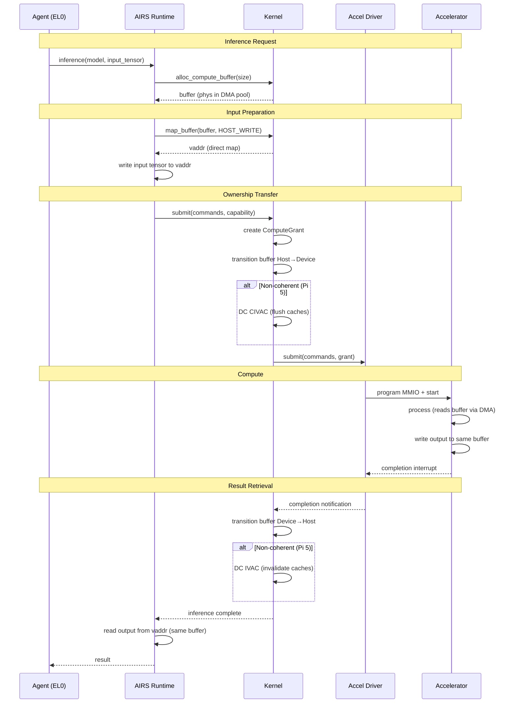

# AIOS Accelerator Memory Management

Part of: [accelerators.md](../accelerators.md) — Platform Accelerator Drivers
**Related:** [drivers.md](./drivers.md) — AcceleratorDriver trait, [ane.md](./ane.md) — ANE scratchpad model, [../../kernel/compute/memory.md](../../kernel/compute/memory.md) — Kernel compute memory model

-----

## 8. Platform-Level Accelerator Memory

The kernel defines the memory *model* ([compute/memory.md](../../kernel/compute/memory.md) §9) — unified, discrete, or scratchpad — and the buffer *protocol* (ownership transitions, SMMU mappings). The platform accelerator layer implements the actual memory operations: cache maintenance sequences, DMA transfers, tiling strategies, and buffer pool management specific to each hardware platform.

### 8.1 Per-Platform Memory Configuration

```text
Platform          Memory Model       Cache Coherent    DMA Engine       Scratchpad
────────          ────────────       ──────────────    ──────────       ──────────
QEMU virt         Unified            N/A (virtual)     VirtIO           None
Pi 5 (V3D)        Unified            No (manual ops)   V3D DMA          None
Apple Silicon     Unified            Yes (ARM ACE)     ANE DMA (4ch)    32-64 MB
Future discrete   Discrete           No                PCIe DMA         Varies
```

### 8.2 Cache Maintenance Operations

On non-coherent unified memory platforms (Raspberry Pi 5), the driver must perform explicit cache maintenance when transferring buffer ownership between CPU and accelerator:

```rust
/// ARM cache maintenance operations for compute buffers.
///
/// These operations are platform-specific implementations of the
/// kernel's buffer ownership transitions (compute/memory.md §10.3).
pub struct CacheOps;

impl CacheOps {
    /// Flush CPU caches for a buffer region before device access.
    /// Ensures the device sees the latest CPU-written data.
    ///
    /// Host → Device transition: DC CIVAC (Clean and Invalidate
    /// by Virtual Address to Point of Coherency).
    pub fn flush_for_device(vaddr: VirtAddr, size: usize) {
        let cache_line_size = 64; // ARM Cortex-A76 cache line
        let start = vaddr & !(cache_line_size - 1);
        let end = (vaddr + size + cache_line_size - 1)
            & !(cache_line_size - 1);

        for addr in (start..end).step_by(cache_line_size) {
            // SAFETY: DC CIVAC operates on valid virtual addresses.
            // The address range is within the mapped compute buffer.
            unsafe {
                core::arch::asm!(
                    "dc civac, {addr}",
                    addr = in(reg) addr,
                    options(nostack, preserves_flags),
                );
            }
        }
        // Ensure all cache ops complete before device DMA starts
        // SAFETY: DSB SY is a barrier instruction with no side effects.
        unsafe {
            core::arch::asm!("dsb sy", options(nostack, preserves_flags));
        }
    }

    /// Invalidate CPU caches for a buffer region after device access.
    /// Ensures the CPU sees the latest device-written data.
    ///
    /// Device → Host transition: DC IVAC (Invalidate by Virtual
    /// Address to Point of Coherency).
    pub fn invalidate_for_host(vaddr: VirtAddr, size: usize) {
        let cache_line_size = 64;
        let start = vaddr & !(cache_line_size - 1);
        let end = (vaddr + size + cache_line_size - 1)
            & !(cache_line_size - 1);

        for addr in (start..end).step_by(cache_line_size) {
            // SAFETY: DC IVAC operates on valid virtual addresses.
            unsafe {
                core::arch::asm!(
                    "dc ivac, {addr}",
                    addr = in(reg) addr,
                    options(nostack, preserves_flags),
                );
            }
        }
        // SAFETY: DSB SY ensures invalidation completes before CPU reads.
        unsafe {
            core::arch::asm!("dsb sy", options(nostack, preserves_flags));
        }
    }

    /// No-op for hardware-coherent platforms (Apple Silicon).
    /// ARM ACE protocol handles cache snooping automatically.
    pub fn flush_coherent(_vaddr: VirtAddr, _size: usize) {
        // Hardware coherency — nothing to do
    }
}
```

### 8.3 Buffer Pool Architecture

Each accelerator driver maintains a buffer pool tuned to its workload patterns. The pool pre-allocates buffers to avoid allocation overhead during inference hot paths:

```rust
/// Accelerator buffer pool with pre-allocated buffers.
///
/// Pool sizes are configured per-platform based on typical
/// workload memory requirements. The pool is backed by the
/// DMA page pool (memory/physical.md §2.4).
pub struct AcceleratorBufferPool {
    /// Small buffers (< 64 KiB) — activation temporaries.
    pub small: BufferSlab,
    /// Medium buffers (64 KiB - 4 MiB) — layer activations.
    pub medium: BufferSlab,
    /// Large buffers (4 MiB - 64 MiB) — KV caches.
    pub large: BufferSlab,
    /// Huge buffers (> 64 MiB) — model weights. Allocated on demand,
    /// not pooled (too large and infrequent to pre-allocate).
    pub huge_alloc_count: u32,

    /// Total bytes allocated across all slabs.
    pub total_allocated: usize,
    /// Maximum total allocation (from system budget).
    pub max_total: usize,
}

pub struct BufferSlab {
    /// Free list of pre-allocated buffers.
    pub free_list: Vec<ComputeBuffer>,
    /// Number of buffers currently in use.
    pub in_use: u32,
    /// Buffer size for this slab (all buffers are same size).
    pub buffer_size: usize,
    /// Maximum number of buffers in this slab.
    pub max_count: u32,
}

/// Default pool configurations by platform.
pub const QEMU_POOL_CONFIG: AcceleratorPoolConfig = AcceleratorPoolConfig {
    small: (4096, 64),       // 64 × 4 KiB = 256 KiB
    medium: (262144, 16),    // 16 × 256 KiB = 4 MiB
    large: (4194304, 4),     // 4 × 4 MiB = 16 MiB
    max_total: 64 * 1024 * 1024, // 64 MiB total
};

pub const PI5_POOL_CONFIG: AcceleratorPoolConfig = AcceleratorPoolConfig {
    small: (65536, 128),     // 128 × 64 KiB = 8 MiB
    medium: (1048576, 32),   // 32 × 1 MiB = 32 MiB
    large: (16777216, 8),    // 8 × 16 MiB = 128 MiB
    max_total: 256 * 1024 * 1024, // 256 MiB total
};

pub const APPLE_POOL_CONFIG: AcceleratorPoolConfig = AcceleratorPoolConfig {
    small: (65536, 256),     // 256 × 64 KiB = 16 MiB
    medium: (1048576, 64),   // 64 × 1 MiB = 64 MiB
    large: (67108864, 16),   // 16 × 64 MiB = 1 GiB
    max_total: 2048 * 1024 * 1024, // 2 GiB total
};
```

### 8.4 SMMU Configuration

On platforms with ARM SMMU (System Memory Management Unit), each accelerator gets a unique stream ID. The SMMU enforces that device DMA is restricted to buffers authorized in the current `ComputeGrant`:

```text
SMMU Configuration per Accelerator:

Stream ID Assignment:
  V3D GPU:      Stream ID 0x10
  ANE:          Stream ID 0x20
  Future DSP:   Stream ID 0x30

Per-Agent Context:
  Each agent's ComputeGrant includes an SMMU context ID.
  The SMMU context maps only the physical pages of buffers
  authorized in that grant.

  Agent A grant → SMMU context 1 → pages {0x1000, 0x2000, 0x3000}
  Agent B grant → SMMU context 2 → pages {0x4000, 0x5000}

  If Agent A's driver code tries to DMA to page 0x4000,
  the SMMU faults → driver process receives SIGBUS.

Page Table Updates:
  1. ComputeGrant created → SMMU page table updated (add pages)
  2. ComputeGrant expires → SMMU page table updated (remove pages)
  3. Buffer freed → SMMU page table updated (remove pages)
  4. Agent exits → all SMMU contexts for that agent destroyed
```

-----

## 9. Zero-Copy CPU-Accelerator Data Paths

The performance-critical data path for inference is moving tensors between CPU and accelerator with minimal overhead. On ARM unified memory SoCs (the primary AIOS targets), true zero-copy is achievable — the same physical memory is accessible to both CPU and device.

### 9.1 Inference Data Flow (Zero-Copy)



**Key insight:** On this path, the input tensor and output tensor can share the same physical buffer. The agent writes input to the buffer, the accelerator reads input and overwrites with output (or uses a separate output region within the same buffer). No data copies occur — only cache maintenance operations on non-coherent platforms, and nothing at all on hardware-coherent platforms (Apple Silicon).

### 9.2 Weight Buffer Sharing

Model weights are the largest memory consumer and the best candidate for sharing. Multiple agents running the same model (e.g., the system's primary LLM) share a single read-only weight buffer:

```text
Weight Buffer Sharing:

Agent A requests inference with model M
  → Driver loads model M weights into buffer W (2 GB)
  → W mapped read-only into Agent A's SMMU context

Agent B requests inference with model M
  → Driver finds M already loaded (content hash match)
  → W mapped read-only into Agent B's SMMU context
  → NO additional memory allocation

Memory savings: 2 GB per additional agent using the same model

Eviction policy (LRU):
  When memory pressure forces eviction:
  1. Find least-recently-used model with ref_count == 0
  2. Unmap from all SMMU contexts
  3. Free weight buffer pages back to DMA pool
  4. Next inference request for that model will re-load
```

### 9.3 KV Cache Management

KV (Key-Value) caches grow monotonically during a conversation and are per-session private data. The accelerator driver coordinates with AIRS for KV cache lifecycle:

```rust
/// KV cache allocation strategy for accelerator drivers.
///
/// KV caches grow with each token in the conversation.
/// The driver pre-allocates a maximum-size buffer and tracks
/// the actual used portion. When the cache exceeds the
/// pre-allocated size, the driver extends the buffer.
pub struct KvCacheAllocation {
    /// The compute buffer backing this KV cache.
    pub buffer: ComputeBuffer,
    /// Current used bytes (grows with each token).
    pub used_bytes: usize,
    /// Pre-allocated capacity in bytes.
    pub capacity: usize,
    /// Maximum allowed size (from budget).
    pub max_bytes: usize,
    /// Number of tokens stored.
    pub token_count: u32,
    /// Per-token size in bytes (determined by model architecture).
    pub bytes_per_token: usize,
}

impl KvCacheAllocation {
    /// Check if the cache can accommodate more tokens.
    pub fn can_grow(&self, additional_tokens: u32) -> bool {
        let needed = self.used_bytes
            + (additional_tokens as usize * self.bytes_per_token);
        needed <= self.max_bytes
    }

    /// Extend the cache buffer if needed.
    /// Returns Err if the budget doesn't allow more memory.
    pub fn extend_if_needed(
        &mut self,
        additional_tokens: u32,
        pool: &mut AcceleratorBufferPool,
    ) -> Result<(), ComputeError> {
        let needed = self.used_bytes
            + (additional_tokens as usize * self.bytes_per_token);

        if needed > self.capacity {
            // Double capacity up to max
            let new_capacity = (self.capacity * 2).min(self.max_bytes);
            if new_capacity < needed {
                return Err(ComputeError::OutOfDeviceMemory);
            }
            pool.realloc(&mut self.buffer, new_capacity)?;
            self.capacity = new_capacity;
        }

        Ok(())
    }
}
```

### 9.4 Buffer Lifetime and Cleanup

Compute buffers have strict lifetime rules to prevent memory leaks and use-after-free:

```text
Buffer Lifetime Rules:

1. ALLOCATION: Buffer allocated from DMA pool with owner = agent_id
2. MAPPING: SMMU context created, buffer pages added
3. USE: Buffer referenced in ComputeGrant.authorized_buffers
4. COMPLETION: Compute completes, buffer transitions Device→Host
5. REUSE: Buffer can be reused for next inference (skip allocation)
6. FREE: Explicit free by agent, or automatic on agent exit

Automatic Cleanup on Agent Exit:
  When an agent process exits (clean or crash):
  1. Kernel walks all compute devices
  2. For each device: find buffers owned by agent_id
  3. Wait for any pending compute on those buffers
  4. Unmap from SMMU contexts
  5. Free buffer pages back to DMA pool
  6. Remove from buffer pool free lists

Automatic Cleanup on Driver Crash:
  When an accelerator driver process crashes:
  1. Kernel detects driver exit
  2. All pending ComputeGrants for that device expire
  3. All buffers transition to Host ownership
  4. SMMU contexts are destroyed
  5. Device is marked Degraded in ComputeRegistry
  6. Driver restarts → re-initializes → buffers re-mapped
```
