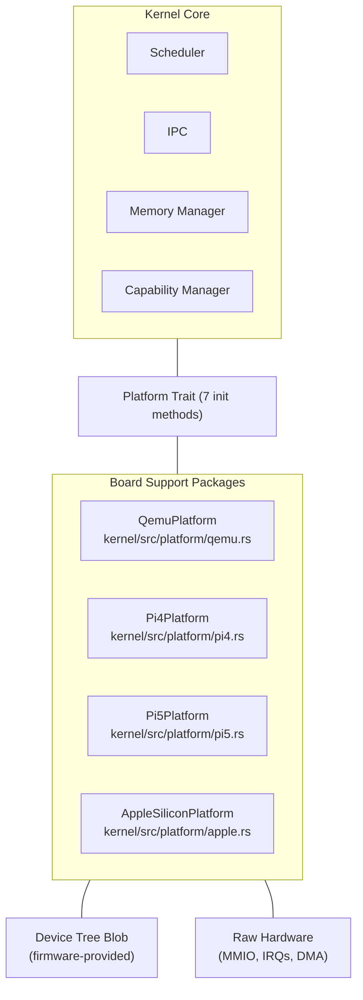

# AIOS Board Support Package (BSP) Architecture

**Parent document:** [architecture.md](../../project/architecture.md) — Section 2.1 Full Stack Overview (Hardware Abstraction Layer)
**Related:** [hal.md](../../kernel/hal.md) — Platform trait & device abstractions, [device-model.md](../../kernel/device-model.md) — Device model & driver framework, [boot/firmware.md](../../kernel/boot/firmware.md) — UEFI firmware handoff, [thermal/platform-drivers.md](../thermal/platform-drivers.md) — Per-platform thermal drivers, [subsystem-framework.md](../subsystem-framework.md) — Userspace device management

---

## §1 Core Insight

A Board Support Package is everything the kernel needs to know about a specific piece of hardware. In AIOS, a BSP is **one Rust file** — a `struct` that implements the `Platform` trait (hal.md §3). That struct, combined with the device tree blob the firmware passes at boot, is sufficient to initialize all hardware on the board.

The BSP model is built on three principles:

1. **DTB-first discovery.** Hardware addresses, interrupt numbers, and peripheral presence come from the device tree — never from `#[cfg]` or compile-time constants. The same kernel binary boots on QEMU, Pi 4, Pi 5, and Apple Silicon. The DTB tells it what hardware exists.

2. **Trait-bounded abstraction.** The `Platform` trait has seven `init_*` methods (hal.md §3), one per hardware class. Each returns an abstract device handle. The kernel programs against `InterruptController`, `Timer`, `Uart`, `GpuDevice`, `NetworkDevice`, `StorageDevice`, and `RngDevice` — never against GICv3 or PL011 directly.

3. **Extension traits for optional hardware.** Not every board has WiFi, Bluetooth, USB, or a camera. Extension traits (hal.md §12) let platforms opt into capabilities without polluting the core `Platform` trait with methods that return `None` on half the boards.

---

## Document Map

| Document | Sections | Content |
|---|---|---|
| **This file** | §1, §14-15 | Core insight, implementation order, design principles |
| [model.md](./bsp/model.md) | §2-3 | BSP model, Platform struct anatomy, porting checklist, extension trait discovery |
| [platforms.md](./bsp/platforms.md) | §4-7 | Per-platform hardware: QEMU, Pi 4, Pi 5, Apple Silicon |
| [firmware.md](./bsp/firmware.md) | §8 | Firmware handoff: UEFI, U-Boot, m1n1, comparison matrix |
| [drivers.md](./bsp/drivers.md) | §9-10 | Driver mapping matrix, device tree bindings |
| [testing.md](./bsp/testing.md) | §11-12 | Testing strategy, CI, real hardware validation |
| [intelligence.md](./bsp/intelligence.md) | §13 | AI-native BSP intelligence, future ISA directions |

---

## §14 Implementation Order

BSP support is implemented incrementally across phases. Each platform goes through three stages: minimal boot (UART + interrupts + timer), storage and display (GPU + block device), and full peripheral support (network, USB, audio, thermal).

| Phase | Milestone | BSP Work |
|---|---|---|
| 0–4 | QEMU virt | `QemuPlatform` — reference implementation (complete) |
| 27 | Real hardware | `Pi4Platform` — minimal boot (GICv2, PL011, SDHCI) |
| 27 | Real hardware | `Pi5Platform` — minimal boot (GICv3, PL011, RP1) |
| 27 | Real hardware | `AppleSiliconPlatform` — minimal boot (AIC, S5L, ANS) |
| 27 | Real hardware | All platforms — full peripheral support |

**Porting order rationale:** Pi 5 before Pi 4 because Pi 5 uses GICv3 (same as QEMU, less new code). Pi 4 requires a GICv2 driver. Apple Silicon is last because it requires the most new code (AIC, S5L UART, DART IOMMU, m1n1 boot chain).

---

## §15 Design Principles

1. **One binary, all boards.** The kernel is compiled once for `aarch64-unknown-none`. Platform selection happens at runtime via DTB compatible string matching (`detect_platform()` in `kernel/src/platform/mod.rs`). No `#[cfg(board = "...")]` conditionals.

2. **DTB is the source of truth.** Every MMIO base address, IRQ number, and peripheral count comes from the device tree. The only hardcoded addresses are QEMU fallback defaults used when no DTB is available (`DeviceTree::qemu_defaults()`).

3. **Zero-sized platform structs where possible.** `QemuPlatform`, `Pi4Platform`, and `Pi5Platform` are unit structs — no runtime state, no heap allocation at detection time. `AppleSiliconPlatform` carries an `AppleSoc` enum variant for SoC-specific driver paths.

4. **Static platform reference.** `detect_platform()` returns `&'static dyn Platform` — the platform struct lives in a `static` variable, not on the heap. This works before the heap is initialized.

5. **Initialization order is platform-independent.** All platforms follow the same boot sequence (hal.md §3.2): UART → interrupts → timer → RNG → storage → GPU → network. Only the hardware behind each step differs.

6. **Extension traits for optional hardware.** WiFi, Bluetooth, USB, camera, and audio are extension traits (hal.md §12) that platforms opt into. The kernel discovers capabilities via `platform.as_any()` downcasting.

7. **Quirk tables, not special-case code.** Hardware errata and workarounds are registered as data in a per-platform quirk table (model.md §2.4), not as `if platform == Pi4 { ... }` checks scattered through the kernel.

8. **Test on QEMU first.** Every driver has a VirtIO counterpart on QEMU. Real hardware drivers are validated against the same test suite that runs on QEMU CI.

---

## Cross-Reference Index

| Section | File | Topic |
|---|---|---|
| §1 | This file | Core insight |
| §2 | [model.md](./bsp/model.md) | BSP model |
| §2.1 | [model.md](./bsp/model.md) | Platform struct anatomy |
| §2.2 | [model.md](./bsp/model.md) | Board registration |
| §2.3 | [model.md](./bsp/model.md) | Device tree contract |
| §2.4 | [model.md](./bsp/model.md) | Quirk system |
| §3 | [model.md](./bsp/model.md) | Porting checklist |
| §3.1–3.5 | [model.md](./bsp/model.md) | Porting steps and validation |
| §3.6 | [model.md](./bsp/model.md) | Extension trait discovery |
| §3.6.1–3.6.2 | [model.md](./bsp/model.md) | Discovery pattern, extension trait list |
| §4 | [platforms.md](./bsp/platforms.md) | QEMU virt |
| §5 | [platforms.md](./bsp/platforms.md) | Raspberry Pi 4 (BCM2711) |
| §6 | [platforms.md](./bsp/platforms.md) | Raspberry Pi 5 (BCM2712) |
| §7 | [platforms.md](./bsp/platforms.md) | Apple Silicon |
| §8 | [firmware.md](./bsp/firmware.md) | Firmware handoff |
| §8.1–8.6 | [firmware.md](./bsp/firmware.md) | UEFI, U-Boot, m1n1, comparison |
| §9 | [drivers.md](./bsp/drivers.md) | Driver mapping matrix |
| §9.1–9.7 | [drivers.md](./bsp/drivers.md) | Per-device-class driver mapping |
| §10 | [drivers.md](./bsp/drivers.md) | Device tree bindings |
| §10.1–10.3 | [drivers.md](./bsp/drivers.md) | Mandatory nodes, platform nodes, validation |
| §11 | [testing.md](./bsp/testing.md) | Testing strategy |
| §12 | [testing.md](./bsp/testing.md) | Validation checklist |
| §13 | [intelligence.md](./bsp/intelligence.md) | AI-native BSP intelligence |
| §13.4 | [intelligence.md](./bsp/intelligence.md) | Future ISA directions |
| §14 | This file | Implementation order |
| §15 | This file | Design principles |
