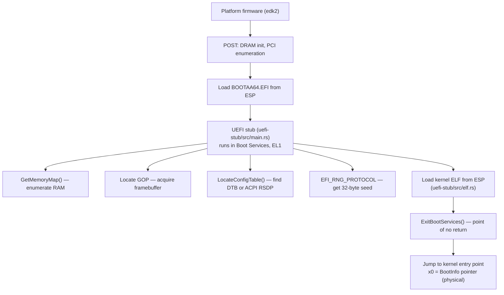
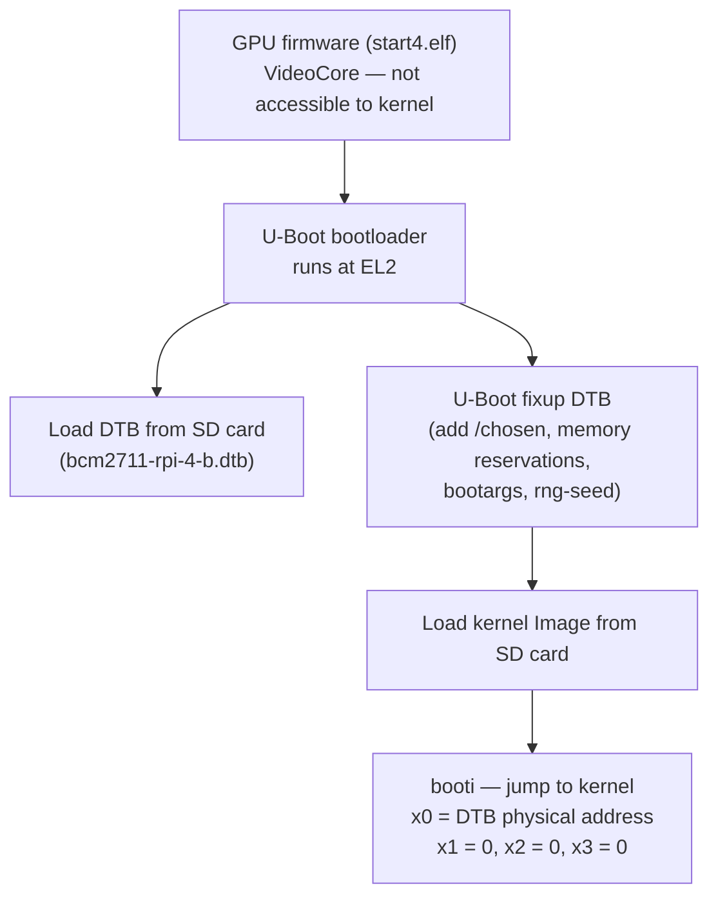
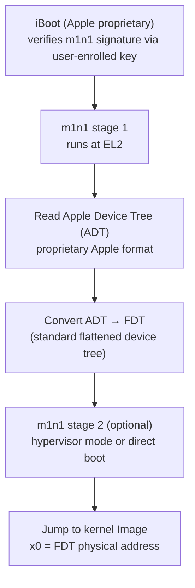
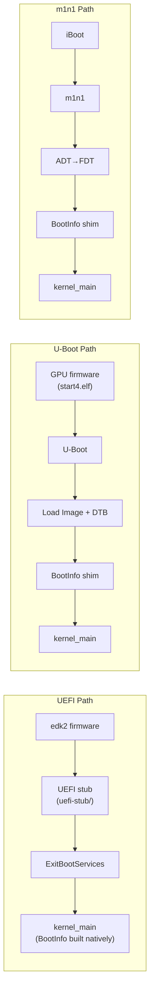

# AIOS Firmware Handoff

Part of: [bsp.md](../bsp.md) — Board Support Package Architecture
**Related:** [model.md](./model.md) — BSP model & porting guide, [platforms.md](./platforms.md) — Per-platform hardware, [../../kernel/boot/firmware.md](../../kernel/boot/firmware.md) — UEFI firmware handoff details

---

## §8 Firmware Handoff

Each platform uses a different firmware stack to load the AIOS kernel. Before the kernel executes a single instruction, the firmware has initialized DRAM, set up memory mappings, and passed control to either the UEFI stub or directly to the kernel entry point. The kernel has no control over this process — it receives control at a well-defined state that depends entirely on the firmware.

This section documents what each firmware provides: the exception level at entry, the MMU and cache state, how hardware information is delivered, and what the AIOS kernel expects to find in registers and memory. The goal is that a porting engineer can read this section and know exactly what state the kernel will be in when it starts executing on a new platform.

The kernel's primary interface to firmware-provided data is the `BootInfo` struct (§8.5). All supported boot paths either build this struct natively (UEFI path via `uefi-stub/`) or require a shim that constructs it from DTB data (U-Boot and m1n1 paths). Once the kernel has a valid `BootInfo`, the boot path divergence ends — all platforms run the same `kernel_main`.

---

### §8.1 UEFI (edk2)

**Used by:** QEMU virt (primary development target), Raspberry Pi 4/5 (optional, via the rpi4-uefi firmware package)

**Firmware path on QEMU (macOS):** `/opt/homebrew/share/qemu/edk2-aarch64-code.fd`

UEFI is the primary boot path for AIOS. The UEFI stub (`uefi-stub/src/main.rs`) runs as a standard UEFI application (PE/COFF format, `BOOTAA64.EFI`) loaded from the ESP. It runs inside UEFI Boot Services at EL1, with full access to UEFI protocols, and performs all hardware enumeration before calling `ExitBootServices`.

**Boot flow:**



**State at kernel entry:**

| Property | Value |
|---|---|
| Exception Level | EL1 (QEMU delivers directly; real hardware may enter at EL2 if UEFI ran at EL2) |
| MMU | ON — edk2 leaves MMU enabled after ExitBootServices |
| SCTLR_EL1 | `0x30d0198d` |
| TCR_EL1 | T0SZ=20 (44-bit VA for TTBR0), T1SZ not yet set |
| MAIR_EL1 | `0xffbb4400` — Attr0=Device-nGnRnE, Attr1=NC Normal, Attr2=WT Normal, Attr3=WB Normal |
| Caches | I-cache and D-cache ON |
| Interrupts | Masked (DAIF.I=1) |
| x0 | Physical address of `BootInfo` struct |

The MAIR and TCR values set by edk2 are preserved by the kernel's Phase 1 MMU strategy. Changing MAIR or TCR while the MMU is on is CONSTRAINED UNPREDICTABLE per the ARM Architecture Reference Manual — the kernel must reuse the edk2-configured indices when building new page tables. See `kernel/src/arch/aarch64/mmu.rs` for the TTBR0 swap implementation and `docs/kernel/boot/firmware.md §2` for the detailed rationale.

**UEFI on Raspberry Pi:** The [rpi4-uefi](https://github.com/pftf/RPi4) and rpi5-uefi projects provide a UEFI firmware layer that runs on top of the GPU firmware. When installed, the Pi boots identically to QEMU — the same `BOOTAA64.EFI` stub works without modification, and `BootInfo` is populated via the same UEFI protocols.

---

### §8.2 U-Boot

**Used by:** Raspberry Pi 4/5 (default boot path when UEFI firmware is not installed)

U-Boot is a widely-deployed open-source bootloader common on embedded ARM platforms. On the Raspberry Pi, the GPU firmware (`start4.elf` on Pi 4, `start4.elf` / `start.elf` on Pi 5) runs first to initialize LPDDR4 SDRAM and the VideoCore GPU, then loads and launches U-Boot.

**Boot flow:**



**State at kernel entry:**

| Property | Value |
|---|---|
| Exception Level | EL2 (U-Boot runs at EL2; may drop to EL1 via `armv8_switch_to_el1` depending on config) |
| MMU | OFF — U-Boot disables MMU before jumping to the kernel Image |
| Caches | OFF |
| x0 | Physical address of the DTB (flattened device tree, modified by U-Boot) |
| x1, x2, x3 | 0 (reserved per Linux arm64 boot protocol) |

**Key difference from UEFI:** U-Boot passes no `BootInfo` struct. The kernel receives only a DTB pointer. All information — memory layout, framebuffer address, RNG seed — must be extracted from the device tree. This requires a BootInfo construction shim that reads:

- `/memory` nodes for the physical memory map
- `/chosen/bootargs` for the kernel command line
- `/chosen/linux,initrd-start` and `/chosen/linux,initrd-end` for initramfs
- `/chosen/rng-seed` for the 32-byte KASLR seed (populated by U-Boot if hardware RNG is available)
- VideoCore mailbox (property channel tag `0x00040001`) for framebuffer base and dimensions

**Relevant `config.txt` settings on Pi 4:**

```text
arm_64bit=1
kernel=u-boot.bin
device_tree=bcm2711-rpi-4-b.dtb
```

**EL2 handling:** If U-Boot leaves the CPU at EL2, the AIOS entry path must detect the current EL via `MRS x0, CurrentEL` and drop to EL1 using `MSR ELR_EL2` / `MSR SPSR_EL2` / `ERET` before continuing. The GICv3 (Pi 5) or GICv2 (Pi 4) must then be configured for EL1 group 1 interrupts.

---

### §8.3 m1n1 (Apple Silicon)

**Used by:** Apple Silicon Macs (M1, M2, M3, M4 families) via the Asahi Linux boot chain

Apple Silicon Macs use a proprietary boot chain: the Secure Enclave Processor (SEP) and iBoot enforce a mandatory code-signing trust chain. The [Asahi Linux](https://asahilinux.org/) project developed m1n1, a first-stage bootloader that bridges Apple's boot protocol to a Linux/AIOS-compatible interface.

**Boot flow:**



**State at kernel entry:**

| Property | Value |
|---|---|
| Exception Level | EL1 or EL2 (configurable in m1n1; EL1 for production, EL2 for development with hypervisor) |
| MMU | Configurable — m1n1 can leave MMU on or off; typically OFF for kernel entry |
| Caches | Configurable — typically OFF at kernel entry |
| x0 | Physical address of the FDT (converted from Apple ADT by m1n1) |

**m1n1 hypervisor mode:** During AIOS bringup on Apple Silicon, m1n1's hypervisor mode is invaluable. The hypervisor can trap MMU faults, inspect register state, and proxy UART output from the guest — similar to QEMU's `-s -S` GDB stub but at the hardware level. This significantly reduces debugging iteration time.

**Apple Device Tree conversion:** m1n1 translates Apple's proprietary ADT format (used internally by iBoot and the Apple GPU firmware) into standard FDT. The FDT that m1n1 produces is compatible with the Linux arm64 boot protocol and contains the same node structure as a standard DTB: `/memory`, `/chosen`, `/cpus`, and peripheral nodes for AIC (Apple Interrupt Controller), ANS (Apple NVMe storage), and other SoC peripherals.

**BootInfo shim:** As with U-Boot, the kernel cannot directly boot from m1n1 without a BootInfo construction shim. The shim reads the FDT for memory layout and boot parameters, and queries the DCP (Display Coprocessor) framebuffer for display information.

**Trust chain:** iBoot enforces a mandatory code-signing requirement. m1n1 is installed as a recoveryOS extension and must be signed by a key enrolled in the Apple Secure Boot database by the owner using `kmutil` / `bputil`. This is user-authorized and does not require bypassing Apple's security — it is the same mechanism used by Asahi Linux.

---

### §8.4 Comparison Matrix

| Feature | UEFI (edk2) | U-Boot (Pi) | m1n1 (Apple) |
|---|---|---|---|
| **Entry EL** | EL1 (QEMU); EL2 possible on real HW | EL2 (may drop to EL1) | EL1 or EL2 (configurable) |
| **MMU state** | ON (SCTLR, TCR, MAIR configured) | OFF | Configurable (typically OFF) |
| **Caches** | ON (WB for RAM, Device for MMIO) | OFF | Configurable (typically OFF) |
| **DTB source** | ACPI or DTB from UEFI config table | Firmware DTB + U-Boot fixups | m1n1 ADT→FDT conversion |
| **DTB delivery** | `BootInfo.device_tree` field | `x0` register | `x0` register |
| **Memory map** | UEFI `GetMemoryMap()` | `/memory` nodes in DTB | `/memory` nodes in FDT |
| **Framebuffer** | GOP protocol → `BootInfo.framebuffer` | VideoCore mailbox property | DCP framebuffer via FDT |
| **RNG seed** | `EFI_RNG_PROTOCOL` → `BootInfo.rng_seed` | `/chosen/rng-seed` in DTB | `/chosen/rng-seed` in FDT |
| **Kernel format** | PE/COFF (UEFI application, `BOOTAA64.EFI`) | Raw `Image` or `Image.gz` | Raw `Image` |
| **BootInfo** | Native — `uefi-stub/` builds it directly | Requires BootInfo shim | Requires BootInfo shim |
| **Secure boot** | UEFI Secure Boot (db/dbx/KEK), optional on Pi | `boot.sig` GPU verification (optional) | iBoot mandatory + user-enrolled key |
| **Debug access** | UEFI shell, GDB via `-gdb tcp::1234` | UART + JTAG | m1n1 hypervisor, USB serial (DFU) |
| **Phase 40 target** | QEMU (complete), Pi via rpi4-uefi | Pi 4, Pi 5 | Apple M1/M2/M3/M4 |

---

### §8.5 BootInfo Adaptation

The `BootInfo` struct (`shared/src/boot.rs`) is the kernel's sole source of firmware-provided information. It uses flat `u64` fields — no `Option<T>`, no pointers to UEFI structures — for a stable C ABI across Rust toolchain updates. Zero means "not present" for any optional field.

**Struct layout (source: `shared/src/boot.rs`):**

```rust
/// Information passed from firmware to kernel entry point.
/// All fields use fixed-layout primitives for a stable C ABI.
/// Fields that may be absent use u64 with 0 meaning "not present".
#[repr(C)]
pub struct BootInfo {
    /// Magic: 0x41494F53_424F4F54 ("AIOSBOOT")
    pub magic: u64,

    /// Physical address of MemoryDescriptor array (0 = absent).
    pub memory_map_addr: u64,
    /// Number of MemoryDescriptor entries.
    pub memory_map_count: u64,
    /// Stride between entries in bytes (UEFI descriptor may exceed sizeof).
    pub memory_map_entry_size: u64,

    /// Framebuffer base physical address (0 = headless).
    pub framebuffer: u64,

    /// Device tree blob physical address (0 = not present).
    pub device_tree: u64,

    /// ACPI RSDP physical address (0 = not present).
    pub acpi_rsdp: u64,

    /// UEFI Runtime Services table address (0 = not available).
    pub runtime_services: u64,

    /// 32-byte RNG seed for KASLR entropy.
    pub rng_seed: [u8; 32],

    /// Physical address where the kernel ELF was loaded.
    pub kernel_phys_base: PhysAddr,
    /// Kernel image size in bytes.
    pub kernel_size: u64,

    /// Initramfs base physical address (0 = not present).
    pub initramfs_base: u64,
    /// Initramfs size in bytes.
    pub initramfs_size: u64,

    /// Command line string physical address (0 = not present).
    pub cmdline_addr: u64,
    /// Command line length in bytes.
    pub cmdline_len: u64,

    /// Framebuffer width in pixels.
    pub fb_width: u32,
    /// Framebuffer height in pixels.
    pub fb_height: u32,
    /// Framebuffer row stride in bytes.
    pub fb_stride: u32,
    /// Pixel format: 0=Bgr8, 1=Rgb8.
    pub fb_pixel_format: u32,
    /// Framebuffer total size in bytes.
    pub fb_size: u64,
}
```

**Field population by firmware path:**

| `BootInfo` field | UEFI (native) | U-Boot (shim) | m1n1 (shim) |
|---|---|---|---|
| `magic` | `0x41494F53_424F4F54` | `0x41494F53_424F4F54` | `0x41494F53_424F4F54` |
| `memory_map_addr` | `GetMemoryMap()` | DTB `/memory` nodes → synthesized descriptors | FDT `/memory` nodes → synthesized descriptors |
| `memory_map_count` | `GetMemoryMap()` | Synthesized count | Synthesized count |
| `memory_map_entry_size` | UEFI descriptor stride | `sizeof(MemoryDescriptor)` | `sizeof(MemoryDescriptor)` |
| `framebuffer` | GOP `FrameBufferBase` | VideoCore mailbox tag `0x00040001` | DCP framebuffer from FDT |
| `device_tree` | UEFI config table (DTB GUID) | `x0` register at kernel entry | `x0` register at kernel entry |
| `acpi_rsdp` | UEFI config table (ACPI GUID) | `0` (no ACPI on Pi) | `0` (no ACPI on Apple SoC) |
| `runtime_services` | UEFI Runtime Services table | `0` | `0` |
| `rng_seed` | `EFI_RNG_PROTOCOL` | DTB `/chosen/rng-seed` | FDT `/chosen/rng-seed` |
| `kernel_phys_base` | ELF load address (from `elf.rs`) | Passed by shim from `Image` header | Passed by shim from `Image` header |
| `cmdline_addr` | UEFI load options string | DTB `/chosen/bootargs` | FDT `/chosen/bootargs` |
| `fb_width/height/stride` | GOP `ModeInfo` fields | VideoCore mailbox query | DCP display info from FDT |

**UEFI path — native construction:** `uefi-stub/src/main.rs` calls UEFI protocols directly during Boot Services, assembles `BootInfo` into a UEFI-allocated page, calls `ExitBootServices()`, then jumps to the kernel entry point with the physical `BootInfo` address in `x0`.

**U-Boot / m1n1 path — shim construction:** A BootInfo construction shim runs between firmware and `kernel_main`. The shim:

1. Validates the FDT magic at `x0` (`0xd00dfeed`)
2. Walks `/memory` nodes to build synthetic `MemoryDescriptor` entries covering all conventional RAM
3. Extracts `/chosen/bootargs`, `/chosen/rng-seed`, and framebuffer info from firmware-specific sources
4. Writes a `BootInfo` struct into a reserved region of RAM below the kernel image
5. Jumps to the kernel entry point with the shim-built `BootInfo` physical address in `x0`

The kernel's `kernel_main` validates `BootInfo.magic` before reading any other field. If magic is wrong, the kernel immediately halts with a UART diagnostic — it cannot proceed without a valid `BootInfo`.

---

### §8.6 Secure Boot Chain

Each platform has a distinct trust root. AIOS integrates with the existing platform trust chain rather than replacing it.

**UEFI Secure Boot (edk2 / rpi4-uefi):**

UEFI Secure Boot verifies PE/COFF images against the Secure Boot database (db/dbx/KEK/PK). `BOOTAA64.EFI` must be signed with a key enrolled in the platform `db`. On QEMU, Secure Boot is typically disabled for development. On Pi with rpi4-uefi, Secure Boot is optional — the firmware ships with Secure Boot disabled by default and the user can enroll keys via the UEFI firmware setup interface.

The UEFI stub does not directly verify the kernel ELF it loads — the stub itself is the verified entity. An optional kernel integrity check at the `BootInfo` level (comparing a hash embedded in `BOOTAA64.EFI` against the loaded ELF) is a future hardening measure.

**Raspberry Pi GPU firmware (start4.elf):**

The GPU firmware can optionally verify `config.txt` and the next-stage bootloader via `boot.sig` (an RSA signature generated with `rpi-eeprom-digest`). This feature is disabled by default. When enabled, it extends the trust chain from the GPU ROM through start4.elf to U-Boot.

**Apple Silicon (iBoot + m1n1):**

Apple Silicon Macs enforce a mandatory boot chain: the Secure Enclave Processor (SEP) verifies each boot stage cryptographically before granting execution. m1n1 installs as a recoveryOS extension and is signed by a key the user enrolls using Apple's `kmutil` / `bputil` tooling. This is the same mechanism used by Asahi Linux — it does not bypass Apple's security model, but extends it to include user-authorized third-party software.

AIOS's position in this chain: trust the platform firmware to do its job. AIOS does not attempt to verify the firmware, re-verify m1n1, or duplicate the platform's trust chain. AIOS verifies `BootInfo.magic` at entry and, in future phases, will verify the kernel image hash via the capability system once the security model (Phase 41) is implemented.

**Boot path trust summary:**



All three paths converge at `kernel_main` with a valid `BootInfo` pointer in `x0`. From this point forward, the kernel's behavior is identical regardless of which firmware loaded it.

---

### Cross-References

- `shared/src/boot.rs` — `BootInfo` struct definition, `MemoryDescriptor`, `MemoryType`, `PixelFormat`
- `uefi-stub/src/main.rs` — UEFI path: BootInfo assembly, GOP framebuffer, ExitBootServices, kernel jump
- `uefi-stub/src/elf.rs` — Minimal ELF64 loader for the UEFI path
- `kernel/src/arch/aarch64/mmu.rs` — TTBR0 identity map; edk2 MMU state handling; MAIR/TCR reuse rationale
- `docs/kernel/boot/firmware.md §2` — UEFI boot flow detail, BootInfo field descriptions, EL model
- `docs/platform/bsp/model.md §2` — BSP struct anatomy, `Platform` trait, porting checklist
- `docs/platform/bsp/platforms.md §4–7` — Per-platform hardware details (QEMU, Pi 4, Pi 5, Apple Silicon)
