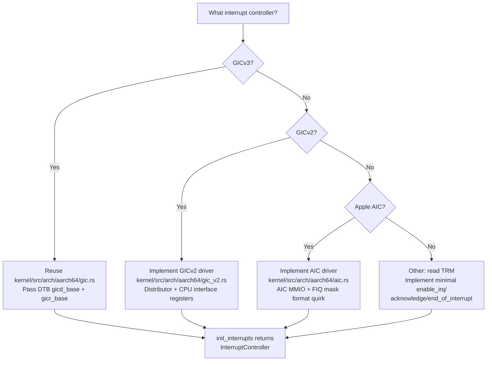

# AIOS BSP Model and Porting Guide

Part of: [bsp.md](../bsp.md) — Board Support Package Architecture
**Related:** [platforms.md](./platforms.md) — Per-platform hardware details, [firmware.md](./firmware.md) — Firmware handoff, [drivers.md](./drivers.md) — Driver mapping matrix

---

## §2 BSP Model

A BSP is a Rust struct implementing the `Platform` trait. Porting AIOS to a new board means writing one file in `kernel/src/platform/` and adding a compatible string match to `detect_platform()`. No other kernel code changes are needed.

### §2.1 Platform Struct Anatomy

Each platform is a struct implementing `Platform` (hal.md §3). The design separates struct storage from initialization results: the platform struct holds no device state, only the identification information needed to select driver code paths. Device handles are returned from `init_*` methods and stored by the caller.

**Fixed SoC boards use zero-sized structs.** A Pi 4 is always a BCM2711; there is nothing to parameterize:

```rust
// kernel/src/platform/qemu.rs
pub struct QemuPlatform;

// kernel/src/platform/pi4.rs
pub struct Pi4Platform;

// kernel/src/platform/pi5.rs
pub struct Pi5Platform;
```

**Apple Silicon carries an SoC variant.** Apple ships different GPU cores (AGX G13 through G16), different display controllers, and different peripheral IP across M-series generations. The `AppleSoc` enum selects the correct driver code path within each `init_*` method:

```rust
// kernel/src/platform/apple.rs
pub struct AppleSiliconPlatform {
    soc: AppleSoc,
}

pub enum AppleSoc {
    T8103,  // M1
    T6000,  // M1 Pro/Max
    T6020,  // M2
    T6031,  // M2 Max
    T6040,  // M3
    T8112,  // M4
}
```

**Current trait** (implemented in `kernel/src/platform/mod.rs`):

```rust
pub trait Platform: Send + Sync {
    fn name(&self) -> &'static str;
    fn init_uart(&self, dt: &DeviceTree) -> Uart;
    fn init_interrupts(&self, dt: &DeviceTree) -> InterruptController;
    fn init_timer(&self, dt: &DeviceTree, ic: &InterruptController) -> Timer;
}
```

**Target design** (full seven-method trait from hal.md §3):

```rust
pub trait Platform: Send + Sync {
    fn name(&self) -> &'static str;

    /// Initialize the serial console (pre-heap).
    /// QEMU / Pi 4/5: PL011 UART. Apple Silicon: S5L UART.
    fn init_uart(&self, dt: &DeviceTree) -> Result<Uart>;

    /// Initialize the interrupt controller (pre-heap).
    /// QEMU / Pi 5: GICv3. Pi 4: GICv2. Apple Silicon: AIC.
    fn init_interrupts(&self, dt: &DeviceTree) -> Result<InterruptController>;

    /// Initialize the system timer (pre-heap).
    /// All platforms: ARM Generic Timer. Frequency varies by platform.
    fn init_timer(&self, dt: &DeviceTree, ic: &InterruptController) -> Result<Timer>;

    /// Initialize the hardware RNG (post-heap, pre-KASLR).
    /// QEMU: VirtIO-RNG. Pi 4/5: bcm2835-rng. Apple: Apple TRNG.
    fn init_rng(&self, dt: &DeviceTree) -> Result<RngDevice>;

    /// Initialize the primary storage controller (service manager Phase 1).
    /// QEMU: VirtIO-Blk. Pi 4/5: Arasan SDHCI. Apple: ANS NVMe.
    fn init_storage(&self, dt: &DeviceTree) -> Result<StorageDevice>;

    /// Initialize the GPU / display controller (service manager Phase 2).
    /// QEMU: VirtIO-GPU. Pi 4: VC4/V3D. Pi 5: V3D 7.1. Apple: AGX GPU.
    fn init_gpu(&self, dt: &DeviceTree) -> Result<GpuDevice>;

    /// Initialize the primary network interface (service manager Phase 2).
    /// QEMU: VirtIO-Net. Pi 4/5: Broadcom Genet. Apple: PCIe NIC.
    fn init_network(&self, dt: &DeviceTree) -> Result<NetworkDevice>;

    /// Downcast to concrete type for extension trait discovery (hal.md §12.3).
    fn as_any(&self) -> &dyn Any;
}
```

The first three methods (`init_uart`, `init_interrupts`, `init_timer`) run before the heap exists and must use only stack and static storage. The RNG runs just after heap initialization. Storage, GPU, and network are called from userspace service manager phases and can allocate freely. See hal.md §3.2 for the full initialization order.

**Static dispatch, no heap at detection time.** Platform instances are stored as `&'static dyn Platform` — static variables in `detect_platform()`. No allocation is required to select a platform, which matters because detection runs before the heap exists:

```rust
pub fn detect_platform(dt: &DeviceTree) -> &'static dyn Platform {
    let compat = dt.root_compatible_str();
    if compat.contains("virt") || compat.contains("qemu") {
        static QEMU: QemuPlatform = QemuPlatform;
        return &QEMU;
    }
    // Each branch returns a reference to a 'static local
    panic!("Unknown platform: {}", compat);
}
```

---

### §2.2 Board Registration

`detect_platform()` in `kernel/src/platform/mod.rs` is the single registration point. It reads the root `compatible` string from the device tree and returns the matching platform implementation.

**Compatible string matching** uses substring search (`contains()`) rather than exact match, which handles both the primary string and any secondary strings in the DTB `compatible` list without requiring full list iteration:

```rust
pub fn detect_platform(dt: &DeviceTree) -> &'static dyn Platform {
    let compat = dt.root_compatible_str();

    if compat.contains("virt") || compat.contains("qemu") {
        static QEMU: qemu::QemuPlatform = qemu::QemuPlatform;
        return &QEMU;
    }
    // Future platforms extend this chain:
    if compat.contains("brcm,bcm2712") {
        static PI5: pi5::Pi5Platform = pi5::Pi5Platform;
        return &PI5;
    }
    if compat.contains("brcm,bcm2711") {
        static PI4: pi4::Pi4Platform = pi4::Pi4Platform;
        return &PI4;
    }
    if compat.contains("apple,t8103") {
        static M1: apple::AppleSiliconPlatform =
            apple::AppleSiliconPlatform { soc: apple::AppleSoc::T8103 };
        return &M1;
    }
    // ... additional Apple SoC variants ...

    panic!("Unknown platform: {}", compat);
}
```

**Compatible strings by platform:**

| Platform | DTB Compatible String | SoC | Boot firmware |
|---|---|---|---|
| QEMU virt | `qemu,virt` | Virtual | edk2 (UEFI) or `-kernel` |
| Raspberry Pi 4 | `brcm,bcm2711` | BCM2711 | UEFI (Pi firmware) or U-Boot |
| Raspberry Pi 5 | `brcm,bcm2712` | BCM2712 | UEFI (Pi firmware) or U-Boot |
| Apple M1 | `apple,t8103` | T8103 | m1n1 + U-Boot |
| Apple M1 Pro/Max | `apple,t6000` | T6000 | m1n1 + U-Boot |
| Apple M2 | `apple,t6020` | T6020 | m1n1 + U-Boot |
| Apple M2 Max | `apple,t6031` | T6031 | m1n1 + U-Boot |
| Apple M3 | `apple,t6040` | T6040 | m1n1 + U-Boot |
| Apple M4 | `apple,t8112` | T8112 | m1n1 + U-Boot |

Note the Pi 5 check is placed before the Pi 4 check. Both boards are Broadcom but have different `compatible` strings; `brcm,bcm2712` must be tested before `brcm,bcm2711` in case a future board ever lists both in its `compatible` array.

---

### §2.3 Device Tree Contract

The kernel expects specific DTB nodes to be present for each hardware class. The `DeviceTree` struct in `kernel/src/dtb.rs` extracts all boot-critical values into a flat struct during early boot:

```rust
pub struct DeviceTree {
    /// Root compatible string (e.g., "linux,dummy-virt").
    pub root_compatible: [u8; 64],
    pub root_compatible_len: usize,
    /// PL011 UART base address (arm,pl011 node).
    pub uart_base: Option<u64>,
    /// GICv3 distributor base (arm,gic-v3 node, first reg entry).
    pub gicd_base: Option<u64>,
    /// GICv3 redistributor base (arm,gic-v3 node, second reg entry).
    pub gicr_base: Option<u64>,
    /// Timer PPI INTID (armv8-timer interrupts, non-secure physical timer).
    pub timer_ppi: u32,
    /// CPU count from /cpus/cpu@N nodes.
    cpu_count_val: usize,
    /// Per-CPU MPIDR values (PSCI CPU_ON target_cpu parameter).
    cpu_mpidrs: [u64; 8],
    /// PSCI conduit: true = hvc, false = smc.
    pub psci_hvc: bool,
    /// VirtIO MMIO device base addresses.
    pub virtio_mmio_bases: [u64; 32],
    pub virtio_mmio_count: usize,
}
```

**Mandatory DTB nodes** that every supported platform must provide:

| Node path | Property | Usage |
|---|---|---|
| `/` | `compatible` | Platform detection in `detect_platform()` |
| `/memory@N` | `reg` | RAM regions for memory pool initialization |
| `/cpus/cpu@N` | `reg` (MPIDR) | SMP core count and PSCI `target_cpu` values |
| `/interrupt-controller` | `compatible`, `reg` | Interrupt controller base address and type |
| `/timer` | `compatible`, `interrupts` | Timer PPI INTID for scheduler tick |

**Optional nodes** that the `DeviceTree` parser extracts when present:

| Node | Property | Fallback |
|---|---|---|
| `/psci` | `method` (hvc/smc) | Defaults to `hvc` (QEMU behavior) |
| UART node (`arm,pl011`) | `reg` | QEMU fallback: `0x0900_0000` |
| GICv3 node (`arm,gic-v3`) | `reg[0]`, `reg[1]` | QEMU fallback: GICD `0x0800_0000`, GICR `0x080A_0000` |
| `virtio,mmio` nodes | `reg` | Collected for VirtIO device scan |

**QEMU defaults fallback.** When no DTB is available (e.g., UEFI boot without a DTB config table entry), `DeviceTree::qemu_defaults()` returns hardcoded values for the QEMU virt machine. This path is also useful for early bringup of a new platform — pass QEMU defaults until the real DTB parsing is confirmed working.

**Future extension.** As new platforms are added, `DeviceTree` will need additional fields for GICv2 CPU interface base (Pi 4), platform-specific mailbox addresses (VideoCore mailbox on Pi 4/5), IOMMU nodes (DART on Apple Silicon), and Apple AIC MMIO base. The field-per-value approach in the current struct scales to perhaps 20–30 fields before a more structured sub-struct approach becomes warranted.

---

### §2.4 Quirk System

Some hardware errata and integration constraints cannot be handled generically inside driver code. A quirk system tracks per-platform behavioral overrides as data, keeping them separate from the main driver logic.

**Design principle:** Hardware workarounds are registered at a `QuirkTable` and queried by driver code, rather than scattered `if platform == Pi4` conditionals throughout the codebase. This keeps each driver reading clean and centralizes knowledge about which boards need special treatment.

**QuirkTable structure:**

```rust
/// A single hardware quirk or errata workaround.
pub struct Quirk {
    /// Short identifier for logging and audit.
    pub id: &'static str,
    /// Human-readable description of the affected hardware and behavior.
    pub description: &'static str,
    /// Platform(s) affected, matched against Platform::name().
    pub platforms: &'static [&'static str],
    /// The behavioral override: a function called at the appropriate
    /// driver init point, or a flag checked by conditional logic.
    pub action: QuirkAction,
}

pub enum QuirkAction {
    /// Skip a driver initialization step entirely.
    Skip,
    /// Insert a delay (microseconds) before a hardware access.
    Delay(u64),
    /// Cap a parameter to a maximum value.
    Clamp { param: &'static str, max: u64 },
    /// Call a platform-specific fixup function.
    Fixup(fn(&DeviceTree)),
}
```

**Example quirks:**

| Platform | Quirk ID | Description |
|---|---|---|
| BCM2711 (Pi 4) | `pcie-needs-fw-init` | PCIe controller requires VideoCore firmware initialization before the kernel may access the PCIe MMIO region. Attempting kernel-side init without firmware setup causes a synchronous abort. |
| BCM2711 (Pi 4) | `sdhci-max-100mhz` | Arasan SDHCI must not exceed 100 MHz to avoid CRC errors on certain SD card models. Clamp `max_clock_hz` to 100,000,000 regardless of what the device tree reports. |
| BCM2712 (Pi 5) | `rp1-fw-required` | RP1 south bridge peripherals (USB, Ethernet, GPIO) are managed by the RP1 firmware. The kernel driver must request firmware activation before accessing RP1 MMIO. |
| Apple M1 | `aic-fiq-mask-format` | Apple AIC uses a non-standard FIQ mask format. Masking a FIQ requires writing to a different register offset than masking an IRQ, unlike GIC where the same ISENABLER register covers both. |
| Apple Silicon | `dart-required` | All DMA-capable devices on Apple Silicon are behind the DART IOMMU. No DMA is possible without first mapping the buffer through DART. Drivers must query the DART handle before issuing any DMA. |
| QEMU | `coherent-dma` | QEMU emulates a fully coherent memory model where cache maintenance instructions (DC CIVAC, DC CVAC, etc.) are legal NOPs. Drivers must still issue correct barriers and cache maintenance for real hardware correctness — this quirk is informational only, indicating that DMA coherency failures on QEMU do not imply correct behavior on real platforms. |

Quirks are consulted at driver initialization time. A driver calls `quirk_table.get("pcie-needs-fw-init")` before initializing the PCIe controller; if the quirk is active for the current platform, it triggers the firmware-first path.

---

## §3 Porting Checklist

Adding a new platform to AIOS follows a repeatable 15-step process. The steps are organized in three tiers: Minimal Boot (serial output, interrupts, timer), Full Platform (storage, GPU, networking), and Extension Traits (USB, wireless, thermal, audio). Each tier is independently deployable — a board can ship with only Minimal Boot support and be progressively enhanced.

### §3.1 Prerequisites

Before writing any code, gather the following:

| Prerequisite | Where to obtain | Notes |
|---|---|---|
| Technical Reference Manual (TRM) | Board vendor / SoC vendor website | Register maps for UART, interrupt controller, timer |
| Device tree source (DTS) | Linux kernel `arch/arm64/boot/dts/` or board firmware | Starting point for DTB; may need modifications |
| JTAG / serial debug cable | Hardware | UART output is the first observable signal; JTAG for bare-metal debugging before UART works |
| Board-specific firmware | Board vendor | UEFI firmware, U-Boot, or equivalent; needed to pass BootInfo to kernel |
| Rust nightly toolchain | `rust-toolchain.toml` | Same nightly as the rest of the codebase; no board-specific toolchain changes |

**DTB source.** For boards booted via UEFI (Raspberry Pi with Pi UEFI firmware), the firmware passes a DTB via the UEFI config table — the kernel finds it via the `DTB_TABLE_GUID`. For boards booted via U-Boot, the DTB is loaded by U-Boot and passed in `x0`. For Apple Silicon, m1n1 converts the Apple Device Tree (ADT) to a standard flattened device tree before jumping to U-Boot.

---

### §3.2 Minimal Boot (Steps 1–5)

The goal of Minimal Boot is a kernel that prints to a serial console, handles interrupts, and drives the scheduler timer. These five steps can be completed in one or two days on hardware with a known-good DTB.

**Step 1: Create the platform file**

Create `kernel/src/platform/<boardname>.rs` with a zero-sized struct implementing the current three-method trait. Add `pub mod <boardname>;` to `kernel/src/platform/mod.rs`.

```rust
// kernel/src/platform/pi5.rs
pub struct Pi5Platform;

impl Platform for Pi5Platform {
    fn name(&self) -> &'static str { "Raspberry Pi 5 (BCM2712)" }

    fn init_uart(&self, dt: &DeviceTree) -> Uart {
        // Implementation in Step 3
        todo!()
    }
    fn init_interrupts(&self, dt: &DeviceTree) -> InterruptController {
        // Implementation in Step 4
        todo!()
    }
    fn init_timer(&self, dt: &DeviceTree, ic: &InterruptController) -> Timer {
        // Implementation in Step 5
        todo!()
    }
}
```

Acceptance: `cargo build --target aarch64-unknown-none` passes with zero warnings.

**Step 2: Add compatible string to `detect_platform()`**

Add a `contains()` branch in `kernel/src/platform/mod.rs`. Place more-specific strings before less-specific ones (Pi 5 before Pi 4 to avoid ambiguity with future combined boards).

```rust
if compat.contains("brcm,bcm2712") {
    static PI5: pi5::Pi5Platform = pi5::Pi5Platform;
    return &PI5;
}
```

Acceptance: The QEMU run still produces expected boot output (no regression). The new compatible string is found when manually patching a QEMU DTB to include `brcm,bcm2712`.

**Step 3: Implement `init_uart()`**

Goal: serial output from the kernel's first print statement.

Read the board TRM UART section. Most ARM boards use PL011 — in that case, `init_uart()` is a thin wrapper around the existing `kernel/src/arch/aarch64/uart.rs` driver. The `uart_base` comes from the DTB `arm,pl011` node; consult QEMU's implementation for comparison.

For non-PL011 UARTs (S5L on Apple Silicon, 8250 on some SBCs), a new driver file is needed under `kernel/src/arch/aarch64/`. The driver must implement the same `putc()` interface used by the panic handler.

```rust
fn init_uart(&self, dt: &DeviceTree) -> Uart {
    let base = dt.uart_base.unwrap_or(BOARD_UART_DEFAULT);
    Uart::init(base)
}
```

Acceptance on real hardware: Connect a USB-serial adapter to the board's UART pins. Run the kernel. Expected first output:

```text
[BOOT] AIOS kernel starting
[BOOT] Platform: Raspberry Pi 5 (BCM2712)
```

**Step 4: Implement `init_interrupts()`**

Goal: interrupt controller initialized, IRQs maskable and unmaskable.

Determine which interrupt controller the board uses:



For GICv3 boards (QEMU, Pi 5), `init_interrupts()` constructs the `InterruptController` from the DTB `gicd_base` and `gicr_base`:

```rust
fn init_interrupts(&self, dt: &DeviceTree) -> InterruptController {
    let (gicd, gicr) = dt.gic_bases();
    InterruptController::init_gicv3(gicd as usize, gicr as usize)
}
```

For GICv2 boards (Pi 4), the distributor and CPU interface are at separate addresses. The Pi 4 GIC-400 distributor is at `0xFF841000` and the CPU interface is at `0xFF842000` (physical). These addresses must come from the DTB; never hardcode them.

Acceptance: `just run` still passes. On real hardware, mask/unmask an IRQ line and verify the interrupt controller state via UART log output.

**Step 5: Implement `init_timer()`**

Goal: 1 kHz scheduler tick.

All supported platforms use the ARM Generic Timer (CNTPCT_EL0, CNTP_CTL_EL0, CNTP_TVAL_EL0). Timer frequency differs by platform but is read from `CNTFRQ_EL0` at runtime — no hardcoding. The PPI INTID comes from the DTB `armv8-timer` node (see dtb.rs timer parsing logic).

```rust
fn init_timer(&self, dt: &DeviceTree, ic: &InterruptController) -> Timer {
    // Timer frequency: read CNTFRQ_EL0 at runtime.
    // PPI INTID: from DTB dt.timer_ppi (default 30 on QEMU).
    Timer::init(dt.timer_ppi, ic)
}
```

| Platform | CNTFRQ_EL0 | 1 ms tick count |
|---|---|---|
| QEMU virt | 62,500,000 Hz | 62,500 |
| Raspberry Pi 4 | 54,000,000 Hz | 54,000 |
| Raspberry Pi 5 | 54,000,000 Hz | 54,000 |
| Apple M1 | 24,000,000 Hz | 24,000 |

Acceptance on real hardware: UART output includes `[TIMER] tick 1000` after one second of operation.

---

### §3.3 Full Platform (Steps 6–10)

Full platform support adds storage, GPU, network, random number generation, and SMP. These steps require more hardware-specific driver code and may take days to weeks depending on driver complexity.

**Step 6: Implement `init_rng()`**

Goal: hardware entropy source available before KASLR slide computation.

| Platform | RNG hardware | Implementation approach |
|---|---|---|
| QEMU | VirtIO-RNG | Virtqueue-based; requires heap (called post-heap-init) |
| Pi 4/5 | bcm2835-rng | MMIO register at `0xFE10_4000` (ARM physical); legacy bus address `0x7E10_4000` in DTB — use DTB `reg` property translated through `ranges` |
| Apple Silicon | Apple TRNG | MMIO register; custom protocol, consult m1n1 source |

Acceptance: `init_rng()` returns a `RngDevice` that produces non-repeating 32-byte entropy blocks. Log the first block via UART to confirm non-zero output.

**Step 7: Implement `init_storage()`**

Goal: raw block I/O for the Block Engine (storage/spaces/block-engine.md §4).

| Platform | Storage hardware | Driver location |
|---|---|---|
| QEMU | VirtIO-Blk | `kernel/src/drivers/virtio_blk.rs` (complete) |
| Pi 4/5 | Arasan SDHCI (SD/eMMC) | `kernel/src/drivers/sdhci.rs` (new) |
| Apple Silicon | ANS NVMe | `kernel/src/drivers/ans_nvme.rs` (new) |

The Pi SDHCI driver must respect the `sdhci-max-100mhz` quirk (§2.4) and implement the ADMA2 descriptor table format for DMA transfers. The Apple ANS NVMe controller uses an Apple-custom command protocol that differs from standard NVMe — consult the Asahi Linux `apple-ans` driver for register documentation.

Acceptance: `init_storage()` returns a `StorageDevice`. Reading sector 0 returns the AIOS superblock magic `0x41494F53_50414345` from a pre-formatted disk image.

**Step 8: Implement `init_gpu()`**

Goal: kernel-owned framebuffer for compositor (compositor.md, gpu.md §3–4).

| Platform | GPU hardware | Driver notes |
|---|---|---|
| QEMU | VirtIO-GPU | `kernel/src/drivers/virtio_gpu.rs` (new) |
| Pi 4 | VideoCore VI (VC4/V3D) | Requires VideoCore firmware mailbox handoff |
| Pi 5 | VideoCore VII (V3D 7.1) | Requires RP1 firmware activation (§2.4 quirk) |
| Apple Silicon | AGX GPU | Tile-based deferred renderer; complex bringup |

For Pi 4/5, the GPU framebuffer is allocated through the VideoCore firmware mailbox before the kernel has a native GPU driver. `init_gpu()` sends a `FB_ALLOCATE` mailbox message to request a framebuffer at the desired resolution; VideoCore responds with the physical address and stride. This framebuffer is used for the boot splash and initial compositor frames until a full wgpu/VC4 driver is available.

Acceptance: `init_gpu()` returns a `GpuDevice` with a valid framebuffer. Filling the framebuffer with the AIOS blue (`#5B8CFF`) produces a solid-color display on screen.

**Step 9: Implement `init_network()`**

Goal: raw packet I/O for the network stack (networking/stack.md §4).

| Platform | NIC hardware | Driver notes |
|---|---|---|
| QEMU | VirtIO-Net | Virtqueue-based; reference implementation |
| Pi 4/5 | BCM54213PE (Genet) | Broadcom GENET v5; complex DMA descriptor ring |
| Apple Silicon | Broadcom via PCIe | Thunderbolt/PCIe NIC; requires PCIe enumeration |

The Genet driver for Pi 4/5 must configure the MAC address from the DTB `local-mac-address` property. Genet v5 uses a 256-entry TX descriptor ring and 256-entry RX descriptor ring with 2 KiB buffers each.

Acceptance: `init_network()` returns a `NetworkDevice`. Transmitting an ARP probe and receiving the ARP reply confirms basic TX/RX operation.

**Step 10: SMP bringup**

Goal: all CPU cores running, per-core timer and IRQ initialized.

SMP bringup uses PSCI `CPU_ON` (function ID `0xC400_0003`). The PSCI conduit is board-specific:

| Platform | PSCI conduit | Reason |
|---|---|---|
| QEMU | HVC | QEMU implements PSCI in a virtual EL2 hypervisor layer |
| Pi 4/5 | SMC | Broadcom TrustZone firmware handles PSCI in EL3 |
| Apple Silicon | SMC | Apple SEP handles PSCI in EL3 via custom protocol |

The conduit is read from the DTB `/psci` node `method` property (`hvc` or `smc`); see `kernel/src/dtb.rs`. The PSCI entry point address must be the physical address of `_secondary_entry` in `boot.S` — `kernel/src/smp.rs` performs the virtual-to-physical conversion before calling `CPU_ON`.

Secondary core initialization sequence (identical for all platforms): FPU enable → VBAR install → TTBR1 install → MMU enable → SP setup → `secondary_main()`.

Acceptance: UART output includes `[SMP] core 1 online`, `[SMP] core 2 online`, `[SMP] core 3 online` (for a 4-core board).

---

### §3.4 Extension Traits (Steps 11–15)

Extension traits (hal.md §12) allow platforms to opt into capabilities that not every board provides. They are implemented as separate traits that the concrete platform struct implements alongside the core `Platform` trait. Kernel subsystems discover extension trait support at runtime via `platform.as_any()` and downcasting.

**Step 11: USB host controller**

Implement `PlatformUsb` from `kernel/src/platform/traits/usb.rs`. Provide a `UsbHostController` instance for each USB controller on the board (usb/controller.md §2.1).

| Platform | USB controller | Notes |
|---|---|---|
| QEMU | xHCI via VirtIO | Enumerate virtio-usb device |
| Pi 4 | DWC2 (USB 2.0 OTG in host mode) | Single port; DWC2 quirks documented in Linux driver |
| Pi 5 | RP1 xHCI (USB 3.0) | RP1 firmware activation required before MMIO access |
| Apple Silicon | xHCI (Thunderbolt) | USB4/Thunderbolt controller with xHCI profile |

**Step 12: WiFi driver**

Implement `PlatformWifi` from `kernel/src/platform/traits/wifi.rs`. Load the firmware blob and initialize the WiFi chipset driver (wireless/firmware.md §5).

| Platform | WiFi chip | Firmware blob |
|---|---|---|
| Pi 4/5 | CYW43455 | `brcmfmac43455-sdio.bin` + CLM blob |
| Apple Silicon | BCM4387 (via PCIe) | `brcmfmac4387c2-pcie.bin` |

**Step 13: Bluetooth driver**

Implement `PlatformBluetooth` from `kernel/src/platform/traits/bluetooth.rs`. Initialize the HCI UART or USB transport (wireless/bluetooth.md §4.1).

Pi 4/5 uses a UART-attached CYW43455 Bluetooth coprocessor. Apple Silicon uses a PCIe-attached BCM4387 supporting both WiFi and Bluetooth on the same chip.

**Step 14: Thermal driver**

Implement `PlatformThermal` from `kernel/src/platform/traits/thermal.rs`. Register thermal zones and cooling devices (thermal/zones.md §2, thermal/platform-drivers.md §8).

| Platform | Temperature sensor | Cooling |
|---|---|---|
| QEMU | Synthetic (no real sensors) | None |
| Pi 4 | BCM2711 AVS sensor (`0x7d5d2200`) | CPU frequency scaling |
| Pi 5 | BCM2712 PVTMON | CPU/GPU frequency scaling + fan control |
| Apple Silicon | Multiple die sensors (SMC) | CPU/GPU DVFS via Apple PMU protocol |

**Step 15: Audio driver**

Implement `PlatformAudio` from `kernel/src/platform/traits/audio.rs`. Provide an audio session manager and hardware mixer (audio/drivers.md §5).

| Platform | Audio hardware | Notes |
|---|---|---|
| QEMU | VirtIO-Sound | Virtqueue-based; reference implementation |
| Pi 4/5 | BCM2835 I2S + PWM | 3.5mm jack via PWM; HDMI via firmware mailbox |
| Apple Silicon | Apple Audio (CX) | ProAudio-class hardware; requires Apple-specific protocol |

---

### §3.5 Validation Gates

Each porting step has a mechanical acceptance criterion. The following table maps steps to verification commands and expected output:

| Step | Verification method | Expected result |
|---|---|---|
| 1 — Platform file | `cargo build --target aarch64-unknown-none` | Zero warnings |
| 2 — Compatible string | Patch QEMU DTB; `just run` | `[BOOT] Platform: <new board name>` |
| 3 — UART | Serial console on real hardware | `[BOOT] AIOS kernel starting` |
| 4 — Interrupts | UART output after IRQ enable | `[GIC] initialized` (or board equivalent) |
| 5 — Timer | Wait 1 second; check UART | `[TIMER] tick 1000` |
| 6 — RNG | Read 32 bytes from RngDevice | Non-zero, non-repeating hex output |
| 7 — Storage | Read sector 0 | Superblock magic `0x4149…5345` |
| 8 — GPU | Visual inspection of display | Solid AIOS blue `#5B8CFF` |
| 9 — Network | `ping` equivalent via ARP | ARP reply received |
| 10 — SMP | Boot log | `[SMP] core N online` for all N |
| 11 — USB | Plug in USB keyboard | USB HID device enumerated |
| 12 — WiFi | Scan for APs | SSID list printed |
| 13 — Bluetooth | BLE scan | Device MACs printed |
| 14 — Thermal | Read temperature | Non-zero Celsius value logged |
| 15 — Audio | Play boot chime | Audio output audible |

**Cross-platform regression.** After adding a new platform, run the full QEMU acceptance suite (`just check && just test && just run`) to confirm the new compatible string match does not affect QEMU behavior. A new board should be entirely additive — no changes to existing platform code paths.

**QEMU reference comparison.** Before testing on real hardware, validate each step against QEMU by patching the QEMU DTB to include the new board's compatible string. This narrows the failure surface: if a step works in QEMU with the patched DTB, the problem on real hardware is hardware-specific, not a logic error in the Rust code.

---

## §3.6 Extension Trait Discovery

Extension traits decouple optional capability support from the core `Platform` trait. Subsystems that need optional hardware discover it at runtime without requiring all platforms to implement every method.

### §3.6.1 Discovery Pattern

`as_any()` enables safe downcasting from `&dyn Platform` to the concrete platform type, which can then be tested for extension trait implementation:

```rust
// In USB subsystem initialization:
fn init_usb_subsystem(platform: &'static dyn Platform) {
    // Attempt to downcast to concrete type, then check for PlatformUsb.
    use core::any::Any;
    if let Some(usb_platform) = platform.as_any()
        .downcast_ref::<Pi5Platform>()
        .and_then(|p| Some(p as &dyn PlatformUsb))
    {
        let controller = usb_platform.init_usb();
        // ... register controller with USB subsystem ...
    } else {
        // Platform has no USB support; USB subsystem does not start.
        kinfo!(Subsystem::Usb, "no USB hardware on this platform");
    }
}
```

### §3.6.2 Extension Trait List

| Trait | Subsystem | Required by |
|---|---|---|
| `PlatformUsb` | USB host controller | USB subsystem (usb/controller.md §2) |
| `PlatformWifi` | WiFi chipset | Wireless subsystem (wireless/wifi.md §3) |
| `PlatformBluetooth` | Bluetooth controller | Wireless subsystem (wireless/bluetooth.md §4) |
| `PlatformThermal` | Thermal sensors + cooling | Thermal subsystem (thermal/platform-drivers.md §8) |
| `PlatformAudio` | Audio hardware | Audio subsystem (audio/drivers.md §5) |
| `PlatformCamera` | Camera controller | Camera subsystem (camera/drivers.md §7) |
| `PlatformIommu` | IOMMU (DART, SMMU) | DMA protection (device-model/dma.md §11) |
| `PlatformPci` | PCIe root complex | PCIe enumeration |

Platforms implement only the traits applicable to their hardware. `QemuPlatform` implements `PlatformUsb` (via VirtIO), `PlatformWifi` (via VirtIO-Net in WiFi emulation mode), and `PlatformAudio` (via VirtIO-Sound). It does not implement `PlatformCamera` or `PlatformIommu` because QEMU has no hardware equivalents. `AppleSiliconPlatform` implements all traits because Apple Silicon Macs have every peripheral class.
