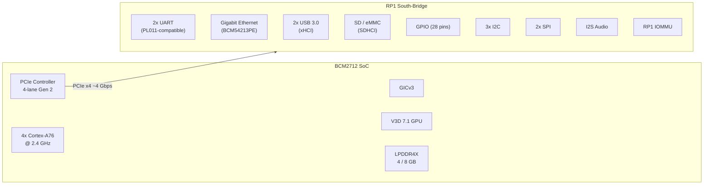
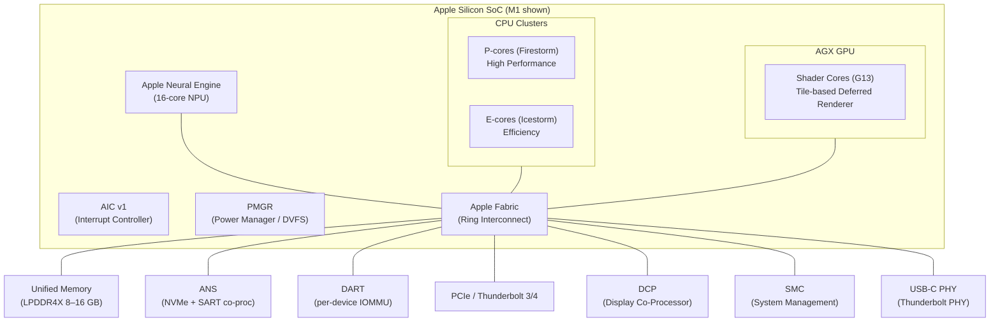

# AIOS Platform Hardware Reference

Part of: [bsp.md](../bsp.md) — Board Support Package Architecture
**Related:** [model.md](./model.md) — BSP model & porting guide, [drivers.md](./drivers.md) — Driver mapping, [firmware.md](./firmware.md) — Firmware handoff

---

## §4 QEMU virt (Reference Platform)

QEMU virt is the fully-implemented reference platform for AIOS. Every kernel feature is
developed and validated against QEMU before being brought up on real hardware. All other
platform BSPs are validated against the behaviors established on QEMU — if a driver passes
the QEMU test suite, the real hardware port starts from a known-good baseline.

The QEMU virt machine is deliberately not modeled after any real hardware. Its peripherals
are chosen for emulation convenience rather than silicon fidelity, which makes it an ideal
development target but means some real-hardware behaviors are absent. Gaps are documented in
§4.3.

---

### §4.1 Hardware Overview

The QEMU virt machine presents a configurable aarch64 platform with the following
characteristics relevant to AIOS:

- **CPU:** Configurable; AIOS CI uses `cortex-a72` (ARMv8.0-A), which matches the
  Raspberry Pi 4. Use `-cpu max` to enable all ARMv8 extensions for feature testing.
- **Memory:** Configurable (`-m 2G` for CI). Starts at physical address `0x4000_0000`
  — unlike real ARM hardware, which typically starts at `0x0000_0000` or `0x8000_0000`.
- **SMP:** Up to 8 cores with `-smp N`. AIOS CI uses `-smp 4`.
- **Devices:** Selected from a fixed menu of virtio and legacy devices. No emulated PCIe
  root complex beyond what QEMU provides automatically.

Standard QEMU invocation for AIOS:

```text
qemu-system-aarch64                                        \
  -machine virt,gic-version=3                              \
  -cpu cortex-a72                                          \
  -smp 4                                                   \
  -m 2G                                                    \
  -nographic                                               \
  -bios /opt/homebrew/share/qemu/edk2-aarch64-code.fd     \
  -drive if=none,id=disk0,file=aios.img,format=raw        \
  -device virtio-blk-pci,drive=disk0                       \
  -drive if=none,id=data0,file=data.img,format=raw         \
  -device virtio-blk-device,drive=data0                    \
  -device ramfb
```

The `-nographic` flag redirects serial output to the terminal and suppresses the QEMU
display window. It implies `-serial mon:stdio`; there is no need for an explicit `-serial`
flag. Debug sessions add `-gdb tcp::1234` (not `-s`).

---

### §4.2 Device Parameters

| Device | MMIO Base | IRQ | Driver | Compatible String |
|---|---|---|---|---|
| PL011 UART | `0x0900_0000` | SPI 33 | PL011 | `arm,pl011` |
| GICv3 GICD | `0x0800_0000` | — | GICv3 | `arm,gic-v3` |
| GICv3 GICR | `0x080A_0000` | — | GICv3 | `arm,gic-v3` |
| Generic Timer | (system reg) | PPI 30 | ARM Timer | `arm,armv8-timer` |
| VirtIO-blk | `0x0A00_xxxx` | SPI 48+ | VirtIO MMIO | `virtio,mmio` |
| VirtIO-net | `0x0A00_xxxx` | SPI 48+ | VirtIO MMIO | `virtio,mmio` |
| VirtIO-gpu | `0x0A00_xxxx` | SPI 48+ | VirtIO MMIO | `virtio,mmio` |
| VirtIO-rng | `0x0A00_xxxx` | SPI 48+ | VirtIO MMIO | `virtio,mmio` |
| ramfb | (fw_cfg) | — | ramfb | — |

**VirtIO MMIO scan range:** `0x0A00_0000`–`0x0A00_3E00`, 512-byte stride. Each slot is
probed for the magic value `0x74726976` ("virt"). The slot's device ID determines the
driver bound: 1=network, 2=block, 16=GPU, 4=RNG.

**GICv3 redistributor spacing:** 128 KiB (0x20000) per core. With 4 cores, the
redistributor region occupies `0x080A_0000`–`0x080E_FFFF`.

**Generic Timer frequency:** 62.5 MHz (62,500,000 Hz) on QEMU virt. One millisecond tick
count = 62,500 counter ticks. This differs from real Cortex-A72 hardware (54 MHz on Pi 4
and Pi 5) — see §5.3 and §6.4.

**ramfb:** Provided by `-device ramfb`. Supplies a GOP framebuffer via the UEFI `fw_cfg`
interface without requiring a VirtIO-GPU or DRM/KMS driver. QEMU virt defaults to 800×600
Bgr8 at approximately `0xBC7A_0000` (Non-Cacheable Normal memory, mapped via L1[1]).

---

### §4.3 Quirks and Emulation Gaps

QEMU virt emulates hardware behavior faithfully at the instruction level but diverges from
real silicon in several areas that matter for driver development:

**Cache coherency:** QEMU provides total store ordering — all memory accesses appear
coherent without explicit cache maintenance. Real hardware requires `DC CIVAC` / `DC ISH`
sequences for DMA coherency. Drivers that skip cache flush instructions will work on QEMU
but fault on real hardware. Device drivers must always issue the correct barriers even when
testing on QEMU.

**TLB broadcast timing:** `TLBI ISH` instructions complete immediately on QEMU. On real
multi-core hardware, the TLB shootdown propagates to remote cores with measurable latency.
Race conditions in TLB invalidation code are difficult to reproduce under QEMU.

**VirtIO transport version:** QEMU virt uses the legacy MMIO transport (VirtIO spec v1
§4.2). The modern transport (MMIO v2) requires explicit DTB configuration. AIOS uses legacy
transport for simplicity; this is noted in the VirtIO driver source.

**`wfe`/`sev` behavior:** QEMU releases a `wfe`-parked core the moment any `sev` is
issued system-wide, regardless of whether the event was intended for that core. Real
Cortex-A72 hardware has the same behavior, but the timing is tighter and spurious wakeups
occur more rarely. Code that relies on `wfe` for precise parking must handle spurious
wakeups correctly regardless.

**Exclusive monitor (ldaxr/stlxr):** The global exclusive monitor on QEMU operates
correctly for Writeback-cacheable memory (MAIR Attr3). However, Non-Cacheable Normal memory
(Attr1, used in Phase 1 before the MMU upgrade) does not support the global exclusive
monitor — `spin::Mutex` and all atomic RMW operations (`fetch_add`, `compare_exchange`)
will hang under multi-core contention on NC memory. This is not an emulation gap — it is
architecturally correct behavior that also occurs on real hardware.

**No real thermal behavior:** Temperature readings come from a utilization-derived formula
(thermal/platform-drivers.md §8.1). There is no emulated temperature sensor MMIO register;
the thermal driver uses a virtual sensor model.

**PSCI conduit:** QEMU uses `hvc` for PSCI. Real Raspberry Pi 4/5 hardware uses `smc`
(Secure Monitor Call) because the firmware runs at EL3. Apple Silicon uses `smc` with a
different PSCI implementation through m1n1.

---

### §4.4 QEMU Invocation Reference

**Standard CI run (UEFI path):**

```text
qemu-system-aarch64                             \
  -machine virt                                 \
  -cpu cortex-a72                               \
  -smp 4                                        \
  -m 2G                                         \
  -bios /opt/homebrew/share/qemu/edk2-aarch64-code.fd \
  -drive file=aios.img,if=none,format=raw,id=esp    \
  -device virtio-blk-device,drive=esp           \
  -nographic
```

**With data disk (storage testing):**

```text
  -drive file=data.img,if=none,format=raw,id=disk0 \
  -device virtio-blk-device,drive=disk0
```

**With display (framebuffer testing):**

```text
  -device ramfb                    \
  -device virtio-keyboard-device   \
  -device virtio-mouse-device      \
  -display sdl
```

**GDB debug session:**

```text
  -gdb tcp::1234    \
  -S                \
  -nographic
```

Connect with: `gdb-multiarch -ex "target remote :1234" kernel.elf`

The `justfile` recipes `just run`, `just run-display`, `just run-direct`, and `just run-gdb`
wrap these flag combinations. Always use the `just` recipes rather than constructing the
command manually to avoid flag drift.

---

## §5 Raspberry Pi 4 (BCM2711)

The Raspberry Pi 4 is the first real hardware target for AIOS. It uses the Broadcom BCM2711
SoC, which is well-documented compared to many embedded ARM SoCs and has extensive Linux
kernel driver support to reference.

---

### §5.1 SoC Overview

The BCM2711 is Broadcom's quad-core Cortex-A72 SoC manufactured on TSMC 28 nm. Key
characteristics:

- **CPU:** 4× Cortex-A72 @ 1.5 GHz, ARMv8.0-A
- **GPU:** VideoCore VI (3D pipeline: V3D 4.2 for OpenGL ES / Vulkan 1.0)
- **Memory:** 1/2/4/8 GB LPDDR4 on-package (variants by SKU)
- **PCIe:** 1× Gen 2.0 lane via VL805 USB 3.0 controller
- **USB:** 2× USB 3.0 (via VL805 PCIe), 2× USB 2.0 (native)
- **Ethernet:** Gigabit via BCM54213PE PHY (Genet MAC integrated in BCM2711)

**Peripheral address spaces:** BCM2711 has two peripheral address ranges:
- *Low peripheral mode* (default for 64-bit kernels): base `0xFE00_0000`
- *Legacy peripheral mode*: base `0x7E00_0000` (used by VideoCore firmware internally)

AIOS uses low peripheral mode throughout. All MMIO addresses below use the
`0xFE00_0000` base unless noted otherwise.

**ARM Timer frequency:** 54 MHz (not 62.5 MHz as on QEMU). One millisecond tick count =
54,000 counter ticks. The platform driver reads `CNTFRQ_EL0` at boot and uses the
hardware-reported value rather than a compile-time constant.

---

### §5.2 Device Parameters

| Device | MMIO Base (Low Peripheral) | IRQ | Driver | Compatible String |
|---|---|---|---|---|
| PL011 UART0 | `0xFE20_1000` | SPI 121 | PL011 | `arm,pl011` |
| Mini UART (UART1) | `0xFE21_5000` | SPI 93 | AUX UART | `brcm,bcm2835-aux-uart` |
| GIC-400 GICD | `0xFF84_1000` | — | GICv2 | `arm,gic-400` |
| GIC-400 GICC | `0xFF84_2000` | — | GICv2 | `arm,gic-400` |
| Generic Timer | (system reg) | PPI 30 | ARM Timer | `arm,armv8-timer` |
| EMMC2 (SD) | `0xFE34_0000` | SPI 158 | SDHCI | `brcm,bcm2711-emmc2` |
| PCIe RC | `0xFD50_0000` | SPI 147–148 | PCIe | `brcm,bcm2711-pcie` |
| Mailbox | `0xFE00_B880` | — | Mailbox | `brcm,bcm2835-mbox` |
| V3D GPU | `0xFEC0_0000` | SPI 74 | VC4/V3D | `brcm,2711-v3d` |
| Genet (Ethernet) | `0xFD58_0000` | SPI 157–158 | Genet | `brcm,bcm2711-genet-v5` |
| bcm2835-rng | `0xFE10_4000` | — | RNG | `brcm,bcm2835-rng` |
| Thermal (TSENS) | `0xFE21_2000` | — | BCM2711 AVS | `brcm,bcm2711-thermal` |
| PWM | `0xFE20_C000` | — | PWM | `brcm,bcm2835-pwm` |
| SPI0 | `0xFE20_4000` | — | SPI | `brcm,bcm2835-spi` |
| I2C0 | `0xFE20_5000` | — | I2C | `brcm,bcm2835-i2c` |
| DMA | `0xFE00_7000` | SPI 80–87 | DMA | `brcm,bcm2835-dma` |

**Note on UART selection:** PL011 UART0 (primary) requires the ARM to take exclusive
ownership of the UART from the VideoCore firmware. The Mini UART (AUX UART1) is
always available but has inferior FIFO depth and baud rate accuracy. AIOS uses PL011
UART0 as the primary console. The Mini UART is available as a secondary debug port.

---

### §5.3 BCM2711 Quirks

**VideoCore firmware ownership:** The BCM2711 boots through a two-stage firmware sequence:
the VideoCore GPU executes `bootcode.bin` and `start4.elf` from the SD card before the ARM
cores are released. The firmware initializes clocks, memory controller, PCIe, and USB.
Some peripheral registers are not accessible to the ARM until the firmware has completed
its initialization pass.

**Mailbox property interface:** The primary channel for kernel–firmware communication is
the VideoCore mailbox (channel 8, property interface). Tag-based messages request clock
rates, power domain states, and hardware configuration. Common tags relevant to AIOS:

| Tag ID | Name | Direction | Description |
|---|---|---|---|
| `0x00038001` | SET_POWER_STATE | Kernel → FW | Power on/off a device |
| `0x00028001` | GET_POWER_STATE | Kernel ← FW | Query device power state |
| `0x00038002` | SET_CLOCK_RATE | Kernel → FW | Request clock rate |
| `0x00030002` | GET_CLOCK_RATE | Kernel ← FW | Read current clock rate |
| `0x00030006` | GET_TEMPERATURE | Kernel ← FW | Read SoC temperature |
| `0x00060001` | GET_FIRMWARE_REV | Kernel ← FW | Read firmware revision |

The mailbox protocol is fully synchronous — the ARM writes a request to the mailbox and
polls the status register until the firmware acknowledges. There is no interrupt path for
mailbox responses on BCM2711.

**EMMC2 maximum clock:** The EMMC2 SDHCI controller supports a maximum SD clock of 100 MHz
(not the 200 MHz the SDHCI specification allows). Exceeding this limit causes SD card
initialization failures on some cards. The driver must cap the clock during SDHCI
initialization.

**PCIe and VL805:** The PCIe root complex at `0xFD50_0000` connects the VL805 USB 3.0
controller. PCIe enumeration and VL805 firmware loading are handled by the VideoCore
firmware before ARM boot. The kernel treats VL805 as a standard xHCI controller discovered
via PCIe BAR enumeration.

**GIC-400 (GICv2):** The Pi 4 uses an ARM GIC-400, which implements GICv2 — not GICv3 as
on QEMU. Key differences:
- No redistributor; CPU interface registers are at a single banked MMIO region (`0xFF84_2000`)
  shared across all CPUs (per-CPU views accessed via the banked register scheme)
- Affinity routing is not supported; SGIs and PPIs are targeted by CPU mask
- This requires a separate GICv2 driver (target path: `kernel/src/arch/aarch64/gic_v2.rs`,
  not yet implemented); the existing GICv3 driver (`gic.rs`) is not compatible

**ARM Timer frequency:** 54 MHz on BCM2711, not 62.5 MHz as on QEMU. Drivers must read
`CNTFRQ_EL0` at runtime and derive all timer intervals from the hardware-reported value.
No compile-time frequency constants.

---

### §5.4 Board Variants

| Variant | RAM | Notes |
|---|---|---|
| Pi 4 Model B 1 GB | 1 GB | Discontinued |
| Pi 4 Model B 2 GB | 2 GB | |
| Pi 4 Model B 4 GB | 4 GB | Primary target for AIOS CI |
| Pi 4 Model B 8 GB | 8 GB | Requires >4 GB physical address mapping in page tables |
| Compute Module 4 | 1–8 GB | No on-board Ethernet, PCIe exposed on carrier board |
| Pi 400 | 4 GB | All-in-one keyboard form factor; same SoC |

The 8 GB variant requires physical address mapping above the 4 GB boundary. The buddy
allocator pool configuration must account for the high-memory region; the page table
infrastructure must use 48-bit physical addresses throughout. The UEFI memory map reports
all DRAM regions regardless of whether they fall above 4 GB.

---

## §6 Raspberry Pi 5 (BCM2712)

The Raspberry Pi 5 is the preferred real hardware target for Phase 40 bring-up because it
uses GICv3 — the same interrupt controller as QEMU virt. This means the GIC driver requires
no changes; only base addresses differ, which come from the DTB. Less new code means fewer
bugs.

---

### §6.1 SoC Overview

The BCM2712 is Broadcom's quad-core Cortex-A76 SoC on TSMC 16 nm:

- **CPU:** 4× Cortex-A76 @ 2.4 GHz, ARMv8.2-A (with LSE atomics, pointer authentication)
- **GPU:** VideoCore VII (V3D 7.1, Vulkan 1.2 compliant)
- **Memory:** 4/8 GB LPDDR4X on-package
- **I/O:** RP1 south-bridge chip via 4-lane PCIe Gen 2 (see §6.3)
- **Dedicated fan header:** 4-pin PWM, 25 kHz carrier

**Interrupt controller change:** BCM2712 uses ARM GICv3, which is the same architecture as
QEMU virt. Redistributor addresses are read from the DTB. The GICv2 driver used on Pi 4 is
not needed.

**ARM Timer frequency:** 54 MHz, same as BCM2711. Read `CNTFRQ_EL0` at runtime.

---

### §6.2 Device Parameters

BCM2712 devices include both direct SoC peripherals and peripherals routed through the RP1
south-bridge. The Chip column distinguishes them.

| Device | MMIO Base | Chip | IRQ | Driver | Compatible |
|---|---|---|---|---|---|
| GICv3 GICD | `0x10_7FFF_9000` | BCM2712 | — | GICv3 | `arm,gic-v3` |
| GICv3 GICR | DTB-sourced | BCM2712 | — | GICv3 | `arm,gic-v3` |
| Generic Timer | (system reg) | BCM2712 | PPI 30 | ARM Timer | `arm,armv8-timer` |
| V3D 7.1 GPU | DTB-sourced | BCM2712 | SPI | V3D | `brcm,2712-v3d` |
| PCIe RC (RP1 bus) | DTB-sourced | BCM2712 | — | PCIe | `brcm,bcm2712-pcie` |
| Fan PWM | DTB-sourced | BCM2712 | — | PWM | `brcm,bcm2712-pwm` |
| bcm2835-rng | DTB-sourced | BCM2712 | — | RNG | `brcm,bcm2835-rng` |
| PL011 UART0 | RP1 BAR | RP1 | MSI | PL011 | `arm,pl011` |
| SDHCI (SD/eMMC) | RP1 BAR | RP1 | MSI | SDHCI | `brcm,bcm2712-sdhci` |
| Genet (Ethernet) | RP1 BAR | RP1 | MSI | Genet | `brcm,bcm2712-genet` |
| USB 3.0 (xHCI) | RP1 BAR | RP1 | MSI | xHCI | `brcm,bcm2712-xhci` |
| GPIO | RP1 BAR | RP1 | MSI | GPIO | `brcm,bcm2712-gpio` |
| I2C | RP1 BAR | RP1 | MSI | I2C | `brcm,bcm2712-i2c` |
| SPI | RP1 BAR | RP1 | MSI | SPI | `brcm,bcm2712-spi` |

**Note on "TBD" addresses:** BCM2712 register-level documentation is less publicly available
than BCM2711. Addresses marked "DTB-sourced" are determined at runtime from the firmware-
provided device tree rather than from a public datasheet. The Asahi Linux and Raspberry Pi
Linux kernel trees are the primary reference sources.

---

### §6.3 RP1 South-Bridge Architecture

The RP1 is a Broadcom-designed I/O multiplexer connected to the BCM2712 via a 4-lane PCIe
Gen 2 link at approximately 4 Gbps aggregate bandwidth. It contains the majority of the
board's legacy I/O peripherals that would ordinarily be integrated directly into the SoC.

**RP1 internal components:**

- 2× PL011-compatible UART
- 2× SPI controllers (SPI0, SPI1)
- 3× I2C controllers
- Gigabit Ethernet MAC + PHY (BCM54213PE)
- 2× USB 3.0 controllers (xHCI, xHCI)
- SD/eMMC controller (SDHCI-compatible)
- GPIO controller (28 GPIO pins)
- I2S audio interface
- 2× PWM controllers

**Key architectural implications for driver development:**

All RP1 peripherals are accessed through PCIe MMIO BARs assigned during PCI enumeration.
Base addresses are not fixed and must be read from the PCIe configuration space, which is
then reflected in the firmware DTB. Drivers must not hard-code RP1 peripheral addresses.

RP1 has its own internal interrupt controller. Interrupts from RP1 peripherals are delivered
to BCM2712 via PCIe Message Signaled Interrupts (MSI). The RP1 does not use the legacy IRQ
lines visible in the GICv3. MSI setup requires PCIe driver support for MSI allocation and
MSI vector mapping into the GICv3 GICD.

RP1 firmware is a binary blob loaded by VideoCore before ARM cores start. The RP1 must have
its firmware loaded and initialized before any RP1 peripheral can be accessed. Attempting
to read RP1 MMIO before firmware initialization will return undefined values or hang.

DMA transfers between BCM2712 CPU cores and RP1 peripherals traverse the PCIe bus.
Per-transfer latency is higher than for on-chip DMA, and cache-coherency between CPU and
RP1 DMA must be managed explicitly. The RP1 has its own IOMMU; DMA mappings must be
established in both the BCM2712 SMMU and the RP1 IOMMU.



---

### §6.4 BCM2712 Quirks

**RP1 PCIe enumeration order:** PCIe device enumeration order is not guaranteed across
boots. Drivers must match RP1 devices by `compatible` string in the DTB, not by BDF
(Bus:Device:Function) address. The firmware DTB correctly identifies each RP1 peripheral
by compatible string regardless of enumeration order.

**RP1 firmware initialization window:** The RP1 firmware takes up to 100 ms to complete
initialization after the VideoCore releases the ARM cores. If the kernel attempts to access
RP1 peripherals before this window expires, the access may stall or return garbage. The
platform boot sequence must include a readiness poll (check a known RP1 status register)
or a conservatively long delay before probing RP1 devices.

**Fan PWM characteristics:** The official Raspberry Pi Active Cooler fan header uses:
- GPIO 45: PWM1 channel (fan speed control)
- GPIO 46: TACH input (fan RPM feedback, optional)
- PWM carrier frequency: 25 kHz (inaudible to most listeners)
- Duty cycle 0 % = fan off; 100 % = maximum speed
- Ramp-up delay enforced by driver: 2 s minimum between speed increases
- Ramp-down delay enforced by driver: 10 s minimum between speed decreases

The asymmetric ramp delays prevent audible fan speed oscillation ("hunting") during
workloads near a thermal trip point. See thermal/platform-drivers.md §8.3 for the full
Pi 5 thermal driver with fan speed curve.

**GICv3 redistributor addressing:** Unlike QEMU's fixed `0x080A_0000` base, BCM2712
redistributor addresses are read from the DTB. Do not use compile-time constants for GIC
addresses on BCM2712.

**ARM Timer frequency:** 54 MHz, same as BCM2711. Both Pi boards diverge from QEMU's
62.5 MHz. Always read `CNTFRQ_EL0` at runtime.

**LSE atomics (ARMv8.2-A):** Cortex-A76 supports the Large System Extensions, including
`LDADD`, `STADD`, `SWP`, and `CAS` instructions. These are unavailable on Cortex-A72 (Pi 4
and QEMU with `-cpu cortex-a72`). AIOS targets ARMv8.0-A as its minimum baseline; LSE
instructions must not appear in kernel code unless guarded by a feature detection check.

---

## §7 Apple Silicon

Apple Silicon is the most capable and the most hardware-proprietary of the AIOS target
platforms. It requires the largest body of new driver code because every major SoC
subsystem uses Apple-custom hardware rather than industry-standard IP blocks.

The Asahi Linux project has reverse-engineered the majority of M1 hardware through
extensive analysis. AIOS Apple Silicon support is built on top of this community knowledge,
with Asahi Linux kernel source and device tree bindings as primary reference material.

---

### §7.1 SoC Overview

Apple Silicon is a family of unified memory architecture SoCs manufactured on TSMC 3 nm
(M3/M4) and 5 nm (M1/M2) processes:

- **CPU:** Heterogeneous cluster of P-cores (high-performance) and E-cores (efficiency);
  counts and microarchitecture vary by variant (see §7.5)
- **GPU:** AGX tile-based deferred renderer; compute and graphics in unified pipeline
- **NPU:** Apple Neural Engine; matrix multiply accelerator for ML inference
- **Memory:** Unified LPDDR4X or LPDDR5, accessed with equal latency by CPU, GPU, and NPU
- **Interconnect:** Apple Fabric (custom ring bus, not AMBA AHB/AXI)

Apple Silicon does not use standard ARM IP for its interrupt controller, UART, or IOMMU.
This table contrasts the key IP block choices:

| Function | ARM Standard | Apple Silicon |
|---|---|---|
| Interrupt controller | GIC-400 / GICv3 | AIC (Apple Interrupt Controller) |
| Serial UART | PL011 | S5L UART (Samsung-derived) |
| IOMMU | ARM SMMU | DART (Device Address Resolution Table) |
| NVMe storage | Standard NVMe | ANS (co-processor wrapped NVMe) |
| Display output | DRM/KMS | DCP (Display Co-Processor) |
| Power management | SCMI / PSCI | PMGR (Power Manager coprocessor) |

---

### §7.2 Device Parameters (M1 / T8103)

Addresses below are for the M1 (T8103 SoC). Other M-series variants use different base
addresses; all come from the device tree provided by m1n1 (firmware.md §8.3).

| Device | MMIO Base (M1) | IRQ Source | Driver | Notes |
|---|---|---|---|---|
| S5L UART | `0x2_3510_0000` | AIC | S5L UART | Samsung-derived register layout |
| AIC v1 | `0x2_3B10_0000` | — | AIC | Apple Interrupt Controller |
| Generic Timer | (system reg) | AIC FIQ | ARM Timer | 24 MHz; FIQ delivery (not IRQ) |
| ANS NVMe | `0x2_7BCC_0000` | AIC | ANS | SART co-processor for DMA |
| DART (per-device) | Per-device | AIC | DART | One IOMMU instance per device |
| AGX GPU | `0x2_0E10_0000`+ | AIC | AGX | Tile-based deferred renderer |
| SMC mailbox | `0x2_3D20_0000` | AIC | SMC | System Management Controller |
| Apple TRNG | `0x2_3500_0000` | — | TRNG | Hardware true random number gen |
| PMGR | `0x2_3B70_0000` | AIC | PMGR | P-state / V-state control |
| DCP | `0x2_8902_0000` | AIC | DCP | Display Co-Processor |
| PCIe (Thunderbolt) | `0x6_8000_0000`+ | AIC | PCIe | External device connectivity |
| USB-C PHY | Per-port | AIC | TBTPHY | Thunderbolt 3/4 PHY |
| I2C0 | `0x2_3510_8000` | AIC | I2C | Keyboard, trackpad on laptops |

**Generic Timer FIQ:** On Apple Silicon, the ARM Generic Timer interrupt is delivered via
FIQ (Fast Interrupt Request), not IRQ. FIQ is routed differently through the AIC than
regular interrupts. The timer handler must be installed in the FIQ vector slot of the ARM
exception vector table, not the IRQ slot.

**Timer frequency:** 24 MHz (not 62.5 MHz as on QEMU or 54 MHz as on Pi 4/5). Read
`CNTFRQ_EL0` at runtime; do not use compile-time constants.

---

### §7.3 Apple-Specific Subsystems

#### AIC (Apple Interrupt Controller)

The AIC replaces the ARM GIC on all Apple Silicon SoCs. It uses an event-driven model
distinct from the GIC's level/edge model.

AIC v1 (M1 family) consists of a single MMIO register block at a fixed SoC address. The
AIC maps device interrupt sources to per-CPU event registers: when an interrupt fires, the
CPU reads an AIC status register to determine which event occurred, then writes an
acknowledgment register to clear it. There is no distributor/redistributor split and no
affinity routing registers — the AIC hardware targets CPUs internally according to
affinity hints set during IRQ setup.

FIQ is used for the ARM Generic Timer and for IPI (inter-processor interrupts), delivered
directly by the CPU architecture rather than through the AIC register interface. The
exception vector must install separate handlers for FIQ and IRQ.

AIC v2 (M2 and later) extends the design for multi-die configurations (M1 Ultra, M2 Ultra)
by adding die-aware interrupt routing. The kernel detects the AIC version from the DTB
compatible string (`apple,aic` vs `apple,aic2`) and selects the appropriate driver path.

#### DART (Device Address Resolution Table)

The DART is Apple's per-device IOMMU. Every DMA-capable device on Apple Silicon has a
dedicated DART instance located adjacent to the device in the SoC memory map. The DART
provides a two-level page table structure similar in concept to ARM stage-2 tables but with
Apple-specific descriptor bit layouts.

A device with an unconfigured or bypassed DART will fault immediately upon any DMA attempt
— the hardware enforces IOMMU protection by default, unlike ARM systems where the SMMU is
optional. This means every device driver must configure its DART before issuing DMA:

1. Allocate a DART page table
2. Map the DMA buffer ranges into the DART page table
3. Write the DART base register with the page table physical address
4. Enable the DART by writing the DART control register

Critical DART-dependent devices: ANS (NVMe storage), AGX (GPU), PCIe (Thunderbolt), USB-C
PHY. Drivers for these devices must not assume DMA coherency without a valid DART mapping.

#### SMC (System Management Controller)

The SMC is an embedded coprocessor managing thermal sensors, fan control, power rails, LED
indicators, battery charge state, and lid/button events on laptop and desktop form factors.
It communicates with the ARM application processor through a memory-mapped mailbox protocol.

SMC keys are 4-byte ASCII identifiers used to read sensor values and send control commands:

| Key | Sensor / Function | Type | Notes |
|---|---|---|---|
| `TC0P` | CPU die (P-core aggregate) | Temperature SP78 | Primary CPU thermal sensor |
| `TC0E` | CPU die (E-core aggregate) | Temperature SP78 | E-core cluster temp |
| `TGXP` | GPU die | Temperature SP78 | AGX thermal sensor |
| `TANP` | Neural Engine (NPU) | Temperature SP78 | ANE temperature |
| `TaLP` | Left fan intake air | Temperature SP78 | MacBook Pro left fan |
| `TaRP` | Right fan intake air | Temperature SP78 | MacBook Pro right fan |
| `F0Ac` | Fan 0 actual speed | RPM UI16 | Current fan RPM |
| `F0Mn` | Fan 0 minimum speed | RPM UI16 | Minimum enforced RPM |
| `F0Tg` | Fan 0 target speed | RPM UI16 | Advisory target RPM |
| `CLKH` | CPU clock high limit | Frequency | Current P-core frequency cap |

Temperatures are encoded as SP78 fixed-point (8 integer bits, 8 fractional bits, Celsius).
Conversion to millidegrees: `mdegc = (raw as i32 * 1000) >> 8`.

The SMC retains authority over fan control. The kernel communicates fan hints through
`F0Tg` writes; the SMC may apply a higher speed if its own internal measurements require
it. See thermal/platform-drivers.md §8.4 for the full Apple Silicon thermal driver.

#### ANS (Apple NVMe Storage)

ANS is Apple's NVMe storage controller. It wraps a standard NVMe command interface with an
Apple-proprietary DMA layer managed by the SART (System Address Range Table) co-processor.
The SART enforces a separate level of DMA address validation on top of the DART IOMMU.

ANS does not respond to standard NVMe admin queue discovery — the controller must be
brought up through an Apple-specific initialization sequence that programs the SART with
allowed DMA ranges before the NVMe queues become operational. The Asahi Linux ANS driver
is the authoritative reference.

DMA coherency for ANS requires both DART and SART configuration. Omitting either causes
the controller to stall or fault on DMA completion.

#### DCP (Display Co-Processor)

The DCP is a dedicated co-processor that owns all display output hardware. The ARM
application processor never programs display controller registers directly — it communicates
with the DCP through a mailbox protocol to configure display modes, color management, and
VSync timing. The AGX GPU renders to framebuffers in unified memory; the DCP's scanout
hardware reads those framebuffers and drives the display panel or external HDMI/Thunderbolt
display.

Implications for the compositor (compositor/rendering.md §5.3): the kernel cannot perform
direct scanout in the traditional DRM/KMS sense because the hardware does not expose a
linear scanout register. The compositor must cooperate with the DCP through Apple's mailbox
protocol to present rendered frames.

---

### §7.4 m1n1 / Asahi Compatibility

Apple Silicon AIOS boots through m1n1, an open-source first-stage bootloader developed by
the Asahi Linux project.

**Boot chain:**

```text
iBoot (Apple firmware) → m1n1 (as "macOS kernel") → AIOS kernel
```

iBoot treats m1n1 as if it were an XNU kernel — it loads m1n1 from the APFS system volume,
verifies its signature (or bypasses verification on developer-mode devices), and jumps to
it at EL2. m1n1 then performs hardware initialization that iBoot does not do for third-
party kernels and loads AIOS.

**What m1n1 provides to AIOS:**

- **Flat Device Tree (FDT):** m1n1 converts Apple's ADT (Apple Device Tree, a proprietary
  binary format) into a standard FDT (Flattened Device Tree, as consumed by `dtb.rs`).
  The FDT is placed in memory and its address is passed to AIOS in `x0` at kernel entry.
- **EL1 entry:** m1n1 drops AIOS into EL1 with the MMU off (by default). This matches
  the QEMU boot model exactly — AIOS's `boot.S` entry sequence is compatible with both.
- **Minimal hardware init:** m1n1 initializes the UART, brings secondary cores to a known
  parking state, and maps initial memory regions. AIOS's `kernel_main` starts from this
  baseline.

**ADT vs FDT:** Apple's ADT uses property names and formats that diverge from standard
Linux/AIOS DT conventions. m1n1's conversion normalizes these into the `compatible` string
format and standard `reg`/`interrupts` properties expected by AIOS drivers. AIOS's
`dtb.rs` (DeviceTree wrapper) works unmodified with m1n1-produced FDTs.

**m1n1 hypervisor mode:** m1n1 supports a hypervisor mode that runs AIOS as an EL1 guest
under m1n1 at EL2. This enables live debugging via USB using the m1n1 Python client without
rebooting. This is the primary development workflow for Apple Silicon bring-up — trapping
into the hypervisor after a fault allows register and memory inspection without a JTAG probe.

**Asahi Linux DT compatibility:** AIOS aims to share device tree bindings with Asahi Linux
where possible. Using identical compatible strings means AIOS can directly reuse DT nodes
and associated driver matching logic from the Asahi tree as a reference, reducing the
quantity of novel reverse-engineering required for each peripheral.

---

### §7.5 SoC Variants

| SoC | Compatible | P-cores | E-cores | GPU Cores | Unified Memory | Process | Notes |
|---|---|---|---|---|---|---|---|
| M1 (T8103) | `apple,t8103` | 4 Firestorm | 4 Icestorm | 7–8 G13 | 8–16 GB | 5 nm | First generation |
| M1 Pro (T6000) | `apple,t6000` | 8 Firestorm | 2 Icestorm | 14–16 G13 | 16–32 GB | 5 nm | Pro tier |
| M1 Max (T6001) | `apple,t6001` | 8 Firestorm | 2 Icestorm | 24–32 G13 | 32–64 GB | 5 nm | |
| M1 Ultra (T6002) | `apple,t6002` | 16 Firestorm | 4 Icestorm | 48–64 G13 | 64–128 GB | 5 nm | Two M1 Max dies |
| M2 (T6020) | `apple,t6020` | 4 Avalanche | 4 Blizzard | 8–10 G14 | 8–24 GB | 5 nm | Second generation |
| M2 Pro (T6030) | `apple,t6030` | 8 Avalanche | 4 Blizzard | 16–19 G14 | 16–32 GB | 5 nm | |
| M2 Max (T6031) | `apple,t6031` | 8 Avalanche | 4 Blizzard | 30–38 G14 | 32–96 GB | 5 nm | |
| M2 Ultra (T6032) | `apple,t6032` | 16 Avalanche | 8 Blizzard | 60–76 G14 | 64–192 GB | 5 nm | Two M2 Max dies |
| M3 (T6040) | `apple,t6040` | 4 Everest | 4 Sawtooth | 10 G15 | 8–24 GB | 3 nm | Dynamic caching GPU |
| M3 Pro (T6041) | `apple,t6041` | 6–11 Everest | 5–6 Sawtooth | 14–18 G15 | 18–36 GB | 3 nm | |
| M3 Max (T6042) | `apple,t6042` | 10–14 Everest | 4 Sawtooth | 30–40 G15 | 36–128 GB | 3 nm | |
| M4 (T8112) | `apple,t8112` | 4 Coll | 6 Donan | 10 G16 | 16–32 GB | 3 nm | Latest generation |
| M4 Pro (T6034) | `apple,t6034` | 10–14 Coll | 4 Donan | 20 G16 | 24–64 GB | 3 nm | |
| M4 Max (T6038) | `apple,t6038` | 12–14 Coll | 4 Donan | 32–40 G16 | 36–128 GB | 3 nm | |

The primary bring-up target for AIOS Phase 40 is M1 (T8103). Later variants are
progressively validated; the DTB-first architecture means adding a new SoC variant
primarily requires adding its compatible string to `detect_platform()` and verifying that
the FDT from m1n1 maps correctly to the existing driver set.



---

### §7.6 AIC v1 vs v2 Comparison

| Feature | AIC v1 (M1 family) | AIC v2 (M2+) |
|---|---|---|
| Compatible | `apple,aic` | `apple,aic2` |
| Die support | Single die | Multi-die (Ultra variants) |
| Max IRQs | 1024 | 4096 |
| FIQ routing | Timer + IPI | Timer + IPI |
| MSI support | No | Yes (PCIe MSI) |
| SW differentiation | None | Die affinity mask |

AIOS implements an AIC driver struct with v1/v2 dispatch. The version is detected from the
DTB compatible string during `detect_platform()` and stored in `AppleSiliconPlatform::aic_version`.

---

## Cross-Reference Index

| Section | Topic | Related Document |
|---|---|---|
| §4 | QEMU virt reference platform | hal.md §4, boot/firmware.md §2 |
| §4.2 | QEMU device addresses | CLAUDE.md Key Technical Facts |
| §4.3 | Emulation gaps | device-model/virtio.md §10 |
| §5 | Raspberry Pi 4 / BCM2711 | thermal/platform-drivers.md §8.2 |
| §5.2 | BCM2711 device addresses | hal.md §4.1 (GICv2), hal.md §4.3 (PL011) |
| §5.3 | Mailbox property interface | firmware.md §8.2 (U-Boot) |
| §6 | Raspberry Pi 5 / BCM2712 | thermal/platform-drivers.md §8.3 |
| §6.3 | RP1 south-bridge | usb/controller.md §2 (xHCI) |
| §7 | Apple Silicon | thermal/platform-drivers.md §8.4 |
| §7.3 | AIC | hal.md §4.1 |
| §7.3 | DART IOMMU | device-model/dma.md §11 |
| §7.3 | SMC keys | thermal/platform-drivers.md §8.4 |
| §7.4 | m1n1 boot chain | firmware.md §8.3 |
| §7.5 | SoC variants | model.md §2.2 (platform detection) |
